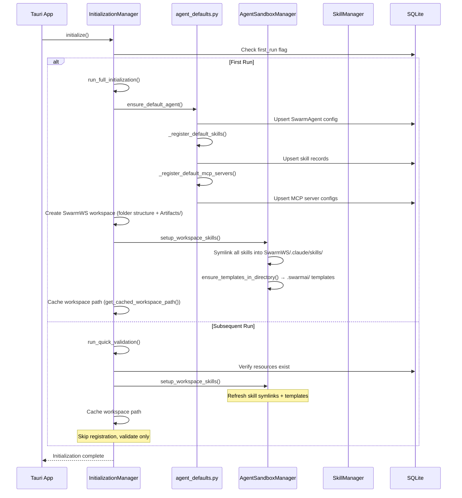
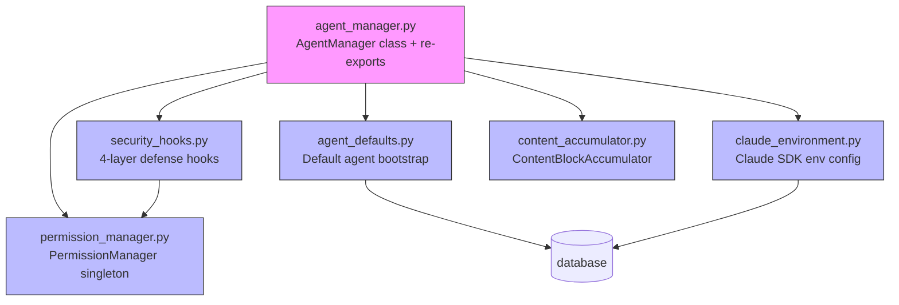
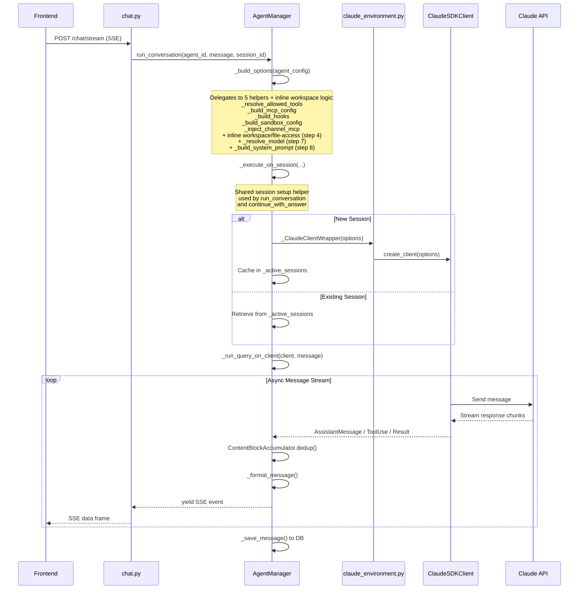
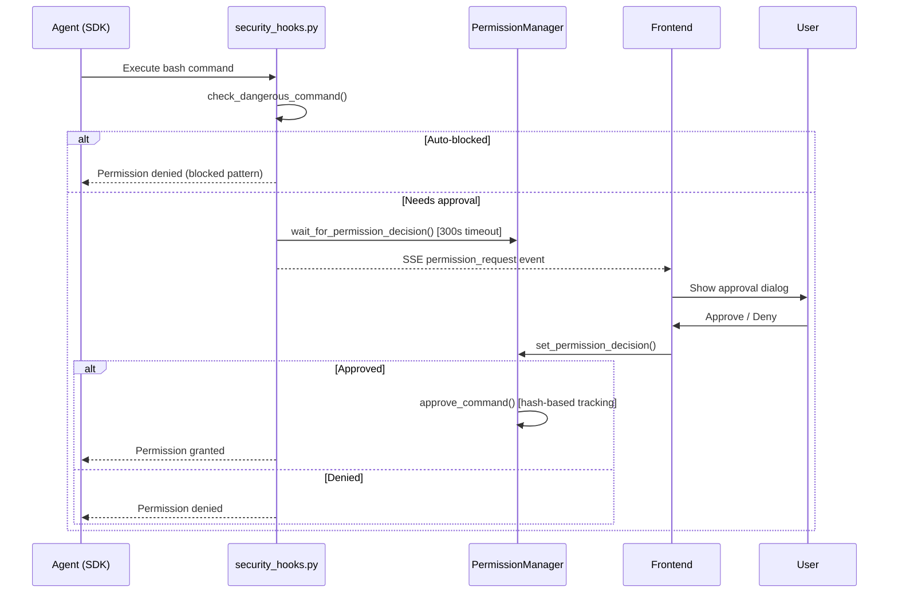

# SwarmAI Agent Architecture — Deep Dive

**Version:** 3.0 (post-unified-workspace refactor)  
**Date:** February 2026  
**Scope:** Agent subsystem implementation analysis based on codebase review

---

## Table of Contents

1. [Executive Summary](#1-executive-summary)
2. [Agent Data Model](#2-agent-data-model)
3. [Agent Lifecycle & Initialization](#3-agent-lifecycle--initialization)
4. [Execution Engine](#4-execution-engine)
5. [Session Management](#5-session-management)
6. [System Prompt Assembly](#6-system-prompt-assembly)
7. [Security Model (4-Layer Defense)](#7-security-model-4-layer-defense)
8. [Skills & MCP Integration](#8-skills--mcp-integration)
9. [Workspace Architecture](#9-workspace-architecture)
10. [Context Management](#10-context-management)
11. [Task System (Background Execution)](#11-task-system-background-execution)
12. [Communication Layer (Chat API & SSE)](#12-communication-layer-chat-api--sse)
13. [LLM Provider Support](#13-llm-provider-support)
14. [Key Design Patterns](#14-key-design-patterns)
15. [File Reference Map](#15-file-reference-map)

---

## 1. Executive Summary

SwarmAI's agent subsystem is built on the Claude Agent SDK (`claude_agent_sdk`), using `ClaudeSDKClient` and `ClaudeAgentOptions` to manage AI agent instances. The backend is a Python FastAPI sidecar running alongside a Tauri 2.0 + React desktop app. Agents are configured via a rich Pydantic data model, executed through a streaming SSE pipeline, and secured by a 4-layer defense model.

The agent core has been decomposed from a single monolithic `agent_manager.py` into focused modules:

- **`agent_manager.py`** — `AgentManager` class (execution engine, session management, response streaming) + backward-compatible re-exports
- **`security_hooks.py`** — 4-layer defense hook factories and dangerous command detection
- **`permission_manager.py`** — `PermissionManager` singleton for command approval and human-in-the-loop decisions
- **`agent_defaults.py`** — Default agent bootstrap, skill/MCP registration
- **`claude_environment.py`** — Claude SDK environment configuration and client wrapper
- **`content_accumulator.py`** — O(1) content block deduplication (pure utility, zero dependencies)

The system supports:

- **Customizable skills** — SKILL.md files with YAML frontmatter, uploaded or AI-generated
- **MCP server integrations** — stdio/sse/http connection types, per-agent binding
- **Unified SwarmWorkspace** — Single shared workspace (`~/.swarm-ai/SwarmWS`) with skill access control via hooks
- **Background task execution** — Persistent tasks that survive frontend disconnects
- **Multi-provider LLM support** — Anthropic API (direct) and AWS Bedrock

```
┌─────────────────────────────────────────────────────────────┐
│                    Tauri 2.0 Desktop App                    │
│  ┌───────────────────────────────────────────────────────┐  │
│  │              React Frontend (TypeScript)               │  │
│  │  AgentsPage ─► agents.ts ─► SSE Stream ─► ChatView   │  │
│  └──────────────────────┬────────────────────────────────┘  │
│                         │ HTTP + SSE                        │
│  ┌──────────────────────▼────────────────────────────────┐  │
│  │            Python FastAPI Sidecar (Backend)            │  │
│  │                                                       │  │
│  │  ┌─────────────┐  ┌──────────────┐  ┌─────────────┐  │  │
│  │  │ AgentManager │  │SessionManager│  │ TaskManager  │  │  │
│  │  │  (execute)   │  │  (sessions)  │  │ (background) │  │  │
│  │  └──────┬───────┘  └──────────────┘  └─────────────┘  │  │
│  │         │                                              │  │
│  │  ┌──────▼───────────────────────────────────────────┐  │  │
│  │  │         Extracted Agent Modules                  │  │  │
│  │  │  security_hooks │ permission_manager             │  │  │
│  │  │  agent_defaults │ claude_environment             │  │  │
│  │  │  content_accumulator                             │  │  │
│  │  └──────────────────────────────────────────────────┘  │  │
│  │                                                       │  │
│  │  ┌──────────────┐  ┌──────────────┐  ┌─────────────┐  │  │
│  │  │ClaudeSDKClient│  │SkillManager  │  │WorkspaceMgr │  │  │
│  │  │  (LLM calls) │  │ (SKILL.md)   │  │ (SwarmWS)   │  │  │
│  │  └──────────────┘  └──────────────┘  └─────────────┘  │  │
│  │                                                       │  │
│  │  ┌──────────────┐  ┌──────────────┐                   │  │
│  │  │SystemPrompt   │  │ContextManager│                   │  │
│  │  │  Builder      │  │  (context)   │                   │  │
│  │  └──────────────┘  └──────────────┘                   │  │
│  └───────────────────────────────────────────────────────┘  │
│                         │                                   │
│              ┌──────────▼──────────┐                        │
│              │   SQLite (data.db)  │                        │
│              └─────────────────────┘                        │
└─────────────────────────────────────────────────────────────┘
```

---

## 2. Agent Data Model

> Source: `backend/schemas/agent.py`

The `AgentConfig` Pydantic model is the canonical representation of an agent. It defines every configurable aspect of agent behavior, from identity to security constraints.

### Core Schema

```python
class AgentConfig(BaseModel):
    # Identity
    id: str                          # Unique identifier (e.g., "default")
    name: str                        # Display name (e.g., "SwarmAgent")
    description: Optional[str]       # Agent purpose description
    model: str                       # LLM model identifier
    status: str                      # "active" | "inactive"

    # Execution Configuration
    permission_mode: str             # "default" | "acceptEdits" | "plan" | "bypassPermissions"
    max_turns: int                   # 1-100, limits conversation depth

    # Tool Toggles
    enable_bash_tool: bool
    enable_file_tools: bool
    enable_web_tools: bool
    enable_tool_logging: bool
    enable_safety_checks: bool

    # Extension Bindings
    skill_ids: List[str]             # Bound skill identifiers
    mcp_ids: List[str]               # Bound MCP server identifiers
    plugin_ids: List[str]            # Plugin bundle identifiers
    allowed_tools: List[str]         # Explicit tool allowlist
    allow_all_skills: bool           # Bypass skill access control

    # Workspace Configuration
    working_directory: Optional[str] # Agent's CWD
    global_user_mode: bool           # Home dir access vs isolated
    enable_file_access_control: bool # Layer 3 security toggle
    allowed_directories: List[str]   # Permitted file paths

    # Security
    enable_human_approval: bool      # Human-in-the-loop for commands
    sandbox_enabled: bool            # Sandbox toggle
    sandbox: SandboxConfig           # Detailed sandbox configuration

    # System Flags
    is_default: bool                 # Protected default agent
    is_system_agent: bool            # System-managed, not user-updatable

    # Timestamps
    created_at: datetime
    updated_at: datetime
```

### Nested Security Model

```python
class SandboxConfig(BaseModel):
    enabled: bool
    auto_allow_bash_if_sandboxed: bool
    excluded_commands: List[str]
    allow_unsandboxed_commands: bool
    network: SandboxNetworkConfig

class SandboxNetworkConfig(BaseModel):
    allow_local_binding: bool
    allow_unix_sockets: bool
    allow_all_unix_sockets: bool
```

### API Boundary Models

Separate Pydantic models enforce clean API boundaries:

| Model | Purpose |
|-------|---------|
| `AgentCreateRequest` | Validated input for agent creation |
| `AgentUpdateRequest` | Partial update with optional fields |
| `AgentResponse` | Serialized output for API responses |

### Frontend ↔ Backend Field Mapping

The backend uses `snake_case` (Python convention), while the frontend uses `camelCase` (TypeScript convention). Conversion functions in `desktop/src/services/agents.ts` handle the translation:

```
Backend (Python)              Frontend (TypeScript)
─────────────────             ─────────────────────
permission_mode          ↔    permissionMode
enable_bash_tool         ↔    enableBashTool
skill_ids                ↔    skillIds
is_system_agent          ↔    isSystemAgent
```

> **Critical**: When adding new agent fields, BOTH `toSnakeCase()` and `toCamelCase()` functions must be updated, or the field will silently be dropped during conversion.


---

## 3. Agent Lifecycle & Initialization

> Sources: `backend/core/agent_defaults.py` (default agent bootstrap), `backend/core/initialization_manager.py`

### Startup Flow

The `InitializationManager` orchestrates a two-phase startup sequence that distinguishes between first-run and subsequent launches to minimize startup latency. Default agent creation and resource registration are handled by `agent_defaults.py`.



### Default Agent (SwarmAgent)

> Source: `backend/core/agent_defaults.py`

The system ships with a protected default agent that cannot be deleted or renamed. All bootstrap logic lives in `agent_defaults.py`:

- **ID**: `DEFAULT_AGENT_ID = "default"` (constant in `agent_defaults.py`)
- **Name**: `SWARM_AGENT_NAME = "SwarmAgent"` (constant in `agent_defaults.py`)
- **Config source**: `desktop/resources/default-agent.json`
- **System prompt template**: `backend/templates/SWARMAI.md`
- **Flags**: `is_default=True`, `is_system_agent=True`

`ensure_default_agent()` is idempotent — it creates the agent on first run and updates it on subsequent runs, preserving user customizations where possible while ensuring system fields remain correct.

Key functions in `agent_defaults.py`:

| Function | Purpose |
|----------|---------|
| `ensure_default_agent()` | Idempotent default agent creation/update |
| `get_default_agent()` | Retrieve default agent config from DB |
| `_register_default_skills()` | Scan and register bundled skills |
| `_register_default_mcp_servers()` | Register bundled MCP server configs |
| `expand_skill_ids_with_plugins()` | Resolve plugin bundles to individual skill IDs |
| `_get_resources_dir()` | Locate bundled resource directory |
| `_get_templates_dir()` | Locate template directory |

### Resource Registration

**Skills**: `_register_default_skills()` (in `agent_defaults.py`) scans `desktop/resources/default-skills/` for SKILL.md files, parses YAML frontmatter, and upserts each skill record to the database. All system skills are auto-bound to SwarmAgent.

**MCP Servers**: `_register_default_mcp_servers()` (in `agent_defaults.py`) reads `desktop/resources/default-mcp-servers.json` and upserts server configurations. All default MCPs are auto-bound to SwarmAgent.

### Error Recovery

Initialization uses `retry_with_backoff()` for resilience against transient failures (e.g., locked database). The `reset_to_defaults()` method provides a factory reset path that re-runs full initialization.

---

## 4. Execution Engine

> Sources: `backend/core/agent_manager.py` (AgentManager class), `backend/core/claude_environment.py`, `backend/core/content_accumulator.py`

The `AgentManager` class is the core execution engine. After refactoring, it delegates to five extracted modules for specific concerns while retaining the execution lifecycle, session management, and response streaming logic. The `_build_options` method delegates to five focused helpers plus inline workspace resolution logic, and `run_conversation`/`continue_with_answer` share a common `_execute_on_session` helper.

### Module Dependency Structure



### Extracted Modules

| Module | Responsibility | Dependencies |
|--------|---------------|--------------|
| `security_hooks.py` (~350 lines) | Hook factories, `DANGEROUS_PATTERNS`, `check_dangerous_command`, 4-layer defense | `permission_manager.py` (injected) |
| `permission_manager.py` (~100 lines) | `PermissionManager` class (singleton), command approval tracking, permission request/response flow | `database` |
| `agent_defaults.py` (~340 lines) | `ensure_default_agent`, skill/MCP registration, `DEFAULT_AGENT_ID`, `SWARM_AGENT_NAME` | `database`, `config`, `agent_sandbox_manager` |
| `claude_environment.py` (~120 lines) | `_configure_claude_environment`, `_ClaudeClientWrapper` context manager | `config`, `database` (via settings router) |
| `content_accumulator.py` (~70 lines) | `ContentBlockAccumulator` with O(1) deduplication | None (pure utility) |

All public symbols are re-exported from `agent_manager.py` for backward compatibility — existing callers require zero import changes.

### Core Execution Flow



### Key Methods

| Method | Purpose |
|--------|---------|
| `run_conversation()` | Main entry point. Thin wrapper that prepares inputs and delegates to `_execute_on_session`. Returns `AsyncIterator[dict]` of SSE events. |
| `_execute_on_session()` | Shared session setup, query execution, and response streaming. Handles client reuse, creation, fallback, caching, error handling, and cleanup. |
| `_build_options()` | Orchestrator that delegates to 5 focused helpers + inline workspace/file-access logic (see below). Assembles `ClaudeAgentOptions` from agent config. |
| `_run_query_on_client()` | Message processing loop. Iterates over SDK async messages, formats them, handles tool use events, permission requests, and result messages. |
| `continue_with_answer()` | Thin wrapper for `AskUserQuestion` responses, delegates to `_execute_on_session`. |
| `continue_with_permission()` | Handles permission approval/denial for dangerous operations. |
| `interrupt_session()` | Stops a running agent mid-execution. |
| `run_skill_creator_conversation()` | Specialized agent instance for AI-assisted skill generation. Uses `SKILL_CREATOR_SYSTEM_PROMPT_TEMPLATE` constant. |

### `_build_options` Decomposition

The `_build_options` method delegates to five focused private helpers, with workspace resolution handled inline:

```python
async def _build_options(
    self,
    agent_config: dict,
    enable_skills: bool,
    enable_mcp: bool,
    resume_session_id: Optional[str] = None,
    session_context: Optional[dict] = None,
    channel_context: Optional[dict] = None,
) -> ClaudeAgentOptions:
```

| Helper | Responsibility |
|--------|---------------|
| `_resolve_allowed_tools()` | Resolves tool allowlist from agent config |
| `_build_mcp_config()` | Assembles MCP server configuration from agent's `mcp_ids` directly |
| `_build_hooks()` | Composes security hooks from `security_hooks.py` with `PermissionManager` singleton |
| `_build_sandbox_config()` | Builds sandbox configuration from agent config |
| `_inject_channel_mcp()` | Injects channel-tools MCP for integrations (e.g., Feishu/Lark) |

Additionally, `_build_options` contains:
- **Inline workspace/file-access logic (step 4)**: Sets `cwd` to the cached SwarmWS path, configures `setting_sources=["project"]`, and resolves `allowed_directories` from agent config. No separate `_resolve_workspace_mode()` helper — this logic is inlined.
- **`_resolve_model` (step 7)**: Model selection and provider resolution.
- **`_build_system_prompt` (step 8)**: System prompt assembly via `SystemPromptBuilder`.

### Client Lifecycle

> Source: `backend/core/claude_environment.py` (`_ClaudeClientWrapper`), `backend/core/agent_manager.py` (session cache)

```
┌──────────────────────────────────────────────────────────┐
│                   _active_sessions dict                   │
│                                                          │
│  session_id_1 ──► _ClaudeClientWrapper(client, ttl=12h) │
│  session_id_2 ──► _ClaudeClientWrapper(client, ttl=12h) │
│  session_id_3 ──► _ClaudeClientWrapper(client, ttl=12h) │
│                                                          │
│  Background: _cleanup_stale_sessions_loop()              │
│  - Runs periodically                                     │
│  - Evicts sessions older than 12 hours                   │
│  - Calls _cleanup_session() for each stale entry         │
└──────────────────────────────────────────────────────────┘
```

- `ClaudeSDKClient` instances are cached in `_active_sessions` (keyed by `session_id`)
- **12-hour TTL** with background cleanup loop (`_cleanup_stale_sessions_loop()`)
- `_ClaudeClientWrapper` (defined in `claude_environment.py`) is a context manager that handles `anyio` cleanup errors gracefully
- `_configure_claude_environment()` (in `claude_environment.py`) handles API key resolution, Bedrock configuration, and model selection
- `_cleanup_session()` disconnects the client and removes it from cache

### Message Processing Pipeline

> Source: `backend/core/content_accumulator.py`

The SDK sends **cumulative content blocks** — each message contains all previous blocks plus new ones. The `ContentBlockAccumulator` (extracted to `content_accumulator.py`) provides O(1) deduplication:

```
SDK Message Stream:          After Accumulator:
─────────────────           ──────────────────
[block_A]                   → emit block_A
[block_A, block_B]          → emit block_B (A already seen)
[block_A, block_B, block_C] → emit block_C (A, B already seen)
```

Implementation uses hash-based tracking via a `set` for O(1) lookup of previously seen blocks.

### Multimodal Support

`run_conversation()` accepts optional multimodal content alongside text messages:
- **Text** — Standard string messages
- **Images** — Base64-encoded image data
- **Documents** — File attachments for context injection


---

## 5. Session Management

> Source: `backend/core/session_manager.py`

Sessions represent a continuous conversation between a user and an agent. They are the unit of state for the execution engine.

### SessionInfo Dataclass

```python
@dataclass
class SessionInfo:
    session_id: str          # Unique session identifier
    agent_id: str            # Bound agent
    title: str               # Display title (auto-generated or user-set)
    work_dir: str            # Working directory for this session (SwarmWS path)
```

### Storage Architecture

Sessions use a **dual-layer storage** model for performance:

```
┌─────────────────────────┐
│    In-Memory Cache       │  ◄── Fast lookups (hot path)
│  dict[session_id, info]  │
└────────────┬────────────┘
             │ sync
┌────────────▼────────────┐
│    SQLite (data.db)      │  ◄── Persistence (cold path)
│  sessions table          │
│  messages table (7d TTL) │
└─────────────────────────┘
```

### Key Behaviors

- **Session creation**: On first message, `get_or_create_session()` creates a new session record and caches it
- **Session reuse**: Subsequent messages to the same `session_id` reuse the cached session
- **Message persistence**: Messages stored with a **7-day TTL** — older messages are automatically pruned
- **Message saving**: `_save_message()` in AgentManager persists each message to the DB after processing

---

## 6. System Prompt Assembly

> Source: `backend/core/system_prompt.py`

The `SystemPromptBuilder` constructs a multi-section system prompt that provides the agent with identity, context, and behavioral constraints. The prompt is assembled fresh for each `_build_options()` call.

### Assembly Order

```
┌─────────────────────────────────────────────────┐
│              Final System Prompt                 │
│                                                  │
│  1. Identity ──────── Agent name + description   │
│  2. Safety ────────── Safety principles          │
│  3. Workspace ─────── Working directory info     │
│  4. Selected Dirs ─── Additional allowed dirs    │
│  5. User Identity ─── User context               │
│  6. DateTime ──────── Current date/time          │
│  7. Extra Prompt ──── Agent's custom prompt      │
│  8. Project Context ── .swarmai/ directory files │
│  9. Runtime ───────── Platform info (OS, Python) │
│                                                  │
└─────────────────────────────────────────────────┘
```

### Section Details

| Section | Source | Notes |
|---------|--------|-------|
| Identity | Agent `name` + `description` fields | Overrides SDK default identity |
| Safety | Hardcoded safety principles | No self-preservation, no deception, etc. |
| Workspace | `working_directory` from agent config | Tells agent where it's operating |
| Selected Dirs | `allowed_directories` list | Additional paths the agent can access |
| User Identity | User context from session | Who the agent is talking to |
| DateTime | `datetime.now()` | Temporal awareness for the agent |
| Extra Prompt | Agent's `system_prompt` field | User-customizable per-agent instructions |
| Project Context | `.swarmai/` directory files | IDENTITY.md, SOUL.md, BOOTSTRAP.md |
| Runtime | `platform` module | OS, Python version, architecture |

### Project Context Files

The `.swarmai/` directory in each workspace can contain:

- **IDENTITY.md** — Agent persona and role definition
- **SOUL.md** — Core behavioral principles
- **BOOTSTRAP.md** — Initial context and instructions

Each file is read and injected into the prompt with a **20,000 character truncation limit** to prevent prompt overflow.

### Template Files

Located in `backend/templates/`:

| Template | Purpose |
|----------|---------|
| `SWARMAI.md` | Default system prompt template for SwarmAgent |
| `AGENTS.md` | Multi-agent coordination instructions |
| `BOOTSTRAP.md` | Bootstrap template for new workspaces |
| `HEARTBEAT.md` | Heartbeat/health check prompt |
| `IDENTITY.md` | Identity template |
| `SOUL.md` | Behavioral principles template |
| `USER.md` | User context template |

---

## 7. Security Model (4-Layer Defense)

> Sources: `backend/core/security_hooks.py` (hook factories, dangerous patterns), `backend/core/permission_manager.py` (permission state), `backend/core/agent_sandbox_manager.py` (workspace isolation)

SwarmAI implements defense-in-depth with four distinct security layers, each operating at a different level of the execution stack. After refactoring, security hooks and permission state are in dedicated modules rather than embedded in `agent_manager.py`.

```
┌─────────────────────────────────────────────────────────────┐
│                    Agent Execution Request                   │
│                                                             │
│  ┌───────────────────────────────────────────────────────┐  │
│  │ Layer 4: Bash Command Protection                      │  │
│  │ security_hooks.dangerous_command_blocker()             │  │
│  │ + security_hooks.create_human_approval_hook()          │  │
│  │ Blocks: rm -rf, format, etc. | Asks: other risky cmds │  │
│  ├───────────────────────────────────────────────────────┤  │
│  │ Layer 3: File Access Control                          │  │
│  │ security_hooks.create_file_access_permission_handler() │  │
│  │ Validates file paths against allowed_directories      │  │
│  ├───────────────────────────────────────────────────────┤  │
│  │ Layer 2: Skill Access Control                         │  │
│  │ security_hooks.create_skill_access_checker()          │  │
│  │ PreToolUse hook — validates mcp__skills__{name}       │  │
│  ├───────────────────────────────────────────────────────┤  │
│  │ Layer 1: Workspace Isolation                          │  │
│  │ Unified SwarmWS: ~/.swarm-ai/SwarmWS/                 │  │
│  │ Shared skill symlinks in .claude/skills/              │  │
│  └───────────────────────────────────────────────────────┘  │
│                                                             │
│                    ✓ Execution Proceeds                     │
└─────────────────────────────────────────────────────────────┘
```

### Layer 1: Workspace Isolation

> Source: `backend/core/agent_sandbox_manager.py`

All agents operate within a single unified SwarmWorkspace at `~/.swarm-ai/SwarmWS/`. The `setting_sources` is always `["project"]` regardless of agent configuration.

| Aspect | Value |
|--------|-------|
| **Working Directory** | `~/.swarm-ai/SwarmWS/` (cached at init via `get_cached_workspace_path()`) |
| **Skill Access** | Shared symlinks in `SwarmWS/.claude/skills/` — all registered skills available to all agents |
| **Skill Access Control** | Enforced at Layer 2 (PreToolUse hook), not via filesystem isolation |
| **Templates** | `.swarmai/` directory with IDENTITY.md, SOUL.md, BOOTSTRAP.md |

Skill access is no longer enforced via per-agent symlink directories. Instead, all skill symlinks are shared in `SwarmWS/.claude/skills/`, and Layer 2 (Skill Access Control hook) restricts which skills each agent can actually invoke based on the agent's `skill_ids` configuration.

### Layer 2: Skill Access Control

> Source: `backend/core/security_hooks.py` → `create_skill_access_checker()`

A `PreToolUse` hook that intercepts every tool invocation before execution:

```python
# Pseudocode
def skill_access_checker(tool_name: str, agent_config: AgentConfig) -> bool:
    if agent_config.allow_all_skills:
        return True
    # Tool names follow pattern: mcp__skills__{skill_name}
    if tool_name.startswith("mcp__skills__"):
        skill_name = extract_skill_name(tool_name)
        return skill_name in allowed_skill_names
    return True  # Non-skill tools pass through
```

### Layer 3: File Access Control

> Source: `backend/core/security_hooks.py` → `create_file_access_permission_handler()`

A `can_use_tool` callback on `ClaudeAgentOptions` that validates file paths in tool arguments:

- **Controlled tools**: Read, Write, Edit, Glob, Grep, Bash (file-related)
- **Validation**: Extracts file paths from tool arguments, checks against `allowed_directories`
- **Behavior**: Returns permission denied for out-of-bounds access attempts

### Layer 4: Bash Command Protection

> Source: `backend/core/security_hooks.py` (hook factories), `backend/core/permission_manager.py` (approval state)

Two complementary mechanisms:

**Auto-blocking** (`dangerous_command_blocker()` in `security_hooks.py`):
- `check_dangerous_command()` matches against destructive patterns (`rm -rf`, `format`, `mkfs`, etc.) defined in `DANGEROUS_PATTERNS`
- Blocked commands are rejected immediately without user interaction

**Human approval** (`create_human_approval_hook()` in `security_hooks.py`):
- Commands that aren't auto-blocked but are potentially risky trigger an approval flow
- Accepts `PermissionManager` methods as injected dependencies (not module-level globals)
- Uses `AskUserQuestion`-style interaction pattern

### Permission Flow

> Source: `backend/core/permission_manager.py` (`PermissionManager` singleton)



The `PermissionManager` class encapsulates all mutable permission state:

| State | Purpose |
|-------|---------|
| `_approved_commands` | Session ID → set of approved command hashes |
| `_permission_events` | Request ID → `asyncio.Event` for signaling decisions |
| `_permission_results` | Request ID → decision string ("approve" or "deny") |
| `_permission_request_queue` | `asyncio.Queue` for permission requests |

A module-level singleton (`permission_manager = PermissionManager()`) ensures exactly one instance exists. Per-session command approval tracking uses **hash-based matching** — once a command is approved, the same command won't trigger re-approval within the same session.


---

## 8. Skills & MCP Integration

> Sources: `backend/core/skill_manager.py`, `backend/routers/skills.py`, `backend/routers/mcp.py`

### Skills System

Skills are the primary extensibility mechanism in SwarmAI. Each skill is a `SKILL.md` file with YAML frontmatter that defines metadata and a markdown body that provides instructions to the agent.

```yaml
# Example SKILL.md structure
---
name: code-review
description: Performs thorough code reviews
version: 1.0.0
source: user          # system | user | plugin | marketplace | local
instructions: |
  Review code for bugs, security issues, and style violations.
---

# Code Review Skill

When reviewing code, follow these steps:
1. Check for security vulnerabilities
2. Verify error handling
3. Assess code style and readability
...
```

### Skill Sources

| Source | Location | Management |
|--------|----------|------------|
| `system` | `desktop/resources/default-skills/` | Auto-registered on startup |
| `user` | User-created via UI or API | Manual CRUD |
| `plugin` | Plugin bundles | Installed via plugin system |
| `marketplace` | Remote skill registry | Downloaded and cached |
| `local` | Arbitrary filesystem path | Referenced by path |

### Skill Lifecycle

```
┌──────────┐    ┌──────────┐    ┌──────────┐    ┌──────────┐
│  Create   │───►│  Draft   │───►│ Publish  │───►│  Bound   │
│ (upload/  │    │ (edit/   │    │ (version │    │ (agent   │
│  generate)│    │  refine) │    │  frozen) │    │  config) │
└──────────┘    └──────────┘    └──────────┘    └──────────┘
```

- **Upload**: ZIP archive containing SKILL.md + optional resources
- **AI Generation**: Specialized agent via `run_skill_creator_conversation()` creates skills interactively
- **Version Control**: Draft/publish workflow with version tracking
- **Binding**: Skills are bound to agents via `skill_ids` in agent config
- **Plugin Resolution**: `expand_skill_ids_with_plugins()` resolves plugin bundles to individual skill IDs

### MCP Server Integration

MCP (Model Context Protocol) servers extend agent capabilities with external tool access.

**Configuration Model**:

```python
# MCP Server Config (stored in DB)
{
    "name": "my-server",           # Used as key (not UUID) — shorter tool names
    "connection_type": "stdio",    # stdio | sse | http
    "command": "npx",              # For stdio
    "args": ["-y", "my-mcp-server"],
    "env": {},                     # Environment variables
    "enabled": True
}
```

**Key Design Decision**: Server names (not UUIDs) are used as keys for tool name generation. This produces shorter tool names like `mcp__my-server__tool_name` instead of `mcp__550e8400-e29b-41d4-a716-446655440000__tool_name`, which is critical for staying within Bedrock's **64-character tool name limit**.

**Per-Agent Binding**: MCP servers are bound to agents via `mcp_ids` in agent config. No workspace-level filtering is applied — the agent's `mcp_ids` list directly determines which MCP servers are active for that agent.

**Special Integration**: Channel-tools MCP is injected automatically for Feishu (Lark) integration when configured.

---

## 9. Workspace Architecture

> Sources: `backend/core/agent_sandbox_manager.py`, `backend/core/initialization_manager.py`, `backend/core/swarm_workspace_manager.py`

### Unified SwarmWorkspace Model

All agents share a single SwarmWorkspace at `~/.swarm-ai/SwarmWS/`. Per-agent workspace isolation has been removed in favor of a unified workspace with hook-based access control.

### Directory Structure

```
~/.swarm-ai/
├── data.db                              # SQLite database (canonical store)
├── logs/                                # Application logs
└── SwarmWS/                             # Single unified workspace (all agents)
    ├── Artifacts/                       # Filesystem content (hybrid storage)
    │   ├── Plans/
    │   ├── Reports/
    │   ├── Docs/
    │   └── Decisions/
    ├── ContextFiles/                    # Context injection files
    │   ├── context.md
    │   └── compressed-context.md
    ├── Transcripts/                     # Session transcripts
    ├── .claude/
    │   └── skills/                      # ALL skill symlinks (shared across agents)
    │       ├── code-review -> /abs/path/to/code-review
    │       └── web-search -> /abs/path/to/web-search
    └── .swarmai/                        # Template files (set up at init)
        ├── IDENTITY.md
        ├── SOUL.md
        └── BOOTSTRAP.md
```

### Workspace Configuration

```python
DEFAULT_WORKSPACE_CONFIG = {
    "name": "SwarmWS",
    "file_path": "{app_data_dir}/SwarmWS",
    ...
}
```

The workspace path is flattened — `~/.swarm-ai/SwarmWS` directly, not nested under `swarm-workspaces/`.

### Workspace Setup (Init-Time)

Workspace setup happens during `InitializationManager.run_full_initialization()`:

1. **Folder structure creation** — `SwarmWS/`, `Artifacts/` subdirs, `ContextFiles/`, `Transcripts/`
2. **Skill symlink setup** — `AgentSandboxManager.setup_workspace_skills()` creates symlinks in `SwarmWS/.claude/skills/` for all registered skills
3. **Template propagation** — `ensure_templates_in_directory()` copies `IDENTITY.md`, `SOUL.md`, `BOOTSTRAP.md` from `backend/templates/` into `SwarmWS/.swarmai/`
4. **Path caching** — `get_cached_workspace_path()` stores the resolved path for use during sessions

On subsequent runs, `run_quick_validation()` still calls `setup_workspace_skills()` to refresh symlinks and templates.

### Key Operations

| Method | Purpose |
|--------|---------|
| `setup_workspace_skills()` | Creates/refreshes skill symlinks in `SwarmWS/.claude/skills/` for all registered skills. Called at app init and on skill CRUD events. |
| `get_allowed_skill_names()` | Returns the set of skill names accessible to a specific agent (for Layer 2 security hook). |
| `get_all_skill_names()` | Discovers all available skills across all source locations. |
| `ensure_templates_in_directory()` | Copies template files into `.swarmai/` directory. |
| `_copy_templates()` | Internal helper for template file copying. |
| `get_skill_name_by_id()` | Resolves a skill ID to its display name. |

### Skill Source Resolution

Skills are resolved in priority order when creating symlinks:

```
1. skill.local_path (from DB)           ◄── Highest priority: exact path
   │
   ▼ (if not found)
2. ~/.claude/skills/{skill_name}        ◄── Plugin-installed skills
   │
   ▼ (if not found)
3. SwarmWS/.claude/skills/{skill_name}  ◄── Already-symlinked skills
```

### Session-Time Workspace Access

During chat sessions, `_build_options()` uses the cached workspace path:
- `cwd` is set to the SwarmWS path (from `get_cached_workspace_path()`)
- `setting_sources` is always `["project"]`
- `add_dirs` is not passed from the frontend — the workspace path is the sole working directory
- The `workspace_id` parameter has been removed from chat/session APIs

### InitializationManager Integration

| Method | Purpose |
|--------|---------|
| `run_full_initialization()` | Full startup: default agent, skills, MCPs, workspace setup, path caching |
| `run_quick_validation()` | Fast startup: validate resources, refresh skill symlinks, cache path |
| `get_cached_workspace_path()` | Returns the cached SwarmWS path for use in sessions |
| `reset_to_defaults()` | Factory reset: re-runs full initialization |

### Future Vision

The `TODO-SwarmWS-refactor.md` document describes planned evolution of the workspace model:

- **Projects** — Named project containers within SwarmWS for multi-project support
- **Operating Loop sections** — Structured areas (Plans/, Reports/, Decisions/) for agent workflow artifacts
- **Context layering** — L0 (workspace-level) and L1 (project-level) context injection for hierarchical knowledge management


---

## 10. Context Management

> Source: `backend/core/context_manager.py`

The Context Manager handles workspace context injection into the system prompt, providing agents with persistent knowledge about their operating environment.

### Context Files

Each SwarmWorkspace maintains two context files:

| File | Purpose | Update Frequency |
|------|---------|-----------------|
| `context.md` | Full workspace context | Updated on workspace changes |
| `compressed-context.md` | Token-efficient summary | Regenerated when stale (>24h) |

### Token Budget Management

```
┌─────────────────────────────────────────┐
│         Context Injection Flow          │
│                                         │
│  context.md ──► estimate_tokens()       │
│                      │                  │
│              ┌───────▼────────┐         │
│              │ Within budget? │         │
│              │ (10K tokens)   │         │
│              └───┬────────┬───┘         │
│                  │        │             │
│              Yes ▼     No ▼             │
│           Use full   Check compressed   │
│           context    ──► Stale? (>24h)  │
│                          │       │      │
│                       Yes ▼   No ▼      │
│                    Regenerate  Use       │
│                    compressed  cached    │
│                          │       │      │
│                          ▼       ▼      │
│              truncate_to_token_budget()  │
│                          │              │
│                          ▼              │
│              Append to system prompt    │
└─────────────────────────────────────────┘
```

### Key Functions

| Function | Purpose |
|----------|---------|
| `inject_context()` | Reads context files and appends to system prompt |
| `compress_context()` | Creates compressed version for token efficiency |
| `estimate_tokens()` | Simple word-count-based estimation (1 token ≈ 0.75 words) |
| `truncate_to_token_budget()` | Hard truncation to fit within budget |
| `_build_capabilities_summary()` | Summarizes workspace capabilities (skills, MCPs, knowledgebases) |

### Configuration

- **Default token budget**: 4,000 tokens
- **Staleness threshold**: 24 hours
- **Estimation method**: Word count × 1.33 (inverse of 0.75 words/token)

---

## 11. Task System (Background Execution)

> Source: `backend/core/task_manager.py`

The Task System enables long-running agent operations that persist across frontend disconnects. Tasks are the mechanism for background execution — they run as `asyncio` tasks and communicate with subscribers via event queues.

### Task State Machine

```
                    ┌──────────┐
                    │  draft   │
                    └────┬─────┘
                         │ start
                    ┌────▼─────┐
                    │   wip    │ (work in progress)
                    └────┬─────┘
                         │
              ┌──────────┼──────────┐
              │          │          │
         ┌────▼───┐ ┌───▼────┐ ┌──▼───────┐
         │completed│ │blocked │ │cancelled │
         └────────┘ └────────┘ └──────────┘
```

**Legacy status mapping** (for backward compatibility):
- `pending` → `draft`
- `running` → `wip`
- `failed` → `blocked`

### Event System

Tasks emit events to SSE subscribers using a fan-out pattern:

```
┌──────────────┐
│  Running     │     Events (up to 100 buffered)
│  asyncio     │─────────────────────────────────┐
│  Task        │                                  │
└──────────────┘                                  │
                                                  ▼
                              ┌─────────────────────────────┐
                              │    _subscribers[task_id]     │
                              │                             │
                              │  ┌─────────────────────┐   │
                              │  │ asyncio.Queue (SSE1) │   │
                              │  └─────────────────────┘   │
                              │  ┌─────────────────────┐   │
                              │  │ asyncio.Queue (SSE2) │   │
                              │  └─────────────────────┘   │
                              │  ┌─────────────────────┐   │
                              │  │ asyncio.Queue (SSE3) │   │
                              │  └─────────────────────┘   │
                              └─────────────────────────────┘
```

### Key Behaviors

- **Event buffering**: Up to 100 events per task, 5-minute retention after completion
- **Multiple subscribers**: Multiple SSE clients can subscribe to the same task's events
- **Message queues**: Running tasks accept messages (e.g., `AskUserQuestion` responses) via per-task message queues
- **Workspace association**: Tasks belong to workspaces and cascade-delete with agents
- **Tracking**: `_running_tasks` dict maps `task_id` to `asyncio.Task` instances for lifecycle management

---

## 12. Communication Layer (Chat API & SSE)

> Source: `backend/routers/chat.py`

The Chat API is the primary interface between the frontend and the agent execution engine. It uses Server-Sent Events (SSE) for real-time streaming of agent responses.

### API Endpoints

| Endpoint | Method | Purpose |
|----------|--------|---------|
| `/chat/stream` | POST | SSE streaming chat (main entry point) |
| `/chat/answer-question` | POST | Continue after `AskUserQuestion` tool |
| `/chat/permission-response` | POST | Submit permission decision (approve/deny) |
| `/chat/permission-continue` | POST | Continue execution after permission granted |
| `/chat/stop/{session_id}` | POST | Interrupt a running agent |

### SSE Protocol

```
Client                          Server
  │                               │
  │  POST /chat/stream            │
  │  {agent_id, message, ...}     │
  │──────────────────────────────►│
  │                               │
  │  event: assistant             │
  │  data: {"type":"text",...}    │
  │◄──────────────────────────────│
  │                               │
  │  event: assistant             │
  │  data: {"type":"tool_use",...}│
  │◄──────────────────────────────│
  │                               │
  │  event: heartbeat             │  ◄── Every 15 seconds
  │  data: {"type":"heartbeat"}   │
  │◄──────────────────────────────│
  │                               │
  │  event: result                │
  │  data: {"session_id":...}     │
  │◄──────────────────────────────│
  │                               │
```

### Event Types

| Event | Purpose |
|-------|---------|
| `assistant` | Agent text output or tool use invocation |
| `result` | Session metadata (session_id, title, etc.) |
| `error` | Error information |
| `heartbeat` | Keep-alive signal (every 15 seconds) |
| `permission_request` | Dangerous command needs approval |

### Heartbeat Mechanism

SSE connections are kept alive with a **15-second heartbeat interval**. This prevents proxy timeouts and allows the frontend to detect stale connections. The heartbeat is a lightweight JSON payload that the frontend acknowledges silently.

---

## 13. LLM Provider Support

> Source: `backend/config.py`

SwarmAI supports two LLM providers through a unified configuration layer.

### Provider Architecture

```
┌─────────────────────────────────────────┐
│           AgentManager                   │
│                                         │
│  model = "claude-sonnet-4-5-20250929"   │
│                │                        │
│         ┌──────▼──────┐                 │
│         │ Provider?   │                 │
│         └──┬───────┬──┘                 │
│            │       │                    │
│    ┌───────▼──┐ ┌──▼──────────┐        │
│    │Anthropic │ │AWS Bedrock  │        │
│    │ (Direct) │ │             │        │
│    │          │ │ Model Map:  │        │
│    │ Bearer   │ │ claude-*  → │        │
│    │ Token    │ │ bedrock ARN │        │
│    │ Auth     │ │             │        │
│    │          │ │ AK/SK Auth  │        │
│    └──────────┘ └─────────────┘        │
└─────────────────────────────────────────┘
```

### Configuration

| Setting | Default | Description |
|---------|---------|-------------|
| Default model | `claude-sonnet-4-5-20250929` | Anthropic model identifier |
| Auth (Anthropic) | Bearer token | `ANTHROPIC_API_KEY` env var |
| Auth (Bedrock) | AK/SK | AWS credentials |
| Model mapping | `ANTHROPIC_TO_BEDROCK_MODEL_MAP` | Converts Anthropic names to Bedrock ARNs |

### Model Resolution

`get_bedrock_model_id()` converts Anthropic model identifiers to Bedrock ARNs:

```
Input:  "claude-sonnet-4-5-20250929"
Output: "arn:aws:bedrock:us-east-1::foundation-model/anthropic.claude-sonnet-4-5-20250929-v1:0"
```

### Environment Configuration

Settings are managed via Pydantic `BaseSettings`, which reads from environment variables with optional `.env` file support. This allows deployment-time configuration without code changes.

---

## 14. Key Design Patterns

### Pattern: Long-Lived Client Reuse

**Problem**: Creating a new `ClaudeSDKClient` for every message is expensive (connection setup, MCP server initialization).

**Solution**: Cache client instances in `_active_sessions` dict, keyed by `session_id`, with a 12-hour TTL. The `_ClaudeClientWrapper` (defined in `claude_environment.py`) handles `anyio` cleanup errors gracefully.

```python
# Simplified flow (AgentManager._execute_on_session)
async def _execute_on_session(self, session_id, ...):
    if session_id in self._active_sessions:
        client = self._active_sessions[session_id].client  # Reuse
    else:
        client = await self._create_client(options)         # Create via _ClaudeClientWrapper
        self._active_sessions[session_id] = client

    # Background cleanup evicts sessions older than 12 hours
```

**Trade-off**: Memory usage grows with active sessions, but the 12-hour TTL and background cleanup loop bound the growth.

---

### Pattern: Cumulative Message Deduplication

**Problem**: The Claude Agent SDK sends cumulative content blocks — each message contains ALL previous blocks plus new ones. Naively forwarding these to the frontend would result in massive duplication.

**Solution**: `ContentBlockAccumulator` (in `content_accumulator.py`) uses hash-based dedup with O(1) lookup. Zero external dependencies — pure utility class.

```python
class ContentBlockAccumulator:
    def __init__(self):
        self._seen_hashes: set = set()

    def process(self, blocks: list) -> list:
        new_blocks = []
        for block in blocks:
            h = hash(block)
            if h not in self._seen_hashes:
                self._seen_hashes.add(h)
                new_blocks.append(block)
        return new_blocks
```

**Result**: Only genuinely new content is streamed to the frontend, regardless of SDK message format.

---

### Pattern: Permission Request Queue

**Problem**: Dangerous bash commands need human approval, but the agent execution is async and streaming.

**Solution**: Async permission flow with 300-second timeout, managed by `PermissionManager` singleton in `permission_manager.py`.

```
Agent wants to run: rm -rf /tmp/old-data

1. security_hooks.dangerous_command_blocker() → not auto-blocked (not rm -rf /)
2. security_hooks.create_human_approval_hook() → triggers permission flow
3. permission_manager.wait_for_permission_decision() → blocks coroutine (300s timeout)
4. Frontend shows approval dialog
5. User clicks "Approve"
6. POST /chat/permission-response → permission_manager.set_permission_decision()
7. Coroutine resumes → command executes
8. permission_manager.approve_command() → hash stored for session (won't re-ask)
```

**Key detail**: `PermissionManager` tracks per-session command approvals using hash-based matching. Once a specific command is approved, the exact same command won't trigger re-approval within the same session.

---

### Pattern: Unified Workspace with Cached Path

**Problem**: Per-agent workspace directories created unnecessary filesystem overhead and complexity. Skill symlinks had to be maintained per-agent, and workspace mode resolution added branching logic.

**Solution**: A single SwarmWorkspace (`~/.swarm-ai/SwarmWS/`) shared by all agents. The workspace path is resolved once at init time and cached via `InitializationManager.get_cached_workspace_path()`. All agents use the same `cwd`, and `setting_sources` is always `["project"]`.

```
Init Time:
  ✓ Create SwarmWS folder structure
  ✓ setup_workspace_skills() → symlink ALL skills into SwarmWS/.claude/skills/
  ✓ ensure_templates_in_directory() → copy templates to .swarmai/
  ✓ Cache resolved path

Session Time:
  ✓ Read cached path → set as cwd
  ✓ setting_sources = ["project"]
  ✗ No workspace mode resolution
  ✗ No per-agent directory creation
```

**Trade-off**: Agents can no longer have filesystem-isolated skill directories. Skill access control is enforced entirely via the Layer 2 PreToolUse hook, which validates `skill_ids` at runtime.

---

### Pattern: Init-Time Setup, Session-Time Read

**Problem**: Workspace setup (folder creation, symlink management, template copying) is relatively expensive. Doing it per-session or per-agent-execution wastes time.

**Solution**: Heavy setup happens once during `InitializationManager.run_full_initialization()` (first run) or `run_quick_validation()` (subsequent runs). Session-time code only reads the cached workspace path — no filesystem mutations.

```
Initialization (heavy, once):
  ✓ Folder structure creation
  ✓ Skill symlink setup (setup_workspace_skills)
  ✓ Template propagation
  ✓ Path caching

Session execution (lightweight, every chat):
  ✓ get_cached_workspace_path() → cwd
  ✓ Build options with cached values
  ✗ No filesystem writes
  ✗ No symlink management
```

**Refresh trigger**: Skill CRUD events (create/update/delete) call `setup_workspace_skills()` to refresh symlinks outside of the init flow.

---

### Pattern: Two-Phase Initialization

**Problem**: Full initialization (registering defaults, creating workspaces) is slow. Running it on every startup wastes time.

**Solution**: Distinguish first-run from subsequent launches. Default agent bootstrap logic lives in `agent_defaults.py`.

```
First Run:
  ✓ Create database schema
  ✓ agent_defaults._register_default_skills()
  ✓ agent_defaults._register_default_mcp_servers()
  ✓ agent_defaults.ensure_default_agent() (SwarmAgent)
  ✓ Create SwarmWS workspace (folder structure)
  ✓ setup_workspace_skills() (skill symlinks + templates)
  ✓ Cache workspace path
  ✓ Set first_run = false

Subsequent Runs:
  ✓ Validate resources exist
  ✓ Update SwarmAgent if template changed
  ✓ setup_workspace_skills() (refresh symlinks + templates)
  ✓ Cache workspace path
  ✗ Skip skill/MCP registration
  ✗ Skip workspace creation
```

**Result**: Normal startup is significantly faster, while first-run still performs complete initialization.

---

## 15. File Reference Map

### Core Agent Modules (post-refactoring)

| File | Purpose | Approx. Lines |
|------|---------|---------------|
| `backend/core/agent_manager.py` | `AgentManager` class (execution engine, session management, response streaming) + backward-compatible re-exports | ~1,840 |
| `backend/core/security_hooks.py` | 4-layer defense hooks: `DANGEROUS_PATTERNS`, `check_dangerous_command`, `dangerous_command_blocker`, `create_human_approval_hook`, `create_file_access_permission_handler`, `create_skill_access_checker`, `pre_tool_logger` | ~350 |
| `backend/core/permission_manager.py` | `PermissionManager` class (singleton): command approval tracking, permission request/response flow | ~100 |
| `backend/core/agent_defaults.py` | Default agent bootstrap: `ensure_default_agent`, `get_default_agent`, `_register_default_skills`, `_register_default_mcp_servers`, `expand_skill_ids_with_plugins`, `DEFAULT_AGENT_ID`, `SWARM_AGENT_NAME` | ~340 |
| `backend/core/claude_environment.py` | Claude SDK env config: `_configure_claude_environment`, `_ClaudeClientWrapper` | ~120 |
| `backend/core/content_accumulator.py` | `ContentBlockAccumulator` with O(1) deduplication (zero external dependencies) | ~70 |

### Other Backend Modules

| File | Purpose | Approx. Lines |
|------|---------|---------------|
| `backend/schemas/agent.py` | Pydantic data models (AgentConfig, Request/Response) | ~200 |
| `backend/routers/agents.py` | Agent CRUD REST API | ~150 |
| `backend/routers/chat.py` | Chat SSE streaming API | ~200 |
| `backend/core/session_manager.py` | Session storage and management | ~150 |
| `backend/core/agent_sandbox_manager.py` | Workspace skill symlink management, template propagation, `setup_workspace_skills()` | ~300 |
| `backend/core/system_prompt.py` | System prompt assembly | ~150 |
| `backend/core/context_manager.py` | Workspace context injection | ~300 |
| `backend/core/skill_manager.py` | Skill storage and sync | ~400 |
| `backend/routers/skills.py` | Skill CRUD API | ~200 |
| `backend/routers/mcp.py` | MCP server CRUD API | ~200 |
| `backend/core/task_manager.py` | Background task execution | ~300 |
| `backend/core/initialization_manager.py` | Startup flow, workspace setup, `get_cached_workspace_path()`, default registration | ~300 |
| `backend/config.py` | Settings, LLM provider config, model mapping | ~200 |
| `backend/templates/SWARMAI.md` | Default system prompt template | ~100 |

### Frontend Modules

| File | Purpose | Approx. Lines |
|------|---------|---------------|
| `desktop/src/types/index.ts` | TypeScript type definitions (Agent interface) | ~500 |
| `desktop/src/services/agents.ts` | Frontend agent service (toSnakeCase/toCamelCase) | ~200 |

### Backward Compatibility Re-exports

`agent_manager.py` re-exports all public symbols from extracted modules so existing callers require zero import changes:

```python
# From agent_defaults.py
DEFAULT_AGENT_ID, SWARM_AGENT_NAME, ensure_default_agent, get_default_agent, expand_skill_ids_with_plugins

# From permission_manager.py (via singleton)
approve_command, is_command_approved, set_permission_decision, wait_for_permission_decision, _permission_request_queue

# From security_hooks.py
DANGEROUS_PATTERNS, check_dangerous_command, pre_tool_logger, dangerous_command_blocker,
create_human_approval_hook, create_file_access_permission_handler, create_skill_access_checker

# From claude_environment.py
_ClaudeClientWrapper, _configure_claude_environment

# From content_accumulator.py
ContentBlockAccumulator
```

---

*This document reflects the actual codebase implementation after the agent-code-refactoring decomposition and the unified-swarm-workspace-cwd refactor. The monolithic `agent_manager.py` has been decomposed into 5 focused modules (`security_hooks.py`, `permission_manager.py`, `agent_defaults.py`, `claude_environment.py`, `content_accumulator.py`) with backward-compatible re-exports. Per-agent workspace isolation has been replaced with a unified SwarmWorkspace model (`~/.swarm-ai/SwarmWS/`) with shared skill symlinks and hook-based access control. It is intended as the single source of truth for developers working on the SwarmAI agent subsystem.*
