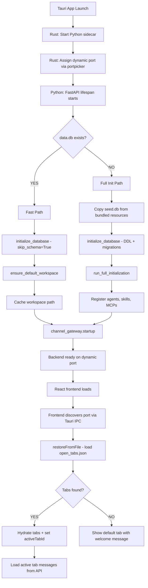
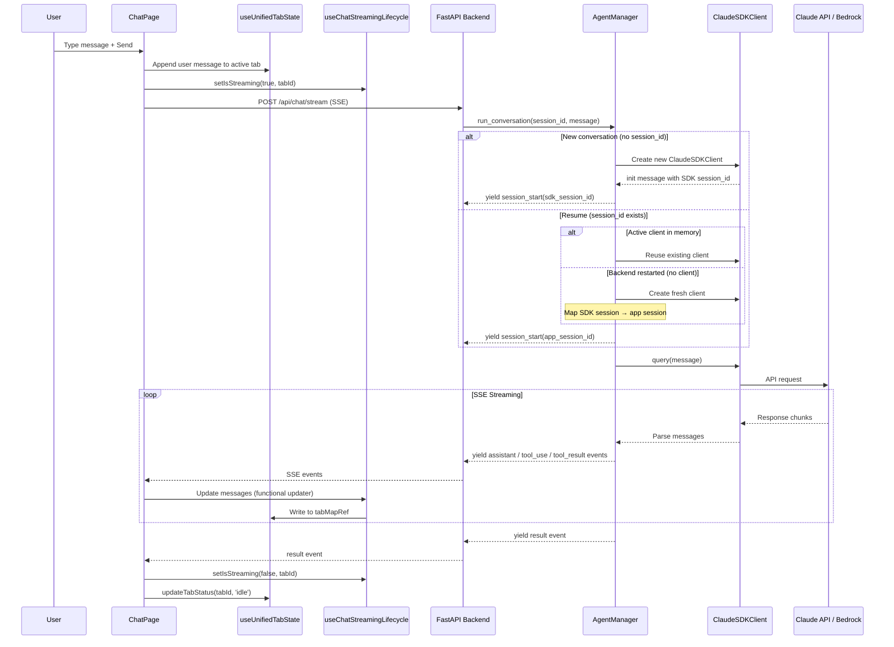
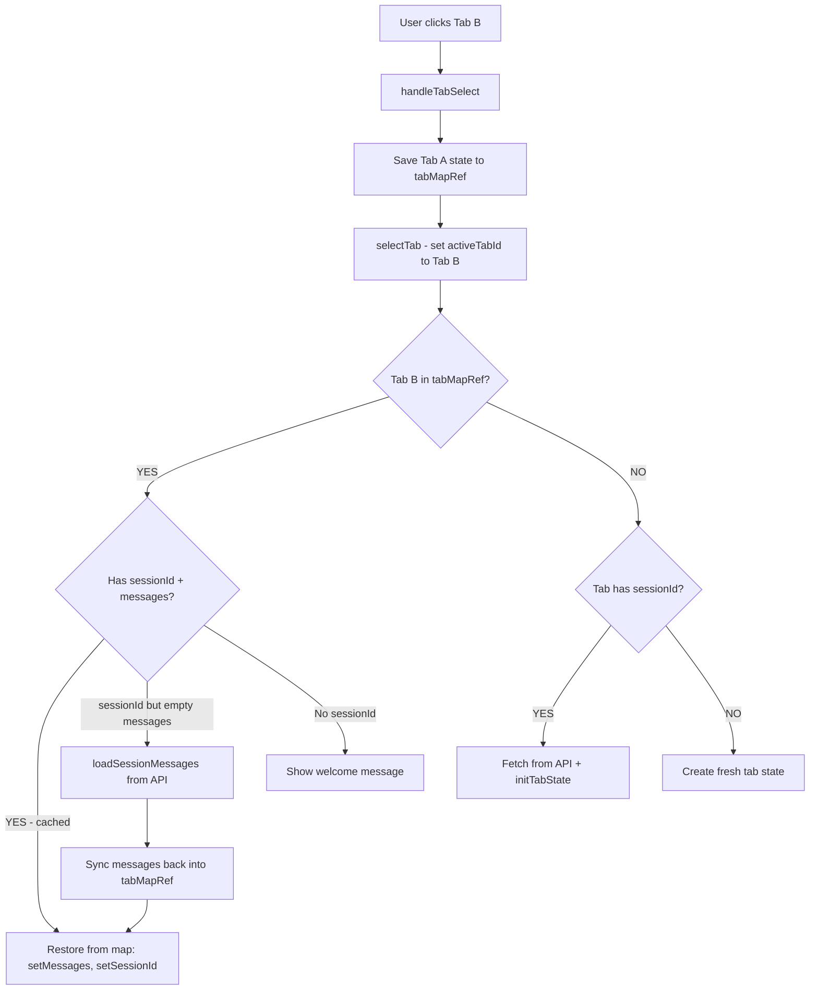
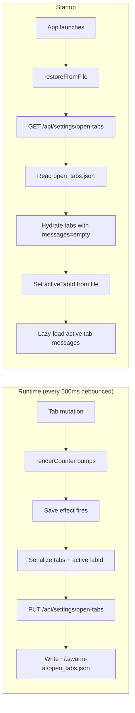
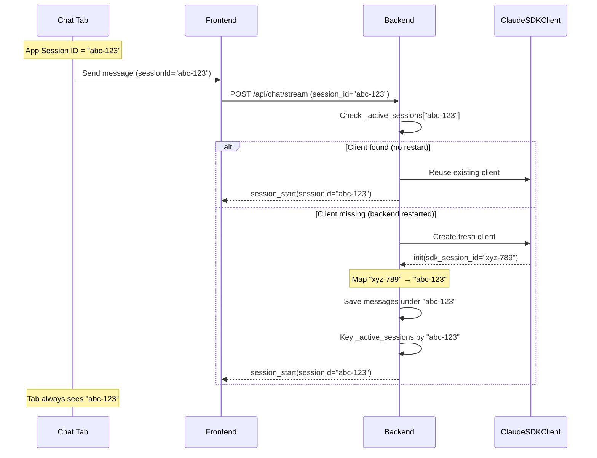
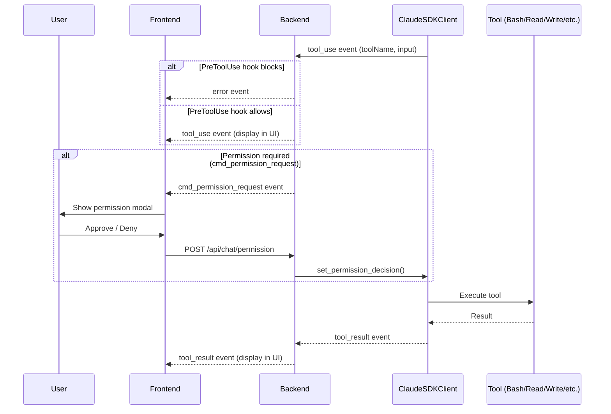
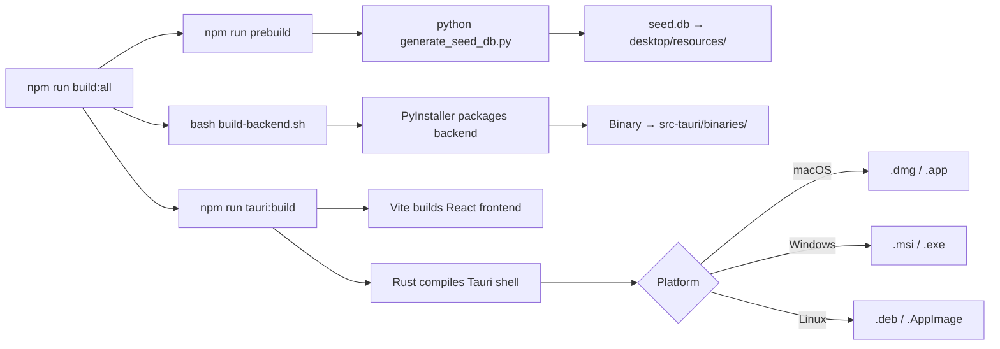

# SwarmAI — System Flowcharts

Mermaid diagrams for the key flows in SwarmAI.

---

## 1. App Startup Flow



---

## 2. Multi-Tab Chat — Message Send Flow



---

## 3. Tab Switching Flow



---

## 4. Tab Persistence Flow



---

## 5. Session ID Mapping — Resume After Restart



---

## 6. Tool Use & Permission Flow



---

## 7. SwarmWS Workspace Integrity Flow

```mermaid
flowchart TD
    A[ensure_default_workspace] --> B{Workspace record in DB?}
    B -->|NO| C[Create workspace record]
    B -->|YES| D[Load workspace record]
    C --> D
    D --> E[Expand file_path placeholder]
    E --> F[verify_integrity]
    F --> G{All system folders exist?}
    G -->|YES| H[Done - workspace healthy]
    G -->|NO| I[Create missing folders]
    I --> J[Write context-L0.md / context-L1.md]
    J --> K[Write system-prompts.md]
    K --> H


---

## 8. Skill Execution Flow

```mermaid
sequenceDiagram
    participant Claude as Claude Code CLI
    participant Hook as PreToolUse Hook
    participant Skill as Skill Tool (MCP)

    Claude->>Hook: PreToolUse(Skill, skill_id)
    Hook->>Hook: Check skill_id in agent's allowed skills

    alt Skill not authorized
        Hook-->>Claude: Block tool use
    else Skill authorized
        Hook-->>Claude: Allow
        Claude->>Skill: Invoke skill with task input
        Skill-->>Claude: Return instructions + context
        Claude->>Claude: Follow skill instructions to complete task
    end
```

---

## 9. Build Pipeline Flow



---

## Diagram Legend

| Symbol | Meaning |
|--------|---------|
| Solid arrow | Synchronous call or data flow |
| Dashed arrow | Async response or SSE event |
| Diamond | Decision point |
| Rectangle | Process or component |
| Cylinder | Database or storage |
