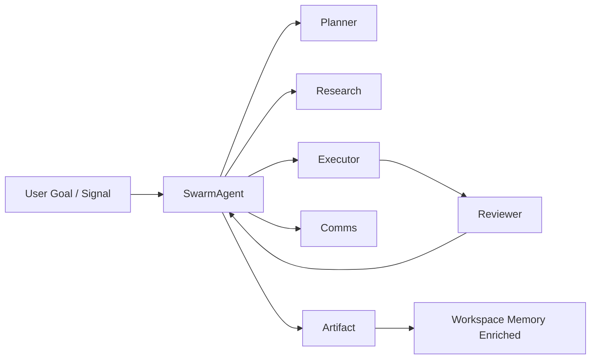

# SwarmAI Multi-Agent Architecture Design (Final)
## SwarmAgent-Orchestrated Sub-Agent System (Consolidated)

> This document consolidates the multi-agent architecture for SwarmAI based on:
> - SwarmAI Context Engine & Workspace Memory model
> - Chat Session & Execution Thread design
> - Competitive lessons from Kiro (governed modular agents), Claude Code (execution-first threads), Claude Co-work (collaborative checkpoints)
> - Signal ingestion + closed-loop channel orchestration
> - Enterprise governance and artifact-first outcomes

The goal:
> Enable SwarmAI to function as a **coordinated AI team**, where SwarmAgent orchestrates specialized sub-agents to transform Signals → Plans → Execution → Communication → Artifacts → Reflection.

---

# 1. Purpose

This document defines:
- The role of SwarmAgent as the default orchestrator
- The standardized catalog of sub-agents
- Their responsibilities across the Daily Work Operating Loop
- Governance, capability, and collaboration rules
- A scalable multi-agent execution model aligned with workspace-scoped persistent memory

---

# 2. Core Design Principles

## 2.1 SwarmAgent as the Default Orchestrator
SwarmAgent is the central intelligence that:
- Parses user intent (explore vs execute)
- Selects and coordinates sub-agents
- Enforces workspace capability policies (Skills/MCP intersection)
- Builds execution plans
- Merges and synthesizes outputs
- Proposes artifacts and channel replies

SwarmAgent is the **only agent that directly represents the “AI Team” to the user**.

---

## 2.2 Sub-Agents Are Role-Specialized and Replaceable
Sub-agents:
- Focus on a single responsibility
- Operate under capability governance
- Return structured outputs (not free-form prose)
- Can be added or swapped without changing orchestration logic

This mirrors Kiro’s modular agent + skill model.

---

## 2.3 Workspace-Scoped Governance is Mandatory
For any sub-agent execution:
```

effective_skills = swarmws_allowed ∩ workspace_allowed
effective_mcps   = swarmws_allowed ∩ workspace_allowed

````
If required capabilities are unavailable:
- Execution is deterministically blocked
- User is prompted with a “Resolve Policy Conflict” action
- All decisions logged for audit

---

## 2.4 Threads Are Execution Workspaces (Claude Code Principle)
Each thread is:
- A live execution workspace
- With runs, plans, agents, and artifacts
- Not just a chat log

Sub-agents operate within a thread run coordinated by SwarmAgent.

---

## 2.5 Human Review Gates (Claude Co-work Principle)
Before:
- External replies
- Privileged tool usage
- Artifact publishing
- Irreversible actions

SwarmAgent must request user approval.

---

# 3. High-Level Multi-Agent Architecture

```mermaid
flowchart TD
    U[User / Signal] --> CE[Context Engine: Build W-Frame]
    CE --> SA[SwarmAgent Orchestrator]

    SA --> P[PlannerAgent]
    SA --> R[ResearchAgent]
    SA --> X[ExecutorAgent]
    SA --> C[CommsAgent]
    SA --> V[ReviewerAgent]
    SA --> A[ArtifactAgent]
    SA --> S[SummarizerAgent]

    P --> SA
    R --> SA
    X --> SA
    C --> SA
    V --> SA
    A --> SA
    S --> SA

    SA --> OUT[Final Output / Next Actions]
    SA --> ART[(Artifacts)]
    SA --> DB[(SQLite: Tasks / Signals / Runs)]
````

---

# 4. Standard Sub-Agent Catalog

This catalog defines the recommended baseline agent set for SwarmAI.

---

## 4.1 Tier 0 — Core Execution Team (MVP Mandatory)

### 1. SwarmAgent (Orchestrator)

**Role:** Central coordinator of all sub-agents
**Responsibilities:**

* Interpret intent (explore vs execute)
* Select sub-agents
* Enforce workspace policy gates
* Manage parallel runs
* Synthesize final output
* Propose artifacts and replies

**Output:** Final response + next actions + artifact suggestions

---

### 2. PlannerAgent

**Role:** Goal decomposition and execution planning
**Responsibilities:**

* Break goal into executable steps
* Identify dependencies and risks
* Generate PlanItems and acceptance criteria

**Output Contract:**

```json
{
  "plan_items": [],
  "dependencies": [],
  "risks": [],
  "acceptance_criteria": []
}
```

---

### 3. ExecutorAgent

**Role:** Perform actual execution via Skills & MCP tools
**Responsibilities:**

* Call tools
* Modify files/data
* Produce intermediate results
* Track execution status

**Output Contract:**

```json
{
  "actions": [],
  "results": [],
  "artifacts_suggested": []
}
```

---

### 4. ReviewerAgent

**Role:** Validate correctness, completeness, and compliance
**Responsibilities:**

* Check outputs vs plan/requirements
* Detect issues or missing data
* Provide approval/block decision

**Output Contract:**

```json
{
  "issues": [],
  "fix_suggestions": [],
  "approve": true
}
```

---

### 5. SummarizerAgent

**Role:** Maintain rolling and final thread summaries
**Responsibilities:**

* Extract decisions, open questions, and actions
* Update ThreadSummary for indexing & retrieval

---

# 5. Tier 1 — Signal & Knowledge Agents (Next Phase)

## 6. SignalsIngestAgent

**Role:** Normalize inbound signals into structured ToDos
**Sources:** Slack, Email, Teams, Jira, SIM, Taskei, meetings
**Responsibilities:**

* Extract intent, metadata, deadlines
* Deduplicate similar signals
* Create structured ToDo entries

---

## 7. RouterAgent

**Role:** Suggest target workspace and owner
**Responsibilities:**

* Analyze tags, history, recent activity
* Recommend workspace assignment
* Learn from overrides (future enhancement)

---

## 8. ResearchAgent

**Role:** Knowledge discovery across workspace sources
**Responsibilities:**

* Query knowledgebases & local files
* Produce evidence-backed findings
* Support planning and execution

---

## 9. CommsAgent

**Role:** Draft structured replies to external channels
**Responsibilities:**

* Generate Slack/Email/Teams responses
* Include structured references (task ID, status, next steps)
* Ensure closed-loop communication

**Output Contract:**

```json
{
  "channel_replies": [
    {"channel":"slack","content_md":"..."}
  ]
}
```

---

## 10. ArtifactAgent

**Role:** Convert outputs into durable knowledge artifacts
**Responsibilities:**

* Generate Plans, Reports, Docs, Decisions
* Apply templates and versioning
* Link artifact to source thread/task

---

# 6. Tier 2 — Governance & Scale Agents (Enterprise Hardening)

## 11. PolicyGuardianAgent

**Role:** Validate capability and policy requirements
**Responsibilities:**

* Check required Skills/MCP
* Validate permissions & data boundaries
* Return `policy_violations[]` if blocked

---

## 12. AuditNarratorAgent

**Role:** Generate human-readable execution logs
**Responsibilities:**

* Summarize tool usage, decisions, and outcomes
* Improve transparency and enterprise trust

---

## 13. DedupAgent

**Role:** Prevent signal overload
**Responsibilities:**

* Cluster similar signals
* Propose merges and noise reduction

---

## 14. PriorityTriageAgent

**Role:** Intelligent prioritization and urgency scoring
**Responsibilities:**

* Score urgency/impact
* Recommend due dates
* Surface top-N priorities

---

# 7. Tier 3 — Collaboration & Proactive Operations

## 15. AssignmentAgent

**Role:** Multi-user routing and ownership management
**Responsibilities:**

* Assign Tasks/Signals to users
* Route to personal inboxes
* Track acceptance and handoffs

---

## 16. FollowUpAgent

**Role:** Monitor blocked work and trigger follow-ups
**Responsibilities:**

* Detect stalled tasks
* Draft reminders or escalation messages
* Respect active hours & policies

---

## 17. HeartbeatAgent (Optional)

**Role:** Periodic proactive check-in agent
**Responsibilities:**

* Review outstanding tasks and signals
* Surface urgent alerts or suggestions
* Remain lightweight to avoid noise

Heartbeat is optional and policy-configurable.

---

# 8. Mapping to Daily Work Operating Loop

| Loop Phase  | Sub-Agents                                        |
| ----------- | ------------------------------------------------- |
| Signals     | SignalsIngestAgent, DedupAgent, RouterAgent       |
| Plan        | PlannerAgent, PriorityTriageAgent                 |
| Execute     | ExecutorAgent, ReviewerAgent, PolicyGuardianAgent |
| Communicate | CommsAgent, FollowUpAgent                         |
| Artifacts   | ArtifactAgent                                     |
| Reflection  | SummarizerAgent, AuditNarratorAgent               |

---

# 9. Execution Flow with Multi-Agent Orchestration



---

# 10. Key Architectural Benefits

1. Clear separation of responsibilities per agent
2. Parallel execution with deterministic orchestration
3. Workspace-scoped governance and capability control
4. Closed-loop signal ingestion → execution → reply
5. Durable artifact-driven knowledge accumulation
6. Enterprise-grade auditability and collaboration support

---

# 11. Final Principle

> SwarmAI should feel like commanding a coordinated AI team inside a persistent workspace —
> where SwarmAgent orchestrates specialized sub-agents to transform signals into executed work and durable knowledge artifacts.

