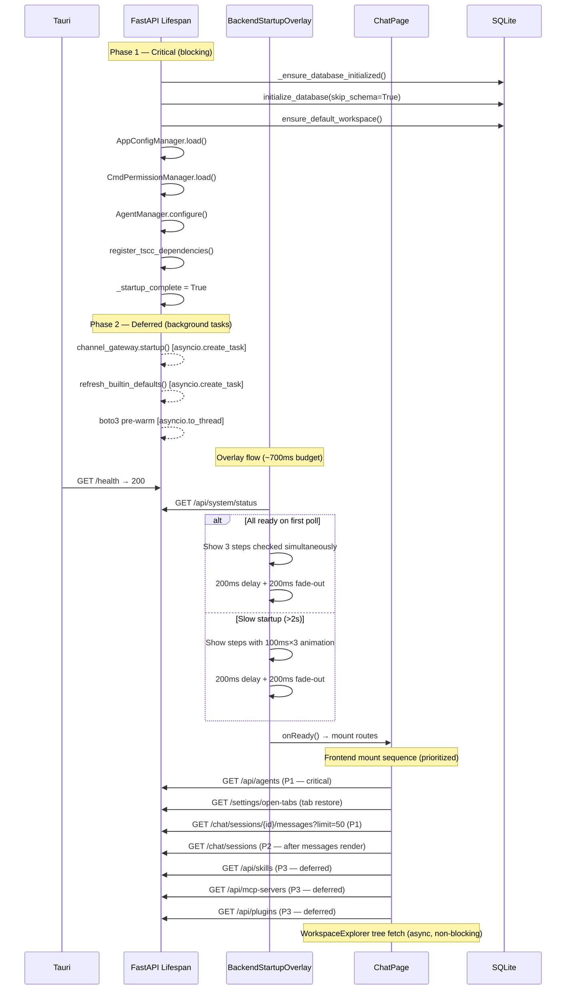

<!-- PE-REVIEWED -->
# Design Document: App Restart Performance

## Overview

This design optimizes the SwarmAI desktop application's startup sequence to reduce time-to-interactive. The current flow has several bottlenecks:

1. `channel_gateway.startup()` blocks the lifespan even when zero channels exist
2. `refresh_builtin_defaults()` re-scans skills directory synchronously on every startup
3. The BackendStartupOverlay animation sequence adds ~2050ms to perceived startup after backend is ready
4. The ChatPage fires 5 parallel React Query hooks immediately on mount with no prioritization
5. `GET /chat/sessions/{id}/messages` returns all messages with no pagination
6. `_cleanup_legacy_content()` dispatches one `anyio.to_thread.run_sync()` call per file/directory
7. The WorkspaceExplorer tree fetch can delay ChatPage interactivity

The optimization strategy is:
- **Defer** the channel gateway and `refresh_builtin_defaults()` to background tasks
- **Simplify** the BackendStartupOverlay to 3 flat steps with polished visuals and a ~700ms animation budget (down from ~2050ms)
- **Prioritize** critical frontend queries (agents → active tab messages → sessions) and defer non-critical ones
- **Paginate** session messages with cursor-based pagination (limit + before_id)
- **Batch** all legacy cleanup filesystem operations into a single thread dispatch
- **Defer** the WorkspaceExplorer tree fetch so it doesn't block ChatPage
- **Instrument** both backend and frontend with timing logs for observability

## Architecture



The key architectural changes are:
1. **Two-phase lifespan**: A blocking critical path gates `_startup_complete`, then background tasks handle channel gateway, skill refresh, and boto3 pre-warm.
2. **Simplified overlay**: 3 flat user-friendly steps, SVG icons, standard font, ~700ms total animation budget with a fast-startup shortcut.
3. **Prioritized queries**: React Query's `enabled` flag controls query ordering without changing the component tree.
4. **Non-blocking sidebar**: WorkspaceExplorer fetches its tree asynchronously, showing a skeleton while loading.

## Components and Interfaces

### Backend Changes

#### 1. Deferred Channel Gateway (`backend/main.py`)

The `lifespan()` function currently calls `await channel_gateway.startup()` synchronously. This blocks even when zero channels exist in the database.

**Change**: Query the channels table before calling startup. If empty, skip entirely. If channels exist, defer to `asyncio.create_task()`.

```python
# In lifespan(), replace the synchronous call:
channels_count = await db.channels.count()
if channels_count > 0:
    async def _deferred_gateway_startup():
        try:
            channel_gateway._startup_state = "starting"
            await channel_gateway.startup()
            channel_gateway._startup_state = "started"
            logger.info("Channel gateway started (deferred, %d channels)", channels_count)
        except Exception:
            channel_gateway._startup_state = "failed"
            logger.exception("Deferred channel gateway startup failed")
    asyncio.create_task(_deferred_gateway_startup())
    logger.info("Channel gateway startup deferred to background (%d channels)", channels_count)
else:
    channel_gateway._startup_state = "not_started"
    logger.info("No channels configured — skipping channel gateway startup")
```

**New field on `ChannelGateway`**: `_startup_state: str` with values `"not_started"`, `"starting"`, `"started"`, `"failed"`. Exposed via the system status endpoint.

#### 2. Deferred Refresh of Builtin Defaults (`backend/main.py`)

Currently `refresh_builtin_defaults()` runs synchronously on every fast-path startup, re-scanning the skills directory, projecting symlinks, and refreshing context files. This blocks `_startup_complete`.

**Change**: On the fast path, defer `refresh_builtin_defaults()` to a background task that runs after `_startup_complete = True`. The database already contains skill and context file data from the previous session, so queries are served from cache while the refresh runs.

```python
# In lifespan(), fast path — replace synchronous call:
async def _deferred_refresh_defaults():
    try:
        await initialization_manager.refresh_builtin_defaults()
        logger.info("Builtin defaults refreshed (deferred)")
    except Exception:
        logger.exception("Deferred refresh_builtin_defaults failed (non-fatal)")

asyncio.create_task(_deferred_refresh_defaults())
logger.info("refresh_builtin_defaults deferred to background")
```

On the full-init path (dev-mode, no seed.db), `refresh_builtin_defaults()` continues to run synchronously since the database may not have prior skill data.

**Stale data window**: Between `_startup_complete` and the background task completing, skill/context queries return data from the previous session. This is acceptable because:
- Skills rarely change between restarts for end users
- The refresh completes within seconds in the background
- No restart is required — new/updated skills become available as soon as the task finishes

**Frontend cache invalidation**: The deferred refresh runs server-side only. If a user opens the skills or MCP management UI before the refresh completes, they see stale data from the React Query cache. This is acceptable because: (a) the stale window is typically < 3 seconds, (b) React Query's `staleTime` of 5 minutes means the next manual navigation will re-fetch, and (c) adding a push notification (e.g., SSE event on refresh completion) would add complexity disproportionate to the benefit for a local desktop app. If this becomes a UX issue, a future enhancement could emit a `skills_refreshed` SSE event that triggers `queryClient.invalidateQueries(['skills'])`.

#### 3. Simplified BackendStartupOverlay (`desktop/src/components/common/BackendStartupOverlay.tsx`)

The current overlay displays 4 parent steps + 3 child steps in a tree structure with monospace font and text-character status indicators. The animation takes ~2050ms (150ms × ~7 items + 500ms delay + 500ms fade-out).

**Complete rewrite of `buildInitSteps()`, timing constants, and rendering.**

##### Step Model (3 flat steps, no children)

```typescript
const buildInitSteps = (systemStatus: SystemStatus): InitStep[] => [
  {
    id: 'database',
    label: 'Loading your data',
    status: getStepStatus(systemStatus.database.healthy, systemStatus.database.error),
    error: systemStatus.database.error,
  },
  {
    id: 'agent',
    label: 'Preparing your agent',
    status: getStepStatus(systemStatus.agent.ready, systemStatus.agent.error),
    error: systemStatus.agent.error,
  },
  {
    id: 'workspace',
    label: 'Setting up workspace',
    status: getStepStatus(systemStatus.swarmWorkspace.ready, systemStatus.swarmWorkspace.error),
    error: systemStatus.swarmWorkspace.error,
  },
];
```

- No `channelGateway` step (deferred per Req 1, not a dismissal gate)
- No `children` arrays (skills count, MCP count, workspace path are internal details)
- Labels are user-friendly strings, not i18n keys for technical names

##### Timing Constants

```typescript
const TIMING = {
  healthCheckTimeout: 3000,
  maxHealthAttempts: 60,
  readinessTimeout: 60000,
  pollInterval: 1000,
  stepAnimationDelay: 100,   // 100ms per step (was 150ms)
  fadeOutDelay: 200,          // 200ms delay before fade (was 500ms)
  fadeOutDuration: 200,       // 200ms fade-out (was 500ms)
  initialPollDelay: 500,
} as const;
// Total animation budget: 100ms×3 + 200ms + 200ms = ~700ms (was ~2050ms)
```

##### Fast Startup Shortcut

When the backend responds healthy AND all readiness checks pass on the first system status poll, skip the step-by-step animation entirely:

```typescript
// In the pollHealth callback, after first fetchSystemStatus:
if (readiness.allReady) {
  // Fast startup: show all steps as checked simultaneously
  setVisibleStepCount(steps.length); // All 3 at once, no sequential animation
  setStatus('connected');
  // Proceed directly to fade-out (200ms delay + 200ms fade)
}
```

This eliminates the 300ms step animation on fast startups, reducing total overlay time to ~400ms (200ms delay + 200ms fade-out).

##### Visual Polish

1. **Font**: Remove all `fontFamily: 'monospace'` inline styles. Steps use the app's standard UI font (inherited from the CSS theme).

2. **SVG Icons**: Replace text characters (`✓`, `○`, `✗`) with inline SVG icons:
   - **Success**: Filled green checkmark circle (16×16 SVG)
   - **In Progress**: Animated spinner (existing `<Spinner size="sm" />` component)
   - **Error**: Filled red error circle (16×16 SVG)

```typescript
const StatusIcon = ({ status }: { status: InitStepStatus }) => {
  if (status === 'in_progress') return <Spinner size="sm" />;
  if (status === 'success') return (
    <svg width="16" height="16" viewBox="0 0 16 16" fill="none">
      <circle cx="8" cy="8" r="8" fill="var(--color-success, #22c55e)" />
      <path d="M5 8l2 2 4-4" stroke="white" strokeWidth="1.5" strokeLinecap="round" strokeLinejoin="round" />
    </svg>
  );
  if (status === 'error') return (
    <svg width="16" height="16" viewBox="0 0 16 16" fill="none">
      <circle cx="8" cy="8" r="8" fill="var(--color-error, #ef4444)" />
      <path d="M5.5 5.5l5 5M10.5 5.5l-5 5" stroke="white" strokeWidth="1.5" strokeLinecap="round" />
    </svg>
  );
  // pending
  return (
    <svg width="16" height="16" viewBox="0 0 16 16" fill="none">
      <circle cx="8" cy="8" r="7" stroke="var(--color-text-muted)" strokeWidth="1.5" />
    </svg>
  );
};
```

3. **App Version**: Display below the "SwarmAI" title in muted text. The version is sourced from the health check response (`response.data.version`), which the overlay already fetches during `pollHealth`. Store it in a `useState<string>` initialized to `''` and set it when the first successful health check returns.

```tsx
const [appVersion, setAppVersion] = useState('');

// In pollHealth, after successful health check:
if (isHealthy) {
  // Capture version from health response (already fetched)
  const port = getBackendPort();
  const healthResponse = await axios.get(`http://127.0.0.1:${port}/health`, {
    timeout: TIMING.healthCheckTimeout,
  });
  if (healthResponse.data?.version) {
    setAppVersion(healthResponse.data.version);
  }
  // ... continue with status fetch ...
}

// In JSX:
<h1 className="text-3xl font-bold text-[var(--color-text)]">SwarmAI</h1>
{appVersion && (
  <span className="text-sm text-[var(--color-text-muted)]">v{appVersion}</span>
)}
```

##### Dismissal Logic

`checkReadiness()` remains the sole dismissal gate: `agentReady AND workspaceReady`. The `initialized` field from `SystemStatusResponse` is explicitly ignored (it currently requires `channel_gateway.running=True`, which conflicts with the deferred gateway design).

The `InitStep` interface is simplified — the `children`, `labelKey`, and `interpolation` fields are removed:

```typescript
interface InitStep {
  id: string;
  label: string;        // Plain string, not i18n key
  status: InitStepStatus;
  error?: string;
}
```

#### 4. Paginated Messages Endpoint (`backend/routers/chat.py`)

Add optional `limit` and `before_id` query parameters to `GET /chat/sessions/{id}/messages`.

```python
@router.get("/sessions/{session_id}/messages", response_model=list[ChatMessageResponse])
async def get_session_messages(
    session_id: str,
    limit: Optional[int] = Query(None, ge=1, le=200),
    before_id: Optional[str] = Query(None),
):
```

When `limit` is provided, the SQL query adds `LIMIT ?`. When `before_id` is provided, it adds `WHERE created_at < (SELECT created_at FROM messages WHERE id = ?)`. When neither is provided, behavior is unchanged (full fetch for backward compatibility).

#### 5. Paginated Messages in SQLite (`backend/database/sqlite.py`)

Add a new method to `SQLiteMessagesTable`:

```python
async def list_by_session_paginated(
    self,
    session_id: str,
    limit: Optional[int] = None,
    before_id: Optional[str] = None,
) -> list[T]:
    """List messages for a session with optional cursor-based pagination.

    Args:
        session_id: The session to query.
        limit: Max number of messages to return (most recent first when paginating).
        before_id: Return only messages created before this message ID.

    Returns:
        Messages ordered by created_at ASC (chronological).
        When paginating, returns the `limit` most recent messages before the cursor.
    """
```

The existing `list_by_session()` remains unchanged for backward compatibility.

#### 6. Batched Legacy Cleanup (`backend/core/swarm_workspace_manager.py`)

Replace the per-item `anyio.to_thread.run_sync()` calls in `_cleanup_legacy_content()` with a single batch function:

```python
def _batch_remove(paths_to_remove: list[tuple[Path, str]]) -> list[str]:
    """Remove all legacy paths in a single thread call.

    Args:
        paths_to_remove: List of (path, kind) tuples where kind is 'file' or 'dir'.

    Returns:
        List of error messages for items that failed to remove.
    """
    errors = []
    for path, kind in paths_to_remove:
        try:
            if kind == "dir":
                shutil.rmtree(path, ignore_errors=False)
            else:
                path.unlink(missing_ok=True)
        except Exception as e:
            errors.append(f"{path}: {e}")
    return errors
```

The async method collects all paths first, then calls `await anyio.to_thread.run_sync(lambda: _batch_remove(paths))` once.

#### 7. Startup Timing Instrumentation (`backend/main.py`)

Wrap each startup phase with `time.monotonic()` measurements and store per-phase durations:

```python
import time

async def lifespan(app: FastAPI):
    t0 = time.monotonic()
    phase_timings = {}

    # ... database init ...
    t_db = time.monotonic()
    phase_timings["database_ms"] = round((t_db - t0) * 1000)
    logger.info("Phase: database init — %dms", phase_timings["database_ms"])

    # ... workspace verify ...
    t_workspace = time.monotonic()
    phase_timings["workspace_ms"] = round((t_workspace - t_db) * 1000)
    logger.info("Phase: workspace verify — %dms", phase_timings["workspace_ms"])

    # ... refresh_builtin_defaults (deferred on fast path) ...
    phase_timings["refresh_defaults_ms"] = 0  # Updated by background task on completion

    # ... channel gateway (deferred) ...
    phase_timings["gateway_ms"] = 0  # Updated by background task on completion

    # ... config/permission loading ...
    t_config = time.monotonic()
    phase_timings["config_ms"] = round((t_config - t_workspace) * 1000)

    # ... agent manager configure ...
    t_agent = time.monotonic()
    phase_timings["agent_manager_ms"] = round((t_agent - t_config) * 1000)

    _startup_complete = True
    total_ms = round((time.monotonic() - t0) * 1000)
    logger.info("Total startup: %dms", total_ms)
```

Store `total_ms` and `phase_timings` in module-level variables, exposed via `GET /api/system/status`.

The overlay logs its own timing:
```typescript
// In BackendStartupOverlay, on dismissal:
console.log(`[Overlay] Health poll to dismissal: ${(performance.now() - firstPollTime).toFixed(0)}ms`);
```

ChatPage logs time-to-interactive:
```typescript
useEffect(() => {
  mountTimeRef.current = performance.now();
}, []);

// After messagesReady becomes true:
useEffect(() => {
  if (messagesReady && mountTimeRef.current) {
    console.log(`[ChatPage] Time to interactive: ${(performance.now() - mountTimeRef.current).toFixed(0)}ms`);
  }
}, [messagesReady]);
```

#### 8. System Status Endpoint Extension (`backend/routers/system.py`)

Extend `ChannelGatewayStatus` and `SystemStatusResponse`:

```python
class ChannelGatewayStatus(BaseModel):
    running: bool
    startup_state: str  # "not_started" | "starting" | "started" | "failed"

class SystemStatusResponse(BaseModel):
    # ... existing fields ...
    startup_time_ms: Optional[float] = None
    phase_timings: Optional[dict[str, float]] = None  # per-phase durations
```

> **Note**: `phase_timings` exposes internal component names (`database_ms`, `gateway_ms`, etc.). This is acceptable for a local-only desktop app where the API is only accessible on `127.0.0.1`. If the system status endpoint is ever exposed externally, `phase_timings` should be gated behind a debug flag or removed.

The `initialized` flag computation changes: `channel_gateway_status.running` is no longer required for `initialized = True` when the gateway is in `"not_started"` state (no channels configured).

Frontend `toCamelCase()` in `desktop/src/services/system.ts` must be updated to map the new fields:

```typescript
// In toCamelCase():
const channelGateway = data.channel_gateway as Record<string, unknown>;
// ...
channelGateway: {
  running: channelGateway.running as boolean,
  startupState: channelGateway.startup_state as string,  // NEW
},
// ...
startupTimeMs: (data.startup_time_ms as number) ?? null,       // NEW
phaseTimings: (data.phase_timings as Record<string, number>) ?? null, // NEW
```

### Frontend Changes

#### 9. Query Prioritization (`desktop/src/pages/ChatPage.tsx`)

Use React Query's `enabled` flag to create a three-tier loading sequence:

```typescript
// P1 — Critical: agents (needed for session creation)
const { data: agents = [], isSuccess: agentsLoaded } = useQuery({
  queryKey: ['agents'],
  queryFn: agentsService.list,
});

// P1 — Critical: active tab messages (loaded via loadSessionMessages, unchanged)

// P2 — After messages render: sessions list
const [messagesReady, setMessagesReady] = useState(false);
const { data: sessions = [], refetch: refetchSessions } = useQuery({
  queryKey: ['chatSessions', selectedAgentId],
  queryFn: () => chatService.listSessions(selectedAgentId || undefined),
  enabled: !!selectedAgentId && messagesReady,
});

// P3 — Deferred: non-critical data
const { data: skills = [] } = useQuery({
  queryKey: ['skills'],
  queryFn: skillsService.list,
  enabled: messagesReady,
});

const { data: mcpServers = [] } = useQuery({
  queryKey: ['mcpServers'],
  queryFn: mcpService.list,
  enabled: messagesReady,
});

const { data: plugins = [] } = useQuery({
  queryKey: ['plugins'],
  queryFn: pluginsService.listPlugins,
  enabled: messagesReady,
});
```

The `messagesReady` flag is set to `true` after `loadSessionMessages()` completes (or immediately if no active tab session exists, i.e. welcome screen).

#### 10. Paginated Message Loading (`desktop/src/services/chat.ts`)

Add a new method to the chat service:

```typescript
async getSessionMessagesPaginated(
  sessionId: string,
  limit?: number,
  beforeId?: string,
): Promise<ChatMessage[]> {
  const params = new URLSearchParams();
  if (limit !== undefined) params.set('limit', String(limit));
  if (beforeId !== undefined) params.set('before_id', beforeId);
  const url = `/chat/sessions/${sessionId}/messages?${params.toString()}`;
  const response = await api.get<Record<string, unknown>[]>(url);
  return response.data.map(toMessageCamelCase);
}
```

The existing `getSessionMessages()` remains for backward compatibility.

#### 11. Infinite Scroll for Older Messages (`desktop/src/pages/ChatPage.tsx`)

Add state and a scroll handler for loading older messages:

```typescript
const [hasMoreMessages, setHasMoreMessages] = useState(true);
const [isLoadingOlderMessages, setIsLoadingOlderMessages] = useState(false);

const loadOlderMessages = useCallback(async () => {
  if (!sessionId || !hasMoreMessages || isLoadingOlderMessages) return;
  const oldestMessage = messagesRef.current[0]; // Use ref to avoid dependency on messages
  if (!oldestMessage) return;

  setIsLoadingOlderMessages(true);
  try {
    const olderMessages = await chatService.getSessionMessagesPaginated(
      sessionId, 50, oldestMessage.id
    );
    if (olderMessages.length < 50) setHasMoreMessages(false);
    // Prepend without disrupting scroll position
    setMessages(prev => [...formatMessages(olderMessages), ...prev]);
  } finally {
    setIsLoadingOlderMessages(false);
  }
}, [sessionId, hasMoreMessages, isLoadingOlderMessages]);
// Note: messagesRef is a ref (stable identity) — NOT in the dependency array.
// This prevents re-creating the callback on every message state change during streaming.
```

A scroll event listener on the messages container triggers `loadOlderMessages()` when `scrollTop` reaches 0. A `<Spinner />` is shown at the top of the message list while `isLoadingOlderMessages` is true.

Scroll position preservation: use `useLayoutEffect` to capture `scrollHeight` before the DOM update and restore `scrollTop` after React commits the prepended messages. This must use `useLayoutEffect` (not `useEffect`) to run synchronously after DOM mutation but before the browser paints, preventing a visible jump.

```typescript
const prevScrollHeightRef = useRef(0);

// Before prepending (inside loadOlderMessages, before setMessages):
const container = messagesContainerRef.current;
if (container) prevScrollHeightRef.current = container.scrollHeight;

// After prepending (useLayoutEffect on messages change):
useLayoutEffect(() => {
  if (isLoadingOlderMessages || !prevScrollHeightRef.current) return;
  const container = messagesContainerRef.current;
  if (container) {
    container.scrollTop = container.scrollHeight - prevScrollHeightRef.current;
    prevScrollHeightRef.current = 0;
  }
}, [messages]); // eslint-disable-line — intentional: only fires after prepend
```

#### 12. Deferred WorkspaceExplorer Tree Fetch (`desktop/src/components/WorkspaceExplorer.tsx`)

Currently the WorkspaceExplorer fetches the workspace file tree on mount, which can delay ChatPage interactivity if the tree is large or the backend is slow to respond.

**Change**: The WorkspaceExplorer already fetches asynchronously via React Query, but the key change is ensuring it does not block ChatPage rendering or input. The tree fetch runs independently of the ChatPage mount sequence.

- While loading, display a lightweight skeleton placeholder (pulsing lines mimicking a file tree structure) instead of an empty panel
- On fetch failure, display an inline error message with a "Retry" button. The ChatPage remains fully interactive regardless of the explorer state.

```typescript
// In WorkspaceExplorer:
const { data: fileTree, isLoading, isError, refetch } = useQuery({
  queryKey: ['workspaceTree'],
  queryFn: workspaceService.getTree,
  // No dependency on ChatPage state — fetches independently
});

if (isLoading) return <TreeSkeleton />;
if (isError) return <TreeErrorState onRetry={refetch} />;
return <VirtualizedTree data={fileTree} />;
```

The `TreeSkeleton` component renders 6–8 pulsing placeholder lines with indentation to suggest a file tree structure, using the same skeleton pattern as other loading states in the app.

## Data Models

### Backend

#### Modified: `ChannelGatewayStatus` (Pydantic)

```python
class ChannelGatewayStatus(BaseModel):
    running: bool
    startup_state: str  # "not_started" | "starting" | "started" | "failed"
```

#### Modified: `SystemStatusResponse` (Pydantic)

```python
class SystemStatusResponse(BaseModel):
    database: DatabaseStatus
    agent: AgentStatus
    channel_gateway: ChannelGatewayStatus
    swarm_workspace: SwarmWorkspaceStatus
    initialized: bool
    initialization_mode: str
    initialization_complete: bool
    startup_time_ms: Optional[float] = None       # NEW — total backend startup ms
    phase_timings: Optional[dict[str, float]] = None  # NEW — per-phase durations
    timestamp: str
```

#### Modified: `GET /chat/sessions/{id}/messages` Query Parameters

| Parameter   | Type           | Default | Description                                      |
|-------------|----------------|---------|--------------------------------------------------|
| `limit`     | `Optional[int]`| `None`  | Max messages to return (1–200). `None` = all.    |
| `before_id` | `Optional[str]`| `None`  | Cursor: return messages before this message ID.  |

Response shape is unchanged: `list[ChatMessageResponse]`.

#### Modified: `ChannelGateway` Instance State

```python
class ChannelGateway:
    _startup_state: str  # "not_started" | "starting" | "started" | "failed"
    _shutting_down: bool
```

### Frontend

#### Modified: `SystemStatus` Interface (`desktop/src/services/system.ts`)

```typescript
export interface ChannelGatewayStatus {
  running: boolean;
  startupState: string;  // NEW — "not_started" | "starting" | "started" | "failed"
}

export interface SystemStatus {
  // ... existing fields ...
  startupTimeMs: number | null;                    // NEW
  phaseTimings: Record<string, number> | null;     // NEW
}
```

#### Modified: `InitStep` Interface (BackendStartupOverlay)

```typescript
interface InitStep {
  id: string;
  label: string;        // Plain string (was labelKey i18n key)
  status: InitStepStatus;
  error?: string;
  // Removed: interpolation, children, labelKey
}
```

#### Modified: `chatService` (new method)

```typescript
getSessionMessagesPaginated(
  sessionId: string,
  limit?: number,
  beforeId?: string,
): Promise<ChatMessage[]>
```

#### New State in `ChatPage`

| State                    | Type      | Purpose                                          |
|--------------------------|-----------|--------------------------------------------------|
| `messagesReady`          | `boolean` | Gates deferred queries (P2, P3)                  |
| `hasMoreMessages`        | `boolean` | Tracks if more pages exist for infinite scroll    |
| `isLoadingOlderMessages` | `boolean` | Loading indicator for older message fetch         |

### SQL Query for Paginated Messages

```sql
-- When both limit and before_id are provided:
SELECT * FROM messages
WHERE session_id = ?
  AND (created_at, rowid) < (
    (SELECT created_at FROM messages WHERE id = ?),
    (SELECT rowid FROM messages WHERE id = ?)
  )
ORDER BY created_at DESC, rowid DESC
LIMIT ?

-- Results are then reversed in Python to return chronological order.

-- When only limit is provided (initial load — most recent N):
SELECT * FROM messages
WHERE session_id = ?
ORDER BY created_at DESC, rowid DESC
LIMIT ?

-- When neither is provided (backward compat):
SELECT * FROM messages
WHERE session_id = ?
ORDER BY created_at ASC, rowid ASC
```

**Required index** (must be added as a migration or in schema DDL):

```sql
CREATE INDEX IF NOT EXISTS idx_messages_session_created
  ON messages(session_id, created_at, rowid);
```

This composite index covers the pagination query's `WHERE`, `ORDER BY`, and `LIMIT` in a single index scan. Without it, SQLite falls back to scanning all messages for the session and sorting in-memory.

**Tie-breaking**: The `created_at` column is `TEXT NOT NULL` (ISO 8601). During fast streaming, multiple messages can share the same `created_at` timestamp. Using `(created_at, rowid)` as the cursor ensures stable, deterministic ordering even when timestamps collide. The `rowid` is SQLite's implicit auto-increment and is guaranteed unique and monotonically increasing within a table.

### Design Decisions

1. **Cursor-based over offset-based pagination**: Message IDs are stable. Offset pagination breaks when messages are added/deleted between pages. Using `before_id` with a subquery on `(created_at, rowid)` is both correct and efficient with a composite index on `(session_id, created_at, rowid)`.

2. **`(created_at, rowid)` tie-breaking**: During fast streaming, multiple messages can arrive with identical `created_at` timestamps. Using `rowid` as a tiebreaker ensures deterministic, stable ordering. SQLite's `rowid` is auto-increment and unique within a table, making it a reliable secondary sort key.

3. **DESC then reverse vs. ASC with OFFSET**: Fetching DESC + LIMIT gives us the N most recent messages without knowing the total count. Reversing in Python (a list reverse of ≤200 items) is negligible.

4. **`messagesReady` flag over `useEffect` chaining**: A simple boolean state is easier to reason about than nested effect dependencies. React Query's `enabled` flag handles the actual deferral.

5. **Gateway `startup_state` over boolean**: A four-state enum (not_started/starting/started/failed) gives the frontend enough information to show appropriate UI without polling.

6. **Single-batch cleanup over parallel**: A single `run_sync()` call with a loop inside is simpler and avoids thread pool exhaustion. The total I/O is the same; the overhead of N thread dispatches is eliminated.

7. **Deferred `refresh_builtin_defaults` on fast path only**: On the fast path, the database already has skill/context data from the previous session. Deferring the refresh avoids blocking startup while still ensuring data is eventually consistent. On the full-init path, the refresh runs synchronously because the database may lack prior data.

8. **3 flat overlay steps**: The current 4-parent + 3-child tree exposes internal implementation details (skills count, MCP count, workspace path) that are meaningless to end users. Three user-friendly labels ("Loading your data", "Preparing your agent", "Setting up workspace") communicate progress without technical jargon.

9. **Fast startup shortcut**: When everything is ready on the first poll, showing a 300ms step animation is wasted time. Skipping directly to the fade-out reduces perceived latency for the common case (returning user, fast machine).

10. **Non-blocking WorkspaceExplorer**: The file tree is a secondary UI element. Blocking the entire ChatPage on a tree fetch penalizes the primary use case (chatting) for a sidebar feature.

## Correctness Properties

*A property is a characteristic or behavior that should hold true across all valid executions of a system — essentially, a formal statement about what the system should do. Properties serve as the bridge between human-readable specifications and machine-verifiable correctness guarantees.*

### Property 1: Deferred gateway does not block startup

*For any* positive number of channels in the database, after the lifespan startup completes, `_startup_complete` shall be `True` before `channel_gateway.startup()` has finished executing. That is, the wall-clock time at which `_startup_complete` is set must be less than or equal to the wall-clock time at which the deferred gateway task completes.

**Validates: Requirements 1.2**

### Property 2: Deferred refresh_builtin_defaults does not block startup

*For any* fast-path startup (seed-sourced or returning user), `_startup_complete` shall be `True` before `refresh_builtin_defaults()` has finished executing. The background task runs after the health check becomes healthy.

**Validates: Requirements 6.1**

### Property 3: Overlay builds exactly 3 flat steps

*For any* valid `SystemStatus` object (with any combination of ready/not-ready/error states across database, agent, channelGateway, and swarmWorkspace), `buildInitSteps(systemStatus)` shall return exactly 3 `InitStep` objects with ids `["database", "agent", "workspace"]`, none of which have a `children` property.

**Validates: Requirements 2.1, 2.2, 2.3**

### Property 4: checkReadiness ignores the initialized field

*For any* `SystemStatus` where `agent.ready === true` AND `swarmWorkspace.ready === true`, `checkReadiness(systemStatus)` shall return `allReady === true` regardless of the value of `systemStatus.initialized`, `systemStatus.channelGateway.running`, or `systemStatus.channelGateway.startupState`.

**Validates: Requirements 2.10**

### Property 5: Paginated message count respects limit

*For any* session containing N messages (N ≥ 0) and any requested limit L (1 ≤ L ≤ 200), the `list_by_session_paginated(session_id, limit=L)` method shall return exactly `min(N, L)` messages.

**Validates: Requirements 4.2**

### Property 6: Cursor pagination returns only older messages

*For any* session and any valid `before_id` pointing to a message M in that session, every message returned by `list_by_session_paginated(session_id, before_id=M.id)` shall have a `(created_at, rowid)` tuple strictly less than M's `(created_at, rowid)`. This holds even when multiple messages share the same `created_at` timestamp.

**Validates: Requirements 4.3**

### Property 7: Unpaginated query returns all messages (backward compatibility)

*For any* session containing N messages, calling `list_by_session_paginated(session_id)` with no `limit` and no `before_id` shall return exactly N messages in chronological order, identical to the existing `list_by_session(session_id)` result.

**Validates: Requirements 4.4**

### Property 8: Pagination round-trip

*For all* valid session message sets, fetching all messages via sequential paginated requests (limit=50, chaining `before_id` from the oldest message in each page) shall produce the same ordered set as fetching all messages without pagination parameters.

**Validates: Requirements 4.10**

### Property 9: End-of-history detection

*For any* paginated response where the number of returned messages is strictly less than the requested `limit`, the client shall treat the history as fully loaded. Equivalently: if `len(response) < limit`, then `hasMoreMessages` is `false`.

**Validates: Requirements 4.9**

### Property 10: Legacy cleanup idempotence

*For any* workspace directory (with or without legacy content), running `_cleanup_legacy_content()` twice in sequence shall produce the same filesystem state as running it once. The second invocation shall be a no-op (marker file `.legacy_cleaned` exists).

**Validates: Requirements 5.2**

### Property 11: System status response contains startup metadata

*For any* system status response returned after startup is complete, the response shall include: (a) a `channel_gateway.startup_state` string field with a value in `{"not_started", "starting", "started", "failed"}`, (b) a `startup_time_ms` numeric field that is non-negative, and (c) a `phase_timings` object containing keys `database_ms`, `workspace_ms`, `refresh_defaults_ms`, `gateway_ms`, `config_ms`, `agent_manager_ms` with non-negative numeric values.

**Validates: Requirements 1.5, 8.5, 8.6**

## Error Handling

### Backend

| Scenario | Handling |
|----------|----------|
| Deferred gateway startup fails | Log exception, set `_startup_state = "failed"`, schedule retries via existing `_schedule_retry()`. Health check remains healthy. |
| Deferred `refresh_builtin_defaults` fails | Log exception. Backend continues serving stale skill/context data from previous session. No retry — next restart will re-attempt. |
| `before_id` references a non-existent message | Return empty list (the subquery returns NULL, so `created_at < NULL` matches nothing). No error raised. |
| `limit` out of range (< 1 or > 200) | FastAPI `Query(ge=1, le=200)` validation returns 422 automatically. |
| Individual file removal fails in batch cleanup | `_batch_remove()` catches per-item exceptions, logs them, continues with remaining items. Returns error list. |
| `channels.count()` fails during startup | Fall back to calling `channel_gateway.startup()` synchronously (current behavior). Log warning. |
| `time.monotonic()` overhead | Negligible (nanosecond-scale). No error handling needed. |

### Frontend

| Scenario | Handling |
|----------|----------|
| Paginated message fetch fails | `loadOlderMessages` catches error, sets `isLoadingOlderMessages = false`. User can retry by scrolling up again. |
| Deferred query (skills/mcp/plugins) fails | React Query's built-in retry (3 attempts with exponential backoff). Chat interface remains interactive. |
| `getSessionMessagesPaginated` returns malformed data | `toMessageCamelCase` will produce partial objects. Existing error boundaries catch rendering failures. |
| Scroll position restoration fails | Graceful degradation — user sees a jump but no data loss. |
| WorkspaceExplorer tree fetch fails | Display inline error with "Retry" button. ChatPage remains fully interactive. |
| App version not available | Display "SwarmAI" title without version text. No error shown. |

## Testing Strategy

### Property-Based Tests

Use `hypothesis` (Python) for backend properties and `fast-check` (TypeScript) for frontend properties. Each property test runs a minimum of 100 iterations.

| Property | Library | Target |
|----------|---------|--------|
| Property 1: Deferred gateway | `hypothesis` + `pytest-asyncio` | `lifespan()` with mocked gateway |
| Property 2: Deferred refresh defaults | `hypothesis` + `pytest-asyncio` | `lifespan()` fast path with mocked initialization_manager |
| Property 3: Overlay 3 flat steps | `fast-check` | `buildInitSteps()` with generated SystemStatus objects |
| Property 4: checkReadiness ignores initialized | `fast-check` | `checkReadiness()` with generated SystemStatus objects |
| Property 5: Limit respects count | `hypothesis` | `SQLiteMessagesTable.list_by_session_paginated()` |
| Property 6: Cursor filters older | `hypothesis` | `SQLiteMessagesTable.list_by_session_paginated()` |
| Property 7: Backward compat | `hypothesis` | `list_by_session_paginated()` vs `list_by_session()` |
| Property 8: Pagination round-trip | `hypothesis` | Sequential paginated fetches vs full fetch |
| Property 9: End-of-history | `fast-check` | Client-side `hasMoreMessages` logic |
| Property 10: Cleanup idempotence | `hypothesis` | `_cleanup_legacy_content()` with temp directories |
| Property 11: Status metadata | `hypothesis` | `GET /api/system/status` response schema |

Each test must be tagged with a comment:
```python
# Feature: app-restart-performance, Property 5: Paginated message count respects limit
```

```typescript
// Feature: app-restart-performance, Property 3: Overlay builds exactly 3 flat steps
```

### Unit Tests

Unit tests cover specific examples and edge cases not suited to property-based testing:

- **Req 1.1**: Zero channels → gateway.startup() not called (mock + assert_not_called)
- **Req 1.3**: Health check returns 200 while gateway is still starting (mock gateway in "starting" state)
- **Req 1.4**: Deferred gateway failure triggers retry, health check unaffected (edge case)
- **Req 2.5**: SVG icons rendered for each status (success/in_progress/error/pending)
- **Req 2.6**: App version displayed below title
- **Req 2.7/2.8**: TIMING constants match spec (100ms step, 200ms delay, 200ms fade)
- **Req 2.9**: Fast startup shortcut — all ready on first poll skips step animation
- **Req 3.1–3.3**: Query prioritization — mock services, verify call order relative to `messagesReady` flag
- **Req 4.5**: Tab restore passes `limit=50` (mock chatService, verify parameter)
- **Req 4.6**: Scroll-to-top triggers `loadOlderMessages` with correct `before_id`
- **Req 4.7**: Loading indicator visible during older message fetch
- **Req 5.1/5.4**: Single `anyio.to_thread.run_sync` call (mock + assert_called_once)
- **Req 5.3**: Partial failure in batch removal — some items fail, others succeed, no exception
- **Req 6.2**: Skills query returns cached data while refresh is in progress
- **Req 6.3**: After background refresh completes, new skills are queryable
- **Req 6.4**: Background refresh failure logged, stale data still served
- **Req 7.1**: ChatPage renders and accepts input before tree fetch completes
- **Req 7.2**: Skeleton placeholder shown while tree is loading
- **Req 7.3**: Error state with retry button shown on tree fetch failure
- **Req 8.1–8.4**: Timing log entries present in captured log output

### Integration Tests

- Full startup sequence with 0 channels → verify time-to-healthy < current baseline
- Full startup sequence with 3 channels → verify `_startup_complete` before gateway finishes
- Fast-path startup → verify `_startup_complete` before `refresh_builtin_defaults` finishes
- Paginated message loading round-trip: insert N messages, fetch with limit, verify count and order
- Tab restore → paginated load → scroll up → load more → verify complete history
- Overlay dismissal timing: measure wall-clock from first poll to `onReady()` call, verify ≤ 700ms when all ready on first poll
