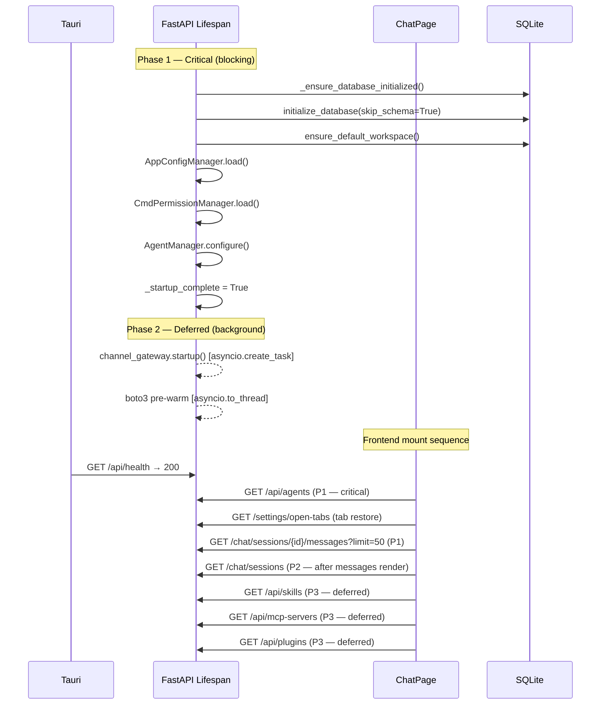

# Design Document: App Restart Performance

## Overview

This design optimizes the SwarmAI desktop application's startup sequence to reduce time-to-interactive. The current flow has four key bottlenecks:

1. `channel_gateway.startup()` blocks the lifespan even when zero channels exist
2. The ChatPage fires 5 parallel React Query hooks immediately on mount
3. `GET /chat/sessions/{id}/messages` returns all messages with no pagination
4. `_cleanup_legacy_content()` dispatches one `anyio.to_thread.run_sync()` call per file/directory

The optimization strategy is:
- **Defer** the channel gateway to a background task (or skip entirely when no channels exist)
- **Prioritize** critical frontend queries (agents → active tab messages → sessions) and defer non-critical ones (skills, mcpServers, plugins)
- **Paginate** session messages with cursor-based pagination (limit + before_id)
- **Batch** all legacy cleanup filesystem operations into a single thread dispatch
- **Instrument** both backend and frontend with timing logs for observability

## Architecture




The key architectural change is splitting the lifespan into two phases: a blocking critical path that gates `_startup_complete`, and a deferred phase for non-critical work. On the frontend, React Query's `enabled` flag controls query prioritization without changing the component tree.

## Components and Interfaces

### Backend Changes

#### 1. Deferred Channel Gateway (`backend/main.py`)

The `lifespan()` function currently calls `await channel_gateway.startup()` synchronously. This blocks even when zero channels exist in the database.

**Change**: Query the channels table before calling startup. If empty, skip entirely. If channels exist, defer to `asyncio.create_task()`.

```python
# In lifespan(), replace the synchronous call:
channels_count = await db.channels.count()
if channels_count > 0:
    async def _deferred_gateway_startup():
        try:
            await channel_gateway.startup()
            logger.info("Channel gateway started (deferred, %d channels)", channels_count)
        except Exception:
            logger.exception("Deferred channel gateway startup failed")
    asyncio.create_task(_deferred_gateway_startup())
    logger.info("Channel gateway startup deferred to background (%d channels)", channels_count)
else:
    logger.info("No channels configured — skipping channel gateway startup")
```

**New field on `ChannelGateway`**: `_startup_state: str` with values `"not_started"`, `"starting"`, `"started"`, `"failed"`. Exposed via the system status endpoint.

#### 2. Paginated Messages Endpoint (`backend/routers/chat.py`)

Add optional `limit` and `before_id` query parameters to `GET /chat/sessions/{id}/messages`.

```python
@router.get("/sessions/{session_id}/messages", response_model=list[ChatMessageResponse])
async def get_session_messages(
    session_id: str,
    limit: Optional[int] = Query(None, ge=1, le=200),
    before_id: Optional[str] = Query(None),
):
```

When `limit` is provided, the SQL query adds `LIMIT ?`. When `before_id` is provided, it adds `WHERE created_at < (SELECT created_at FROM messages WHERE id = ?)`. When neither is provided, behavior is unchanged (full fetch for backward compatibility).


#### 3. Paginated Messages in SQLite (`backend/database/sqlite.py`)

Add a new method to `SQLiteMessagesTable`:

```python
async def list_by_session_paginated(
    self,
    session_id: str,
    limit: Optional[int] = None,
    before_id: Optional[str] = None,
) -> list[T]:
    """List messages for a session with optional cursor-based pagination.

    Args:
        session_id: The session to query.
        limit: Max number of messages to return (most recent first when paginating).
        before_id: Return only messages created before this message ID.

    Returns:
        Messages ordered by created_at ASC (chronological).
        When paginating, returns the `limit` most recent messages before the cursor.
    """
```

The existing `list_by_session()` remains unchanged for backward compatibility.

#### 4. Batched Legacy Cleanup (`backend/core/swarm_workspace_manager.py`)

Replace the per-item `anyio.to_thread.run_sync()` calls in `_cleanup_legacy_content()` with a single batch function:

```python
def _batch_remove(paths_to_remove: list[tuple[Path, str]]) -> list[str]:
    """Remove all legacy paths in a single thread call.

    Args:
        paths_to_remove: List of (path, kind) tuples where kind is 'file' or 'dir'.

    Returns:
        List of error messages for items that failed to remove.
    """
    errors = []
    for path, kind in paths_to_remove:
        try:
            if kind == "dir":
                shutil.rmtree(path, ignore_errors=False)
            else:
                path.unlink(missing_ok=True)
        except Exception as e:
            errors.append(f"{path}: {e}")
    return errors
```

The async method collects all paths first, then calls `await anyio.to_thread.run_sync(lambda: _batch_remove(paths))` once.

#### 5. Startup Timing Instrumentation (`backend/main.py`)

Wrap each startup phase with `time.monotonic()` measurements:

```python
import time

async def lifespan(app: FastAPI):
    t0 = time.monotonic()
    # ... each phase ...
    t_db = time.monotonic()
    logger.info("Phase: database init — %.0fms", (t_db - t0) * 1000)
    # ... next phase ...
    t_workspace = time.monotonic()
    logger.info("Phase: workspace verify — %.0fms", (t_workspace - t_db) * 1000)
    # ... etc ...
    _startup_complete = True
    total_ms = (time.monotonic() - t0) * 1000
    logger.info("Total startup: %.0fms", total_ms)
```

Store `total_ms` in a module-level variable and expose it via `GET /api/system/status` as `startup_time_ms`.

#### 6. System Status Endpoint Extension (`backend/routers/system.py`)

Extend `ChannelGatewayStatus` and `SystemStatusResponse`:

```python
class ChannelGatewayStatus(BaseModel):
    running: bool
    startup_state: str  # "not_started" | "starting" | "started" | "failed"

class SystemStatusResponse(BaseModel):
    # ... existing fields ...
    startup_time_ms: Optional[float] = None  # Total backend startup duration
```

The `initialized` flag computation changes: `channel_gateway_status.running` is no longer required for `initialized = True` when the gateway is in `"not_started"` state (no channels configured).


### Frontend Changes

#### 7. Query Prioritization (`desktop/src/pages/ChatPage.tsx`)

Use React Query's `enabled` flag to create a three-tier loading sequence:

```typescript
// P1 — Critical: agents (needed for session creation)
const { data: agents = [], isSuccess: agentsLoaded } = useQuery({
  queryKey: ['agents'],
  queryFn: agentsService.list,
});

// P1 — Critical: active tab messages (loaded via loadSessionMessages, unchanged)

// P2 — After messages render: sessions list
const [messagesReady, setMessagesReady] = useState(false);
const { data: sessions = [], refetch: refetchSessions } = useQuery({
  queryKey: ['chatSessions', selectedAgentId],
  queryFn: () => chatService.listSessions(selectedAgentId || undefined),
  enabled: !!selectedAgentId && messagesReady,
});

// P3 — Deferred: non-critical data
const { data: skills = [] } = useQuery({
  queryKey: ['skills'],
  queryFn: skillsService.list,
  enabled: messagesReady,
});

const { data: mcpServers = [] } = useQuery({
  queryKey: ['mcpServers'],
  queryFn: mcpService.list,
  enabled: messagesReady,
});

const { data: plugins = [] } = useQuery({
  queryKey: ['plugins'],
  queryFn: pluginsService.listPlugins,
  enabled: messagesReady,
});
```

The `messagesReady` flag is set to `true` after `loadSessionMessages()` completes (or immediately if no active tab session exists, i.e. welcome screen).

#### 8. Paginated Message Loading (`desktop/src/services/chat.ts`)

Add a new method to the chat service:

```typescript
async getSessionMessagesPaginated(
  sessionId: string,
  limit?: number,
  beforeId?: string,
): Promise<ChatMessage[]> {
  const params = new URLSearchParams();
  if (limit !== undefined) params.set('limit', String(limit));
  if (beforeId !== undefined) params.set('before_id', beforeId);
  const url = `/chat/sessions/${sessionId}/messages?${params.toString()}`;
  const response = await api.get<Record<string, unknown>[]>(url);
  return response.data.map(toMessageCamelCase);
}
```

The existing `getSessionMessages()` remains for backward compatibility.

#### 9. Infinite Scroll for Older Messages (`desktop/src/pages/ChatPage.tsx`)

Add state and a scroll handler for loading older messages:

```typescript
const [hasMoreMessages, setHasMoreMessages] = useState(true);
const [isLoadingOlderMessages, setIsLoadingOlderMessages] = useState(false);

const loadOlderMessages = useCallback(async () => {
  if (!sessionId || !hasMoreMessages || isLoadingOlderMessages) return;
  const oldestMessage = messages[0];
  if (!oldestMessage) return;

  setIsLoadingOlderMessages(true);
  try {
    const olderMessages = await chatService.getSessionMessagesPaginated(
      sessionId, 50, oldestMessage.id
    );
    if (olderMessages.length < 50) setHasMoreMessages(false);
    // Prepend without disrupting scroll position
    setMessages(prev => [...formatMessages(olderMessages), ...prev]);
  } finally {
    setIsLoadingOlderMessages(false);
  }
}, [sessionId, hasMoreMessages, isLoadingOlderMessages, messages]);
```

A scroll event listener on the messages container triggers `loadOlderMessages()` when `scrollTop` reaches 0. A `<Spinner />` is shown at the top of the message list while `isLoadingOlderMessages` is true.

Scroll position preservation: before prepending, capture `scrollHeight`. After React re-renders, set `scrollTop = newScrollHeight - oldScrollHeight`.

#### 10. Frontend Timing Instrumentation (`desktop/src/pages/ChatPage.tsx`)

Log time-to-interactive from component mount:

```typescript
useEffect(() => {
  const mountTime = performance.now();
  return () => {
    // Cleanup — not used for timing
  };
}, []);

// After messages render or welcome screen display:
useEffect(() => {
  if (messagesReady) {
    console.log(`[ChatPage] Time to interactive: ${(performance.now() - mountTimeRef.current).toFixed(0)}ms`);
  }
}, [messagesReady]);
```


## Data Models

### Backend

#### Modified: `ChannelGatewayStatus` (Pydantic)

```python
class ChannelGatewayStatus(BaseModel):
    running: bool
    startup_state: str  # "not_started" | "starting" | "started" | "failed"
```

#### Modified: `SystemStatusResponse` (Pydantic)

```python
class SystemStatusResponse(BaseModel):
    database: DatabaseStatus
    agent: AgentStatus
    channel_gateway: ChannelGatewayStatus
    swarm_workspace: SwarmWorkspaceStatus
    initialized: bool
    initialization_mode: str
    initialization_complete: bool
    startup_time_ms: Optional[float] = None  # NEW — total backend startup ms
    timestamp: str
```

#### Modified: `GET /chat/sessions/{id}/messages` Query Parameters

| Parameter   | Type           | Default | Description                                      |
|-------------|----------------|---------|--------------------------------------------------|
| `limit`     | `Optional[int]`| `None`  | Max messages to return (1–200). `None` = all.    |
| `before_id` | `Optional[str]`| `None`  | Cursor: return messages before this message ID.  |

Response shape is unchanged: `list[ChatMessageResponse]`.

#### Modified: `ChannelGateway` Instance State

```python
class ChannelGateway:
    _startup_state: str  # "not_started" | "starting" | "started" | "failed"
    _shutting_down: bool
```

### Frontend

#### Modified: `chatService` (new method)

```typescript
getSessionMessagesPaginated(
  sessionId: string,
  limit?: number,
  beforeId?: string,
): Promise<ChatMessage[]>
```

#### New State in `ChatPage`

| State                    | Type      | Purpose                                          |
|--------------------------|-----------|--------------------------------------------------|
| `messagesReady`          | `boolean` | Gates deferred queries (P2, P3)                  |
| `hasMoreMessages`        | `boolean` | Tracks if more pages exist for infinite scroll    |
| `isLoadingOlderMessages` | `boolean` | Loading indicator for older message fetch         |

### SQL Query for Paginated Messages

```sql
-- When both limit and before_id are provided:
SELECT * FROM messages
WHERE session_id = ?
  AND created_at < (SELECT created_at FROM messages WHERE id = ?)
ORDER BY created_at DESC
LIMIT ?

-- Results are then reversed in Python to return chronological order.

-- When only limit is provided (initial load — most recent N):
SELECT * FROM messages
WHERE session_id = ?
ORDER BY created_at DESC
LIMIT ?

-- When neither is provided (backward compat):
SELECT * FROM messages
WHERE session_id = ?
ORDER BY created_at ASC
```

### Design Decisions

1. **Cursor-based over offset-based pagination**: Message IDs are stable. Offset pagination breaks when messages are added/deleted between pages. Using `before_id` with a subquery on `created_at` is both correct and efficient with an index on `(session_id, created_at)`.

2. **DESC then reverse vs. ASC with OFFSET**: Fetching DESC + LIMIT gives us the N most recent messages without knowing the total count. Reversing in Python (a list reverse of ≤200 items) is negligible.

3. **`messagesReady` flag over `useEffect` chaining**: A simple boolean state is easier to reason about than nested effect dependencies. React Query's `enabled` flag handles the actual deferral.

4. **Gateway `startup_state` over boolean**: A tri-state (not_started/starting/started/failed) gives the frontend enough information to show appropriate UI without polling.

5. **Single-batch cleanup over parallel**: A single `run_sync()` call with a loop inside is simpler and avoids thread pool exhaustion. The total I/O is the same; the overhead of N thread dispatches is eliminated.


## Correctness Properties

*A property is a characteristic or behavior that should hold true across all valid executions of a system — essentially, a formal statement about what the system should do. Properties serve as the bridge between human-readable specifications and machine-verifiable correctness guarantees.*

### Property 1: Deferred gateway does not block startup

*For any* positive number of channels in the database, after the lifespan startup completes, `_startup_complete` shall be `True` before `channel_gateway.startup()` has finished executing. That is, the wall-clock time at which `_startup_complete` is set must be less than or equal to the wall-clock time at which the deferred gateway task completes.

**Validates: Requirements 1.2**

### Property 2: Paginated message count respects limit

*For any* session containing N messages (N ≥ 0) and any requested limit L (1 ≤ L ≤ 200), the `list_by_session_paginated(session_id, limit=L)` method shall return exactly `min(N, L)` messages.

**Validates: Requirements 3.2**

### Property 3: Cursor pagination returns only older messages

*For any* session and any valid `before_id` pointing to a message M in that session, every message returned by `list_by_session_paginated(session_id, before_id=M.id)` shall have a `created_at` timestamp strictly less than M's `created_at`.

**Validates: Requirements 3.3**

### Property 4: Unpaginated query returns all messages (backward compatibility)

*For any* session containing N messages, calling `list_by_session_paginated(session_id)` with no `limit` and no `before_id` shall return exactly N messages in chronological order, identical to the existing `list_by_session(session_id)` result.

**Validates: Requirements 3.4**

### Property 5: End-of-history detection

*For any* paginated response where the number of returned messages is strictly less than the requested `limit`, the client shall treat the history as fully loaded. Equivalently: if `len(response) < limit`, then `hasMoreMessages` is `false`.

**Validates: Requirements 3.9**

### Property 6: Legacy cleanup idempotence

*For any* workspace directory (with or without legacy content), running `_cleanup_legacy_content()` twice in sequence shall produce the same filesystem state as running it once. The second invocation shall be a no-op (marker file `.legacy_cleaned` exists).

**Validates: Requirements 4.2**

### Property 7: System status response contains startup metadata

*For any* system status response returned after startup is complete, the response shall include a `channel_gateway.startup_state` string field with a value in `{"not_started", "starting", "started", "failed"}` and a `startup_time_ms` numeric field that is non-negative.

**Validates: Requirements 1.5, 5.4**


## Error Handling

### Backend

| Scenario | Handling |
|----------|----------|
| Deferred gateway startup fails | Log exception, set `_startup_state = "failed"`, schedule retries via existing `_schedule_retry()`. Health check remains healthy. |
| `before_id` references a non-existent message | Return empty list (the subquery returns NULL, so `created_at < NULL` matches nothing). No error raised. |
| `limit` out of range (< 1 or > 200) | FastAPI `Query(ge=1, le=200)` validation returns 422 automatically. |
| Individual file removal fails in batch cleanup | `_batch_remove()` catches per-item exceptions, logs them, continues with remaining items. Returns error list. |
| `channels.count()` fails during startup | Fall back to calling `channel_gateway.startup()` synchronously (current behavior). Log warning. |
| `time.monotonic()` overhead | Negligible (nanosecond-scale). No error handling needed. |

### Frontend

| Scenario | Handling |
|----------|----------|
| Paginated message fetch fails | `loadOlderMessages` catches error, sets `isLoadingOlderMessages = false`. User can retry by scrolling up again. |
| Deferred query (skills/mcp/plugins) fails | React Query's built-in retry (3 attempts with exponential backoff). Chat interface remains interactive. |
| `getSessionMessagesPaginated` returns malformed data | `toMessageCamelCase` will produce partial objects. Existing error boundaries catch rendering failures. |
| Scroll position restoration fails | Graceful degradation — user sees a jump but no data loss. |

## Testing Strategy

### Property-Based Tests

Use `hypothesis` (Python) for backend properties and `fast-check` (TypeScript) for frontend properties. Each property test runs a minimum of 100 iterations.

| Property | Library | Target |
|----------|---------|--------|
| Property 1: Deferred gateway | `hypothesis` + `pytest-asyncio` | `lifespan()` with mocked gateway |
| Property 2: Limit respects count | `hypothesis` | `SQLiteMessagesTable.list_by_session_paginated()` |
| Property 3: Cursor filters older | `hypothesis` | `SQLiteMessagesTable.list_by_session_paginated()` |
| Property 4: Backward compat | `hypothesis` | `SQLiteMessagesTable.list_by_session_paginated()` vs `list_by_session()` |
| Property 5: End-of-history | `fast-check` | Client-side `hasMoreMessages` logic |
| Property 6: Cleanup idempotence | `hypothesis` | `_cleanup_legacy_content()` with temp directories |
| Property 7: Status metadata | `hypothesis` | `GET /api/system/status` response schema |

Each test must be tagged with a comment:
```python
# Feature: app-restart-performance, Property 2: Paginated message count respects limit
```

### Unit Tests

Unit tests cover specific examples and edge cases not suited to property-based testing:

- **Req 1.1**: Zero channels → gateway.startup() not called (mock + assert_not_called)
- **Req 1.3**: Health check returns 200 while gateway is still starting (mock gateway in "starting" state)
- **Req 1.4**: Deferred gateway failure triggers retry, health check unaffected (edge case)
- **Req 2.1–2.4**: Query prioritization — mock services, verify call order relative to `messagesReady` flag
- **Req 3.5**: Tab restore passes `limit=50` (mock chatService, verify parameter)
- **Req 3.6**: Scroll-to-top triggers `loadOlderMessages` with correct `before_id`
- **Req 3.7**: Loading indicator visible during older message fetch
- **Req 4.1/4.4**: Single `anyio.to_thread.run_sync` call (mock + assert_called_once)
- **Req 4.3**: Partial failure in batch removal — some items fail, others succeed, no exception
- **Req 5.1–5.3**: Timing log entries present in captured log output

### Integration Tests

- Full startup sequence with 0 channels → verify time-to-healthy < current baseline
- Full startup sequence with 3 channels → verify _startup_complete before gateway finishes
- Paginated message loading round-trip: insert N messages, fetch with limit, verify count and order
- Tab restore → paginated load → scroll up → load more → verify complete history

