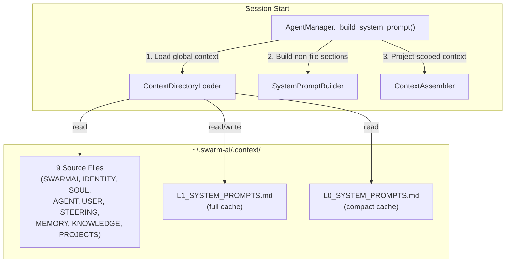
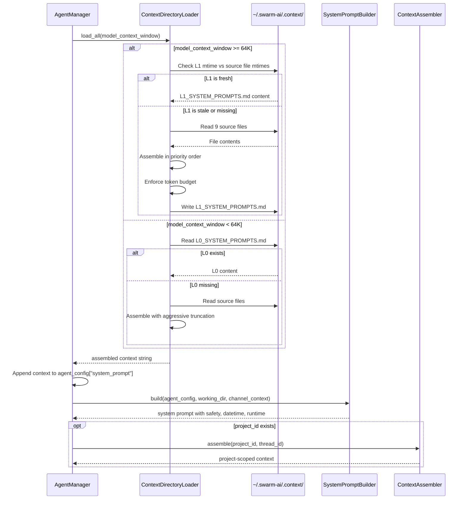

<!-- PE-REVIEWED -->
# Design Document: Centralized Context Directory

## Overview

This design replaces SwarmAI's scattered context injection system with a single centralized directory at `~/.swarm-ai/.context/`. The new `ContextDirectoryLoader` module reads 9 user-editable markdown files, assembles them in priority order into the system prompt, enforces a configurable token budget (default 25K), and supports model-aware compaction via L0/L1 cache files.

The existing `SystemPromptBuilder` continues to handle non-file sections (safety principles, datetime, runtime metadata). The existing `ContextAssembler` continues to handle project-scoped context. The `ContextDirectoryLoader` sits between them — providing global identity/personality/memory context from a single `~/.swarm-ai/.context/` directory.

Key design decisions:
- Filesystem-only storage — no DB queries for context content
- Priority-based assembly (0–8) with progressive truncation from lowest priority
- SWARMAI.md, IDENTITY.md, SOUL.md are never truncated (priorities 0–2)
- L1 cache = full concatenation with mtime freshness check
- L0 cache = compact version for small models (< 64K context window)
- Integration at `AgentManager._build_system_prompt()` before `SystemPromptBuilder`


## Architecture

### System Context



### Data Flow




## Components and Interfaces

### 1. ContextDirectoryLoader (`backend/core/context_directory_loader.py`)

The primary new module. Responsible for initialization, loading, assembly, caching, and token budget enforcement.

```python
"""Centralized context directory loader.

Reads markdown files from ~/.swarm-ai/.context/ and assembles them into
the system prompt with priority-based ordering, token budget enforcement,
and L0/L1 compaction support.

Key public symbols:

- ``ContextDirectoryLoader``  — Main loader class
- ``ContextFileSpec``         — Namedtuple defining a source file's metadata
- ``CONTEXT_FILES``           — Ordered list of ContextFileSpec entries
- ``DEFAULT_TOKEN_BUDGET``    — Default token budget (25,000)
- ``estimate_tokens``         — Static token estimation function
"""

from pathlib import Path
from typing import NamedTuple, Optional
import logging

logger = logging.getLogger(__name__)

DEFAULT_TOKEN_BUDGET = 25_000
L1_CACHE_FILENAME = "L1_SYSTEM_PROMPTS.md"
L0_CACHE_FILENAME = "L0_SYSTEM_PROMPTS.md"

# Model context window thresholds
THRESHOLD_USE_L1 = 64_000       # >= 64K: use L1 or source files
THRESHOLD_SKIP_LOW_PRIORITY = 32_000  # < 32K: skip KNOWLEDGE + PROJECTS


class ContextFileSpec(NamedTuple):
    """Metadata for a single context source file."""
    filename: str
    priority: int
    section_name: str
    truncatable: bool


CONTEXT_FILES: list[ContextFileSpec] = [
    ContextFileSpec("SWARMAI.md",    0, "SwarmAI",          False),
    ContextFileSpec("IDENTITY.md",   1, "Identity",         False),
    ContextFileSpec("SOUL.md",       2, "Soul",             False),
    ContextFileSpec("AGENT.md",      3, "Agent Directives", True),
    ContextFileSpec("USER.md",       4, "User",             True),
    ContextFileSpec("STEERING.md",   5, "Steering",         True),
    ContextFileSpec("MEMORY.md",     6, "Memory",           True),
    ContextFileSpec("KNOWLEDGE.md",  7, "Knowledge",        True),
    ContextFileSpec("PROJECTS.md",   8, "Projects",         True),
]


class ContextDirectoryLoader:
    """Loads and assembles context files from ~/.swarm-ai/.context/.

    Guarantees:
    - Deterministic: same files + same budget → identical output
    - Files assembled in ascending priority order (0 first, 8 last)
    - Non-truncatable files (priority 0-2) are never removed or shortened
    - L1 cache is used when fresh; regenerated when any source file changes
    - L0 cache is used for models with < 64K context window
    - All filesystem errors are caught and logged; never blocks agent startup
    """

    def __init__(
        self,
        context_dir: Path,
        token_budget: int = DEFAULT_TOKEN_BUDGET,
        templates_dir: Optional[Path] = None,
    ):
        """Initialize the loader.

        Args:
            context_dir: Path to ~/.swarm-ai/.context/
            token_budget: Max tokens for assembled output (default 25,000)
            templates_dir: Path to backend/context/ for initialization
        """
        ...

    # ── Public API ─────────────────────────────────────────────────

    def ensure_directory(self) -> None:
        """Create context directory and copy missing templates.

        Validates: Requirements 1.1, 1.2, 1.3, 1.4
        """
        ...

    def load_all(self, model_context_window: int = 200_000) -> str:
        """Load and assemble context based on model context window.

        Main entry point. Selects L0/L1/source-file path based on
        model_context_window, enforces token budget, returns assembled string.

        Args:
            model_context_window: Model's context window size in tokens.

        Returns:
            Assembled context string with section headers.

        Validates: Requirements 2.1, 3.1, 4.1-4.4, 5.1, 6.1-6.4
        """
        ...

    @staticmethod
    def estimate_tokens(text: str) -> int:
        """Estimate token count (~4 chars per token).

        Args:
            text: Input text.

        Returns:
            Positive integer token estimate. 0 for empty/whitespace input.

        Validates: Requirements 10.1, 10.3, 10.4
        """
        ...

    # ── Private methods ────────────────────────────────────────────

    def _assemble_from_sources(
        self,
        model_context_window: int = 200_000,
    ) -> str:
        """Read all source files and assemble with section headers.

        Validates: Requirements 2.1-2.4
        """
        ...

    def _enforce_token_budget(
        self,
        sections: list[tuple[int, str, str, bool]],
    ) -> list[tuple[int, str, str, bool]]:
        """Truncate sections from lowest priority to fit budget.

        Validates: Requirements 3.1-3.5
        """
        ...

    def _is_l1_fresh(self) -> bool:
        """Check if L1 cache mtime >= all source file mtimes.

        Validates: Requirements 4.2, 4.3
        """
        ...

    def _write_l1_cache(self, content: str) -> None:
        """Write assembled content to L1 cache file.

        Validates: Requirements 4.1, 4.5
        """
        ...

    def _load_l0(self, model_context_window: int) -> str:
        """Load L0 compact cache or fall back to aggressive truncation.

        Validates: Requirements 5.1-5.4
        """
        ...
```


### 2. AgentManager Integration Changes (`backend/core/agent_manager.py`)

The `_build_system_prompt` method is modified to invoke `ContextDirectoryLoader` before `SystemPromptBuilder`:

```python
async def _build_system_prompt(self, agent_config, working_directory, channel_context):
    # ── NEW: Load centralized context files ──────────────────
    try:
        from config import get_app_data_dir
        context_dir = get_app_data_dir() / ".context"
        loader = ContextDirectoryLoader(
            context_dir=context_dir,
            token_budget=agent_config.get("context_token_budget", DEFAULT_TOKEN_BUDGET),
            templates_dir=Path(__file__).resolve().parent.parent / "context",
        )
        loader.ensure_directory()

        model = self._resolve_model(agent_config)
        model_context_window = self._get_model_context_window(model)
        context_text = loader.load_all(model_context_window=model_context_window)

        if context_text:
            existing = agent_config.get("system_prompt", "") or ""
            agent_config["system_prompt"] = (
                existing + "\n\n" + context_text if existing else context_text
            )
    except Exception as e:
        logger.warning("ContextDirectoryLoader failed: %s", e)

    # ── Project-scoped context (ContextAssembler) ──────────
    # ... ContextAssembler code for project-scoped context ...

    # ── SystemPromptBuilder (non-file sections only) ─────
    prompt_builder = SystemPromptBuilder(
        working_directory=working_directory,
        agent_config=agent_config,
        channel_context=channel_context,
        add_dirs=agent_config.get("add_dirs", []),
    )
    return prompt_builder.build()
```

### 3. SystemPromptBuilder Changes (`backend/core/system_prompt.py`)

Remove `_section_user_identity()`, `_section_project_context()`, `_section_extra_prompt()`, and `_load_workspace_file()` entirely. All file-based context is now loaded by `ContextDirectoryLoader`.

Also remove `_load_workspace_file()` helper since no section uses it anymore.

`SystemPromptBuilder` retains only non-file sections:

```python
def build(self) -> str:
    sections = [
        self._section_identity(),       # Agent name + description (from agent_config)
        self._section_safety(),          # Hardcoded safety principles
        self._section_workspace(),       # cwd path
        self._section_selected_dirs(),   # add_dirs (if any)
        self._section_datetime(),        # Current date/time
        self._section_runtime(),         # agent/model/os/channel metadata
    ]
    return "\n\n".join(s for s in sections if s)
```

Removed methods:
- `_section_user_identity()`
- `_section_project_context()`
- `_section_extra_prompt()`
- `_load_workspace_file()`

### 4. AgentSandboxManager — Deleted

`AgentSandboxManager` (`backend/core/agent_sandbox_manager.py`) is deleted entirely. Its two responsibilities are replaced:

| Old Responsibility | New Owner |
|---|---|
| Copy template files to `.swarmai/` | `ContextDirectoryLoader.ensure_directory()` copies defaults from `backend/context/` to `~/.swarm-ai/.context/` |
| `main_workspace` property | Callers use `initialization_manager.get_cached_workspace_path()` directly |

The module, class, global singleton (`agent_sandbox_manager`), and all imports are removed.

### 5. Model Context Window Helper (`AgentManager._get_model_context_window`)

New helper method that maps model IDs to context window sizes for L0/L1 selection:

```python
# Model context window sizes (tokens)
MODEL_CONTEXT_WINDOWS = {
    "claude-opus-4-6": 200_000,
    "claude-sonnet-4-6": 200_000,
    "claude-sonnet-4-5-20250929": 200_000,
    "claude-opus-4-5-20251101": 200_000,
}
DEFAULT_CONTEXT_WINDOW = 200_000

def _get_model_context_window(self, model: Optional[str]) -> int:
    """Return the context window size for a model ID."""
    if not model:
        return DEFAULT_CONTEXT_WINDOW
    # Strip Bedrock prefix/suffix for lookup
    base = model.replace("us.anthropic.", "").rstrip("-v1").rstrip(":0")
    return MODEL_CONTEXT_WINDOWS.get(base, DEFAULT_CONTEXT_WINDOW)
```


## Data Models

### Context Directory Structure

```
~/.swarm-ai/.context/
├── SWARMAI.md              Priority 0  (non-truncatable)
├── IDENTITY.md             Priority 1  (non-truncatable)
├── SOUL.md                 Priority 2  (non-truncatable)
├── AGENT.md                Priority 3  (truncatable)
├── USER.md                 Priority 4  (truncatable)
├── STEERING.md             Priority 5  (truncatable)
├── MEMORY.md               Priority 6  (truncatable)
├── KNOWLEDGE.md            Priority 7  (truncatable)
├── PROJECTS.md             Priority 8  (truncatable)
├── L0_SYSTEM_PROMPTS.md    Auto-generated (compact cache)
└── L1_SYSTEM_PROMPTS.md    Auto-generated (full cache)
```

### ContextFileSpec

| Field | Type | Description |
|-------|------|-------------|
| `filename` | `str` | Filename in the context directory (e.g., `"SWARMAI.md"`) |
| `priority` | `int` | Assembly order and truncation priority (0 = highest, 8 = lowest) |
| `section_name` | `str` | Header used in assembled output (e.g., `"## SwarmAI"`) |
| `truncatable` | `bool` | Whether this file can be truncated during budget enforcement |

### Assembled Output Format

The assembled context string follows this structure:

```markdown
## SwarmAI
<contents of SWARMAI.md>

## Identity
<contents of IDENTITY.md>

## Soul
<contents of SOUL.md>

## Agent Directives
<contents of AGENT.md>

## User
<contents of USER.md>

## Steering
<contents of STEERING.md>

## Memory
<contents of MEMORY.md>

## Knowledge
<contents of KNOWLEDGE.md>

## Projects
<contents of PROJECTS.md>
```

Empty or missing files are skipped entirely (no empty section headers).

### Truncation Indicator Format

When a section is truncated during budget enforcement:

```markdown
## Knowledge
<truncated content>

[Truncated: 8,500 → 2,000 tokens]
```

### Token Estimation

Uses a simple character-based heuristic: `tokens = max(1, len(text) // 4)`. This is consistent with the ~4 characters per token approximation used across the industry. Returns 0 for empty/whitespace-only input.

**PE Fix (Medium — consistency with ContextAssembler):** The existing `ContextAssembler.estimate_tokens()` uses a word-based heuristic (`words * 4 / 3`), not character-based. To avoid inconsistent token counts between the two systems (which coexist in the same prompt), `ContextDirectoryLoader` should use the same word-based formula:

```python
@staticmethod
def estimate_tokens(text: str) -> int:
    if not text or not text.strip():
        return 0
    word_count = len(text.split())
    return max(1, int(word_count * 4 / 3))
```

This ensures that when both `ContextDirectoryLoader` (global context) and `ContextAssembler` (project context) contribute to the same system prompt, their token estimates are additive and consistent.

### L1 Cache Format

The L1 cache file is identical to the assembled output — a direct concatenation of all source files with section headers. No additional metadata. Freshness is determined by comparing the L1 file's mtime against all source file mtimes.

**PE Fix (High — TOCTOU race on mtime check):** The mtime comparison between L1 and source files has a time-of-check-to-time-of-use (TOCTOU) race: a source file could be modified between the freshness check and the L1 read. Mitigation: after reading L1 content, re-check that no source file mtime has changed. If any changed during the read, discard the cached content and re-assemble from sources.

```python
def _load_l1_if_fresh(self) -> Optional[str]:
    """Load L1 cache if fresh, with TOCTOU mitigation."""
    if not self._is_l1_fresh():
        return None
    content = self._l1_path.read_text(encoding="utf-8")
    # Re-check after read to mitigate TOCTOU
    if not self._is_l1_fresh():
        logger.debug("L1 cache invalidated during read (TOCTOU), re-assembling")
        return None
    return content
```

### L0 Cache Format

The L0 cache file contains a compressed representation with a generation timestamp header:

```markdown
<!-- Generated: 2026-03-15T10:30:00Z -->
## SwarmAI
<compressed SWARMAI.md — essential directives only>

## Identity
<2-line summary>
...
```


## Correctness Properties

*A property is a characteristic or behavior that should hold true across all valid executions of a system — essentially, a formal statement about what the system should do. Properties serve as the bridge between human-readable specifications and machine-verifiable correctness guarantees.*

### Property 1: Assembly ordering and format

*For any* set of 9 source files (each with random non-empty or empty content), assembling them via `_assemble_from_sources()` should produce a string where:
- Sections appear in strictly ascending priority order (0 through 8)
- Each non-empty file has a section header matching its `section_name`
- Empty or missing files produce no section header in the output
- Sections are separated by double newlines

**Validates: Requirements 2.1, 2.2, 2.3, 2.4**

### Property 2: Token budget enforcement invariant

*For any* set of source files with random content and *for any* token budget >= 0, after budget enforcement:
- The total token count of the assembled output is <= `token_budget + sum(tokens of non-truncatable files)` (when non-truncatable files alone exceed the budget)
- Otherwise, the total token count is <= `token_budget`
- Truncation occurs from the lowest priority (8) upward
- Each truncated section contains a truncation indicator showing original and truncated token counts

**Validates: Requirements 3.1, 3.2, 3.4, 3.5**

### Property 3: Non-truncatable files are never modified

*For any* token budget (including very small budgets like 100 tokens) and *for any* content in SWARMAI.md, IDENTITY.md, and SOUL.md, the assembled output after budget enforcement contains the full, unmodified content of these three files.

**Validates: Requirements 3.3**

### Property 4: L1 cache round-trip

*For any* valid set of source files, assembling from sources and writing to L1_SYSTEM_PROMPTS.md, then reading back from L1_SYSTEM_PROMPTS.md, should produce an identical string to the original assembly.

**Validates: Requirements 2.5, 4.1, 4.3, 4.4**

### Property 5: Model-aware context selection

*For any* model context window size:
- If >= 128K: the output uses the full token budget and includes all sections
- If >= 64K and < 128K: the output uses L1 with KNOWLEDGE.md and PROJECTS.md aggressively truncated
- If >= 32K and < 64K: the output uses L0 cache content
- If < 32K: the output uses L0 cache content and excludes KNOWLEDGE.md and PROJECTS.md entirely

**Validates: Requirements 6.1, 6.2, 6.3, 6.4**

### Property 6: Template initialization preserves existing files

*For any* subset of the 9 source files that already exist in the context directory with custom content, calling `ensure_directory()` should:
- Preserve all existing files with their original content unchanged
- Only create files for the missing source files (using template content)

**Validates: Requirements 1.2, 9.3**

### Property 7: Token estimation proportionality

*For any* non-empty string, `estimate_tokens(text)` returns a positive integer approximately equal to `len(text.split()) * 4 / 3` (word-based, consistent with `ContextAssembler`). For empty or whitespace-only strings, it returns 0. The function is deterministic: the same input always produces the same output.

**Validates: Requirements 10.1, 10.3**

### Property 8: SystemPromptBuilder has no file-loading methods

*For any* invocation of `SystemPromptBuilder.build()`, the output should contain only hardcoded sections (identity, safety, workspace, datetime, runtime) and should never read from `.swarmai/` or any filesystem path. All file-based context comes exclusively from `ContextDirectoryLoader`.

**Validates: Requirements 7.4**

### Property 9: L1 cache TOCTOU safety (PE Fix)

*For any* L1 cache read, if a source file is modified between the initial freshness check and the content read, the cached content should be discarded and the loader should re-assemble from source files. The output should always reflect the latest source file content.

**Validates: Requirements 4.3, 4.4**


## Error Handling

### Error Categories and Recovery Strategies

| Error | Location | Recovery | Validates |
|-------|----------|----------|-----------|
| Context directory cannot be created (permissions) | `ensure_directory()` | Log error, return empty string from `load_all()` | Req 11.1 |
| Default source file missing from `backend/context/` | `ensure_directory()` | Log warning, skip that file, continue with remaining | Req 1.4 |
| Source file contains invalid UTF-8 | `_assemble_from_sources()` | Log warning, skip file, continue assembling remaining files | Req 11.2 |
| Source file unreadable (permissions, I/O error) | `_assemble_from_sources()` | Log warning, skip file, continue assembling remaining files | Req 11.2 |
| L1 cache cannot be written | `_write_l1_cache()` | Log warning, return assembled content without caching | Req 4.5 |
| L0 cache missing when small model requested | `_load_l0()` | Fall back to `_assemble_from_sources(compact=True)` with aggressive truncation | Req 5.2 |
| Entire `load_all()` raises unexpected exception | `AgentManager._build_system_prompt()` | Catch exception, log error, proceed with only SystemPromptBuilder output | Req 11.3 |

### Error Handling Principles

1. Context loading failures never block agent startup. The `AgentManager._build_system_prompt()` wraps the entire `ContextDirectoryLoader` invocation in a try/except.
2. Individual file failures are isolated — a bad file doesn't prevent other files from loading.
3. All errors are logged with appropriate severity (warning for recoverable, error for directory-level failures).
4. Cache write failures are transparent — the system works correctly without caching, just slower on next startup.

### Graceful Degradation Chain

```
Full context loaded (happy path)
  ↓ (source file error)
Partial context loaded (some files skipped)
  ↓ (directory creation error)
Empty context string returned
  ↓ (ContextDirectoryLoader exception)
AgentManager catches, uses SystemPromptBuilder only
  ↓ (SystemPromptBuilder also fails)
Agent starts with no system prompt (SDK defaults)
```


## Testing Strategy

### Dual Testing Approach

This feature uses both unit tests and property-based tests for comprehensive coverage:

- Unit tests: specific examples, edge cases, error conditions, integration points
- Property tests: universal properties across randomly generated inputs
- Both are complementary — unit tests catch concrete bugs, property tests verify general correctness

### Property-Based Testing Configuration

- Library: `hypothesis` (Python PBT library)
- Minimum 100 iterations per property test (via `@settings(max_examples=100)`)
- Each property test references its design document property via a tag comment
- Tag format: `# Feature: centralized-context-directory, Property {number}: {property_text}`
- Each correctness property is implemented by a single property-based test

### Property Test Plan

| Property | Test Description | Generator Strategy |
|----------|-----------------|-------------------|
| P1: Assembly ordering | Generate random content for 0–9 files, verify output ordering and format | `st.dictionaries` mapping filenames to `st.text()` content, with random subset being empty |
| P2: Budget enforcement | Generate random file contents + random budget (100–50000), verify invariant | `st.integers` for budget, `st.text` for file contents |
| P3: Non-truncatable preserved | Generate random content for all 9 files + very small budget, verify P0–P2 intact | Small `st.integers` for budget (50–500), `st.text` for file contents |
| P4: L1 round-trip | Generate random file contents, assemble → write L1 → read L1, compare | `st.text()` for each of 9 files, use `tmp_path` fixture |
| P5: Model-aware selection | Generate random model context window (8K–256K), verify correct path taken | `st.integers(min_value=8000, max_value=256000)` for context window |
| P6: Template preserves existing | Generate random subset of existing files with random content, call ensure_directory, verify preservation | `st.sets` of filenames, `st.text` for content |
| P7: Token estimation | Generate random strings, verify `estimate_tokens` returns `max(1, len(text) // 4)` for non-empty, 0 for empty | `st.text()` including empty strings and whitespace |
| P8: SPB no file loading | Verify `SystemPromptBuilder.build()` output contains no filesystem-loaded content | Inspect output for absence of `.swarmai/` content |
| P9: L1 TOCTOU safety | Simulate source file change during L1 read, verify re-assembly | Concurrent file write during cache read |

### Unit Test Plan

| Test | Description | Validates |
|------|-------------|-----------|
| `test_ensure_directory_creates_all_templates` | Empty dir → all 9 source files + L0 + L1 created | Req 1.1, 1.3 |
| `test_ensure_directory_filesystem_error` | Simulate permission error on one template, verify others created | Req 1.4 |
| `test_load_all_returns_empty_on_dir_failure` | Context dir cannot be created → returns `""` | Req 11.1 |
| `test_skip_invalid_utf8_file` | Write binary content to one source file, verify it's skipped | Req 11.2 |
| `test_agent_manager_catches_loader_exception` | Mock loader to raise, verify agent proceeds | Req 11.3 |
| `test_l1_freshness_check` | Set L1 mtime older than source → re-assemble; newer → use cache | Req 4.2, 4.3, 4.4 |
| `test_l1_write_failure_returns_content` | Make L1 path read-only, verify content still returned | Req 4.5 |
| `test_l0_when_missing` | Delete L0, request small model → verify assembly from sources with aggressive truncation | Req 5.2 |
| `test_l0_contains_timestamp` | Regenerate L0, verify generation timestamp in content | Req 5.4 |
| `test_context_and_assembler_coexist` | Verify both CDL and ContextAssembler output in final prompt | Req 7.5 |
| `test_db_system_prompt_not_read` | Verify AgentManager doesn't query DB for system_prompt when CDL active | Req 12.2 |

### Test File Location

All tests go in `backend/tests/core/test_context_directory_loader.py` following the existing test structure.

