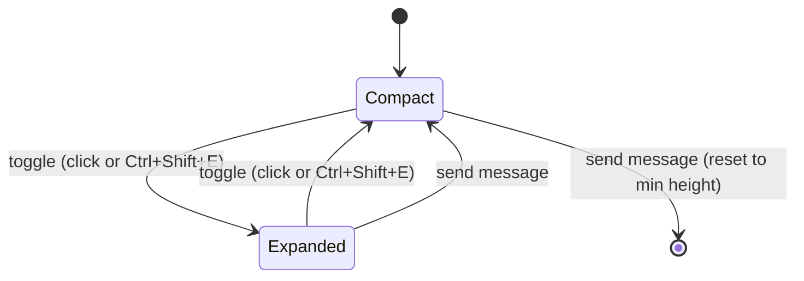

<!-- PE-REVIEWED -->
# Design Document: Chat Input Auto-Resize

## Overview

This design enhances the existing `ChatInput` component to provide a smooth, accessible auto-resize experience for long-form text input. The current implementation uses a `<textarea>` with `rows={2}` and an `adjustHeight` function that clamps at `MAX_ROWS = 20`. While functional, it lacks CSS transitions for smooth growth, has no expanded editing mode, and provides no feedback on message length.

The feature introduces three key capabilities:

1. **Smooth auto-grow** — CSS `transition` on the textarea height so growth/shrink animates over ≤150ms instead of snapping.
2. **Expanded mode** — A toggle that increases the textarea max-height to 60% of the viewport, giving users room to review long prompts. The ChatPage message list shrinks accordingly via the existing `flex-1` layout.
3. **Keyboard shortcut & accessibility** — `Ctrl/Cmd+Shift+E` to toggle expanded mode, with `aria-expanded`, `aria-label`, and `aria-live` announcements for screen readers.

All changes are scoped to the frontend React layer (`ChatInput.tsx` and its parent layout in `ChatPage.tsx`). No backend changes are required.

## Architecture

### Current Architecture

```
ChatPage (flex-col)
├── ChatHeader (tabs)
├── flex-1 overflow container
│   ├── Messages list (flex-1, overflow-y-auto)
│   └── ChatInput (px-4 pb-4 pt-2)
│       ├── AttachedFileChips
│       ├── FileAttachmentPreview
│       ├── textarea (rows=2, adjustHeight clamps at MAX_ROWS)
│       ├── Send/Stop button
│       └── Bottom row (attach, TSCC, context ring, /commands hint)
└── Right sidebars
```

### Proposed Architecture

The existing flex layout already handles the message-list / input split correctly: the message list is `flex-1 overflow-y-auto` and ChatInput sits below it. When ChatInput grows, the message list shrinks automatically. No structural changes to ChatPage are needed — only ChatInput internals change.

```
ChatInput (enhanced)
├── [existing] AttachedFileChips, FileAttachmentPreview, fileError
├── textarea
│   ├── CSS transition: height 150ms ease-out
│   ├── Compact mode: max-height = MAX_ROWS * lineHeight (unchanged)
│   └── Expanded mode: max-height = 60vh
├── [NEW] Expand/Collapse toggle button (visible when lines > 3 OR expanded)
├── [NEW] Line count indicator (visible when lines > 5)
├── Send/Stop button
├── [NEW] aria-live region for mode announcements
└── Bottom row (unchanged)
```



### Design Decisions

1. **No new component extraction** — The expand/collapse logic is tightly coupled to the textarea ref and height management. Extracting a separate component would require prop-drilling the ref and duplicating state. Keeping it in `ChatInput` is simpler.

2. **Transition via class toggle, not CSS `transition` on height** — The existing `adjustHeight` resets `el.style.height = 'auto'` to measure `scrollHeight`, then sets the final height. A CSS `transition: height` would animate the `auto` reset, causing a visible flicker/collapse on every keystroke. Instead, we use a two-step approach: (a) temporarily remove the transition class before measuring, (b) set the final height, (c) re-add the transition class in a `requestAnimationFrame`. This ensures smooth animation only on mode toggles (compact↔expanded) and send-reset, not on every keystroke. Alternatively, we can skip CSS transitions on auto-grow entirely and only animate the mode toggle via a JS-driven height interpolation using `requestAnimationFrame`.

3. **60vh via CSS, not JS calculation** — Using `60vh` as the expanded max-height is simpler and responsive to window resizes without a `ResizeObserver`. The `adjustHeight` function reads `maxHeightRef.current` which we update based on mode.

4. **Flex layout handles message list adjustment** — Because the ChatPage uses `flex-col` with the message list as `flex-1`, increasing ChatInput's height automatically reduces the message list. No explicit coordination needed (Requirement 5 is satisfied by the existing layout).

5. **`useCallback` for keyboard handler** — The `Ctrl+Shift+E` shortcut is handled inside the existing `handleKeyDown`, avoiding a separate global listener and keeping the shortcut scoped to when the textarea is focused.

6. **Per-tab `isExpanded` via the existing `tabMapRef` state map; per-tab `inputValue` via a separate lightweight ref map** — The existing `useUnifiedTabState` hook maintains a per-tab state map (`tabMapRef`) that stores `messages`, `sessionId`, and `pendingQuestion` per tab. We extend this map to also store `isExpanded` per tab. However, `inputValue` is NOT added to `UnifiedTab` because `tabMapRef` is serialized to `open_tabs.json` every 500ms (debounced). Persisting potentially large draft text to disk on every keystroke is unnecessary IO. Instead, `inputValue` is stored in a separate `useRef<Map<string, string>>` (`inputValueMapRef`) in ChatPage, which is never serialized. On tab switch, `handleTabSelect` saves the current tab's `inputValue` into `inputValueMapRef` and `isExpanded` into `tabMapRef`, then restores the target tab's values. `lineCount` is not stored — it is derived from `inputValue` on restore, keeping state minimal and avoiding stale derived data.

**IMPORTANT**: The current codebase has a single `useState` for `inputValue` in ChatPage that is NOT saved/restored per-tab in `handleTabSelect`. This design adds per-tab `inputValue` persistence as a new capability — it does not exist today. The `inputValueMapRef` approach avoids modifying the `UnifiedTab` interface or the serialization pipeline.

## Components and Interfaces

### Modified: `ChatInput` Component

**New Props:**

```typescript
// isExpanded is lifted to ChatPage for per-tab persistence (same pattern as inputValue)
isExpanded: boolean;
onExpandedChange: (expanded: boolean) => void;
```

**New Internal State:**

```typescript
// isExpanded is received as a prop from ChatPage (lifted for per-tab persistence).
// ChatInput calls onExpandedChange(newValue) to update it.

// Current line count for the indicator (derived from inputValue, not persisted per-tab)
const [lineCount, setLineCount] = useState(1);
```

**Per-Tab State Extension (in `useUnifiedTabState` / `tabMapRef`):**

The existing per-tab state map entry is extended with one new optional field:

```typescript
// Added to the TabState interface in useUnifiedTabState
interface TabState {
  // ... existing fields (messages, sessionId, pendingQuestion, isStreaming, abortController, contextWarning)
  isExpanded?: boolean;   // Expanded/compact mode for this tab's ChatInput
}
```

**Per-Tab Input Value Map (separate ref in ChatPage):**

A lightweight ref map stores draft text per-tab without serialization overhead:

```typescript
// In ChatPage — NOT in UnifiedTab to avoid serializing large text to open_tabs.json
const inputValueMapRef = useRef<Map<string, string>>(new Map());
```

**Tab Switch Integration (in `ChatPage.handleTabSelect`):**

When switching tabs, `handleTabSelect` is extended to save and restore `isExpanded` (via `tabMapRef`) and `inputValue` (via `inputValueMapRef`):

```typescript
// Save current tab's ChatInput state before switching
inputValueMapRef.current.set(currentTabId, currentInputValue);  // NEW: save draft text (lightweight ref, no serialization)
updateTabState(currentTabId, {
  // ... existing saves (messages, sessionId, pendingQuestion)
  isExpanded: currentIsExpanded,  // NEW: save expanded mode (in tabMapRef, serialized as boolean)
});

// After selecting new tab, restore its ChatInput state
const tabState = getTabState(tabId);
setIsExpanded(tabState?.isExpanded ?? false);
setInputValue(inputValueMapRef.current.get(tabId) ?? '');
// adjustHeight() is NOT called here — it's internal to ChatInput.
// The existing useEffect([inputValue, adjustHeight]) in ChatInput
// automatically re-runs adjustHeight() when setInputValue fires.
```

This requires lifting `isExpanded` from ChatInput to ChatPage (same pattern as `inputValue` is already lifted), or passing save/restore callbacks as props. The simpler approach: lift `isExpanded` to ChatPage and pass it down as a prop alongside `inputValue`.

**Modified Functions:**

- `adjustHeight()` — Updated to use `60vh`-derived pixel value when `isExpanded` is true, and to count lines for the indicator. Line count is only computed and set via `setLineCount` when the count crosses a visibility threshold (entering or leaving the >5 range), avoiding unnecessary re-renders on every keystroke for short inputs.
- `handleKeyDown()` — Extended to detect `Ctrl+Shift+E` / `Cmd+Shift+E` and toggle `isExpanded`.
- `handleSend()` — Extended to reset `isExpanded` to `false` before clearing the textarea.

**New Functions:**

```typescript
// Toggle between compact and expanded modes, preserving cursor position
const toggleExpanded = useCallback(() => {
  const el = textareaRef.current;
  const selStart = el?.selectionStart ?? 0;
  const selEnd = el?.selectionEnd ?? 0;

  onExpandedChange(!isExpanded);

  // Restore cursor position after React re-render.
  // Use requestAnimationFrame to wait for the DOM update, then restore
  // selection without blur/focus (which would dismiss slash commands
  // and cause a visible focus ring flash).
  requestAnimationFrame(() => {
    if (el) {
      el.selectionStart = selStart;
      el.selectionEnd = selEnd;
      // Scroll cursor into view by computing the cursor's vertical offset
      // relative to the textarea's visible area
      const lineHeight = parseFloat(getComputedStyle(el).lineHeight) || 20;
      const cursorLine = el.value.substring(0, selStart).split('\n').length;
      const cursorTop = (cursorLine - 1) * lineHeight;
      if (cursorTop < el.scrollTop) {
        el.scrollTop = cursorTop;
      } else if (cursorTop + lineHeight > el.scrollTop + el.clientHeight) {
        el.scrollTop = cursorTop + lineHeight - el.clientHeight;
      }
    }
  });
}, [isExpanded, onExpandedChange]);
```

**New JSX Elements:**

1. **Expand/Collapse toggle button** — Rendered next to the send button when `lineCount > 3` or `isExpanded` is true. Uses `aria-label` and `aria-expanded`.

2. **Line count indicator** — A small `<span>` showing `{lineCount} lines`, positioned in the bottom row, visible when `lineCount > 5`.

3. **aria-live region** — A visually-hidden `<div aria-live="polite">` that announces "Input expanded" / "Input collapsed" on mode change.

### Modified: `ChatInput` CSS

The textarea gets a conditional transition class for mode toggles only:

```css
/* Applied to the textarea element ONLY during mode toggle animations */
.chat-textarea-transitioning {
  transition: height 150ms ease-out;
}
```

The transition class is NOT applied during normal auto-grow (typing/pasting), because `adjustHeight()` resets `el.style.height = 'auto'` to measure `scrollHeight` — a CSS transition would animate the `auto` reset, causing a visible flicker/collapse on every keystroke.

Instead, the transition class is toggled via a `isTransitioning` ref:
1. Before mode toggle: add `.chat-textarea-transitioning` class
2. Set the new height
3. After 150ms (transition duration): remove the class

This ensures smooth animation only on expand/collapse toggles and send-reset, not on every keystroke. The class is managed via `textareaRef.current.classList.add/remove()` to avoid React re-renders.

### Modified: `ChatPage`

ChatPage is modified to:

1. **Lift `isExpanded` state** — `const [isExpanded, setIsExpanded] = useState(false)` moves from ChatInput to ChatPage, following the same pattern as `inputValue`. Passed to ChatInput as `isExpanded` and `onExpandedChange` props.

2. **Add `inputValueMapRef`** — `const inputValueMapRef = useRef<Map<string, string>>(new Map())` stores per-tab draft text without serialization overhead. This is separate from `tabMapRef` to avoid writing large text to `open_tabs.json` on every keystroke.

3. **Extend `handleTabSelect`** — Save `isExpanded` into `tabMapRef` and `inputValue` into `inputValueMapRef` before switching, restore from the target tab's state after switching (defaulting to `false` / `''` for new tabs). After restoring `inputValue`, the existing `useEffect([inputValue, adjustHeight])` in ChatInput automatically re-runs `adjustHeight()` — no explicit call from ChatPage is needed since `adjustHeight` is internal to ChatInput.

4. **Extend `handleNewSession`** — Reset `isExpanded` to `false` when creating a new tab.

5. **Extend `handleSendMessage`** — Do NOT reset `isExpanded` in ChatPage's `handleSendMessage`. The reset is handled exclusively by ChatInput's `handleSend` via the `onExpandedChange(false)` callback prop. Duplicating the reset in ChatPage would create a double-reset race condition.

6. **Extend `handleTabClose`** — Clean up the closed tab's entry from `inputValueMapRef` to prevent unbounded memory growth: `inputValueMapRef.current.delete(tabId)`.

7. **Window resize listener** — The resize listener is placed in ChatInput (not ChatPage), since `adjustHeight` and `textareaRef` are internal to ChatInput. Add a `useEffect` that registers a `resize` event listener when `isExpanded` is true. The listener calls `adjustHeight()` (debounced to 100ms) to re-clamp the textarea height when the viewport changes. Cleanup removes the listener when `isExpanded` becomes false or the component unmounts.

The existing flex layout (`flex-1 flex flex-col min-h-0` → messages `flex-1 overflow-y-auto` → ChatInput) automatically adjusts the message list when ChatInput grows. The CSS transition on ChatInput's textarea height ensures the layout shift is smooth (Requirement 5.2).

## Data Models

No new persistent data models are introduced. All state is ephemeral React component state, with per-tab isolation via `tabMapRef` (for `isExpanded`) and a separate `inputValueMapRef` (for draft text):

| State | Type | Scope | Persistence | Per-Tab | Storage |
|-------|------|-------|-------------|---------|---------|
| `isExpanded` | `boolean` | ChatPage (lifted, passed to ChatInput as prop) | None — runtime-only field in `UnifiedTab`, NOT serialized to `open_tabs.json` (tabs always start compact after app restart) | Yes — saved/restored in `tabMapRef` on tab switch | `tabMapRef` (UnifiedTab, runtime-only) |
| `inputValue` | `string` | ChatPage (already lifted) | None — NOT serialized (avoids large text writes to disk) | Yes — saved/restored in `inputValueMapRef` on tab switch | `inputValueMapRef` (separate Map ref) |
| `lineCount` | `number` | ChatInput internal | None (derived from `inputValue`) | No — derived from `inputValue` on restore, no need to persist separately | Computed in `adjustHeight()` |

The existing `inputValue` (lifted to ChatPage), `textareaRef`, and `maxHeightRef` remain unchanged. The `isExpanded` state is lifted to ChatPage (same pattern as `inputValue`) so it can be saved/restored per-tab via `tabMapRef` during `handleTabSelect`. The `inputValue` is stored in a separate `inputValueMapRef` to avoid serializing potentially large draft text to `open_tabs.json` every 500ms. When the user navigates away or switches tabs, each tab's expanded/compact state and draft text are preserved independently.

### Per-Tab State Map Extension

The `tabMapRef` entry (managed by `useUnifiedTabState`) is extended with one new field:

```typescript
// Existing fields preserved:
//   messages, sessionId, pendingQuestion, isStreaming, abortController, contextWarning

// New field for auto-resize per-tab isolation (runtime-only, NOT serialized):
isExpanded?: boolean;   // defaults to false for new tabs and on app restart
```

Note: `isExpanded` is a runtime-only field like `isStreaming` and `abortController`. It is NOT added to `toSerializable()` or `hydrateTab()` — tabs always start in compact mode after app restart. The `toSerializable()` function in `useUnifiedTabState.ts` only extracts `id`, `title`, `agentId`, `isNew`, `sessionId` and does not need modification.

The `inputValueMapRef` is a separate ref in ChatPage:

```typescript
// Lightweight per-tab draft text storage — NOT serialized to open_tabs.json
const inputValueMapRef = useRef<Map<string, string>>(new Map());
```

On tab switch (`handleTabSelect`):
1. **Save** current tab: `updateTabState(currentTabId, { isExpanded })`, `inputValueMapRef.current.set(currentTabId, inputValue)`
2. **Restore** target tab: `setIsExpanded(tabState?.isExpanded ?? false)`, `setInputValue(inputValueMapRef.current.get(tabId) ?? '')`
3. **Auto re-measure**: ChatInput's existing `useEffect([inputValue, adjustHeight])` automatically re-runs `adjustHeight()` when `setInputValue` fires — no explicit call from ChatPage needed
4. `lineCount` is automatically recomputed by `adjustHeight` when `inputValue` changes via the existing `useEffect`.

On tab close (`handleTabClose`):
5. **Cleanup**: `inputValueMapRef.current.delete(tabId)` to prevent unbounded memory growth

### Expanded Mode Max-Height Calculation

```typescript
// In adjustHeight(), the effective max height depends on mode:
const getMaxHeight = (isExpanded: boolean): number => {
  if (isExpanded) {
    return window.innerHeight * 0.6; // 60% of viewport
  }
  return maxHeightRef.current; // MAX_ROWS * lineHeight (existing)
};
```

This is computed on each `adjustHeight` call rather than stored, so it responds to window resizes without a listener.

## Correctness Properties

*A property is a characteristic or behavior that should hold true across all valid executions of a system — essentially, a formal statement about what the system should do. Properties serve as the bridge between human-readable specifications and machine-verifiable correctness guarantees.*

### Property 1: Height clamping invariant

*For any* textarea content (with any scrollHeight) and any maxHeight value, `adjustHeight` shall set the textarea's inline height to `min(scrollHeight, maxHeight)` and set `overflow-y` to `'auto'` when `scrollHeight > maxHeight`, or `'hidden'` otherwise.

**Validates: Requirements 1.1, 1.2, 1.3**

### Property 2: Expand button visibility tracks line count

*For any* line count value, the expand/collapse toggle button shall be visible if and only if `lineCount > 3` or `isExpanded` is true.

**Validates: Requirements 2.1**

### Property 3: Expanded max-height is 60% of viewport

*For any* viewport height and expanded state, when `isExpanded` is true, the effective max-height used by `adjustHeight` shall equal `Math.floor(viewportHeight * 0.6)`. When `isExpanded` is false, it shall equal `MAX_ROWS * lineHeight`.

**Validates: Requirements 2.3**

### Property 4: Send resets expanded mode

*For any* expanded state (true or false) and any non-empty input value, after `handleSend` is called, `isExpanded` shall be `false`.

**Validates: Requirements 2.6, 4.2**

### Property 5: Send resets textarea to minimum

*For any* input value and any prior textarea height, after `handleSend` is called, the textarea's inline height style shall be cleared (falling back to `rows={2}` minimum) and `overflow-y` shall be `'hidden'`.

**Validates: Requirements 4.1, 4.3**

### Property 6: Toggle is an involution (round-trip)

*For any* initial expanded state, calling `toggleExpanded` twice shall return `isExpanded` to its original value.

**Validates: Requirements 3.1**

### Property 7: Cursor position preservation across mode toggle

*For any* text content and any valid cursor position (`selectionStart`, `selectionEnd` within `[0, text.length]`), toggling between compact and expanded mode shall preserve both `selectionStart` and `selectionEnd`.

**Validates: Requirements 6.1, 6.2**

### Property 8: Accessibility attributes match expanded state

*For any* boolean value of `isExpanded`, the expand/collapse toggle button shall have `aria-expanded` equal to that boolean, and `aria-label` equal to `"Expand input"` when `isExpanded` is false or `"Collapse input"` when `isExpanded` is true.

**Validates: Requirements 7.1, 7.2**

### Property 9: Line count indicator visibility and accuracy

*For any* text string, the line count indicator shall be visible if and only if the number of lines exceeds 5, and when visible, the displayed count shall equal the actual number of lines in the text (counted as `text.split('\n').length`).

**Validates: Requirements 9.1**

### Property 10: Tab state round-trip preservation

*For any* two tabs (A and B) where Tab A has any `isExpanded` boolean and any `inputValue` string, switching from Tab A to Tab B and then back to Tab A shall restore Tab A's `isExpanded` and `inputValue` to their exact original values.

**Validates: Requirements 10.1, 10.3**

### Property 11: Toggle isolation across tabs

*For any* set of N open tabs each with an arbitrary `isExpanded` state, toggling `isExpanded` on one tab shall leave all other tabs' `isExpanded` values unchanged.

**Validates: Requirements 10.2**

### Property 12: Window resize re-clamps expanded height

*For any* viewport height change while `isExpanded` is true, `adjustHeight` shall recompute the max-height as `window.innerHeight * 0.6` and re-clamp the textarea height to `min(scrollHeight, newMaxHeight)`.

**Validates: Requirements 2.3 (responsive to viewport changes)**

## Error Handling

| Scenario | Handling |
|----------|----------|
| `textareaRef.current` is null during `adjustHeight` | Early return (existing guard). No crash. |
| `window.innerHeight` is 0 or undefined | `getMaxHeight` falls back to `maxHeightRef.current` (the compact max). Expanded mode degrades to compact. |
| `getComputedStyle(el).lineHeight` returns `'normal'` | Existing fallback: `parseFloat(...) \|\| 20` defaults to 20px. No change needed. |
| `selectionStart`/`selectionEnd` out of range after content change | The browser clamps selection indices to `[0, value.length]` automatically. No explicit guard needed. |
| `requestAnimationFrame` callback fires after unmount | The cursor restore in `toggleExpanded` uses `rAF`. If the component unmounts between toggle and rAF, `textareaRef.current` will be null and the callback is a no-op. |
| Keyboard shortcut conflicts | `e.preventDefault()` is called for `Ctrl+Shift+E` / `Cmd+Shift+E` only when the textarea is focused, minimizing conflict with browser or OS shortcuts. |
| Tab switch with no saved state | `getTabState` returns `undefined` for new tabs. Restore defaults to `isExpanded: false`, `inputValue: ''`. No crash. |
| Rapid tab switching during `adjustHeight` | `adjustHeight` reads `textareaRef.current` which may be mid-transition. The existing null guard (`if (!el) return`) handles this. The CSS transition ensures smooth visual recovery. |
| Window resize while in expanded mode | `adjustHeight` recomputes `window.innerHeight * 0.6` on every call, so it naturally adapts. However, if the window shrinks below the textarea's current content, the textarea could overflow. Add a `resize` event listener (in a `useEffect` with cleanup) that calls `adjustHeight()` when `isExpanded` is true. Debounce to 100ms to avoid excessive reflows. |

## Testing Strategy

### Property-Based Testing

**Library:** `fast-check` (already in `devDependencies` at `^4.5.3`)
**Runner:** `vitest` (already configured)
**Minimum iterations:** 100 per property test

Each property test must reference its design document property with a comment tag:
```
// Feature: chat-input-auto-resize, Property N: <property text>
```

**Property tests to implement:**

| Property | Test Approach | Generator Strategy |
|----------|--------------|-------------------|
| P1: Height clamping | Generate random `scrollHeight` (1–2000) and `maxHeight` (100–800). Mock textarea element, call `adjustHeight`, assert `height = min(scrollHeight, maxHeight)` and correct `overflow-y`. | `fc.integer({min:1, max:2000})` for scrollHeight, `fc.integer({min:100, max:800})` for maxHeight |
| P2: Expand button visibility | Generate random `lineCount` (0–100) and `isExpanded` (boolean). Assert button visible iff `lineCount > 3 \|\| isExpanded`. | `fc.integer({min:0, max:100})`, `fc.boolean()` |
| P3: Expanded max-height | Generate random `viewportHeight` (200–2000) and `isExpanded` (boolean). Assert correct max-height value. | `fc.integer({min:200, max:2000})`, `fc.boolean()` |
| P4: Send resets expanded | Generate `isExpanded` (boolean) and non-empty input string. Call `handleSend`, assert `isExpanded === false`. | `fc.boolean()`, `fc.string({minLength:1})` |
| P5: Send resets textarea | Generate any input string. Call `handleSend`, assert height style cleared and overflow-y hidden. | `fc.string({minLength:1})` |
| P6: Toggle round-trip | Generate initial `isExpanded` (boolean). Toggle twice, assert state equals initial. | `fc.boolean()` |
| P7: Cursor preservation | Generate text string and valid cursor positions. Toggle mode, assert selectionStart/selectionEnd preserved. | `fc.string()`, then derive valid positions with `fc.integer({min:0, max:text.length})` |
| P8: Accessibility attributes | Generate `isExpanded` (boolean). Assert `aria-expanded` and `aria-label` match. | `fc.boolean()` |
| P9: Line count indicator | Generate multi-line strings (0–50 lines). Assert indicator visible iff lines > 5, and displayed count matches. | `fc.array(fc.string(), {minLength:0, maxLength:50})` joined with `\n` |
| P10: Tab state round-trip | Generate random `isExpanded` (boolean) and `inputValue` (string) for Tab A. Simulate save → switch to Tab B → switch back to Tab A. Assert `isExpanded` and `inputValue` match originals. | `fc.boolean()`, `fc.string()` |
| P11: Toggle isolation | Generate N tabs (2–5) each with random `isExpanded` (boolean). Toggle one tab's `isExpanded`. Assert all other tabs' `isExpanded` values are unchanged. | `fc.array(fc.boolean(), {minLength:2, maxLength:5})`, `fc.integer({min:0, max:N-1})` |

### Unit Tests (Examples & Edge Cases)

Unit tests complement property tests by covering specific interactions and edge cases:

- **Example:** Clicking expand button transitions to expanded mode (Req 2.2)
- **Example:** Clicking collapse button returns to compact mode (Req 2.5)
- **Example:** `Ctrl+Shift+E` calls `preventDefault()` (Req 3.2)
- **Example:** Tooltip on toggle button contains shortcut hint (Req 3.3)
- **Example:** `aria-live` region announces mode change (Req 7.3)
- **Example:** Toggle button is not disabled during streaming (Req 8.1)
- **Example:** Textarea is disabled but expanded during streaming (Req 8.2)
- **Example:** Textarea re-enables after streaming completes while expanded (Req 8.3)
- **Example:** Textarea has `rows={2}` attribute (Req 1.5)
- **Example:** Textarea has CSS transition class for height (Req 1.4)
- **Edge case:** Empty string input — line count should be 1, indicator hidden
- **Edge case:** Single character input — no expand button, no line count
- **Edge case:** Exactly 3 lines — expand button should NOT be visible (boundary)
- **Edge case:** Exactly 4 lines — expand button should be visible (boundary)
- **Edge case:** Exactly 5 lines — line count indicator should NOT be visible (boundary)
- **Edge case:** Exactly 6 lines — line count indicator should be visible (boundary)

**Per-Tab Isolation (Req 10):**
- **Example:** New tab initializes with `isExpanded=false`, empty textarea, `lineCount=1` (Req 10.5)
- **Example:** Switching tabs restores the target tab's expanded mode (Req 10.1)
- **Example:** Switching tabs restores the target tab's textarea content (Req 10.3)
- **Example:** Line count indicator updates correctly after tab switch restores multi-line content (Req 10.4)
- **Edge case:** Switching to a tab that was never interacted with — defaults to compact, empty

### Test File Organization

```
desktop/src/pages/chat/components/
├── ChatInput.test.tsx                    # Existing integration tests (unchanged)
├── ChatInput.autoresize.test.tsx         # New: unit tests for auto-resize feature
└── ChatInput.autoresize.property.test.tsx # New: property-based tests for auto-resize
```
