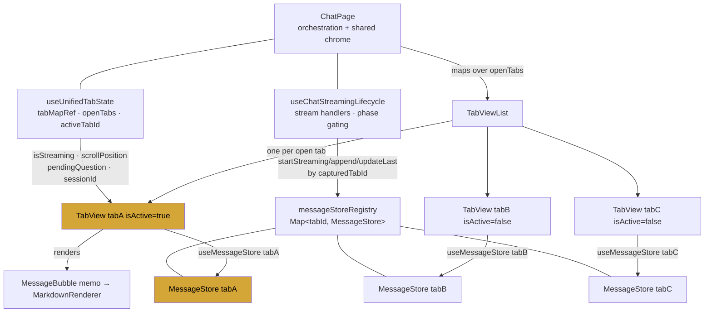
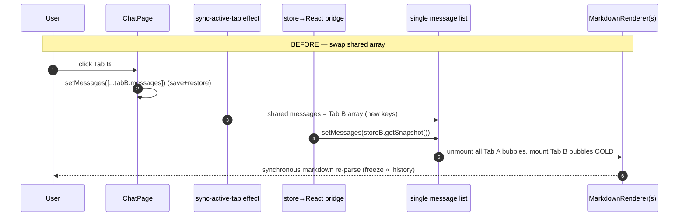

# Design Document

## Overview

This feature restructures the SwarmAI chat rendering layer so that each open tab
owns a **persistently mounted** message-list view (`TabView`) that subscribes
directly to its own per-tab `MessageStore`. It eliminates the single shared
`messages` `useState` in `ChatPage` as the **authoritative display source**.

Today there is exactly one rendered message list in `ChatPage`. It reads from a
single shared `messages` React state, which is a swapped mirror of whichever tab
is active. On every tab switch the array is replaced wholesale
(`setMessages([...activeTabState.messages])` and the store→React bridge effect in
`useChatStreamingLifecycle` calling `setMessages(store.getSnapshot())`). React
diffs the new array against the old one, sees a completely different set of
`message.id` keys, and **unmounts every `MarkdownRenderer` and mounts the
destination tab's bubbles cold**. Each cold `MarkdownRenderer` synchronously
re-parses its markdown (react-markdown + remarkGfm + remarkBreaks), so the freeze
scales with the destination tab's history length. `React.memo(MessageBubble)`
cannot help, because there is no prior render of those bubbles to compare against.

The fix is structural rather than additive. We render **N `TabView` instances**
(one per open tab), keep all of them mounted, and toggle visibility with CSS
(`display:none` for background tabs). The active `TabView` is visible; background
`TabView`s remain mounted but hidden. A tab switch becomes a visibility toggle:
zero remount, zero `Markdown_Re_Parse`. Each `TabView` reads its messages from its
own `MessageStore` via `useMessageStore(tabId)` — the store is already the per-tab
single source of truth (`messageStoreRegistry`, keyed by `tabId`), and streaming
writes already target it via `messageStoreRegistry.get(capturedTabId)`.

The shared `messages` mirror is **demoted**, not blindly deleted. It is retained
only for non-authoritative, active-tab-scoped concerns (e.g. voice TTS text
extraction) and is never again the source that determines which messages a
`TabView` renders. `tabMapRef` remains the authoritative per-tab state store for
non-message UI state (`sessionId`, `isStreaming`, `pendingQuestion`,
`pendingPermissionRequestId`, `scrollPosition`), exactly as documented in the
`multi-tab-isolation-principles` steering. This design preserves every existing
isolation invariant.

### Goals

- One mounted `TabView` per open tab; only the active one is visible (Req 1).
- Each `TabView` subscribes to its own tab's `MessageStore` (Req 2, 4).
- Tab switch is a visibility toggle: no remount, no markdown re-parse (Req 1, 3).
- Streaming hot path stays scoped to the streaming bubble in its tab (Req 8).
- Background streaming writes only to its own tab's store/view (Req 4, 5, 14).
- Per-tab UI state (scroll, draft, pending question/permission) preserved (Req 9).
- Tab close destroys both the `TabView` and the `MessageStore` (Req 11, 12).
- Optimistic-echo / `client_id` reconcile and camelCase `Read_Model` intact (Req 13).

### Non-Goals

- No backend session routing/durability changes (owned by
  `session-state-source-of-truth`).
- No virtualization/windowing (rejected in favor of keep-mounted given 1–4 tabs).
- No re-fix of the streaming block-append issue (already fixed; must not regress).

## Architecture

### High-Level: Before vs After

**Before** — a single list bound to one shared `messages` state:

```
                       ┌──────────────────────────────────────────┐
   stream writes ──▶   │ MessageStore(tabA)  MessageStore(tabB) …  │  messageStoreRegistry
                       └───────┬──────────────────────────────────┘
                               │ bridge effect (active tab only):
                               │ store.subscribe → setMessages(getSnapshot())
                               ▼
                    ChatPage `messages` useState   ◀── swapped on every tab switch
                               │                       (setMessages([...activeTabState.messages]))
                               ▼
                    ONE <div> message list  ──▶  MessageBubble[]  (remount on switch ⇒ re-parse)
```

**After** — N keep-mounted views, each bound to its own store:

```
   stream writes ──▶  MessageStore(tabA)   MessageStore(tabB)   MessageStore(tabC)
                            │                    │                    │
            useMessageStore(tabA)   useMessageStore(tabB)   useMessageStore(tabC)
                            │                    │                    │
                       TabView(A)            TabView(B)            TabView(C)
                       visible               display:none          display:none
                            │                    │                    │
                       MessageBubble[]      MessageBubble[]      MessageBubble[]
                       (mounted)            (mounted, hidden)    (mounted, hidden)

   tab switch  =  flip which TabView has display:none  (no unmount, no re-parse)
```

### Component Diagram



### Layering and Ownership

| Concern | Owner (authoritative) | Display path after refactor |
|---|---|---|
| Per-tab message data | `MessageStore` (per `tabId`) | `TabView` via `useMessageStore(tabId)` |
| Per-tab non-message UI state | `tabMapRef` (`UnifiedTab`) | passed to `TabView` as props / read by `TabView` |
| Tab set + active id | `useUnifiedTabState` | drives the `openTabs.map()` and `isActive` |
| Streaming writes | stream handlers → store by `capturedTabId` | propagate via each store's own subscription |
| Shared `messages` useState | demoted (non-authoritative) | NOT a `TabView` display source |

The key structural change: the **store subscription moves from a single
ChatPage-level bridge effect into each `TabView`**. Instead of one effect mirroring
the active tab's store into shared `messages`, every tab's view is independently
and permanently subscribed to its own store. Background tabs update their own
(hidden) DOM; the active tab is unaffected.

## Components and Interfaces

### New Component: `TabView`

`TabView` is the per-tab message-list view. One instance is mounted per open tab.
It owns everything that today lives inside ChatPage's single scroll `<div>`: the
scroll container, the "Load earlier messages" control, the `WelcomeScreen`
empty-state, the message map (`MessageBubble[]`), the streaming indicators, and
the `messagesEndRef` scroll anchor.

```typescript
// desktop/src/pages/chat/components/TabView.tsx
export interface TabViewProps {
  /** Registry key — selects this view's own MessageStore. */
  tabId: string;
  /** Whether this tab is the Active_Tab (controls visibility, not mounting). */
  isActive: boolean;
  /** Per-tab session id (from tabMapRef) for action callbacks + button props. */
  sessionId?: string;
  /** Authoritative per-tab streaming flag (from tabMapRef, Req 7). */
  isStreaming: boolean;
  /** Per-tab pending question / permission (from tabMapRef, Req 9). */
  pendingQuestion: PendingQuestion | null;
  pendingPermissionRequestId: string | null;
  /** Per-tab context warning (display mirror; only last assistant uses it). */
  contextWarning: ContextWarning | null;
  /** Reconnection/resume flags for the streaming indicator. */
  isReconnecting?: boolean;
  isResuming?: boolean;
  /** Stable callbacks (latest-ref pattern in ChatPage) — keep memo intact. */
  onAnswerQuestion: (toolUseId: string, answers: Record<string, string>) => void;
  onPermissionDecision: (requestId: string, decision: 'approve' | 'deny') => void;
  onEscalationSelect: (escalationId: string, optionLabel: string) => void;
  onCancelQueued: (tabId: string) => void;
  onContinue: () => void;
  onFocusClick: (title: string) => void;
  onItemClick: (...) => void;
  /** Lazy-load trigger: called when this tab first becomes active with a
   *  sessionId but an empty store (Req 10.2). */
  onFirstActivate: (tabId: string) => void;
  /** Infinite scroll: load older page for this tab. */
  onLoadOlder: (tabId: string) => void;
  hasMoreMessages: boolean;
  isLoadingOlderMessages: boolean;
}
```

Internals of `TabView`:

```typescript
export const TabView: React.FC<TabViewProps> = (props) => {
  const { tabId, isActive } = props;

  // (R2.1, R4.1) Authoritative message source — this tab's own store.
  const result = useMessageStore(tabId);
  const messages = result?.messages ?? [];

  // (R2.4, R8.x) Per-tab derived values computed HERE, scoped to this tab.
  const lastAssistantIdx = useMemo(/* reduce over messages */, [messages]);
  const lastResumeBoundaryIdx = useMemo(/* reduce over messages */, [messages]);
  const displayedActivity = useStreamingActivity(props.isStreaming, messages); // per-tab

  // (R9.1) Own scroll container ref — DOM scroll naturally preserved while mounted.
  const containerRef = useRef<HTMLDivElement>(null);
  const endRef = useRef<HTMLDivElement>(null);

  // (R10.2) Lazy load on first activation.
  const didActivateRef = useRef(false);
  useEffect(() => {
    if (isActive && !didActivateRef.current) {
      didActivateRef.current = true;
      props.onFirstActivate(tabId);
    }
  }, [isActive, tabId]);

  return (
    <div
      aria-hidden={!isActive}
      style={{ display: isActive ? 'flex' : 'none' }}
      className="flex-1 flex flex-col min-h-0"
    >
      {/* scroll container + Load-earlier + WelcomeScreen + MessageBubble[] +
          streaming indicators + endRef — all per-tab, identical markup to the
          current ChatPage list, just scoped to THIS store's messages */}
    </div>
  );
};
```

Notes:

- `display:none` keeps the subtree mounted but unrendered (no layout/paint),
  satisfying Req 1.3/1.4. React does **not** unmount the children, so no
  `MarkdownRenderer` re-parse occurs on switch (Req 1.5, 3.1, 3.4).

> **Amended by PE Review F2 (see "PE Review Resolutions"):** mounting ALL N
> TabViews with their (preloaded) histories at startup just relocates the markdown
> parse storm from switch-time to startup-time (N× cold parse on app open). The
> TabView therefore uses **mount-on-first-activation, keep-mounted-thereafter**: a
> never-activated tab renders a lightweight placeholder (no message list, no parse);
> on first activation it mounts content and stays mounted. First switch to a tab
> pays one parse (unavoidable); startup and repeat switches do not. See F2.
- `aria-hidden` on background views keeps assistive tech focused on the active
  conversation only.
- `useMessageStore(tabId)` already exists and returns `{ messages, store }`,
  subscribing via the store's rAF-gated notifications.

### Changed Component: `ChatPage` (renders N `TabView`s)

`ChatPage` stops rendering one inline message list. Instead it maps over
`openTabs` and renders a `TabView` per tab, marking exactly one active:

```tsx
<div className="flex-1 flex flex-col min-h-0 relative">
  {openTabs.map((tab) => {
    const ts = tabMapRef.current.get(tab.id);
    return (
      <TabView
        key={tab.id}
        tabId={tab.id}
        isActive={tab.id === activeTabId}
        sessionId={ts?.sessionId}
        isStreaming={!!ts?.isStreaming}            // Req 7: from tabMapRef
        pendingQuestion={ts?.pendingQuestion ?? null}
        pendingPermissionRequestId={ts?.pendingPermissionRequestId ?? null}
        contextWarning={ts?.contextWarning ?? null}
        isReconnecting={ts?.isReconnecting}
        isResuming={ts?.isResuming}
        onAnswerQuestion={stableHandleAnswerQuestion}
        onPermissionDecision={stableHandlePermissionDecision}
        onEscalationSelect={handleEscalationSelect}
        onCancelQueued={handleCancelQueued}
        onContinue={handleContinue}
        onFocusClick={handleFocusClick}
        onItemClick={handleItemClick}
        onFirstActivate={handleTabFirstActivate}
        onLoadOlder={handleLoadOlder}
        hasMoreMessages={/* per-tab; see Data Models */}
        isLoadingOlderMessages={/* per-tab */}
      />
    );
  })}
</div>
```

ChatPage retains shared chrome that is genuinely app-global: `ChatHeader`,
`ChatInput`, the tab bar, modals, toasts, sidebars, the rate-limit indicator.
These are not per-tab message rendering and stay in ChatPage.

> Re-render note (Req 8.3): `openTabs.map` re-running on a render does **not**
> re-parse markdown. `TabView` is wrapped in `React.memo`, so a parent render with
> unchanged props for tab B skips B's reconciliation entirely. Background tab
> token updates flow through B's own `useMessageStore` subscription and never
> touch A's or ChatPage's render of A.

### State Ownership After the Change

The authoritative display source becomes **per-tab `MessageStore`**, read inside
each `TabView`. ChatPage's shared `messages`/`setMessages` (from
`useChatStreamingLifecycle`) is **demoted** to a non-authoritative, active-tab
convenience value. We do not delete it outright in one step, because many readers
depend on it; instead each reader is reassigned to an equivalent per-tab source.
The single store→React bridge effect (`useChatStreamingLifecycle` ~line 1039) is
**removed** — its job (mirror active store → shared `messages`) is now done by each
`TabView`'s own `useMessageStore` subscription.

> **Amended by PE Review F1 (see "PE Review Resolutions"):** the bridge is NOT
> deleted outright. Deleting it removes ChatPage's reactivity to active-tab store
> changes, which freezes ChatPage-level consumers that need live messages — notably
> `latestTextContent` (`ChatPage.tsx:289`) feeding voice TTS (`:305/:316`). A
> minimal, NON-authoritative active-tab subscription is retained for those
> consumers. See F1 for the full resolution.

#### Disposition of every current reader of `messages` / `setMessages`

> **Amended by PE Review F3 (see "PE Review Resolutions"):** the table below is
> ChatPage-centric and undercounts the readers. The full verified inventory is
> ~25 sites in `ChatPage.tsx` PLUS ~20 in `useChatStreamingLifecycle.ts`. NOTE
> (corrected): the streaming hot path does NOT dual-write — the `setMessages` at
> hook lines 1900/1921/1956 sits in the `else` branch of `if (textStore)` and only
> fires when the store is null (initial tab before its store exists). It is a
> guarded fallback, not an active-tab mirror. The complete bucketed inventory and
> corrected disposition is in F3. Migration is grep-bound:
> `grep -rn "setMessages(" desktop/src` must reach zero *authoritative-display*
> writes, with the only survivor being the F1 non-authoritative voice mirror.

| Reader (ChatPage / lifecycle hook) | Today | After refactor |
|---|---|---|
| **JSX message list** (`messages.map`, `messages.length===0`) | reads shared `messages` | **Moved into `TabView`**, reads `useMessageStore(tabId).messages` (authoritative) |
| **store→React bridge effect** (`store.subscribe → setMessages`) | mirrors active store → shared state | **Deleted**; each `TabView` subscribes to its own store |
| `loadSessionMessages` (`setMessages(formatted)` + seed store) | sets shared state + `store.replace` | Keeps `store.replace(formatted)` into the **target tab's** store; drops `setMessages` (store subscription drives the view). Still seeds `tabState.messages` cache + sets `sessionId`/`hasMoreMessages` per tab |
| `reconcileTabFromDb` (`store.replace` + `setMessages` if active) | replace + active mirror | Keeps `store.replace`; drop the `if active → setMessages` mirror (view follows store) |
| `handleNewChat` (`store.replace([])` + `setMessages([])`) | clears store + shared | Keep `store.endStreaming?/replace([])` on the tab; drop `setMessages([])` |
| `handleNewSession` (`setMessages([])` for new tab) | resets shared | New tab's store starts empty via `getOrCreate`; drop `setMessages([])` |
| `handleTabSelect` (restore branch: `store.replace` + `setMessages(tabState.messages)`) | seed store + mirror | Keep restoring per-tab non-message state (sessionId, pendingQuestion, scroll); **drop message mirroring** — target `TabView` already shows its store |
| `handleTabClose` (`setMessages([])` after closing last tab) | resets shared | Drop; the auto-created tab's empty store renders WelcomeScreen |
| `sync-active-tab` effect (`setMessages([...activeTabState.messages])`) | swaps shared array on activeTabId change | **Deleted** — this swap was the root cause of remount/re-parse |
| `loadOlderMessages` (`setMessages(prev => mergeOlderMessages(...))`) | prepends to shared | Becomes `handleLoadOlder(tabId)`: prepend via the **tab's store** (new `store.prepend`/`replace(merged)`), scoped per tab |
| `latestTextContent` (voice TTS) `useMemo([messages])` | derives from shared | Reads **active tab's** store snapshot: `messageStoreRegistry.get(activeTabId)?.messages`. Non-authoritative display concern → allowed by Req 2.3/2.5 |
| `lastAssistantIdx` `useMemo([messages])` | over shared | **Moved into `TabView`**, computed per-tab over that tab's store messages |
| `lastResumeBoundaryIdx` `useMemo([messages])` | over shared | **Moved into `TabView`**, per-tab |
| `deriveStreamingActivity` / `displayedActivity` | over shared `messages` | **Moved into `TabView`** (or a `useStreamingActivity(tabId)` hook) scoped to that tab's store + its `isStreaming` |
| `messagesRef` (`messagesRef.current = messages`) used by `handleSendMessage`, `loadOlderMessages` | mirror of shared | Replace reads with the **active tab's** `store.messages` (or `tabState.messages` cache). `handleSendMessage` already inserts via `insertOptimisticMessages → store.appendMany` |
| scroll effects keyed on `[messages]` (auto-scroll, prepend preserve, tab-switch restore) | shared array deps | **Moved into `TabView`**, keyed on that tab's store messages; tab-switch DOM-jump restore largely **eliminated** (see Scroll) |
| `messagesEndRef` (scroll anchor) | single ref in ChatPage | **Per-`TabView`** local ref |
| streaming indicators / fallback spinner / sticky indicator | shared `messages` + `displayedActivity` | **Moved into `TabView`**, per-tab |

Result: `setMessages` survives only as a thin, optional compatibility shim (or is
removed entirely). It is **never** the source a `TabView` reads from, satisfying
Req 2.2, 2.5, and Req 14.1 (React display values mirror the active tab only, while
`tabMapRef` + per-tab stores remain authoritative).

#### Streaming-status single source (Req 7)

`TabView.isStreaming` is passed from `tabMapRef.current.get(tab.id).isStreaming`.
No second authoritative streaming flag is introduced. When `setIsStreaming(value,
tabId)` mutates the tab's `isStreaming` (synchronously, per existing invariant 9),
ChatPage re-renders via the existing render counter / `bumpStreamingDerivation`,
and the affected `TabView` receives the new `isStreaming` prop. The
`MessageStore.phase` (`'streaming' | 'idle'`) remains an **internal gate** for the
store's own write coordination — it is not a competing display truth source.

### Tab Switch Flow: Before vs After



```mermaid
sequenceDiagram
    autonumber
    participant U as User
    participant CP as ChatPage
    participant TVA as TabView A (visible)
    participant TVB as TabView B (hidden, mounted)

    Note over U,TVB: AFTER — visibility toggle
    U->>CP: click Tab B
    CP->>CP: selectTab(B) → activeTabId = B (render counter bump)
    CP->>TVA: isActive=false → style display:none
    CP->>TVB: isActive=true → style display:flex
    Note over TVB: already mounted; bubbles already parsed
    TVB-->>U: visible immediately (no remount, no re-parse)
```

The "after" path performs only a CSS visibility flip on two already-mounted
subtrees. No `message.id` keys change, no `MarkdownRenderer` mounts, so there is no
`Markdown_Re_Parse` and the switch is bounded well under 100 ms regardless of
history size (Req 3.2, 3.3, 3.4).

### Streaming Hot Path (Req 8)

The per-token write path is unchanged at the store layer. Stream handlers in
`useChatStreamingLifecycle` call `messageStoreRegistry.get(capturedTabId)` and then
`store.updateLast((m) => applyTextDelta(m, ...), (m) => m.id === assistantMessageId)`.
`updateLast` produces a new array reference but **reuses the same object reference
for every non-streaming message**, so within the owning `TabView`,
`React.memo(MessageBubble)` short-circuits all historical bubbles; only the
streaming bubble (whose `message` ref changed) re-renders (Req 8.1, 8.2).

Because each `TabView` subscribes to its **own** store, a background tab's tokens
fire that tab's subscription only. The active `TabView`'s `useMessageStore` is a
different store with a different listener set — it is not notified, so the active
view does not re-render on background tokens (Req 8.3, 4.4, 5.2, 5.4). The hidden
`TabView` still updates its own (display:none) DOM, so when the user switches back,
accumulated background content is already present (Req 5.3).

> rAF/AppNap note: `MessageStore._notify()` already has a 100 ms `setTimeout`
> fallback for when Tauri WebView throttles `requestAnimationFrame` on background
> views. A hidden (`display:none`) `TabView` still receives notifications and
> commits to its detached-from-paint DOM; nothing here regresses that path.
>
> **Amended by PE Review F6:** the rationale above is imprecise. `requestAnimationFrame`
> is **window-global** and is NOT gated by an element's `display:none` — a hidden
> TabView's store flushes via rAF normally. The 100 ms `setTimeout` fallback only
> matters when the ENTIRE Tauri webview is backgrounded/AppNapped (window-level rAF
> throttling). Conclusion (hidden tabs stay current) is unchanged.

### Scroll Preservation (Req 9.1)

Today scroll position is explicitly saved (`scrollPosition` in `tabMapRef`) on tab
switch and restored via a `useLayoutEffect` that sets `container.scrollTop` after
the swapped array commits — necessary precisely because the DOM node's children
were torn down and rebuilt.

With keep-mounted views the scroll container DOM node is **never destroyed**, so
the browser preserves `scrollTop` natively across switches. The explicit
save/restore-on-switch becomes unnecessary for the common case and is **removed**
from the switch path. We retain:

- **Per-`TabView` auto-scroll-to-bottom** on new messages, gated by that view's
  own `userScrolledUp` ref (so streaming in a background view doesn't fight the
  user). Moved into `TabView`.
- **Prepend scroll preservation** for "Load earlier" (compute `scrollHeight`
  delta), scoped to the `TabView`'s own container.

`scrollPosition` in `UnifiedTab` is kept only as a **persistence** value for
restart restore (where views are freshly mounted and there is no live DOM to
inherit). It is no longer read on in-session switches. This simplifies the
two `useLayoutEffect` scroll-restore blocks down to one local effect per view.

### Lifecycle Integration with `useUnifiedTabState`

| Lifecycle event | `useUnifiedTabState` | `TabView` / store effect |
|---|---|---|
| App start | `restoreFromFile()` populates `tabMapRef` + `openTabs` | `openTabs.map` mounts a `TabView` per restored tab (Req 10.1) |
| First view of a restored tab | `activeTabId` set | `TabView.onFirstActivate(tabId)` → `loadSessionMessages` into that tab's store, phase-gated (Req 10.2, 10.3) |
| New tab | `addTab` + `initTabState(id, [])` | new `TabView` mounts; `getOrCreate(id)` store starts empty → WelcomeScreen |
| Tab switch | `selectTab(id)` sets `activeTabId` | `isActive` props flip; visibility toggles (no remount) |
| Tab close | `closeTab(id)` removes from map; aborts stream | `TabView` for `id` unmounts (Req 11.1); `messageStoreRegistry.destroy(id)` (Req 11.2) |
| Memory bound | `compute_max_tabs()` ∈ [1,4] caps `openTabs` | at most `maxTabs` `TabView`s mounted (Req 12.1, 12.2) |

Lazy-load detail (`onFirstActivate`): when a restored tab first becomes active and
its store is empty but it has a `sessionId`, call the existing `loadSessionMessages`
which already (a) checks the streaming phase gate and skips if `tabState.isStreaming`,
and (b) calls `store.replace(formatted)` on the target tab. We change it to target
the **specific tab's** store rather than the shared `messages`. Background restored
tabs continue to be preloaded via the existing `store.reconcile(msgs)` parallel
path in `doRestore`, which is already phase-gated (queues a thunk during streaming
instead of overwriting — Req 10.3).

Tab-close cleanup already calls `messageStoreRegistry.destroy(tabId)` in
`handleTabClose`. `destroy()` clears the rAF id, fallback timer, watchdog timer,
listeners, and messages array — releasing the view's data (Req 11.3, 12.3). The
`TabView` unmounts naturally because `tab.id` leaves `openTabs`, so its
`useMessageStore` effect cleanup runs `unsub()`.

> Edge: destroy-before-unmount ordering. `handleTabClose` calls
> `messageStoreRegistry.destroy(tabId)` and then `closeTab(tabId)`; React unmounts
> the `TabView` on the next commit. Between destroy and unmount the view may
> re-render once. `destroy()` clears listeners and sets `messages = []`; the
> `TabView`'s `useMessageStore` still holds the destroyed store reference and would
> render an empty list for one frame. Because the view is unmounting anyway this is
> invisible, but `useMessageStore`/`TabView` MUST tolerate a destroyed store
> (no throw on empty messages). This is covered by a correctness property below.

## Data Models

### `UnifiedTab` (unchanged shape, clarified roles)

No new fields are required. Existing fields take on these clarified roles:

- `messages: Message[]` — retained as a **cache** for instant first-paint and for
  legacy readers during migration. The authoritative live source is the store;
  `tabState.messages` is kept in sync by the store subscription's tab-cache write.
- `isStreaming: boolean` — authoritative streaming flag (Req 7); feeds
  `TabView.isStreaming`.
- `pendingQuestion`, `pendingPermissionRequestId`, `contextWarning`,
  `isReconnecting`, `isResuming` — per-tab, passed to that `TabView`.
- `scrollPosition?: number` — now **persistence-only** (restart restore), not read
  on in-session switches.

### Per-tab pagination state (new, small)

`hasMoreMessages` / `isLoadingOlderMessages` are today single ChatPage `useState`
values scoped to the active tab. To support per-tab "Load earlier" on
keep-mounted views, move these into `UnifiedTab` (or a parallel
`Map<tabId, {hasMore, loadingOlder}>`):

```typescript
interface UnifiedTab {
  // …existing…
  hasMoreMessages?: boolean;       // default true after a full-page initial load
  isLoadingOlderMessages?: boolean;
}
```

### `MessageStore` / `messageStoreRegistry` (unchanged)

No interface changes are required for the core store. Optionally add a convenience
`prepend(msgs: Message[])` for the "Load earlier" seam-merge (currently done by
`mergeOlderMessages` + `setMessages(prev => …)`); otherwise the existing
`replace(mergeOlderMessages(older, store.messages))` (idle-phase) suffices. The
registry already provides `getOrCreate`, `get`, `destroy`, `clear`, `size`.

`Message` shape is unchanged (`id`, `role`, `content`, `timestamp`, `model`,
optional `isError`, `isQueued`, `evolutionEvent`, `_confirmed` block flag).

## Correctness Properties

*A property is a characteristic or behavior that should hold true across all valid
executions of a system — essentially, a formal statement about what the system
should do. Properties serve as the bridge between human-readable specifications and
machine-verifiable correctness guarantees.*

This feature **is** suitable for property-based testing: the testable invariants
live in the `MessageStore`/`messageStoreRegistry` logic and the view↔store mapping,
which behave
deterministically over a large input space (arbitrary tab sets, message histories,
streaming sequences, and switch orders). UI-feel criteria (visual aesthetics) and
pure architectural boundary clauses are excluded (classified SMOKE/EXAMPLE in
prework). Timing bound 3.2 is validated structurally via the no-remount property
plus a perf integration test, not PBT.

After reflection, overlapping criteria were consolidated: visibility (1.2/1.3) into
one property; no-remount/no-reparse (1.4/1.5/3.1/3.4) into one; content isolation
(2.1/2.5/4.1/4.2/4.3 and the background-append cases 4.4/5.2/5.4/14.2) into one;
per-tab UI state (9.1–9.5) into one; close/destroy (11.1/11.2/11.3/12.3) into one;
view-count/bound (1.1/10.1/12.1/12.2) into one.

### Property 1: One mounted view per open tab, within the tab budget

*For any* list of open tabs (size 1–`maxTabs`, where `maxTabs` ∈ [1,4] from
`ResourceMonitor.compute_max_tabs()`), the number of mounted `TabView` instances
equals the number of open tabs and never exceeds `maxTabs`.

**Validates: Requirements 1.1, 10.1, 12.1, 12.2**

### Property 2: Exactly one visible view, the rest mounted and hidden

*For any* set of open tabs and any chosen `activeTabId`, exactly one `TabView` is
visible (not `display:none`) and it is the active tab's; every other `TabView`
remains mounted with `display:none`.

**Validates: Requirements 1.2, 1.3**

### Property 3: Tab switch is non-destructive (no remount, no re-parse)

*For any* sequence of tab switches over already-mounted tabs, no `TabView` instance
is unmounted or remounted and the cumulative `MarkdownRenderer` parse count of the
destination tab's existing bubbles does not increase.

**Validates: Requirements 1.4, 1.5, 3.1, 3.4**

### Property 4: Cross-tab content isolation

*For any* collection of per-tab `MessageStore`s holding distinct histories, each
`TabView` renders exactly the messages of its own tabId-keyed store; appending to
one tab's store (including background streaming appends) never causes that message
to appear in any other tab's `TabView`.

**Validates: Requirements 2.1, 2.5, 4.1, 4.2, 4.3, 4.4, 5.2, 5.4, 14.2**

### Property 5: Per-tab render isolation

*For any* change notification emitted by `MessageStore(tabX)`, only `TabView(tabX)`
re-renders; no other tab's `TabView` re-renders in response.

**Validates: Requirements 2.4, 8.3**

### Property 6: Streaming hot path stays scoped to the streaming bubble

*For any* sequence of streaming token updates applied to a tab's store via
`updateLast` keyed by `assistantMessageId`, within that tab's `TabView` only the
streaming `MessageBubble` re-renders while every non-streaming historical bubble's
render count remains constant.

**Validates: Requirements 8.1, 8.2**

### Property 7: Switching away from a streaming tab does not abort its stream

*For any* tab that is streaming, switching to another tab leaves that tab's
`abortController` un-aborted and its `MessageStore.phase` equal to `'streaming'`.

**Validates: Requirements 5.1**

### Property 8: Eventual consistency — settled view equals store snapshot

*For any* sequence of store operations (`append`, `appendMany`, `updateLast`,
`replace`, `reconcile`) followed by a notification flush, the messages rendered by
that tab's `TabView` deep-equal `store.getSnapshot()` for that tab.

**Validates: Requirements 5.3, 6.4, 10.4, 13.2**

### Property 9: Optimistic echo reconciles without duplication

*For any* optimistic user message (id prefix `local-`) inserted through a tab's
store, reconciling a DB message whose `metadata.client_id` equals that optimistic
id results in a single merged message for that turn (no duplicate, DB version wins).

**Validates: Requirements 6.1, 13.1**

### Property 10: Streaming status is per-tab and authoritative from tabMapRef

*For any* change to a tab's `isStreaming` value in `tabMapRef`, that tab's
`TabView` reflects the updated streaming status and no other tab's `TabView`
streaming UI changes.

**Validates: Requirements 7.1, 7.3**

### Property 11: Per-tab UI state round-trips and never crosses tabs

*For any* two tabs with distinct scroll position, draft input, pending question, and
pending permission, switching away from a tab and back restores that tab's own
values, and no tab's scroll/draft/pending is ever applied to another tab.

**Validates: Requirements 9.1, 9.2, 9.3, 9.4, 9.5**

### Property 12: First activation lazily loads into the tab's own store

*For any* restored tab that has a `sessionId` and an empty store, the first time it
becomes active the backend message load is invoked exactly once for that tab's
`sessionId` and the results populate that tab's store.

**Validates: Requirements 10.2**

### Property 13: Lazy load is phase-gated and never overwrites in-flight content

*For any* tab whose store phase is `'streaming'`, a lazy backend load does not
overwrite the store's current messages (the reconcile is queued for post-stream
drain).

**Validates: Requirements 10.3**

### Property 14: Closing a tab destroys both its view and its store

*For any* open tab, closing it unmounts its `TabView`, calls
`messageStoreRegistry.destroy(tabId)` (clearing timers and listeners), and leaves
no `TabView` or `MessageStore` retained for that tabId
(`messageStoreRegistry.get(tabId) === undefined`).

**Validates: Requirements 11.1, 11.2, 11.3, 12.3**

### Property 15: Backend calls use the per-tab sessionId

*For any* tab-scoped backend action (stop, answer question, permission decision),
the `sessionId` used is `tabMapRef.get(tabId).sessionId` for that tab, never the
active tab's shared session value.

**Validates: Requirements 14.3**

### Property 16: Concurrent multi-tab streaming stays isolated

*For any* set of tabs streaming concurrently, each tab's `TabView` renders only its
own spinner, messages, and activity, with content and indicators disjoint across
views.

**Validates: Requirements 14.4**

## Compatibility With `session-state-source-of-truth`

This spec owns only the frontend rendering layer. It must not disturb the adjacent
session-state contracts.

### Optimistic echo / `client_id` reconcile path (Req 13.1)

Unchanged in mechanism. `handleSendMessage` → `insertOptimisticMessages(tabId, …)`
→ `messageStoreRegistry.getOrCreate(tabId).appendMany([userMsg, assistantPlaceholder])`.
The optimistic user message keeps its `local-…` id. On the `result` event, the
existing `MessageStore._applyMerge` correlates `dbMessages[i].metadata.client_id`
against local `local-…` ids (`clientIdToLocalIdx`) and replaces the optimistic
message with the DB version — no duplicate. Because the `TabView` reads the same
store, the reconciled set renders automatically (Property 8, 9). The view layer
adds **no** new optimistic path and does not move reconcile ownership.

### camelCase `Read_Model` (Req 13.3)

`pendingQuestion` and `waitingInput` flow unchanged. `pendingQuestion` is per-tab in
`tabMapRef` and passed to `TabView` as a prop; the `TabView` consumes it as-is for
the answerable-question resolution (`resolvePendingToolUseId`). No shape mutation,
no snake_case/camelCase conversion is introduced here — that stays in the services
layer per `swarmai-dev-rules`.

### Ownership boundary (Req 13.4, 14.1)

`tabMapRef` remains the authoritative per-tab state store; backend durability,
coalesce-drain, and `client_id` reconciliation remain owned by
`session-state-source-of-truth`. This spec only relocates the **display** binding
from a shared swapped array to per-tab store subscriptions.

## Error Handling

- **Destroyed store rendered for one frame** (close → unmount race): `useMessageStore`
  and `TabView` must tolerate a destroyed store. `MessageStore.destroy()` sets
  `messages = []` and clears listeners; reads return `[]` and writes are guarded by
  the internal `_destroyed` flag (no throw). The `TabView` renders an empty list
  for at most one frame before unmounting. Covered by Property 14.
- **Lazy load failure**: `loadSessionMessages` already wraps the fetch in
  try/catch with generation/tab/phase guards; on failure the tab's store is left
  untouched and the existing error toast/log path applies. The `TabView` simply
  shows whatever the store currently holds (possibly the WelcomeScreen).
- **Streaming during lazy load**: phase gate in `loadSessionMessages` and
  `MessageStore.reconcile` (NO-OP during `'streaming'`, queues a thunk) prevents
  overwrite. Covered by Property 13.
- **Background-tab rAF throttling** (Tauri AppNap): the store's 100 ms
  `setTimeout` fallback in `_notify()` guarantees a hidden `TabView` still flushes
  accumulated updates; on switch-back the view is already current (Property 8).
- **Error/disconnect handlers**: continue to write to the captured tab's store
  (`errStore.endStreaming(); errStore.replace(applyError(...))`). Because the
  `TabView` subscribes to that store, the error content renders in the correct
  tab's view only (Req 14.x), never leaking into the active tab.
- **`reconcile` invalidation race**: `MessageStore.replace` bumps `_reconcileGen`
  to discard in-flight fetches; unchanged. Prevents a stale DB fetch from clobbering
  an error/replace result.

## Testing Strategy

### Dual approach

- **Property-based tests** validate the 16 universal properties above against the
  `MessageStore`/registry and a lightweight `TabView` render harness.
- **Unit/example tests** cover concrete wiring and edge cases not suited to PBT:
  Read_Model pass-through (13.3), streaming-status prop wiring (7.1), assistant
  placeholder insertion (6.2), and the architectural negatives (2.2, 6.3, 14.1)
  verified by structural assertions (message source is store-only).
- **Integration/perf** covers the 100 ms switch bound (3.2): render two tabs with
  10 and 200 messages, switch, assert no `TabView` unmount/remount and (optionally)
  switch duration is independent of message count.

### Property-based testing setup

- Library: **fast-check** with `@testing-library/react` + Vitest (matches the
  existing `desktop` frontend test stack — `npm test -- --run`).
- Do **not** hand-roll generators or a PBT engine; use fast-check `fc.assert` /
  `fc.property`.
- Minimum **100 iterations** per property (`fc.assert(..., { numRuns: 100 })`).
- Generators: arbitrary tab sets (`fc.array` of tabIds, length 1–4), arbitrary
  `Message[]` per tab (varying roles, content blocks, including `local-` optimistic
  ids and `resume-boundary` system messages), arbitrary switch orders, and
  arbitrary streaming token sequences.
- Render-count / mount-count assertions use a profiling wrapper or a render-counter
  ref injected into `MessageBubble`/`TabView` test doubles; parse-count assertions
  mock `MarkdownRenderer` with a counter.
- Each property test is tagged with a comment referencing its design property:
  `// Feature: chat-tab-view-isolation, Property {n}: {property text}`.

### Unit testing balance

Keep example tests focused on: integration points (ChatPage→TabView prop wiring),
Read_Model shape pass-through, and known edge cases (destroyed-store render, empty
store → WelcomeScreen, single-tab degenerate case). Let property tests carry the
broad input coverage; avoid duplicating their space with many redundant examples.

### Regression guardrails (per `multi-tab-isolation-principles`)

Tests MUST include at least two-tab and concurrent-streaming scenarios (Properties
4, 5, 6, 16) and assert the existing checklist invariants survive: per-tab
`sessionId` for backend calls (Property 15), `setIsStreaming(value, tabId)` always
tab-scoped, stream handlers writing to `capturedTabId`'s store only, and no shared
authoritative message array between views.

## Requirements Coverage Map

| Requirement | Addressed in design sections | Properties |
|---|---|---|
| 1 Keep-mounted per-tab views | Architecture; `TabView`; ChatPage render; Tab Switch Flow | P1, P2, P3 |
| 2 Per-tab store subscription (eliminate mirror) | State Ownership; `TabView` | P4, P5 (2.2/2.3/2.5 structural) |
| 3 Instant switch performance | Tab Switch Flow; Testing (perf) | P3 (3.2 perf/integration) |
| 4 Cross-tab content isolation | State Ownership; Hot Path | P4 |
| 5 Background streaming continuity | Hot Path; Lifecycle | P4, P7, P8 |
| 6 Store as single source for inserts | State Ownership; Compatibility | P8, P9 (6.2 example) |
| 7 Single source for streaming status | State Ownership (streaming status) | P10 |
| 8 Hot path scoped | Hot Path | P5, P6 |
| 9 Per-tab UI state preserved | Scroll Preservation; `TabView` | P11 |
| 10 Initial restore + lazy load | Lifecycle Integration | P1, P12, P13, P8 |
| 11 Close destroys view + store | Lifecycle Integration; Error Handling | P14 |
| 12 Bounded memory within tab budget | Lifecycle Integration | P1, P14 |
| 13 Compatibility with session-state spec | Compatibility | P8, P9 (13.3/13.4 example/structural) |
| 14 No regression of isolation invariants | State Ownership; Hot Path; Regression guardrails | P4, P15, P16 |

## Migration Strategy

This is the most regression-prone area in the codebase, so migration is incremental
and each step is independently verifiable (`cd desktop && npm test -- --run`).

1. **Extract `TabView`** from ChatPage's inline message-list JSX with no behavior
   change: it still receives `messages` as a prop and renders identically. Verify
   visual parity for the single active tab.
2. **Bind `TabView` to its own store**: switch `TabView` to `useMessageStore(tabId)`
   internally; move `lastAssistantIdx`, `lastResumeBoundaryIdx`,
   `deriveStreamingActivity`, scroll refs, and indicators into it. ChatPage still
   renders only the active `TabView`. Verify streaming hot path (Property 6) intact.
3. **Render N keep-mounted `TabView`s**: map over `openTabs`, toggle visibility via
   `display`. Remove the `sync-active-tab` swap effect and the store→React bridge
   effect. Verify Properties 1–5.
4. **Demote shared `messages`**: repoint remaining readers (voice `latestTextContent`,
   `messagesRef`) to the active tab's store snapshot; delete `setMessages` display
   writes. Keep `tabState.messages` cache for first-paint. Verify Properties 8, 4.
5. **Per-tab pagination + scroll cleanup**: move `hasMoreMessages` /
   `isLoadingOlderMessages` per tab; remove switch-time scroll save/restore (native
   DOM preservation). Verify Properties 11.
6. **Lazy-load wiring**: `onFirstActivate` → `loadSessionMessages` into the tab's
   store, phase-gated. Verify Properties 12, 13.

Each step keeps `tabMapRef` authoritative and preserves the existing per-tab
streaming write path, so no isolation invariant is dropped mid-migration. Rollback
is per-step (each is a separate commit gated on green CI).

## PE Review Resolutions (2026-06-20)

A PE-level review verified the design's load-bearing claims against code at HEAD.
Six findings are resolved below. F1 and F2 are HIGH (must be reflected before
implementation); F3 is HIGH (migration-scope correction); F4/F5 are MED; F6 is a
rationale fix. Each amends the sections noted.

### F1 (HIGH) — Keep a minimal active-tab subscription for ChatPage-level consumers

**Problem (verified):** The store→React bridge effect lives at
`useChatStreamingLifecycle.ts:1034-1073`. Deleting it stops ChatPage from
re-rendering on active-tab store changes. `ChatPage.tsx:289`
`latestTextContent = useMemo(..., [messages])` feeds `useVoiceConversation` (`:305/:316`);
with the bridge gone, voice/TTS streaming text freezes at the first frame. TabViews
subscribing to their own stores do NOT re-render ChatPage.

**Resolution:** Do not delete the bridge outright. Replace it with a **minimal,
explicitly NON-authoritative active-tab subscription** owned by ChatPage (or the
lifecycle hook) that exists ONLY to feed ChatPage-level consumers (voice
`latestTextContent`). Properties:
- Re-subscribes when `activeTabId` changes; subscribes to `messageStoreRegistry.get(activeTabId)`.
- Drives only ChatPage-level derived values (latest assistant text). It is NOT read
  by any `TabView` and is never the authoritative display source — permitted by
  Req 2.3 / 2.5.
- Keep it as narrow as possible (ideally derive just the text string, not a full
  `messages` mirror) to minimize ChatPage re-render cost during streaming.

**Alternative (documented, not chosen):** derive `latestTextContent` inside the
active `TabView` and lift it to ChatPage via a callback. Rejected as primary because
it pushes a ChatPage concern into the view and adds a cross-layer callback on the
hot path.

**Amends:** "State Ownership After the Change" (bridge-effect row and
`latestTextContent` row), Compatibility, Error Handling. Add an explicit checklist:
"after demoting the mirror, enumerate every ChatPage-level consumer that needs
active-tab store reactivity" — currently exactly one (voice).

### F2 (HIGH) — Mount-on-first-activation (not just lazy data load)

**Problem:** Mounting all N TabViews via `openTabs.map` at startup, combined with
`doRestore` preloading background tabs (`store.reconcile(msgs)`), moves the
synchronous `MarkdownRenderer` parse from switch-time to **startup-time, N×**. Four
long-history tabs ⇒ 4× cold parse on app open. This just relocates the jank and
partially defeats Req 3's intent.

**Resolution:** `TabView` uses **mount-on-first-activation, keep-mounted-thereafter**:
- Maintain an `everActivated: Set<tabId>` (in ChatPage or `useUnifiedTabState`).
- A TabView whose tab is not yet in the set renders a lightweight placeholder
  (skeleton / empty container) — no message list, no markdown parse.
- On first activation, add the tab to the set; the TabView mounts its real content
  and **remains mounted** for the session (so all later switches are zero-parse).
- The first switch to any given tab still pays exactly one parse (unavoidable and
  expected); startup pays zero for non-active tabs; repeat switching is instant.

**Interaction with P3:** the "no remount / no re-parse" property holds for any tab
that has been activated at least once (the only population that matters for
switch-latency). State this scoping in P3.

**Amends:** `TabView` component spec (add `everActivated`/placeholder state),
ChatPage render section, Lifecycle Integration table (first-activation now gates
MOUNT + load), Migration Strategy step 3.

### F3 (HIGH) — Complete the migration inventory; the hot path uses a guarded fallback (NOT a dual-write)

**Correction (PE re-review):** an earlier draft of this finding claimed the
streaming hot path "dual-writes" (store + active mirror). **That was wrong.**
Verified at `useChatStreamingLifecycle.ts:1888-1902`: the structure is
store-**XOR**-fallback —

```js
const textStore = capturedTabId ? messageStoreRegistry.get(capturedTabId) : null;
if (textStore) {
  textStore.updateLast(...);                       // the ONLY path in practice
} else {
  if (tabState) tabState.messages = appendTextDelta(...);   // fallback cache
  if (isActiveTab) setMessages(...);               // line 1900 — fires ONLY when store is null
}
```

`capturedTabId = tabId ?? activeTabIdRef.current` (`:1671`), and the store is
created by `insertOptimisticMessages → getOrCreate` on send, so in the normal
streaming path the store always exists and the `else` branch is already nearly
dead. There is **no dual-write and no cross-tab-leak vector here today.** The same
guarded-fallback shape applies to `thinking_delta` (1903-1924) and `assistant`
(1934-1959).

**Problem (corrected):** the real issue is still that the shared `messages` is woven
through ~45 sites and must be systematically retired as the authoritative display
source — but the hot-path sites are a *guarded fallback to remove safely*, not a
*mirror to delete blindly*.

**Resolution — bucketed disposition (supersedes the ChatPage-only table):**

| Bucket | Sites | Disposition |
|---|---|---|
| Bridge + active-swap | hook `1034-1073`; ChatPage `1207` | DELETE swap; REPLACE bridge with F1 minimal voice subscription |
| Hot-path guarded fallback | hook `1888-1959` (`1900`/`1921`/`1956` in `else` of `if(textStore)`) | **Establish a store-exists-at-stream-start invariant** (assert `getOrCreate` ran on send so `capturedTabId`'s store is non-null), THEN remove the now-provably-dead `else` branch **wholesale** — do NOT delete only the `setMessages` line (leaving the `if/else` with no fallback would silently blank content if the store is ever null). Add an assertion/log if the store is unexpectedly null at stream time |
| auq / perm / error / evolution active mirror | hook `2003`, `2075`, `2607`, `3140`, `2855` | DELETE mirror; these already write store/tabState; TabView follows store |
| recovery / restore / getSnapshot→setMessages | hook `2131`, `2391`, `2478`, `1565`, `1620`; ChatPage `459`, `672`, `728` | Repoint to the **target tab's** `store.replace`; drop active-mirror `setMessages` |
| optimistic inserts | ChatPage `544`, `1372`, `1455`, `1592`, `1721`, `1842`, `1945`, `2036`, `2056`, `2086`, `2125`, `2261` | Route through the tab's store via `insertOptimisticMessages` (audit each; some already do) |

**Grep-bound migration gate:** `grep -rn "setMessages(" desktop/src` must reach zero
*authoritative-display* writes; the only permitted survivor is the F1
non-authoritative active-tab voice mirror.

**Amends:** Migration Strategy — extend step 4 with an explicit "establish
store-exists invariant + remove dead hot-path fallback branch" sub-step gated by
Property 17 AND new Property 19 (store-null → fallback still renders, never blank).

### F4 (MED) — Specify per-tab activity/elapsed/scroll, gate timers to streaming

**Problem:** `displayedActivity` (with `MIN_ACTIVITY_DISPLAY_MS` debounce),
`elapsedSeconds` (per-second timer), `messagesEndRef`, `userScrolledUpRef` are
hook-owned singletons (ChatPage `:252-259`; scroll logic `:828/837/847`). Naively
moving them per-TabView risks N concurrent timers.

**Resolution:** Introduce `useStreamingActivity(tabId)` (or in-TabView logic) that
computes activity + elapsed **only while that TabView's `isStreaming` is true** —
idle/background non-streaming tabs run no timer and no debounce. `messagesEndRef`
and `userScrolledUpRef` become per-TabView local refs. **Amends:** Scroll
Preservation and `TabView` sections.

### F5 (MED) — Stable-prop contract for TabView (memo + 100 ms bound depend on it)

**Verified good:** existing handlers are already stable —
`handleFocusClick` (`1788`), `handleItemClick` (`1796`), `handleCancelQueued`
(`1933`), `handleEscalationSelect` (`2084`), `handleContinue` (`2102`) are
`useCallback`; answer/permission use the latest-ref pattern.

**Gap + resolution:** Add an explicit design constraint: **every prop passed to
`TabView` MUST be referentially stable across ChatPage renders for non-changing
tabs.** The design's new callbacks `onFirstActivate` and `onLoadOlder` MUST be
`useCallback`; `tabMapRef`-derived object props (`pendingQuestion`, `contextWarning`)
must remain stable object refs for idle tabs. Properties 3 and 5 and Req 3.2 depend
on this. Add a structural test asserting TabView callback identities are stable
across consecutive ChatPage renders.

### F6 (LOW) — rAF rationale fixed inline

Corrected in the Streaming Hot Path note: `requestAnimationFrame` is window-global,
not gated by element `display:none`; hidden TabViews flush via rAF normally. The
100 ms fallback only matters under whole-webview AppNap. Conclusion unchanged.

### New Correctness Properties (from findings)

#### Property 17: Streaming hot path performs no active-tab mirror write

*For any* streaming token sequence applied to a tab's store, the stream handler
writes only that tab's `MessageStore` (via `capturedTabId`) and performs no
active-tab `setMessages` mirror write. Verified structurally (no `setMessages` in
the `text_delta`/`thinking_delta`/`assistant` handler branches) plus behaviorally
(active tab does not re-render from a background tab's tokens).

**Validates: Requirements 4.4, 8.3, 14.2** (and closes F3)

#### Property 18: Voice text stays live during active-tab streaming

*For any* active-tab streaming sequence, the ChatPage-level `latestTextContent`
observed by voice updates monotonically with the streamed assistant text (the F1
minimal active-tab subscription remains reactive after the bridge is demoted).

**Validates: Requirements 13.x compatibility** (and closes F1)

### Migration Strategy — adjustments

- **Step 1** unchanged.
- **Step 2** add: introduce `useStreamingActivity(tabId)` gated to streaming (F4).
- **Step 3** becomes mount-on-first-activation with `everActivated` set + placeholder
  (F2), not unconditional N-mount.
- **Step 4** add explicit sub-step: remove hot-path active mirror writes
  (hook 1900/1921/1956) and all other active mirrors per the F3 bucket table; gate by
  Property 17. Replace the bridge with the F1 minimal voice subscription; gate by
  Property 18.
- New **Step 7**: grep-bound audit (`setMessages(` → zero authoritative-display
  writes) + the F5 stable-prop structural test.

### F7 (HIGH) — `useMessageStore` is dead code; exercise it before the ChatPage pivot

**Problem (verified):** `grep -rn useMessageStore desktop/src` returns only the
definition (`stores/useMessageStore.ts`), the barrel re-export (`stores/index.ts`),
and docstrings — **zero component callers.** Today's store→React sync is the
hand-rolled bridge at `useChatStreamingLifecycle.ts:1038-1073`, NOT `useMessageStore`.
The entire design pivots the most regression-prone file in the codebase onto a
subscription primitive that has never executed in production.

This is the COE pattern "single-writer declared, but the new authority path was
never executed" — the same class as the historical `_get_session_router` NameError
and `self._pid` AttributeError in project memory (guards that shipped without ever
running).

**Resolution — add Migration Step 0 (before any ChatPage change):** land
`useMessageStore` on a live streaming path first, in a low-risk way, so it is
exercised before the rewrite bets on it. Options (pick one):
- (a) Mount `useMessageStore(activeTabId)` inside ChatPage **purely as a
  parity/observer** (subscribe, compare its snapshot to the current bridge's
  `messages`, log/assert divergence under streaming) — no display change yet.
- (b) A dedicated integration test that mounts `useMessageStore` against a live
  `MessageStore`, drives a full streaming sequence (append → updateLast×N →
  endStreaming → reconcile), and asserts the hook's `messages` tracks the store
  including the rAF-flush and destroy paths.

Step 0 must pass before Step 1. **Amends:** Migration Strategy (new Step 0);
Testing Strategy.

### F8 (LOW) — F2 solves the startup parse cost, not steady-state memory; state it

**Clarification:** mount-on-first-activation (F2) defers the *startup parse storm*,
but `everActivated` has no eviction — once a long-history tab is visited it stays
mounted for the session. At the 4-tab cap with long histories, steady-state memory
after visiting all tabs is the full keep-mounted cost F2 deferred, just delayed to
"after you've opened all 4." This is **acceptable** because Req 12 bounds it by
`ResourceMonitor.compute_max_tabs()` ∈ [1,4] — but the design must say so explicitly
rather than imply F2 also bounds steady-state memory. No eviction is added (evicting
a visited tab would re-introduce the cold-mount parse on return, defeating the
feature). **Amends:** F2 resolution + Data Models memory note.

### New Correctness Properties (from re-review)

#### Property 19: Store-null at stream time still renders (no blank), never leaks

*For any* streaming sequence where the captured tab's store is unexpectedly null at
stream start, content still renders via the fallback path (into that tab) and the
view never goes blank; the fallback never writes another tab's view. (This is the
negative property that would have surfaced the F3 mischaracterization — it forces
the implementer to preserve a working no-store path or prove the store-exists
invariant.)

**Validates: Requirements 6.4, 14.2** (guards F3)

#### Property 20: destroy() during an active stream — no throw, no sibling leak

*For any* tab whose store is destroyed (`messageStoreRegistry.destroy`) while it is
mid-stream, no exception is thrown, the streaming write becomes a guarded no-op
(`_destroyed`), and no content appears in any sibling tab's TabView.

**Validates: Requirements 11.x, 14.2** (negative path for the close-during-stream race)

> Property-set balance note (re-review): the original 18 properties were all
> positive ("renders exactly", "reflects", "stays scoped"). Properties 19 and 20 are
> deliberately **negative/failure-mode** properties — per the project lesson that
> all-positive DoD ships untested failure paths.

### Performance measurement requirement (re-review)

Req 8.3 (hidden-subtree commit cost) and Req 3.2 (100 ms switch bound) are currently
argued **structurally** (no-remount), not measured. `display:none` skips paint and
layout but NOT React reconciliation + DOM commit — a hidden streaming TabView still
runs a commit cycle per token batch, so 3 background streams = 3 hidden commit cycles
per batch. Likely fine at the 1–4 cap, but add **one real measurement** to the
Testing Strategy:
- A perf/integration test: two tabs (10 msgs and 200 msgs), measure switch latency
  and assert it is (a) under the 100 ms ceiling and (b) independent of the
  destination message count (no remount), AND
- A multi-tab concurrent-streaming smoke (3–4 tabs streaming) asserting the active
  tab's per-token commit stays within budget.

### Migration Strategy — Step 0 (new, blocking)

0. **Exercise `useMessageStore` (F7):** land it as a parity observer or live-streaming
   integration test; assert it tracks a live `MessageStore` across
   append/updateLast/endStreaming/reconcile/destroy. MUST pass before Step 1. This
   de-risks betting the ChatPage rewrite on an unexecuted primitive.

(Steps 1–7 as previously amended; Step 4 now also covers the F3 "store-exists
invariant + remove dead hot-path fallback branch" sub-step gated by Properties 17 & 19.)
