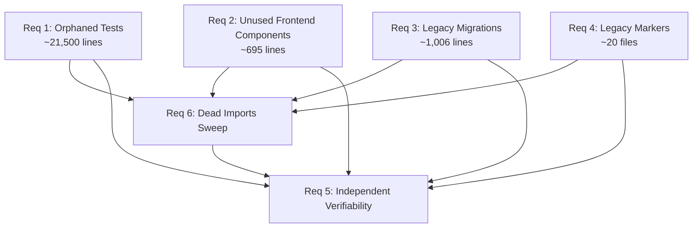

# Design: Systematic Codebase Cleanup

## Overview

This design covers the systematic removal of ~23K lines of dead code, legacy artifacts, and orphaned tests from the SwarmAI codebase (~138K total lines). The cleanup is organized into six independent categories, each verifiable in isolation (build + tests pass after each).

The codebase is a Tauri 2.0 desktop app with a React 19 + TypeScript frontend (`desktop/src/`) and a Python FastAPI backend (`backend/`). Skills (`s_docx`, `s_pptx`) are standalone packages under `backend/skills/`. There are no external users — the app is under active development by a single developer — so legacy migration paths can be fully removed without backward-compatibility concerns.

### Design Decisions

1. **Deletion order matters**: Orphaned tests (Req 1) are removed first because they are the largest category and have zero coupling to production code. Frontend components (Req 2) and migration files (Req 3) come next. Legacy markers (Req 4) follow. Dead imports (Req 6) is the final sweep.
2. **No migration preservation**: Since there are no users, migration files and their call sites are fully removed — no "skip if already migrated" stubs are left behind.
3. **CURRENT_SCHEMA_VERSION inlined**: When `project_schema_migrations.py` is removed, `CURRENT_SCHEMA_VERSION = "1.0.0"` is inlined directly into `swarm_workspace_manager.py` (the only production consumer).

## Architecture

The cleanup does not change the application architecture. It removes dead code paths while preserving the existing data flow:

```
User Input → React Frontend → FastAPI Backend → SessionRouter → SessionUnit → ClaudeSDKClient → SSE
```

### Cleanup Dependency Graph



Each cleanup category (R1–R4) is an independent atomic change. R6 (dead import sweep) runs after all deletions. R5 (independent verifiability) is a cross-cutting constraint enforced at every step.

## Components and Interfaces

### Component 1: Orphaned Test Identifier (Req 1)

Identifies test files in `backend/tests/` that have no corresponding source module.

**Approach**: For each `test_*.py` file, extract the module name (strip `test_` prefix and `_properties`/`_preservation`/`_exploration` suffixes), then check if a matching module exists in `backend/core/`, `backend/routers/`, `backend/database/`, or `backend/schemas/`. Files with no match are orphaned candidates.

**Cross-import check**: Before deleting a candidate, grep all other test files for `from tests.<candidate>` or `import tests.<candidate>` to ensure no active test depends on it.

**Files identified as orphaned** (from codebase research):
- Property test files from past bugfix specs (e.g., `test_property_explorer_git_bugfix.py`, `test_property_builtin_refresh_fault.py`, `test_property_builtin_refresh_preservation.py`, etc.)
- Exploration/seed tests (e.g., `test_seed_startup_exploration.py`, `test_seed_startup_preservation.py`, `test_seed_database_migrations.py`)
- One-off investigation tests (e.g., `test_build_error_event.py`, `test_tool_display_bugs.py`, `test_cold_start_resume.py`)

### Component 2: Unused Frontend Component Remover (Req 2)

Identifies React components in `desktop/src/components/` not imported anywhere else in `desktop/src/`.

**Approach**: For each component file, grep the entire `desktop/src/` tree (excluding the file itself) for imports of the component name. Files with zero import hits are candidates.

**Dynamic import check**: Also search for string-based references (`React.lazy`, dynamic `import()`) to avoid false positives.

### Component 3: Migration File Remover (Req 3)

Removes three migration modules and their call sites:

| File | Call Sites |
|------|-----------|
| `backend/core/mcp_migration.py` | `initialization_manager.py` (line ~306), `main.py` (line ~207) |
| `backend/core/skill_migration.py` | `initialization_manager.py` (line ~262) |
| `backend/core/project_schema_migrations.py` | `swarm_workspace_manager.py` (line ~31, ~775, ~982) |

**Call site cleanup**:
- `initialization_manager.py`: Remove the `try/except` blocks that import and call `migrate_skill_ids_to_allowed_skills` and `migrate_if_needed`
- `main.py`: Remove the `try/except` block that imports and calls `mcp_migration.migrate_if_needed`
- `swarm_workspace_manager.py`: Replace `from core.project_schema_migrations import CURRENT_SCHEMA_VERSION, migrate_if_needed` with an inline `CURRENT_SCHEMA_VERSION = "1.0.0"`. Remove `migrate_if_needed()` calls in `_read_project_metadata()` — new projects always start at version 1.0.0 and there are no older schemas to migrate from.

**Test files to remove**: `test_project_schema_migrations.py`, `test_seed_database_migrations.py`

### Component 4: Legacy Marker Resolver (Req 4)

Catalogs and resolves `DEPRECATED`, `LEGACY`, and `TODO-remove` markers.

**Markers found in research**:

| File | Marker | Resolution |
|------|--------|-----------|
| `desktop/src/types/index.ts` | `@deprecated FileAttachment`, `@deprecated FILE_SIZE_LIMITS` | Check if still imported; remove if dead, keep marker if actively used |
| `desktop/src/components/workspace-explorer/FileTreeNode.tsx` | `@deprecated` module | Check if imported; remove if dead |
| `desktop/src/components/workspace-explorer/toFileTreeItem.ts` | References "deprecated FileTreeItem" | Check if imported; remove if dead |
| `desktop/src/pages/chat/components/MergedToolBlock.tsx` | `@deprecated isStreaming` | Remove field if unused |
| `backend/database/sqlite.py` | "Legacy Data Cleanup" block | Active code (runs on startup) — not dead, remove misleading "legacy" label or leave as-is |
| `backend/tests/test_prompt_builder_properties.py` | "deprecated no-op" merge test | Keep — tests active code path |

### Component 5: Dead Import Sweeper (Req 6)

After all file deletions, sweep for broken imports:
- Python: Run `ruff check --select F401` to find unused imports
- TypeScript: Run `tsc --noEmit` to find unresolved imports
- Check `__init__.py` and `index.ts` barrel files for re-exports of deleted symbols

## Data Models

No data model changes. The cleanup is purely subtractive — removing files and code paths. The only data-adjacent change is inlining `CURRENT_SCHEMA_VERSION = "1.0.0"` into `swarm_workspace_manager.py` when `project_schema_migrations.py` is deleted.


## Correctness Properties

*A property is a characteristic or behavior that should hold true across all valid executions of a system — essentially, a formal statement about what the system should do. Properties serve as the bridge between human-readable specifications and machine-verifiable correctness guarantees.*

### Property 1: Orphan test detection correctness

From prework 1.1, 1.2, and 1.5: The orphan detection logic must correctly classify test files based on (a) whether a corresponding source module exists and (b) whether any other test file imports the candidate. These three criteria collapse into one property because the classification decision depends on both checks together.

*For any* test file name and any set of source module names and any import graph among test files, the orphan detector SHALL flag the test as an orphan candidate if and only if no source module matches AND no other active test file imports it. If another test imports it, it SHALL be flagged for manual review instead.

**Validates: Requirements 1.1, 1.2, 1.5**

### Property 2: Unused component detection correctness

From prework 2.1 and 2.5: The unused component detector must account for both static imports and dynamic imports (React.lazy, dynamic `import()`). These are two aspects of the same detection property.

*For any* component file in `desktop/src/components/` and any import graph (including static imports, dynamic `import()` calls, and `React.lazy` references), the detector SHALL flag the component as unused if and only if zero files in `desktop/src/` reference it through any import mechanism.

**Validates: Requirements 2.1, 2.5**

### Property 3: Reference completeness after deletion

From prework 3.1, 4.4, 6.1, and 6.2: All four criteria describe the same invariant — when a file or symbol is removed, no dangling references should remain. This is a single property over all deleted artifacts.

*For any* file or symbol deleted during cleanup, zero import statements, function calls, or re-exports referencing that file or symbol SHALL remain in the codebase (including `__init__.py` and `index.ts` barrel files).

**Validates: Requirements 3.1, 4.4, 6.1, 6.2**

### Property 4: Legacy marker detection completeness

From prework 4.1: The marker detection must find all instances of the target patterns across the codebase.

*For any* source file containing a comment matching the patterns `DEPRECATED`, `LEGACY`, or `TODO-remove` (case-insensitive), the marker cataloger SHALL include that file in its output with the correct file path, line number, and surrounding context.

**Validates: Requirements 4.1**

## Error Handling

### File Deletion Errors
- If a file cannot be deleted (permissions, lock), log the error and skip — do not abort the entire cleanup category.
- After each category, verify the expected files are gone. If any remain, report them for manual intervention.

### Import Removal Errors
- If removing an import creates a syntax error (e.g., the import was the only item in a multi-import line), fix the syntax before proceeding.
- Run `ruff check` and `tsc --noEmit` after each removal batch to catch cascading issues.

### Migration Removal Errors
- Before removing migration call sites, verify the surrounding code structure hasn't changed since the audit. Use exact string matching for the `try/except` blocks to avoid partial removal.
- After removing `project_schema_migrations.py`, verify `CURRENT_SCHEMA_VERSION` is correctly inlined by checking that `swarm_workspace_manager.py` still references the constant.

## Testing Strategy

### Dual Testing Approach

This cleanup uses both unit tests and property-based tests:

- **Unit tests**: Verify specific examples (e.g., "after deleting `mcp_migration.py`, `initialization_manager.py` has no import of it"), edge cases (e.g., test file that shares a name with a source module but in a different directory), and post-conditions (build passes, test suite passes).
- **Property tests**: Verify universal detection/classification properties across generated inputs (orphan detection, sync checking, unused component detection, reference completeness, marker detection).

### Property-Based Testing Configuration

- **Library**: `hypothesis` (Python, already in use in the project) and `fast-check` (TypeScript, for frontend properties)
- **Minimum iterations**: 100 per property test
- **Tag format**: Each test tagged with `Feature: codebase-cleanup, Property {N}: {title}`

### Test Plan

| Property | Test Type | Tool | What It Verifies |
|----------|-----------|------|-----------------|
| P1: Orphan detection | Property (hypothesis) | Python | Classification logic over generated file/import graphs |
| P2: Unused component detection | Property (fast-check) | TypeScript | Detection logic over generated component/import graphs |
| P3: Reference completeness | Property (hypothesis) | Python | Zero dangling references over generated deletion sets |
| P4: Marker detection | Property (hypothesis) | Python | Pattern matching completeness over generated file contents |

### Post-Cleanup Verification (Unit/Integration)

After each cleanup category:
1. `cd backend && pytest` — backend test suite passes
2. `cd desktop && npm run build` — TypeScript build succeeds
3. `cd desktop && npm test -- --run` — frontend test suite passes
4. `cd backend && ruff check --select F401` — no unused Python imports
5. `cd desktop && npx tsc --noEmit` — no unresolved TypeScript imports
