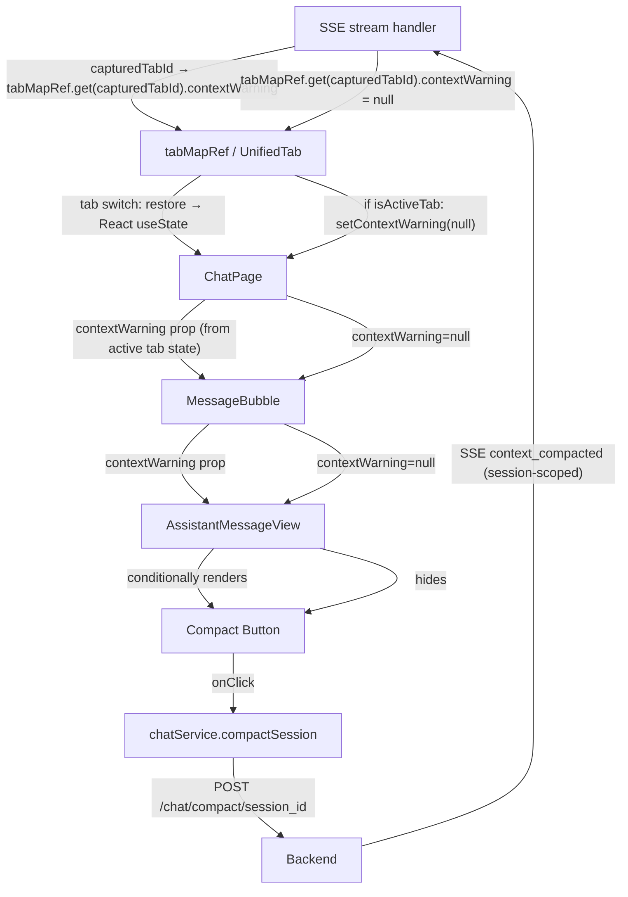
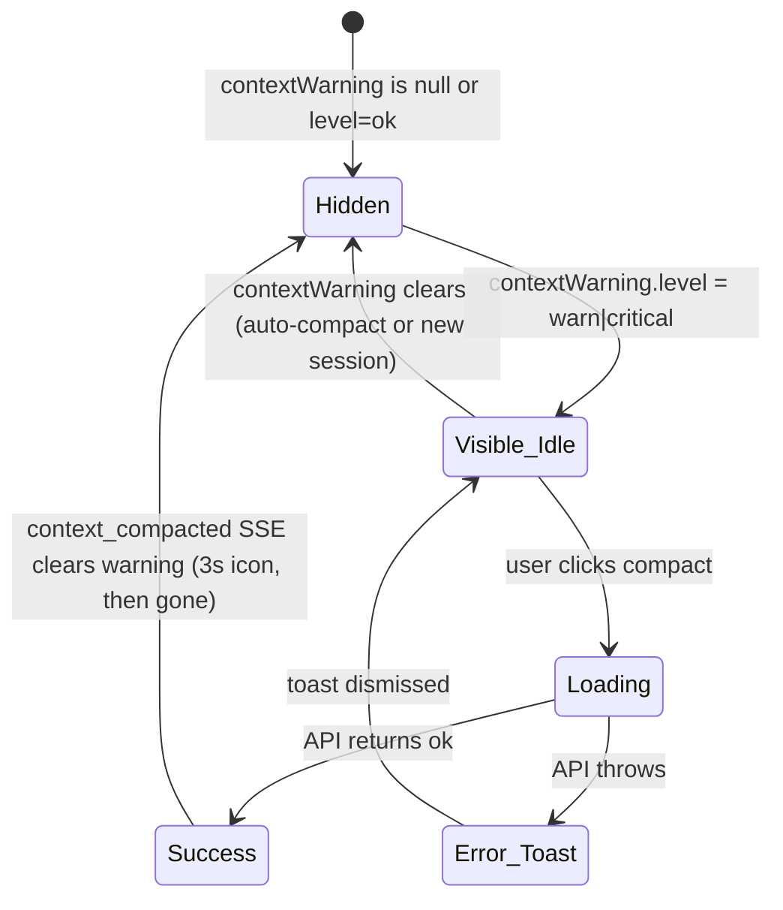

<!-- PE-REVIEWED -->
# Compact Button Relocation Design

## Overview

The Compact Context button currently lives in `ChatHeader.tsx` as a global header action with local state (`compactStatus`, `compactToast`). This design relocates it to the last assistant message's action row in `AssistantMessageView.tsx`, positioned after the Save-to-Memory button. Unlike Save-to-Memory (which is always available on the last assistant message), the Compact button is conditionally visible — it only appears when `contextWarning.level` is `warn` or `critical`, and disappears after successful compaction clears the warning.

The backend API (`POST /chat/compact/{session_id}`) is unchanged. The key new requirement is threading the `contextWarning` state from `ChatPage` (which owns it via `useChatStreamingLifecycle`) through `MessageBubble` down to `AssistantMessageView`.

### Key Differences from Save-to-Memory Relocation

The memory-save-button-relocation spec is the structural reference, but this feature differs in important ways:

1. **Conditional visibility**: Save-to-Memory always shows on the last assistant message. Compact only shows when `contextWarning.level` is `warn` or `critical`.
2. **Per-session warning on UnifiedTab**: The existing `contextWarning` is a single `useState` — global across all tabs. Per the multi-tab isolation steering (Principle 1: Tab-Scoped State Mutations, Principle 2: Active Tab = Display Mirror Only), per-session state belongs on `UnifiedTab` in `tabMapRef`, not in a new shared `useState` map. This design adds `contextWarning: ContextWarning | null` as a field on `UnifiedTab`, written by stream handlers via `capturedTabId`, and mirrored to React state on tab switch — exactly like `messages`, `isStreaming`, and `pendingQuestion`.
3. **No hook extraction needed**: Compact uses simple local state (`useState`) for `compactStatus` — no per-session status map needed since the button disappears after success (the warning clears via `context_compacted` SSE event).
4. **Urgency coloring**: At `critical` level, the button uses red/amber styling to signal urgency.
5. **Prop threading**: Requires passing the resolved per-session `contextWarning` (from `useChatStreamingLifecycle`) through the component tree, not just `sessionId` and `isLastAssistant` (which are already threaded).

## Architecture

### Component Data Flow



Per multi-tab isolation Principle 3: stream handlers capture `capturedTabId` at creation time. The `context_warning` and `context_compacted` SSE events write to `tabMapRef.get(capturedTabId).contextWarning` — never using `sessionIdRef.current` (which reflects the active tab, not the originating tab). React `useState` is updated only when `isActiveTab` is true (display mirror pattern).

### State Lifecycle



### Removal from ChatHeader

The compact button, its state (`compactStatus`, `compactToast`), the `handleCompact` handler, and the compact Toast are all removed from `ChatHeader.tsx`. The remaining header buttons (New Session, ToDo Radar, Chat History, File Browser) are unchanged.

## Components and Interfaces

### Modified Components

#### 1. ChatHeader.tsx — Removals Only

**Remove:**
- `compactStatus` and `compactToast` state declarations
- `handleCompact` async handler
- The compact `<button>` JSX block
- The compact `<Toast>` JSX block
- `chatService` import (only used for compact — verify no other usage)
- `useState` import can stay (no other state remains, but it's harmless)

**Keep unchanged:**
- `SessionTabBar`, New Session (+), ToDo Radar, Chat History, File Browser buttons
- All props interface — no changes needed

#### 2. MessageBubble.tsx — Add contextWarning Prop

**Add to `MessageBubbleProps`:**
```typescript
import type { ContextWarning } from '../../../hooks/useChatStreamingLifecycle';

export interface MessageBubbleProps {
  // ... existing props ...
  contextWarning?: ContextWarning | null;
}
```

**Forward** `contextWarning` to `AssistantMessageView` in the assistant branch.

#### 3. AssistantMessageView.tsx — Add Compact Button

**Add to `AssistantMessageViewProps`:**
```typescript
import type { ContextWarning } from '../../../hooks/useChatStreamingLifecycle';

export interface AssistantMessageViewProps {
  // ... existing props ...
  contextWarning?: ContextWarning | null;
}
```

**Add local state:**
```typescript
const [compactStatus, setCompactStatus] = useState<'idle' | 'loading' | 'done'>('idle');
const [compactToast, setCompactToast] = useState<string | null>(null);
```

**Add handler:**
```typescript
const handleCompact = useCallback(async () => {
  if (!sessionId || compactStatus === 'loading') return;
  setCompactStatus('loading');
  try {
    const result = await chatService.compactSession(sessionId);
    setCompactStatus('done');
    setCompactToast(
      result.status === 'compacted'
        ? 'Context compacted successfully'
        : result.message
    );
    setTimeout(() => setCompactStatus('idle'), 3000);
  } catch {
    setCompactStatus('idle');
    setCompactToast('Failed to compact session');
  }
}, [sessionId, compactStatus]);
```

**Visibility condition:**
```typescript
const showCompactButton = isLastAssistant
  && !isStreaming
  && sessionId
  && contextWarning
  && (contextWarning.level === 'warn' || contextWarning.level === 'critical');
```

**Render in action row** (after Save-to-Memory button):
```tsx
{showCompactButton && (
  <button
    type="button"
    onClick={handleCompact}
    disabled={compactStatus === 'loading'}
    className={clsx(
      'flex items-center gap-1 px-2 py-0.5 text-xs rounded transition-colors',
      contextWarning.level === 'critical'
        ? 'text-red-500 hover:text-red-400'
        : compactStatus === 'done'
          ? 'text-green-500 hover:text-green-400'
          : 'text-[var(--color-text-muted)] hover:text-[var(--color-text)]',
      compactStatus === 'loading' && 'opacity-50 cursor-not-allowed'
    )}
    title={`Compact Context (${contextWarning.pct}% used)`}
    aria-label="Compact Context"
  >
    <span className={clsx(
      'material-symbols-outlined text-sm',
      compactStatus === 'loading' && 'animate-spin'
    )}>
      {compactStatus === 'loading' ? 'progress_activity'
        : compactStatus === 'done' ? 'check_circle'
        : 'compress'}
    </span>
    {compactStatus === 'loading' ? 'Compacting...'
      : compactStatus === 'done' ? 'Compacted!'
      : 'Compact'}
  </button>
)}
```

**Compact Toast** (after the memory save Toast):
```tsx
{showCompactButton && compactToast && (
  <Toast
    message={compactToast}
    type={compactStatus === 'done' ? 'success' : 'error'}
    duration={4000}
    onDismiss={() => setCompactToast(null)}
  />
)}
```

#### 4. ChatPage.tsx — Thread contextWarning to MessageBubble

**In the `messages.map()` render:**
```tsx
// contextWarning is already the active tab's warning (display mirror from hook)
<MessageBubble
  key={msg.id}
  message={msg}
  onAnswerQuestion={handleAnswerQuestion}
  pendingToolUseId={pendingQuestion?.toolUseId}
  isStreaming={isLastAssistantForStreaming}
  sessionId={sessionId}
  isLastAssistant={idx === lastAssistantIdx}
  contextWarning={contextWarning}  // NEW — already per-session via display mirror
/>
```

No `contextWarningMap` resolution needed — `contextWarning` from the hook already reflects the active tab's state (display mirror pattern, same as `messages` and `isStreaming`).

#### 5. useChatStreamingLifecycle.ts — Per-Tab Warning via UnifiedTab

**Keep `contextWarning` as a display mirror `useState`** (same pattern as `messages`, `isStreaming`):
```typescript
const [contextWarning, setContextWarning] = useState<ContextWarning | null>(null);
const clearContextWarning = useCallback(() => {
  const tabId = activeTabIdRef.current;
  if (tabId) {
    const tabState = tabMapRef.current.get(tabId);
    if (tabState) tabState.contextWarning = null;
  }
  setContextWarning(null);
}, []);
```

**Update SSE handlers in createStreamHandler** to use `capturedTabId` (Principle 3):
```typescript
// context_warning — write to capturedTabId's UnifiedTab, mirror if active
else if (event.type === 'context_warning' && event.level && event.pct != null) {
  const tabState = tabMapRef.current.get(capturedTabId);
  if (tabState) {
    const warning: ContextWarning = {
      level: event.level as 'ok' | 'warn' | 'critical',
      pct: event.pct,
      tokensEst: event.tokensEst ?? 0,
      message: event.message ?? `Context ${event.pct}% full`,
    };
    tabState.contextWarning = warning;
    if (capturedTabId === activeTabIdRef.current) {
      setContextWarning(warning);
    }
  }
}

// context_compacted — clear capturedTabId's warning, mirror if active
else if (event.type === 'context_compacted') {
  const tabState = tabMapRef.current.get(capturedTabId);
  if (tabState) {
    tabState.contextWarning = null;
    if (capturedTabId === activeTabIdRef.current) {
      setContextWarning(null);
    }
  }
}
```

**Tab switch restore** — add `contextWarning` to the restore path (alongside `messages`, `sessionId`, etc.):
```typescript
// In the tab switch handler (already exists for other fields):
setContextWarning(targetTabState.contextWarning ?? null);
```

**Expose from hook** (signature unchanged — still `contextWarning: ContextWarning | null`):
```typescript
return {
  // ... existing fields ...
  contextWarning,          // UNCHANGED signature — now per-tab via display mirror
  clearContextWarning,     // UNCHANGED signature
};
```

#### 6. useUnifiedTabState.ts — Add contextWarning to UnifiedTab

**Add field to UnifiedTab interface:**
```typescript
export interface UnifiedTab {
  // ... existing fields ...
  contextWarning: ContextWarning | null;  // NEW — per-tab context warning
}
```

**Initialize in `initTabState`:**
```typescript
contextWarning: null,  // No warning on fresh tabs
```

**Include in tab cleanup:**
```typescript
// contextWarning is automatically cleaned up when the tab entry is removed from tabMapRef
```

#### 7. ContextUsageRing Component (NEW)

**New file**: `desktop/src/pages/chat/components/ContextUsageRing.tsx`

A small SVG circular progress ring that visualizes context window usage. Placed in the ChatInput bottom row after the TSCC popover button.

```typescript
export interface ContextUsageRingProps {
  /** Context usage percentage (0–100). Null = no data yet (gray ring). */
  pct: number | null;
  /** Size in pixels (default: 18). */
  size?: number;
}
```

**SVG ring implementation:**
```tsx
export function ContextUsageRing({ pct, size = 18 }: ContextUsageRingProps) {
  const strokeWidth = 2.5;
  const radius = (size - strokeWidth) / 2;
  const circumference = 2 * Math.PI * radius;
  const fillPct = pct ?? 0;
  const offset = circumference - (fillPct / 100) * circumference;

  // Color coding: green < 70%, amber 70–84%, red >= 85%
  const strokeColor = pct === null ? 'var(--color-border)'
    : fillPct >= 85 ? '#ef4444'   // red-500
    : fillPct >= 70 ? '#f59e0b'   // amber-500
    : '#10b981';                    // emerald-500

  return (
    <div
      className="relative inline-flex items-center justify-center"
      title={pct !== null ? `${pct}% context used` : 'No context data yet'}
      aria-label={pct !== null ? `${pct}% context used` : 'No context data yet'}
    >
      <svg width={size} height={size} className="transform -rotate-90">
        {/* Background track */}
        <circle cx={size/2} cy={size/2} r={radius}
          fill="none" stroke="var(--color-border)" strokeWidth={strokeWidth} />
        {/* Fill arc */}
        <circle cx={size/2} cy={size/2} r={radius}
          fill="none" stroke={strokeColor} strokeWidth={strokeWidth}
          strokeDasharray={circumference} strokeDashoffset={offset}
          strokeLinecap="round" className="transition-all duration-500" />
      </svg>
    </div>
  );
}
```

#### 8. ChatInput.tsx — Add ContextUsageRing

**Add to `ChatInputProps`:**
```typescript
/** Context usage percentage for the ring indicator (null = no data) */
contextPct?: number | null;
```

**Render in bottom row** (after TSCC button):
```tsx
<div className="flex items-center gap-2">
  <FileAttachmentButton ... />
  <TSCCPopoverButton ... />
  <ContextUsageRing pct={contextPct ?? null} />
</div>
```

#### 9. ChatPage.tsx — Thread contextPct to ChatInput

```tsx
// contextWarning is already the active tab's display mirror
<ChatInput
  ...existing props...
  contextPct={contextWarning?.pct ?? null}  // NEW
/>
```

#### 10. Backend — Emit context_status at all levels, turn-1 + every 5 turns

**In `agent_manager.py` `_run_query_on_client`** and `continue_with_answer` — two changes:

1. Lower `CHECK_INTERVAL_TURNS` from 15 to 5 in `context_monitor.py`
2. Add turn-1 check so the ring has data immediately:

```python
# In context_monitor.py:
CHECK_INTERVAL_TURNS = 5  # Was 15 — lowered for responsive ring updates

# In agent_manager.py _run_query_on_client (and continue_with_answer):
# BEFORE:
# if turns % CHECK_INTERVAL_TURNS == 0:
#     status = check_context_usage()
#     if status.level in ("warn", "critical"):
#         yield { "type": "context_warning", ... }

# AFTER:
if turns == 1 or turns % CHECK_INTERVAL_TURNS == 0:
    status = check_context_usage()
    # Always emit so the frontend ring can show usage at all levels
    yield {
        "type": "context_warning",
        "level": status.level,
        "pct": status.pct,
        "tokensEst": status.tokens_est,
        "message": status.message,
    }
```

This gives the ring data after the very first assistant response, then updates every 5 turns. The computation is ~1ms of file I/O (read one `.jsonl` transcript), so the performance impact is negligible. The Compact button visibility condition (`level === 'warn' || level === 'critical'`) is unaffected — it still only shows at warn/critical. The ring reads `pct` regardless of level.

## Data Models

### ContextWarning (existing interface unchanged, storage location changed)

```typescript
// Interface unchanged — same shape per warning
export interface ContextWarning {
  level: 'ok' | 'warn' | 'critical';
  pct: number;
  tokensEst: number;
  message: string;
}
```

**Storage: UnifiedTab field (not a separate useState map)**

Per multi-tab isolation Principle 1 (Tab-Scoped State Mutations) and Principle 2 (Active Tab = Display Mirror Only), the warning lives on `UnifiedTab`:

```typescript
// In useUnifiedTabState.ts — add to UnifiedTab interface:
export interface UnifiedTab {
  // ... existing fields ...
  contextWarning: ContextWarning | null;  // NEW — per-tab context warning
}
```

React `useState` in `useChatStreamingLifecycle` remains as a display mirror:
```typescript
// Display mirror — reflects ONLY the active tab's warning
const [contextWarning, setContextWarning] = useState<ContextWarning | null>(null);
```

**SSE handler writes to tabMapRef (Principle 3 — capturedTabId):**
```typescript
// In createStreamHandler (capturedTabId is closure-captured at creation):
else if (event.type === 'context_warning' && event.level && event.pct != null) {
  const tabState = tabMapRef.current.get(capturedTabId);
  if (tabState) {
    tabState.contextWarning = {
      level: event.level as 'ok' | 'warn' | 'critical',
      pct: event.pct,
      tokensEst: event.tokensEst ?? 0,
      message: event.message ?? `Context ${event.pct}% full`,
    };
    // Mirror to React state only if this is the active tab
    if (capturedTabId === activeTabIdRef.current) {
      setContextWarning(tabState.contextWarning);
    }
  }
}

else if (event.type === 'context_compacted') {
  const tabState = tabMapRef.current.get(capturedTabId);
  if (tabState) {
    tabState.contextWarning = null;
    if (capturedTabId === activeTabIdRef.current) {
      setContextWarning(null);
    }
  }
}
```

**Tab switch restores from tabMapRef (Principle 7):**
The existing tab switch protocol (save → restore → re-derive) automatically handles `contextWarning` since it's a field on `UnifiedTab`. On restore, `setContextWarning(tabState.contextWarning)` mirrors the target tab's warning to React state.

**Breaking change**: The hook's return type changes `contextWarning` from always-reflecting-latest-SSE to reflecting-active-tab-only. The only consumer is `ChatPage.tsx`, which already uses it for display. No other consumers exist.

**clearContextWarning**: Simplified — clears the active tab's warning:
```typescript
const clearContextWarning = useCallback(() => {
  const tabId = activeTabIdRef.current;
  if (tabId) {
    const tabState = tabMapRef.current.get(tabId);
    if (tabState) tabState.contextWarning = null;
  }
  setContextWarning(null);
}, []);
```

### Compact Button Local State

```typescript
// Local to AssistantMessageView — no shared hook needed
compactStatus: 'idle' | 'loading' | 'done'  // useState
compactToast: string | null                   // useState
```

Unlike the Save-to-Memory relocation (which needed per-session status maps because the button persists across sessions), the Compact button disappears after success (the `context_compacted` SSE event clears `contextWarning`), so simple local state suffices. When the button reappears for a future warning, fresh `idle` state is correct.

### Backend API (compact endpoint unchanged, context monitor updated)

```
POST /chat/compact/{session_id}
Request: { instructions?: string }
Response: { status: string; message: string }
```

SSE events:
- `context_warning`: Now emitted at ALL levels (ok, warn, critical) on turn 1 + every 5 turns. Shape: `{ type: 'context_warning', level, pct, tokensEst, message }`
- `context_compacted`: `{ type: 'context_compacted', session_id, trigger }` — clears `UnifiedTab.contextWarning` for the originating tab

## Correctness Properties

*A property is a characteristic or behavior that should hold true across all valid executions of a system — essentially, a formal statement about what the system should do. Properties serve as the bridge between human-readable specifications and machine-verifiable correctness guarantees.*

### Property 1: Compact Button Visibility Invariant

*For any* combination of `contextWarning` (null, ok, warn, critical), `isLastAssistant` (true/false), `isStreaming` (true/false), and `sessionId` (present/absent), the Compact button is rendered if and only if all of: `isLastAssistant === true`, `isStreaming === false`, `sessionId` is defined, and `contextWarning.level` is `'warn'` or `'critical'`.

**Validates: Requirements 2.1, 2.2, 3.4, 3.5, 5.3**

### Property 2: Compact Button Urgency Coloring

*For any* visible Compact button, when `contextWarning.level` is `'critical'`, the button SHALL have red/amber color classes (`text-red-500`). When `contextWarning.level` is `'warn'`, the button SHALL have the standard muted color classes (`text-[var(--color-text-muted)]`) matching Copy and Save-to-Memory.

**Validates: Requirements 4.3, 4.4**

### Property 3: Compact Button Title Shows Usage Percentage

*For any* visible Compact button with a `contextWarning` containing `pct` value, the button's `title` attribute SHALL be `"Compact Context (${pct}% used)"`.

**Validates: Requirements 4.6**

### Property 4: Click Invokes compactSession with Correct Session

*For any* visible Compact button with a given `sessionId`, clicking the button SHALL call `chatService.compactSession(sessionId)` with that exact session ID.

**Validates: Requirements 2.3**

### Property 5: Header Buttons Preserved After Compact Removal

*For any* `activeSidebar` value, ChatHeader SHALL render New Session, ToDo Radar, Chat History, and File Browser buttons with correct aria-labels, and SHALL NOT render a Compact Context button.

**Validates: Requirements 1.1, 1.3**

### Property 6: Copy Button Preservation

*For any* assistant message (regardless of `isLastAssistant`), when `isStreaming` is false and the message has text content, the Copy button SHALL be rendered in the action row.

**Validates: Requirements 5.1**

### Property 7: Per-Session Warning Isolation

*For any* two distinct tab IDs T1 and T2, setting a `context_warning` on T1's `UnifiedTab.contextWarning` in `tabMapRef` SHALL NOT affect T2's `UnifiedTab.contextWarning`. Clearing the warning for T1 (via `context_compacted`) SHALL NOT affect T2's warning. When the active tab is T2 and `tabMapRef.get(T2).contextWarning` is null, the Compact button SHALL NOT render regardless of T1's warning value.

**Validates: Requirements 6.1, 6.2, 6.3, 6.5, 6.7**

### Property 8: Context Usage Ring Color Invariant

*For any* `pct` value (0–100), the Context_Usage_Ring stroke color SHALL be green (`#10b981`) when `pct < 70`, amber (`#f59e0b`) when `70 <= pct < 85`, and red (`#ef4444`) when `pct >= 85`. When `pct` is null, the stroke SHALL use the border color (`var(--color-border)`).

**Validates: Requirements 7.2, 7.3**

### Property 9: Context Usage Ring Tooltip

*For any* `pct` value (0–100), the Context_Usage_Ring `title` attribute SHALL be `"${pct}% context used"`. When `pct` is null, the title SHALL be `"No context data yet"`.

**Validates: Requirements 7.4**

## Error Handling

### Compact API Failure

When `chatService.compactSession(sessionId)` throws, the component:
1. Resets `compactStatus` to `'idle'` (button returns to clickable state)
2. Sets `compactToast` with the error message `'Failed to compact session'`
3. Renders a `<Toast type="error">` that auto-dismisses after 4 seconds

The button remains visible (contextWarning hasn't cleared) so the user can retry.

### Missing Session ID

If `sessionId` is undefined, the visibility condition (`showCompactButton`) is false, so the button never renders. The `handleCompact` handler also guards with `if (!sessionId) return`.

### Concurrent Clicks

The `handleCompact` handler guards with `if (compactStatus === 'loading') return`, and the button is `disabled` during loading. This prevents duplicate API calls.

### Context Warning Clears During Loading

If the backend emits `context_compacted` (clearing `contextWarning`) while a manual compact is in-flight, the button disappears mid-loading. The API call completes in the background, and the success/error state is set on unmounted local state (React no-op). This is acceptable — the compaction succeeded (or was redundant), and the UI correctly reflects the cleared warning.

## Testing Strategy

### Property-Based Testing

Use `fast-check` (already available in the project) for property-based tests. Each property test runs a minimum of 100 iterations.

**Test file**: `desktop/src/pages/chat/components/__tests__/CompactButton.property.test.tsx`

**Property tests to implement:**

1. **Feature: compact-button-relocation, Property 1: Compact Button Visibility Invariant**
   Generate random combinations of `{ contextWarning: ContextWarning | null, isLastAssistant: boolean, isStreaming: boolean, sessionId: string | undefined }`. Render `AssistantMessageView` with these props. Assert the Compact button is present ↔ all visibility conditions are met.

2. **Feature: compact-button-relocation, Property 2: Compact Button Urgency Coloring**
   Generate random `contextWarning` with level `'warn'` or `'critical'` and random `pct` values. Render with visibility conditions met. Assert red classes for critical, muted classes for warn.

3. **Feature: compact-button-relocation, Property 3: Compact Button Title Shows Usage Percentage**
   Generate random `pct` values (0–100). Render with visibility conditions met. Assert `title` attribute matches `"Compact Context (${pct}% used)"`.

4. **Feature: compact-button-relocation, Property 4: Click Invokes compactSession with Correct Session**
   Generate random `sessionId` strings. Render with visibility conditions met. Click the button. Assert `chatService.compactSession` was called with the generated sessionId.

5. **Feature: compact-button-relocation, Property 5: Header Buttons Preserved After Compact Removal**
   Generate random `activeSidebar` values from `RightSidebarId`. Render `ChatHeader`. Assert four buttons present by aria-label, assert no Compact Context button.

6. **Feature: compact-button-relocation, Property 6: Copy Button Preservation**
   Generate random `{ isLastAssistant, contextWarning }` combinations with `isStreaming=false` and non-empty message content. Assert Copy button is always present regardless of other prop values.

7. **Feature: compact-button-relocation, Property 7: Per-Session Warning Isolation**
   Generate two distinct random session IDs (S1, S2) and random `ContextWarning` values. Set warning for S1 in the map. Assert `contextWarningMap[S2]` is undefined. Clear S1's warning. Assert S2's entry (if any) is unchanged. Render `AssistantMessageView` with `sessionId=S2` and the resolved `contextWarningMap[S2]` — assert no Compact button.

8. **Feature: compact-button-relocation, Property 8: Context Usage Ring Color Invariant**
   Generate random `pct` values (0–100) and null. Render `ContextUsageRing` with each value. Assert stroke color matches the threshold: green < 70, amber 70–84, red >= 85, border color for null.

9. **Feature: compact-button-relocation, Property 9: Context Usage Ring Tooltip**
   Generate random `pct` values (0–100) and null. Render `ContextUsageRing`. Assert `title` attribute matches `"${pct}% context used"` or `"No context data yet"` for null.

### Unit Tests

**Test file**: `desktop/src/pages/chat/components/__tests__/CompactButton.unit.test.tsx`

- Compact button renders with `compress` icon in idle state when all visibility conditions met
- Compact button shows loading spinner and is disabled during API call
- Compact button shows `check_circle` with green styling after successful compaction
- Toast appears with error message when API call fails
- Toast appears with success message when API call succeeds
- Compact button has `aria-label="Compact Context"`
- Compact button disappears when `contextWarning` prop changes to null (simulating SSE clear)
- Save-to-Memory button still renders on last assistant message alongside Compact button
- ChatHeader no longer renders any compact-related UI
- contextWarningMap stores warnings per session ID — setting S1 doesn't affect S2
- Clearing S1's warning via context_compacted doesn't affect S2's warning
- Tab switch from warned session to clean session hides compact button
- Tab switch back to warned session shows compact button with correct pct/level

### Integration Tests

- Full flow: render ChatPage with `contextWarning` at `warn` level → verify compact button on last assistant message → click → verify API call → simulate `context_compacted` SSE → verify button disappears
- Tab switch: verify compact button visibility is driven by the per-session `contextWarningMap` — warning on S1 does not show compact button when viewing S2
- Multi-session: emit `context_warning` for S1 and S2 independently, verify each tab shows correct pct/level, compact S1 only clears S1's warning
- Streaming transition: start with streaming message (no buttons) → complete streaming → verify compact button appears if contextWarning is active for this session
