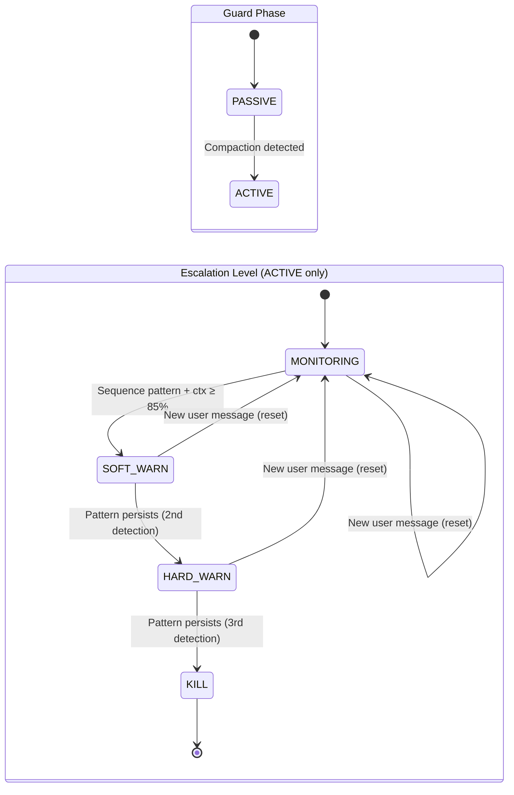

# Design Document: Compaction Guard Redesign

## Overview

The current `CompactionGuard` activates all detection layers from session start, causing false positives during healthy productive sessions. This redesign introduces a two-phase architecture (PASSIVE → ACTIVE) where aggressive loop detection only engages after a compaction event has occurred and context usage exceeds 85%. The guard shifts from count-based detection to temporal sequence detection, adds graduated escalation (MONITORING → SOFT_WARN → HARD_WARN → KILL), generates rich work summaries with actual file paths and commands, and gives the frontend full visibility into guard actions via a new `compaction_guard` SSE event type.

The redesign touches two codebases:
- **Backend** (`backend/core/compaction_guard.py`, `backend/core/session_unit.py`): Complete rewrite of the guard class and updated integration points.
- **Frontend** (`desktop/src/hooks/useChatStreamingLifecycle.ts`, `desktop/src/hooks/useUnifiedTabState.ts`): New SSE event handler and per-tab guard state.

## Architecture

The guard operates as a per-session state machine embedded in `SessionUnit`. It has two orthogonal state dimensions:

1. **Guard Phase** (lifecycle): `PASSIVE` → `ACTIVE` (one-way transition on compaction detection)
2. **Escalation Level** (per-turn severity): `MONITORING` → `SOFT_WARN` → `HARD_WARN` → `KILL` (resets to MONITORING on new user message)



### Data Flow

```
Tool Call → record_tool_call() → append to post-compaction sequence
                                → store full input for work summary
Result    → update_context_usage() → compute context %
                                   → heuristic compaction detection (30pt drop)
                                   → snapshot baseline BEFORE detecting drop
          → check() → if PASSIVE: return MONITORING
                     → if ACTIVE + ctx < 85%: return MONITORING
                     → if ACTIVE + ctx ≥ 85%: run loop detection
                       → if loop found: escalate → emit SSE event
                       → if KILL: caller interrupts session
```

### SSE Event Flow

```
Backend CompactionGuard
  → build_guard_event(escalation_level)
  → yields dict with type="compaction_guard", subtype="soft_warn"|"hard_warn"|"kill"
  → SessionUnit yields event in _stream_response / _emit_post_stream_metadata
  → Frontend useChatStreamingLifecycle receives event
  → Writes to tabMapRef.compactionGuard (display mirror pattern)
  → Mirrors to React state if active tab
  → UI renders appropriate banner/error
```

## Components and Interfaces

### Backend: `CompactionGuard` (rewritten)

```python
class GuardPhase(Enum):
    PASSIVE = "passive"
    ACTIVE = "active"

class EscalationLevel(Enum):
    """Both the internal state and the return value from check().
    MONITORING means "no action needed" (replaces old LoopAction.NONE).
    """
    MONITORING = "monitoring"
    SOFT_WARN = "soft_warn"
    HARD_WARN = "hard_warn"
    KILL = "kill"

@dataclass
class ToolRecord:
    """A single recorded tool call with full input for work summary."""
    tool_name: str
    input_hash: str
    input_detail: str  # First 200 chars of JSON-serialized input
    timestamp: float   # time.time() — used only for work_summary display ordering, NOT for detection logic

class CompactionGuard:
    """Per-session compaction amnesia loop guard.

    Two-phase design: PASSIVE (no interference) → ACTIVE (after compaction).
    Graduated escalation: MONITORING → SOFT_WARN → HARD_WARN → KILL.
    """

    def __init__(self) -> None: ...

    # --- Core API (called by SessionUnit) ---
    def record_tool_call(self, tool_name: str, tool_input: dict | str | None) -> None: ...
    def update_context_usage(self, input_tokens: int, model: str | None = None) -> None: ...
    def check(self) -> EscalationLevel: ...
    def activate(self) -> None:
        """Transition PASSIVE → ACTIVE. Snapshot pre-compaction baseline."""
    def work_summary(self) -> str: ...

    # --- Lifecycle ---
    def reset(self) -> None:
        """New user turn: reset escalation + per-turn sequence. Preserve phase + baseline."""
    def reset_all(self) -> None:
        """Full reset (subprocess respawn): back to PASSIVE, clear everything."""

    # --- SSE Event Builders ---
    def build_guard_event(self, level: EscalationLevel) -> dict | None: ...

    # --- Internal ---
    def _detect_loop(self) -> bool: ...

    # --- Properties ---
    @property
    def phase(self) -> GuardPhase: ...
    @property
    def escalation(self) -> EscalationLevel: ...
    @property
    def context_pct(self) -> float: ...
```

**Simplification notes vs. original design:**
- Dropped `GuardAction` enum — `EscalationLevel` serves double duty (MONITORING = no action needed). One fewer enum to maintain.
- Dropped `_extract_input_detail` — input details are just the first 200 chars of JSON-serialized input, no per-tool-name field mapping. Simpler and won't break when new tools are added.
- `check()` returns `EscalationLevel` directly instead of a separate action enum.

### Backend: `SessionUnit` Integration Changes

The integration points in `session_unit.py` change as follows:

1. **`__init__`**: Creates `CompactionGuard()` (unchanged).
2. **`send()`**: Calls `self._compaction_guard.reset()` (unchanged).
3. **`_stream_response()`**: Calls `record_tool_call()` and `check()` per tool_use block. Maps `EscalationLevel` to SSE events (MONITORING = skip). On `KILL`, interrupts session.
4. **`_emit_post_stream_metadata()`**: Calls `update_context_usage()` and `check()`. Emits guard events.
5. **`compact()`**: Calls `self._compaction_guard.activate()` after successful compaction. Injects `work_summary()` into compact instructions. Emits `context_compacted` SSE event (the frontend already handles this event type).
6. **`_spawn()` (COLD → IDLE)**: Calls `self._compaction_guard.reset_all()`.
7. **`continue_with_answer()` / `continue_with_permission()`**: Calls `self._compaction_guard.reset()`.
8. **New: compaction detection via context drop**: In `update_context_usage()`, the guard maintains a rolling baseline snapshot on every call. When a ≥30 percentage point drop is detected, `activate()` uses the pre-drop snapshot as the baseline (not the current tool records, which would be post-compaction).

The `_build_guard_event()` method is updated to use the new `EscalationLevel` enum and delegate to `CompactionGuard.build_guard_event()`.

### Frontend: SSE Event Handler

New `compaction_guard` event handling in `useChatStreamingLifecycle.ts`, following the `context_warning` display mirror pattern:

```typescript
// New type for compaction guard state
export interface CompactionGuardEvent {
  subtype: 'soft_warn' | 'hard_warn' | 'kill';
  contextPct: number;
  message: string;
  patternDescription?: string;
}

// In createStreamHandler, new else-if branch:
else if (event.type === 'compaction_guard') {
  const guardEvent: CompactionGuardEvent = {
    subtype: event.subtype as 'soft_warn' | 'hard_warn' | 'kill',
    contextPct: event.contextPct ?? 0,
    message: event.message ?? 'Guard event',
    patternDescription: event.patternDescription,
  };
  // Write to tab map (authoritative)
  const tabState = capturedTabId ? tabMapRef.current.get(capturedTabId) : undefined;
  if (tabState) {
    tabState.compactionGuard = guardEvent;
  }
  // Mirror to React state if active tab
  if (capturedTabId === null || capturedTabId === activeTabIdRef.current) {
    setCompactionGuard(guardEvent);
  }
}
```

### Frontend: `UnifiedTab` Extension

Add to the `UnifiedTab` interface:

```typescript
/** Per-tab compaction guard event from backend (null = no active guard event). */
compactionGuard: CompactionGuardEvent | null;
```

### Frontend: UI Rendering

The UI rendering of guard events is deferred to a follow-up. For the initial implementation, the SSE plumbing (event handler + tab state) is the deliverable. The `compactionGuard` field in `UnifiedTab` can be consumed by any future banner component. The `context_warning` banner component is a good pattern to follow when the UI is built.

### API Naming Convention

Backend SSE event fields use `snake_case`:
```python
{
    "type": "compaction_guard",
    "subtype": "soft_warn",
    "context_pct": 87.3,
    "message": "...",
    "pattern_description": "60% of post-compaction tool calls match pre-compaction baseline (6/10 calls)"
}
```

Frontend receives via SSE and the `StreamEvent` type already allows arbitrary string keys. The `CompactionGuardEvent` interface uses `camelCase` (`contextPct`, `patternDescription`). The conversion happens inline in the event handler (no service-layer `toCamelCase` needed since SSE events are parsed directly in the hook).

## Data Models

### Backend State

```python
class CompactionGuard:
    # Phase
    _phase: GuardPhase  # PASSIVE or ACTIVE

    # Escalation
    _escalation: EscalationLevel  # MONITORING → SOFT_WARN → HARD_WARN → KILL

    # Context tracking
    _context_pct: float
    _context_tokens: int
    _prev_context_pct: float  # For heuristic compaction detection (30pt drop)

    # Tool tracking
    _pre_compaction_set: set[tuple[str, str]]  # (tool_name, input_hash) baseline — membership set, NOT multiset (duplicates collapsed; overlap check counts total post-compaction calls matching this set)
    _rolling_baseline_set: set[tuple[str, str]]  # Updated on every update_context_usage(); becomes _pre_compaction_set on activate()
    _post_compaction_sequence: list[tuple[str, str]]  # Current post-compaction calls
    _tool_records: list[ToolRecord]  # Full records for work summary (all phases)
```

### Loop Detection Algorithm (Simplified)

The detection uses set-overlap rather than subsequence matching. This is simpler and catches the real pattern (agent re-doing the same work after compaction) without the complexity of sliding windows.

1. **Set-overlap detection**: Build a set of `(tool_name, input_hash)` pairs from `_pre_compaction_set` (snapshotted at activation). For each tool call in `_post_compaction_sequence`, check if it exists in the baseline set. Count total matches (not unique). If >60% of post-compaction calls (minimum 5 calls) are duplicates of pre-compaction calls → loop detected.

2. **Single-tool repetition fallback**: Compute `Counter(_post_compaction_sequence).most_common(1)` — if the top pair appears ≥5 times → loop detected (regardless of baseline overlap). No separate counter needed; computed on-the-fly in `_detect_loop()`.

3. **Input differentiation**: Only `(tool_name, input_hash)` pairs are compared. Same tool name with different input hashes are NOT considered duplicates.

### Frontend State

```typescript
// In UnifiedTab (useUnifiedTabState.ts)
compactionGuard: CompactionGuardEvent | null;

// In useChatStreamingLifecycle (React state mirror)
const [compactionGuard, setCompactionGuard] = useState<CompactionGuardEvent | null>(null);
```

### SSE Event Schema

```typescript
// StreamEvent extension (types/index.ts)
interface StreamEvent {
  // ... existing fields ...
  // Compaction guard fields
  subtype?: string;
  contextPct?: number;
  patternDescription?: string;
}
```


## Correctness Properties

*Properties are formal statements about system behavior that should hold across all valid executions. These are tested with Hypothesis property-based tests.*

### Property 1: PASSIVE phase never interferes

*For any* CompactionGuard in PASSIVE phase, and *for any* sequence of `record_tool_call()` and `update_context_usage()` calls with arbitrary tool names, inputs, token counts (including values that would trigger detection in ACTIVE phase), `check()` shall always return `MONITORING`.

**Validates: Requirements 1.2, 1.4**

### Property 2: Activation snapshots baseline and clears post-compaction state

*For any* sequence of tool calls recorded before `activate()` is called, after activation the pre-compaction baseline set shall contain exactly those `(tool_name, input_hash)` pairs, the post-compaction sequence shall be empty, and the phase shall be ACTIVE. Tool calls recorded after activation shall appear only in the post-compaction sequence.

**Validates: Requirements 1.5, 8.4**

### Property 3: 85% context threshold gates detection

*For any* CompactionGuard in ACTIVE phase with a loop pattern present, if `context_pct` is below 85%, `check()` shall return `MONITORING`. If `context_pct` is at or above 85% and a loop pattern is present, `check()` shall return a non-MONITORING level.

**Validates: Requirements 2.1, 2.2**

### Property 4: Set-overlap loop detection

*For any* pre-compaction baseline set and *for any* post-compaction sequence of ≥5 calls, count the number of calls (by total count, not unique pairs) whose `(tool_name, input_hash)` exists in the baseline set. If this count exceeds 60% of total post-compaction calls, the guard shall detect a loop. If ≤60% match (and no single-tool repetition ≥5), no loop shall be detected.

**Validates: Requirements 3.1, 3.2, 3.4**

### Property 5: Single-tool repetition detection

*For any* `(tool_name, input_hash)` pair appearing ≥5 times in the post-compaction sequence, the guard shall detect a loop regardless of baseline overlap.

**Validates: Requirements 3.3**

### Property 6: Strict escalation order

*For any* sequence of `check()` calls that trigger escalation (ACTIVE phase, context ≥ 85%, loop detected), the returned levels shall follow strict order: `SOFT_WARN` → `HARD_WARN` → `KILL`. No level shall be skipped. After `KILL`, subsequent calls continue returning `KILL`.

**Validates: Requirements 4.1, 4.2, 4.3, 4.4**

### Property 7: Reset preserves phase and baseline

*For any* CompactionGuard in ACTIVE phase with any escalation level, after `reset()`, phase shall remain ACTIVE, baseline shall be unchanged, `context_pct` shall be unchanged, but escalation shall be MONITORING and post-compaction sequence shall be empty.

**Validates: Requirements 4.5, 8.1, 8.3**

### Property 8: Full reset restores initial state

*For any* CompactionGuard in any state, after `reset_all()`, phase shall be PASSIVE, escalation shall be MONITORING, context_pct shall be 0, and all tracking data shall be empty.

**Validates: Requirements 8.2**

### Property 9: Heuristic compaction detection

*For any* two consecutive `update_context_usage()` calls where the second call's `context_pct` is ≥30 percentage points lower than the first, the guard shall automatically transition from PASSIVE to ACTIVE.

**Validates: Requirements 7.3**

## Error Handling

### Backend

| Scenario | Handling |
|----------|----------|
| `PromptBuilder.get_model_context_window()` raises | Fallback to 200,000 tokens. Log warning. |
| `activate()` called when already ACTIVE | No-op (idempotent). Log debug. |
| Phase transition PASSIVE → ACTIVE | Log info with pre/post context_pct and baseline size. |
| Escalation level change | Log warning with old level, new level, and trigger reason. |
| `check()` raises during sequence detection | Catch, log error, return `MONITORING`. Guard must never block streaming. |
| `work_summary()` raises during detail extraction | Catch per-tool, use fallback `"<tool_name>(...)"`. Summary generation must never fail. |
| `build_guard_event()` called with `MONITORING` | Returns `None`. Caller skips. |
| Context tokens ≤ 0 | Ignored (no update). Same as current behavior. |

### Frontend

| Scenario | Handling |
|----------|----------|
| `compaction_guard` event with unknown subtype | Ignore (don't crash the stream handler). |
| `compaction_guard` event missing fields | Use defaults (`contextPct: 0`, `message: 'Guard event'`). |
| Tab not found in `tabMapRef` | Skip tab state update, still mirror to React state if active. |
| `kill` event received but session already stopped | Display the error banner anyway (idempotent UI). |

### Invariants

1. The guard must NEVER throw an exception that propagates to the caller. All public methods wrap internal logic in try/except.
2. The guard must NEVER block or slow down the streaming response path. All operations are O(n) or better where n is the number of tool calls in the current turn.
3. Frontend event handling must never crash the SSE stream handler. Unknown event subtypes are silently ignored.

## Testing Strategy

### Property-Based Testing (Backend)

Use **Hypothesis** (already in the project's test dependencies) for property-based tests. Each property test runs a minimum of 100 iterations.

Properties 1–9 from the Correctness Properties section are implemented as individual Hypothesis tests. Generators produce:
- Random tool names (from a realistic set + arbitrary strings)
- Random tool inputs (dicts with file paths, commands, patterns)
- Random token counts and model identifiers
- Random sequences of guard operations (record, update, check, reset, activate)

Each test is tagged with a comment referencing the design property:
```python
# Feature: compaction-guard-redesign, Property 1: PASSIVE phase never interferes
```

### Unit Testing (Backend)

Unit tests cover specific examples and edge cases:
- Initialization state (PASSIVE, MONITORING)
- Unknown model fallback (200K)
- Empty work summary when no tools recorded
- Hash consistency (dict key order, None input, string input)
- SSE event builder output structure
- Integration with SessionUnit (compact calls activate, spawn calls reset_all)

### Frontend Testing

Unit tests (Vitest) for:
- `compaction_guard` SSE event parsing in stream handler
- Display mirror pattern (write to tabMapRef, mirror to React state)
- Unknown subtype handling (no crash)
- Missing field defaults

### Test Configuration

- Backend: `pytest` + `hypothesis` with `@settings(max_examples=100)`
- Frontend: `vitest --run` with standard React Testing Library patterns
- Each property-based test references its design property via tag comment
- Tag format: `Feature: compaction-guard-redesign, Property {N}: {title}`
