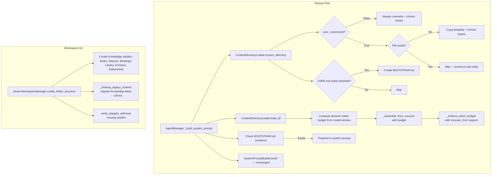

<!-- PE-REVIEWED -->
# Design Document: Context Files Enhancement

## Overview

This design enhances SwarmAI's context file system based on OpenClaw learnings. The changes span three layers:

1. **Template Layer** — Revised and new context file templates in `backend/context/` (STEERING.md, AGENT.md, USER.md, SOUL.md, IDENTITY.md, KNOWLEDGE.md, MEMORY.md, PROJECTS.md, TOOLS.md, BOOTSTRAP.md)
2. **Loader Layer** — Extended `ContextDirectoryLoader` with `user_customized` field, `truncate_from` field, two-mode copy logic, readonly permissions, BOOTSTRAP.md detection, and dynamic token budget
3. **Workspace Layer** — Updated `SwarmWorkspaceManager` with new Knowledge subdirectories, legacy migration from `Knowledge Base/` to `Library/`, and system-managed folder protection

The design preserves backward compatibility: existing user-customized files are never overwritten, legacy directories are migrated (not deleted), and the L1/L0 cache mechanism continues to work with the expanded file set.

## Architecture




## Components and Interfaces

### 1. ContextFileSpec (Extended — Dataclass)

The existing `ContextFileSpec` NamedTuple is replaced with a frozen dataclass for default value support, keyword-only construction, and future extensibility:

```python
from dataclasses import dataclass
from typing import Literal

@dataclass(frozen=True)
class ContextFileSpec:
    filename: str
    priority: int
    section_name: str
    truncatable: bool
    user_customized: bool = False                          # NEW: True = copy-only-if-missing
    truncate_from: Literal["head", "tail"] = "tail"        # NEW: "head" = oldest first
```

Using `Literal["head", "tail"]` instead of bare `str` provides type safety and IDE autocompletion. The `frozen=True` preserves the immutability guarantee of the original NamedTuple. Existing code that accesses fields by name (e.g., `spec.filename`) continues to work unchanged; only positional unpacking would break, but no current code does this.

### 2. CONTEXT_FILES (Updated List)

```python
CONTEXT_FILES: list[ContextFileSpec] = [
    ContextFileSpec("SWARMAI.md",    0, "SwarmAI",          False, False, "tail"),
    ContextFileSpec("IDENTITY.md",   1, "Identity",         False, False, "tail"),
    ContextFileSpec("SOUL.md",       2, "Soul",             False, False, "tail"),
    ContextFileSpec("AGENT.md",      3, "Agent Directives", True,  False, "tail"),
    ContextFileSpec("USER.md",       4, "User",             True,  True,  "tail"),
    ContextFileSpec("STEERING.md",   5, "Steering",         True,  True,  "tail"),
    ContextFileSpec("TOOLS.md",      6, "Tools",            True,  True,  "tail"),  # NEW
    ContextFileSpec("MEMORY.md",     7, "Memory",           True,  True,  "head"),  # truncate_from=head
    ContextFileSpec("KNOWLEDGE.md",  8, "Knowledge",        True,  True,  "tail"),
    ContextFileSpec("PROJECTS.md",   9, "Projects",         True,  True,  "tail"),
]
```

Key changes:
- TOOLS.md inserted at priority 6 (between STEERING=5 and MEMORY=7)
- MEMORY.md, KNOWLEDGE.md, PROJECTS.md priorities shifted +1
- MEMORY.md uses `truncate_from="head"` to preserve newest entries
- All files annotated with `user_customized` flag


### 3. ContextDirectoryLoader (Modified Methods)

#### ensure_directory() — Two-Mode Copy + Permissions + BOOTSTRAP Detection

**Design note:** `ensure_directory()` performs synchronous file I/O (read_bytes, write_bytes, chmod). This is intentional — context files are small (<10KB each) and local, so the I/O completes in <1ms per file. Wrapping in `anyio.to_thread` would add unnecessary complexity for negligible benefit.

**Scope:** The method ONLY iterates entries in `CONTEXT_FILES`. It does NOT copy all files from `templates_dir` — non-CONTEXT_FILES templates (like BOOTSTRAP.md) are handled separately by `_maybe_create_bootstrap()`.

```python
def ensure_directory(self) -> None:
    self.context_dir.mkdir(parents=True, exist_ok=True)
    if self.templates_dir is None:
        return

    for spec in CONTEXT_FILES:
        src = self.templates_dir / spec.filename
        if not src.is_file():
            continue
        dest = self.context_dir / spec.filename

        if spec.user_customized:
            # Copy-only-if-missing: never overwrite user edits
            if dest.exists():
                continue
            dest.write_bytes(src.read_bytes())
            try:
                os.chmod(dest, 0o644)
            except OSError:
                pass  # Best-effort on non-Unix (Windows)
        else:
            # Always-overwrite: system defaults refreshed every startup
            # Single read of source, compare against dest to avoid unnecessary writes
            src_bytes = src.read_bytes()
            needs_write = True
            if dest.exists():
                try:
                    if dest.read_bytes() == src_bytes:
                        needs_write = False
                except OSError:
                    pass  # Can't read dest — overwrite it
            if needs_write:
                # Remove readonly before overwriting
                if dest.exists():
                    try:
                        os.chmod(dest, 0o644)
                    except OSError:
                        pass
                dest.write_bytes(src_bytes)
            # Always ensure readonly permission (whether written or not)
            try:
                os.chmod(dest, 0o444)
            except OSError:
                pass  # Best-effort on non-Unix

    # BOOTSTRAP.md detection: create if USER.md is empty template
    self._maybe_create_bootstrap()
```

#### _maybe_create_bootstrap() — New Private Method

Checks if USER.md contains only the empty template placeholders. If so, creates BOOTSTRAP.md in the context directory with onboarding instructions. BOOTSTRAP.md is NOT in CONTEXT_FILES — it's detected separately by `_build_system_prompt()`.

```python
def _maybe_create_bootstrap(self) -> None:
    user_md = self.context_dir / "USER.md"
    bootstrap_md = self.context_dir / "BOOTSTRAP.md"
    if bootstrap_md.exists():
        return  # Already exists, don't recreate
    if not user_md.exists():
        return
    content = user_md.read_text(encoding="utf-8").strip()
    if self._is_empty_template(content):
        bootstrap_src = self.templates_dir / "BOOTSTRAP.md"
        if bootstrap_src.is_file():
            bootstrap_md.write_bytes(bootstrap_src.read_bytes())
```

The `_is_empty_template()` helper checks if USER.md content is still the default template with no user-provided content. Implementation uses structural detection (not hash comparison, which is fragile to whitespace changes): checks that all key placeholder fields (Name, Timezone, Role) are still empty or contain only the template marker text. This avoids false positives from minor template formatting changes.

```python
def _is_empty_template(self, content: str) -> bool:
    """Check if USER.md is still the unfilled default template.
    
    Uses structural detection: looks for empty placeholder fields
    rather than exact hash comparison (fragile to whitespace changes).
    """
    # If any of these user-fillable fields have content, it's not empty
    indicators = ["**Name:**", "**Timezone:**", "**Role:**"]
    for indicator in indicators:
        idx = content.find(indicator)
        if idx == -1:
            continue
        # Check if there's content after the field on the same line
        line_end = content.find("\n", idx)
        field_value = content[idx + len(indicator):line_end].strip() if line_end != -1 else ""
        if field_value and field_value not in ("", "_", "_("):
            return False  # User has filled in at least one field
    return True  # All fields still empty
```


#### load_all() — Dynamic Token Budget

```python
def load_all(self, model_context_window: int = 200_000) -> str:
    try:
        # Compute dynamic budget based on model window
        dynamic_budget = self.compute_token_budget(model_context_window)

        if model_context_window < THRESHOLD_USE_L1:
            return self._load_l0(model_context_window)

        # L1 cache is only valid if it was assembled with the same budget tier.
        # If the user switches models (e.g., 200K → 64K), the cached L1 may
        # have been assembled with a different budget. Include budget in
        # freshness check by storing it in the cache filename or header.
        cached = self._load_l1_if_fresh(expected_budget=dynamic_budget)
        if cached:
            return cached

        assembled = self._assemble_from_sources(
            model_context_window=model_context_window,
            token_budget=dynamic_budget,
        )
        if assembled:
            self._write_l1_cache(assembled, budget=dynamic_budget)
        return assembled
    except Exception as exc:
        logger.error("ContextDirectoryLoader.load_all failed: %s", exc)
        return ""
```

The L1 cache header includes the budget tier used during assembly (e.g., `<!-- budget:40000 -->`). `_load_l1_if_fresh()` checks this header against the current `expected_budget` and returns `None` (stale) if they differ. This prevents serving a 40K-budget cache to a 25K-budget session.

#### compute_token_budget() — New Public Method

```python
BUDGET_LARGE_MODEL = 40_000   # >= 200K context window
BUDGET_DEFAULT = 25_000       # >= 64K and < 200K

def compute_token_budget(self, model_context_window: int) -> int:
    """Compute dynamic token budget based on model context window size.
    
    Public method — also used by _build_system_prompt() for metadata.
    """
    if model_context_window >= 200_000:
        return BUDGET_LARGE_MODEL
    elif model_context_window >= THRESHOLD_USE_L1:
        return BUDGET_DEFAULT
    else:
        return self.token_budget  # L0 path uses existing budget
```

#### _enforce_token_budget() — truncate_from Support

The existing method is extended to respect `truncate_from` per section. When `truncate_from="head"`, truncation removes content from the beginning (oldest) and keeps the end (newest), prepending `[Truncated]` at the top.

The section tuples gain a 5th element for `truncate_from`:

```python
# Section tuple: (priority, section_name, content, truncatable, truncate_from)
```

In the truncation loop, when partially truncating a section:
- `truncate_from="tail"` (default): keep first N words → `" ".join(words[:words_to_keep])`
- `truncate_from="head"`: keep last N words → `" ".join(words[-words_to_keep:])`


### 4. AgentManager._build_system_prompt() (Modified)

Changes to the orchestration method:

1. Pass `model_context_window` to `ContextDirectoryLoader` (already done via `load_all()`)
2. After `loader.load_all()`, check for BOOTSTRAP.md and prepend if present
3. Include `user_customized` in per-file metadata for TSCC viewer
4. Include `effective_token_budget` in prompt metadata
5. Read today's and yesterday's DailyActivity files and append as ephemeral context (not cached in L1)

```python
# BOOTSTRAP.md detection (after context_text is loaded)
bootstrap_path = context_dir / "BOOTSTRAP.md"
if bootstrap_path.exists():
    bootstrap_content = bootstrap_path.read_text(encoding="utf-8").strip()
    if bootstrap_content:
        context_text = f"## Onboarding\n{bootstrap_content}\n\n{context_text}"

# DailyActivity reading — today + yesterday (Req 15 AC6)
# This is a direct file read appended AFTER the cached context, not part of L1 cache.
# Keeps L1 cache stable while providing fresh daily context each session.
daily_activity_dir = Path(working_directory) / "Knowledge" / "DailyActivity"
if daily_activity_dir.is_dir():
    from datetime import date, timedelta
    today = date.today()
    for d in [today, today - timedelta(days=1)]:
        daily_file = daily_activity_dir / f"{d.isoformat()}.md"
        if daily_file.is_file():
            try:
                daily_content = daily_file.read_text(encoding="utf-8").strip()
                if daily_content:
                    context_text += f"\n\n## Daily Activity ({d.isoformat()})\n{daily_content}"
            except (OSError, UnicodeDecodeError):
                pass

# Per-file metadata now includes user_customized
prompt_metadata["files"].append({
    "filename": spec.filename,
    "tokens": tokens,
    "truncated": truncated,
    "user_customized": spec.user_customized,  # NEW
})

# Effective budget in metadata
prompt_metadata["effective_token_budget"] = loader.compute_token_budget(model_context_window)
```

### 5. SwarmWorkspaceManager (Modified Constants + Methods)

#### Updated Constants

```python
KNOWLEDGE_SUBDIRS = ["Notes", "Reports", "Meetings", "Library", "Archives", "DailyActivity"]

SYSTEM_MANAGED_FOLDERS = {
    "Knowledge", "Projects",
    "Knowledge/Notes", "Knowledge/Reports", "Knowledge/Meetings",
    "Knowledge/Library", "Knowledge/Archives", "Knowledge/DailyActivity",
}
```

#### _cleanup_legacy_content() — Knowledge Base → Library Migration

Add to the existing legacy cleanup:

```python
# Migrate "Knowledge Base" → "Library" (preserve user files)
legacy_kb = root / "Knowledge" / "Knowledge Base"
new_library = root / "Knowledge" / "Library"
if legacy_kb.exists():
    new_library.mkdir(parents=True, exist_ok=True)
    for item in legacy_kb.iterdir():
        dest = new_library / item.name
        if not dest.exists():
            shutil.move(str(item), str(dest))
    # Remove empty legacy dir
    if not any(legacy_kb.iterdir()):
        legacy_kb.rmdir()
```

This runs before the existing batch removal, ensuring files are preserved.

#### verify_integrity() — Self-Heal All 6 Subdirs

Updated to check all 6 Knowledge subdirectories and recreate any missing ones.

#### Archives Auto-Pruning

To prevent unbounded growth of `Knowledge/Archives/`, the agent automatically deletes archived DailyActivity files older than 90 days during the distillation pass. This runs silently as part of the Req 15 memory coordination:

```python
# During distillation (Req 15 AC8), after moving files to Archives/:
archives_dir = workspace / "Knowledge" / "Archives"
if archives_dir.is_dir():
    cutoff = date.today() - timedelta(days=90)
    for f in archives_dir.iterdir():
        if f.is_file() and f.suffix == ".md":
            # Parse date from filename (YYYY-MM-DD.md)
            try:
                file_date = date.fromisoformat(f.stem)
                if file_date < cutoff:
                    f.unlink()
            except (ValueError, OSError):
                pass  # Skip non-date filenames or IO errors
```

This keeps Archives/ bounded to ~90 files maximum. Non-DailyActivity files in Archives/ (e.g., manually archived reports) are not affected because they won't have date-formatted filenames.

### 6. SystemPromptBuilder (Minimal Changes)

`SystemPromptBuilder` remains responsible for non-file sections only. The `_section_safety()` method is reviewed for overlap with the revised AGENT.md template. If AGENT.md now contains "trash > rm" and other safety rules, `_section_safety()` retains only the core AI safety principles (no self-preservation, no deception) and defers operational safety (file deletion, etc.) to AGENT.md.

### 7. Backend API — Readonly Field

The workspace file API (`GET /workspace/file`) response includes a new `readonly` field:

```python
# In the file metadata response
{
    "filename": "AGENT.md",
    "readonly": True,  # user_customized=False → readonly=True
    ...
}
```

The frontend file editor checks `readonly` and displays a banner: "⚙️ System Default — This file is managed by SwarmAI and refreshed on every startup. Use STEERING.md to customize behavior."


### 8. New Template Files

#### TOOLS.md (User Customized)

New template at `backend/context/TOOLS.md`:

```markdown
<!-- 👤 USER-CUSTOMIZED — SwarmAI will never overwrite this file -->
# Tools & Environment

## Device Names
<!-- List your machines, e.g., "MacBook Pro → dev-laptop" -->

## SSH Hosts
<!-- SSH aliases and connection details -->

## Local Tool Preferences
<!-- CLI tools, editors, shell config notes -->

## Network Paths
<!-- NAS, shared drives, cloud mount points -->

## Environment Notes
<!-- Anything else about your dev environment -->
```

#### BOOTSTRAP.md (Ephemeral Onboarding)

New template at `backend/context/BOOTSTRAP.md`. Not in CONTEXT_FILES — detected separately:

```markdown
# 🚀 Welcome to SwarmAI — Let's Get Started

You are starting a first-run onboarding session. USER.md is empty.

Your goal: have a natural conversation to learn about this user and populate USER.md.

Gather (conversationally, not as a form):
1. Name and preferred greeting
2. Timezone and working hours
3. Primary language(s)
4. Role and work context
5. Communication style preferences
6. Current projects or focus areas

After gathering enough info, write it to USER.md and delete this BOOTSTRAP.md file.
```

### 9. Template Revisions (Req 13)

All template revisions follow these constraints:
- Preserve ⚙️/👤/🤖 markers at file top
- English primary, Chinese inline for key directives
- Total system-default token count ≤ 3,000 tokens (current ~1,500t)

Key content changes per template are defined in Requirement 13's 20 acceptance criteria. The design defers exact template prose to implementation, but the structural changes are:

| File | Type | Key Changes |
|------|------|-------------|
| SOUL.md | ⚙️ System | Add "你不是聊天机器人" framing, Good/Bad examples, Continuity section |
| IDENTITY.md | ⚙️ System | Add avatar field, evolving identity guidance |
| AGENT.md | ⚙️ System | Add "写下来" directive, trash>rm rule, Channel Behavior section |
| USER.md | 👤 User | Add Background section, humanistic footer |
| STEERING.md | 👤 User | Revised Memory Protocol, updated directory structure, file saving rules |
| MEMORY.md | 🤖 Agent | Two-tier model guidance (DailyActivity vs curated memory) |
| KNOWLEDGE.md | 👤 User | Restructured as Knowledge Directory index |
| PROJECTS.md | 👤 User | Add project folder linking guidance |


## Data Models

### ContextFileSpec (Extended — Frozen Dataclass)

```python
from dataclasses import dataclass
from typing import Literal

@dataclass(frozen=True)
class ContextFileSpec:
    filename: str           # e.g., "SWARMAI.md"
    priority: int           # 0 = highest, 9 = lowest
    section_name: str       # Header in assembled output
    truncatable: bool       # Can be truncated during budget enforcement
    user_customized: bool = False   # True = user file (copy-if-missing), False = system (always-overwrite)
    truncate_from: Literal["head", "tail"] = "tail"  # "head" = remove oldest, "tail" = remove newest
```

### Dynamic Token Budget Tiers

| Model Context Window | Token Budget | Strategy |
|---------------------|-------------|----------|
| >= 200K tokens | 40,000 | Full context, all files |
| >= 64K, < 200K | 25,000 | Full context, truncation as needed |
| >= 32K, < 64K | L0 cache | Compact cache, all files |
| < 32K | L0 cache | Compact cache, exclude KNOWLEDGE + PROJECTS |

### Knowledge Directory Structure

```
SwarmWS/
├── Knowledge/
│   ├── Notes/           # Quick notes, scratch
│   ├── Reports/         # Structured reports
│   ├── Meetings/        # Meeting notes
│   ├── Library/         # Reference materials (migrated from "Knowledge Base")
│   ├── Archives/        # Archived daily activity files (auto-pruned at 90 days)
│   └── DailyActivity/   # Auto-created YYYY-MM-DD.md daily logs
├── Projects/
└── .context/
    ├── SWARMAI.md       (P0, ⚙️, readonly)
    ├── IDENTITY.md      (P1, ⚙️, readonly)
    ├── SOUL.md          (P2, ⚙️, readonly)
    ├── AGENT.md         (P3, ⚙️, readonly)
    ├── USER.md          (P4, 👤, read-write)
    ├── STEERING.md      (P5, 👤, read-write)
    ├── TOOLS.md         (P6, 👤, read-write)   ← NEW
    ├── MEMORY.md        (P7, 🤖, read-write, truncate from head)
    ├── KNOWLEDGE.md     (P8, 👤, read-write)
    ├── PROJECTS.md      (P9, 👤, read-write)
    ├── BOOTSTRAP.md     (ephemeral, not in CONTEXT_FILES)
    ├── L1_SYSTEM_PROMPTS.md  (cache)
    └── L0_SYSTEM_PROMPTS.md  (cache)
```

### DailyActivity File Template

```yaml
---
title: "Daily Activity — {YYYY-MM-DD}"
date: {YYYY-MM-DD}
tags: []
distilled: false
---

## Observations

## Decisions

## Open Questions
```

### Prompt Metadata (Extended)

```python
prompt_metadata = {
    "files": [
        {
            "filename": "SWARMAI.md",
            "tokens": 450,
            "truncated": False,
            "user_customized": False,   # NEW
        },
        # ...
    ],
    "total_tokens": 12500,
    "effective_token_budget": 40000,    # NEW
    "full_text": "...",
}
```

### File Permission Model

| File Type | Permission | Behavior |
|-----------|-----------|----------|
| System Default (`user_customized=False`) | `0o444` (readonly) | Overwritten every startup from template |
| User Customized (`user_customized=True`) | `0o644` (read-write) | Copied only if missing; never overwritten |
| BOOTSTRAP.md (ephemeral) | `0o644` | Created when USER.md is empty; deleted after onboarding |
| Cache files (L0, L1) | `0o644` | Regenerated as needed |


## Correctness Properties

*A property is a characteristic or behavior that should hold true across all valid executions of a system — essentially, a formal statement about what the system should do. Properties serve as the bridge between human-readable specifications and machine-verifiable correctness guarantees.*

### Property 1: Two-Mode Copy Behavior

*For any* `ContextFileSpec` in `CONTEXT_FILES` with a corresponding template file, after `ensure_directory()` runs:
- If `user_customized=False`, the file in `context_dir` should have content identical to the template (always-overwrite).
- If `user_customized=True` and the file already existed with different content, the file should be unchanged (no-overwrite).
- If `user_customized=True` and the file did not exist, the file should be created with template content (copy-if-missing).

**Validates: Requirements 10.3, 10.4, 10.5, 10.7, 14.3**

### Property 2: File Permissions Match user_customized Flag

*For any* `ContextFileSpec` in `CONTEXT_FILES`, after `ensure_directory()` runs, the file's Unix permissions should be `0o444` if `user_customized=False` (system default, readonly) and `0o644` if `user_customized=True` (user customized, read-write).

**Validates: Requirements 9.1, 9.6, 9.7, 14.4**

### Property 3: BOOTSTRAP.md Creation Iff USER.md Is Empty Template

*For any* USER.md content in the context directory, after `ensure_directory()` runs:
- If USER.md contains only the empty template placeholders AND BOOTSTRAP.md does not already exist, BOOTSTRAP.md should be created.
- If USER.md has been populated with real content (at least one field filled), BOOTSTRAP.md should NOT be created.
- If BOOTSTRAP.md already exists (from a previous incomplete onboarding), it should NOT be recreated or modified.

**Validates: Requirements 4.1, 4.6, 14.5**

### Property 4: Dynamic Token Budget Tiers

*For any* model context window size (positive integer), `_compute_token_budget()` should return:
- 40,000 when the window is >= 200,000
- 25,000 when the window is >= 64,000 and < 200,000
- The instance's `token_budget` (default 25,000) when the window is < 64,000

**Validates: Requirements 11.1, 11.2, 11.3, 11.4, 11.6, 11.7, 14.6**

### Property 5: Truncation Direction Matches truncate_from Field

*For any* truncatable section content that exceeds its token allocation, when `truncate_from="tail"` the truncated output should contain the first N words of the original content (oldest preserved), and when `truncate_from="head"` the truncated output should contain the last N words (newest preserved) with a `[Truncated]` indicator prepended.

**Validates: Requirements 16.1, 16.3, 16.4, 16.5**

### Property 6: Knowledge Subdirectory Creation

*For any* valid workspace path, after `create_folder_structure()` runs, all six Knowledge subdirectories (Notes, Reports, Meetings, Library, Archives, DailyActivity) should exist under `{workspace}/Knowledge/`.

**Validates: Requirements 12.1, 12.3**

### Property 7: verify_integrity Self-Healing

*For any* subset of the six Knowledge subdirectories that are missing from an existing workspace, after `verify_integrity()` runs, all six subdirectories should exist. Pre-existing subdirectories and their contents should be unmodified.

**Validates: Requirements 12.10**

### Property 8: Legacy Knowledge Base Migration Preserves Files

*For any* set of files in `Knowledge/Knowledge Base/`, after `_cleanup_legacy_content()` runs, every file that was in `Knowledge Base/` should now exist in `Knowledge/Library/` with identical content. No user files should be deleted.

**Validates: Requirements 12.2, 12.4**

### Property 9: System-Managed Folder Protection

*For any* path in `SYSTEM_MANAGED_FOLDERS`, delete and rename operations via the workspace API should be rejected with an error. The folder should remain unchanged after the rejected operation.

**Validates: Requirements 12.9**

### Property 10: Readonly API Response for System Default Files

*For any* context file where the corresponding `ContextFileSpec` has `user_customized=False`, the workspace file API response should include `readonly: true`. For files with `user_customized=True`, the response should include `readonly: false`.

**Validates: Requirements 9.4**

### Property 11: L1 Cache Budget-Tier Consistency

*For any* L1 cache file, if the cache was assembled with budget tier B1 and the current session requires budget tier B2 where B1 ≠ B2, `_load_l1_if_fresh()` should return `None` (stale), forcing reassembly with the correct budget. A cache assembled with budget 40,000 should not be served to a session expecting budget 25,000, and vice versa.

**Validates: Requirements 11.6, 11.7, 14.12**


## Error Handling

### ensure_directory() Errors

| Scenario | Handling |
|----------|----------|
| Context directory creation fails (OSError) | Log error, return early. Agent starts without context files. |
| Template file read fails | Log warning, skip that file, continue with remaining files. |
| Destination file write fails | Log warning, skip that file. |
| Permission change fails (e.g., Windows) | Log warning, continue. Readonly enforcement is best-effort on non-Unix. |
| BOOTSTRAP.md creation fails | Log warning, skip. Onboarding won't trigger but agent functions normally. |
| USER.md read fails during empty-template check | Log warning, skip BOOTSTRAP creation. |

### _enforce_token_budget() Errors

| Scenario | Handling |
|----------|----------|
| Non-truncatable sections exceed budget | Allow overshoot — by design (Req 3.5 from original spec). Log warning. |
| Empty sections list | Return empty list. |
| Token estimation returns 0 for non-empty content | Minimum 1 token enforced by `estimate_tokens()`. |

### _cleanup_legacy_content() Errors

| Scenario | Handling |
|----------|----------|
| Knowledge Base/ → Library/ move fails for a file | Log warning, leave file in place. Don't delete source. |
| Legacy directory removal fails | Log warning, continue. Cleanup will retry next startup (marker not written). |
| Destination file already exists in Library/ | Skip that file (don't overwrite user's Library/ files). |

### Dynamic Token Budget Errors

| Scenario | Handling |
|----------|----------|
| Model context window is None or 0 | Use `DEFAULT_TOKEN_BUDGET` (25,000) as fallback. |
| Model not recognized | `_get_model_context_window()` returns 200K default → 40K budget. |

### Workspace API Errors

| Scenario | Handling |
|----------|----------|
| Delete/rename of system-managed folder | Return HTTP 403 with message: "Cannot delete/rename system-managed directory: {path}" |
| File read for readonly check fails | Default to `readonly: false` (permissive fallback). |


## Testing Strategy

### Dual Testing Approach

This feature uses both unit tests and property-based tests:

- **Unit tests**: Verify specific examples, template content, edge cases, and integration points
- **Property tests**: Verify universal properties across randomized inputs using [Hypothesis](https://hypothesis.readthedocs.io/) (Python PBT library)

### Property-Based Testing Configuration

- Library: **Hypothesis** (`hypothesis` Python package)
- Minimum iterations: **100 per property** (Hypothesis default is 100 examples)
- Each property test is tagged with a comment: `# Feature: context-files-enhancement, Property {N}: {title}`
- Each correctness property maps to exactly one Hypothesis test function

### Property Test Plan

| Property | Test Function | Generator Strategy |
|----------|--------------|-------------------|
| P1: Two-Mode Copy | `test_two_mode_copy_behavior` | Generate random ContextFileSpec entries with random user_customized values, random file content for pre-existing files |
| P2: File Permissions | `test_permissions_match_user_customized` | Generate random ContextFileSpec entries, run ensure_directory(), check permissions |
| P3: BOOTSTRAP.md Creation | `test_bootstrap_iff_empty_template` | Generate random USER.md content (empty template variants, populated content), check BOOTSTRAP.md existence |
| P4: Dynamic Token Budget | `test_dynamic_token_budget_tiers` | Generate random model_context_window integers (0 to 500K), verify budget tier |
| P5: Truncation Direction | `test_truncation_direction` | Generate random section content (varying lengths), random truncate_from values, verify correct end is preserved |
| P6: Knowledge Subdirs | `test_knowledge_subdir_creation` | Generate random workspace paths (tmp dirs), verify all 6 subdirs created |
| P7: verify_integrity Self-Heal | `test_verify_integrity_self_heal` | Generate random subsets of 6 subdirs to delete, run verify_integrity(), verify all restored |
| P8: Legacy Migration | `test_legacy_migration_preserves_files` | Generate random file sets in Knowledge Base/, run cleanup, verify all in Library/ |
| P9: System-Managed Protection | `test_system_managed_folder_protection` | Generate random paths from SYSTEM_MANAGED_FOLDERS, attempt delete/rename, verify rejection |
| P10: Readonly API Response | `test_readonly_api_response` | Generate random ContextFileSpec entries, verify API response readonly field matches user_customized |

### Unit Test Plan

Unit tests cover specific examples, edge cases, and template content verification:

- **Template content tests**: Verify each template contains required markers (⚙️/👤/🤖), required sections, required directives (Chinese text), and does NOT contain removed content
- **CONTEXT_FILES structure tests**: Verify TOOLS.md entry exists at correct priority, all entries have user_customized and truncate_from fields, priorities are sequential
- **KNOWLEDGE_SUBDIRS constant test**: Verify exact list of 6 subdirectory names
- **SYSTEM_MANAGED_FOLDERS constant test**: Verify all 6 Knowledge subdir paths included
- **Edge cases**: Empty context directory, missing templates_dir, Windows permission handling (skip chmod), BOOTSTRAP.md already exists, L1 cache invalidation after CONTEXT_FILES change
- **Integration tests**: Full `_build_system_prompt()` flow with BOOTSTRAP.md present, metadata includes user_customized and effective_token_budget fields
- **Token budget boundary tests**: Exact boundary values (63999, 64000, 199999, 200000)

### Test File Organization

```
backend/tests/
├── test_context_directory_loader.py    # Existing — extend with new property + unit tests
├── test_swarm_workspace_manager.py     # Existing — extend with subdir + migration tests
├── test_system_prompt.py               # Existing — extend with integration tests
└── test_context_templates.py           # NEW — template content verification tests
```
