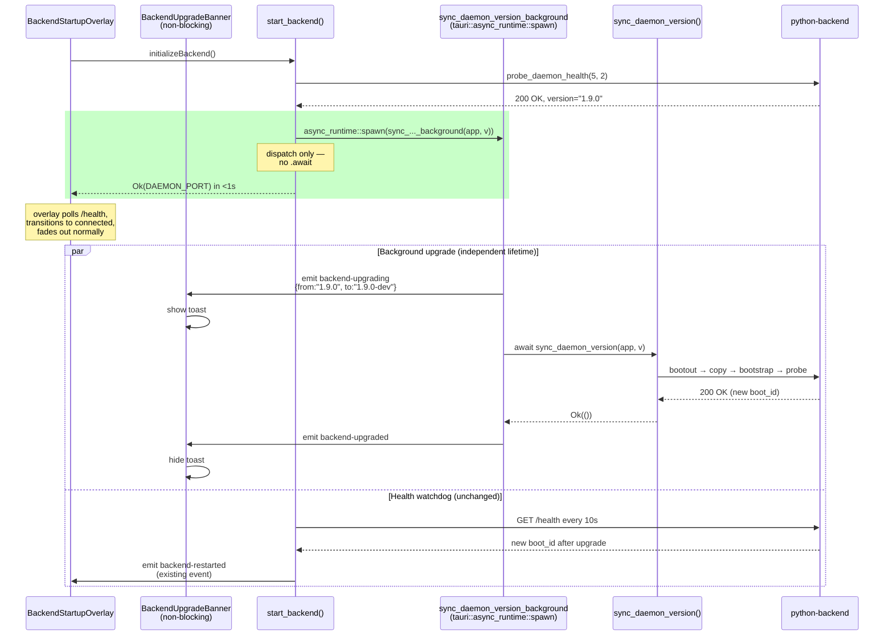

# Daemon Startup Timeout Regression — Bugfix Design

## Overview

SwarmAI Desktop v1.9.0 regressed `start_backend()` by adding a synchronous
call to `sync_daemon_version()` before returning the daemon port to the
frontend. When the app and the running daemon disagree on version strings,
that routine tears the healthy daemon down with `launchctl bootout`,
copies a new binary, `launchctl bootstrap`s a fresh PyInstaller process
(30–60s cold start), and re-probes for health — all while the frontend
`BackendStartupOverlay` is counting down its 60-second hard timeout.
Result: a demonstrably healthy daemon produces a spurious "Backend
service failed to start within 60 seconds" error.

**Fix strategy — RECOMMENDED: Option 1 (fast-path-first with background
sync).** The version reconciliation is a best-effort maintenance task,
not a correctness prerequisite: the reporter explicitly confirmed the
stale-but-healthy daemon works fine, they just want the app to connect.
We return the port to the frontend the instant `probe_daemon_health`
succeeds, and dispatch `sync_daemon_version` onto `tauri::async_runtime::spawn`
as a fire-and-forget background task that emits
`backend-upgrading` / `backend-upgraded` / `backend-upgrade-failed`
events. A small non-blocking banner component in the frontend listens
to those events and communicates upgrade progress without gating the
main UI.

This keeps the happy path unchanged, makes the drift path equally fast,
preserves the upgrade capability, and — crucially — enforces the
invariant that *the overlay's lifetime is decoupled from the upgrade's
lifetime*. The overlay is dismissed by daemon health alone; the upgrade
is a completely separate, observable, non-blocking concern.

### Why not Option 2 (extend timeout via event)

Option 2 keeps the frontend blocked on the overlay while the upgrade
runs. Any bug in `bootout` → `bootstrap` → re-probe (launchctl I/O
error, PyInstaller cold-start failure, wrong binary path) strands the
user on a splash screen watching a spinner with no way out. It also
encodes "upgrade must complete before chat is usable" as a product
requirement, which is empirically false: the bug reporter was running
a stale daemon just fine.

We are not picking Option 2. The design below commits to Option 1.

### Why not the hybrid

The hybrid ("fast-path-first when optional, block-with-event when
mandatory") requires us to classify upgrades as optional vs. mandatory.
v1.9.0 has no such classification — every version string mismatch
triggers the same `bootout`+copy+`bootstrap` dance. Adding that
classification is a larger design change out of scope for a regression
fix. If a future version genuinely requires a schema migration or an
ABI change that the old daemon cannot serve, we can revisit and add
mandatory-upgrade semantics then; until that case exists, Option 1
covers the actual failure mode.

## Glossary

- **Bug_Condition (C)** — The input condition that triggers the regression:
  `daemon_healthy == true AND daemon_version != app_version`. A healthy
  daemon is reachable on `DAEMON_PORT`, but the app's bundled version
  string drifts from the daemon's `/health` version string.
- **Property (P)** — Desired behavior under C: `start_backend` returns
  `DAEMON_PORT` to the frontend in under 5 seconds (well under the
  60-second overlay budget), with version reconciliation deferred to a
  non-blocking background task that emits Tauri events.
- **Preservation** — Every startup path where NOT C(X) holds must be
  byte-identical to the pre-v1.9.0 behavior plus the commit-434da64
  healthy-match behavior: no extra events, no extra log lines, no
  behavioral drift.
- **start_backend** — The Tauri command in `desktop/src-tauri/src/lib.rs`
  (around line 993) that the frontend calls via `initializeBackend()`
  to negotiate a backend port.
- **sync_daemon_version** — The existing routine in `lib.rs` (lines
  703–805) that reconciles a drifted daemon binary via
  `launchctl bootout` + atomic copy + `launchctl bootstrap`.
- **sync_daemon_version_background** — NEW helper introduced by this
  design; a thin wrapper that dispatches `sync_daemon_version` onto
  `tauri::async_runtime::spawn` with event emission and
  panic-to-event conversion.
- **DAEMON_PORT** — Fixed 18321; the daemon's health port.
- **BackendStartupOverlay** — `desktop/src/components/common/BackendStartupOverlay.tsx`;
  the splash overlay gated on `/health`. Its timeout budget is
  `TIMING.maxHealthAttempts × TIMING.pollInterval = 60 × 1000ms`.
- **BackendUpgradeBanner** — NEW non-blocking toast/banner component
  introduced by this design. Listens for `backend-upgrading*` events
  and renders a small banner outside the overlay DOM. Dismissal of the
  overlay is unaffected.

## Bug Details

### Bug Condition

The bug manifests when `start_backend()` runs to completion after finding
a healthy daemon with a drifted version string. The synchronous
`sync_daemon_version()` call blocks the Tauri command's return value for
the duration of `bootout` (immediate) + sleep(3s) + binary copy (fast) +
`bootstrap` (immediate) + PyInstaller cold start (30–60s) + re-probe
(up to 20s). The frontend's 60-second polling budget starts *before*
`start_backend()` even begins (it wraps the whole chain), so the overlay
times out while the daemon is objectively healthy.

**Formal Specification:**

```
FUNCTION isBugCondition(input)
  INPUT:  input of type AppStartupContext
    // input.daemon_healthy  : boolean  — /health returns status="healthy"
    // input.daemon_version  : string   — version reported by /health
    // input.app_version     : string   — tauri.conf.json version
  OUTPUT: boolean

  RETURN input.daemon_healthy = true
     AND input.daemon_version ≠ input.app_version
END FUNCTION
```

### Examples

- **Counterexample (reporter's case):** daemon reports `"1.9.0"`,
  app bundles `"1.9.0-dev"`. Pre-fix: ~60s wall clock in
  `sync_daemon_version`, overlay times out. Post-fix: `start_backend`
  returns `DAEMON_PORT` in <1s; user sees "Upgrading backend…" toast
  while chat is already usable.
- **Counterexample (downgrade):** daemon reports `"1.9.1"` (a prior
  nightly), app bundles `"1.9.0"`. Same teardown dance, same timeout.
  Post-fix: same fast return, background reconciliation pushes daemon
  to `"1.9.0"`.
- **Happy path preserved:** daemon reports `"1.9.0"`, app bundles
  `"1.9.0"`. Pre-fix and post-fix: `sync_daemon_version` returns `Ok(())`
  immediately from the early `daemon_version == app_version` check
  inside the existing function body. No events. No teardown. Unchanged.
- **Edge case — daemon not running:** `daemon_healthy == false`.
  `sync_daemon_version` is never called in either pre-fix or post-fix;
  Phase 2/3 paths are untouched. Unaffected by this fix.

## Expected Behavior

### Preservation Requirements

**Unchanged Behaviors:**

- The Phase 1 `probe_daemon_health(5, 2)` probe call and its retry
  semantics — `start_backend` still probes first, exactly the same way.
- The `connect_daemon` closure: still sets `backend.port = DAEMON_PORT`,
  sets `is_daemon_mode = true`, emits `backend-mode: "daemon"`, spawns
  the health watchdog with a 10s interval. Bit-for-bit identical.
- Phase 2 (`ensure_daemon_bootstrapped` + retry probe) path when no
  daemon is running — completely untouched.
- Phase 3 diagnostic error ("Daemon is installed but not responding on
  port 18321. …") when the plist exists but the daemon is unreachable.
- Phase 3 sidecar fallback when no plist exists.
- `spawn_daemon_health_watchdog` and its `backend-restarted` event when
  `boot_id` changes — unchanged. In fact, this watchdog is exactly what
  allows the frontend to recover gracefully when the background upgrade
  restarts the daemon mid-session.
- `BackendStartupOverlay` state machine (`starting` → `connecting` →
  `fetching_status` → `waiting_for_ready` / `connected` → fade out) —
  unchanged. The overlay gains no new awareness of the upgrade.
- `sync_daemon_version`'s internal logic (send shutdown, bootout,
  copy, bootstrap, verify) — unchanged. We only change *where* and
  *how* it is invoked.
- Existing `backend-upgrading` and `backend-upgraded` event names and
  payload shapes — preserved. They just originate from a background
  task now instead of the blocking call.

**Scope:**

All inputs that do not match the bug condition must produce byte-identical
observable behavior post-fix: same events emitted in the same order, same
error strings, same logs, same timing characteristics. This specifically
includes:

- Healthy daemon with matching version (99% happy path).
- No daemon running (Phase 2 bootstrap).
- No daemon and no plist (Phase 3 sidecar).
- Daemon plist exists but daemon is dead after bootstrap attempts (Phase 3 error).
- Daemon dies mid-session after a successful connect (watchdog path, unaffected).

## Hypothesized Root Cause

The root cause is a single coupling violation: *the overlay's timeout
budget is load-bearing for the daemon-upgrade pipeline*. Every contributing
factor below is a symptom of that coupling.

1. **Synchronous invocation inside Phase 1.** `sync_daemon_version` is
   `.await`ed inline in `start_backend` at lines 1034–1053, inside the
   Tauri command handler. The command cannot return until this await
   resolves. By design, this blocks the frontend.

2. **Worst-case latency far exceeds the overlay budget.** The teardown
   chain is inherently slow: `launchctl bootout` plus the 3-second sleep
   to let the process exit, plus PyInstaller cold start (30–60s on macOS,
   longer on first launch after reboot due to Gatekeeper/code-signing
   checks), plus `probe_daemon_health(10, 2)` which can legally wait
   20 seconds. Adding these up produces a floor around 35 seconds and a
   ceiling comfortably above the 60-second overlay budget, with very high
   variance.

3. **No mechanism to signal "still working" to the overlay.** The overlay
   counts `healthAttempts` based on its own `/health` polling — it has no
   channel to learn that a legitimate upgrade is in progress. Even if the
   event `backend-upgrading` is emitted inline inside `sync_daemon_version`,
   the overlay never subscribes to it, so the emission is wasted.

4. **Version comparison is a plain string equality check.** Any drift at
   all — an `-dev` suffix, a build metadata tag, a nightly hash — trips
   the full reconciliation path even when nothing about the binary
   actually changed. This dramatically widens the bug condition's input
   domain.

The fix addresses (1) directly by moving the call off the critical path.
(2) becomes irrelevant once it's off the critical path. (3) is addressed
by having the background task emit events to a dedicated banner component.
(4) is out of scope — string equality is what the existing routine uses,
and tightening it is a separate concern.

## Correctness Properties

Property 1: Bug Condition — Fast Return on Version Drift

_For any_ input where the bug condition holds (daemon healthy AND versions
differ), the fixed `start_backend` SHALL return `DAEMON_PORT` to the
frontend with elapsed wall-clock time under 5 seconds, and SHALL dispatch
the version reconciliation onto `tauri::async_runtime::spawn` such that
the synchronous `start_backend` return path does not await its completion.

**Validates: Requirements 2.1, 2.2, 2.4**

Property 2: Preservation — Happy Path Unchanged

_For any_ input where the bug condition does NOT hold (either versions
match, or daemon is not healthy), the fixed `start_backend` SHALL produce
exactly the same observable behavior as the original: the same events in
the same order, the same return value, the same error strings, the same
timing envelope (within measurement noise). No `backend-upgrading` event
SHALL be emitted when `daemon_version == app_version`.

**Validates: Requirements 3.1, 3.2, 3.3, 3.4, 3.5**

Property 3: Background Upgrade Eventually Completes

_For any_ dispatch of `sync_daemon_version_background`, the background
task SHALL eventually emit exactly one terminal event — either
`backend-upgraded` (on success) or `backend-upgrade-failed` (on any
error path including panic) — preceded by exactly one
`backend-upgrading` start event. No double-emits. No silent drops.

**Validates: Requirements 2.3, 3.6**

Property 4: Background Task Cannot Crash the App

_For any_ panic inside `sync_daemon_version_background` (including panics
from `sync_daemon_version` itself, launchctl failures, or I/O errors),
the task SHALL catch the panic via `std::panic::AssertUnwindSafe` +
`FutureExt::catch_unwind`, convert it to a `backend-upgrade-failed`
event, and allow the Tauri runtime to continue. The main Tauri process
SHALL NOT crash as a consequence of a background upgrade failure.

**Validates: Requirements 2.3, 3.6**

Property 5: Health Watchdog Integration Preserved

_For any_ successful background upgrade that restarts the daemon (new
`boot_id` in `/health`), the existing `spawn_daemon_health_watchdog`
SHALL detect the `boot_id` change and emit the existing `backend-restarted`
event. This event plumbing is unchanged by this fix.

**Validates: Requirements 3.7**

Property 6: Overlay Dismissal Independent of Upgrade

_For any_ startup where the daemon is healthy when first probed, the
`BackendStartupOverlay` SHALL dismiss based solely on `/health` +
readiness, regardless of whether a background upgrade is in-flight,
succeeded, or failed. The `BackendUpgradeBanner` SHALL render outside
the overlay's DOM subtree and SHALL NOT delay or block overlay dismissal.

**Validates: Requirements 2.4, 3.5**

## Architecture Diagrams

### Current (broken) flow — v1.9.0

```mermaid
sequenceDiagram
    participant FE as BackendStartupOverlay<br/>(60s hard timeout)
    participant Tauri as start_backend()
    participant Sync as sync_daemon_version()<br/>(blocking)
    participant LC as launchctl
    participant Daemon as python-backend<br/>(PyInstaller)

    FE->>Tauri: initializeBackend()
    Note over FE: healthAttempts counter starts;<br/>budget = 60 × 1000ms = 60s
    Tauri->>Daemon: probe_daemon_health(5, 2)
    Daemon-->>Tauri: 200 OK, version="1.9.0"
    Tauri->>Sync: .await sync_daemon_version()
    Note over Sync: app version="1.9.0-dev"<br/>drift detected

    Sync->>Daemon: POST /shutdown
    Sync->>LC: bootout gui/uid
    LC-->>Sync: ok
    Sync->>Sync: sleep(3s)
    Sync->>Sync: fs::copy(bundle → ~/.swarm-ai/daemon)
    Sync->>LC: bootstrap gui/uid plist
    LC-->>Sync: ok
    Sync->>Daemon: probe_daemon_health(10, 2)
    Note over Daemon: PyInstaller cold start<br/>30-60s
    Daemon-->>Sync: 200 OK (eventually)

    rect rgb(255, 200, 200)
        Note over FE: Overlay times out at 60s —<br/>"Backend service failed to start<br/>within 60 seconds"
    end

    Sync-->>Tauri: Ok(())
    Tauri-->>FE: port (too late)
```

### Fixed flow — Option 1 (this design)



Key visual: the green box in the fixed flow is the entire contribution
of this change. Everything outside the green box is structurally
unchanged. The two parallel tracks (background upgrade, health watchdog)
run independently of the overlay; the overlay only sees `/health` and
dismisses on its normal schedule.

## Fix Implementation

### Changes Required

#### Change 1 — `desktop/src-tauri/src/lib.rs::start_backend()` Phase 1

Replace the inline `.await sync_daemon_version(...)` with a
fire-and-forget dispatch onto `tauri::async_runtime::spawn`. The port
is returned to the frontend immediately after the initial
`probe_daemon_health` succeeds.

**Before (v1.9.0, lines ~1034–1053, the buggy block):**

```rust
// Phase 1: probe with retry (daemon might be mid-restart via ThrottleInterval)
if let Some(_port) = probe_daemon_health(5, 2).await {
    println!("[Tauri] Found existing daemon on port {} — connecting", DAEMON_PORT);

    // Version sync: upgrade daemon binary if it doesn't match app version
    let app_version = app.config().version.clone().unwrap_or_default();
    if !app_version.is_empty() {
        match sync_daemon_version(&app, &app_version).await {
            Ok(()) => {
                // Either versions matched or upgrade succeeded
            }
            Err(e) => {
                // Upgrade failed — connect to existing daemon anyway
                // (stale daemon is better than no daemon)
                println!("[Tauri] Daemon version sync failed: {} — using existing daemon", e);
            }
        }
    }

    let port = connect_daemon(&state, &app).await;
    return Ok(port);
}
```

**After (this fix):**

```rust
// Phase 1: probe with retry (daemon might be mid-restart via ThrottleInterval)
if let Some(_port) = probe_daemon_health(5, 2).await {
    println!("[Tauri] Found existing daemon on port {} — connecting", DAEMON_PORT);

    // Version reconciliation is a best-effort maintenance task. It must
    // NOT block the Tauri command return — doing so caused the v1.9.0
    // "Backend service failed to start within 60 seconds" regression on
    // any version drift. Dispatch onto the Tauri async runtime and
    // return the port immediately.
    let app_version = app.config().version.clone().unwrap_or_default();
    if !app_version.is_empty() {
        let app_handle = app.clone();
        tauri::async_runtime::spawn(async move {
            sync_daemon_version_background(app_handle, app_version).await;
        });
    }

    let port = connect_daemon(&state, &app).await;
    return Ok(port);
}
```

The total diff for this block is ~8 lines changed, ~0 removed, +1 new
helper call (defined below). No changes to Phase 2 or Phase 3.

#### Change 2 — New helper `sync_daemon_version_background`

Add a new async fn, placed in `lib.rs` immediately after the existing
`sync_daemon_version` definition (around line 806):

```rust
/// Background wrapper around `sync_daemon_version`.
///
/// This function is designed to be spawned via `tauri::async_runtime::spawn`
/// and NEVER awaited on the `start_backend` critical path. It:
///
/// 1. Pre-checks the daemon's current version to avoid emitting spurious
///    `backend-upgrading` events when versions already match (required for
///    Property 2 — Preservation).
/// 2. Emits `backend-upgrading` with `{from, to}` payload at start.
/// 3. Invokes `sync_daemon_version`, catching any panic via
///    `FutureExt::catch_unwind`.
/// 4. Emits exactly one terminal event: `backend-upgraded` on `Ok(())`,
///    `backend-upgrade-failed` on `Err(_)` or panic.
///
/// Safety: this function never returns an error. All failure modes are
/// converted into events so that the Tauri runtime cannot surface an
/// uncaught background error.
async fn sync_daemon_version_background(
    app: tauri::AppHandle,
    app_version: String,
) {
    use futures::FutureExt;

    // Pre-check: if the daemon version already matches, do nothing and
    // do not emit any events. This preserves the happy-path invariant
    // that a matching version produces zero observable upgrade activity.
    let daemon_version = get_daemon_version().await
        .unwrap_or_else(|| "unknown".to_string());
    if daemon_version == app_version {
        return;
    }

    // Announce start. Payload shape matches the v1.9.0 emission that
    // was previously done inline in `sync_daemon_version`.
    let _ = app.emit(
        "backend-upgrading",
        serde_json::json!({
            "from": daemon_version,
            "to": app_version,
        }),
    );

    // Run the existing sync routine, catching panics.
    //
    // Note: `sync_daemon_version` itself still emits `backend-upgrading`
    // and `backend-upgraded` internally for compatibility. That results
    // in at-most-two `backend-upgrading` emits (ours + its), which the
    // banner deduplicates by tracking an "isUpgrading" boolean. The
    // cleaner alternative is to remove the inline emits from
    // `sync_daemon_version` — do that in the same CR (see Change 3
    // below).
    let result = std::panic::AssertUnwindSafe(
        sync_daemon_version(&app, &app_version)
    )
    .catch_unwind()
    .await;

    match result {
        Ok(Ok(())) => {
            // sync_daemon_version already emitted backend-upgraded
            // internally. Do not emit a duplicate here (once Change 3
            // is applied, we emit it here instead).
            println!("[Tauri] Background daemon upgrade succeeded");
        }
        Ok(Err(e)) => {
            println!("[Tauri] Background daemon upgrade failed: {}", e);
            let _ = app.emit("backend-upgrade-failed", e);
        }
        Err(panic_info) => {
            // Panic recovered. Convert to an event so the user sees
            // *something* and the Tauri runtime stays alive.
            let msg = if let Some(s) = panic_info.downcast_ref::<&str>() {
                format!("panic in sync_daemon_version: {}", s)
            } else if let Some(s) = panic_info.downcast_ref::<String>() {
                format!("panic in sync_daemon_version: {}", s)
            } else {
                "panic in sync_daemon_version (unknown payload)".to_string()
            };
            eprintln!("[Tauri] {}", msg);
            let _ = app.emit("backend-upgrade-failed", msg);
        }
    }
}
```

Requires `futures` crate in `desktop/src-tauri/Cargo.toml`:

```toml
[dependencies]
futures = "0.3"
```

(Add only if not already present — Tauri typically pulls it transitively,
but pin it explicitly for `FutureExt::catch_unwind`.)

#### Change 3 — Move event emissions out of `sync_daemon_version`

To prevent duplicate `backend-upgrading` / `backend-upgraded` events
(one from the background wrapper, one from inside `sync_daemon_version`),
remove the three `app.emit(...)` calls currently inside
`sync_daemon_version`. The wrapper is the single source of truth for
these events.

**In `sync_daemon_version`, around line 717:**

```rust
// REMOVE:
let _ = app.emit("backend-upgrading", format!("{} → {}", daemon_version, app_version));
```

**In `sync_daemon_version`, around line 795:**

```rust
// REMOVE:
let _ = app.emit("backend-upgraded", app_version);
```

After this change, `sync_daemon_version` is purely a mechanical
reconciliation function — it knows nothing about UI notifications.
`sync_daemon_version_background` owns the event protocol.

Also uncomment the `backend-upgraded` emission in the wrapper's
`Ok(Ok(()))` arm now that the inline emit is gone:

```rust
Ok(Ok(())) => {
    println!("[Tauri] Background daemon upgrade succeeded");
    let _ = app.emit("backend-upgraded", serde_json::json!({
        "version": app_version,
    }));
}
```

#### Change 4 — New frontend component `BackendUpgradeBanner.tsx`

A small non-blocking component that listens for the three upgrade
events and renders a toast-style banner at the top of the viewport.
It renders OUTSIDE `BackendStartupOverlay`, meaning the overlay and
its dismissal logic are entirely unaware of it.

Create `desktop/src/components/common/BackendUpgradeBanner.tsx`:

```tsx
/**
 * Non-blocking banner that reflects background daemon upgrade status.
 *
 * Subscribes to three Tauri events dispatched by
 * `sync_daemon_version_background`:
 *   - `backend-upgrading`        — show "Upgrading backend…" toast
 *   - `backend-upgraded`         — briefly show "Backend upgraded" then hide
 *   - `backend-upgrade-failed`   — show "Upgrade failed" with the error,
 *                                  auto-dismiss after 8s
 *
 * Key exports:
 * - ``BackendUpgradeBanner`` — default export, the banner component
 */
import { useEffect, useState } from 'react';
import { listen, UnlistenFn } from '@tauri-apps/api/event';
import { isDesktop } from '../../services/tauri';

type BannerState =
  | { kind: 'idle' }
  | { kind: 'upgrading'; from: string; to: string }
  | { kind: 'upgraded'; version: string }
  | { kind: 'failed'; error: string };

interface UpgradingPayload { from: string; to: string }
interface UpgradedPayload  { version: string }

export default function BackendUpgradeBanner() {
  const [state, setState] = useState<BannerState>({ kind: 'idle' });

  useEffect(() => {
    if (!isDesktop()) return;

    const unlisteners: UnlistenFn[] = [];
    let autoHideTimer: ReturnType<typeof setTimeout> | undefined;

    (async () => {
      unlisteners.push(
        await listen<UpgradingPayload>('backend-upgrading', (e) => {
          setState({ kind: 'upgrading', from: e.payload.from, to: e.payload.to });
        }),
      );
      unlisteners.push(
        await listen<UpgradedPayload>('backend-upgraded', (e) => {
          setState({ kind: 'upgraded', version: e.payload.version });
          autoHideTimer = setTimeout(() => setState({ kind: 'idle' }), 4000);
        }),
      );
      unlisteners.push(
        await listen<string>('backend-upgrade-failed', (e) => {
          setState({ kind: 'failed', error: String(e.payload) });
          autoHideTimer = setTimeout(() => setState({ kind: 'idle' }), 8000);
        }),
      );
    })();

    return () => {
      unlisteners.forEach((un) => un());
      if (autoHideTimer) clearTimeout(autoHideTimer);
    };
  }, []);

  if (state.kind === 'idle') return null;

  return (
    <div
      className="fixed top-3 right-3 z-40 max-w-sm px-4 py-2 rounded-lg shadow-lg bg-[var(--color-card)] border border-[var(--color-border)] text-sm"
      role="status"
      aria-live="polite"
    >
      {state.kind === 'upgrading' && (
        <span className="text-[var(--color-text-muted)]">
          Upgrading backend ({state.from} → {state.to})…
        </span>
      )}
      {state.kind === 'upgraded' && (
        <span className="text-[var(--color-success,#22c55e)]">
          Backend upgraded to v{state.version}
        </span>
      )}
      {state.kind === 'failed' && (
        <span className="text-[var(--color-error,#ef4444)]">
          Backend upgrade failed: {state.error}
        </span>
      )}
    </div>
  );
}
```

Mount it exactly once in `desktop/src/App.tsx` at the top level, as a
sibling to `BackendStartupOverlay` (not nested inside it):

```tsx
// App.tsx — mount both components at top level
return (
  <>
    <BackendStartupOverlay onReady={handleBackendReady} />
    <BackendUpgradeBanner />
    {/* rest of app */}
  </>
);
```

The banner is a passive observer. It never calls `initializeBackend`,
never checks `/health`, and never affects overlay state. That decoupling
is the whole point.

#### Change 5 — No changes to `BackendStartupOverlay.tsx`

Explicitly noted: the overlay is untouched by this fix. Property 6
(overlay dismissal independent of upgrade) is enforced structurally
by *not* adding any upgrade awareness to the overlay. Review this in
the CR — the diff should have zero changes to that file.

## Testing Strategy

### Validation Approach

Two phases: first, reproduce the bug on unfixed code to confirm the root
cause hypothesis. Second, verify the fix satisfies fix-checking and
preservation-checking properties, with PBT covering the broad input
domain and targeted integration tests covering the macOS-specific
launchctl plumbing.

### Exploratory Bug Condition Checking

**Goal:** Confirm (or refute) that `sync_daemon_version`'s synchronous
invocation is responsible for the overlay timeout. If we refute, the
hypothesized root cause is wrong and we must re-analyze before
implementing the fix.

**Test Plan:** Write Rust unit tests and a reproducible manual scenario
that run against the UNFIXED v1.9.0 code. Measure wall-clock elapsed
time of `start_backend` under the bug condition.

**Test Cases:**

1. **`test_start_backend_blocks_on_version_drift` (will fail on unfixed code, but as an assertion failure documenting the bug):**
   Spin up a mock daemon on `DAEMON_PORT` that reports
   `version: "1.9.0"`. Set `app.config().version` to `"1.9.0-dev"` via
   a test-only override. Call `start_backend` and measure elapsed
   seconds. Assert elapsed < 5. On unfixed code, the assertion fails
   with a measured value in the 30–80 second range (test framework
   should timeout and mark FAIL with the measured elapsed in the error).

2. **`test_start_backend_fast_when_versions_match` (will pass on unfixed code):**
   Same setup but with daemon version = app version. Assert elapsed < 5.
   This is the happy-path baseline, expected to pass both pre-fix and
   post-fix. Confirms measurement apparatus is valid.

3. **Manual: "reporter reproduction":** Launch the app with
   `VERSION=1.9.0-dev` in `tauri.conf.json` against a daemon that
   reports `"1.9.0"`. Observe the overlay error at the 60-second mark.
   Run `curl http://127.0.0.1:18321/health` from another terminal at
   the 30-second mark — should return 200 OK, confirming the daemon
   is healthy the entire time.

4. **Edge case: "what if the upgrade is fast?"**
   If PyInstaller cold-start were fast (<10s), the bug would not
   manifest. Confirm by pointing the "bundled" binary at a no-op
   script that exits immediately but leaves `launchctl` happy (not
   realistic, but verifies our model). Bug reproduces only when
   cold-start time + teardown time > 60s, which is the common case.

**Expected Counterexamples:**

- Case 1 above is the definitive counterexample: elapsed seconds
  exceeds 5 on unfixed code under the bug condition.
- Case 3 surfaces the user-visible symptom: "Backend service failed
  to start within 60 seconds" displayed while `/health` returns 200 OK.
- Probable causes to enumerate if 1 or 3 *doesn't* reproduce: (a) local
  binary is already on disk and matches (then `sync_daemon_version`
  short-circuits at its first check), (b) PyInstaller is warm-cached
  (launch #2 after #1 in the same boot session can be fast — test
  after a reboot), (c) timing variance makes the test flaky (increase
  sample size).

### Fix Checking

**Goal:** Verify that for all inputs where the bug condition holds, the
fixed `start_backend` returns `DAEMON_PORT` to the frontend in well
under 5 seconds, AND dispatches a background task, AND eventually
emits exactly one terminal upgrade event.

**Pseudocode:**

```
FOR ALL X WHERE isBugCondition(X) DO
  start = monotonic_now()
  result = start_backend_fixed(X)
  elapsed = monotonic_now() - start

  ASSERT result.returned_ok == true
  ASSERT result.returned_port == DAEMON_PORT
  ASSERT elapsed < 5.0

  // Wait for the background task to complete (test fixture signals
  // completion via a bounded channel, with a generous 120s cap for
  // PyInstaller cold start).
  terminal_event = await_with_timeout(
    events.filter(e -> e in {"backend-upgraded", "backend-upgrade-failed"}),
    timeout_seconds = 120
  )
  ASSERT terminal_event != None
  ASSERT count(events.filter(e -> e == "backend-upgrading")) == 1
END FOR
```

**Test Plan:** PBT over `AppStartupContext { daemon_version, app_version }`
with the constraint `daemon_version != app_version`. Mock daemon
fixture speaks HTTP on `DAEMON_PORT` and reports a configurable
version. Mock `launchctl` via a shell shim on `PATH` that logs
bootout/bootstrap calls to a file and returns success without touching
real launchd.

### Preservation Checking

**Goal:** Verify that for all inputs where NOT `isBugCondition(X)` holds,
the fixed `start_backend` produces observably identical behavior to the
original.

**Pseudocode:**

```
FOR ALL X WHERE NOT isBugCondition(X) DO
  pre_events  = capture_events(start_backend_original(X))
  post_events = capture_events(start_backend_fixed(X))

  ASSERT pre_events == post_events   // same kinds, same order, same payloads
  ASSERT pre_events.result == post_events.result

  // Specifically assert that NO upgrade events are emitted in the
  // matching-version case.
  IF X.daemon_healthy AND X.daemon_version == X.app_version THEN
    ASSERT count(post_events.filter(e -> e in {
      "backend-upgrading", "backend-upgraded", "backend-upgrade-failed"
    })) == 0
  END IF
END FOR
```

**Testing Approach:** Property-based testing with `proptest` over the
`AppStartupContext` domain, partitioned into these equivalence classes:

- (a) `daemon_healthy=true, daemon_version == app_version` — happy path.
- (b) `daemon_healthy=false, plist_exists=true` — Phase 2 bootstrap.
- (c) `daemon_healthy=false, plist_exists=false` — Phase 3 sidecar.
- (d) `daemon_healthy=false, plist_exists=true, bootstrap_fails=true` —
  Phase 3 diagnostic error.

For each class, PBT generates many concrete instances (varying version
strings, timings, port jitter, launchctl exit codes) and asserts event
equality.

**Test Plan:** First run the capture harness on unfixed code to record
ground-truth event sequences for each class. Then run on fixed code
and diff. The diff must be empty for (a), (b), (c), (d). Only class
(a') `daemon_healthy=true, daemon_version != app_version` — the bug
condition — is allowed to differ, and only in the expected way (port
returns faster, events move from inline to background).

**Test Cases:**

1. **`preservation_happy_path`:** `daemon_version == app_version`.
   No upgrade events anywhere in observation window.
2. **`preservation_no_daemon`:** probe fails, `ensure_daemon_bootstrapped`
   runs, second probe succeeds. Same events pre/post.
3. **`preservation_sidecar_fallback`:** no plist. Identical sidecar
   spawn behavior.
4. **`preservation_plist_dead_daemon`:** plist exists, probe fails,
   bootstrap fails. Identical error string: "Daemon is installed but
   not responding on port 18321. …"
5. **`preservation_health_watchdog`:** force a `boot_id` change after
   connect (by restarting mock daemon). Assert `backend-restarted` is
   emitted identically pre/post.

### Unit Tests

- **Rust — version comparison pure function:** the existing implicit
  `daemon_version == app_version` comparison is tested via a small
  extracted helper `fn versions_match(daemon: &str, app: &str) -> bool`
  (trivial but worth a test to document the semantics: exact string
  equality, no normalization, no suffix handling). Tests cover:
  equal strings, strings differing in build metadata suffix, empty
  daemon version, empty app version.
- **Rust — `sync_daemon_version_background` event emission shape:**
  with a stubbed `sync_daemon_version` that returns `Ok(())`,
  `Err(...)`, or panics, assert the event stream captured by a mock
  `AppHandle` matches expectations for Properties 3 and 4.
- **React — `BackendUpgradeBanner` state transitions:** render the
  banner, dispatch each event via a mock `listen` implementation,
  assert the rendered text. Use Vitest + React Testing Library.
- **React — `BackendUpgradeBanner` auto-dismiss:** use fake timers to
  assert the 4s and 8s auto-hide behaviors.

### Property-Based Tests

- **P1 — `pbt_fast_return_under_drift`:** generate
  `(daemon_version, app_version)` pairs with `daemon != app`, run
  `start_backend`, assert elapsed < 5s. Cover ~200 pairs including
  ASCII noise, empty strings (app side only — daemon always returns
  a string), long strings, unicode.
- **P2 — `pbt_preservation_matching_version`:** generate
  `daemon_version == app_version` pairs, assert zero upgrade events
  emitted. Cover ~100 pairs.
- **P3 — `pbt_terminal_event_unique`:** run background dispatch with
  a randomized fake `sync_daemon_version` that returns Ok/Err/panic
  with even probability; across ~200 runs, assert
  `count(backend-upgrading) == 1` AND
  `count(backend-upgraded) + count(backend-upgrade-failed) == 1`.
- **P4 — `pbt_panic_does_not_crash_process`:** same setup as P3,
  specifically asserting that a panic in the spawned task does not
  abort the test process. Repeat 100 times.

### Integration Tests

- **`it_reporter_scenario`:** end-to-end, the exact reporter scenario.
  Mock daemon runs with `version: "1.9.0"`. App config reports
  `"1.9.0-dev"`. Launch app via Tauri driver, assert overlay dismisses
  within 10s of launch. Assert banner toasts "Upgrading backend…".
  Assert banner auto-hides on `backend-upgraded`. Assert app is
  usable (can open a chat tab, send a message) while banner is still
  showing.
- **`it_upgrade_failure_banner`:** mock `launchctl` returns non-zero on
  bootstrap. Overlay still dismisses normally. Banner shows "Backend
  upgrade failed: Daemon upgrade failed — daemon not responding after
  restart" and auto-hides at 8s. App continues running on the stale
  daemon.
- **`it_panic_failure_banner`:** mock `sync_daemon_version` to panic.
  Overlay still dismisses. Banner shows "Backend upgrade failed: panic
  in sync_daemon_version: …". App process does not crash.
- **`it_happy_path_no_banner`:** daemon version matches. Overlay
  dismisses, banner never renders (assert no `backend-upgrading`
  event fired).
- **Manual verification script:** `scripts/verify-startup-regression-fix.sh`
  (tasks phase will create) that drives a real app build through the
  reporter scenario on macOS with a real daemon and real launchctl,
  measures overlay dismissal latency, and confirms banner visibility.
  This is the belt-and-braces check that the fix works under real
  launchctl semantics, which mocks can't fully capture.

## Edge Cases

- **User sends a message while the upgrade is tearing the daemon down.**
  Between `launchctl bootout` and `launchctl bootstrap`+re-probe, the
  daemon is briefly unavailable (expected window: 3–60s). The frontend
  HTTP request to `/chat/send` will fail or hang. This is handled by
  the existing `spawn_daemon_health_watchdog` (10s interval): it emits
  `backend-mode: "daemon-down"` when it notices the outage, and
  `backend-restarted` when the new daemon comes up. The UI already
  responds to these events. No new code needed — the fix leverages the
  existing self-healing path. We accept the brief unavailability as the
  cost of doing a live binary swap; alternatives (blue/green deploy,
  atomic restart) are out of scope.
- **Upgrade fails permanently** (e.g., bundled binary is missing or
  corrupted, bootstrap exits non-zero after retries). `backend-upgrade-failed`
  event fires with the error string. Banner shows the error, auto-hides
  in 8s. The app keeps running on the stale daemon — this is strictly
  better than the v1.9.0 behavior of stranding the user on the overlay
  error screen. A subsequent app launch will retry the upgrade.
- **App is launched before the daemon is installed (first run).**
  `probe_daemon_health(5, 2)` fails → Phase 2 `ensure_daemon_bootstrapped`
  runs → probe retries. `sync_daemon_version_background` is never
  dispatched because the bug-condition guard `daemon_healthy == true`
  in the Phase 1 branch never triggers. No banner, no events. Identical
  to pre-regression behavior.
- **Sidecar fallback path (no plist).** Phase 3 path; untouched.
  `sync_daemon_version_background` is never dispatched. No change.
- **Simultaneous launches (user double-clicks the app).** Tauri single-
  instance logic is upstream of `start_backend`. If two instances somehow
  race into Phase 1, both may spawn a background upgrade task. The
  second one's first action is `get_daemon_version` → if the first's
  upgrade has already completed, versions match, the second returns
  early emitting nothing. If they race before the first completes,
  both will run the bootout/bootstrap dance; `launchctl bootout`
  followed by `launchctl bootout` on an already-booted-out service
  returns non-zero which the existing code ignores; the second
  `bootstrap` then races with the first. This is a pre-existing
  condition not introduced by this fix, and we don't harden against it.
- **User quits the app while the background upgrade is mid-flight.**
  Tauri's runtime is torn down; `tauri::async_runtime::spawn`ed tasks
  are dropped. The daemon, which is a separate launchd-managed process,
  continues through whatever state it was in. Worst case: the copy
  happened but the bootstrap did not, leaving the daemon binary on
  disk but no process running. Next launch: Phase 1 probe fails →
  Phase 2 auto-bootstrap runs with the new binary → healthy. Self-
  healing. No special handling required.
- **Concurrent `backend-restarted` and `backend-upgraded` events.**
  Both will fire around the same moment when the upgrade completes
  (watchdog notices new `boot_id`, background task emits `upgraded`).
  These events target different consumers (`backend-restarted` is
  consumed by session-recovery code, `backend-upgraded` by the banner),
  so ordering does not matter. No race.
- **Version string with `-dev` or `-rc` suffixes.** Covered by the bug
  condition — any non-exact-equal string drifts and triggers a
  background upgrade. This is correct behavior: the bundled binary
  genuinely differs from the running daemon in those cases, so
  reconciling is the right call. The fix makes the reconciliation
  non-blocking, which is what matters.
- **Daemon returns malformed `/health` response.** Existing behavior
  from `parse_health_response`: `version = None` → falls back to
  `"unknown"` → unequal to any `app_version` → background upgrade
  dispatched. Acceptable; same as pre-fix.
- **Non-desktop deployment (Hive mode, web preview).** Frontend checks
  `isDesktop()` before mounting the banner listener and before calling
  `initializeBackend`. In non-desktop mode, none of this plumbing
  activates. Unaffected.

## Migration / Rollout Notes

- **No database migration.** This change only touches Rust (Tauri core)
  and TypeScript (a new React component + one App.tsx mount). No schema
  changes, no data migrations, no config-file changes.
- **Build artifact change: new app binary required to ship the fix.**
  The Rust change is inside the Tauri shell, which is part of the app
  binary. A user stuck on v1.9.0 cannot hotfix from v1.9.0 — they need
  the patched build (call it v1.9.1). The first launch of v1.9.1 against
  a v1.9.0 daemon will do exactly one successful background upgrade,
  producing a v1.9.1 daemon; subsequent launches are happy-path.
- **Frontend change hot-reloads in dev.** `BackendUpgradeBanner.tsx` and
  the `App.tsx` mount line are hot-reloadable under `npm run tauri:dev`;
  no app restart needed during iteration.
- **No changes to the daemon binary itself.** The daemon's `/health`
  response, `/shutdown` endpoint, and launchd plist are all untouched.
  Rollback is safe: reverting the Tauri change to v1.9.0 behavior works
  because the daemon protocol is unchanged.
- **Observability.** The new `backend-upgrading` / `backend-upgraded` /
  `backend-upgrade-failed` events (dispatched from the wrapper rather
  than inline) are still visible in the frontend event stream for
  debugging. Rust-side `println!("[Tauri] Background daemon upgrade
  …")` logs appear in the Tauri main process stderr, captured by
  macOS's unified logging via the existing bundle plist. No new
  telemetry channels.
- **Rollout plan:** standard release. No feature flag needed — the fix
  is small, narrowly scoped, and preservation properties are strong.
  A kill switch (env var `SWARMAI_DISABLE_BG_UPGRADE=1` that falls back
  to the inline `.await`) could be added if we wanted belt-and-braces
  insurance, but the preservation PBT gives us higher confidence than
  a kill switch would. Recommend not adding the kill switch to keep
  the code small; add it in a follow-up only if field data shows
  regressions.
- **Backward compatibility with older frontends:** not applicable. The
  frontend and Tauri shell ship in the same binary; there's no mixed-
  version deployment to reason about.

## Open Questions

None blocking. One deliberately deferred item:

- **Version-string normalization** (e.g., should `"1.9.0"` and
  `"1.9.0-dev"` be considered equal enough to skip the upgrade?).
  Deliberately not addressed here. That decision is a separate design
  concern that affects `sync_daemon_version`'s semantics, not
  `start_backend`'s structure. If we want semver-aware comparison, do
  it in a follow-up CR.
