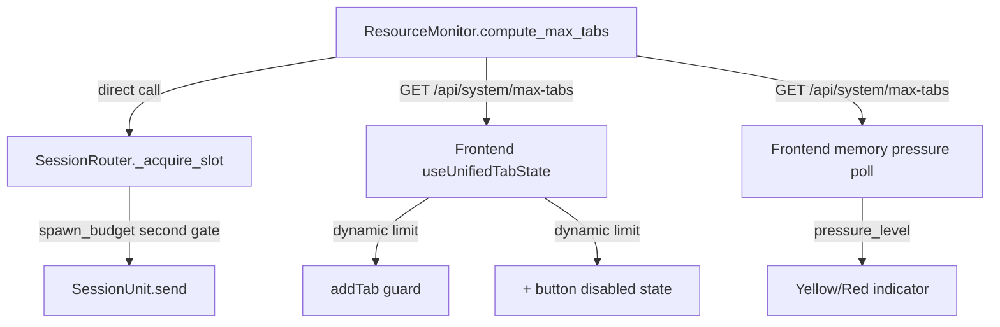

# Design Document: Dynamic Tab Scaling

## Overview

Dynamic tab scaling replaces the hardcoded frontend tab limit (`MAX_OPEN_TABS=6`) and backend concurrency cap (`MAX_CONCURRENT=2`) with a single dynamic value computed from available system RAM. The formula `clamp(floor((available_ram_mb - 1024) / 500), 1, 4)` ensures every open tab is backed by a real concurrency slot with enough memory for a full CLI+MCP subprocess (~500MB each).

This is a surgical change (~80 lines of real code) touching four existing modules and adding one new API endpoint. No new components, no new failure modes, no architectural changes.

### Key Design Decisions

1. **Single source of truth**: `ResourceMonitor.compute_max_tabs()` is the only place the formula lives. Backend reads it directly; frontend fetches it via API.
2. **Re-check on every tab creation**: Both `_acquire_slot()` and `addTab()` re-evaluate the limit, so the system adapts to memory changes between tab opens.
3. **No eviction on shrinkage**: If available RAM drops after tabs are open, existing tabs continue working. Only new tab creation is blocked.
4. **Warn-only memory pressure**: Yellow/red indicators inform the user but never auto-close tabs.
5. **Channel-forward naming**: `compute_max_tabs()` governs the desktop tab pool only, leaving room for a future separate channel session pool.
6. **`spawn_budget()` remains**: It acts as a second-layer safety net after the concurrency cap check.

## Architecture

The change flows through three layers:



### Change Map

| Layer | File | Change |
|-------|------|--------|
| Backend | `resource_monitor.py` | Add `compute_max_tabs()` method (~10 lines) |
| Backend | `session_router.py` | Replace `MAX_CONCURRENT=2` with `compute_max_tabs()` call in `_acquire_slot()` (~5 lines) |
| Backend | `routers/system.py` | Add `GET /api/system/max-tabs` endpoint (~15 lines) |
| Frontend | `useUnifiedTabState.ts` | Replace `MAX_OPEN_TABS=6` with async fetch, update `addTab()` (~25 lines) |
| Frontend | `ChatPage.tsx` | Disable "+" button at limit, add memory pressure indicator, poll loop (~25 lines) |

## Components and Interfaces

### 1. `ResourceMonitor.compute_max_tabs()` (Backend)

New method on the existing `ResourceMonitor` singleton.

```python
def compute_max_tabs(self) -> int:
    """Compute dynamic tab limit from available RAM.
    
    Formula: clamp(floor((available_ram_mb - 1024) / 500), 1, 4)
    
    Uses system_memory() which has psutil + macOS vm_stat fallback.
    On failure, system_memory() returns pessimistic fallback (1600MB available),
    which yields floor((1600 - 1024) / 500) = floor(1.152) = 1.
    """
    mem = self.system_memory()
    available_mb = mem.available / (1024 * 1024)
    raw = int((available_mb - 1024) // 500)
    return max(1, min(raw, 4))
```

**Design rationale**: The 1024MB headroom is larger than `_HEADROOM_MB=512` because `compute_max_tabs()` is a planning function (how many tabs *should* we allow?) while `spawn_budget()` is a safety gate (can we spawn *right now*?). The planning function needs more margin because all planned tabs may spawn concurrently.

### 2. `SessionRouter._acquire_slot()` (Backend)

Replace the hardcoded `MAX_CONCURRENT` read with a dynamic call:

```python
# Before:
if self.alive_count < self.MAX_CONCURRENT:

# After:
from .resource_monitor import resource_monitor
max_tabs = resource_monitor.compute_max_tabs()
if self.alive_count < max_tabs:
```

The `MAX_CONCURRENT=2` class attribute is kept as a fallback constant but no longer used in `_acquire_slot()`. The `spawn_budget()` check that follows remains unchanged as a second-layer gate.

### 3. `GET /api/system/max-tabs` Endpoint (Backend)

New endpoint in `routers/system.py`:

```python
class MaxTabsResponse(BaseModel):
    max_tabs: int
    memory_pressure: str  # ok | warning | critical

@router.get("/max-tabs", response_model=MaxTabsResponse)
async def get_max_tabs() -> MaxTabsResponse:
    from core.resource_monitor import resource_monitor
    resource_monitor.invalidate_cache()
    mem = resource_monitor.system_memory()
    return MaxTabsResponse(
        max_tabs=resource_monitor.compute_max_tabs(),
        memory_pressure=mem.pressure_level,
    )
```

Returns both `maxTabs` and `memoryPressure` in a single call so the frontend can use one endpoint for both the tab limit and the pressure indicator, reducing API calls.

### 4. Frontend `useUnifiedTabState` Changes

Two distinct limits govern tab behavior:

- **Hard ceiling (4)**: Used by `restoreFromFile()` — all saved tabs are restored to the UI regardless of current resources. This is a constant, not dynamic.
- **Dynamic limit (1–4)**: Used by `addTab()` — new tab creation is gated by current available RAM.

Changes:
- Remove `MAX_OPEN_TABS = 6` constant.
- Add `MAX_TABS_HARD_CEILING = 4` constant (for restore).
- Add `MAX_OPEN_TABS_FALLBACK = 2` constant (for API failure).
- `restoreFromFile()` uses `data.tabs.slice(0, MAX_TABS_HARD_CEILING)` — always restores up to 4 tabs.
- `addTab()` becomes async: fetches `GET /api/system/max-tabs` before checking the limit.
- On API failure, `addTab()` falls back to `MAX_OPEN_TABS_FALLBACK = 2`.

**Restore-vs-spawn flow on app restart:**

```
App restart → open_tabs.json has 4 tabs → compute_max_tabs() returns 2

restoreFromFile():
  Tab A → restored (visible in UI, COLD state, no subprocess)
  Tab B → restored (visible in UI, COLD state, no subprocess)
  Tab C → restored (visible in UI, COLD state, no subprocess)
  Tab D → restored (visible in UI, COLD state, no subprocess)

User clicks Tab A → send() → _acquire_slot() → spawn (slot 1/2)
User clicks Tab B → send() → _acquire_slot() → spawn (slot 2/2)
User clicks Tab C → send() → _acquire_slot() → evict IDLE Tab A → spawn
User clicks "+" → addTab() → fetch maxTabs=2 → 4 >= 2 → REJECTED
```

All 4 tabs are visible and accessible. Subprocesses spawn on-demand. The "+" button is disabled because open tab count (4) exceeds the dynamic limit (2). The user can't create new tabs but can use all their restored ones.

### 5. Frontend Memory Pressure Indicator

- `ChatPage` polls `GET /api/system/max-tabs` every 30 seconds.
- Displays a yellow indicator at `warning` level (75–90% used).
- Displays a red indicator at `critical` level (≥90% used).
- Indicator is informational only — no auto-eviction.
- Polling stops when no tabs are open (edge case: always at least 1 tab).

### 6. "+" Button Disabled State

- When `openTabs.length >= maxTabs`, the "+" button is disabled.
- Tooltip: "System resources are limited. Close a tab or free memory to open another."
- Re-enabled when a tab is closed or memory frees up (next poll or next `addTab()` re-fetch).

## Data Models

### Backend Response Model

```python
class MaxTabsResponse(BaseModel):
    max_tabs: int           # 1–4, the computed tab limit
    memory_pressure: str    # "ok" | "warning" | "critical"
```

### Frontend Types

```typescript
interface MaxTabsInfo {
  maxTabs: number;          // 1–4 from API
  memoryPressure: 'ok' | 'warning' | 'critical';
}
```

No new database tables, no new persistent state. The dynamic limit is computed on-the-fly from system memory readings. The only persisted change is that `open_tabs.json` will naturally contain fewer tabs (max 4 instead of 6).

### Formula Reference Table

| Available RAM | `(ram - 1024) / 500` | `floor()` | `clamp(1,4)` | Max Tabs |
|--------------|----------------------|-----------|---------------|----------|
| 512 MB       | -1.024               | -2        | 1             | 1        |
| 1024 MB      | 0.0                  | 0         | 1             | 1        |
| 1524 MB      | 1.0                  | 1         | 1             | 1        |
| 1525 MB      | 1.002                | 1         | 1             | 1        |
| 2024 MB      | 2.0                  | 2         | 2             | 2        |
| 2524 MB      | 3.0                  | 3         | 3             | 3        |
| 3024 MB      | 4.0                  | 4         | 4             | 4        |
| 8192 MB      | 14.336               | 14        | 4             | 4        |
| 16384 MB     | 30.72                | 30        | 4             | 4        |


## Correctness Properties

*A property is a characteristic or behavior that should hold true across all valid executions of a system — essentially, a formal statement about what the system should do. Properties serve as the bridge between human-readable specifications and machine-verifiable correctness guarantees.*

### Property 1: Formula correctness (model-based)

*For any* non-negative available RAM value in megabytes, `compute_max_tabs()` should return the same integer as the reference formula `max(1, min(floor((available_mb - 1024) / 500), 4))`.

This is a model-based property: we have a simple reference implementation and verify the production code matches it for all inputs. Edge cases (≤1524MB → 1, ≥3024MB → 4, pessimistic fallback 1600MB → 1) are covered by the generator producing values across the full range.

**Validates: Requirements 1.1, 1.2, 1.3, 1.4, 1.6**

### Property 2: Router respects dynamic limit

*For any* value N returned by `compute_max_tabs()` and any `alive_count` < N, `_acquire_slot()` should grant the slot without queueing (assuming `spawn_budget().can_spawn` is true). Conversely, for any `alive_count` ≥ N with no IDLE sessions to evict, `_acquire_slot()` should not grant immediate access.

**Validates: Requirements 2.1, 2.3**

### Property 3: No eviction on budget shrinkage

*For any* set of alive sessions in STREAMING or WAITING_INPUT state, decreasing the value returned by `compute_max_tabs()` should never cause any of those sessions to be killed or evicted. The eviction path should only trigger when a *new* session requests a slot and an IDLE session exists.

**Validates: Requirements 2.3, 7.1, 7.3**

### Property 4: API-method consistency

*For any* system memory state, the `max_tabs` field returned by `GET /api/system/max-tabs` should equal the value returned by `ResourceMonitor.compute_max_tabs()` when called with the same memory snapshot.

**Validates: Requirements 3.1**

### Property 5: Frontend addTab rejection at limit

*For any* tab count N and dynamic max tabs value M where N ≥ M, calling `addTab()` should return `undefined` and the tab count should remain N (no new tab created). For N < M, `addTab()` should return a valid `OpenTab` and the tab count should become N + 1.

**Validates: Requirements 4.3, 7.2**

### Property 6: Tabs never auto-closed by pressure or shrinkage

*For any* set of open tabs and any memory pressure transition (ok → warning → critical or any direction), the number of open tabs should never decrease unless the user explicitly calls `closeTab()`. Memory pressure indicators are display-only.

**Validates: Requirements 6.5, 7.2**

### Property 7: Restore loads all saved tabs regardless of dynamic limit

*For any* saved tab count S in [1, 4] and any dynamic max tabs value M in [1, 4] where S > M, `restoreFromFile()` should restore all S tabs to the UI. The tab count after restore should equal S, not M. The `addTab()` function should still reject new tabs when open count ≥ M.

**Validates: Requirements 4a.1, 4a.2, 4a.5**

## Error Handling

### Backend Errors

| Scenario | Handling | Result |
|----------|----------|--------|
| `system_memory()` fails (psutil + vm_stat both fail) | Returns pessimistic fallback: 1600MB available | `compute_max_tabs()` returns 1 |
| `compute_max_tabs()` throws unexpectedly | `_acquire_slot()` catches and falls back to `MAX_CONCURRENT=2` | Existing behavior preserved |
| `/api/system/max-tabs` endpoint error | Returns `{"maxTabs": 1}` with HTTP 200 | Frontend gets safe minimum |

### Frontend Errors

| Scenario | Handling | Result |
|----------|----------|--------|
| `GET /api/system/max-tabs` network failure | Falls back to `MAX_OPEN_TABS_FALLBACK = 2` | User can open 2 tabs |
| `GET /api/system/max-tabs` returns invalid JSON | Falls back to `MAX_OPEN_TABS_FALLBACK = 2` | User can open 2 tabs |
| Memory pressure poll fails | Hides indicator (assumes "ok") | No false alarms |
| Backend not yet ready on startup | Uses fallback until first successful fetch | Graceful degradation |

### Invariants Preserved

- Existing tabs are never killed by this feature under any error condition.
- The `spawn_budget()` second-layer gate remains active regardless of `compute_max_tabs()` behavior.
- Channel gateway (`channels/gateway.py`) is completely untouched.

## Testing Strategy

### Property-Based Testing (Backend — Python)

**Library**: `hypothesis` (already in use — `.hypothesis/` directory exists in workspace root)

**Configuration**: Minimum 100 examples per property test. Each test tagged with:
```
Feature: dynamic-tab-scaling, Property {N}: {property_text}
```

| Property | Test Description | Generator |
|----------|-----------------|-----------|
| Property 1 | `test_compute_max_tabs_matches_formula` — Generate random `available_mb` floats in [0, 65536], mock `system_memory()` to return that value, verify `compute_max_tabs()` matches reference formula. | `st.floats(min_value=0, max_value=65536)` |
| Property 2 | `test_acquire_slot_respects_dynamic_limit` — Generate random `max_tabs` in [1,4] and `alive_count` in [0,6], mock `compute_max_tabs()`, verify slot grant/deny matches expectation. | `st.integers(1,4)` × `st.integers(0,6)` |
| Property 3 | `test_no_eviction_on_shrinkage` — Generate a list of sessions with random states (STREAMING/WAITING_INPUT), decrease `max_tabs`, verify no session is killed. | `st.lists(st.sampled_from(["STREAMING", "WAITING_INPUT"]))` |
| Property 5 | `test_add_tab_rejection_at_limit` — Generate random `tab_count` in [0,6] and `max_tabs` in [1,4], verify addTab behavior. | `st.integers(0,6)` × `st.integers(1,4)` |

### Unit Tests (Backend)

- `test_compute_max_tabs_boundary_values`: Verify exact outputs at 512, 1024, 1524, 1525, 2024, 2524, 3024, 8192, 16384 MB.
- `test_compute_max_tabs_pessimistic_fallback`: Mock `system_memory()` failure, verify returns 1.
- `test_max_tabs_endpoint_returns_200`: Call endpoint, verify HTTP 200 and valid JSON shape.
- `test_max_tabs_endpoint_invalidates_cache`: Verify `invalidate_cache()` is called before reading.
- `test_acquire_slot_calls_compute_max_tabs`: Verify `_acquire_slot()` calls `compute_max_tabs()` (not hardcoded).
- `test_spawn_budget_still_checked`: Verify `spawn_budget()` is called after concurrency cap check.

### Unit Tests (Frontend)

- `test_add_tab_fetches_before_check`: Mock API, verify fetch is called before limit evaluation.
- `test_add_tab_fallback_on_api_failure`: Mock API failure, verify fallback to 2.
- `test_plus_button_disabled_at_limit`: Render ChatPage with tabs at limit, verify button disabled.
- `test_plus_button_tooltip_text`: Verify correct tooltip message when disabled.
- `test_memory_pressure_yellow_indicator`: Mock warning pressure, verify yellow indicator renders.
- `test_memory_pressure_red_indicator`: Mock critical pressure, verify red indicator renders.
- `test_memory_pressure_hidden_on_ok`: Mock ok pressure, verify no indicator.
- `test_polling_interval_30s`: Verify polling uses 30-second interval.

### Property-Based Tests (Frontend — TypeScript)

**Library**: `fast-check` (standard PBT library for TypeScript/Vitest)

| Property | Test Description |
|----------|-----------------|
| Property 5 | `test_add_tab_rejection` — Generate random tab counts and max values, verify addTab logic. |
| Property 6 | `test_tabs_never_auto_closed` — Generate random pressure transitions, verify tab count never decreases. |
| Property 7 | `test_restore_loads_all_saved_tabs` — Generate saved tab count S in [1,4] and max tabs M in [1,4], verify restoreFromFile loads S tabs and addTab rejects when open ≥ M. |

### Integration Tests

- End-to-end: Start backend, call `/api/system/max-tabs`, verify response matches expected range [1,4].
- Frontend integration: Mount ChatPage, mock API to return `maxTabs: 2`, open 2 tabs, verify 3rd tab blocked.
