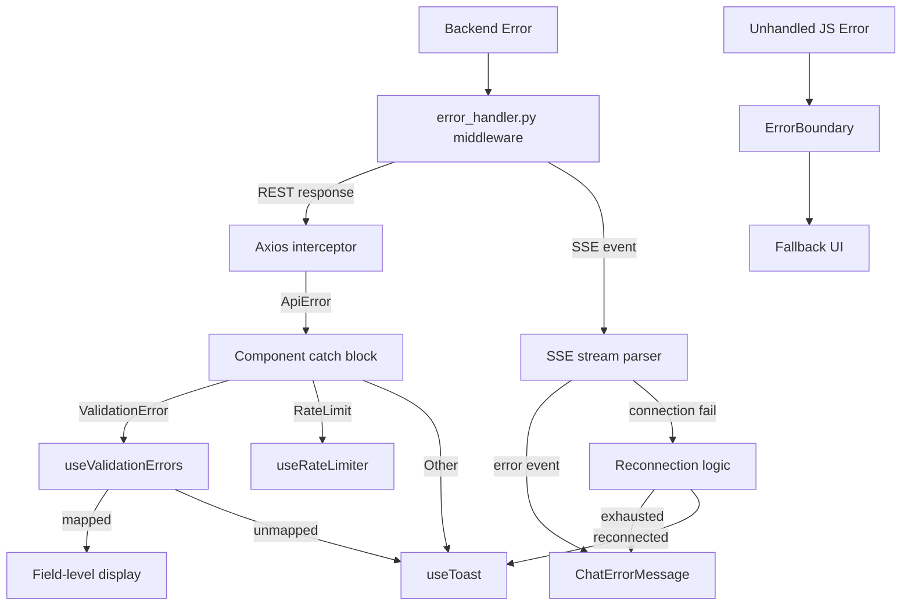

# Design Document: Error Handling UX

## Overview

This design adds nine interconnected error-handling and resilience features to the SwarmAI desktop app. The goal is to make the app communicative and self-healing when things go wrong — from backend outages and SSE stream failures to rate limits, permission timeouts, and validation errors.

The features form a layered system:

1. **Infrastructure layer** — Health monitoring (R1) and SSE resilience (R2) detect problems.
2. **Notification layer** — Toast system (R5) and error boundaries (R4) surface problems to the user.
3. **Enforcement layer** — Rate limiting (R6) and permission lifecycle (R7) enforce time-based constraints.
4. **Display layer** — Validation errors (R8), structured chat errors (R9), and stream cancellation (R3) give users actionable feedback.

All new frontend state follows the existing tabMapRef-authoritative / React-state-as-mirror pattern. No shared mutable state is introduced outside of session-keyed structures.

## Architecture

### System Context

```mermaid
graph TB
    subgraph Frontend ["React Frontend (Tauri Webview)"]
        App[App.tsx]
        EB_App[AppErrorBoundary]
        EB_Tab[TabErrorBoundary]
        Toast[ToastProvider / useToast]
        HM[useHealthMonitor]
        RL[useRateLimiter]
        SSE[useChatStreamingLifecycle]
        PD[PermissionDialog]
        VE[useValidationErrors]
        ChatErr[ChatErrorMessage]
    end

    subgraph Backend ["Python FastAPI Sidecar"]
        Health["/health endpoint"]
        ErrMW[error_handler.py middleware]
        Chat["/api/chat SSE endpoint"]
        Perm[permission_manager.py]
    end

    HM -->|GET /health every 30s| Health
    SSE -->|fetch + TextDecoder| Chat
    PD -->|POST /api/chat/permission| Perm
    RL -->|reads Retry-After header| ErrMW
    VE -->|reads ValidationErrorResponse| ErrMW
    ChatErr -->|reads SSE error events| Chat

    HM -->|status changes| Toast
    SSE -->|reconnect/fail events| Toast
    RL -->|cooldown events| Toast
    PD -->|timeout/error events| Toast
```



### Key Design Decisions

1. **Health monitor as a hook, not a service class** — `useHealthMonitor` runs inside React's lifecycle, making it easy to integrate with the toast system and header UI. It stores status in a React context so any component can read it.

2. **Toast system via React context + hook** — A `ToastProvider` at the app root with a `useToast()` hook avoids prop drilling. The provider manages the queue and renders the toast stack. This is the standard pattern for cross-cutting notification concerns in React.

3. **Error boundaries at two levels** — A per-tab boundary isolates chat crashes. An app-level boundary is the last-resort fallback. Both use the same `ErrorBoundary` component with different fallback UIs.

4. **Rate limiter as a hook** — `useRateLimiter` tracks per-endpoint cooldowns in a ref-based map. It exposes `isLimited(endpoint)` and `getRemainingSeconds(endpoint)` for UI components to consume.

5. **SSE reconnection inside existing `useChatStreamingLifecycle`** — Rather than creating a new hook, reconnection logic is added to the existing streaming lifecycle hook. This keeps the SSE state machine in one place and respects the existing tabMapRef isolation pattern.

6. **Permission timeout on the frontend** — The backend already has a 300s timeout in `wait_for_permission_decision`. The frontend adds a visible countdown and auto-deny at 5 minutes to match, ensuring the UI stays in sync.


## Components and Interfaces

### 1. Health Monitor (`useHealthMonitor` hook + `HealthProvider` context)

**File:** `desktop/src/hooks/useHealthMonitor.ts`
**Context:** `desktop/src/contexts/HealthContext.tsx`

```typescript
interface HealthState {
  status: 'connected' | 'disconnected' | 'initializing';
  lastCheckedAt: number | null;
  consecutiveFailures: number;
}

interface HealthContextValue {
  health: HealthState;
}

function useHealthMonitor(options?: {
  intervalMs?: number;       // default 30_000 (local sidecar — see note below)
  failureThreshold?: number; // default 2
}): HealthState;
```

- Polls `GET /health` at the configured interval.
- After `failureThreshold` consecutive failures, transitions to `'disconnected'`.
- On recovery, transitions back to `'connected'`.
- Fires toast notifications on transitions via `useToast()`.
- Exposed via `HealthProvider` so header and input components can read status.

**Note on local sidecar context:** Unlike a remote service, the backend runs as a local Tauri sidecar. The primary crash detection mechanism is Tauri's process exit event (which fires immediately). Health polling serves as a secondary check for "alive but unhealthy" states (e.g., `status: "initializing"` during startup). The default 30-second interval reflects this — increase frequency only if needed. During `initializing` status, the UI should show a "Starting up..." indicator rather than "disconnected."

### 2. Toast Notification System (`ToastProvider` + `useToast` hook)

**File:** `desktop/src/contexts/ToastContext.tsx`
**Component:** `desktop/src/components/common/ToastStack.tsx`

```typescript
type ToastSeverity = 'success' | 'info' | 'warning' | 'error';

interface ToastOptions {
  severity: ToastSeverity;
  message: string;
  autoDismiss?: boolean;    // default: true for success/info, false for warning/error
  durationMs?: number;      // default: 5000 for auto-dismiss
  id?: string;              // for deduplication
}

interface ToastItem extends ToastOptions {
  id: string;
  createdAt: number;
}

interface ToastContextValue {
  addToast: (options: ToastOptions) => string;
  removeToast: (id: string) => void;
  toasts: ToastItem[];
}

function useToast(): ToastContextValue;
```

- `ToastProvider` wraps the app at the root level (inside `ThemeProvider`, outside `BrowserRouter`).
- `ToastStack` renders in fixed position top-right, max 5 visible, overflow queued.
- Success/info auto-dismiss after 5s. Warning/error persist until manual dismiss (unless `autoDismiss: true`).
- Deduplication by optional `id` — if a toast with the same id exists, it's replaced rather than stacked.

#### Migration from Existing Toast Components

The codebase has several ad-hoc toast implementations that will be consolidated:

| Current Component | Location | Migration |
|---|---|---|
| `Toast` (standalone) | `components/common/Toast.tsx` | Replace with `useToast()` calls. Deprecate component. |
| `ErrorToast` | `components/common/ErrorBoundary.tsx` | Remove. Error boundary logs to console; API errors use `useToast()`. |
| `PolicyViolationToast` | `components/common/PolicyViolationToast.tsx` | Dead code (defined but never rendered). Remove component and tests. |
| `tabLimitToast` state | `ChatPage.tsx` | Replace `useState` + `<Toast>` with `useToast().addToast()`. |
| Context warning toast | `ChatPage.tsx` | Replace with `useToast().addToast()`. |
| Memory save toast | `AssistantMessageView.tsx` | Replace with `useToast().addToast()`. |
| Compact button toast | `AssistantMessageView.tsx` | Replace with `useToast().addToast()`. |

The existing `Toast.tsx` will be kept temporarily as a deprecated wrapper that internally calls `useToast()`, then removed in a follow-up cleanup pass. `ToastOptions` will be extended with an optional `action?: { label: string; onClick: () => void }` field to support `PolicyViolationToast`'s "Resolve" button pattern.

### 3. React Error Boundaries (extends existing `ErrorBoundary`)

**File:** `desktop/src/components/common/ErrorBoundary.tsx` (modified, not new)

The existing `ErrorBoundary` class component already provides `getDerivedStateFromError`, `componentDidCatch`, `ErrorFallback`, and `ApiError`. This design extends it with a `variant` prop while preserving full backward compatibility.

```typescript
interface ErrorBoundaryProps {
  variant?: 'tab' | 'app' | 'default';  // default: 'default' (existing behavior)
  fallback?: React.ReactNode;            // existing prop, used when variant='default'
  children: React.ReactNode;
  onError?: (error: Error, errorInfo: React.ErrorInfo) => void;
  onRetry?: () => void;                  // existing prop, preserved
}
```

- Class component (React requirement for error boundaries).
- `variant='default'` (existing behavior): Uses `props.fallback` or `ErrorFallback` — no change to current consumers.
- `variant='tab'`: Shows compact error message + "Reload Tab" button that resets the boundary state.
- `variant='app'`: Shows full-page error message + "Reload App" button that calls `window.location.reload()`.
- Logs error + component stack to `console.error`.
- Placement:
  - App-level: wraps `<BrowserRouter>` in `App.tsx`.
  - Tab-level: wraps each tab's chat content in `ChatPage.tsx`.


### 4. SSE Stream Resilience (additions to `useChatStreamingLifecycle`)

**File:** `desktop/src/hooks/useChatStreamingLifecycle.ts` (modified)

New internal state and logic added to the existing hook:

```typescript
interface ReconnectionState {
  attempt: number;          // 0 = not reconnecting
  maxAttempts: number;      // 3
  baseDelayMs: number;      // 1000
  maxDelayMs: number;       // 30000
  isReconnecting: boolean;
}

// Stall detection
const STALL_TIMEOUT_MS = 45_000;
```

- On non-abort fetch error, enters reconnection loop with exponential backoff: `min(baseDelay * 2^attempt, maxDelay)`.
- After 3 failed attempts, sets an error message in the chat with a "Retry" button.
- Stall detection: a timer resets on every received chunk (including heartbeats). If 45s elapses with no data, triggers reconnection.
- During reconnection, the tab shows a "Reconnecting..." indicator.
- On successful reconnect, fires an info toast.

**Reconnection scope:** Reconnection applies only to connection-phase failures (before any SSE events are received). Once data has started flowing, a mid-stream failure cannot be resumed — the backend's Claude SDK turn is stateful and non-resumable. In this case, preserve partial content and show an error with a "Retry" button that re-sends the last user message as a new conversation turn.

**Multi-tab isolation:** Reconnection state (attempt count, isReconnecting flag) MUST be stored in the tab's `tabMapRef` entry, not in shared React state. The reconnection logic must use `capturedTabId` (captured at stream creation time per Principle 3 of multi-tab isolation) for all state mutations. If the tab is closed during reconnection, the reconnection loop must detect `tabMapRef.get(capturedTabId) === undefined` and abort.

### 5. SSE Stream Cancellation (refinements to existing `handleStop` in ChatPage)

**File:** `desktop/src/hooks/useChatStreamingLifecycle.ts` (modified)

The app already has a working stop mechanism:
- `ChatPage.handleStop()` aborts the fetch, calls `stopSession()`, and appends a stop message
- The stop button is visible during streaming via `ChatInput.onStop`

This design adds two refinements:

1. **Partial content preservation (R3.3):** The current `handleStop` appends a new "Generation stopped" message. The refinement preserves the in-progress assistant message's partial content blocks and appends the stop indicator to that message instead of creating a separate one.

2. **Long-stream timeout warning (R3.4):** A timer in `useChatStreamingLifecycle` fires a warning toast after 120s of active streaming, suggesting the user may cancel. This is new functionality added to the hook.

No changes to the stop button visibility logic (R3.1) or the abort+stop-request flow (R3.2) are needed — they already work correctly.

### 6. Rate Limiter (`useRateLimiter` hook)

**File:** `desktop/src/hooks/useRateLimiter.ts`

```typescript
interface RateLimitEntry {
  endpoint: string;
  expiresAt: number;       // Date.now() + retryAfter * 1000
  retryAfterSec: number;
}

interface UseRateLimiterReturn {
  registerRateLimit: (endpoint: string, retryAfterSec: number) => void;
  isLimited: (endpoint: string) => boolean;
  getRemainingSeconds: (endpoint: string) => number;
  activeLimits: RateLimitEntry[];
}
```

- Stores limits in a `useRef<Map<string, RateLimitEntry>>` (not useState, to avoid unnecessary re-renders).
- A 1-second interval timer updates a display state for countdown UIs. **Performance note:** The countdown timer should only run when a component is actively displaying the countdown. The `useRateLimiter` hook manages the ref-based map and exposes `isLimited()`/`getRemainingSeconds()`. A separate `useRateLimitCountdown(endpoint)` hook runs the 1-second interval timer only when mounted in a countdown UI component, avoiding app-wide re-renders.
- On registration, fires a warning toast with countdown.
- On expiry, fires an info toast and re-enables input.
- Integrated into the axios interceptor: when a 429 is received, `registerRateLimit` is called automatically.

### 7. Permission Request Lifecycle (additions to `PermissionDialog`)

**File:** `desktop/src/components/chat/PermissionDialog.tsx` (modified)

```typescript
interface PermissionTimerState {
  timeoutMs: number;         // 300_000 (5 minutes)
  remainingMs: number;
  showCountdown: boolean;    // true when < 60s remaining
}
```

- Starts a countdown timer when the dialog mounts.
- At 60s remaining, shows a visible countdown on the dialog.
- At 0s, auto-denies the permission and sends the denial to the backend.
- If the backend session is no longer active (detected via health check or SSE error), dismisses the dialog with an info toast.

**Race condition note:** The frontend timeout (5 min) and backend timeout (300s in `wait_for_permission_decision`) may fire near-simultaneously. The backend already handles late/duplicate permission decisions gracefully (the asyncio Event is already set). The frontend should treat a 404/409 response to its auto-deny POST as a no-op (the backend already moved on).

### 8. Validation Error Display (`useValidationErrors` hook)

**File:** `desktop/src/hooks/useValidationErrors.ts`

```typescript
interface UseValidationErrorsReturn {
  fieldErrors: Map<string, string>;
  setFieldErrors: (errors: ValidationErrorField[]) => void;
  clearFieldError: (field: string) => void;
  clearAllErrors: () => void;
  getFieldError: (field: string) => string | undefined;
  hasError: (field: string) => boolean;
}
```

- Parses `ValidationErrorResponse.fields` array and maps field names to error messages.
- Components call `getFieldError(fieldName)` to render inline errors.
- `clearFieldError` is called on input `onChange` to clear errors as the user types.
- Unmapped fields (no matching input in the UI) are surfaced via toast.
- Used in agent config forms, MCP server config forms, and skill creation forms.

### 9. Structured Chat Error Display

**File:** `desktop/src/components/chat/ChatErrorMessage.tsx`

```typescript
interface ChatErrorMessageProps {
  error: StreamEvent;  // type === 'error'
  onRetry?: () => void;
  onDismiss?: () => void;
}
```

- Renders error events with a red accent left border, distinct from assistant messages.
- Displays `suggestedAction` as a highlighted actionable element when present.
- For `AGENT_TIMEOUT`: shows a "Retry" button that re-sends the last user message.
- For `RATE_LIMIT_EXCEEDED`: shows a countdown timer, auto-re-enables on expiry.
- For `SERVICE_UNAVAILABLE`: triggers an immediate health check via `useHealthMonitor`.


## Data Models

### Frontend Types (new additions to `desktop/src/types/index.ts`)

```typescript
// Toast notification types
export type ToastSeverity = 'success' | 'info' | 'warning' | 'error';

export interface ToastOptions {
  severity: ToastSeverity;
  message: string;
  autoDismiss?: boolean;
  durationMs?: number;
  id?: string;
}

export interface ToastItem extends ToastOptions {
  id: string;
  createdAt: number;
}

// Health monitor types
export type BackendStatus = 'connected' | 'disconnected' | 'initializing';

export interface HealthState {
  status: BackendStatus;
  lastCheckedAt: number | null;
  consecutiveFailures: number;
}

// Rate limit types
export interface RateLimitEntry {
  endpoint: string;
  expiresAt: number;
  retryAfterSec: number;
}

// Validation error display types (extends existing ValidationErrorField)
export interface FieldErrorMap {
  [fieldName: string]: string;
}
```

### Backend Models (no new models required)

The backend already provides all necessary response shapes:

- `ErrorResponse` (code, message, detail, suggested_action, request_id) — in `schemas/error.py`
- `ValidationErrorResponse` (extends ErrorResponse with `fields` array) — in `schemas/error.py`
- `RateLimitErrorResponse` (extends ErrorResponse with `retry_after`) — in `schemas/error.py`
- `/health` endpoint returns `{ status, version, sdk }` — in `main.py`
- SSE error events include `code`, `error`, `message`, `detail`, `suggestedAction` — in `StreamEvent` type

No new backend endpoints or models are needed. The existing `/health` endpoint, error middleware, and SSE error event format are sufficient.

### State Management Pattern

All new state follows the existing SwarmAI patterns:

| State | Storage | Authoritative Source | Notes |
|-------|---------|---------------------|-------|
| Health status | React context | `HealthProvider` | Global, not per-tab |
| Toast queue | React context | `ToastProvider` | Global, not per-tab |
| Rate limits | `useRef<Map>` | `useRateLimiter` hook | Per-endpoint, ref-based |
| SSE reconnection | Local hook state | `useChatStreamingLifecycle` | Per-tab via tabMapRef |
| Permission timer | Local component state | `PermissionDialog` | Per-dialog instance |
| Validation errors | `useRef<Map>` + state | `useValidationErrors` | Per-form instance |
| Error boundary | Class component state | `ErrorBoundary` | Per-boundary instance |


## Correctness Properties

*A property is a characteristic or behavior that should hold true across all valid executions of a system — essentially, a formal statement about what the system should do. Properties serve as the bridge between human-readable specifications and machine-verifiable correctness guarantees.*

### Property 1: Health monitor state machine

*For any* sequence of health poll results (success or failure), the health status should be "connected" after any successful poll, and should transition to "disconnected" only after the configured number of consecutive failures (default 2). A single success at any point should reset the failure count and restore "connected" status.

**Validates: Requirements 1.2, 1.3**

### Property 2: Disconnected state disables UI

*For any* health state where status is "disconnected", the chat input should be disabled and the header disconnected indicator should be visible. Conversely, when status is "connected", the chat input should be enabled and the indicator should be hidden.

**Validates: Requirements 1.6, 1.7**

### Property 3: Exponential backoff delay calculation

*For any* reconnection attempt number `n` (0 ≤ n < maxAttempts), the computed delay should equal `min(baseDelayMs * 2^n, maxDelayMs)`. With defaults (base=1000, max=30000), attempt 0 → 1000ms, attempt 1 → 2000ms, attempt 2 → 4000ms.

**Validates: Requirements 2.1**

### Property 4: Reconnecting indicator visibility

*For any* SSE stream state where `isReconnecting` is true, the "Reconnecting..." indicator should be rendered in the chat area for that tab. When `isReconnecting` is false, the indicator should not be rendered.

**Validates: Requirements 2.5**

### Property 5: Stall detection triggers reconnection

*For any* active SSE stream, if the elapsed time since the last received data (including heartbeats) exceeds the stall timeout threshold (45 seconds), the stream should be marked as stalled and reconnection logic should be triggered.

**Validates: Requirements 2.6**

### Property 6: Stop button visibility tracks streaming state

*For any* tab, the "Stop" button should be visible if and only if that tab's SSE stream is actively receiving data (`isStreaming` is true).

**Validates: Requirements 3.1**

### Property 7: Partial content preservation on abort

*For any* SSE stream that has received partial content blocks before being aborted by the user, all previously received content blocks should be preserved in the message list, and a "Generation stopped" indicator should be appended.

**Validates: Requirements 3.3**

### Property 8: Error boundary catches errors and renders fallback

*For any* JavaScript error thrown within a child component of an ErrorBoundary, the boundary should catch the error, render a fallback UI containing a reload button and a user-friendly message, and log the error details (message and component stack) to the console.

**Validates: Requirements 4.1, 4.2, 4.3**

### Property 9: Toast severity determines auto-dismiss behavior

*For any* toast notification, it should auto-dismiss after the configured duration if and only if its severity is "success" or "info", OR its `autoDismiss` flag is explicitly set to true. Toasts with severity "warning" or "error" without explicit `autoDismiss: true` should persist until manually dismissed.

**Validates: Requirements 5.3, 5.4**

### Property 10: Toast stack maximum visibility cap

*For any* number of toast notifications added to the system, at most 5 should be visible simultaneously. Additional toasts beyond the cap should be queued and displayed as visible toasts are dismissed or auto-expire.

**Validates: Requirements 5.5**

### Property 11: Toast system accepts all four severity levels

*For any* of the four severity values ("success", "info", "warning", "error"), the toast system should accept the notification and render it with the appropriate styling for that severity.

**Validates: Requirements 5.1**

### Property 12: Rate limiter blocks requests during cooldown

*For any* endpoint that has received a 429 response with a Retry-After value, `isLimited(endpoint)` should return true and `getRemainingSeconds(endpoint)` should return a positive value until the cooldown expires. After expiry, `isLimited(endpoint)` should return false.

**Validates: Requirements 6.1**

### Property 13: Rate limit disables chat input

*For any* active rate limit on a chat endpoint, the chat input for the affected tab should be disabled and a countdown indicator should be displayed showing the remaining seconds.

**Validates: Requirements 6.3**

### Property 14: Permission timeout auto-denies

*For any* permission request that reaches its timeout (5 minutes) without user action, the system should automatically submit a "deny" decision to the backend.

**Validates: Requirements 7.2**

### Property 15: Permission countdown visibility

*For any* permission dialog where the remaining time is less than or equal to 60 seconds, a countdown indicator should be visible on the dialog. When remaining time is greater than 60 seconds, the countdown should not be visible.

**Validates: Requirements 7.3**

### Property 16: Validation errors map to fields and clear on edit

*For any* ValidationErrorResponse with a fields array, each field error that matches a visible input should be displayed adjacent to that input with a red border. When the user modifies that input field, only that field's error should be cleared while other field errors remain.

**Validates: Requirements 8.1, 8.2, 8.3**

### Property 17: Unmapped validation errors surface as toasts

*For any* field error in a ValidationErrorResponse where the field name does not correspond to a visible input in the current form, the error should be displayed as a toast notification containing the field name and error message.

**Validates: Requirements 8.4**

### Property 18: Chat error events render with distinct styling and suggested actions

*For any* SSE error event rendered in the chat area, it should have a visually distinct style (red accent border). Additionally, if the error event contains a `suggestedAction` field, that action should be rendered as a distinct, actionable element below the error message.

**Validates: Requirements 9.1, 9.5**

### Property 19: AGENT_TIMEOUT error triggers retry with last user message

*For any* SSE error event with code "AGENT_TIMEOUT" rendered in the chat area, a "Retry" button should be displayed. When clicked, the system should re-send the last user message from the current tab's message history as a new chat request.

**Validates: Requirements 9.2**

### Property 20: RATE_LIMIT_EXCEEDED error shows countdown and auto-re-enables

*For any* SSE error event with code "RATE_LIMIT_EXCEEDED" containing a retryAfter value, a countdown timer should be displayed showing the remaining seconds. When the countdown reaches zero, the chat input for the affected tab should be automatically re-enabled.

**Validates: Requirements 9.3**

### Property 21: SERVICE_UNAVAILABLE error triggers immediate health check

*For any* SSE error event with code "SERVICE_UNAVAILABLE" rendered in the chat area, the health monitor should perform an immediate out-of-cycle health check (not waiting for the next polling interval).

**Validates: Requirements 9.4**


## Error Handling

### Frontend Error Handling Strategy

| Error Source | Handling Approach |
|---|---|
| Backend unreachable (network error) | Health monitor detects → disconnected state → persistent warning toast → disable inputs |
| SSE stream failure (non-abort) | Exponential backoff reconnection (3 attempts) → error message with Retry button on exhaustion |
| SSE stream stall (no data 45s) | Stall detection → trigger reconnection logic |
| SSE stream abort (user cancel) | Preserve partial content → "Generation stopped" indicator |
| HTTP 429 (rate limit) | Rate limiter blocks requests → countdown toast → auto-re-enable on expiry |
| HTTP 400 with ValidationErrorResponse | Map field errors to inputs → red borders + inline messages → unmapped errors to toast |
| SSE error event (AGENT_TIMEOUT) | Chat error message with Retry button |
| SSE error event (RATE_LIMIT_EXCEEDED) | Chat error message with countdown timer |
| SSE error event (SERVICE_UNAVAILABLE) | Chat error message + trigger immediate health check |
| Unhandled JS error in tab | Tab-level error boundary → fallback UI with "Reload Tab" button |
| Unhandled JS error at app level | App-level error boundary → fallback UI with "Reload App" button |
| Permission submission failure | Error toast with failure reason |
| Permission timeout | Auto-deny + dismiss dialog |

### Error Propagation Flow



### Graceful Degradation

- When the backend is disconnected, the app remains navigable — users can view existing messages, switch tabs, and access settings. Only actions requiring backend communication are disabled.
- When an SSE stream fails and reconnection is exhausted, the partial conversation is preserved. The user can manually retry.
- When a tab crashes via error boundary, other tabs continue working normally.
- When rate limited, the countdown gives the user clear expectations about when they can resume.

## Testing Strategy

### Property-Based Testing

**Library:** [fast-check](https://github.com/dubzzz/fast-check) (already used in the project for frontend PBT)
**Backend:** [hypothesis](https://hypothesis.readthedocs.io/) (already used in the project for backend PBT)

Each correctness property maps to a single property-based test with a minimum of 100 iterations. Tests are tagged with the property they validate.

| Property | Test File | Approach |
|---|---|---|
| P1: Health state machine | `useHealthMonitor.property.test.ts` | Generate random sequences of success/failure poll results, verify state transitions |
| P2: Disconnected UI | `HealthContext.property.test.tsx` | Generate random health states, verify UI element presence |
| P3: Backoff calculation | `sseReconnection.property.test.ts` | Generate random attempt numbers and config values, verify delay formula |
| P4: Reconnecting indicator | `sseReconnection.property.test.ts` | Generate random reconnection states, verify indicator rendering |
| P5: Stall detection | `sseReconnection.property.test.ts` | Generate random elapsed times, verify stall threshold |
| P6: Stop button visibility | `sseCancellation.property.test.ts` | Generate random streaming states per tab, verify button visibility |
| P7: Partial content preservation | `sseCancellation.property.test.ts` | Generate random content block arrays, simulate abort, verify preservation |
| P8: Error boundary | `ErrorBoundary.property.test.tsx` | Generate random error messages, verify fallback rendering and console logging |
| P9: Toast auto-dismiss | `ToastContext.property.test.tsx` | Generate random toast options (severity × autoDismiss), verify dismiss behavior |
| P10: Toast stack cap | `ToastContext.property.test.tsx` | Generate random toast counts (1-20), verify max 5 visible |
| P11: Toast severity levels | `ToastContext.property.test.tsx` | Generate random severity values, verify acceptance and rendering |
| P12: Rate limiter blocking | `useRateLimiter.property.test.ts` | Generate random endpoints and retry-after values, verify blocking/unblocking |
| P13: Rate limit disables input | `useRateLimiter.property.test.ts` | Generate random rate limit states, verify input disabled state |
| P14: Permission auto-deny | `PermissionDialog.property.test.tsx` | Generate random timeout durations, verify auto-deny on expiry |
| P15: Permission countdown | `PermissionDialog.property.test.tsx` | Generate random remaining times, verify countdown visibility threshold |
| P16: Validation error mapping | `useValidationErrors.property.test.ts` | Generate random field error arrays and form field sets, verify mapping and clear-on-edit |
| P17: Unmapped validation errors | `useValidationErrors.property.test.ts` | Generate random field errors with some unmapped, verify toast fallback |
| P18: Chat error styling | `ChatErrorMessage.property.test.tsx` | Generate random error events with/without suggestedAction, verify styling and action rendering |
| P19: AGENT_TIMEOUT retry | `ChatErrorMessage.property.test.tsx` | Generate error events with AGENT_TIMEOUT code, verify Retry button re-sends last user message |
| P20: RATE_LIMIT countdown | `ChatErrorMessage.property.test.tsx` | Generate RATE_LIMIT_EXCEEDED events with retryAfter values, verify countdown and auto-re-enable |
| P21: SERVICE_UNAVAILABLE health check | `ChatErrorMessage.property.test.tsx` | Generate SERVICE_UNAVAILABLE events, verify immediate health check trigger |

### Unit Testing

Unit tests cover specific examples, edge cases, and integration points not suited for property-based testing:

- **Health monitor**: App startup initializes polling (1.1), toast on connected→disconnected transition (1.4), toast on disconnected→connected transition (1.5)
- **SSE resilience**: Reconnection success fires toast (2.2), all retries exhausted shows error + Retry button (2.3), Retry button initiates new connection (2.4)
- **SSE cancellation**: Stop button aborts fetch and sends stop request (3.2), 120s timeout fires warning toast (3.4)
- **Error boundary**: Tab isolation — error in one tab doesn't crash another (4.4), app-level boundary exists (4.5)
- **Toast system**: Programmatic API accessible via hook (5.6)
- **Rate limiter**: Toast on activation (6.2), toast and re-enable on expiry (6.4)
- **Permission lifecycle**: Timer starts on mount (7.1), dismiss on inactive session (7.4), error toast on submission failure (7.5)
- **Structured chat errors**: AGENT_TIMEOUT shows Retry button (9.2), RATE_LIMIT_EXCEEDED shows countdown (9.3), SERVICE_UNAVAILABLE triggers health check (9.4)

### Test Configuration

```typescript
// Property test tag format
// Feature: error-handling-ux, Property {N}: {title}

// Example:
// Feature: error-handling-ux, Property 1: Health monitor state machine
fc.assert(
  fc.property(
    fc.array(fc.boolean(), { minLength: 1, maxLength: 50 }),
    (pollResults) => {
      // ... verify state machine transitions
    }
  ),
  { numRuns: 100 }
);
```

