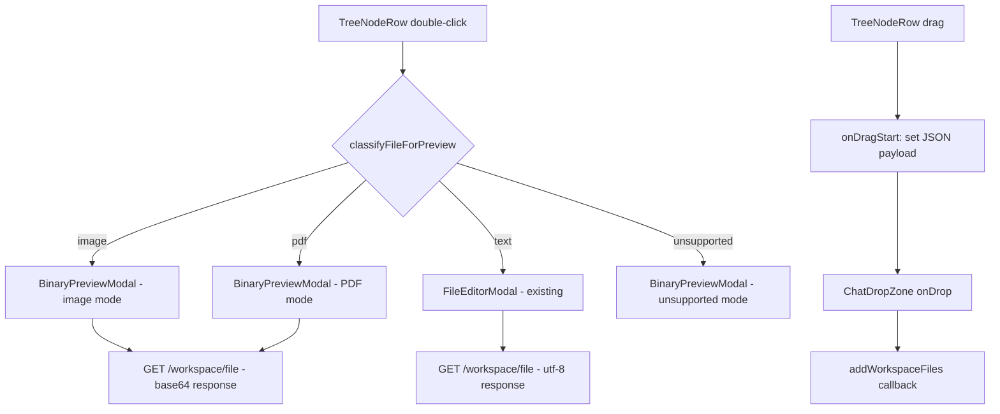

<!-- PE-REVIEWED -->
# Design Document: Explorer File Interactions

## Overview

This design addresses two gaps in the Workspace Explorer: (1) binary file preview for images and PDFs, and (2) drag-to-chat support for attaching files from the explorer to the chat panel.

Currently, double-clicking any file opens `FileEditorModal`, which reads UTF-8 text via `GET /workspace/file`. Binary files (images, PDFs) produce garbled content or a 400 error. Additionally, `TreeNodeRow` lost its `draggable` attribute during the virtualized-tree refactor, breaking drag-to-chat.

The solution introduces:
- A `classifyFileForPreview()` utility that routes double-clicks to the correct viewer based on file extension
- A `BinaryPreviewModal` component with image viewer (zoom/pan via CSS transforms) and PDF viewer (via `react-pdf`)
- Backend changes to `GET /workspace/file` to serve binary content as base64 with MIME metadata
- Drag attributes and handlers on `TreeNodeRow` that serialize `FileTreeItem` JSON for `ChatDropZone`

All changes preserve existing text-file editing, keyboard navigation, and virtualized scrolling performance.

## Architecture

### Component Flow



### Modification Map

| File | Change Type | Description |
|------|------------|-------------|
| `desktop/src/utils/fileUtils.ts` | Add function | `classifyFileForPreview()` — extension-based file type classifier |
| `desktop/src/components/layout/ThreeColumnLayout.tsx` | Modify | Route double-clicks through classifier; open BinaryPreviewModal for binary types |
| `desktop/src/components/common/BinaryPreviewModal.tsx` | New file | Modal with image viewer, PDF viewer, and unsupported-file fallback |
| `desktop/src/components/workspace-explorer/TreeNodeRow.tsx` | Modify | Add `draggable`, `onDragStart`, drag ghost image |
| `desktop/src/components/workspace-explorer/VirtualizedTree.tsx` | Modify | Pass `node` data to TreeNodeRow for drag payload construction |
| `backend/routers/workspace_api.py` | Modify | Detect binary files, return base64 + MIME type; add 50MB size limit |


## Components and Interfaces

### 1. `classifyFileForPreview(fileName: string): FilePreviewType`

New utility function in `desktop/src/utils/fileUtils.ts`.

```typescript
export type FilePreviewType = 'image' | 'pdf' | 'text' | 'unsupported';

const IMAGE_EXTENSIONS = new Set([
  'png', 'jpg', 'jpeg', 'gif', 'webp', 'svg', 'bmp', 'ico'
]);
const PDF_EXTENSIONS = new Set(['pdf']);
// Known binary extensions that cannot be previewed
const UNSUPPORTED_BINARY = new Set([
  'mp4', 'mp3', 'wav', 'avi', 'mov', 'mkv', 'flac', 'ogg',
  'docx', 'xlsx', 'pptx', 'doc', 'xls', 'ppt',
  'zip', 'tar', 'gz', 'rar', '7z', 'dmg', 'iso',
  'exe', 'dll', 'so', 'dylib', 'wasm',
]);

export function classifyFileForPreview(fileName: string): FilePreviewType {
  const ext = fileName.split('.').pop()?.toLowerCase() ?? '';
  if (IMAGE_EXTENSIONS.has(ext)) return 'image';
  if (PDF_EXTENSIONS.has(ext)) return 'pdf';
  if (UNSUPPORTED_BINARY.has(ext)) return 'unsupported';
  // Default: treat as text (existing behavior for unknown extensions)
  return 'text';
}
```

Design rationale: Default to `'text'` for unknown extensions rather than `'unsupported'`. This preserves backward compatibility — the current behavior opens all files in FileEditorModal, and many extensionless files (Makefile, Dockerfile, LICENSE) are valid text.


### 2. `BinaryPreviewModal`

New component at `desktop/src/components/common/BinaryPreviewModal.tsx`.

```typescript
export interface BinaryPreviewModalProps {
  isOpen: boolean;
  fileName: string;
  filePath: string;
  mode: 'image' | 'pdf' | 'unsupported';
  onClose: () => void;
}
```

The modal has three rendering modes:

**Image mode:**
- Fetches binary content from `GET /workspace/file` (base64 response)
- Renders `` with `src="data:{mimeType};base64,{content}"`
- Zoom via CSS `transform: scale()` controlled by mouse wheel / pinch
- Pan via CSS `transform: translate()` controlled by mouse drag when zoomed
- Displays image natural dimensions (width × height) and file size
- Initial fit: `object-fit: contain` within modal viewport

**PDF mode:**
- Uses `react-pdf` library (`Document` + `Page` components)
- Passes base64 data as `{ data: atob(base64Content) }` to `Document`
- Vertical scroll through all pages
- Page counter: "Page X of Y" using `onLoadSuccess` callback
- Error fallback: shows error message + "Reveal in Finder" button for corrupted/password-protected PDFs

**Unsupported mode:**
- Shows file name, file type badge (extension), and "This file type cannot be previewed" message
- "Reveal in Finder" button using Tauri `shell.open` to reveal the file's parent directory

**Shared behavior (all modes):**
- Escape key or close button dismisses the modal
- Focus trap: Tab cycles through focusable elements
- ARIA: `role="dialog"`, `aria-modal="true"`, `aria-label="{fileName}"`
- `aria-live="polite"` region for unsupported file announcement

### 3. ThreeColumnLayout Routing Changes

Modify `handleFileDoubleClick` in `ThreeColumnLayout.tsx`:

```typescript
const handleFileDoubleClick = useCallback(async (file: FileTreeItem) => {
  // Swarm workspace warning (existing behavior)
  if (file.isSwarmWorkspace) {
    setSwarmWarning({ isOpen: true, pendingFile: file });
    return;
  }

  const previewType = classifyFileForPreview(file.name);
  
  if (previewType === 'text') {
    // Existing path — open FileEditorModal
    await openFileEditor(file, file.gitStatus);
  } else {
    // New path — open BinaryPreviewModal
    setBinaryPreviewState({
      isOpen: true,
      fileName: file.name,
      filePath: file.path,
      mode: previewType,
    });
  }
}, [openFileEditor]);
```

New state in `ThreeColumnLayoutInner`:
```typescript
const [binaryPreviewState, setBinaryPreviewState] = useState<{
  isOpen: boolean;
  fileName: string;
  filePath: string;
  mode: 'image' | 'pdf' | 'unsupported';
} | null>(null);
```


### 4. TreeNodeRow Drag Support

Modify `TreeNodeRow.tsx` to add drag capability for file nodes:

```typescript
// New prop added to TreeNodeRowProps:
/** The full TreeNode data, needed to construct the drag payload. */
node: TreeNode;  // already exists in props

// In the component body:
const handleDragStart = useCallback((e: React.DragEvent) => {
  if (isDirectory) {
    e.preventDefault();
    return;
  }
  const payload: FileTreeItem = {
    id: node.path,
    name: node.name,
    type: node.type,
    path: node.path,
    workspaceId: '',
    workspaceName: '',
    gitStatus: node.gitStatus,
  };
  e.dataTransfer.setData('application/json', JSON.stringify(payload));
  e.dataTransfer.effectAllowed = 'copy';
  
  // Custom drag ghost: file icon + name (use textContent to prevent XSS)
  const ghost = document.createElement('div');
  ghost.style.cssText = 'display:flex;align-items:center;gap:6px;padding:4px 10px;' +
    'background:var(--color-card);border:1px solid var(--color-border);' +
    'border-radius:6px;font-size:13px;color:var(--color-text);' +
    'position:absolute;top:-1000px;';
  const iconSpan = document.createElement('span');
  iconSpan.className = 'material-symbols-outlined';
  iconSpan.style.fontSize = '16px';
  iconSpan.textContent = fileIcon(node.name);
  ghost.appendChild(iconSpan);
  ghost.appendChild(document.createTextNode(node.name));
  document.body.appendChild(ghost);
  e.dataTransfer.setDragImage(ghost, 0, 0);
  requestAnimationFrame(() => document.body.removeChild(ghost));
}, [isDirectory, node]);
```

On the root `<div>`:
```tsx
draggable={!isDirectory}
onDragStart={handleDragStart}
```

Design rationale: Only files are draggable (directories are not meaningful as chat attachments). The `toFileTreeItem` conversion is inlined rather than imported to avoid adding a dependency from TreeNodeRow to the bridge utility — the payload shape is simple and stable. The `workspaceId` and `workspaceName` fields are set to empty strings because `TreeNode` doesn't carry workspace metadata; the attachment pipeline (`addWorkspaceFiles`) only uses `name`, `type`, and `path`. The drag ghost is created as a temporary DOM element and removed on the next animation frame after the browser captures it.

### 5. VirtualizedTree Changes

Minimal changes needed. The `RowRenderer` already passes `node` to `TreeNodeRow`. No additional props are required since `TreeNodeRow` already has access to the `node` object and can construct the drag payload directly.

### 6. Backend Binary File Serving

Modify `GET /workspace/file` in `backend/routers/workspace_api.py`:

```python
import base64
import mimetypes

MAX_PREVIEW_SIZE = 50 * 1024 * 1024  # 50 MB

@router.get("/workspace/file")
async def get_workspace_file(path: str = Query(...)):
    # ... existing path validation ...
    
    # Check file size BEFORE reading (prevents loading 50MB into memory twice)
    file_size = target.stat().st_size
    if file_size > MAX_PREVIEW_SIZE:
        raise HTTPException(
            status_code=413,
            detail=f"File too large to preview ({file_size // (1024*1024)} MB). Maximum is 50 MB."
        )
    
    # Try UTF-8 first (existing behavior)
    try:
        content = target.read_text(encoding="utf-8")
        is_readonly = _is_readonly_context_file(path) or is_skill_file
        return {
            "content": content,
            "path": path,
            "name": target.name,
            "readonly": is_readonly,
            "encoding": "utf-8",
        }
    except UnicodeDecodeError:
        pass
    
    # Binary fallback: base64 encode
    logger.info("Binary file fallback for %s (size=%d, not valid UTF-8)", path, file_size)
    raw = target.read_bytes()
    mime_type, _ = mimetypes.guess_type(target.name)
    if mime_type is None:
        mime_type = "application/octet-stream"
    
    return {
        "content": base64.b64encode(raw).decode("ascii"),
        "path": path,
        "name": target.name,
        "encoding": "base64",
        "mime_type": mime_type,
        "size": file_size,
    }
```

Design rationale: The endpoint tries UTF-8 first to preserve backward compatibility. Only on `UnicodeDecodeError` does it fall back to base64. MIME detection uses `mimetypes.guess_type()` (extension-based, no file content sniffing) per Requirement 2.4. The `encoding` field lets the frontend distinguish response types without inspecting content.


## Data Models

### Frontend Types

```typescript
// New type in fileUtils.ts
export type FilePreviewType = 'image' | 'pdf' | 'text' | 'unsupported';

// BinaryPreviewModal state (in ThreeColumnLayout)
interface BinaryPreviewState {
  isOpen: boolean;
  fileName: string;
  filePath: string;
  mode: 'image' | 'pdf' | 'unsupported';
}

// Extended API response type for GET /workspace/file
interface WorkspaceFileResponse {
  content: string;        // UTF-8 text or base64-encoded binary
  path: string;
  name: string;
  encoding: 'utf-8' | 'base64';
  readonly?: boolean;     // only present for utf-8
  mimeType?: string;      // only present for base64 (camelCase in frontend)
  size?: number;          // only present for base64 (bytes)
}
```

### Backend Response Shapes

**Text file (existing, extended with `encoding`):**
```json
{
  "content": "file text content...",
  "path": "src/main.py",
  "name": "main.py",
  "readonly": false,
  "encoding": "utf-8"
}
```

**Binary file (new):**
```json
{
  "content": "iVBORw0KGgoAAAANSUhEUg...",
  "path": "Attachments/screenshot.png",
  "name": "screenshot.png",
  "encoding": "base64",
  "mime_type": "image/png",
  "size": 245760
}
```

**API naming convention note:** Backend returns `snake_case` (`mime_type`, `encoding`). The frontend API service layer must map `mime_type` → `mimeType` in the `toCamelCase()` transform per project convention.

### Drag Payload Shape

The drag payload serialized to `application/json` matches the existing `FileTreeItem` interface that `ChatDropZone` already parses:

```json
{
  "id": "Attachments/screenshot.png",
  "name": "screenshot.png",
  "type": "file",
  "path": "Attachments/screenshot.png",
  "workspaceId": "",
  "workspaceName": ""
}
```

This is identical to what `toFileTreeItem()` produces and what `ChatDropZone.handleDrop` expects — no changes needed on the drop side.


## Correctness Properties

*A property is a characteristic or behavior that should hold true across all valid executions of a system — essentially, a formal statement about what the system should do. Properties serve as the bridge between human-readable specifications and machine-verifiable correctness guarantees.*

### Property 1: File classification correctness

*For any* file name string, `classifyFileForPreview` shall return `'image'` if the extension is in the image set (png, jpg, jpeg, gif, webp, svg, bmp, ico), `'pdf'` if the extension is `pdf`, `'unsupported'` if the extension is in the unsupported binary set (mp4, mp3, docx, xlsx, etc.), and `'text'` for all other extensions including no extension. The classification shall be case-insensitive with respect to the extension.

**Validates: Requirements 1.1, 1.4**

### Property 2: Binary file serving round-trip

*For any* sequence of bytes that is not valid UTF-8, when written to a file within the workspace and requested via `GET /workspace/file`, the response shall have `encoding: "base64"`, and `base64.b64decode(response.content)` shall equal the original bytes. Additionally, the `mime_type` field shall equal the result of Python's `mimetypes.guess_type()` for the file's extension (or `"application/octet-stream"` when the extension is unknown).

**Validates: Requirements 2.1, 2.4**

### Property 3: Text file serving round-trip

*For any* valid UTF-8 string, when written to a file within the workspace and requested via `GET /workspace/file`, the response shall have `encoding: "utf-8"` and `response.content` shall equal the original string.

**Validates: Requirements 2.2**

### Property 4: Draggable attribute correctness

*For any* `TreeNode` rendered by `TreeNodeRow`, the `draggable` HTML attribute shall be `true` when `node.type === 'file'` and shall be `false` (or absent) when `node.type === 'directory'`.

**Validates: Requirements 5.1**

### Property 5: Drag payload completeness

*For any* file-type `TreeNode` with arbitrary name, path, and gitStatus values, when a drag is initiated on its `TreeNodeRow`, the `application/json` data set on the `DataTransfer` object shall be a valid JSON string that, when parsed, contains the fields `id`, `name`, `type`, `path`, `workspaceId`, and `workspaceName`, where `name` equals `node.name`, `path` equals `node.path`, and `type` equals `'file'`.

**Validates: Requirements 5.2**

### Property 6: Drag non-interference with existing handlers

*For any* `TreeNode` rendered by `TreeNodeRow` with drag support enabled, the `onClick`, `onDoubleClick`, `onContextMenu`, and `onKeyDown` handlers shall still be invoked when their respective events are triggered, producing the same callback invocations as before drag support was added.

**Validates: Requirements 5.6, 7.4**

### Property 7: BinaryPreviewModal accessibility attributes

*For any* file name and preview mode (`'image'`, `'pdf'`, or `'unsupported'`), the `BinaryPreviewModal` root element shall have `role="dialog"`, `aria-modal="true"`, and `aria-label` containing the file name. Additionally, when the mode is `'image'`, the `` element shall have an `alt` attribute equal to the file name.

**Validates: Requirements 8.2, 8.3**


## Error Handling

| Scenario | Component | Behavior |
|----------|-----------|----------|
| File > 50 MB | Backend `GET /workspace/file` | Return HTTP 413 with descriptive message |
| Binary file (not UTF-8) | Backend `GET /workspace/file` | Fall back to base64 encoding (no longer returns 400) |
| Network error fetching file | `BinaryPreviewModal` | Show error state with retry button |
| Corrupted/password-protected PDF | `BinaryPreviewModal` (PDF mode) | Show error message + "Reveal in Finder" button via `react-pdf` `onLoadError` |
| Image fails to load | `BinaryPreviewModal` (image mode) | Show error state via `` with "Reveal in Finder" fallback |
| Invalid JSON in drag payload | `ChatDropZone` | Existing try/catch logs error, no crash (no change needed) |
| Drag on directory node | `TreeNodeRow` | `e.preventDefault()` in `onDragStart` — drag is cancelled |
| Unknown MIME type | Backend | Returns `"application/octet-stream"` as fallback |
| File deleted between tree load and double-click | Backend | Returns 404 (existing behavior) |

### Backward Compatibility Guarantees

1. The `GET /workspace/file` response for text files gains an `encoding: "utf-8"` field but all existing fields (`content`, `path`, `name`, `readonly`) remain unchanged. Existing consumers that don't read `encoding` are unaffected.
2. `TreeNodeRow` gains `draggable` and `onDragStart` but all existing event handlers (`onClick`, `onDoubleClick`, `onContextMenu`, `onKeyDown`) are preserved with identical behavior.
3. `ChatDropZone` requires zero changes — it already handles `application/json` payloads with `FileTreeItem` shape.


## Testing Strategy

### Dual Testing Approach

This feature uses both unit tests and property-based tests for comprehensive coverage.

**Unit tests** cover specific examples, edge cases, and integration points:
- Image mode renders correct data URI for a known PNG
- PDF mode shows page counter after load
- Unsupported mode shows "cannot preview" message
- Escape key closes BinaryPreviewModal
- Swarm workspace warning still appears for swarm files (backward compat)
- 50 MB file size limit returns 413
- Drag effect is set to "copy"
- Drag ghost element is created with file icon and name

**Property-based tests** verify universal properties across generated inputs:
- File classification correctness (Property 1)
- Binary file round-trip with MIME (Property 2)
- Text file round-trip (Property 3)
- Draggable attribute correctness (Property 4)
- Drag payload completeness (Property 5)
- Drag non-interference (Property 6)
- Accessibility attributes (Property 7)

### Property-Based Testing Configuration

**Frontend:** Use `fast-check` library (already common in React/TypeScript ecosystems).
- Each property test runs minimum 100 iterations
- Each test is tagged with a comment: `// Feature: explorer-file-interactions, Property N: <title>`

**Backend:** Use `hypothesis` library for Python.
- Each property test runs minimum 100 iterations via `@settings(max_examples=100)`
- Each test is tagged with a docstring: `"""Feature: explorer-file-interactions, Property N: <title>"""`

### Test File Locations

| Test | File |
|------|------|
| `classifyFileForPreview` unit + property tests | `desktop/src/utils/__tests__/fileUtils.test.ts` |
| `BinaryPreviewModal` unit tests | `desktop/src/components/common/__tests__/BinaryPreviewModal.test.tsx` |
| `TreeNodeRow` drag unit + property tests | `desktop/src/components/workspace-explorer/__tests__/TreeNodeRow.test.tsx` |
| Backend file serving property tests | `backend/tests/test_workspace_file_binary.py` |
| ThreeColumnLayout routing unit tests | `desktop/src/components/layout/__tests__/ThreeColumnLayout.test.tsx` |

### Property-to-Test Mapping

Each correctness property maps to exactly one property-based test:

| Property | Test Location | Generator Strategy |
|----------|--------------|-------------------|
| Property 1: File classification | `fileUtils.test.ts` | Generate random strings, append extensions from each category set |
| Property 2: Binary round-trip | `test_workspace_file_binary.py` | Generate random byte arrays (1–10KB) with non-UTF-8 sequences |
| Property 3: Text round-trip | `test_workspace_file_binary.py` | Generate random valid UTF-8 strings via `hypothesis.strategies.text()` |
| Property 4: Draggable attribute | `TreeNodeRow.test.tsx` | Generate TreeNode objects with random type ('file' \| 'directory') |
| Property 5: Drag payload | `TreeNodeRow.test.tsx` | Generate file TreeNodes with random name, path, gitStatus |
| Property 6: Non-interference | `TreeNodeRow.test.tsx` | Generate TreeNodes, fire click/dblclick/contextmenu events, assert callbacks |
| Property 7: Accessibility | `BinaryPreviewModal.test.tsx` | Generate random file names × preview modes, assert ARIA attributes |
