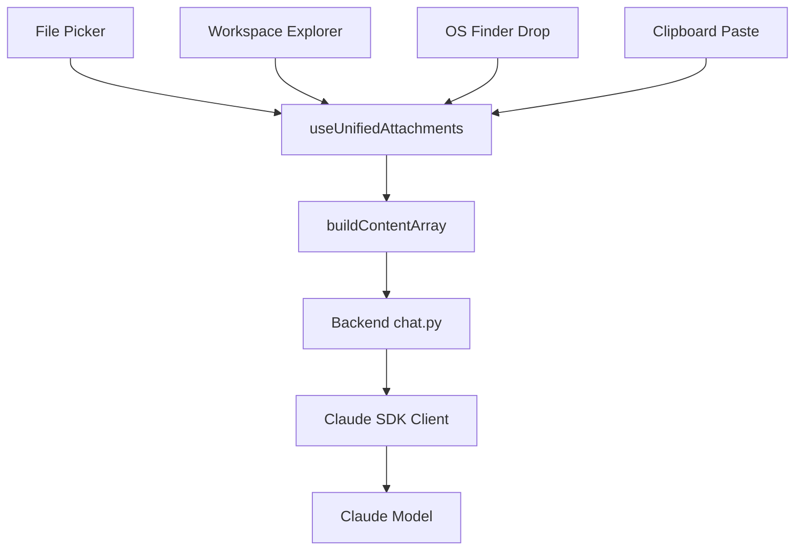
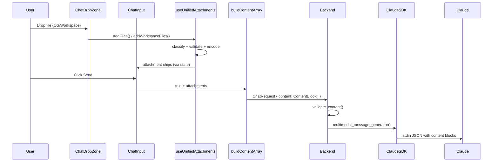
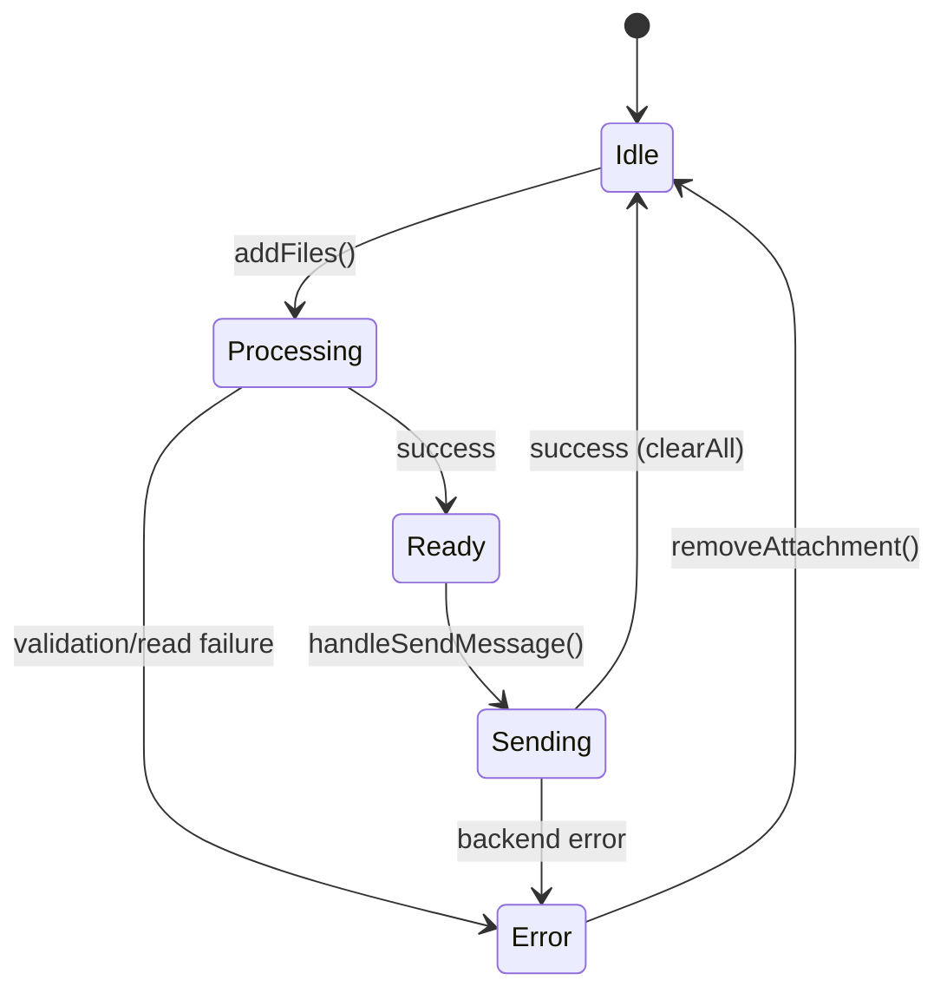

<!-- PE-REVIEWED -->
# Design Document: File Attachment End-to-End Pipeline

## Overview

The SwarmAI desktop app has three independent file attachment input paths that are partially broken or inefficient. This design unifies all input paths (File Picker, Workspace Explorer drag-drop, OS Finder drag-drop, clipboard paste) into a single `useUnifiedAttachments` hook that produces typed content blocks. These blocks flow through `buildContentArray` to the backend, which forwards them to the Claude SDK via stdin JSON.

### Current State (Broken)

| Path | Input | Current Flow | Status |
|------|-------|-------------|--------|
| A | File Picker (image/pdf) | `useFileAttachment` → base64 → `buildContentArray` → `content[]` → Backend → SDK | Partially works |
| B | File Picker (txt/csv) | `useFileAttachment` → base64 → `workspaceService.uploadFile()` → path hint | Works but wastes a tool call |
| C | Workspace Explorer drag-drop | `ChatDropZone` → `LayoutContext.attachFile()` → `attachedFiles[]` → display-only chips | Completely broken (display only) |
| D | OS Finder drag-drop | Not supported | Missing |

### Target State

All four input paths merge through a unified hook → `buildContentArray` → Backend → Claude SDK. Every attached file produces the correct content block type based on file type and size.



## Architecture

### Component Interaction Flow



### Key Design Decisions

1. **Single hook replaces two state sources**: `useUnifiedAttachments` replaces both `useFileAttachment` (File Picker/clipboard) and `LayoutContext.attachedFiles` (workspace explorer). This eliminates the split where workspace files were display-only.

2. **Tab-scoped attachment state via `tabMapRef`**: Attachments are stored per-tab in the unified tab state map (authoritative source), not in React `useState`. This follows the existing multi-tab isolation pattern where `tabMapRef` is the single source of truth. The `useUnifiedAttachments` hook receives the active `tabId` and reads/writes attachment state directly in `tabMapRef`. React `useState` is used only as a display mirror for the active tab's attachments, updated on tab switch via the existing save/restore/re-derive protocol (Principle 7).

3. **ChatDropZone wiring via props (not LayoutContext)**: `ChatDropZone` receives `addFiles` and `addWorkspaceFiles` as props from `ChatPage`, which owns the `useUnifiedAttachments` hook. This avoids polluting the global `LayoutContext` with per-tab attachment functions. `LayoutContext.attachedFiles` and `attachFile` are removed entirely — they were the source of the broken Path C.

4. **File type classification at the edge**: Files are classified (image/pdf/text/unsupported) immediately on add, using MIME type with extension fallback. This enables instant validation feedback before any encoding work.

5. **Inline text delivery by default**: Text/code files ≤50KB are sent as inline `text` content blocks, eliminating the current `workspaceService.uploadFile()` + tool-call pattern. Files 50KB–1MB use path hints. Files >1MB are rejected.

6. **Backend validation as safety net**: The backend enforces hard limits (20 content blocks, 25MB total) as a defense-in-depth layer. Frontend limits (10 attachments, per-type size limits) are the primary enforcement.

7. **SDK fallback for unsupported content types**: If the Claude Code CLI doesn't support image/document content blocks via stdin, the backend falls back to saving the file and using a path hint. This is logged as a warning. Detection is via `error_during_execution` ResultMessage subtype or `is_error` flag on the ResultMessage — not a synchronous exception from `client.query()`.

8. **Workspace file path sanitization**: All workspace file paths from `FileTreeItem` are validated to be relative paths within the agent's workspace directory. Absolute paths and path traversal sequences (`../`) are rejected before any file read operation.

9. **Content read at send time for workspace files**: Workspace files store only the path at attach time. Content is read at send time (inside `buildContentArray`) to avoid stale content if the file changes between attach and send. This adds a small latency at send time but ensures correctness.

## Components and Interfaces

### 1. `useUnifiedAttachments` Hook (New)

**Location**: `desktop/src/hooks/useUnifiedAttachments.ts`

Replaces `useFileAttachment` and absorbs `LayoutContext.attachedFiles` responsibility. Manages the full lifecycle: classify → validate → encode → store → clear.

**Tab isolation**: The hook receives `tabId` and `tabMapRef` as parameters. Attachment state lives in `tabMapRef.current.get(tabId).attachments` (authoritative). React `useState` is a display mirror only, updated when `tabId` changes. This follows Principle 2 (Active Tab = Display Mirror Only).

```typescript
interface UnifiedAttachment {
  id: string;
  name: string;
  type: AttachmentType;          // 'image' | 'pdf' | 'text' | 'csv'
  deliveryStrategy: DeliveryStrategy; // 'base64_image' | 'base64_document' | 'inline_text' | 'path_hint'
  size: number;
  mediaType: string;
  base64?: string;               // For image/pdf
  textContent?: string;          // For inline text delivery (File Picker files only)
  workspacePath?: string;        // For workspace files and path hint delivery
  preview?: string;              // Thumbnail URL or text snippet
  isLoading: boolean;
  error?: string;
}

type DeliveryStrategy = 'base64_image' | 'base64_document' | 'inline_text' | 'path_hint';

interface UseUnifiedAttachmentsReturn {
  /** Display mirror of active tab's attachments (for rendering only) */
  attachments: UnifiedAttachment[];
  /** Add native File objects (from File Picker, OS drop, clipboard) */
  addFiles: (files: File[]) => Promise<void>;
  /** Add workspace files by path (from Workspace Explorer drag) */
  addWorkspaceFiles: (files: FileTreeItem[]) => Promise<void>;
  removeAttachment: (id: string) => void;
  clearAll: () => void;
  isProcessing: boolean;
  error: string | null;
  canAddMore: boolean;
}

// Hook signature — receives tab identity for isolation
function useUnifiedAttachments(
  tabId: string | null,
  tabMapRef: React.MutableRefObject<Map<string, UnifiedTab>>,
): UseUnifiedAttachmentsReturn;
```

### 2. File Classification Module (New)

**Location**: `desktop/src/utils/fileClassification.ts`

Pure functions for file type detection and validation. No side effects, fully testable.

```typescript
// MIME type → attachment type mapping
const MIME_TYPE_MAP: Record<string, AttachmentType> = {
  'image/png': 'image', 'image/jpeg': 'image', 'image/gif': 'image', 'image/webp': 'image',
  'application/pdf': 'pdf',
  'text/plain': 'text', 'text/csv': 'csv', 'text/html': 'text',
  'application/csv': 'csv',
};

// Extension fallback for missing/generic MIME types
const EXTENSION_TYPE_MAP: Record<string, AttachmentType> = {
  '.py': 'text', '.ts': 'text', '.tsx': 'text', '.js': 'text', '.jsx': 'text',
  '.rs': 'text', '.go': 'text', '.java': 'text', '.c': 'text', '.cpp': 'text',
  '.h': 'text', '.rb': 'text', '.sh': 'text', '.md': 'text', '.txt': 'text',
  '.json': 'text', '.yaml': 'text', '.yml': 'text', '.toml': 'text',
  '.sql': 'text', '.html': 'text', '.css': 'text', '.scss': 'text',
  '.xml': 'text', '.log': 'text', '.env': 'text', '.cfg': 'text',
  '.ini': 'text', '.conf': 'text',
  '.png': 'image', '.jpg': 'image', '.jpeg': 'image', '.gif': 'image', '.webp': 'image',
  '.pdf': 'pdf', '.csv': 'csv',
};

function classifyFile(file: { name: string; type: string }): AttachmentType | null;
function determineDeliveryStrategy(type: AttachmentType, size: number): DeliveryStrategy;
function validateFileSize(type: AttachmentType, size: number): string | null;
function isGenericMimeType(mimeType: string): boolean;

/**
 * Validate that a workspace file path is safe (no traversal, relative only).
 * Rejects absolute paths and paths containing '../'.
 */
function validateWorkspacePath(path: string): string | null;
```

### 3. `ChatDropZone` (Modified)

**Location**: `desktop/src/components/chat/ChatDropZone.tsx`

Currently only handles workspace explorer JSON drops. Modified to also handle native OS file drops.

**Wiring**: `ChatDropZone` receives `addFiles` and `addWorkspaceFiles` as props from `ChatPage` (which owns the `useUnifiedAttachments` hook). This replaces the previous `useLayout().attachFile` call. `LayoutContext.attachedFiles` and `attachFile` are removed entirely.

```typescript
interface ChatDropZoneProps {
  children: ReactNode;
  addFiles: (files: File[]) => Promise<void>;
  addWorkspaceFiles: (files: FileTreeItem[]) => Promise<void>;
}

const handleDrop = (e: React.DragEvent) => {
  e.preventDefault();
  e.stopPropagation();
  setIsDragOver(false);

  // Path 1: Workspace explorer (JSON data from FileTreeNode drag)
  const jsonData = e.dataTransfer.getData('application/json');
  if (jsonData) {
    try {
      const fileData: FileTreeItem = JSON.parse(jsonData);
      if (fileData.type === 'file') {
        addWorkspaceFiles([fileData]);  // → useUnifiedAttachments
      }
    } catch (err) {
      console.error('Failed to parse dropped file data:', err);
    }
    return;
  }

  // Path 2: Native OS file drop (Finder/Explorer/Nautilus)
  if (e.dataTransfer.files.length > 0) {
    addFiles(Array.from(e.dataTransfer.files));  // → useUnifiedAttachments
  }
};
```

Key changes:
- Accept both `application/json` (workspace) and `Files` (native) drag types
- Show drop overlay for both drag types (currently only shows for JSON)
- Route both paths through `useUnifiedAttachments` via props instead of `LayoutContext.attachFile`
- JSON parse wrapped in try/catch (was missing in current implementation for error resilience)

### 4. `buildContentArray` (Modified)

**Location**: `desktop/src/pages/ChatPage.tsx` (inline in ChatPage)

Currently handles image/pdf as base64 and text/csv via `workspaceService.uploadFile()`. Modified to use the `UnifiedAttachment.deliveryStrategy` field directly.

**Key change**: Workspace files with `inline_text` strategy have their content read at send time (not attach time) to avoid stale content. The `selectedAgentId` dependency is retained for `path_hint` delivery which still uses `workspaceService.uploadFile()`.

```typescript
const buildContentArray = async (
  text: string,
  attachments: UnifiedAttachment[],
  selectedAgentId: string | null,
): Promise<ContentBlock[]> => {
  const content: ContentBlock[] = [];

  if (text.trim()) {
    content.push({ type: 'text', text });
  }

  for (const att of attachments) {
    if (att.error || att.isLoading) continue;

    switch (att.deliveryStrategy) {
      case 'base64_image':
        content.push({
          type: 'image',
          source: { type: 'base64', media_type: att.mediaType, data: att.base64! },
        });
        break;
      case 'base64_document':
        content.push({
          type: 'document',
          source: { type: 'base64', media_type: 'application/pdf', data: att.base64! },
        });
        break;
      case 'inline_text':
        // For workspace files: read content at send time (fresh read)
        // For File Picker files: textContent was set at attach time
        let textContent = att.textContent;
        if (!textContent && att.workspacePath && selectedAgentId) {
          try {
            const raw = await workspaceService.readFile(selectedAgentId, att.workspacePath);
            textContent = typeof raw === 'string' ? raw : JSON.stringify(raw);
          } catch (err) {
            console.error(`Failed to read workspace file at send time: ${att.name}`, err);
            content.push({ type: 'text', text: `[Failed to read file: ${att.name}]` });
            continue;
          }
        }
        content.push({
          type: 'text',
          text: `--- File: ${att.name} ---\n${textContent}\n--- End: ${att.name} ---`,
        });
        break;
      case 'path_hint':
        content.push({
          type: 'text',
          text: `[Attached file: ${att.name}] saved at ${att.workspacePath} - use Read tool to access`,
        });
        break;
    }
  }

  return content;
};
```

### 5. Backend Content Validation (New)

**Location**: `backend/routers/chat.py`

New validation middleware applied before forwarding to `agent_manager.run_conversation()`.

```python
MAX_CONTENT_BLOCKS = 20
MAX_TOTAL_PAYLOAD_SIZE = 25 * 1024 * 1024  # 25MB

def _estimate_block_size(block: dict) -> int:
    """Estimate the byte size of a content block.
    
    For base64 blocks (image/document): size of the base64 data string.
    For text blocks: UTF-8 encoded length of the text.
    This is an approximation — actual JSON serialization adds overhead,
    but base64 data dominates the payload size.
    """
    block_type = block.get("type")
    if block_type in ("image", "document"):
        data = block.get("source", {}).get("data", "")
        return len(data)  # base64 string length ≈ 4/3 × raw bytes
    elif block_type == "text":
        return len(block.get("text", "").encode("utf-8"))
    return 0

def validate_content(content: list[dict]) -> list[dict]:
    """Validate content blocks before forwarding to SDK.
    
    Raises HTTPException(413) if limits are exceeded.
    """
    if len(content) > MAX_CONTENT_BLOCKS:
        raise HTTPException(
            status_code=413,
            detail=f"Too many content blocks: {len(content)}, max {MAX_CONTENT_BLOCKS}"
        )
    
    total_size = sum(_estimate_block_size(block) for block in content)
    if total_size > MAX_TOTAL_PAYLOAD_SIZE:
        raise HTTPException(
            status_code=413,
            detail=f"Payload too large: {total_size} bytes, max {MAX_TOTAL_PAYLOAD_SIZE}"
        )
    
    return content
```

### 6. SDK Multimodal Fallback (Modified)

**Location**: `backend/core/agent_manager.py` — `_run_query_on_client`

The existing `multimodal_message_generator()` already sends content blocks via stdin JSON. The modification adds detection of unsupported content block types via the SDK's error response path and falls back to path hint delivery.

**Error detection mechanism**: The SDK does not synchronously reject `client.query()` for unsupported content types. Instead, the error surfaces as either:
1. A `ResultMessage` with `subtype='error_during_execution'` containing an error about unsupported content
2. A `ResultMessage` with `is_error=True` and a message about invalid content blocks
3. The content block being silently dropped (no error, but Claude doesn't see the attachment)

**Fallback strategy**: Before sending multimodal content, the backend checks a feature flag (`_SDK_SUPPORTS_MULTIMODAL`) that is set during the first successful multimodal exchange. If the flag is `False` (default until verified), image/document blocks are pre-emptively converted to path hints:

```python
# Feature flag — set to True after first successful multimodal exchange
_SDK_SUPPORTS_MULTIMODAL: bool | None = None  # None = untested, True/False = tested

async def multimodal_message_generator():
    """Async generator for multimodal content.
    
    If SDK multimodal support is unverified or known-unsupported,
    image/document blocks are converted to path hints before sending.
    """
    processed_content = query_content
    if _SDK_SUPPORTS_MULTIMODAL is not True:
        processed_content = await _convert_unsupported_blocks_to_path_hints(
            query_content, agent_config
        )
    msg = {
        "type": "user",
        "message": {"role": "user", "content": processed_content},
        "parent_tool_use_id": None,
    }
    yield msg
```

The `_convert_unsupported_blocks_to_path_hints` function saves image/document data to `~/.swarm-ai/attachments/{session_id}/{uuid}.{ext}` and replaces the block with a text path hint. A warning is logged for each conversion.

## Data Models

### Frontend Types

```typescript
// Extended from existing AttachmentType
type AttachmentType = 'image' | 'pdf' | 'text' | 'csv';

type DeliveryStrategy = 'base64_image' | 'base64_document' | 'inline_text' | 'path_hint';

interface UnifiedAttachment {
  id: string;                        // Unique ID (timestamp + random)
  name: string;                      // Original filename
  type: AttachmentType;              // Classified file type
  deliveryStrategy: DeliveryStrategy; // How to deliver to backend
  size: number;                      // File size in bytes
  mediaType: string;                 // MIME type
  base64?: string;                   // Base64 data (image/pdf from File Picker)
  textContent?: string;              // Raw text (File Picker text files only — read at attach time)
  workspacePath?: string;            // Workspace path (workspace files — content read at send time)
  preview?: string;                  // Preview data (thumbnail URL or text snippet)
  isLoading: boolean;                // Processing state
  error?: string;                    // Error message if processing failed
}
```

**Note on `source` field**: The original design included a `source` field ('file_picker', 'workspace_explorer', 'os_drop', 'clipboard'). This was removed because Property 1 (Source Invariance) guarantees identical output regardless of source. The field added no behavioral value. If needed for analytics/debugging in the future, it can be added back as an optional field.

### Content Block Types (API Payload)

These are the content block shapes sent in `ChatRequest.content[]`:

```typescript
// Image content block (base64)
{ type: 'image', source: { type: 'base64', media_type: string, data: string } }

// Document content block (PDF, base64)
{ type: 'document', source: { type: 'base64', media_type: 'application/pdf', data: string } }

// Text content block (inline text or path hint)
{ type: 'text', text: string }
```

### Size Limits Configuration

```typescript
const SIZE_LIMITS = {
  image: 5 * 1024 * 1024,       // 5MB
  pdf: 10 * 1024 * 1024,        // 10MB
  text: 1 * 1024 * 1024,        // 1MB (max for any text delivery)
  csv: 1 * 1024 * 1024,         // 1MB
} as const;

const SIZE_THRESHOLD = 50 * 1024;  // 50KB — above this, text uses path hint
const MAX_ATTACHMENTS = 10;

// Backend limits (defense-in-depth)
const BACKEND_MAX_CONTENT_BLOCKS = 20;
const BACKEND_MAX_PAYLOAD_SIZE = 25 * 1024 * 1024; // 25MB
```

### Tab State Extension

Attachment state is stored per-tab in `tabMapRef` (following multi-tab isolation principles):

```typescript
// Extension to existing TabState in useUnifiedTabState
interface TabState {
  // ... existing fields ...
  attachments: UnifiedAttachment[];  // Per-tab attachment list
}
```

### Backend Pydantic Models

```python
# Existing ChatRequest — no changes needed
class ChatRequest(BaseModel):
    agent_id: str
    message: Optional[str] = None
    content: Optional[list[dict]] = None  # Already supports multimodal
    session_id: Optional[str] = None
    enable_skills: bool = False
    enable_mcp: bool = False
```

The backend `ChatRequest` already accepts a `content` field with arbitrary content blocks. No schema changes are needed — the validation layer inspects block types and sizes at runtime.

## Correctness Properties

*A property is a characteristic or behavior that should hold true across all valid executions of a system — essentially, a formal statement about what the system should do. Properties serve as the bridge between human-readable specifications and machine-verifiable correctness guarantees.*

### Property 1: Source Invariance

*For any* file content bytes, filename, and MIME type, the `classifyFile` and `determineDeliveryStrategy` functions shall produce identical `AttachmentType` and `DeliveryStrategy` output regardless of whether the input originated from a File Picker `File` object, a Workspace Explorer `FileTreeItem`, an OS Finder drop, or a clipboard paste. Specifically: given the same `{ name, type (MIME), size }` tuple, classification and delivery strategy are deterministic.

**Note**: Full E2E source invariance (same file produces same content block) is an integration test concern because workspace files read content from disk while File Picker files read from memory. The property test covers the pure classification/strategy logic.

**Validates: Requirements 1.1, 1.2, 1.3, 1.4, 1.5**

### Property 2: Classification Correctness

*For any* file with a name and MIME type, if the MIME type is in the recognized MIME type map, the classification shall use the MIME type mapping; if the MIME type is missing or generic (`application/octet-stream`, empty string), the classification shall use the file extension from the extension fallback map. All code extensions (`.ts`, `.py`, `.rs`, etc.) shall classify as `text`, all image extensions (`.png`, `.jpg`, etc.) shall classify as `image`, and `.pdf` shall classify as `pdf`.

**Validates: Requirements 5.1, 5.2, 5.3, 5.4, 5.5**

### Property 3: Delivery Strategy Correctness

*For any* classified file, the delivery strategy shall be determined by its type and size: image files produce `base64_image`, PDF files produce `base64_document`, text/csv files at or below 50KB produce `inline_text`, and text/csv files above 50KB but at or below 1MB produce `path_hint`.

**Validates: Requirements 2.1, 2.2, 2.3, 2.4, 2.5, 6.4**

### Property 4: Size Validation

*For any* file type (image, pdf, text, csv) and *for any* file size, if the file size exceeds the maximum limit for that type (5MB for images, 10MB for PDFs, 1MB for text/csv), the pipeline shall reject the file and the error message shall contain both the size limit and the actual file size.

**Validates: Requirements 6.1, 6.2, 6.3, 6.5**

### Property 5: Attachment Count Limit

*For any* sequence of file additions where the total count would exceed 10, the pipeline shall accept only the first 10 files and reject all subsequent additions with an error message indicating the attachment count limit.

**Validates: Requirements 6.6, 6.7**

### Property 6: Unsupported File Rejection

*For any* file that has neither a recognized MIME type nor a recognized file extension, the pipeline shall reject the file and produce an error message indicating the file type is not supported.

**Validates: Requirements 4.4, 5.6**

### Property 7: Content Block Ordering

*For any* user text message and *for any* list of attachments, the resulting content array shall have the user text as the first `text` Content_Block, followed by all attachment Content_Blocks in the same order the files were attached.

**Validates: Requirements 9.1, 9.2**

### Property 8: Attachment Removal

*For any* attachment list containing at least one attachment, removing an attachment by ID shall decrease the list length by exactly one and the removed attachment's ID shall no longer appear in the list.

**Validates: Requirements 7.4**

### Property 9: Text Preview Truncation

*For any* text file attachment, the preview string shall contain at most 200 characters. If the original text content exceeds 200 characters, the preview shall be the first 200 characters followed by an ellipsis.

**Validates: Requirements 7.3**

### Property 10: Send Clears Attachments

*For any* non-empty attachment list, after a message is successfully sent, the attachment list for that tab shall be empty.

**Validates: Requirements 9.3**

### Property 11: Tab Isolation

*For any* two distinct chat tabs and *for any* attachment operation (add, remove, clear) performed on one tab, the attachment list of the other tab shall remain unchanged.

**Validates: Requirements 12.1, 12.2, 12.3**

### Property 12: Tab Close Cleanup

*For any* chat tab with attachments, closing the tab shall remove all attachments associated with that tab from the tab state map, and no references to the closed tab's attachments shall remain.

**Validates: Requirements 12.4**

### Property 13: Backend Block Count Limit

*For any* message payload containing more than 20 content blocks, the backend shall return an HTTP 413 error response.

**Validates: Requirements 10.1, 10.3**

### Property 14: Backend Payload Size Limit

*For any* message payload whose total estimated size exceeds 25MB, the backend shall return an HTTP 413 error response.

**Validates: Requirements 10.2, 10.4**

### Property 15: Inline Text Header Format

*For any* text or code file at or below the Size_Threshold (50KB), the resulting `text` Content_Block shall contain a header line with the filename in the format `--- File: {filename} ---` followed by the file content and a footer `--- End: {filename} ---`.

**Validates: Requirements 11.1**

### Property 16: UTF-8 Text Round-Trip

*For any* valid UTF-8 string used as text file content, reading the file and including it as an inline text Content_Block shall preserve the original string content exactly (no character corruption or loss).

**Validates: Requirements 11.3**

### Property 17: Workspace Path Safety

*For any* string used as a workspace file path, if the path is absolute (starts with `/` or `~`) or contains path traversal sequences (`../`), the `validateWorkspacePath` function shall return a non-null error message and the file shall be rejected. Only relative paths without traversal sequences are accepted.

**Validates: Security requirement (path traversal prevention)**

## Error Handling

### Frontend Error Handling

| Error Condition | Handling | User Feedback |
|----------------|----------|---------------|
| Unsupported file type (no MIME match, no extension match) | Reject file, skip processing | Error toast: "Unsupported file type: {filename}" |
| File exceeds size limit for its type | Reject file, skip processing | Error on chip: "File too large. Max size for {type}: {limit}MB, actual: {actual}MB" |
| Attachment count exceeds 10 | Reject additional files | Error toast: "Maximum 10 attachments allowed" |
| File read failure (FileReader error) | Set error state on attachment | Error on chip: "Failed to process file" |
| Workspace file not found / permission denied | Set error state on attachment | Error on chip: "Cannot read file: {reason}" |
| Non-UTF-8 text file detected | Fall back to path hint delivery | No error shown (graceful fallback) |
| Base64 encoding failure | Set error state on attachment | Error on chip: "Failed to encode file" |
| Backend returns 413 (payload too large) | Prevent send, show error | Error toast: "Message too large. Remove some attachments and try again." |
| Backend returns SDK error for content block | Show error in chat | Error message in chat stream |

### Backend Error Handling

| Error Condition | HTTP Status | Response |
|----------------|-------------|----------|
| Content block count > 20 | 413 | `{"detail": "Too many content blocks: {count}, max 20"}` |
| Total payload size > 25MB | 413 | `{"detail": "Payload too large: {size} bytes, max 25MB"}` |
| SDK rejects content block type | 200 (SSE error event) | `{"type": "error", "code": "SDK_CONTENT_ERROR", "message": "..."}` |
| SDK multimodal not supported | 200 (SSE, fallback) | Warning logged, file saved to workspace, path hint used |

### Error State Flow



## Testing Strategy

### Dual Testing Approach

This feature requires both unit tests and property-based tests for comprehensive coverage.

- **Unit tests**: Verify specific examples, edge cases, integration points, and error conditions
- **Property tests**: Verify universal properties across all valid inputs using randomized generation

### Property-Based Testing Configuration

- **Library**: `fast-check` for TypeScript frontend tests, `hypothesis` for Python backend tests
- **Minimum iterations**: 100 per property test
- **Tag format**: `Feature: file-attachment-e2e, Property {number}: {property_text}`
- Each correctness property (Properties 1–17) must be implemented by a single property-based test

### Frontend Property Tests (`desktop/src/__tests__/fileAttachment.property.test.ts`)

Tests for the pure classification and validation logic (Properties 2–9, 15–17):

| Property | Test Description | Generator Strategy |
|----------|-----------------|-------------------|
| P2: Classification Correctness | Generate random files with known MIME types and extensions, verify classification | `fc.record({ name: fc.string(), mimeType: fc.oneof(knownMimes, genericMimes) })` |
| P3: Delivery Strategy | Generate classified files with random sizes, verify strategy selection | `fc.record({ type: fc.oneof('image','pdf','text','csv'), size: fc.nat() })` |
| P4: Size Validation | Generate files with sizes around type limits, verify accept/reject | `fc.record({ type: attachmentType, size: fc.integer({min: 0, max: 20*1024*1024}) })` |
| P5: Count Limit | Generate random file counts (1–20), verify cap at 10 | `fc.array(fc.file(), {minLength: 1, maxLength: 20})` |
| P6: Unsupported Rejection | Generate files with unrecognized MIME types and extensions | `fc.record({ name: unknownExtension, mimeType: unknownMime })` |
| P7: Content Block Ordering | Generate text + random attachment lists, verify order | `fc.record({ text: fc.string(), attachments: fc.array(attachment) })` |
| P8: Attachment Removal | Generate attachment lists, pick random ID to remove | `fc.record({ list: fc.array(attachment, {minLength:1}), index: fc.nat() })` |
| P9: Text Preview Truncation | Generate random strings of varying length, verify ≤200 chars | `fc.string({minLength: 0, maxLength: 10000})` |
| P15: Inline Text Header | Generate random filenames and content, verify header format | `fc.record({ name: fc.string(), content: fc.string() })` |
| P16: UTF-8 Round-Trip | Generate random UTF-8 strings, verify preservation | `fc.fullUnicodeString()` |
| P17: Workspace Path Safety | Generate paths with traversal sequences and absolute prefixes, verify rejection | `fc.oneof(fc.constant('../etc/passwd'), fc.constant('/etc/shadow'), safeRelativePath)` |

### Frontend Unit Tests

- Drop handler integration: workspace JSON drop, native file drop, multi-file drop
- Attachment chip rendering: image thumbnail, text preview, loading state, error state
- Tab isolation: add to tab A, switch to tab B, verify B is empty
- Send flow: verify clearAll called after successful send
- Error display: unsupported type toast, size limit error on chip

### Backend Property Tests (`backend/tests/test_content_validation.py`)

| Property | Test Description | Generator Strategy |
|----------|-----------------|-------------------|
| P13: Block Count Limit | Generate content arrays with 1–30 blocks, verify 413 for >20 | `st.lists(content_block(), min_size=1, max_size=30)` |
| P14: Payload Size Limit | Generate content arrays with varying base64 sizes, verify 413 for >25MB | `st.lists(sized_content_block(), min_size=1, max_size=10)` |

### Backend Unit Tests

- Content block forwarding: image, document, text, path_hint blocks passed to SDK correctly
- Multimodal message generator: verify stdin JSON structure
- SDK fallback: mock SDK rejection, verify path hint fallback and warning log
- Validation edge cases: exactly 20 blocks (pass), exactly 21 blocks (fail)

### Integration Tests

- End-to-end: attach image via file picker → send → verify backend receives image content block
- End-to-end: drag workspace file → send → verify backend receives text/path_hint content block
- Tab isolation: attach in tab 1, switch to tab 2, verify tab 2 has no attachments
- Error recovery: attach oversized file → verify error chip → remove → attach valid file → send succeeds
