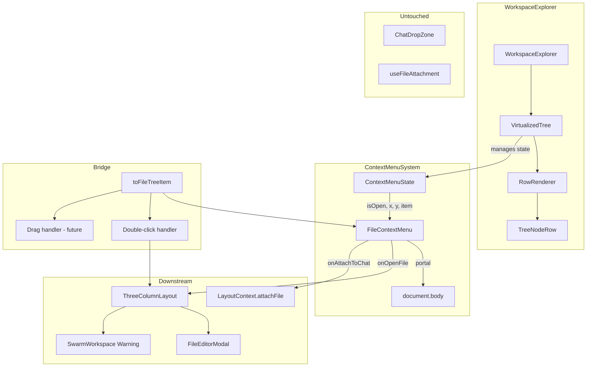

# Design Document: File Interaction Model

## Overview

This design defines the complete file interaction model for the SwarmAI Workspace Explorer. It covers three main concerns:

1. **Context menu wiring** — connecting the existing `FileContextMenu` component to the `VirtualizedTree` via portal rendering, with proper state management for open/close, position, and target node.
2. **TreeNode → FileTreeItem bridge** — a single pure conversion function (`toFileTreeItem`) that replaces all inline `TreeNode`-to-`FileTreeItem` mappings, keeping the deprecated `FileTreeItem` type alive for downstream consumers while centralizing the conversion.
3. **Interaction gestures** — single-click selection, double-click open, right-click context menu, keyboard accessibility, and a future drag-from-explorer-to-chat flow.

The design deliberately avoids touching the existing `useFileAttachment` hook and `ChatDropZone` component, which handle OS-level drag-and-drop file attachment independently.

## Architecture



### Key Architectural Decisions

**Decision 1: Context menu state lives in VirtualizedTree, not WorkspaceExplorer.**
The `VirtualizedTree` component already owns the row data and event callbacks. Lifting context menu state to `WorkspaceExplorer` would require threading additional props through `AutoSizer`. Since `VirtualizedTree` directly renders `RowRenderer` and has access to the flattened rows, it's the natural owner of `{ isOpen, x, y, item }` state.

**Decision 2: Portal rendering for FileContextMenu.**
The `FileContextMenu` already uses `position: fixed` and `z-index: 50`. It must render via a React portal to `document.body` to escape the `react-window` scroll container's `overflow: auto`. The existing `FileContextMenu` component already handles viewport edge adjustment internally.

**Decision 3: Single `toFileTreeItem` bridge function.**
Rather than converting inline in every handler, a single exported pure function centralizes the `TreeNode → FileTreeItem` mapping. This is the only place that sets `workspaceId: ''`, `workspaceName: ''`, and `id: node.path`. The function lives in a dedicated utility file within the `workspace-explorer` directory.

**Decision 4: `onOpenFile` callback added to FileContextMenu.**
The existing `FileContextMenu` has `onAttachToChat` but no "Open File" action. We add an `onOpenFile` callback prop that reuses the same `onFileDoubleClick` handler from `VirtualizedTreeProps`, gated to file nodes only.


## Components and Interfaces

### 1. `toFileTreeItem(node: TreeNode): FileTreeItem`

**File:** `desktop/src/components/workspace-explorer/toFileTreeItem.ts`

A pure utility function that is the single conversion point from the canonical `TreeNode` type to the deprecated `FileTreeItem` type.

```typescript
import type { TreeNode } from '../../types';
import type { FileTreeItem } from './FileTreeNode';

export function toFileTreeItem(node: TreeNode): FileTreeItem {
  return {
    id: node.path,
    name: node.name,
    type: node.type,
    path: node.path,
    workspaceId: '',
    workspaceName: '',
    children: node.children?.map(toFileTreeItem),
  };
}
```

**Rationale:** `id` is set to `path` because `LayoutContext.attachFile` deduplicates by `id`, and path is the unique identifier in the single-workspace model. `workspaceId` and `workspaceName` are empty strings — the single-workspace model doesn't use them. `isSwarmWorkspace` is intentionally omitted (defaults to `undefined`/falsy) since the SwarmWorkspace warning is handled at the `ThreeColumnLayout` level based on file path, not on this flag.

### 2. Context Menu State (in VirtualizedTree)

**File:** `desktop/src/components/workspace-explorer/VirtualizedTree.tsx`

New state added to the `VirtualizedTree` component:

```typescript
interface ContextMenuState {
  isOpen: boolean;
  x: number;
  y: number;
  item: FileTreeItem | null;
}
```

Initial state: `{ isOpen: false, x: 0, y: 0, item: null }`

State transitions:
- **Right-click on node** → `{ isOpen: true, x: e.clientX, y: e.clientY, item: toFileTreeItem(node) }`
- **Right-click different node while open** → close current, open new (same setState)
- **Click outside / Escape / scroll** → `{ isOpen: false, x: 0, y: 0, item: null }`
- **Left-click in tree** → close menu (handled by existing `FileContextMenu` click-outside listener)

### 3. VirtualizedTree Changes

**File:** `desktop/src/components/workspace-explorer/VirtualizedTree.tsx`

Changes to `VirtualizedTreeProps`:
```typescript
export interface VirtualizedTreeProps {
  height: number;
  width: number;
  onFileDoubleClick?: (node: FileTreeItem) => void;
  onAttachToChat?: (item: FileTreeItem) => void;  // NEW
}
```

Changes to `RowCustomProps`:
```typescript
interface RowCustomProps {
  rows: FlattenedRow[];
  selectedPath: string | null;
  toggleExpand: (path: string) => void;
  setSelectedPath: (path: string | null) => void;
  onFileDoubleClick?: (node: FileTreeItem) => void;
  onContextMenu: (e: React.MouseEvent, node: TreeNode) => void;  // NEW
}
```

The `RowRenderer` will:
1. Replace the inline `FileTreeItem` construction with `toFileTreeItem(node)`
2. Pass a real `onContextMenu` handler to `TreeNodeRow` instead of `() => {}`

The `VirtualizedTree` component will:
1. Manage `ContextMenuState` via `useState`
2. Render `FileContextMenu` via `createPortal(…, document.body)` when `contextMenu.isOpen && contextMenu.item`
3. Close the context menu on scroll via a `useEffect` that listens to the List's scroll events
4. Pass `onOpenFile` (reusing `onFileDoubleClick`) and `onAttachToChat` to `FileContextMenu`

### 4. FileContextMenu Changes

**File:** `desktop/src/components/workspace-explorer/FileContextMenu.tsx`

New prop:
```typescript
interface FileContextMenuProps {
  // ... existing props ...
  onOpenFile?: (item: FileTreeItem) => void;  // NEW
}
```

New menu item added before "Attach to Chat" for file nodes:
```typescript
// Open File — only for files (Requirement 2.1, 2.3)
if (item.type === 'file') {
  menuItems.push({
    id: 'open',
    label: 'Open File',
    icon: 'open_in_new',
    action: handleOpenFile,
    dividerAfter: false,
  });
}
```

Menu item order for files: Open File → Attach to Chat → (divider) → Rename → Delete → (divider) → Copy Path
Menu item order for directories: Rename → Delete → (divider) → Copy Path

### 5. WorkspaceExplorer Changes

**File:** `desktop/src/components/workspace-explorer/WorkspaceExplorer.tsx`

New prop threading:
```typescript
export interface WorkspaceExplorerProps {
  onFileDoubleClick?: (node: FileTreeItem) => void;
  onAttachToChat?: (item: FileTreeItem) => void;  // NEW
}
```

Passes `onAttachToChat` through to `VirtualizedTree`.

### 6. ThreeColumnLayout Changes

**File:** `desktop/src/components/layout/ThreeColumnLayout.tsx`

Wires `onAttachToChat` from `LayoutContext`:
```typescript
const { attachFile } = useLayout();
// ...
<WorkspaceExplorer
  onFileDoubleClick={handleFileDoubleClick}
  onAttachToChat={attachFile}
/>
```

### 7. Keyboard Accessibility Additions

**TreeNodeRow** already handles `onClick` and `onDoubleClick`. Additional keyboard support:

- **Enter key** on focused node → same as double-click (open file or toggle directory)
- **Shift+F10 / ContextMenu key** on focused node → open context menu at node position

These are handled via `onKeyDown` on the `TreeNodeRow` div element.

**FileContextMenu** already handles Escape to close. Additional keyboard support:
- **Arrow keys** to navigate between menu items (managed via `tabIndex` and focus management on menu buttons)
- **Enter** to select focused menu item
- On close, return focus to the triggering tree node (via a `returnFocusRef` pattern)


## Data Models

### TreeNode (existing, unchanged)

```typescript
interface TreeNode {
  name: string;
  path: string;
  type: 'file' | 'directory';
  children?: TreeNode[];
  gitStatus?: GitStatus;
}
```

### FileTreeItem (existing, deprecated, unchanged)

```typescript
interface FileTreeItem {
  id: string;
  name: string;
  type: 'file' | 'directory';
  path: string;
  workspaceId: string;
  workspaceName: string;
  children?: FileTreeItem[];
  isSwarmWorkspace?: boolean;
}
```

### ContextMenuState (new)

```typescript
interface ContextMenuState {
  isOpen: boolean;
  x: number;
  y: number;
  item: FileTreeItem | null;
}
```

### Field Mapping (toFileTreeItem)

| TreeNode field | FileTreeItem field | Value |
|---|---|---|
| `path` | `id` | Same as `path` |
| `name` | `name` | Direct copy |
| `type` | `type` | Direct copy |
| `path` | `path` | Direct copy |
| — | `workspaceId` | `''` (empty string) |
| — | `workspaceName` | `''` (empty string) |
| `children` | `children` | Recursive `toFileTreeItem` mapping |
| — | `isSwarmWorkspace` | `undefined` (omitted) |
| `gitStatus` | — | Not mapped (FileTreeItem has no git field) |


## Correctness Properties

*A property is a characteristic or behavior that should hold true across all valid executions of a system — essentially, a formal statement about what the system should do. Properties serve as the bridge between human-readable specifications and machine-verifiable correctness guarantees.*

### Property 1: toFileTreeItem shared field round-trip

*For any* valid `TreeNode` with arbitrary `name`, `path`, and `type` values, calling `toFileTreeItem(node)` and then reading the resulting `name`, `path`, and `type` fields SHALL return values identical to the original `TreeNode`'s `name`, `path`, and `type`.

**Validates: Requirements 4.5**

### Property 2: toFileTreeItem invariant fields

*For any* valid `TreeNode`, calling `toFileTreeItem(node)` SHALL produce a `FileTreeItem` where `id === node.path`, `workspaceId === ''`, and `workspaceName === ''`.

**Validates: Requirements 4.2, 4.3**

### Property 3: attachFile idempotence

*For any* `FileTreeItem` and any initial `attachedFiles` list, calling `attachFile` with the same item multiple times SHALL result in the `attachedFiles` list containing at most one entry with that item's `id`.

**Validates: Requirements 3.3**

### Property 4: Directory nodes hide file-only menu items

*For any* `FileTreeItem` where `type === 'directory'`, the menu items generated by `FileContextMenu` SHALL NOT include "Open File" or "Attach to Chat".

**Validates: Requirements 2.3, 3.4**

### Property 5: Single-click selects any node

*For any* tree node (file or directory), simulating a single-click SHALL result in that node's path being set as the `selectedPath` in `ExplorerContext`.

**Validates: Requirements 6.1, 6.2**

### Property 6: Directory double-click toggles expand without opening file

*For any* directory node, simulating a double-click SHALL toggle the directory's presence in `expandedPaths` and SHALL NOT invoke the `onFileDoubleClick` callback.

**Validates: Requirements 5.2**

### Property 7: Right-click replaces context menu target

*For any* two distinct tree nodes A and B, right-clicking node A then right-clicking node B SHALL result in the context menu state containing node B's data (not node A's).

**Validates: Requirements 8.2**

### Property 8: Drag initiation is file-only (future enhancement)

*For any* tree node, the `draggable` attribute SHALL be `true` if and only if `node.type === 'file'`. For file nodes, the drag data SHALL contain the node's `path`.

**Validates: Requirements 9.1, 9.4**

### Property 9: Enter key equivalence with double-click

*For any* focused tree node, pressing Enter SHALL produce the same observable effect as double-clicking that node (open file for files, toggle expand for directories).

**Validates: Requirements 10.1**


## Error Handling

### Context Menu Errors

| Scenario | Handling |
|---|---|
| Right-click on zone separator row | No-op — zone separators don't have node data, `onContextMenu` is not called |
| FileContextMenu rendered outside viewport | Existing viewport adjustment logic in `FileContextMenu` repositions the menu (already implemented) |
| `onOpenFile` callback throws | Error is caught by `ThreeColumnLayout.openFileEditor` which logs to console. Menu closes normally. |
| `onAttachToChat` callback throws | `LayoutContext.attachFile` is a simple state setter — cannot throw. No error handling needed. |
| File deleted between right-click and action | `readTextFile` in `ThreeColumnLayout.openFileEditor` will throw; caught and logged. Delete action in `FileContextMenu` already handles `remove()` failures. |

### Bridge Function Errors

| Scenario | Handling |
|---|---|
| `TreeNode` with undefined `children` | `toFileTreeItem` uses optional chaining (`node.children?.map`), returns `undefined` for `children` — matches `FileTreeItem` interface |
| `TreeNode` with empty `path` | Valid input — `id` will be empty string, `attachFile` dedup still works (empty string is a valid key) |

### Drag-and-Drop Errors (Future)

| Scenario | Handling |
|---|---|
| Drop on non-droppable target | Browser default — no action taken, no error |
| Drag data parsing failure | `JSON.parse` wrapped in try/catch; drop is silently ignored on failure |
| File path no longer valid at drop time | `attachFile` adds the reference; actual file reading happens later when the chat message is sent |

### Keyboard Accessibility Errors

| Scenario | Handling |
|---|---|
| Focus lost when context menu closes | `returnFocusRef` pattern ensures focus returns to the triggering node. If the node is no longer in the DOM (e.g., tree re-rendered), focus falls back to the tree container. |
| Arrow key navigation past menu boundaries | Focus wraps around (last item → first item, first item → last item) |

## Testing Strategy

### Property-Based Testing

**Library:** [fast-check](https://github.com/dubzzz/fast-check) (already available in the project's test dependencies or to be added)

**Configuration:** Minimum 100 iterations per property test.

Each property test must reference its design document property with a tag comment:

```typescript
// Feature: file-interaction-model, Property 1: toFileTreeItem shared field round-trip
```

**Property tests to implement:**

1. **Property 1 — toFileTreeItem shared field round-trip**
   Generate arbitrary `TreeNode` objects (random name, path, type). Assert `toFileTreeItem(node).name === node.name`, `.path === node.path`, `.type === node.type`.

2. **Property 2 — toFileTreeItem invariant fields**
   Generate arbitrary `TreeNode` objects. Assert `toFileTreeItem(node).id === node.path`, `.workspaceId === ''`, `.workspaceName === ''`.

3. **Property 3 — attachFile idempotence**
   Generate a random `FileTreeItem` and a random initial list. Call `attachFile` N times with the same item. Assert the resulting list contains at most one entry with that `id`.

4. **Property 4 — Directory nodes hide file-only menu items**
   Generate `FileTreeItem` objects with `type: 'directory'`. Render `FileContextMenu` and assert no "Open File" or "Attach to Chat" items in the DOM.

5. **Property 5 — Single-click selects any node**
   Generate random `TreeNode` objects. Simulate click. Assert `selectedPath` equals the clicked node's path.

6. **Property 6 — Directory double-click toggles expand without opening file**
   Generate random directory `TreeNode` objects. Simulate double-click. Assert `expandedPaths` toggled and `onFileDoubleClick` not called.

7. **Property 7 — Right-click replaces context menu target**
   Generate two distinct `TreeNode` objects. Right-click first, then right-click second. Assert context menu item matches second node.

8. **Property 8 — Drag initiation is file-only** (future)
   Generate random `TreeNode` objects. Assert `draggable` attribute matches `type === 'file'`.

9. **Property 9 — Enter key equivalence with double-click**
   Generate random `TreeNode` objects. Compare observable effects of Enter keypress vs double-click.

### Unit Tests

Unit tests complement property tests by covering specific examples and edge cases:

- **Context menu wiring:** Right-click opens menu at correct position (specific coordinates)
- **Portal rendering:** FileContextMenu renders as child of `document.body`
- **Escape closes menu:** Press Escape, verify `isOpen` becomes false
- **Scroll closes menu:** Simulate scroll event, verify menu closes
- **"Open File" callback:** Click "Open File", verify `onOpenFile` called with correct item
- **"Attach to Chat" callback:** Click "Attach to Chat", verify `onAttachToChat` called
- **SwarmWorkspace warning:** Double-click file with `isSwarmWorkspace: true`, verify warning dialog shown
- **Keyboard context menu:** Shift+F10 on focused node opens menu
- **Focus return on Escape:** Open menu via keyboard, press Escape, verify focus returns to triggering node
- **Arrow key navigation in menu:** Down arrow moves focus to next item, Up arrow to previous

### Test File Organization

```
desktop/src/components/workspace-explorer/__tests__/
  toFileTreeItem.test.ts          — Property tests 1, 2 + unit tests for edge cases
  contextMenu.test.tsx            — Property tests 4, 7 + unit tests for wiring
  treeInteractions.test.tsx       — Property tests 5, 6, 9 + unit tests for click/keyboard
  attachFile.test.ts              — Property test 3
  dragAndDrop.test.tsx            — Property test 8 (future)
```
