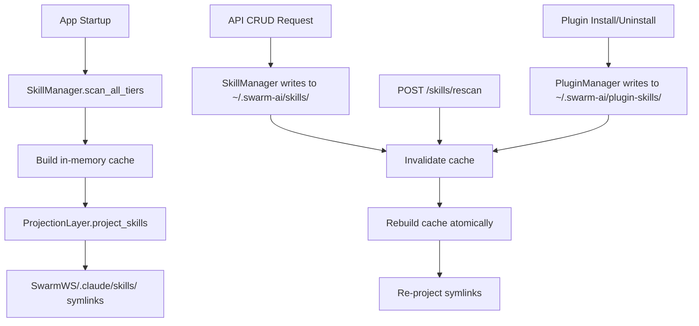
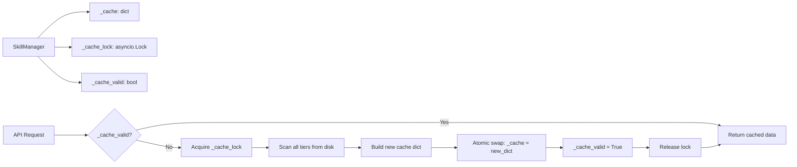
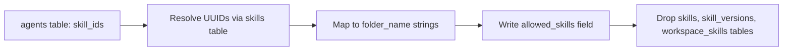

<!-- PE-REVIEWED -->
# Design Document: Filesystem Skills Re-Architecture

## Overview

This design replaces the current database-backed skills system with a pure filesystem-based architecture. The current system stores skill metadata in SQLite, syncs between filesystem and DB, and references skills by DB UUIDs. The new system eliminates the database layer entirely, using a three-tier filesystem hierarchy as the single source of truth.

### Key Changes

- **Single source of truth**: Filesystem replaces SQLite for all skill data
- **Identity**: Folder names (kebab-case) replace DB UUIDs
- **Discovery**: In-memory cache built from filesystem scans replaces DB queries
- **Projection**: Symlink layer merges three tiers into Claude SDK's discovery directory
- **Access control**: `allowed_skills` (folder name list) replaces `skill_ids` (UUID list)

### Files Affected

| Current File | Action |
|---|---|
| `backend/core/skill_manager.py` | Rewrite — filesystem-only SkillManager |
| `backend/core/local_skill_manager.py` | Remove — merged into new SkillManager |
| `backend/core/agent_sandbox_manager.py` | Simplify — remove skill symlink logic, keep template responsibilities |
| `backend/core/projection_layer.py` | New — extracted skill projection from AgentSandboxManager |
| `backend/core/agent_manager.py` | Update — `skill_ids` → `allowed_skills` |
| `backend/core/security_hooks.py` | Minor update — already uses folder names |
| `backend/core/agent_defaults.py` | Simplify — remove `_register_default_skills` DB logic |
| `backend/routers/skills.py` | Rewrite — filesystem CRUD, no DB |
| `backend/schemas/skill.py` | Simplify — remove DB-specific fields |
| `backend/scripts/generate_seed_db.py` | Remove skill seeding |
| `desktop/src/services/skills.ts` | Update — new response shape, folder-name IDs |
| `desktop/src/pages/SkillsPage.tsx` | Update — source tier display, rescan button |
| `desktop/src/components/workspace-settings/SkillsTab.tsx` | Update — folder names instead of UUIDs |

## Architecture

### Three-Tier Filesystem Layout

```
backend/skills/                    # Tier 1: Built-in (read-only, ships with app)
  ├── document/
  │   └── SKILL.md
  └── research/
      └── SKILL.md

~/.swarm-ai/skills/                # Tier 2: User-created (CRUD via API)
  ├── my-custom-skill/
  │   ├── SKILL.md
  │   └── helpers.py
  └── another-skill/
      └── SKILL.md

~/.swarm-ai/plugin-skills/             # Tier 3: Plugin/marketplace (managed by SwarmAI, locked to users)
  └── plugin-skill/
      └── SKILL.md
```

### Precedence Order

Built-in > User > Plugin. When two tiers contain a skill with the same folder name, the higher-precedence tier wins and a warning is logged identifying the shadowed skill.

### System Flow



### Cache Architecture



Cache invalidation is serialized via `asyncio.Lock`. Readers see either the old or new cache, never a partial state, because the swap is a single Python reference assignment.

## Components and Interfaces

### 1. SkillManager (backend/core/skill_manager.py)

Replaces both `SkillManager` and `LocalSkillManager`. Single class responsible for filesystem discovery, metadata extraction, CRUD on user skills, and cache management.

```python
class SkillInfo:
    """Immutable skill metadata extracted from a SKILL.md file."""
    folder_name: str          # kebab-case directory name (primary key)
    name: str                 # from frontmatter or fallback to folder_name
    description: str          # from frontmatter or fallback
    version: str              # from frontmatter, default "1.0.0"
    source_tier: Literal["built-in", "user", "plugin"]
    path: Path                # absolute path to the skill directory
    content: str | None       # markdown body after frontmatter (None in cache, loaded on demand)

class SkillManager:
    def __init__(self, builtin_path: Path | None = None,
                 user_skills_path: Path | None = None,
                 plugin_skills_path: Path | None = None):
        """Initialize with configurable paths for dev vs packaged and testing.

        Args:
            builtin_path: Path to built-in skills (default: backend/skills/ relative to app root)
            user_skills_path: Path to user skills (default: ~/.swarm-ai/skills/)
            plugin_skills_path: Path to plugin skills (default: ~/.swarm-ai/plugin-skills/)
        """

    async def scan_all(self) -> dict[str, SkillInfo]:
        """Scan all three tiers, apply precedence, return unified dict."""

    async def get_cache(self) -> dict[str, SkillInfo]:
        """Return cached skills, rebuilding if invalidated."""

    def invalidate_cache(self) -> None:
        """Mark cache as stale. Next get_cache() triggers rescan."""

    async def get_skill(self, folder_name: str) -> SkillInfo | None:
        """Look up a single skill by folder name. Loads content from disk on demand."""

    async def create_skill(self, folder_name: str, name: str,
                           description: str, content: str) -> SkillInfo:
        """Create a new user skill in ~/.swarm-ai/skills/."""

    async def update_skill(self, folder_name: str, name: str | None,
                           description: str | None,
                           content: str | None) -> SkillInfo:
        """Update an existing user skill's SKILL.md."""

    async def delete_skill(self, folder_name: str) -> None:
        """Delete a user skill directory. Raises for non-user tiers."""

    @staticmethod
    def parse_skill_md(path: Path, load_content: bool = True) -> SkillInfo:
        """Parse a SKILL.md file into SkillInfo. Set load_content=False for cache (list) mode."""

    @staticmethod
    def format_skill_md(name: str, description: str,
                        version: str, content: str) -> str:
        """Format metadata + content into a valid SKILL.md string."""

    @staticmethod
    def validate_folder_name(name: str) -> None:
        """Validate folder name against path traversal. Raises ValueError."""
```

### 2. ProjectionLayer (backend/core/projection_layer.py)

Extracted from the current `AgentSandboxManager` as a new module. `AgentSandboxManager` retains its non-skill responsibilities (template copying, `TEMPLATE_FILES`, `ensure_templates_in_directory`). `ProjectionLayer` is a new class that owns only skill symlink projection.

**Lifecycle**: `ProjectionLayer` is instantiated once at app startup (singleton), receiving the `SkillManager` singleton. Both are created during `InitializationManager.run_full_initialization` and shared across the application via dependency injection.

```python
class ProjectionLayer:
    def __init__(self, skill_manager: SkillManager):
        """Depends on SkillManager for skill discovery."""

    async def project_skills(
        self, workspace_path: Path,
        allowed_skills: list[str] | None = None,
        allow_all: bool = False
    ) -> None:
        """Project symlinks into SwarmWS/.claude/skills/.

        - Built-in skills are ALWAYS projected (unconditional).
        - If allow_all=True, project everything.
        - Otherwise, project only skills in allowed_skills list.
        - Removes stale symlinks for skills no longer available.
        - Validates symlink targets resolve within tier directories.
        """

    def _cleanup_stale_symlinks(self, skills_dir: Path,
                                 target_names: set[str]) -> None:
        """Remove symlinks not in target_names set."""

    def _validate_symlink_target(self, target: Path) -> bool:
        """Verify target resolves within a known tier directory."""
```

### 3. Skills API (backend/routers/skills.py)

Rewritten to perform filesystem operations via `SkillManager`. No DB imports.

| Endpoint | Method | Description |
|---|---|---|
| `/skills` | GET | List all skills (cached, without content) |
| `/skills/rescan` | POST | Invalidate cache, return fresh list |
| `/skills/generate-with-agent` | POST | AI skill generation (streaming) |
| `/skills/{folder_name}` | GET | Get single skill by folder name (includes content) |
| `/skills` | POST | Create user skill |
| `/skills/{folder_name}` | PUT | Update user skill |
| `/skills/{folder_name}` | DELETE | Delete user skill |

**Route ordering**: Fixed-path routes (`/skills/rescan`, `/skills/generate-with-agent`) MUST be registered before the parameterized `/{folder_name}` routes to avoid FastAPI matching "rescan" as a folder name.

**Skill generation flow**: The `/skills/generate-with-agent` endpoint writes generated SKILL.md and supporting files directly to `~/.swarm-ai/skills/{skill-name}/`. The `finalize` endpoint is removed — no DB registration is needed. After generation completes, the endpoint invalidates the cache and triggers projection. If the target directory already exists, it returns 409 Conflict.

### 4. Security Hooks (backend/core/security_hooks.py)

`create_skill_access_checker` already validates by folder name. No changes needed to the hook logic itself. The caller in `agent_manager.py` changes from resolving UUIDs to passing folder names directly from `allowed_skills`.

**`expand_skill_ids_with_plugins` replacement**: The current function resolves plugin skill UUIDs via DB. In the new architecture, this function is replaced by `expand_allowed_skills_with_plugins()` in `agent_defaults.py`:

```python
async def expand_allowed_skills_with_plugins(
    allowed_skills: list[str],
    plugin_ids: list[str],
    skill_manager: SkillManager,
    allow_all_skills: bool = False,
) -> list[str]:
    """Combine explicit allowed_skills with plugin skill folder names.

    Plugin skills are discovered from the filesystem (~/.swarm-ai/plugin-skills/)
    rather than the database. Plugin attribution is determined by the
    plugin_manager's installed_skills_by_plugin() mapping.

    Returns a deduplicated list: explicit skills first, then plugin skills.
    """
```

**Plugin skill attribution**: In the filesystem-only world, plugin attribution is managed by the `PluginManager` which maintains a mapping of `plugin_id → list[folder_name]` based on which skills were installed by each plugin. This mapping is built at plugin install time and stored in the plugin's metadata file (`~/.swarm-ai/plugins/cache/{marketplace}/{plugin-name}/plugin.json`). The `SkillManager` does not need to know about plugin attribution — it only sees `~/.swarm-ai/plugin-skills/` as a flat tier. The `expand_allowed_skills_with_plugins()` function queries `PluginManager` for the mapping.

### 5. Frontend Services (desktop/src/services/skills.ts)

Updated `toCamelCase()` mapping and API calls:

```typescript
interface Skill {
  folderName: string;       // primary identifier (was: id)
  name: string;
  description: string;
  version: string;
  sourceTier: 'built-in' | 'user' | 'plugin';
  readOnly: boolean;        // true for built-in and plugin
  content?: string;         // only present in detail endpoint, undefined in list
}
```

API methods change from UUID-based to folder-name-based:
- `get(id)` → `get(folderName)`
- `delete(id)` → `delete(folderName)`
- `refresh()` → `rescan()`
- `finalize()` → removed (no longer needed)

## Data Models

### SKILL.md Format

```yaml
---
name: My Custom Skill
description: A skill that does something useful
version: 1.0.0
---

# My Custom Skill

Skill content in markdown...
```

### Backend Pydantic Models (backend/schemas/skill.py)

```python
class SkillResponse(BaseModel):
    """API response for a single skill."""
    folder_name: str                                    # primary identifier
    name: str
    description: str
    version: str = "1.0.0"
    source_tier: Literal["built-in", "user", "plugin"]
    read_only: bool                                     # built-in and plugin = True
    content: str | None = None                          # markdown body (only in detail endpoint)

class SkillCreateRequest(BaseModel):
    """Request to create a new user skill."""
    folder_name: str = Field(..., pattern=r'^[a-zA-Z0-9][a-zA-Z0-9_-]*$', max_length=128)
    name: str = Field(..., min_length=1, max_length=255)
    description: str = Field(..., max_length=2000)
    content: str = Field(..., max_length=500_000)       # ~500KB limit

class SkillUpdateRequest(BaseModel):
    """Request to update an existing user skill."""
    name: str | None = Field(None, max_length=255)
    description: str | None = Field(None, max_length=2000)
    content: str | None = Field(None, max_length=500_000)
```

**List vs Detail responses**: `GET /skills` returns `list[SkillResponse]` as a flat JSON array (matching current frontend expectations) with `content=None` omitted. `GET /skills/{folder_name}` returns a single `SkillResponse` with `content` populated. This avoids transferring potentially large markdown bodies on every list call.

**Ordering**: `GET /skills` returns skills sorted by `folder_name` alphabetically for deterministic output across platforms.

### Agent Configuration Schema Change

```python
# Before (DB-backed)
{
    "skill_ids": ["uuid-1", "uuid-2", "uuid-3"]
}

# After (filesystem-backed)
{
    "allowed_skills": ["my-custom-skill", "research", "document"]
}
```

### Migration Data Flow



Migration is a single step that:
1. Reads `skill_ids` from each agent record
2. Joins against `skills` table to get `folder_name` (or derives from `name`)
3. Writes `allowed_skills` list on the agent record
4. Verifies all agent records have been updated successfully
5. Only after successful verification: drops the `skills`, `skill_versions`, and `workspace_skills` tables

**Migration safety**: The migration MUST NOT drop tables until UUID resolution is confirmed successful for all agent records. If any agent record fails to update (beyond expected unresolvable UUIDs), the migration aborts and no tables are dropped. The migration is idempotent — re-running it when `allowed_skills` already exists is a no-op.

If a UUID cannot be resolved, it is logged and skipped — the skill was likely already deleted.

## Correctness Properties

*A property is a characteristic or behavior that should hold true across all valid executions of a system — essentially, a formal statement about what the system should do. Properties serve as the bridge between human-readable specifications and machine-verifiable correctness guarantees.*

### Property 1: Three-Tier Discovery Completeness

*For any* set of valid skill directories distributed across the three tiers (built-in, user, plugin), `scan_all()` should return exactly the union of all skills, keyed by folder name, with name collisions resolved by precedence (built-in > user > plugin), and each skill's `source_tier` correctly reflecting its origin tier.

**Validates: Requirements 1.1, 1.2, 1.3, 1.4, 5.8, 6.1**

### Property 2: Invalid Directories Are Skipped

*For any* set of directories in a skill tier where some directories lack a valid SKILL.md file, `scan_all()` should return only the directories that contain a valid SKILL.md, and the count of returned skills should equal the count of directories with valid SKILL.md files.

**Validates: Requirements 1.5**

### Property 3: SKILL.md Round-Trip

*For any* valid skill metadata (name, description, version, content), formatting it into a SKILL.md string and then parsing that string back should produce an equivalent metadata object with identical field values.

**Validates: Requirements 2.1, 2.2, 2.4, 2.5**

### Property 4: Malformed Frontmatter Produces Descriptive Errors

*For any* SKILL.md content with malformed YAML frontmatter (unclosed delimiters, invalid YAML syntax, non-string field values), `parse_skill_md()` should raise an error whose message includes the file path and a description of the malformation.

**Validates: Requirements 2.3**

### Property 5: Missing Frontmatter Fields Fall Back to Defaults

*For any* SKILL.md file where the `name` field is missing, the parsed skill should use the folder name as `name`. For any SKILL.md where `description` is missing, the parsed skill should use `"Skill: {folder_name}"` as `description`.

**Validates: Requirements 2.6**

### Property 6: Projection Reflects Allowed Skills

*For any* set of available skills and any `allowed_skills` list, the projection directory should contain symlinks for: (a) ALL built-in skills unconditionally, plus (b) only those user/plugin skills whose folder names appear in `allowed_skills`. When `allow_all=True`, all skills from all tiers should be projected.

**Validates: Requirements 3.1, 3.6, 4.2, 4.3, 6.2**

### Property 7: Projection Precedence Matches Discovery

*For any* name collision where the same folder name exists in multiple tiers, the symlink in the projection directory should point to the skill from the highest-precedence tier (built-in > user > plugin).

**Validates: Requirements 3.2**

### Property 8: CRUD Triggers Projection Update

*For any* skill CRUD operation (create, update, delete) that succeeds, the projection directory should reflect the change: a created skill should have a new symlink, a deleted skill should have its symlink removed, and an updated skill's symlink target should remain valid.

**Validates: Requirements 3.4, 5.7, 10.2**

### Property 9: Tier-Based Mutability

*For any* skill, mutability is determined by its `source_tier`: only user-tier skills can be created, updated, or deleted via the API. Attempting to modify or delete a built-in skill should return 403. Attempting to modify or delete a plugin skill should return 403. The `read_only` field in API responses should be `true` for built-in and plugin skills, `false` for user skills.

**Validates: Requirements 5.3, 5.4, 5.5, 5.6, 6.4, 6.5**

### Property 10: Name Conflict Prevention

*For any* folder name that already exists in any tier, attempting to create a new user skill with that folder name should fail. Specifically: if the name matches a built-in skill, the API returns 409 Conflict; if it matches an existing user skill, the API returns 409 Conflict.

**Validates: Requirements 1.7, 10.4**

### Property 11: Folder Name Validation

*For any* string, the folder name validator should accept it if and only if it matches `^[a-zA-Z0-9][a-zA-Z0-9_-]*$`. Strings containing path separators (`/`, `\`), parent directory references (`..`), null bytes, or starting with a hyphen/underscore should be rejected.

**Validates: Requirements 11.1, 11.2**

### Property 12: Path Containment

*For any* file operation performed by the Skill_Manager or Projection_Layer, the resolved canonical path of the target must be within one of the three tier directories. No operation should be able to read, write, or symlink to a path outside the designated tier directories.

**Validates: Requirements 11.3, 11.5**

### Property 13: Security Hook Enforcement

*For any* skill invocation and any `allowed_skills` list, the PreToolUse hook should grant access if the requested skill is a built-in skill (always allowed) OR if the requested skill folder name is in the `allowed_skills` list. An empty `allowed_skills` list should deny all non-built-in skill access.

**Validates: Requirements 4.6**

### Property 14: Migration UUID Resolution

*For any* set of agent records with `skill_ids` (UUIDs) and a `skills` table mapping UUIDs to folder names, the migration should produce `allowed_skills` lists containing exactly the resolved folder names. Unresolvable UUIDs should be skipped (not cause migration failure).

**Validates: Requirements 7.6**

### Property 15: Cache Atomicity Under Concurrent Access

*For any* sequence of concurrent cache invalidation and read operations, every read should return a complete, consistent snapshot — either the old cache or the new cache, never a partial mix. Concurrent invalidations should be serialized so that only one rebuild runs at a time.

**Validates: Requirements 12.1, 12.4**

### Property 16: External Change Detection on Rescan

*For any* external filesystem modification (adding, removing, or modifying a skill directory), triggering a cache invalidation and rescan should cause the cache to reflect the current filesystem state.

**Validates: Requirements 12.2**

### Property 17: Frontend Field Mapping Round-Trip

*For any* valid backend `SkillResponse` object (snake_case), applying `toCamelCase()` should produce a frontend `Skill` object where every field is correctly mapped, and no fields are lost or misnamed.

**Validates: Requirements 9.7**

## Error Handling

### Filesystem Errors

| Scenario | Handling |
|---|---|
| Tier directory doesn't exist | Create on first access (`~/.swarm-ai/skills/` and `~/.swarm-ai/plugin-skills/`). For built-in, log warning and continue with empty tier. |
| SKILL.md missing from directory | Skip directory, log warning with path. Directory is excluded from cache. |
| SKILL.md has malformed YAML | Skip directory, log warning with path and parse error detail. |
| Permission denied on read | Skip directory, log error. Do not crash the scan. |
| Permission denied on write (create/update) | Return 500 with message indicating filesystem permission issue. |
| Disk full on write | Return 500 with message. Attempt cleanup of partial writes. |
| Symlink target deleted between scan and access | Catch `OSError`, log warning, remove stale symlink on next projection. |
| Directory deleted during iteration | Catch `FileNotFoundError`, log warning, continue with remaining directories. |

### API Errors

| Scenario | HTTP Status | Response |
|---|---|---|
| Skill not found | 404 | `{"detail": "Skill '{folder_name}' not found"}` |
| Create with existing name | 409 | `{"detail": "Skill '{folder_name}' already exists"}` |
| Create with built-in name | 409 | `{"detail": "Name '{folder_name}' is reserved by a built-in skill"}` |
| Modify/delete built-in skill | 403 | `{"detail": "Built-in skills are read-only"}` |
| Modify plugin skill | 403 | `{"detail": "Plugin skills are managed by the plugin system"}` |
| Delete plugin skill | 403 | `{"detail": "Plugin skills must be uninstalled via the plugin system"}` |
| Uninstall plugin skill | Delegates to plugin system | Plugin system removes from `~/.swarm-ai/plugin-skills/` |
| Invalid folder name | 400 | `{"detail": "Invalid folder name: must match [a-zA-Z0-9][a-zA-Z0-9_-]*"}` |
| Path traversal attempt | 400 | `{"detail": "Invalid path: traversal detected"}` (also logged as security warning) |
| Malformed SKILL.md in request | 422 | Standard FastAPI validation error |

### Migration Errors

| Scenario | Handling |
|---|---|
| UUID not found in skills table | Log warning, skip entry. Migration continues. |
| skills table already dropped | Migration step is idempotent — if `skill_ids` column doesn't exist, skip resolution. |
| `allowed_skills` column already exists | Migration is idempotent — no-op if column present. |

### Cache Errors

| Scenario | Handling |
|---|---|
| Scan fails mid-tier | Log error for failed tier, continue with other tiers. Cache reflects partial state with warning. |
| Lock acquisition timeout | Use `asyncio.wait_for` with 5-second timeout. If exceeded, return stale cache and log warning. On first scan (no stale cache), block until scan completes — there is no fallback. |

## Testing Strategy

### Property-Based Testing

Property-based tests use the `hypothesis` library (Python) for backend and `fast-check` for frontend TypeScript.

Each property test:
- Runs a minimum of 100 iterations
- References its design document property via a comment tag
- Uses custom generators for skill metadata, folder names, and tier configurations

**Backend Property Tests (pytest + hypothesis):**

| Property | Test Description | Tag |
|---|---|---|
| Property 1 | Generate random skill dirs across 3 tiers, verify scan_all returns correct union with precedence | `Feature: filesystem-skills-rearchitecture, Property 1: Three-Tier Discovery Completeness` |
| Property 2 | Generate mix of valid/invalid dirs, verify only valid ones returned | `Feature: filesystem-skills-rearchitecture, Property 2: Invalid Directories Are Skipped` |
| Property 3 | Generate random metadata, format→parse round-trip | `Feature: filesystem-skills-rearchitecture, Property 3: SKILL.md Round-Trip` |
| Property 4 | Generate malformed YAML strings, verify descriptive errors | `Feature: filesystem-skills-rearchitecture, Property 4: Malformed Frontmatter Produces Descriptive Errors` |
| Property 5 | Generate SKILL.md with missing name/description, verify fallbacks | `Feature: filesystem-skills-rearchitecture, Property 5: Missing Frontmatter Fields Fall Back to Defaults` |
| Property 6 | Generate skills + allowed_skills list, verify projection contents | `Feature: filesystem-skills-rearchitecture, Property 6: Projection Reflects Allowed Skills` |
| Property 7 | Generate name collisions across tiers, verify symlink targets | `Feature: filesystem-skills-rearchitecture, Property 7: Projection Precedence Matches Discovery` |
| Property 8 | Perform random CRUD ops, verify projection updates | `Feature: filesystem-skills-rearchitecture, Property 8: CRUD Triggers Projection Update` |
| Property 9 | Generate skills with random tiers, verify mutability rules | `Feature: filesystem-skills-rearchitecture, Property 9: Tier-Based Mutability` |
| Property 10 | Generate existing names, verify creation fails with correct error | `Feature: filesystem-skills-rearchitecture, Property 10: Name Conflict Prevention` |
| Property 11 | Generate random strings, verify validator accepts/rejects correctly | `Feature: filesystem-skills-rearchitecture, Property 11: Folder Name Validation` |
| Property 12 | Generate paths with traversal attempts, verify containment | `Feature: filesystem-skills-rearchitecture, Property 12: Path Containment` |
| Property 13 | Generate skill names + allowed lists, verify hook decisions | `Feature: filesystem-skills-rearchitecture, Property 13: Security Hook Enforcement` |
| Property 14 | Generate UUID→folder_name mappings, verify migration output | `Feature: filesystem-skills-rearchitecture, Property 14: Migration UUID Resolution` |
| Property 15 | Run concurrent reads + invalidations, verify snapshot consistency | `Feature: filesystem-skills-rearchitecture, Property 15: Cache Atomicity Under Concurrent Access` |
| Property 16 | Modify filesystem externally, rescan, verify cache reflects changes | `Feature: filesystem-skills-rearchitecture, Property 16: External Change Detection on Rescan` |

**Frontend Property Tests (vitest + fast-check):**

| Property | Test Description | Tag |
|---|---|---|
| Property 17 | Generate random backend responses, verify toCamelCase mapping | `Feature: filesystem-skills-rearchitecture, Property 17: Frontend Field Mapping Round-Trip` |

### Unit Tests

Unit tests complement property tests by covering specific examples and edge cases:

- **SKILL.md parsing**: Specific known-good and known-bad files
- **Folder name validation**: Edge cases like empty string, single char, max length, unicode
- **API endpoints**: Integration tests with test filesystem fixtures
- **Migration**: Specific UUID resolution scenarios with known DB state
- **Projection**: Stale symlink cleanup, missing target directory
- **Security hook**: Specific allow/deny scenarios

### Test Infrastructure

- Use `tmp_path` pytest fixture for isolated filesystem operations
- Create helper functions to generate skill directory trees for testing
- Mock `Path.home()` to isolate user/plugin tier paths during tests
- Use `asyncio.Lock` testing patterns for concurrency properties
