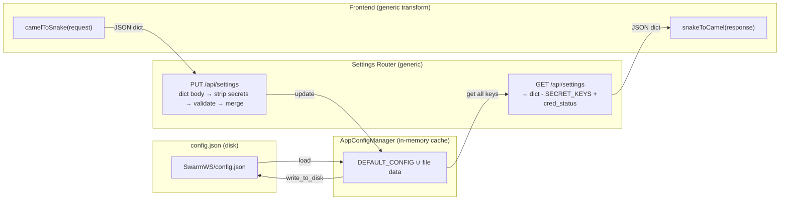

# Design Document: Generic Settings Pipeline

## Overview

This design replaces the per-field Pydantic settings pipeline with a generic dict pass-through architecture. Today, adding a single config field requires touching `AppConfigRequest`, `AppConfigResponse`, `_build_response`, the PUT handler's field-by-field extraction, the frontend `APIConfigurationResponse` interface, and the `toSettingsCamelCase` mapper — 8 touch-points across 4 files. After this refactor, `DEFAULT_CONFIG` in `app_config_manager.py` is the single source of truth; the API layer and frontend transform the dict generically.

### Key Design Decisions

1. **Dict pass-through over Pydantic response_model**: The GET endpoint returns a plain `dict` built by reading all keys from `AppConfigManager`, filtering `SECRET_KEYS`, and injecting credential status fields. No `response_model` annotation — FastAPI serializes dicts natively as JSON.

2. **Whitelisted dict request body**: The PUT endpoint uses `request: Request` and `await request.json()` to get a plain dict, then whitelists keys to those present in `DEFAULT_CONFIG` before merging. This prevents injection of arbitrary keys into config.json while still being generic — new fields only need to be added to `DEFAULT_CONFIG`.

3. **Validation stays in the router**: The `default_model` / `available_models` cross-field validation and `anthropic_base_url` empty-string clearing remain as explicit logic in the PUT handler. These are business rules, not schema concerns.

4. **Generic snake↔camel conversion on the frontend**: Replace the per-field `toSettingsCamelCase` with a generic `snakeToCamel(obj)` / `camelToSnake(obj)` utility that recursively transforms all keys. The frontend type becomes `Record<string, unknown>` with a thin typed wrapper for known fields used by UI components.

5. **claude_environment.py is untouched**: It already reads from `AppConfigManager.get()` with zero dependency on Pydantic models.

## Architecture



### Data Flow

**GET**: `AppConfigManager._cache` → filter `SECRET_KEYS` → inject `aws_credentials_configured` + `anthropic_api_key_configured` → return `dict` → FastAPI JSON serialization → frontend `snakeToCamel()` → UI

**PUT**: UI → `camelToSnake(formData)` → HTTP PUT JSON body → router receives `dict` → strip `SECRET_KEYS` → validate `default_model`/`available_models` → `AppConfigManager.update()` → return updated dict (same as GET flow)

## Components and Interfaces

### Backend: `routers/settings.py` (modified)

**Removed**:
- `from schemas.settings import AppConfigRequest, AppConfigResponse`
- `_build_response(cfg: AppConfigManager) -> AppConfigResponse` (per-field builder)
- `response_model=AppConfigResponse` on both endpoints

**Added**:

```python
# Keys accepted from PUT requests — only DEFAULT_CONFIG keys minus secrets.
# Unknown keys are rejected (not persisted) to prevent config pollution.
WRITABLE_KEYS: frozenset[str] = frozenset(DEFAULT_CONFIG.keys()) - SECRET_KEYS

def _build_config_response(cfg: AppConfigManager) -> dict:
    """Build a plain dict response from the config cache.

    1. Read all DEFAULT_CONFIG keys from cfg (safe public API, no _cache access)
    2. Exclude SECRET_KEYS
    3. Inject credential status fields
    """
    clean = {
        k: cfg.get(k, v)
        for k, v in DEFAULT_CONFIG.items()
        if k not in SECRET_KEYS
    }
    # Inject credential status
    clean["aws_credentials_configured"] = _probe_aws_credentials()
    clean["anthropic_api_key_configured"] = _probe_anthropic_api_key()
    return clean
```

**GET endpoint** (simplified):
```python
@router.get("")
async def get_app_configuration():
    cfg = get_config_manager()
    return _build_config_response(cfg)
```

**PUT endpoint** (whitelisted dict merge, validate-before-persist):
```python
from fastapi import Request

@router.put("")
async def update_app_configuration(request: Request):
    body = await request.json()
    cfg = get_config_manager()

    # Whitelist to known config keys only (rejects unknown/secret keys)
    updates = {k: v for k, v in body.items() if k in WRITABLE_KEYS}

    # anthropic_base_url empty-string → None
    if updates.get("anthropic_base_url") == "":
        updates["anthropic_base_url"] = None

    # Compute effective state BEFORE persisting
    effective_available = updates.get(
        "available_models",
        cfg.get("available_models", DEFAULT_CONFIG["available_models"]),
    )

    # Validation: default_model must be in available_models
    if "default_model" in updates and effective_available:
        if updates["default_model"] not in effective_available:
            raise HTTPException(status_code=400, detail="default_model must be in available_models")

    # Auto-reset default_model when available_models changed and current default not in new list
    if "available_models" in updates and "default_model" not in updates:
        current_default = cfg.get("default_model", DEFAULT_CONFIG["default_model"])
        new_models = updates["available_models"]
        if new_models and current_default not in new_models:
            updates["default_model"] = new_models[0]

    # Single atomic update — validated state only
    if updates:
        cfg.update(updates)

    return _build_config_response(cfg)
```

### Backend: `schemas/settings.py` (deleted)

The entire file is removed. No other module imports from it (confirmed by codebase search — only `routers/settings.py` imports it).

### Backend: `core/app_config_manager.py` (unchanged)

No changes needed. `DEFAULT_CONFIG`, `SECRET_KEYS`, `get()`, `update()`, and `_write_to_disk()` already provide the exact interface the generic pipeline needs.

### Backend: `core/claude_environment.py` (unchanged)

Already uses `config.get("use_bedrock", False)`, `config.get("aws_region", ...)`, etc. Zero dependency on Pydantic models.

### Frontend: `desktop/src/services/settings.ts` (modified)

**Removed**:
- `APIConfigurationResponse` interface (per-field)
- `APIConfigurationRequest` interface (per-field)
- `toSettingsCamelCase()` (per-field mapper)

**Added**:

```typescript
// Generic snake_case ↔ camelCase utilities
function snakeToCamel(s: string): string {
  return s.replace(/_([a-z])/g, (_, c) => c.toUpperCase());
}

function camelToSnake(s: string): string {
  return s.replace(/[A-Z]/g, (c) => `_${c.toLowerCase()}`);
}

function transformKeys<T>(
  obj: Record<string, unknown>,
  keyFn: (k: string) => string
): T {
  const result: Record<string, unknown> = {};
  for (const [k, v] of Object.entries(obj)) {
    result[keyFn(k)] = v;
  }
  return result as T;
}

// Typed wrapper — only fields actively used by SettingsPage.
// All other fields pass through as [key: string]: unknown.
export interface SettingsConfig extends Record<string, unknown> {
  useBedrock: boolean;
  awsRegion: string;
  defaultModel: string;
  availableModels: string[];
  anthropicBaseUrl: string | null;
  readonly awsCredentialsConfigured: boolean;
  readonly anthropicApiKeyConfigured: boolean;
}

export const settingsService = {
  async getAPIConfiguration(): Promise<SettingsConfig> {
    const response = await api.get<Record<string, unknown>>('/settings');
    return transformKeys<SettingsConfig>(response.data, snakeToCamel);
  },

  async updateAPIConfiguration(
    request: Record<string, unknown>
  ): Promise<SettingsConfig> {
    const payload = transformKeys<Record<string, unknown>>(request, camelToSnake);
    const response = await api.put<Record<string, unknown>>('/settings', payload);
    return transformKeys<SettingsConfig>(response.data, snakeToCamel);
  },
};
```

### Frontend consumers (minimal changes)

- `SettingsPage.tsx`: Change `APIConfigurationResponse` → `SettingsConfig` import. The `updateAPIConfiguration` calls already pass snake_case keys in the request object — the generic `camelToSnake` transform handles this. If callers currently pass snake_case keys directly, they can continue to do so (the transform is idempotent on already-snake_case keys).
- `SkillsPage.tsx`, `AgentFormModal.tsx`: Only read `availableModels` from the response — no changes needed since `SettingsConfig` has the same field.
- Test mocks: Update `settingsService.getAPIConfiguration` mock return values to match `SettingsConfig` shape (same fields, just different type name).

### Backend: `tests/test_settings_router.py` (rewritten)

The test file is rewritten to test the generic dict contract directly. The pre-existing fixture issue is fixed as part of this refactor (the old fixtures depended on Pydantic models that no longer exist). Tests verify:
- Response contains all keys from `DEFAULT_CONFIG` (minus `SECRET_KEYS`) plus credential status fields
- No secret keys in response
- Unknown keys in PUT are rejected (not persisted)
- Validation rules still work (400 on invalid `default_model`, auto-reset, empty-string clearing)
- Open-tabs endpoints unchanged

## Data Models

### Config Dict Shape (source of truth: `DEFAULT_CONFIG`)

```python
# From app_config_manager.py — this IS the schema
DEFAULT_CONFIG: dict[str, Any] = {
    "use_bedrock": True,
    "aws_region": "us-east-1",
    "default_model": "claude-opus-4-6",
    "available_models": [...],
    "bedrock_model_map": {...},
    "anthropic_base_url": None,
    "claude_code_disable_experimental_betas": False,  # default False since 1M context fix
    "sandbox_additional_write_paths": "",
    "sandbox_enabled_default": True,
    "sandbox_auto_allow_bash": True,
    "sandbox_excluded_commands": "docker",
    "sandbox_allow_unsandboxed": False,
    "sandbox_allowed_hosts": "*",
    "evolution": {...},
}
```

### API Response Shape (GET and PUT)

```json
{
  // All keys from DEFAULT_CONFIG minus SECRET_KEYS
  "use_bedrock": true,
  "aws_region": "us-east-1",
  "default_model": "claude-opus-4-6",
  "available_models": ["claude-opus-4-6", ...],
  "bedrock_model_map": {...},
  "anthropic_base_url": null,
  "claude_code_disable_experimental_betas": false,
  "sandbox_additional_write_paths": "",
  "sandbox_enabled_default": true,
  "sandbox_auto_allow_bash": true,
  "sandbox_excluded_commands": "docker",
  "sandbox_allow_unsandboxed": false,
  "sandbox_allowed_hosts": "*",
  "evolution": {...},
  // Injected credential status (read-only, computed at request time)
  "aws_credentials_configured": false,
  "anthropic_api_key_configured": false
}
```

### API Request Shape (PUT)

Any subset of config keys as a JSON object. Unknown keys are accepted and persisted (pass-through). Secret keys are silently stripped.

```json
{
  "aws_region": "eu-west-1",
  "use_bedrock": false
}
```

### SECRET_KEYS (filtered from both directions)

```python
SECRET_KEYS = frozenset({
    "aws_access_key_id",
    "aws_secret_access_key",
    "aws_session_token",
    "aws_bearer_token",
    "anthropic_api_key",
})
```

## Correctness Properties

*A property is a characteristic or behavior that should hold true across all valid executions of a system — essentially, a formal statement about what the system should do. Properties serve as the bridge between human-readable specifications and machine-verifiable correctness guarantees.*

### Property 1: GET response contains all expected keys

*For any* config state (any valid `DEFAULT_CONFIG` merged with any file-loaded overrides), the GET `/api/settings` response SHALL contain every key from `DEFAULT_CONFIG` (minus `SECRET_KEYS`) plus the two credential status fields (`aws_credentials_configured`, `anthropic_api_key_configured`).

**Validates: Requirements 1.1, 1.3, 2.4, 8.1, 8.2**

### Property 2: Secret keys never appear in GET responses

*For any* config state, including configs where secret keys have been injected into the in-memory cache, the GET `/api/settings` response SHALL contain zero keys from `SECRET_KEYS`.

**Validates: Requirements 1.2, 4.1**

### Property 3: Secret keys in PUT body are silently discarded

*For any* PUT request body containing keys from `SECRET_KEYS` mixed with valid config keys, the response SHALL contain the valid config updates but zero keys from `SECRET_KEYS`, and a subsequent GET SHALL also contain zero keys from `SECRET_KEYS`.

**Validates: Requirements 2.2, 4.2**

### Property 4: Secret filter round-trip

*For any* valid config dict (including dicts with secret keys mixed in), filtering out `SECRET_KEYS`, serializing to JSON, then deserializing SHALL produce a dict with no keys from `SECRET_KEYS` and all non-secret keys preserved.

**Validates: Requirements 4.3**

### Property 5: PUT update round-trip

*For any* non-secret config key and any valid value, sending a PUT with that key-value pair then sending a GET SHALL return a response where that key has the updated value.

**Validates: Requirements 2.1**

### Property 6: New DEFAULT_CONFIG keys appear without code changes

*For any* key added to `DEFAULT_CONFIG` at runtime (monkey-patched in test), the GET response SHALL include that key, and a PUT with that key SHALL persist and return it — without any modifications to the router module.

**Validates: Requirements 1.5, 2.5, 5.4**

### Property 7: Invalid default_model rejected

*For any* `default_model` string and any `available_models` list where `default_model` is not in the list, a PUT request providing both SHALL return HTTP 400 with a detail message containing "default_model".

**Validates: Requirements 3.1**

### Property 8: default_model always in available_models after PUT

*For any* PUT request that updates `available_models` (with or without `default_model`), after the request completes, the effective `default_model` SHALL be a member of the effective `available_models` list. If the old `default_model` was in the new list, it is preserved; otherwise it is reset to the first element.

**Validates: Requirements 3.2, 3.3**

### Property 9: snake_case ↔ camelCase round-trip

*For any* valid snake_case string (matching `[a-z][a-z0-9]*(_[a-z0-9]+)*`), converting to camelCase then back to snake_case SHALL produce the original string. Additionally, `camelToSnake` applied to an already-snake_case string SHALL return the input unchanged (idempotency).

**Validates: Requirements 5.5**

### Property 10: Claude environment variables match config

*For any* config where `use_bedrock` is a boolean and `aws_region` is a non-empty string, calling `_configure_claude_environment` SHALL set `CLAUDE_CODE_USE_BEDROCK` to `"true"` iff `use_bedrock` is `True`, and set `AWS_REGION` / `AWS_DEFAULT_REGION` to the config's `aws_region` value when bedrock is enabled. `CLAUDE_CODE_DISABLE_EXPERIMENTAL_BETAS` SHALL be set to `"true"` only when the config flag is explicitly `True` (default is `False` — betas enabled by default since the 1M context fix).

**Validates: Requirements 6.2, 6.3**

## Error Handling

### PUT Validation Errors

| Condition | HTTP Status | Detail |
|-----------|-------------|--------|
| `default_model` not in `available_models` | 400 | `"default_model must be in available_models"` |
| Invalid JSON body | 422 | FastAPI default validation error |

### Graceful Degradation

- **Credential probing failures**: `_probe_aws_credentials()` and `_probe_anthropic_api_key()` catch all exceptions and return `False`. A failed boto3 import or STS call never crashes the GET endpoint.
- **Empty PUT body**: Treated as no-op, returns current config. No error.
- **Unknown keys in PUT**: Silently ignored — only keys present in `DEFAULT_CONFIG` (minus `SECRET_KEYS`) are accepted. This prevents config pollution while keeping the API generic.
- **Secret keys in PUT**: Filtered out by the `WRITABLE_KEYS` whitelist (which excludes `SECRET_KEYS`). No error returned.

### Open Tabs Endpoints (unchanged)

- Missing `open_tabs.json`: Returns `null` (frontend falls back to default tab).
- Write failure: Returns 500 with detail message.
- Missing `tabs` array in PUT body: Returns 422.

## Testing Strategy

### Property-Based Testing

**Library**: [Hypothesis](https://hypothesis.readthedocs.io/) (Python, already in use — `.hypothesis/` directory exists in workspace root).

**Configuration**: Minimum 100 examples per property test (`@settings(max_examples=100)`).

**Tag format**: Each test tagged with a comment:
```python
# Feature: generic-settings-pipeline, Property N: <property text>
```

Each correctness property (1–10) maps to a single Hypothesis property test. Generators will produce:
- Random config dicts (subsets of `DEFAULT_CONFIG` keys with random valid values)
- Random snake_case strings (for round-trip testing)
- Random model name lists (for validation testing)
- Random secret key injections (for filtering testing)

### Unit Tests (specific examples and edge cases)

Unit tests complement property tests for:
- **Edge case**: Empty string `anthropic_base_url` → `None` clearing (Req 3.4)
- **Edge case**: Empty PUT body `{}` is a no-op (Req 2.3)
- **Example**: Open-tabs endpoints still work (Req 8.4)
- **Example**: `schemas/settings.py` file no longer exists (Req 9.1)
- **Example**: No imports of `AppConfigRequest`/`AppConfigResponse` in `routers/settings.py` (Req 7.1)
- **Integration**: Frontend `snakeToCamel` / `camelToSnake` with real config keys from `DEFAULT_CONFIG`

### Test File Organization

```
backend/tests/
├── test_settings_router.py          # Updated: generic dict contract tests (unit + property)
├── test_settings_properties.py      # New: Hypothesis property tests for Properties 1-8, 10
desktop/src/services/
├── settings.test.ts                 # Updated: generic transform tests, Property 9
```

### Frontend Testing

**Library**: [fast-check](https://github.com/dubzzz/fast-check) (JavaScript property-based testing) for Property 9 (snake↔camel round-trip). Vitest for unit tests.

**Configuration**: Minimum 100 runs per property (`fc.assert(property, { numRuns: 100 })`).
