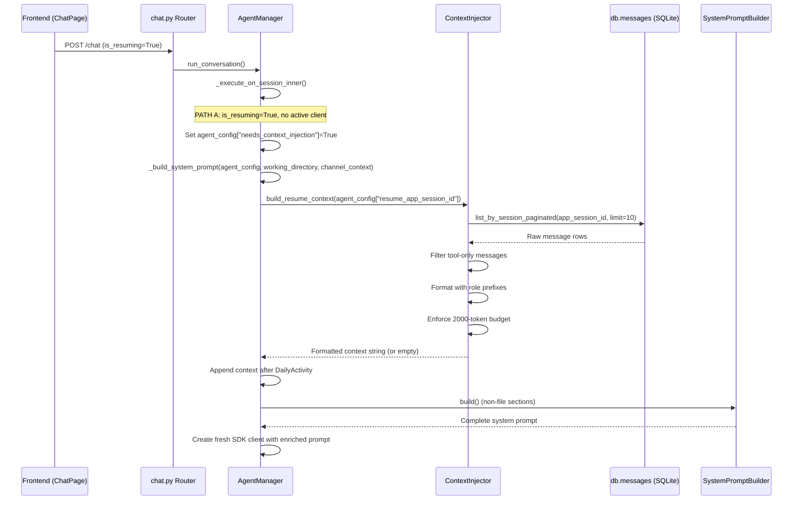

<!-- PE-REVIEWED -->
# Design Document: Graceful Resume

## Overview

When a user closes and reopens SwarmAI, then sends a message on an existing chat tab, the backend detects a resumed session with no active SDK client (PATH A in `_execute_on_session_inner`). Currently, Claude starts fresh with zero conversation memory. This feature injects the last N messages from SQLite into the system prompt as a "Previous Conversation Context" section, giving Claude awareness of what was discussed before the restart.

The design adds a single new module (`context_injector.py`) that is called from `_build_system_prompt` when a `needs_context_injection` flag is set. The module loads messages from the existing `db.messages` table, filters out tool-only turns, formats them with role prefixes, enforces a 2000-token budget using the existing `estimate_tokens` heuristic, and returns a formatted string. The string is appended to the system prompt between the DailyActivity section and the SystemPromptBuilder non-file sections.

No database schema changes are required. No new API endpoints are needed. The feature is entirely backend, contained within the system prompt assembly path.

## Architecture

### Component Interaction Flow



### Decision: Standalone Module vs. Inline Logic

The context injection logic lives in a new `backend/core/context_injector.py` module rather than being inlined into `_build_system_prompt`. Rationale:
- Testability: the formatting, filtering, and token-budgeting logic can be unit-tested and property-tested in isolation
- Separation of concerns: `_build_system_prompt` already handles context files, DailyActivity, bootstrap, and distillation flags — adding message loading would make it harder to reason about
- The module is stateless (no caching, no module-level mutable state) — it receives a session ID and returns a string

### Decision: Injection Point

The formatted context is injected after DailyActivity and before `SystemPromptBuilder.build()` non-file sections. This places it:
- After high-priority context (SWARMAI.md, SOUL.md, IDENTITY.md, MEMORY.md, AGENT.md)
- After DailyActivity (recent session summaries)
- Before runtime metadata (safety, datetime, workspace path)

This ordering ensures Claude sees the conversation recap in a natural position — after "who am I" and "what happened recently" but before ephemeral runtime info.

## Components and Interfaces

### 1. `ContextInjector` (new module: `backend/core/context_injector.py`)

A stateless module with a single public async function:

```python
async def build_resume_context(
    app_session_id: str,
    max_messages: int = 10,
    db_fetch_limit: int = 30,
    token_budget: int = 2000,
) -> str:
    """Load recent messages and format them for system prompt injection.

    Imports ``db`` from ``backend.database`` (the module-level singleton)
    to query messages.  The function is async because the DB call is async.

    Args:
        app_session_id: The stable tab-level session ID to query messages for.
        max_messages: Maximum number of human-readable messages in the final output (default 10).
        db_fetch_limit: Number of messages to fetch from DB before filtering (default 30).
            Set higher than max_messages to account for tool-only messages being filtered out.
        token_budget: Maximum estimated tokens for the formatted output (default 2000).

    Returns:
        Formatted context string with section header, preamble, and message turns.
        Returns empty string if no injectable messages exist or on any error.
    """
```

Internal helper functions (private):

```python
def _filter_tool_only_messages(messages: list[dict]) -> list[dict]:
    """Remove messages whose content blocks are exclusively tool_use or tool_result."""

def _format_message(message: dict) -> str:
    """Format a single message as 'Role: content' with placeholder handling for non-text blocks."""

def _apply_token_budget(formatted_messages: list[str], token_budget: int) -> tuple[list[str], bool]:
    """Remove oldest messages until total tokens fit within budget.
    Returns (surviving_messages, was_truncated)."""

def _assemble_context(messages: list[str], was_truncated: bool) -> str:
    """Wrap messages in section header and preamble. Add truncation note if needed."""
```

### 2. `AgentManager._execute_on_session_inner` (modified)

Changes:
- After detecting PATH A (resume without active client), set `needs_context_injection = True` and `resume_app_session_id` on the `agent_config` dict (following the existing pattern where `agent_config` carries `system_prompt`, `context_token_budget`, etc.)
- No changes to `_build_system_prompt` method signature

### 3. `AgentManager._build_system_prompt` (modified)

Changes:
- After the DailyActivity injection block, read `needs_context_injection` and `resume_app_session_id` from `agent_config` (no new method parameters — follows the existing `agent_config` dict pattern)
- If `needs_context_injection` is True and `resume_app_session_id` is not None, call `build_resume_context(resume_app_session_id)` and append the result to `context_text`
- The call is a single `if` + function call inside the existing try/except — no new error handling block needed

### 4. `AgentManager.run_skill_creator_conversation` (modified)

Changes:
- Same resume detection pattern: when `is_resuming` is True but no active client exists, set `agent_config["needs_context_injection"] = True` and `agent_config["resume_app_session_id"]`
- The system prompt assembly picks it up automatically via the same `_build_system_prompt` code path

### Token Budget Integration

The existing `EPHEMERAL_HEADROOM` calculation in `_build_system_prompt` reserves `2 * TOKEN_CAP_PER_DAILY_FILE` (4000 tokens) for DailyActivity. The resume context budget (2000 tokens) is added to this reservation:

```python
RESUME_CONTEXT_BUDGET = 2000
EPHEMERAL_HEADROOM = 2 * TOKEN_CAP_PER_DAILY_FILE + RESUME_CONTEXT_BUDGET
```

This ensures the context directory loader leaves room for both DailyActivity and resume context without exceeding the model's context window.

## Data Models

### Existing Data (No Schema Changes)

Messages are stored in `db.messages` (SQLiteMessagesTable) with this structure:

```python
{
    "id": str,           # UUID
    "session_id": str,   # App_Session_ID (stable across restarts)
    "role": str,         # "user" or "assistant"
    "content": list[dict],  # Content blocks: [{"type": "text", "text": "..."}, ...]
    "model": str | None, # Model name for assistant messages
    "created_at": str,   # ISO 8601 timestamp
    "expires_at": int,   # Unix epoch (7-day TTL)
}
```

Content blocks follow the Claude SDK format:
- `{"type": "text", "text": "..."}` — human-readable text
- `{"type": "tool_use", "id": "...", "name": "...", "input": {...}}` — tool invocation
- `{"type": "tool_result", "tool_use_id": "...", "content": "..."}` — tool output
- `{"type": "image", "source": {...}}` — image attachment
- `{"type": "document", "source": {...}}` — document attachment

### Filtering Logic

A message is "tool-only" if every content block in its `content` list has `type` in `{"tool_use", "tool_result"}`. These are filtered out because they provide no conversational context to Claude.

A message with mixed content (e.g., text + tool_use) is retained — only the text blocks are extracted during formatting.

### Formatted Output Structure

```
## Previous Conversation Context

The following is a summary of the previous conversation in this chat session. You did not experience these turns directly — they are provided for context only. Do not repeat or re-execute any actions described below.

[Earlier messages truncated to fit token budget]

User: How do I set up the database?

Assistant: You can initialize the SQLite database by running...

User: What about migrations?

Assistant: Migrations are handled automatically on startup...
```

The truncation note (`[Earlier messages truncated to fit token budget]`) only appears when messages were dropped to fit the 2000-token budget.

## Correctness Properties

*A property is a characteristic or behavior that should hold true across all valid executions of a system — essentially, a formal statement about what the system should do. Properties serve as the bridge between human-readable specifications and machine-verifiable correctness guarantees.*

### Property 1: Resume detection flag is correctly derived

*For any* combination of `is_resuming` (bool) and `has_active_client` (bool), the `needs_context_injection` flag should equal `is_resuming AND NOT has_active_client`. When `is_resuming` is False, the flag is always False. When `is_resuming` is True and an active client exists, the flag is False. Only when `is_resuming` is True and no active client exists is the flag True.

**Validates: Requirements 1.1, 1.2, 1.3**

### Property 2: Messages are loaded exclusively for the requested session

*For any* app_session_id and any database state containing messages for multiple sessions, `build_resume_context(app_session_id)` should only include content from messages whose `session_id` matches the provided `app_session_id`.

**Validates: Requirements 2.1, 6.1**

### Property 3: Output respects message count limit and chronological ordering

*For any* set of messages in the database for a given session, the number of messages in the final formatted output (after filtering out tool-only messages) is at most 10, and they appear in chronological order (each message's timestamp is ≤ the next message's timestamp). The DB fetch may load up to 30 messages to ensure enough human-readable messages survive filtering. The `list_by_session_paginated(limit=N)` method returns the N most recent messages in chronological order.

**Validates: Requirements 2.2, 2.3**

### Property 4: Tool-only messages are excluded

*For any* set of messages, after filtering, no remaining message should consist exclusively of content blocks with `type` in `{"tool_use", "tool_result"}`. Messages with at least one text, image, or document block are retained.

**Validates: Requirements 2.5**

### Property 5: Message formatting preserves content with correct role prefixes

*For any* message with role "user" or "assistant" and any combination of content blocks (text, image, document, tool_use), the formatted output starts with the correct role prefix ("User:" or "Assistant:"), contains all text block contents joined by newlines, replaces image blocks with "[image attachment]", and replaces document blocks with "[document attachment]".

**Validates: Requirements 3.1, 3.4, 3.5**

### Property 6: Non-empty output includes section header and preamble

*For any* non-empty set of formatted messages, the assembled output contains the section header `## Previous Conversation Context` and the preamble disclaimer text. For empty message sets, the output is an empty string.

**Validates: Requirements 3.2, 3.3**

### Property 7: Token budget enforcement with oldest-first truncation

*For any* set of formatted messages, the final output's estimated token count is ≤ the token budget (2000). When messages were removed to fit the budget, the removed messages are the oldest ones (earliest in chronological order), and the output contains the truncation note "[Earlier messages truncated to fit token budget]". When no truncation occurred, the note is absent.

**Validates: Requirements 4.2, 4.3**

### Property 8: No injection when flag is False

*For any* system prompt built with `needs_context_injection=False`, the output should not contain the string "## Previous Conversation Context".

**Validates: Requirements 5.2**

### Property 9: Error resilience — failures produce empty context

*For any* error during message loading (DB failure), token estimation (estimation failure), or individual message formatting (malformed content), `build_resume_context` returns an empty string without raising an exception. When a single message fails to format, the remaining messages are still included in the output.

**Validates: Requirements 8.1, 8.2, 8.3**

## Error Handling

All error handling follows the principle: **context injection failures must never block the conversation**. The user's message must always reach Claude, even if the resume context is empty.

### Error Scenarios

| Error | Location | Handling |
|-------|----------|----------|
| DB query fails (SQLite locked, table missing) | `build_resume_context` → `db.messages.list_by_session_paginated` | Log warning, return `""` |
| Token estimation fails (unexpected input) | `_apply_token_budget` → `estimate_tokens` | Log warning, return `""` |
| Single message has malformed content (missing `content` key, non-list content) | `_format_message` | Log warning, skip message, continue with remaining |
| `app_session_id` is None | `build_resume_context` entry | Return `""` immediately (no DB query) |
| All messages filtered out (all tool-only) | After `_filter_tool_only_messages` | Return `""` (no injection) |
| Token budget too small for even one message | `_apply_token_budget` | Return `""` with truncation note omitted |

### Logging Strategy

- `logger.warning()` for caught errors (DB failures, malformed messages) — these indicate something unexpected but non-fatal
- `logger.info()` for normal flow decisions (skipping injection because no messages, truncation applied)
- `logger.info()` at the `_build_system_prompt` injection call site: log whether injection happened, how many messages were included, and estimated token count (e.g., `"Resume context injected: 7 messages, ~1200 tokens"` or `"Resume context skipped: no injectable messages"`)
- `logger.debug()` for detailed formatting info (message count before/after filtering, per-message token estimates)

### Security Note

Messages are the user's own conversation, loaded from their own local SQLite database (`~/.swarm-ai/data.db`), injected into their own system prompt on the same machine. There is no cross-user or cross-session risk — Property 2 (session isolation) ensures messages are loaded exclusively by `app_session_id`. No PII leaves the local system.

### Token Estimation Accuracy

The `estimate_tokens` method uses a heuristic approximation (roughly chars/4). The 2000-token budget is therefore a soft cap, not a precise limit. This is acceptable because:
- The budget exists to prevent the resume context from crowding out higher-priority context, not to enforce an exact byte limit
- The same heuristic is used for DailyActivity capping (2000 tokens per file) and has proven reliable in practice
- Over-estimation is safe (slightly less context injected), under-estimation is bounded (at most ~10-20% overshoot)

## Testing Strategy

### Property-Based Testing

Library: **Hypothesis** (Python) — already available in the project's test dependencies.

Each correctness property maps to a single property-based test with minimum 100 iterations. Tests use Hypothesis strategies to generate:
- Random message lists with varying content block types (text, tool_use, tool_result, image, document)
- Random session IDs
- Random token budgets
- Messages with edge-case content (empty strings, very long strings, unicode, mixed blocks)

Test file: `backend/tests/test_property_context_injector.py`

Property test tag format: `# Feature: graceful-resume, Property N: <property_text>`

### Unit Tests

Test file: `backend/tests/test_context_injector.py`

Unit tests cover specific examples and integration points:
- Empty message list → empty output
- Single message with text → correctly formatted
- Message with only tool_use blocks → filtered out
- Message with mixed text + tool_use → text extracted, tool_use ignored
- Message with image block → placeholder substituted
- Exactly 10 messages → all included
- 15 messages → only last 10 considered
- Token budget exceeded → oldest messages dropped, truncation note present
- `app_session_id=None` → empty output
- DB error simulation → empty output, no exception raised

### Integration Points

The integration between `_build_system_prompt` and `build_resume_context` is tested via:
- Verifying the context appears in the correct position in the assembled prompt (after DailyActivity, before non-file sections)
- Verifying `EPHEMERAL_HEADROOM` includes the resume context budget
- Verifying the `needs_context_injection` flag is correctly set in `_execute_on_session_inner` for PATH A vs PATH B

### Test Configuration

```python
from hypothesis import given, settings, strategies as st

@settings(max_examples=100)
@given(messages=st.lists(message_strategy(), max_size=20))
def test_property_N(messages):
    ...
```
