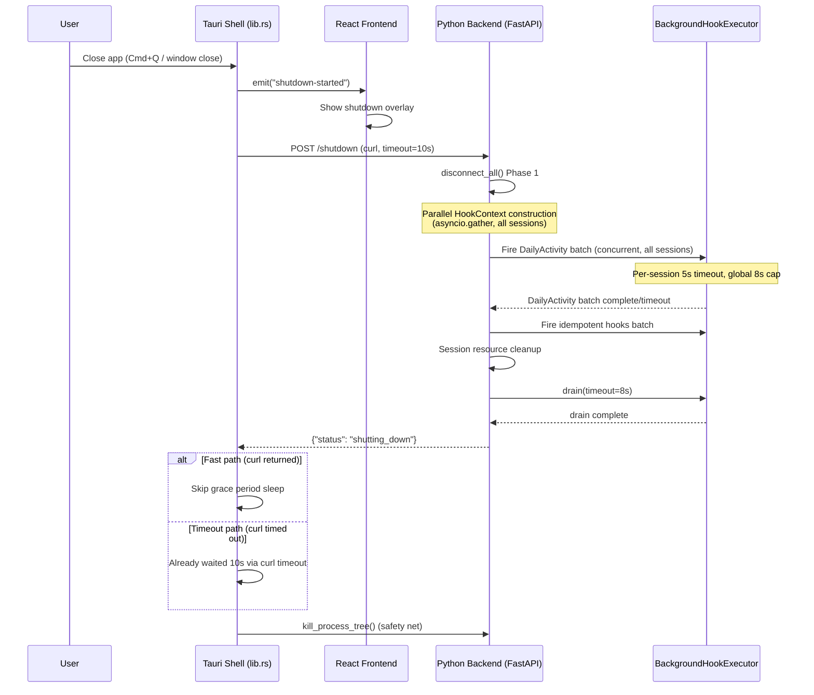

<!-- PE-REVIEWED -->
# Graceful Shutdown Fix — Design Document

## Overview

The SwarmAI desktop app has a shutdown timing budget problem. When the user closes the app, `graceful_shutdown_and_kill()` in `lib.rs` sends `POST /shutdown` to the backend, then sleeps for a hard-coded 3 seconds before force-killing the process tree. On the backend side, `disconnect_all()` fires session lifecycle hooks as background tasks, disconnects SDK clients, then calls `drain(timeout=2.0)` to give hooks best-effort completion time.

The timing math doesn't work for realistic workloads:

- **Slow curl delivery** (1–2s under load) eats into the 3s grace period, leaving `disconnect_all()` with 1–2s total.
- **Sequential HookContext construction** for 6+ sessions takes 300–600ms of DB queries before hooks even start.
- **2s drain timeout** is insufficient for 4 hooks × N sessions, especially when git operations take 2–10s.
- **DailyActivity extraction** (the only non-idempotent hook) gets cancelled when drain times out, causing permanent data loss.
- **No fast path**: Tauri always sleeps the full grace period even when the backend responds instantly.
- **No UI feedback**: The longer grace period (3s → 10s) would feel like a freeze without a progress indicator.

This design increases the Tauri grace period to 10s, the backend drain timeout to 8s, prioritizes DailyActivity extraction as a concurrent first batch, parallelizes HookContext construction, adds a shutdown overlay, and implements a fast-path that skips the sleep when curl returns successfully.

### Relationship to hook-execution-decoupling spec

The `hook-execution-decoupling` spec (already implemented) moved hooks from inline execution to `BackgroundHookExecutor` fire-and-forget tasks. This spec builds on that foundation by addressing the timing budget that constrains how much time those background tasks actually get before the process is killed.

## Architecture

The shutdown sequence spans three layers. Changes are needed in all three:



### Layer responsibilities

| Layer | File | Changes |
|-------|------|---------|
| Tauri Shell | `desktop/src-tauri/src/lib.rs` | Grace period 3→10s, `send_shutdown_request` returns bool, fast-path logic, emit `shutdown-started` event, `stop_backend` sleep 2→5s |
| Frontend | `desktop/src/components/common/ShutdownOverlay.tsx` | New overlay component listening for `shutdown-started` event |
| Backend — AgentManager | `backend/core/agent_manager.py` | Parallel HookContext build, inline DA extraction (reusing `_extract_activity_early` pattern), background idempotent hooks via executor, drain timeout 2→8s, timing logs |
| Backend — Shutdown endpoint | `backend/main.py` | Timing instrumentation around `disconnect_all()` |
| Backend — BackgroundHookExecutor | `backend/core/session_hooks.py` | No structural changes needed; drain timeout is passed by caller |

## Components and Interfaces

### 1. Tauri Shell — `graceful_shutdown_and_kill()` (lib.rs)

**Current behavior**: Sends `POST /shutdown` via `send_shutdown_request(port)`, sleeps 3s, calls `kill_process_tree(pid)`.

**New behavior**:
1. Emit `shutdown-started` Tauri event to the frontend **before entering `block_on()`**. This is critical because `block_on()` blocks the Tauri event loop — any event emitted inside `block_on()` cannot be delivered to the frontend until the block completes, defeating the purpose of the overlay.
2. Call `send_shutdown_request(port)` which now returns `bool` (success/failure).
3. **Fast path**: If `send_shutdown_request` returned `true`, skip the grace period sleep — the backend has already completed `disconnect_all()` and responded.
4. **Timeout path**: If `send_shutdown_request` returned `false` (curl timed out or failed), the 10s curl timeout has already elapsed, so no additional sleep is needed.
5. Call `kill_process_tree(pid)` as safety net (always).

**Event loop blocking limitation:** `graceful_shutdown_and_kill()` runs inside `tauri::async_runtime::block_on()`, which blocks the Tauri event loop for the duration of the shutdown request (up to 10s). The `shutdown-started` event must be emitted in the calling handler (e.g., `on_window_event` closure) BEFORE calling `graceful_shutdown_and_kill()`. The event may still not be delivered if the event loop is already congested, but this is best-effort — the overlay is a UX improvement, not a correctness requirement.

```rust
// In on_window_event closure — emit BEFORE block_on:
if let tauri::WindowEvent::Destroyed = event {
    let _ = app_handle.emit("shutdown-started", ());  // Best-effort, before block_on
    graceful_shutdown_and_kill(state.inner().clone(), "window_destroy");
}
```

**Key constants**:
```rust
/// Maximum time to wait for the backend to complete shutdown.
/// Covers: HookContext build (~1s) + DailyActivity batch (~5s) + drain (~8s).
/// The curl/PowerShell timeout is set to this value.
const SHUTDOWN_GRACE_SECONDS: u64 = 10;

/// Post-shutdown sleep for the manual stop_backend command.
/// Proportional to SHUTDOWN_GRACE_SECONDS for manual stop operations.
const STOP_BACKEND_SLEEP_SECONDS: u64 = 5;
```

### 2. `send_shutdown_request(port)` → `bool` (lib.rs)

**Current signature**: `fn send_shutdown_request(port: u16)` (returns nothing).

**New signature**: `fn send_shutdown_request(port: u16) -> bool` (returns whether the HTTP request succeeded).

**Changes**:
- Unix: Change curl `-m 3` to `-m 10` (match `SHUTDOWN_GRACE_SECONDS`).
- Windows: Change PowerShell `-TimeoutSec 3` to `-TimeoutSec 10`.
- Return `true` if the HTTP request succeeded (exit code 0 + success status), `false` otherwise.

### 3. `stop_backend` command (lib.rs)

**Current behavior**: `send_shutdown_request(port)` → sleep 2s → `kill_process_tree`.

**New behavior**: `send_shutdown_request(port)` → if returned false, sleep `STOP_BACKEND_SLEEP_SECONDS` (5s) → `kill_process_tree`. If returned true, skip sleep (fast path).

### 4. Frontend — `ShutdownOverlay` component

**New component**: `desktop/src/components/common/ShutdownOverlay.tsx`

Listens for the Tauri `shutdown-started` event. When received, renders a full-screen modal overlay with:
- "Shutting down..." text
- A subtle spinner/progress indicator
- Prevents interaction with underlying UI (pointer-events: none on content behind overlay)

Mounted in `App.tsx` so it's always available regardless of current route.

### 5. Backend — `disconnect_all()` restructured (agent_manager.py)

**Current flow** (sequential):
```
for each session:
    build HookContext (async DB queries)
    fire all hooks as background task
    cleanup session resources
drain(timeout=2.0)
```

**New flow** (parallel HookContext, inline DA extraction, background idempotent hooks):

**Important architectural note:** `BackgroundHookExecutor.fire()` creates a single `asyncio.Task` that runs `_run_all_safe()`, executing hooks sequentially within that task. There is no mechanism to await a subset of fired tasks. Therefore, DailyActivity extraction runs **inline** (directly awaited in `disconnect_all()`), not via the executor. This preserves the executor model for idempotent hooks while giving DA extraction priority treatment.

This pattern mirrors the existing `_extract_activity_early()` method, which already runs DA extraction outside the executor for idle sessions. The shutdown path reuses the same approach.

```
Phase 0: Log shutdown metrics (session count, activity_extracted counts, pending hooks)

Phase 1a: Build all HookContexts in parallel
    contexts = await asyncio.gather(*[_build_hook_context(sid, info) for sid, info in sessions],
                                     return_exceptions=True)
    (skip failed builds, log errors)

Phase 1b: DailyActivity extraction — inline, concurrent across sessions
    Find the DA hook by name (same pattern as _extract_activity_early)
    For each session where activity not already extracted:
        Create asyncio.wait_for(da_hook.execute(ctx), timeout=5.0) task
    Run all DA tasks concurrently via asyncio.gather with global 8s timeout:
        await asyncio.wait_for(
            asyncio.gather(*da_tasks, return_exceptions=True),
            timeout=8.0
        )
    Set activity_extracted=True for completed sessions
    Log warnings for timed-out/failed sessions

Phase 1c: Fire remaining idempotent hooks via executor (fire-and-forget)
    For each session:
        self._hook_executor.fire(context, skip_hooks=["daily_activity_extraction"])

Phase 1d: Session resource cleanup (all sessions)
    IMPORTANT: Cleanup happens AFTER DA extraction completes, not during.
    _cleanup_session() pops sessions from _active_sessions and disconnects
    SDK clients. If called during DA extraction, session info would be gone.
    for each session:
        cleanup_session(session_id, skip_hooks=True)

Phase 2: Drain background hooks (idempotent only)
    drain(timeout=8.0)
    Log completed/cancelled counts
    NOTE: With many sessions, most idempotent hooks WILL be cancelled
    during drain. This is acceptable because they are all idempotent —
    auto-commit, distillation, and evolution will naturally retry on
    next session close or app restart.
```

### 6. Backend — Shutdown endpoint timing (main.py)

**Current**: Calls `disconnect_all()` and returns.

**New**: Wraps `disconnect_all()` with `time.monotonic()` instrumentation, logs total elapsed time before returning response.

## Data Models

### No new data models

This design does not introduce new database tables, Pydantic models, or persistent data structures. All changes are to control flow and timing parameters.

### Modified constants/parameters

| Parameter | Location | Old Value | New Value | Rationale |
|-----------|----------|-----------|-----------|-----------|
| Grace period (curl timeout) | `lib.rs` `send_shutdown_request` | 3s | 10s | Match `SHUTDOWN_GRACE_SECONDS` |
| Grace period (sleep) | `lib.rs` `graceful_shutdown_and_kill` | 3s | Eliminated (fast-path or curl timeout covers it) | Fast path skips sleep; timeout path already waited 10s |
| `stop_backend` sleep | `lib.rs` `stop_backend` | 2s | 5s (only on timeout path) | Proportional to new grace period |
| Drain timeout | `agent_manager.py` `disconnect_all` | 2.0s | 8.0s | Realistic time for 4 hooks × N sessions |
| Per-session DA timeout | `agent_manager.py` `disconnect_all` | N/A (new) | 5.0s | Bound individual slow extractions |
| Global DA phase timeout | `agent_manager.py` `disconnect_all` | N/A (new) | 8.0s | Bound total DA phase for many sessions |

### Tauri event payload

New event emitted by Tauri to the frontend:

```typescript
// Event name: "shutdown-started"
// Payload: none (empty)
// Direction: Tauri → Frontend (via app_handle.emit)
```

### Timing budget breakdown

```
Total Tauri grace period: 10s (curl timeout)
├── curl delivery overhead: 0–1s
├── disconnect_all():
│   ├── Phase 1a: Parallel HookContext build: ~0.5s (was 0.3–0.6s sequential)
│   ├── Phase 1b: DailyActivity batch: 1–5s (per-session 5s cap, global 8s cap)
│   ├── Phase 1c: Fire idempotent hooks: ~0ms (fire-and-forget)
│   ├── Phase 1d: Session resource cleanup: ~0.1s
│   └── Phase 2: Drain: up to 8s (idempotent hooks complete here)
└── Response sent → curl returns → Tauri proceeds to kill
```

In the common case (1–3 sessions, no slow git ops), the backend responds in 2–4s and Tauri takes the fast path. The 10s timeout is the worst-case safety net.

**Note on drain with many sessions:** With 6+ sessions, the idempotent hooks (WorkspaceAutoCommit 2–10s, Distillation 1–5s, Evolution 1–3s) run sequentially within each session's `_run_all_safe` task. The 8s drain timeout means most idempotent hooks for later sessions WILL be cancelled. This is acceptable because all three are idempotent — they will naturally complete on next session close or app restart. The drain timeout is a best-effort window, not a guarantee.

## Correctness Properties

*A property is a characteristic or behavior that should hold true across all valid executions of a system — essentially, a formal statement about what the system should do. Properties serve as the bridge between human-readable specifications and machine-verifiable correctness guarantees.*

### Property 1: Kill always called as safety net

*For any* shutdown execution of `graceful_shutdown_and_kill()`, regardless of whether `send_shutdown_request` succeeded, failed, or timed out, `kill_process_tree(pid)` SHALL be called when a pid was captured from the backend state. The force-kill is unconditional — it is the last line of defense against orphaned processes.

**Validates: Requirements 1.3, 6.5, 8.6**

### Property 2: Fast path skips grace period sleep

*For any* shutdown execution where `send_shutdown_request(port)` returns `true` (HTTP request succeeded), `graceful_shutdown_and_kill()` SHALL NOT sleep for the grace period before calling `kill_process_tree`. The backend has already completed `disconnect_all()` and responded, so additional waiting is unnecessary.

**Validates: Requirements 5.5, 6.1, 9.3**

### Property 3: DailyActivity-first inline execution ordering

*For any* call to `disconnect_all()` with N active sessions (N ≥ 1), all DailyActivity extractions SHALL complete (or be timed out) before any `fire()` call is made for idempotent hooks. The DA extractions SHALL run concurrently across sessions via `asyncio.gather()`, directly awaited in `disconnect_all()` (not via the BackgroundHookExecutor). This ensures the non-idempotent hook gets maximum execution time before the process is killed.

**Validates: Requirements 3.1, 3.2, 3.3**

### Property 4: Per-session DailyActivity extraction timeout

*For any* session whose DailyActivity extraction takes longer than 5 seconds during the shutdown DailyActivity batch, the extraction SHALL be cancelled (via `asyncio.wait_for` or equivalent), and a warning SHALL be logged with the session ID and elapsed time.

**Validates: Requirements 3.4, 3.6**

### Property 5: Global DailyActivity phase timeout

*For any* call to `disconnect_all()` with any number of active sessions, the total wall-clock time spent in the DailyActivity extraction phase SHALL NOT exceed 8 seconds. If the global timeout is reached, remaining extractions SHALL be cancelled and the shutdown SHALL proceed to the idempotent hooks phase.

**Validates: Requirements 3.5**

### Property 6: Parallel HookContext construction

*For any* call to `disconnect_all()` with N active sessions (N ≥ 2), HookContext construction for all sessions SHALL be initiated concurrently (via `asyncio.gather` or equivalent), not sequentially. The total HookContext build time SHALL be bounded by the slowest individual build, not the sum of all builds.

**Validates: Requirements 4.1**

### Property 7: HookContext build error isolation

*For any* call to `disconnect_all()` where HookContext construction fails for session S_i (DB query error), the failure SHALL NOT prevent HookContext construction or hook firing for any other session S_j (j ≠ i). The failed session's hooks SHALL be skipped, and an error SHALL be logged.

**Validates: Requirements 4.2**

### Property 8: Drain completes early when all tasks finish

*For any* call to `drain(timeout=T)` where all pending hook tasks complete in time D < T, `drain()` SHALL return in approximately D seconds (not T seconds). The drain timeout is a ceiling, not a fixed sleep.

**Validates: Requirements 2.3, 6.3**

### Property 9: Skip-if-extracted preservation

*For any* session where `activity_extracted` is `True` at shutdown time, `disconnect_all()` SHALL pass `skip_hooks=["daily_activity_extraction"]` when firing that session's idempotent hooks, AND SHALL exclude that session from the DailyActivity extraction batch. The existing skip-if-extracted semantics are preserved.

**Validates: Requirements 8.2**

### Property 10: Session resource cleanup after DA extraction and before drain

*For any* call to `disconnect_all()`, all session resource cleanup (SDK disconnect, permission queue removal, lock cleanup via `_cleanup_session(skip_hooks=True)`) SHALL complete after DailyActivity extraction (Phase 1b) finishes and before `drain()` is called. This ordering is critical: `_cleanup_session()` pops sessions from `_active_sessions`, so calling it during DA extraction would remove session info that hooks may need. No session resources SHALL be held while waiting for idempotent hooks to complete in drain.

**Validates: Requirements 8.3**

### Property 11: Double-fire safety

*For any* app close sequence where multiple handlers fire in succession (e.g., `WindowEvent::Destroyed` followed by `RunEvent::Exit`), only the first handler to acquire the lock and observe `backend.running == true` SHALL perform the shutdown request. Subsequent handlers SHALL observe `backend.running == false` and skip the shutdown request, proceeding directly to force-kill.

**Validates: Requirements 8.5**

## Error Handling

### Tauri Shell (lib.rs)

| Error Condition | Handling |
|----------------|----------|
| `send_shutdown_request` curl/PowerShell fails to execute | Return `false`, log error. `graceful_shutdown_and_kill` takes timeout path (curl timeout already elapsed). |
| `send_shutdown_request` HTTP request times out (10s) | Return `false`. The 10s has already elapsed, so no additional sleep needed. Proceed to `kill_process_tree`. |
| `send_shutdown_request` HTTP request returns non-200 | Return `false`. Backend may be in a bad state. Proceed to `kill_process_tree`. |
| Backend already dead when close event fires | `was_running` is `false` → skip shutdown request and sleep. `pid` is `None` → skip `kill_process_tree`. Clean exit. |
| Double-fire (multiple close events) | Second handler sees `backend.running == false` (set by first handler under lock). Skips shutdown request. Still calls `kill_process_tree` if pid was captured (idempotent). |
| Tauri event emit fails | Non-fatal. Shutdown overlay won't appear, but shutdown proceeds normally. Log warning. |

### Backend — disconnect_all() (agent_manager.py)

| Error Condition | Handling |
|----------------|----------|
| `_build_hook_context` fails for one session | Log error, exclude that session from hook firing. Other sessions proceed normally (Property 7). |
| `_build_hook_context` fails for ALL sessions | Log error, skip hook firing entirely. Proceed to session resource cleanup and drain (drain will have nothing to wait for). |
| DailyActivity extraction times out (per-session 5s) | Cancel that session's extraction task. Log warning with session ID and elapsed time. Other sessions' extractions continue. |
| DailyActivity phase times out (global 8s) | Cancel all remaining DA extraction tasks. Log warning. Proceed to idempotent hooks phase. |
| Session resource cleanup fails for one session | Log error, continue with remaining sessions. Don't let one failed cleanup block others. |
| `drain()` times out | Cancel remaining tasks (existing behavior). Log completed/cancelled counts. Return normally — process will be killed by Tauri shortly. |
| Hook executor is None | Skip hook firing entirely. Proceed with session resource cleanup only. Log warning. |

### Frontend — ShutdownOverlay

| Error Condition | Handling |
|----------------|----------|
| `shutdown-started` event never received | Overlay never shows. App closes normally (just without the visual indicator). No functional impact. |
| Event listener setup fails | Non-fatal. Overlay won't appear. Shutdown proceeds normally. |

## Testing Strategy

### Dual Testing Approach

This design uses both unit tests (specific examples, edge cases) and property-based tests (universal properties across generated inputs). The backend changes (Python) are the primary target for automated testing. The Rust/Tauri changes are validated through code review and manual integration testing due to the difficulty of mocking OS-level process management in a PBT framework.

### Property-Based Testing Configuration

- **Library**: `hypothesis` (Python) for backend property tests
- **Minimum iterations**: 100 per property test
- **Tag format**: `Feature: graceful-shutdown-fix, Property {number}: {property_text}`
- Each correctness property is implemented by a single property-based test

### Property Tests (Backend — Python/Hypothesis)

**Property 3: DailyActivity-first inline execution ordering**
- Feature: graceful-shutdown-fix, Property 3: DailyActivity-first inline execution ordering
- Generate random sets of sessions (1–20) with random `activity_extracted` flags. Mock `_build_hook_context` and hook executor. Call `disconnect_all()`. Assert that all DA `asyncio.gather` tasks complete (or time out) before any `fire()` calls are made for idempotent hooks. Verify DA extraction runs directly (not via executor).

**Property 4: Per-session DailyActivity extraction timeout**
- Feature: graceful-shutdown-fix, Property 4: Per-session DailyActivity extraction timeout
- Generate random extraction durations (0.01s–10s). For any duration > 5s, assert the task is cancelled within 5s + tolerance.

**Property 5: Global DailyActivity phase timeout**
- Feature: graceful-shutdown-fix, Property 5: Global DailyActivity phase timeout
- Generate random session counts (1–20) and per-session extraction durations. Assert total DA phase wall-clock time ≤ 8s + tolerance regardless of input.

**Property 6: Parallel HookContext construction**
- Feature: graceful-shutdown-fix, Property 6: Parallel HookContext construction
- Generate random session counts (2–20) with random per-build delays. Assert total build time ≈ max(individual delays), not sum(individual delays).

**Property 7: HookContext build error isolation**
- Feature: graceful-shutdown-fix, Property 7: HookContext build error isolation
- Generate random sets of sessions where a random subset fail HookContext build. Assert that non-failing sessions still get their hooks fired.

**Property 8: Drain completes early when all tasks finish**
- Feature: graceful-shutdown-fix, Property 8: Drain completes early when tasks finish
- Generate random task counts (1–20) with random completion times all < timeout. Assert drain returns in ≈ max(completion times), not the full timeout.

**Property 9: Skip-if-extracted preservation**
- Feature: graceful-shutdown-fix, Property 9: Skip-if-extracted preservation
- Generate random sets of sessions with random `activity_extracted` flags. Assert that sessions with `activity_extracted=True` are excluded from the DA batch and have `skip_hooks=["daily_activity_extraction"]` passed to `fire()`.

**Property 10: Session resource cleanup before drain**
- Feature: graceful-shutdown-fix, Property 10: Session resource cleanup before drain
- Generate random session counts. Mock cleanup and drain. Assert all `_cleanup_session` calls complete before `drain()` is invoked.

### Unit Tests (Backend — Python/pytest)

- **Zero sessions edge case** (Req 6.2): Call `disconnect_all()` with empty `_active_sessions`. Assert it returns immediately without calling `drain()`.
- **Drain timeout value**: Assert `drain()` is called with `timeout=8.0`.
- **Shutdown endpoint timing log**: Call `POST /shutdown`, assert log contains elapsed time.
- **Phase 1 timing log**: Assert log contains Phase 1 elapsed time after `disconnect_all()`.
- **DA cancellation logging** (Req 3.6): Mock a slow DA extraction, assert warning log contains session ID and elapsed time.

### Unit Tests (Frontend — vitest)

- **ShutdownOverlay renders on event**: Emit `shutdown-started` event, assert overlay is visible with "Shutting down..." text.
- **ShutdownOverlay blocks interaction**: Assert overlay has appropriate CSS (pointer-events, z-index) to prevent interaction.
- **ShutdownOverlay not visible by default**: Assert overlay is hidden when no event has been emitted.

### Integration Tests (Manual)

- Close app with 0 active sessions → verify fast shutdown (<1s perceived).
- Close app with 1 active session → verify DA extraction completes, shutdown overlay appears.
- Close app with 6+ active sessions → verify DA extractions run concurrently, shutdown completes within 10s.
- Close app when backend is under load (slow curl) → verify timeout path works, process is killed after 10s.
- Use `stop_backend` from UI → verify it still works with new 5s timeout.
- Verify shutdown overlay appears on macOS, Linux, and Windows.
- Verify double-fire safety: close window then Cmd+Q rapidly → no crash, no double shutdown request.

### Code Review Verification (Rust/Tauri)

Properties 1, 2, and 11 are validated through code review of the Rust changes:
- **Property 1**: Verify `kill_process_tree` is called unconditionally after the shutdown request path.
- **Property 2**: Verify that when `send_shutdown_request` returns `true`, no `thread::sleep` occurs.
- **Property 11**: Verify the `was_running` guard prevents double shutdown requests.
- Verify `SHUTDOWN_GRACE_SECONDS` constant is used consistently.
- Verify `send_shutdown_request` returns `bool` on both Unix and Windows implementations.
- Verify curl `-m 10` and PowerShell `-TimeoutSec 10` match the constant.

