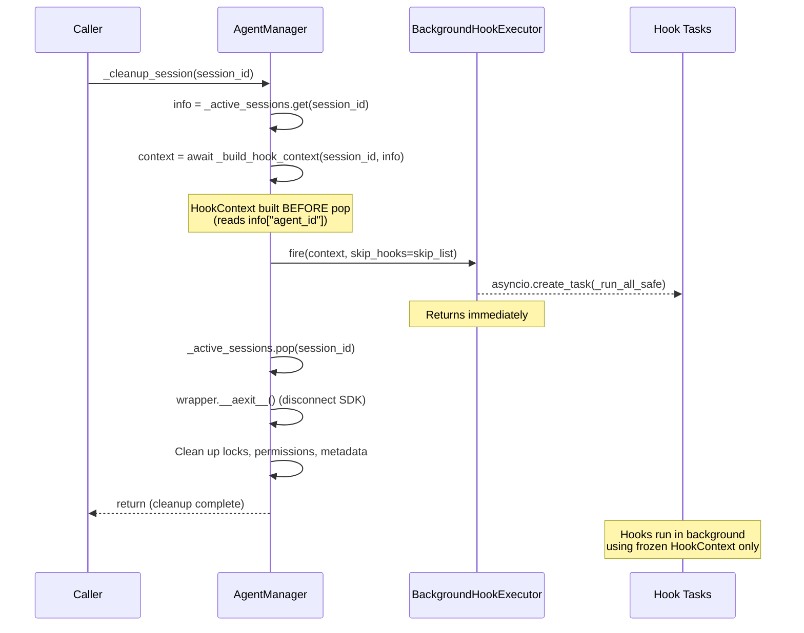
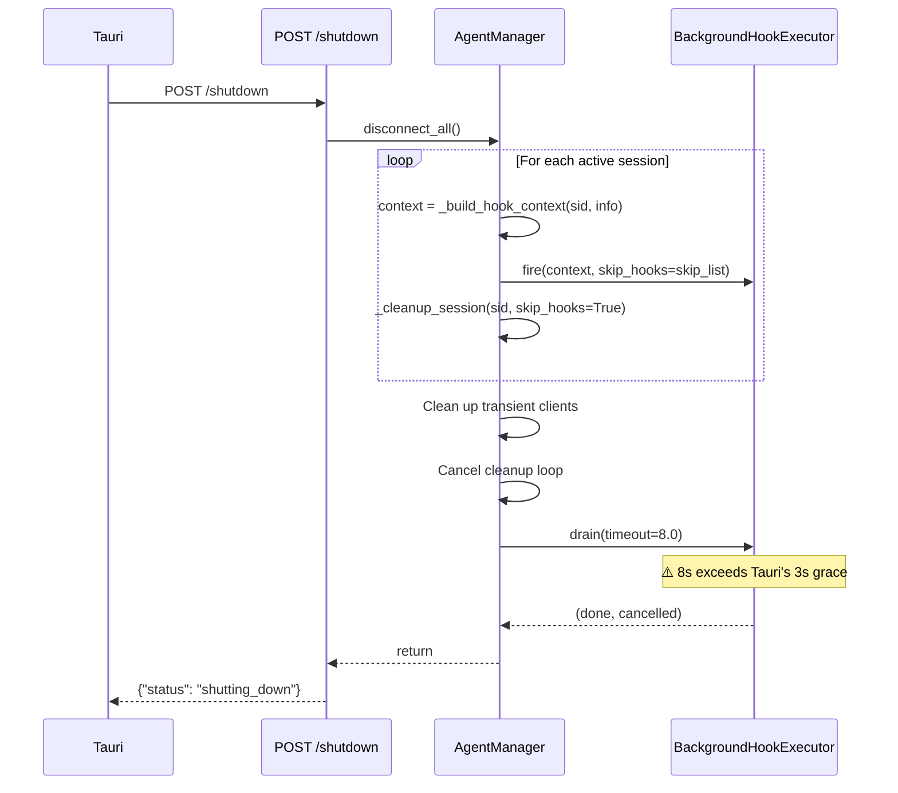
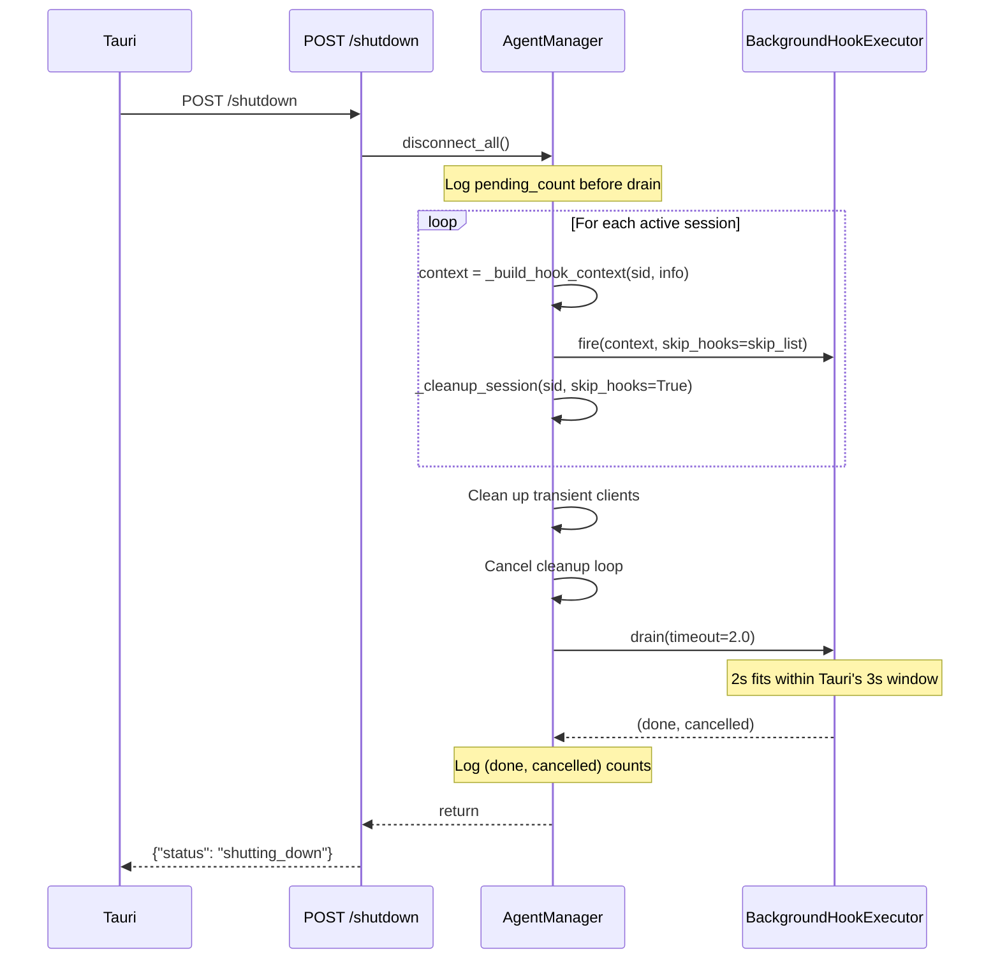

# Design Document: Hook Execution Decoupling

## Overview

This feature completes the decoupling of session lifecycle hooks from the critical shutdown and session cleanup paths. The `BackgroundHookExecutor` infrastructure already exists in `session_hooks.py` and is partially wired — `_cleanup_session()` and `_extract_activity_early()` already use it, and `main.py` already instantiates it and passes `git_lock` to `WorkspaceAutoCommitHook`.

The remaining work focuses on:

1. **Verifying `disconnect_all()` migration** — The current implementation already fires hooks as background tasks and calls `drain()`, but needs validation against the 3-second Tauri deadline (currently uses 8s drain timeout, which exceeds the budget).
2. **Adding observability** — Exposing `pending_count` in `/health`, logging drain counts in `disconnect_all()`.
3. **Hardening race condition safeguards** — Ensuring `activity_extracted` flag semantics are correct, HookContext is always built before session pop, and `CancelledError` handling is graceful.
4. **Adjusting drain timeout** — The current 8s `drain()` timeout in `disconnect_all()` exceeds Tauri's 3s grace period. The shutdown endpoint must return within ~2s, leaving drain as best-effort.

### What Already Works (No Changes Needed)

| Component | Status |
|-----------|--------|
| `BackgroundHookExecutor` class | ✅ Fully implemented in `session_hooks.py` |
| `fire()`, `fire_single()`, `drain()` | ✅ Working |
| `git_lock` property | ✅ Exposed, passed to `WorkspaceAutoCommitHook` |
| `_cleanup_session()` background hooks | ✅ Uses `_hook_executor.fire()` |
| `_extract_activity_early()` background hooks | ✅ Uses `_hook_executor.fire_single()` |
| `disconnect_all()` background hooks | ✅ Fires hooks then calls `_cleanup_session(skip_hooks=True)` |
| Hook registration order in `main.py` | ✅ Correct (DA → AutoCommit → Distillation → Evolution) |
| `set_hook_executor()` injection | ✅ Called in `main.py` lifespan |

### What Needs Changes

| Component | Change |
|-----------|--------|
| `disconnect_all()` | Reduce drain timeout from 8s → 2s to fit Tauri's 3s window |
| `disconnect_all()` | Add logging of pending count before drain, and (done, cancelled) after |
| `/health` endpoint | Add `pending_hook_tasks` field from `hook_executor.pending_count` |
| `/shutdown` endpoint | Add pending task count logging |
| `BackgroundHookExecutor._run_all_safe()` | Add total duration logging on completion |
| `BackgroundHookExecutor._run_all_safe()` | Handle `CancelledError` gracefully (log as info, not error) |
| `BackgroundHookExecutor.drain()` | Handle `CancelledError` in drain's wait |


## Architecture

The architecture follows the existing pattern: `BackgroundHookExecutor` wraps `SessionLifecycleHookManager` and spawns hook execution as fire-and-forget `asyncio.Task`s. The critical change is ensuring all callers (`_cleanup_session`, `disconnect_all`, `_extract_activity_early`) use the executor consistently, and that the shutdown path respects Tauri's timing constraints.

```
┌─────────────────────────────────────────────────────────────┐
│                      AgentManager                           │
│                                                             │
│  _cleanup_session()  ──┐                                    │
│  disconnect_all()    ──┼──► BackgroundHookExecutor.fire()    │
│  _extract_activity() ──┘    BackgroundHookExecutor.fire_single()
│                                      │                      │
│                                      ▼                      │
│                              asyncio.Task pool              │
│                              (_pending set)                 │
│                                      │                      │
│                                      ▼                      │
│                         SessionLifecycleHookManager         │
│                         (sequential, error-isolated)        │
│                                      │                      │
│                    ┌─────────────────┼─────────────────┐    │
│                    ▼                 ▼                  ▼    │
│              DailyActivity    AutoCommit(git_lock)  Distill │
│              Extraction       WorkspaceAutoCommit   Trigger │
│                                                    Evolution│
└─────────────────────────────────────────────────────────────┘
```

### Key Design Decision: Drain Timeout

The Tauri sidecar has a 3-second grace period before force-kill. The shutdown flow is:

1. `POST /shutdown` called by Tauri
2. `disconnect_all()` fires background hooks + cleans up resources (~100ms)
3. `drain(timeout=2.0)` gives hooks best-effort completion time
4. Response returned to Tauri

The drain timeout is reduced from the current 8s to 2s. This is a deliberate trade-off: hooks that don't finish in 2s are cancelled. The 2s budget leaves ~1s for HTTP response overhead and process teardown.

**Timing budget analysis** (PE Review Finding #3): For N active sessions, the pre-drain phase runs N × (`_build_hook_context` async DB queries + `_cleanup_session` SDK disconnect), each ~200ms. With 3 sessions that's ~600ms before drain starts. Total: 600ms + 2000ms drain = 2.6s, within the 3s window but tight. In practice users rarely have >2 active sessions, and Tauri's force-kill is a safety net, not a failure mode. If >3 sessions are common in the future, consider wrapping the entire `disconnect_all()` in a total timeout.

**Idempotency caveat** (PE Review Finding #4): 3 of 4 hooks are effectively idempotent on cancellation:
- `WorkspaceAutoCommitHook`: Uncommitted changes picked up by next session's auto-commit.
- `DistillationTriggerHook`: Threshold check re-runs on next session close.
- `EvolutionMaintenanceHook`: Stale entry check re-runs on next session close.

However, `DailyActivityExtractionHook` is NOT idempotent — a cancelled extraction means that session's conversation summary is permanently lost. The mitigation is that DA extraction is fast (~1s) and runs FIRST in registration order, so it completes before the drain timeout affects later hooks. The design does NOT claim all hooks retry on next launch.

### Key Design Decision: No New Locking Mechanisms

All existing file locking is preserved as-is:
- MEMORY.md: `locked_read_modify_write()` via `fcntl.flock` (from `scripts/locked_write.py`)
- EVOLUTION.md: `locked_field_modify()` + manual `fcntl.flock`
- DailyActivity: OS `O_APPEND` (no lock needed)
- Git: `asyncio.Lock` (`git_lock`) + `.git/index.lock` (managed by git)

No new locking mechanisms are introduced. The decoupling does not change the concurrency model for file access.


## Sequence Diagrams

### Session Cleanup Flow (Current — Already Decoupled)

`_cleanup_session()` already uses `BackgroundHookExecutor.fire()`. No changes needed to this flow.



### Shutdown Flow (Before — Current Code)



### Shutdown Flow (After — With Fixes)



### Idle Loop Activity Extraction Flow (Current — Already Decoupled)

```mermaid
sequenceDiagram
    participant Loop as _cleanup_stale_sessions_loop
    participant AM as AgentManager
    participant BHE as BackgroundHookExecutor

    Loop->>Loop: await asyncio.sleep(60)
    Loop->>AM: Check idle sessions

    alt Session idle > 30min, not extracted
        AM->>AM: info["activity_extracted"] = True
        AM->>AM: context = _build_hook_context(sid, info)
        AM->>BHE: fire_single(extraction_hook, context)
        Note over BHE: Returns immediately
        Note over Loop: Loop continues to next session
    end

    alt Session idle > 12h
        AM->>AM: _cleanup_session(sid)
        Note over AM: Full cleanup with background hooks
    end
```


## Components and Interfaces

### 1. `backend/core/session_hooks.py` — BackgroundHookExecutor Changes

The `BackgroundHookExecutor` class is already fully functional. Two targeted changes:

#### 1a. `_run_all_safe()` — Add duration logging and CancelledError handling

Current behavior: Logs per-hook completion but not total task duration. Does not handle `CancelledError` distinctly from other exceptions.

**PE Review Finding #1 (HIGH)**: Since Python 3.9, `asyncio.CancelledError` inherits from `BaseException`, NOT `Exception`. The current `except Exception` clause does NOT catch it. When `drain()` cancels a task, `CancelledError` propagates correctly (task stops), but there is NO logging of which hook was active at cancellation. The fix adds explicit `CancelledError` handling for observability — the cancellation behavior itself is already correct.

Change:
```python
async def _run_all_safe(self, context, skip_hooks=None):
    skip_set = set(skip_hooks) if skip_hooks else set()
    t0 = time.monotonic()
    completed = 0
    try:
        for hook in self._hook_manager._hooks:
            if hook.name in skip_set:
                continue
            try:
                await asyncio.wait_for(
                    hook.execute(context),
                    timeout=self._hook_manager._timeout,
                )
                completed += 1
                logger.info(...)
            except asyncio.TimeoutError:
                logger.error(...)
            except asyncio.CancelledError:
                logger.info(
                    "Background hook '%s' cancelled for session %s (shutdown)",
                    hook.name, context.session_id,
                )
                raise  # Re-raise to let task cancellation propagate
            except Exception as exc:
                logger.error(...)
    except asyncio.CancelledError:
        elapsed = time.monotonic() - t0
        logger.info(
            "Hook task cancelled for session %s after %.1fs (%d hooks completed)",
            context.session_id, elapsed, completed,
        )
        return
    elapsed = time.monotonic() - t0
    logger.info(
        "All hooks completed for session %s in %.1fs (%d hooks)",
        context.session_id, elapsed, completed,
    )
```

**Satisfies: Req 6.3 (CancelledError handling), Req 7.1 (duration logging), Req 7.2 (cancellation logging)**

#### 1b. `_run_single_safe()` — Add CancelledError handling

Same pattern: catch `CancelledError` at the outer level, log as info, re-raise.

**Satisfies: Req 6.3**

### 2. `backend/core/agent_manager.py` — AgentManager Changes

#### 2a. `disconnect_all()` — Reduce drain timeout and add observability logging

Change the `drain()` call from `timeout=8.0` to `timeout=2.0`. Add logging before and after drain.

```python
async def disconnect_all(self):
    # Phase 1: Fire hooks + cleanup (unchanged)
    for session_id in list(self._active_sessions.keys()):
        info = self._active_sessions.get(session_id)
        if info and self._hook_executor:
            try:
                context = await self._build_hook_context(session_id, info)
                skip_list = (
                    ["daily_activity_extraction"]
                    if info.get("activity_extracted")
                    else None
                )
                self._hook_executor.fire(context, skip_hooks=skip_list)
            except Exception as exc:
                logger.error("Shutdown hook fire failed for %s: %s", session_id, exc)
        await self._cleanup_session(session_id, skip_hooks=True)

    # Clean up transient clients (unchanged)
    for session_id, client in list(self._clients.items()):
        try:
            await client.interrupt()
        except Exception as e:
            logger.error(...)
    self._clients.clear()

    # Cancel cleanup loop (unchanged)
    if self._cleanup_task and not self._cleanup_task.done():
        self._cleanup_task.cancel()

    # Phase 2: Drain with observability (CHANGED)
    if self._hook_executor:
        pending = self._hook_executor.pending_count
        logger.info("Shutdown: %d hook tasks in flight before drain", pending)
        done, cancelled = await self._hook_executor.drain(timeout=2.0)
        logger.info(
            "Shutdown drain complete: %d done, %d cancelled", done, cancelled
        )
        if cancelled:
            logger.warning(
                "Shutdown: %d hook tasks cancelled (DA extraction may be lost if incomplete)",
                cancelled,
            )
```

**Satisfies: Req 3.3 (bounded drain), Req 3.4 (2s resource cleanup), Req 3.5 (cancel on timeout), Req 7.4 (drain logging)**

#### 2b. No changes to `_cleanup_session()` or `_extract_activity_early()`

Both methods already correctly:
- Build HookContext before `_active_sessions.pop()` (Req 2.1, 9a.2)
- Use `_hook_executor.fire()` / `fire_single()` (Req 2.3, 4.1)
- Handle `_build_hook_context()` failures with try/except (Req 2.5, 9a.3)
- Set `activity_extracted = True` before spawning (Req 9d.10)
- Pass `skip_hooks=["daily_activity_extraction"]` when extracted (Req 8.2)

**PE Review Finding #2 (HIGH) — `activity_extracted` flag reset clarification**: The `_extract_activity_early()` method has TWO code paths with different flag reset behavior:
- **Background path** (executor exists): `fire_single()` is called, flag stays True on background failure (correct per Req 9d.11). The `except Exception` block at line 473 only catches `_build_hook_context()` failures (before `fire_single` is called), so resetting the flag is correct — we never initiated extraction.
- **Inline fallback path** (no executor): The flag resets on failure because we know synchronously that extraction failed, allowing retry on next cycle.

This dual behavior is correct and intentional. Req 9d.11 ("SHALL NOT reset to False on background failure") applies only to the background path, which is already satisfied. No code change needed — just this clarification.

### 3. `backend/main.py` — Endpoint Changes

#### 3a. `/health` endpoint — Add pending hook task count

```python
@app.get("/health")
async def health_check():
    if not _startup_complete:
        return {
            "status": "initializing",
            "version": settings.app_version,
            "sdk": "claude-agent-sdk",
        }
    
    # PE Review Finding #5: Use property directly, not hasattr
    pending_hooks = (
        agent_manager.hook_executor.pending_count
        if agent_manager.hook_executor
        else 0
    )

    return {
        "status": "healthy",
        "version": settings.app_version,
        "sdk": "claude-agent-sdk",
        "pending_hook_tasks": pending_hooks,
    }
```

**Satisfies: Req 7.3 (pending count in /health)**

#### 3b. No changes to startup wiring

The `lifespan()` function already:
- Creates `BackgroundHookExecutor(hook_manager)` (Req 1.1)
- Passes `hook_executor.git_lock` to `WorkspaceAutoCommitHook` (Req 1.2, 1.3)
- Calls `agent_manager.set_hook_executor(hook_executor)` (Req 1.1)
- Registers hooks in correct order (Req 8.1)

### 4. `backend/hooks/auto_commit_hook.py` — No Changes Needed

The hook already:
- Accepts `git_lock` in constructor (Req 9c.7)
- Uses `async with self._git_lock` in `execute()` (Req 9c.7)
- Calls `_cleanup_stale_git_lock()` before commit (Req 9c.9)
- Has 10s subprocess timeout for lock contention (Req 9c.8)


## Data Models

No new data models are introduced. The existing `HookContext` frozen dataclass remains the sole carrier of session metadata for background hook tasks:

```python
@dataclass(frozen=True)
class HookContext:
    session_id: str
    agent_id: str
    message_count: int
    session_start_time: str  # ISO 8601
    session_title: str
```

The `BackgroundHookExecutor` internal state:
- `_pending: set[asyncio.Task]` — in-flight hook tasks, auto-cleaned via `add_done_callback`
- `_git_lock: asyncio.Lock` — shared across all hook tasks for git serialization
- `_hook_manager: SessionLifecycleHookManager` — reference to the hook registry

No new fields are added to `_active_sessions` dict entries. The existing `activity_extracted: bool` flag semantics are preserved unchanged.

## Race Condition Analysis

### Race 1: HookContext built after session pop

**Risk**: `_build_hook_context()` reads `info.get("agent_id")` from the `_active_sessions` dict. If the session is popped before context is built, `agent_id` would be empty.

**Mitigation (already in place)**: Both `_cleanup_session()` and `disconnect_all()` call `_build_hook_context()` BEFORE `_active_sessions.pop()`. The code flow is:
1. `info = self._active_sessions.get(session_id)` 
2. `context = await self._build_hook_context(session_id, info)`
3. `self._hook_executor.fire(context, ...)`
4. `info = self._active_sessions.pop(session_id, None)` (in `_cleanup_session`)

**Satisfies: Req 2.1, 9a.2**

### Race 2: Background task references cleaned-up session state

**Risk**: A background hook task could reference `_active_sessions`, `_clients`, or `_session_locks` after they've been cleaned up.

**Mitigation (already in place)**: Background tasks receive only the frozen `HookContext` dataclass. The `_run_all_safe()` method iterates `self._hook_manager._hooks` (a list that doesn't change after startup) and passes `context` to each hook. No hook accesses `_active_sessions` or any per-session mutable state.

**Satisfies: Req 2.4, 9a.1**

### Race 3: Concurrent git operations from multiple session hooks

**Risk**: Two sessions closing simultaneously could both run `WorkspaceAutoCommitHook`, causing `.git/index.lock` contention.

**Mitigation (already in place)**: `WorkspaceAutoCommitHook` acquires `self._git_lock` (an `asyncio.Lock` shared via `BackgroundHookExecutor.git_lock`) before any git operations. Additionally, `_cleanup_stale_git_lock()` handles stale locks from crashes, and all git subprocesses have a 10s timeout.

**Satisfies: Req 9c.7, 9c.8, 9c.9**

### Race 4: activity_extracted flag set but extraction fails

**Risk**: `_extract_activity_early()` sets `activity_extracted = True` before spawning the background task. If the task fails, the flag remains True, preventing retry.

**Mitigation (by design)**: This is intentional. The flag means "extraction was initiated," not "extraction completed." The next full cleanup at 12h TTL handles the session regardless.

**PE Review Finding #2 clarification**: The `except Exception` block in `_extract_activity_early()` (line 473) resets the flag to False, but this only fires when `_build_hook_context()` fails (before `fire_single` is called) or in the inline fallback path. In the background path, once `fire_single()` is called, the flag stays True regardless of background task outcome — the background task itself never modifies the flag.

**Satisfies: Req 9d.10, 9d.11, 9d.13**

### Race 5: Duplicate background tasks for the same session

**Risk**: An idle-loop extraction task could still be running when `_cleanup_session()` fires the full hook suite for the same session.

**Mitigation (already in place)**: This is safe because:
- `skip_hooks=["daily_activity_extraction"]` prevents duplicate DA extraction when `activity_extracted` is True
- `git_lock` prevents concurrent git operations
- `fcntl.flock` prevents concurrent MEMORY.md/EVOLUTION.md corruption
- DailyActivity uses `O_APPEND` (atomic appends)

**Satisfies: Req 9e.15**

### Race 6: Drain timeout vs. hook holding fcntl.flock

**Risk**: `drain()` cancels tasks after timeout. A cancelled task might be holding `fcntl.flock` on MEMORY.md or EVOLUTION.md.

**Mitigation**: `fcntl.flock` is automatically released when the file descriptor is closed, which happens when the Python garbage collector cleans up the `open()` context manager or `finally` block. Task cancellation raises `CancelledError`, which unwinds the stack through `finally` blocks, releasing locks. The `EvolutionMaintenanceHook._prune_entry()` already has a `finally` block that calls `fcntl.flock(fd, LOCK_UN)` and `fd.close()`.

**Note**: Since Python 3.9, `CancelledError` is a `BaseException` subclass, NOT `Exception`. This means it propagates through `except Exception` blocks without being caught, correctly reaching `finally` blocks for lock cleanup.

### Race 7: Shutdown endpoint called twice

**Risk**: Tauri could call `POST /shutdown` and then the lifespan shutdown also calls `disconnect_all()`.

**Mitigation**: After the first `disconnect_all()`, `_active_sessions` is empty, so the second call is a no-op (the loop has nothing to iterate). `drain()` on an empty `_pending` set returns `(0, 0)` immediately.

### Race 8: DailyActivity extraction cancelled during drain (PE Review Finding #4)

**Risk**: `DailyActivityExtractionHook` is NOT idempotent — if cancelled during drain, that session's conversation summary is permanently lost. There is no mechanism to detect "this session was never extracted" on next launch.

**Mitigation (by design)**: DA extraction runs FIRST in registration order and completes in ~1s. The drain timeout (2s) gives it ample time to finish before later hooks (auto-commit at 2-10s, distillation at 1-5s) consume the budget. The risk is low but non-zero — if DA extraction itself is slow (e.g., 500 messages requiring heavy regex), it could be cancelled. This is an accepted trade-off: the alternative (blocking shutdown for DA extraction) would reintroduce the original problem of hooks blocking the critical path.


## Correctness Properties

*A property is a characteristic or behavior that should hold true across all valid executions of a system — essentially, a formal statement about what the system should do. Properties serve as the bridge between human-readable specifications and machine-verifiable correctness guarantees.*

### Property 1: HookContext is built before session state is removed

*For any* session being cleaned up (via `_cleanup_session` or `disconnect_all`), the `HookContext` passed to `BackgroundHookExecutor.fire()` SHALL contain a non-empty `agent_id` that matches the session's original `agent_id` from `_active_sessions`. This proves the context was built before the session dict was popped.

**Validates: Requirements 2.1, 9a.2**

### Property 2: Session cleanup completes on context build failure

*For any* session where `_build_hook_context()` raises an exception, `_cleanup_session()` SHALL still remove the session from `_active_sessions`, disconnect the SDK client, and clean up all per-session resources (locks, permissions, metadata). No background hook task SHALL be spawned.

**Validates: Requirements 2.5, 9a.3**

### Property 3: Session cleanup is non-blocking

*For any* session cleanup where hooks are enabled (`skip_hooks=False`), `_cleanup_session()` SHALL return before the background hook task completes. Specifically, the session SHALL be removed from `_active_sessions` while the hook task is still pending in `BackgroundHookExecutor._pending`.

**Validates: Requirements 2.2, 2.3**

### Property 4: disconnect_all cleans up all sessions without blocking on hooks

*For any* set of N active sessions, after `disconnect_all()` returns, `_active_sessions` SHALL be empty, `_clients` SHALL be empty, and the cleanup loop SHALL be cancelled. The number of hook tasks fired SHALL equal the number of sessions that had a valid `_hook_executor` and successful `_build_hook_context()`.

**Validates: Requirements 3.1, 3.2**

### Property 5: drain cancels remaining tasks on timeout

*For any* set of pending hook tasks where at least one task takes longer than the drain timeout, `drain()` SHALL return a tuple `(done, cancelled)` where `cancelled > 0`, and all cancelled tasks SHALL have their `cancelled()` flag set to True.

**Validates: Requirements 3.5**

### Property 6: Hook error isolation within a task

*For any* background hook task with N registered hooks where hook K raises an exception (0 ≤ K < N), all hooks K+1 through N-1 SHALL still execute. The task itself SHALL complete without propagating the exception.

**Validates: Requirements 6.1, 6.2**

### Property 7: CancelledError is handled gracefully

*For any* background hook task that is cancelled (via `drain()` or direct cancellation), the `CancelledError` SHALL be caught and logged at INFO level (not ERROR). The task SHALL not propagate the error to any user-facing code path.

**Validates: Requirements 6.3**

### Property 8: Pending task set tracks and auto-cleans tasks

*For any* sequence of `fire()` calls, `pending_count` SHALL equal the number of tasks that have been created but not yet completed. After all tasks complete (success or failure), `pending_count` SHALL be 0.

**Validates: Requirements 5.1, 5.3**

### Property 9: Per-hook timeout is enforced

*For any* hook that takes longer than `_timeout` seconds (default 30s), the hook SHALL be interrupted via `asyncio.TimeoutError`, and the next hook in registration order SHALL execute.

**Validates: Requirements 5.2, 6.4**

### Property 10: Hook execution order is preserved

*For any* background hook task, hooks SHALL execute in registration order. If hooks are registered as [A, B, C, D], the execution order SHALL be A → B → C → D (skipping any in the `skip_hooks` list).

**Validates: Requirements 8.1**

### Property 11: Skip-if-extracted semantics preserved

*For any* session where `activity_extracted` is True, the `skip_hooks` parameter passed to `fire()` SHALL include `"daily_activity_extraction"`, and the `DailyActivityExtractionHook` SHALL NOT execute in the background task.

**Validates: Requirements 8.2, 8.4**

### Property 12: Same HookContext instance passed to all hooks

*For any* background hook task executing N hooks, all N hooks SHALL receive the exact same `HookContext` object (identity equality, not just value equality). The context SHALL be the frozen dataclass built before session cleanup.

**Validates: Requirements 8.3**

### Property 13: Git operations serialized via git_lock

*For any* two concurrent `WorkspaceAutoCommitHook.execute()` calls (from different session hook tasks), the git subprocess calls SHALL NOT overlap in time. The `git_lock` SHALL ensure mutual exclusion.

**Validates: Requirements 9c.7**

### Property 14: activity_extracted flag invariants

*For any* session, the `activity_extracted` flag SHALL be set to True BEFORE `fire_single()` is called by the idle loop. When a background extraction task fails, the flag SHALL remain True. When a user sends a new message (via `_get_active_client()`), the flag SHALL be reset to False. The background hook task itself SHALL NOT modify the flag.

**Validates: Requirements 9d.10, 9d.11, 9d.12, 9d.13**

### Property 15: Concurrent tasks for different sessions

*For any* N sessions closing simultaneously, `BackgroundHookExecutor` SHALL create N separate tasks that can run concurrently. `pending_count` SHALL reflect all N tasks until they complete.

**Validates: Requirements 9e.14**

### Property 16: Idle thresholds respected

*For any* session with idle time T, the idle cleanup loop SHALL trigger early DailyActivity extraction only when T > `ACTIVITY_IDLE_SECONDS` (1800s) AND `activity_extracted` is False. Full cleanup SHALL trigger only when T > `SESSION_TTL_SECONDS` (43200s).

**Validates: Requirements 9f.16, 9f.17**

### Property 17: Idle loop error isolation

*For any* set of sessions being processed by the idle cleanup loop, if processing session K raises an exception, sessions K+1 through N SHALL still be checked. The loop SHALL not terminate.

**Validates: Requirements 4.3**

### Property 18: Observability — completion and cancellation logging

*For any* background hook task that completes, the log output SHALL contain the session ID and total execution duration. For any task that is cancelled, the log SHALL contain the session ID and elapsed time. Before `drain()` is called in `disconnect_all()`, the pending task count SHALL be logged.

**Validates: Requirements 7.1, 7.2, 7.4**


## Error Handling

### Hook Execution Errors

All hook errors are already isolated by the existing `_run_all_safe()` pattern:
- Each hook runs in a `try/except` block
- `asyncio.TimeoutError` → logged as error, next hook executes
- `asyncio.CancelledError` → logged as info, re-raised to propagate cancellation (NEW)
- `Exception` → logged with full traceback, next hook executes
- Task-level `CancelledError` → caught at outer level, logged as info (NEW)

### Context Build Errors

`_build_hook_context()` performs async DB queries (`count_by_session`, `get_session`). If these fail:
- `_cleanup_session()`: logs error, proceeds with resource cleanup, no hooks fired
- `disconnect_all()`: logs error per session, continues to next session
- `_extract_activity_early()`: logs error, resets `activity_extracted = False` (inline path only; background path keeps it True)

### Drain Errors

`drain()` handles:
- Empty `_pending` set → returns `(0, 0)` immediately
- Timeout → cancels remaining tasks, waits 2s for cancellation to propagate
- `CancelledError` during wait → tasks are already being cancelled by process shutdown

### File Locking Errors

Existing error handling preserved:
- `fcntl.flock` timeout in `EvolutionMaintenanceHook._prune_entry()` → logs warning, returns without pruning
- `locked_read_modify_write()` failure in `DistillationTriggerHook` → falls back to flag file
- Git subprocess timeout (10s) in `WorkspaceAutoCommitHook` → logs warning, skips commit

## Migration Path

The migration is minimal because the infrastructure is already in place:

1. **Reduce drain timeout**: Change `drain(timeout=8.0)` → `drain(timeout=2.0)` in `disconnect_all()`
2. **Add observability logging**: Add `pending_count` logging before/after drain in `disconnect_all()`
3. **Add CancelledError handling**: Add `except asyncio.CancelledError` blocks in `_run_all_safe()` and `_run_single_safe()`
4. **Add duration logging**: Add `time.monotonic()` tracking in `_run_all_safe()`
5. **Update /health endpoint**: Add `pending_hook_tasks` field

All changes are additive (new logging, new response fields) or parameter adjustments (timeout value). No behavioral changes to existing hook execution, no new locking mechanisms, no changes to hook registration order.

### Rollback

If issues are detected:
- Drain timeout can be reverted to 8.0 (or any value) without side effects
- Observability logging is purely additive — removing it has no behavioral impact
- CancelledError handling is a safety improvement — removing it just means cancellation logs as ERROR instead of INFO

## PE Review Findings Summary

| # | Severity | Issue | Resolution |
|---|----------|-------|------------|
| 1 | HIGH | `_run_all_safe()` has no explicit `CancelledError` handling — cancellation works but is not logged | Add `except asyncio.CancelledError` for observability (design already proposes this) |
| 2 | HIGH | `activity_extracted` flag reset behavior differs between inline/background paths | Clarified in design — dual behavior is correct and intentional. No code change needed |
| 3 | MEDIUM | 2s drain may be tight with >3 active sessions (pre-drain phase is ~200ms/session) | Documented timing budget. Accepted risk — users rarely have >2 sessions, Tauri force-kill is safety net |
| 4 | MEDIUM | "Hooks retry on next launch" claim inaccurate for DailyActivity extraction | Corrected — DA extraction is NOT idempotent. Mitigated by running first (~1s) in registration order |
| 5 | LOW | `/health` endpoint uses `hasattr` check instead of property access | Fixed to use `agent_manager.hook_executor` property directly |

## Testing Strategy

### Property-Based Testing

Use `hypothesis` (Python property-based testing library) for properties that involve generated inputs. Each property test runs minimum 100 iterations.

Key property tests:

1. **Hook error isolation** (Property 6): Generate random sequences of hooks where some raise exceptions. Verify all non-failing hooks execute.
   - Tag: `Feature: hook-execution-decoupling, Property 6: Hook error isolation within a task`

2. **Pending set tracking** (Property 8): Generate random sequences of fire/complete events. Verify pending_count is always correct.
   - Tag: `Feature: hook-execution-decoupling, Property 8: Pending task set tracks and auto-cleans tasks`

3. **Hook execution order** (Property 10): Generate random hook lists and skip lists. Verify execution order matches registration order minus skipped hooks.
   - Tag: `Feature: hook-execution-decoupling, Property 10: Hook execution order is preserved`

4. **Skip-if-extracted semantics** (Property 11): Generate random sessions with random activity_extracted flags. Verify skip_hooks parameter is correct.
   - Tag: `Feature: hook-execution-decoupling, Property 11: Skip-if-extracted semantics preserved`

5. **Idle thresholds** (Property 16): Generate random session idle times. Verify extraction triggers only above 30min and cleanup only above 12h.
   - Tag: `Feature: hook-execution-decoupling, Property 16: Idle thresholds respected`

6. **Drain cancellation** (Property 5): Generate random numbers of slow tasks. Verify drain cancels stragglers and returns correct counts.
   - Tag: `Feature: hook-execution-decoupling, Property 5: drain cancels remaining tasks on timeout`

7. **Git lock serialization** (Property 13): Generate random concurrent hook executions. Verify git operations never overlap.
   - Tag: `Feature: hook-execution-decoupling, Property 13: Git operations serialized via git_lock`

### Unit Tests

Specific examples and edge cases:

1. **HookContext before pop** (Property 1): Create a session, call `_cleanup_session()`, verify the fired context has the correct `agent_id`.
2. **Context build failure** (Property 2): Mock `_build_hook_context()` to raise, verify session is still cleaned up.
3. **Non-blocking cleanup** (Property 3): Create a slow hook, call `_cleanup_session()`, verify it returns before the hook completes.
4. **disconnect_all with multiple sessions** (Property 4): Create N sessions, call `disconnect_all()`, verify all cleaned up.
5. **CancelledError handling** (Property 7): Cancel a running hook task, verify it logs at INFO level.
6. **Same HookContext identity** (Property 12): Mock hooks to capture their context argument, verify all receive the same object.
7. **activity_extracted flag** (Property 14): Test the flag lifecycle: set before spawn, not reset on background failure, reset on new message.
8. **Health endpoint** (Property 18 / Req 7.3): Call `/health`, verify `pending_hook_tasks` field is present.
9. **Drain on empty** (edge case): Call `drain()` with no pending tasks, verify returns `(0, 0)`.
10. **Double disconnect_all** (edge case): Call `disconnect_all()` twice, verify second call is a no-op.

### Integration Tests

1. **Full shutdown flow**: Start app, create sessions, call `POST /shutdown`, verify response within 3s.
2. **Idle loop extraction**: Create a session, advance time past 30min, verify extraction fires in background.
3. **Concurrent session close**: Close 5 sessions simultaneously, verify all hooks complete without git lock contention.

### Test Configuration

- Property-based tests: `hypothesis` with `@settings(max_examples=100)`
- Async tests: `pytest-asyncio` with `asyncio_mode = "auto"`
- Mocking: `unittest.mock.AsyncMock` for DB queries and hook execution
- Each property test MUST reference its design document property via tag comment
