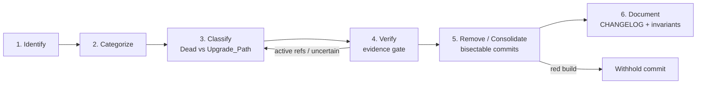
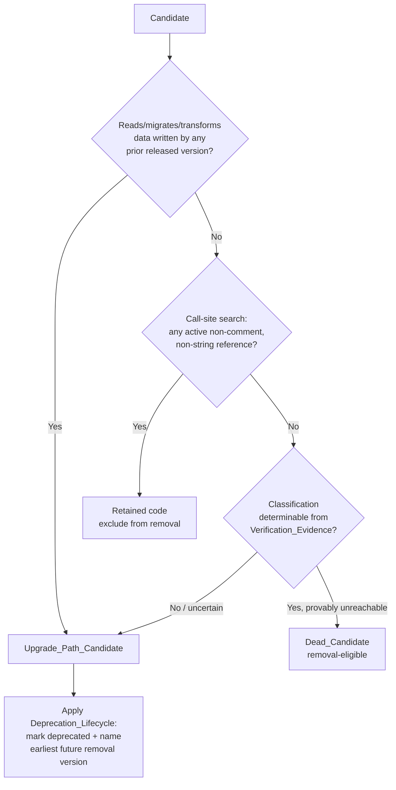

# Design Document: Legacy Code Cleanup

## Overview

This design operationalizes the 11 requirements into an executable, staged
cleanup process and produces the full per-candidate `Inventory_Report` that
Requirement 1 defers to the design phase.

The central tension — *truly dead* code (safe to delete) versus code still
required for the **upgrade path** of installed user environments — drives every
stage. The process is deliberately fail-safe: when classification is uncertain,
code is retained and deprecated rather than removed (R3.5).

### Staged Process



| Stage | What happens | Requirements |
|-------|-------------|--------------|
| 1. Identify | Marker grep + Code_Intel + frontend unused detection produce raw candidates | R1.1, R1.2, R1.3 |
| 2. Categorize | Each candidate assigned exactly one of 10 categories (first-match order) | R2.1, R2.2, R2.3, R2.4 |
| 3. Classify | Each candidate marked `Dead_Candidate` or `Upgrade_Path_Candidate` | R3.1–R3.6 |
| 4. Verify | Call-site search + Code_Intel cross-check + test coverage recorded as `Verification_Evidence` | R4.1–R4.6 |
| 5. Remove | One cohesive change per bisectable `Removal_Commit`, green-state gated | R9, R10 |
| 6. Document | CHANGELOG entries, design-invariants doc, docstring + inclusive-language compliance | R11 |

### Scope Boundaries

- In scope: identification, verification, classification, removal/consolidation,
  documentation across `backend/` and `desktop/`.
- Out of scope: behavioral rewrites. Platform invariants (R5) and user-facing
  behavior (R6) are preserved unchanged.
- Excluded from scan: files matched by `.gitignore` (R1.1), which already
  excludes `.venv/`, `node_modules/`, `.hypothesis/`, build artifacts. (Note:
  the marker grep in this document's prework intentionally surfaced `.venv`
  matches to demonstrate the exclusion rule — those are NOT candidates.)

## Architecture

The cleanup is a tooling-plus-process pipeline. No new runtime code ships to
users; the only durable artifacts are (a) the removals/consolidations
themselves, (b) the `Inventory_Report` and `Verification_Evidence` records kept
in this spec, (c) CHANGELOG entries, and (d) a new design-invariants document.

### Inventory Methodology (R1)

The scan composes three independent candidate sources, then de-duplicates.

**Source A — Marker grep (R1.2).** Case-sensitive search across `backend/` and
`desktop/`, excluding `.gitignore`d paths, for at least these markers:

```
legacy          DEPRECATED      deprecated      backward compat
backwards compat   back-compat   TODO: remove   FIXME
```

Implementation: `grep_search` / ripgrep with `caseSensitive: true`,
`includePattern` scoped to `backend/**` and `desktop/src/**`. Each hit records
`file`, `line`, and the exact marker string that matched.

**Source B — Code_Intel dead-code report (R1.3).** Run
`find_dead_code(graph_store, repo_root)` from
`backend/core/code_intel/dead_code.py`. It returns a `DeadCodeResult` of
`DeadSymbol(id, name, file_path, kind, language, last_commit_ts)` — exported
symbols with zero incoming edges that are not language entry points, sorted
oldest-first. Note the documented Phase-1 limitation: the parser does not store
decorators, so decorated entry points (e.g. `@app.route`) are over-reported as
dead. This is why Source B is a *candidate* source, never an auto-removal
authority — every Code_Intel hit still passes the call-site gate (R4.2).

**Source C — Frontend unused detection (R8).** `tsc --noUnusedLocals` plus
`eslint` over `desktop/src/`. Unused imports/locals and unreferenced exports
become candidates in the *unused import* / *unused export* categories.

**De-duplication rule (R1.6).** Candidates are keyed by
`(normalized_file_path, symbol_or_line_range)`. When multiple sources hit the
same key, the report keeps ONE entry and records every contributing source in a
`sources[]` list (e.g. `["marker:DEPRECATED", "code_intel"]`). Line-range
markers and symbol-level Code_Intel hits are reconciled by containment: a marker
whose line falls inside a symbol's span merges into that symbol's entry.

**Resilience (R1.7, R1.8).** If a path under `backend/`/`desktop/` cannot be
read, the path is appended to an `inaccessible_paths[]` list and the scan
continues (never aborts). If Code_Intel is unavailable (no `code_intel.db`, or
`find_dead_code` raises), a `missing_sources` note is recorded and the report is
produced from Sources A and C alone.

### Data-format provenance (R1.5)

For any candidate that is a parser, serializer, or fallback format reader, the
report records the `data_format` it reads and the `producer_version` (the code
version that wrote that on-disk format). This is the primary signal feeding the
Dead-vs-Upgrade_Path classifier — a reader of a format that any released
version still wrote is, by definition, an `Upgrade_Path_Candidate` (R3.2).

## Per-Candidate Inventory Report (R1, R2, R3)

This catalogue is the deliverable Requirement 1 defers to design. It was
populated by direct investigation: case-sensitive marker grep across
`backend/` and `desktop/src/`, inspection of the Code_Intel dead-code module,
and **call-site verification** of every seed (R4.2/R4.5 applied during
design — call sites were not assumed).

Each row records: `file:symbol/line` · category (R2) · classification (R3) ·
verification evidence plan (R4) · disposition. Classifications marked
**verified** were confirmed against live call sites during this analysis;
several seeds were reclassified as a result.

Legend — Category codes (R2.1 order): `DM` deprecated module · `OM` stale
one-time migration · `FP` backward-compatible fallback parser · `SH` legacy
platform shim · `DC` dead code (Code_Intel) · `OT` obsolete test · `DT`
duplicate test · `CC` commented-out code · `UI` unused import · `UE` unused
export.

### Group OM — Stale one-time migrations (all Upgrade_Path, retain + deprecate)

| # | file:symbol | Cat | Classification | Verification evidence plan | Disposition |
|---|-------------|-----|----------------|----------------------------|-------------|
| 1 | `backend/jobs/paths.py::_migrate_legacy_state_dir` | OM | **Upgrade_Path (verified)** | Called in `main.py` lifespan (line 691). Migrates `~/.swarm-ai/.context/` → `state/` for users installed before the rename. Reads data written by prior releases → R3.2 forces Upgrade_Path. | **Retain.** Deprecate with named removal version once telemetry shows no pre-rename installs remain. |
| 2 | `backend/main.py::_deferred_refresh_defaults` (MCP migration block, ~534) | OM | **Upgrade_Path (verified)** | Calls `migrate_if_needed(ws_path)` converting legacy `user-mcp-servers.json` → `.claude/mcps/mcp-dev.json`. Directly satisfies R6.2. Reads prior-version config. | **Retain.** Keep until a release line no longer supports the old MCP config format. |

### Group FP — Backward-compatible fallback parsers (Upgrade_Path / retain)

| # | file:symbol | Cat | Classification | Verification evidence plan | Disposition |
|---|-------------|-----|----------------|----------------------------|-------------|
| 3 | `backend/jobs/executor.py::_parse_legacy_todos` | FP | **Upgrade_Path (verified)** | Called by `_create_todos_from_result` fallback (line ~1746) when the structured `<!-- RADAR_TODOS -->` JSON block is absent. Old agent-task results on disk (JobResults JSONL/markdown) can still lack the block → old on-disk data can hit it. R3.2/R3.5. | **Retain + deprecate.** Prune only after confirming no pre-structured job results remain in any install. |
| 4 | `backend/hooks/distillation_hook.py` regex markdown fallback (`_extract_decisions`/`_extract_lessons` path, "Regex fallback path: parse markdown (legacy, pre-JSONL files)") | FP | **Upgrade_Path (verified)** | The hook prefers the JSONL sidecar and falls to regex only for pre-JSONL DailyActivity files. Those files exist on disk for any user predating the JSONL sidecar. | **Retain.** Deprecate; prune when the 90-day archival window guarantees no pre-JSONL DA files remain. |
| 5 | `backend/jobs/models.py::SchedulerState.monthly_tokens_used` ("legacy, kept for backwards compat") | FP/persisted field | **Upgrade_Path → reclassified RETAIN (verified)** | Seed suggested possible dead field. Call-site search found **active writers** (`handlers/signal_digest.py` +=, `executor.py` reset) and a **reader** (`scheduler.py` prints "(legacy)"). Per R4.5 active references → not dead. Also a persisted `state.json` schema field. | **Retain unchanged** this cycle. Eligible for deprecate-then-prune only after writers/readers are removed in a separate change. |

### Group DM — Deprecated modules

| # | file:symbol | Cat | Classification | Verification evidence plan | Disposition |
|---|-------------|-----|----------------|----------------------------|-------------|
| 6 | `backend/jobs/install_scheduler.py::install()` | DM | **Upgrade_Path (verified)** | Module DEPRECATED since v1.13; `install()` is a no-op that still **removes legacy plists** (`OLD_PLISTS`) for users who installed external scheduler plists. Live call site: `jobs/scheduler.py` `--install` CLI (line 752). Cleanup of prior-version on-disk launchd state → Upgrade_Path. | **Retain.** Deprecate; the plist *template* file is separately removable (row 9). |
| 7 | `backend/jobs/install_scheduler.py::uninstall()` + constants `LAUNCH_AGENTS`/`NEW_LABEL`/`_uid` | DM | **RETAIN (verified, not legacy)** | Live: `routers/system.py` app-uninstall (line 899) imports `uninstall`; `core/swarm_workspace_manager.py` imports the constants (line 1771). Active references → R4.5 excludes from removal. | **Retain unchanged.** Not a removal target. |
| 8 | `backend/channels/streaming.py::legacy_flush` / `legacy_periodic` / `LEGACY_FLUSH_S` | DM/FP | **RETAIN active fallback (verified)** | Seed implied removable legacy flusher. Call-site search: `gateway.py` actively starts `legacy_periodic` whenever `not ctx.native_streaming` (line 1272) and on native-start failure fallback (1236/1251). This is a **live runtime fallback** for adapters without native streaming. Active references → R4.5. | **Retain unchanged.** Not dead, not upgrade-path-data — active code. |
| 9 | `backend/jobs/com.swarmai.scheduler.plist` (template file) | DM | **Dead_Candidate (candidate, verify)** | Module docstring states the plist "can be deleted in a future release". Verify no code reads `TEMPLATE` for *writing* (install() no longer installs). Confirm only referenced by the deprecated install path. | **Deprecate-then-prune.** Leaf, low-risk; defer until row 6 deprecation lands. |

### Group SH — Legacy platform shims

| # | file:symbol | Cat | Classification | Verification evidence plan | Disposition |
|---|-------------|-----|----------------|----------------------------|-------------|
| 10 | `backend/hooks/context_health_hook.py` legacy `DddCultivationOrchestrator` fallback path | SH/FP | **Upgrade_Path (verify call sites)** | Inspect the fallback branch that handles the pre-event-driven DDD path. Verify whether any installed workspace still produces the old artifact shape that triggers the fallback. If yes → Upgrade_Path; if provably unreachable → Dead. | **Default Upgrade_Path** under R3.5 until evidence proves unreachable. |
| 11 | `backend/jobs/scheduler.py:726` comment `# install_launchd removed — use install_scheduler.py instead` | CC | **Dead_Candidate** | Pure stale comment referencing an already-removed symbol. No code. | **Remove now** (leaf, zero-risk) in a docs/comment cleanup commit. |

### Group EM — Lifecycle pattern reference (NOT a removal target)

| # | file:symbol | Cat | Classification | Verification evidence plan | Disposition |
|---|-------------|-----|----------------|----------------------------|-------------|
| 12 | `backend/hooks/evolution_maintenance_hook.py` (`_deprecate_entry`, `_prune_entry`, `deprecation_days=30`) | n/a | **RETAIN — reference pattern** | This is the working deprecate-then-prune engine (active→deprecated when idle >30d & 0 usage; pruned when deprecated + 0 usage + aged out; all logged to `EVOLUTION_CHANGELOG.jsonl`). | **Do not remove.** Cite as the canonical model for the R3.4 `Deprecation_Lifecycle` applied to retained Upgrade_Path candidates. |

### Group frontend — desktop/src candidates (R8)

| # | file:symbol | Cat | Classification | Verification evidence plan | Disposition |
|---|-------------|-----|----------------|----------------------------|-------------|
| 13 | `desktop/src/components/workspace-explorer/FileTreeNode.tsx` (`@deprecated` module; `FileTreeItem` retained) | DM | **Split (verify)** | Module marked `@deprecated`; component replaced by `TreeNodeRow`. But the `FileTreeItem` *type* is "retained for backward compatibility with chat and layout components." Run `tsc`/grep for `FileTreeNode` component usage vs `FileTreeItem` type usage. | Component → **Dead_Candidate if zero JSX usage**; `FileTreeItem` type → **retain** while consumers exist. Two separate commits. |
| 14 | `desktop/src/components/workspace-explorer/toFileTreeItem.ts` (converts to "deprecated `FileTreeItem`") | DM | **RETAIN (verify)** | Single conversion point to the deprecated type; retained while chat/layout consume `FileTreeItem`. | **Retain** until consumers migrate; then remove with consumers in one commit. |
| 15 | `desktop/src/hooks/useChatStreamingLifecycle.ts` re-export `MAX_OPEN_TABS` (+ `useUnifiedTabState.ts` `@deprecated` alias) | UE | **Dead_Candidate (candidate, verify)** | `@deprecated` alias "kept for existing test imports." Grep `MAX_OPEN_TABS(` across `desktop/src` incl. tests. If only the deprecated test references it, migrate tests to `MAX_TABS_HARD_CEILING`/`fetchMaxTabs()`, then delete alias + re-export (R8.2). | **Deprecate-then-prune.** Remove re-export from re-export site when consumers migrate. |
| 16 | `desktop/src/services/system.ts` `jobs: BriefingJob[]  // backward compat` + parse block (~356) | FP | **Upgrade_Path / RETAIN (verify)** | Field consumed by older briefing payload shape. Verify backend still emits `jobs` for any supported version; SSE shapes must not change (R6.4). | **Retain** unless backend provably no longer emits the field. |
| 17 | `desktop/src/pages/ChatPage.tsx` `deriveStreamingActivity` re-export "for backward compatibility with existing test imports" | UE | **Dead_Candidate (candidate, verify)** | Grep test imports. If tests can import from the canonical source, remove the re-export (R8.2) and fix imports in the same commit. | **Deprecate-then-prune.** |
| 18 | `desktop/src/components/common/FileEditorModal.tsx` "preserved exports for backward compatibility" | UE | **RETAIN (verify)** | Verify modal-mode consumers still import these. `noUnusedLocals` will catch genuinely-dead ones. | **Retain** while imported; never suppress `noUnusedLocals` (R8.1). |
| 19 | `desktop/src/utils/clipboard.ts` `document.execCommand('copy')` legacy fallback | FP | **RETAIN active fallback** | Third attempt in a 3-tier clipboard chain; live runtime fallback for environments where the Clipboard API is denied. Active path. | **Retain unchanged.** |

### Group MEMORY/docs — project-memory debt (R11)

| # | item | Cat | Classification | Verification evidence plan | Disposition |
|---|------|-----|----------------|----------------------------|-------------|
| 20 | Temporary anti-pattern lists: "Global Anti-Patterns" (12) in `.kiro/steering/swarmai-dev-rules.md` + "Anti-Patterns Encountered" sections in `Projects/SwarmAI/IMPROVEMENT.md` | doc | **Replace (R11.3, R11.4)** | These are the "temporary anti-pattern list referenced in project memory." Each becomes one *structural* invariant in the new design-invariants doc. | Replace with design-invariants doc; leave **no remaining reference** to the temporary list (R11.3). |
| 21 | Prior commits with `Co-Authored-By: Claude` trailer (rule violation) | doc/process | **Process fix only** | Verified: recent 400 commits contain **0** `Co-Authored-By: Claude` trailers (current practice already uses `Swarm`). History is immutable (git safety) — do **not** rewrite. | **No history rewrite.** Enforce `Co-Authored-By: Swarm <swarm@swarmai.dev>` on all new Removal_Commits (R10.5). Record the standing rule in the invariants doc. |

### Code_Intel dead-code source (R1.3, R1.8)

Source B (`find_dead_code()`) is run at scan time; its `DeadSymbol` rows are
merged into the groups above by `(file_path, name)` and always re-verified via
the call-site gate before any removal (decorated-entry-point false positives are
expected per the module's documented Phase-1 limitation). If `code_intel.db` is
absent for a project, record `missing_sources: ["code_intel:<project>"]` and
proceed from markers + frontend tooling (R1.8).

### Uncategorized handling (R2.3)

Any candidate matching none of the 10 categories is recorded under an
`uncategorized` group and **excluded from removal** until a maintainer assigns a
category. The `cmhk-*` skill `backward compat` query-layer comments surfaced by
the grep are categorized `FP` and classified **Upgrade_Path/retain** (data-shape
compat for `queries.py` consumers) — listed in aggregate, not individually, as
they are retained and out of removal scope this cycle.

## Components and Interfaces

### Category Assignment (R2)

Categorization is deterministic. A candidate is tested against the 10 category
predicates **in the exact order listed in R2.1** and assigned the FIRST match
(R2.2); the chosen category is recorded as the candidate's single category.

```
order = [deprecated_module, stale_one_time_migration, backward_compatible_fallback_parser,
         legacy_platform_shim, dead_code_code_intel, obsolete_test, duplicate_test,
         commented_out_code, unused_import, unused_export]
category(c) = first p in order such that predicate_p(c) is True
            = "uncategorized" if none match   # excluded from removal (R2.3)
```

The report groups all candidates by assigned category, including a distinct
`uncategorized` group (R2.4).

### Classification Decision Procedure — Dead vs Upgrade_Path (R3)

Every candidate gets exactly one mutually-exclusive classification before it is
removal-eligible (R3.1). The decision is deterministic and fail-safe:



Rules encoded:
- **R3.2** — any reader/migrator/transformer of prior-version on-disk data is
  Upgrade_Path. This is checked first because it is the safest discriminator and
  is backed by the `data_format`/`producer_version` provenance (R1.5).
- **R3.5 fail-safe default** — if evidence cannot determine the class, default to
  `Upgrade_Path_Candidate` (never Dead). Rows 10 and any ambiguous frontend
  fallback inherit this default.
- **R3.3 / R3.4** — every Upgrade_Path candidate is **retained** this cycle and
  recorded as deprecated with the earliest future version permitting deletion,
  using the `evolution_maintenance_hook` deprecate-then-prune pattern (row 12)
  as the model.
- **R3.6** — only `Dead_Candidate` rows are marked removal-eligible.
- **R4.5 interaction** — an active call site discovered during verification
  reclassifies a candidate out of `Dead` (to Upgrade_Path or retained). Seeds
  5, 7, 8 were reclassified by exactly this rule during inventory.

### Verification Gate (R4)

No `Dead_Candidate` is removed without a recorded `Verification_Evidence`
artifact (R4.1). The gate has three checks:

1. **Call-site search (R4.2, R4.6).** Search `backend/` and `desktop/` —
   including all test directories — for references. For a function symbol the
   search MUST use the pattern `function_name(` (R4.6) and follows the
   `swarmai-dev-rules` pre-modification rule
   `grep -rn "function_name(" tests/ --include="*.py"`. Zero active
   (non-comment, non-string) call sites is required to proceed. One or more
   active references → reclassify to Upgrade_Path/retained and exclude (R4.5).
2. **Code_Intel cross-check (R4.3, R4.4).** Confirm the symbol appears in the
   `find_dead_code()` report. If it does NOT (e.g. decorated-entry-point false
   negative, or a symbol Code_Intel can't see), record a written justification
   explaining why the report does not apply before proceeding (R4.4).
3. **Test-coverage check (R7).** Identify tests exercising the symbol so the
   removal commit can delete obsolete tests together with the code (R7.1) and
   detect retained-behavior coverage gaps (R7.5).

**Verification_Evidence record** (one per removed candidate):

```json
{
  "candidate_id": "install_scheduler.com.swarmai.scheduler.plist",
  "call_site_search": {"pattern": "TEMPLATE", "scope": ["backend/", "desktop/"],
                        "active_refs": 0, "test_refs": []},
  "code_intel": {"reported_dead": true, "justification": null},
  "test_coverage": {"covering_tests": [], "obsolete_tests": []},
  "decision": "remove",
  "classification": "Dead_Candidate"
}
```

### Platform Invariant Preservation (R5)

Every removal is screened against the Platform_Invariants. A proposed removal
that would alter any of these is excluded and the code retained unchanged (R5.6):

- Fixed port **18321** as the single listening port; no dynamic/runtime port
  allocation introduced (R5.1).
- All file locking stays routed through `utils.file_lock`; **no module-level
  `import fcntl`** introduced in any retained or modified file (R5.2,
  swarmai-dev-rules).
- No `lsof` introduced in any script; port checks use `nc -z 127.0.0.1 PORT`
  (R5.3).
- Regression-Prone Areas (multi-tab isolation, session identity & backend
  isolation, context-and-memory safety, self-evolution guardrails) keep every
  documented invariant intact (R5.4); after any removal touching these areas,
  the existing targeted tests must produce **identical pass/fail results** to
  the pre-cleanup baseline (R5.5). Removals adjacent to these areas are deferred
  behind leaf/low-risk Dead candidates (see commit ordering).

### Behavior Preservation for Existing Users (R6)

The two migration paths are explicitly retained (rows 1 and 2):
- State-directory migration (`_migrate_legacy_state_dir`) loads a
  prior-version environment with no data loss and no manual step (R6.1); on
  failure it leaves the original `.context/` dir unmodified (the function only
  moves files that exist and only `rmdir`s when empty) and the failure is
  observable (R6.5).
- MCP config migration (`migrate_if_needed`) converts old
  `user-mcp-servers.json` to the new format without losing entries (R6.2); on
  failure the original config is preserved and the error surfaced (R6.6).
- No change to the documented SSE event shapes — `session_start`, `assistant`,
  `tool_use`, `tool_result`, `ask_user_question`, `cmd_permission_request`,
  `result`, `error` (R6.4). Frontend candidate 16 (`jobs` backward-compat
  field) is gated on this.

### Removal & Commit Strategy (R9, R10)

- **One cohesive change per `Removal_Commit` (R10.1).** A commit contains all
  edits to remove/consolidate a single named symbol, file, module, or
  re-export, plus the edits needed to keep the build green. Unrelated items are
  split into separate commits (R10.2).
- **Green-state gate (R10.3, R10.4, R9.5).** Before a commit is recorded, the
  build command exits success AND all executed targeted tests pass. If not
  green, the commit is **withheld**, the working tree and prior history are left
  unchanged, and an error identifies the failing commit. Build completion is
  confirmed with `./prod.sh build` for backend (R9.4).
- **Commit trailer (R10.5).** Every Removal_Commit ends with
  `Co-Authored-By: Swarm <swarm@swarmai.dev>` and never a Claude/Anthropic
  identity. Commits follow Conventional Commits (`refactor:`/`chore:`/`test:`).
- **Ordering.** Process leaf, lowest-risk `Dead_Candidate`s first (e.g. row 11
  stale comment, row 9 plist template, frontend re-export rows 15/17 after test
  migration). **Defer** any removal adjacent to a Regression-Prone Area until
  after the safe leaves land, so a bisect never lands first on a high-risk
  change. Upgrade_Path rows are not removed this cycle — they are deprecated.
- **CI (R9.6).** Each pushed Removal_Commit keeps all 4 CI_Gate jobs (backend,
  backend-windows, frontend, version-check) green. Never tag/push on red.

### Test Cleanup Strategy (R7)

- A test whose every exercised production symbol was removed as a Dead_Candidate
  is removed in the **same** Removal_Commit as the code (R7.1).
- A test exercising at least one surviving symbol is retained (R7.2).
- Tests covering an Upgrade_Path_Candidate are always retained (R7.4).
- Duplicate tests (identical inputs → identical expected outcomes) are
  consolidated into one test that preserves every distinct assertion and input
  combination (R7.3).
- If removing a test would leave a retained behavior with no coverage, keep it
  or add an equivalent replacement (same inputs/expected outcomes) before
  completing removal (R7.5).
- After each Removal_Commit, run the affected test suite; if any retained test
  fails or fails to compile, **revert the commit** and report the failing test
  (R7.6).
- **Obsolete-test candidates surfaced:** `tests/test_backend_daemon.py` and
  `tests/test_daemon_first.py` assert `install()` *writes/keeps a plist*, but
  `install()` is now a no-op that only removes plists. These are **OT (obsolete
  test)** candidates tied to row 6 — verify against current `install()`
  behavior and update or remove alongside any change to the deprecated module.

#### Targeted-test invocation rules (R9.1–R9.3, swarmai-dev-rules)

- Targeted only: `cd backend && python -m pytest tests/test_<module>.py -v --timeout=60`.
  Affected modules = files modified by the commit OR tests referencing a removed
  symbol (R9.1).
- **Never** run the full backend suite proactively (R9.2; xdist deadlock risk).
- Full suite only on explicit request via the documented invocation
  `SWARMAI_SUITE=1 python -m pytest --timeout=120` (R9.3).
- Never pipe pytest through `| tail`. Frontend: `cd desktop && npm test -- --run`.

### Frontend Hygiene Strategy (R8)

- Removing a frontend candidate removes every import/symbol that becomes
  unreferenced; **never** disable/weaken/suppress `noUnusedLocals` (R8.1).
- Replacing a hook/module deletes the obsolete source file AND removes its
  re-export from the index (e.g. `hooks/index.ts`) — rows 15, 17 (R8.2).
- After each frontend removal, `tsc` reports zero errors and `eslint` reports
  zero errors before the next removal begins (R8.3). On any error: halt, report,
  and do not mark complete until both are clean (R8.4).
- **`toCamelCase()` consistency (R8.5).** The repo has multiple per-service
  `toCamelCase()` mappers: `mcpConfig.ts`, `system.ts`, `chat.ts`, `skills.ts`,
  `tasks.ts`, `todos.ts`, `radar.ts` (+ `taskToCamelCase`,
  `completedTaskToCamelCase`, `jobToCamelCase`, `artifactToCamelCase`),
  `codeIntel.ts`. When a backend field is added/removed/renamed, ensure every
  remaining backend field has exactly one camelCase mapping in the relevant
  function and no mapping references a removed field.

### Documentation Strategy (R11)

- **CHANGELOG (R11.1, R11.2).** For every removed/deprecated candidate, append a
  `CHANGELOG.md` entry recording the candidate identifier, removed-vs-deprecated,
  and the reason — before the task is considered complete. If the append fails,
  preserve existing changelog content and report an error identifying the failed
  entry.
- **Design-invariants document (R11.3, R11.4).** Create a new durable
  design-invariants doc that *replaces* the temporary anti-pattern lists (row
  20). It contains **one structural rule per removed legacy pattern** stating how
  the structure prevents that pattern from returning (e.g. "external scheduler
  plist install is removed; the scheduler runs only in the daemon asyncio loop —
  there is no install path to reintroduce"). After replacement, no remaining
  reference to the temporary anti-pattern list may exist anywhere (R11.3),
  including `swarmai-dev-rules.md` and `IMPROVEMENT.md`.
- **Module docstrings (R11.5).** Every retained module keeps a module-level
  docstring with a one-line summary (Python triple-quoted; TS/React `/** */`),
  per the swarmai-dev-rules documentation standard. Any module touched by a
  removal that lacks one gets one added.
- **Inclusive language (R11.6).** No added/modified code, comment, or doc may
  contain `master`, `slave`, `whitelist`, `blacklist`, `whiteday`, `blackday`.
  Use the approved replacements (primary/replica, allowlist/denylist, etc.).
- **Commit identity (R10.5, row 21).** All commits use
  `Co-Authored-By: Swarm <swarm@swarmai.dev>`. History is not rewritten.

## Data Models

### Inventory_Report record (R1.4, R1.5, R1.6)

```python
@dataclass
class InventoryCandidate:
    id: str                       # stable key, e.g. "jobs/paths.py::_migrate_legacy_state_dir"
    file_path: str                # repo-relative
    symbol_or_line_range: str     # symbol name or "L200-L223"
    category: str                 # one of the 10 R2 codes, or "uncategorized"
    classification: str           # "Dead_Candidate" | "Upgrade_Path_Candidate" | "retained"
    sources: list[str]            # contributing sources, e.g. ["marker:DEPRECATED","code_intel"]
    data_format: str | None       # R1.5 — for parsers/serializers/fallback readers
    producer_version: str | None  # R1.5 — code version that wrote that format
    deprecation: "Deprecation | None"  # set when classification == Upgrade_Path_Candidate
    disposition: str              # "remove_now" | "deprecate_then_prune" | "retain"

@dataclass
class Deprecation:               # R3.4 Deprecation_Lifecycle
    deprecated: bool
    earliest_removal_version: str  # e.g. "v1.20.0"

@dataclass
class InventoryReport:
    candidates: list[InventoryCandidate]
    inaccessible_paths: list[str]    # R1.7
    missing_sources: list[str]       # R1.8 (e.g. "code_intel:SwarmAI")
    # grouped(): dict[category -> list[InventoryCandidate]]  (R2.4)
```

### Verification_Evidence record (R4.1)

Schema shown in the Verification Gate section above: `call_site_search`,
`code_intel` (with optional `justification` per R4.4), `test_coverage`,
`decision`, and resulting `classification`. One record is produced and retained
per removed candidate before removal.

### Removal_Commit metadata (R10)

```python
@dataclass
class RemovalCommit:
    cohesive_item: str            # single symbol/file/module/re-export (R10.1)
    edits: list[str]              # files changed
    green_state: bool             # build success + tests pass (R10.3)
    trailer: str                  # "Co-Authored-By: Swarm <swarm@swarmai.dev>" (R10.5)
    affected_tests: list[str]     # targeted tests run (R9.1)
```

## Correctness Properties

*A property is a characteristic or behavior that should hold true across all
valid executions of a system — essentially, a formal statement about what the
system should do. Properties serve as the bridge between human-readable
specifications and machine-verifiable correctness guarantees.*

These properties use property-based testing (PBT) for the **deterministic
logic** of this cleanup — category assignment, classification, de-duplication,
the verification gate, migrations (idempotence/losslessness), the `toCamelCase`
mapping, and the textual invariants. PBT does **not** apply to runner/CI gates,
the build, or the Regression-Prone-Area baseline comparison; those are routed to
integration and example tests (see Testing Strategy). Each property below
derives from the prework analysis; redundant properties were consolidated.

### Property 1: Marker matching is case-sensitive

*For any* text line, the marker matcher flags a token if and only if it matches
one of the 8 markers under exact case (e.g. `deprecated` and `DEPRECATED` are
distinct hits; `Legacy` does not match `legacy`).

**Validates: Requirements 1.2**

### Property 2: De-duplication keeps one entry per location with all sources

*For any* collection of source hits keyed by `(file_path, symbol_or_line_range)`,
the report contains exactly one candidate per key and that candidate's `sources`
equals the union of all contributing sources for the key.

**Validates: Requirements 1.6**

### Property 3: Candidate records are complete

*For any* candidate in the report, the record populates `file_path`,
`symbol_or_line_range`, `category`, and at least one contributing `source`; and
*for any* candidate whose category is a parser/serializer/fallback reader, both
`data_format` and `producer_version` are non-null.

**Validates: Requirements 1.4, 1.5**

### Property 4: Category assignment is total, single-valued, and order-deterministic

*For any* candidate, `category()` returns exactly one value from the 10 allowed
categories or `uncategorized`; when the candidate matches multiple category
predicates, the assigned category is the earliest one in the fixed R2.1 order;
and a candidate matching no predicate is `uncategorized` and is not
removal-eligible.

**Validates: Requirements 2.1, 2.2, 2.3**

### Property 5: Grouping is a lossless partition

*For any* candidate list, grouping by category yields a partition whose union
equals the input set, with keys drawn only from the allowed categories plus a
distinct `uncategorized` group when such candidates exist.

**Validates: Requirements 2.4**

### Property 6: Classification is exactly one class and prior-version readers are Upgrade_Path

*For any* candidate eligible for a classification decision, the classifier
returns exactly one of `Dead_Candidate` or `Upgrade_Path_Candidate` (never both,
never neither); and whenever the evidence marks the candidate as reading,
migrating, or transforming data written by a prior released version, the result
is `Upgrade_Path_Candidate`.

**Validates: Requirements 3.1, 3.2**

### Property 7: Uncertain classification fails safe to Upgrade_Path

*For any* candidate whose classification cannot be determined from
`Verification_Evidence`, the classifier returns `Upgrade_Path_Candidate` (never
`Dead_Candidate`).

**Validates: Requirements 3.5**

### Property 8: Classification drives disposition

*For any* classified report, no `Upgrade_Path_Candidate` appears in the removal
set, every `Upgrade_Path_Candidate` carries `deprecation.deprecated == true`
with a non-empty, valid future `earliest_removal_version`, and every
`Dead_Candidate` is marked removal-eligible.

**Validates: Requirements 3.3, 3.4, 3.6, 6.3**

### Property 9: Removal requires complete evidence and zero active call sites

*For any* removed candidate, a complete `Verification_Evidence` record exists
prior to removal (call-site result, Code_Intel status, decision), and the
recorded active (non-comment, non-string) call-site count across `backend/` and
`desktop/` is zero.

**Validates: Requirements 4.1, 4.2**

### Property 10: Code_Intel gate requires report-dead or written justification

*For any* removal, the removal is permitted if and only if Code_Intel reports the
symbol as dead OR a non-empty written justification is recorded explaining why
the report does not apply.

**Validates: Requirements 4.3, 4.4**

### Property 11: Active references exclude and reclassify

*For any* candidate whose verification finds one or more active references, the
candidate is excluded from removal and reclassified as `Upgrade_Path_Candidate`
or retained code.

**Validates: Requirements 4.5**

### Property 12: Invariant-altering removals are excluded with no edit

*For any* proposed removal flagged as altering a Platform_Invariant (port 18321
fixed, no dynamic port allocation; locking via `utils.file_lock`; no `lsof`),
the removal is excluded and the affected file is left unchanged.

**Validates: Requirements 5.1, 5.6**

### Property 13: Modified-file textual safety invariants

*For any* retained or modified file, the file contains no module-level
`import fcntl`; *for any* retained or modified script, it contains no `lsof`
invocation; and *for any* modified frontend file, it contains no `noUnusedLocals`
suppression directive.

**Validates: Requirements 5.2, 5.3, 8.1**

### Property 14: Migrations are lossless and idempotent

*For any* pre-upgrade on-disk state-directory contents, running the
state-directory migration relocates every known runtime file to the new location
with identical content and no data loss, and running it a second time is a no-op
(idempotent); *for any* prior-version MCP configuration, conversion preserves
every configuration entry and re-running is a no-op.

**Validates: Requirements 6.1, 6.2**

### Property 15: SSE event shapes are preserved

*For any* generated event of the 8 documented SSE types (`session_start`,
`assistant`, `tool_use`, `tool_result`, `ask_user_question`,
`cmd_permission_request`, `result`, `error`), the event validates against the
frozen schema, and the set of emitted event types is unchanged by any
modification.

**Validates: Requirements 6.4**

### Property 16: Test removal/retention and coverage preservation

*For any* test, the test is removed in the code's Removal_Commit if and only if
every production symbol it exercises is in the removed set; no test covering an
`Upgrade_Path_Candidate` is removed; and after all removals, every retained
behavior still has at least one covering test (an equivalent replacement exists
if the original was removed).

**Validates: Requirements 7.1, 7.2, 7.4, 7.5**

### Property 17: Duplicate test consolidation is lossless

*For any* set of duplicate tests (identical inputs and expected outcomes), the
consolidated test's assertion set and input set equal the union of the originals'
distinct assertions and inputs.

**Validates: Requirements 7.3**

### Property 18: Hook replacement removes source and re-export

*For any* replaced hook or module, neither its source file nor its re-export from
the corresponding index file (e.g. `hooks/index.ts`) remains in the codebase.

**Validates: Requirements 8.2**

### Property 19: toCamelCase mapping is a bijection over retained fields

*For any* set of backend fields and any subset removed, the `toCamelCase()`
mapping is a bijection from the retained backend fields onto camelCase fields
(exactly one mapping per retained field) and contains no mapping referencing a
removed field.

**Validates: Requirements 8.5**

### Property 20: Each Removal_Commit is cohesive and bisectable with the correct trailer

*For any* Removal_Commit, its edits trace to exactly one cohesive item (a single
symbol, file, module, or re-export, plus only the edits needed to keep the build
green) so unrelated items never share a commit; the commit is recorded only in a
green state (build success and all executed tests passing); and the commit
message ends with `Co-Authored-By: Swarm <swarm@swarmai.dev>` and contains no
Claude/Anthropic identity.

**Validates: Requirements 10.1, 10.2, 10.3, 10.5**

### Property 21: Documentation capture is complete and inclusive

*For any* removed or deprecated candidate, a `CHANGELOG.md` entry exists
recording its identifier, whether it was removed or deprecated, and the reason;
*for every* removed legacy pattern there is exactly one structural rule in the
design-invariants document; after replacement there remains zero reference to
the temporary anti-pattern list across the corpus; *for any* retained or
modified module a module-level docstring with a non-empty one-line summary
exists; and *for any* added or modified text none of the terms `master`,
`slave`, `whitelist`, `blacklist`, `whiteday`, `blackday` appears.

**Validates: Requirements 11.1, 11.3, 11.4, 11.5, 11.6**

## Error Handling

The cleanup is designed to fail safe — every error path preserves existing
state and surfaces a clear indication rather than aborting silently or losing
work.

| Condition | Handling | Requirement |
|-----------|----------|-------------|
| Unreadable path during scan | Record in `inaccessible_paths[]`, continue scan | R1.7 |
| Code_Intel unavailable | Record in `missing_sources[]`, build report from markers + frontend tooling | R1.8 |
| Uncertain classification | Default to `Upgrade_Path_Candidate` (fail-safe), never Dead | R3.5 |
| Active call site found at verify time | Reclassify out of Dead, exclude from removal | R4.5 |
| Code_Intel not reporting a symbol dead | Require written justification before removal, else block | R4.4 |
| Proposed removal alters a Platform_Invariant | Exclude removal, leave file unchanged | R5.6 |
| State-dir migration failure | Leave original `.context/` dir unmodified, return error identifying the failure | R6.5 |
| MCP config migration failure | Leave original config files unmodified, return conversion error | R6.6 |
| Retained test fails / fails to compile after commit | Revert the Removal_Commit, report the failing test | R7.6 |
| `tsc`/`eslint` error after frontend removal | Halt, report failing errors, do not mark complete until both are zero | R8.4 |
| Targeted test or build fails after removal | Identify failing step, revert or correct, confirm success before next commit | R9.5 |
| Build not green at commit time | Withhold commit, leave working tree + history unchanged, error identifying the failing commit | R10.4 |
| `CHANGELOG.md` append failure | Preserve existing changelog content, report error identifying the failed entry | R11.2 |

All file writes use `fsWrite`/`fsAppend` in small chunks (never heredoc), and
edits prefer `strReplace` — per `swarmai-dev-rules.md`, to avoid agent hangs and
corrupting in-progress files.

## Testing Strategy

A dual approach: property-based tests for the universal logic above, plus
example/integration tests for the wiring, runner, and CI gates that do not vary
meaningfully with input.

### Property-Based Tests

- Library: **Hypothesis** (Python; the repo already uses it — see
  `.hypothesis/`) for backend logic, and **fast-check** for the frontend
  `toCamelCase`/module-removal properties (TypeScript).
- Each of the 21 properties is implemented as a **single** property-based test.
- Minimum **100 iterations** per property test.
- Each test is tagged with a comment referencing the design property in the
  form:
  `# Feature: legacy-code-cleanup, Property {n}: {property text}`.
- Do not implement PBT from scratch — use the chosen libraries.
- Generators: synthetic file trees + gitignore rules (P1, with the
  marker-matcher tested as a pure function); `(key, source)` hit lists (P2);
  candidate/evidence factories with controllable flags
  `reads_prior_version`, `active_refs`, `reported_dead`, `alters_invariant`,
  `uncertain` (P4, P6, P7, P8, P9, P10, P11, P12); old-state-dir and old-MCP-
  config fixtures in `tmp_path` (P14); event factories for the 8 SSE types
  (P15); `(test -> covered symbols)` coverage maps (P16, P17); backend field
  sets with removals (P19); commit-plan and commit-message factories (P20);
  module-text and free-text generators for the textual invariants (P13, P21).

### Example-Based Unit Tests

- Code_Intel source inclusion with a stub `find_dead_code` result (R1.3).
- Call-site search pattern construction ends with `(` for a function (R4.6).
- Full-suite invocation form: bare full runs are never issued; the only full
  form is `SWARMAI_SUITE=1 ... --timeout=120` (R9.2, R9.3).
- Concrete inventory rows: assert the verified seeds (rows 1–21) classify as
  documented (e.g. `_migrate_legacy_state_dir` → Upgrade_Path;
  `legacy_periodic` → retained; `monthly_tokens_used` → retained).

### Edge-Case Tests

- Unreadable path mid-scan (R1.7); Code_Intel raises (R1.8).
- State-dir and MCP migration failure injection (R6.5, R6.6).
- Red build at commit time leaves tree/history unchanged (R10.4).
- CHANGELOG append failure preserves content (R11.2).

### Integration / Runner Gates (NOT property tests)

- Regression-Prone-Area baseline: capture pre-cleanup targeted-test pass/fail,
  re-run post-removal, assert identical results (R5.4, R5.5).
- Per-commit targeted tests at `--timeout=60` for affected modules (R9.1);
  revert-on-failure behavior (R7.6, R9.5).
- `tsc` + `eslint` zero-error gate after each frontend removal (R8.3, R8.4).
- `./prod.sh build` success at completion (R9.4).
- 4 CI_Gate jobs green on push (R9.6).

### Test Execution Discipline (swarmai-dev-rules)

- Targeted: `cd backend && python -m pytest tests/test_<module>.py -v --timeout=60`.
- Never run the full suite proactively (xdist deadlock). Never pipe through
  `| tail`. Frontend: `cd desktop && npm test -- --run`.

## Risks and Mitigations

| Risk | Impact | Mitigation |
|------|--------|------------|
| **Auto-commit sweeps uncommitted edits.** The context-health/auto-commit path runs `git add -A` + commit after each turn, which could bundle a half-finished cleanup edit into an unrelated commit, breaking the one-cohesive-change rule (R10.1) and bisectability (R10.3). | High — non-bisectable history, mixed commits | Commit each cleanup file immediately after editing it, in its own Removal_Commit, before any turn boundary. Keep the working tree clean between candidates. Verify with `git status` before starting the next candidate. Never rely on auto-commit to capture cleanup work. |
| **Deleting upgrade-path code by mistake.** A reader of prior-version on-disk data looks dead (no internal callers) but is reached only by old user data. | Critical — breaks upgrade for installed users (R6) | Classification checks prior-version data first (Property 6); fail-safe defaults to Upgrade_Path (Property 7); active-reference reclassification (Property 11). Seeds 1–5 and 10 were retained by exactly this rule. Upgrade_Path code is deprecated, never removed this cycle. |
| **Multi-agent collision.** Concurrent agents editing the same files or `MEMORY.md`/context during cleanup. | Medium — lost edits, corrupted memory | Route all `MEMORY.md`/context writes through `locked_write.py` (never direct writes). Work one candidate at a time; commit before moving on so each agent sees a clean tree. |
| **xdist deadlock from full test runs.** Running the full backend suite proactively deadlocks under xdist. | Medium — hung agent, no results | Targeted tests only (`--timeout=60`); full suite exclusively via `SWARMAI_SUITE=1 ... --timeout=120` on explicit request (R9.2, R9.3). Never pipe pytest through `| tail`. |
| **False-positive dead code from Code_Intel.** Decorated entry points are over-reported as dead (documented Phase-1 limitation). | Medium — wrongful removal | Code_Intel is a candidate source only; every removal still passes the call-site gate (Property 9) and requires report-dead-or-justification (Property 10). |
| **Removing a Regression-Prone-Area invariant.** Edits near session lifecycle / multi-tab / context-memory / self-evolution could weaken a documented invariant. | Critical — runtime regressions | Exclude invariant-altering removals (Property 12, R5.6); defer Regression-Prone-Area-adjacent removals behind safe leaves; gate on identical targeted-test baseline (R5.5). |
| **Obsolete tests masking behavior change.** `test_backend_daemon.py`/`test_daemon_first.py` assert old `install()` plist-writing behavior that no longer holds. | Low — misleading green/red | Treat as OT candidates tied to row 6; update or remove alongside any change to `install_scheduler`, never leave asserting removed behavior. |
| **History rewrite temptation for old Claude trailers.** | High — violates git-safety (immutable remote history) | No history rewrite. Verified 0 Claude trailers in recent history; enforce the Swarm trailer only on new commits (Property 20). |

## Requirements Coverage Map

- **R1** Inventory → Inventory Methodology + Per-Candidate Inventory Report; Properties 1–3.
- **R2** Categories → Category Assignment; Properties 4–5.
- **R3** Dead vs Upgrade_Path → Classification Decision Procedure; Properties 6–8.
- **R4** Verification gate → Verification Gate; Properties 9–11.
- **R5** Platform invariants → Platform Invariant Preservation; Properties 12–13.
- **R6** Behavior preservation → Behavior Preservation; Properties 14–15.
- **R7** Test cleanup → Test Cleanup Strategy; Properties 16–17.
- **R8** Frontend hygiene → Frontend Hygiene Strategy; Properties 13, 18, 19.
- **R9** Build/CI → Removal & Commit Strategy + Testing Strategy (integration gates).
- **R10** Bisectable commits → Removal & Commit Strategy; Property 20.
- **R11** Documentation/invariants → Documentation Strategy; Property 21.
