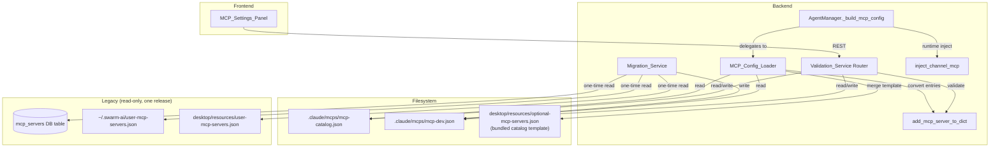
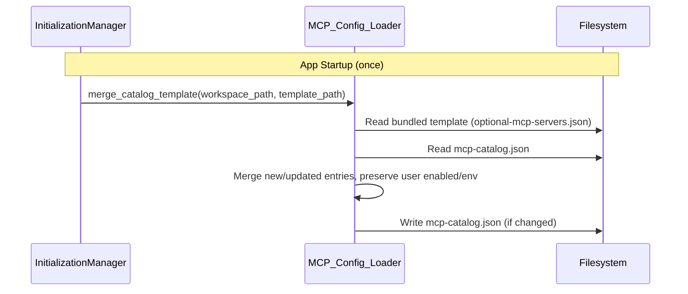
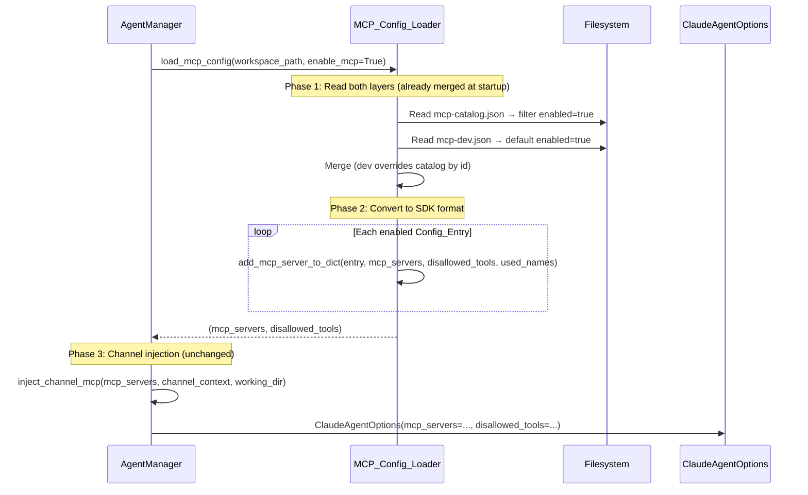
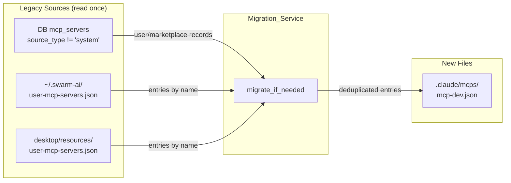

# Design Document: MCP File-Based Configuration

## Overview

This design replaces SwarmAI's fragmented MCP server configuration (DB tables, multiple JSON files, UI-created records) with a deterministic two-layer JSON file system. Two files in `.claude/mcps/` become the single source of truth:

- `mcp-catalog.json` — Product-seeded catalog entries (git-tracked, team-shared). Users toggle `enabled` and set `env` values.
- `mcp-dev.json` — User-owned personal/dev MCPs and plugin-installed MCPs (git-ignored). Full CRUD.

The DB `mcp_servers` table is left in place for one release but is no longer read. A one-time migration converts existing DB records and `user-mcp-servers.json` files into the new format. The existing `add_mcp_server_to_dict()` and `inject_channel_mcp()` functions are preserved unchanged.

### Key Design Decisions

1. **Two files, not three** — No `mcp-system.json` because `default-mcp-servers.json` is currently empty (`[]`). YAGNI.
2. **`config: {}` nesting preserved** — Keeps compatibility with `add_mcp_server_to_dict()` which reads `config.get("command")`, `config.get("args")`, etc.
3. **Thin REST validation layer** — Frontend never writes files directly. All mutations go through `Validation_Service` endpoints that enforce security guards (`_validate_env_no_system_db()`).
4. **Plugin MCPs → `mcp-dev.json`** — Plugin-installed MCPs are written with `source: "plugin"` tag, closing the current gap where plugin MCPs are tracked but never loaded.
5. **`_validate_env_no_system_db()` → shared utils** — Moved from `routers/mcp.py` to `backend/utils/mcp_validation.py` so both the router and loader can use it.

## Architecture

### System Context



### Session Load Path (Data Flow)



### Session Load Path (Per-Session)



### Module Dependency Map

| Module | Location | Depends On | Depended By |
|--------|----------|------------|-------------|
| `MCP_Config_Loader` | `backend/core/mcp_config_loader.py` | `add_mcp_server_to_dict`, `mcp_validation`, filesystem | `agent_manager.py` |
| `Validation_Service` | `backend/routers/mcp.py` (replaced) | `mcp_config_loader`, `mcp_validation` | Frontend |
| `Migration_Service` | `backend/core/mcp_migration.py` | DB, filesystem, `mcp_config_loader` | `initialization_manager.py` |
| `mcp_validation` | `backend/utils/mcp_validation.py` | `config.get_app_data_dir` | `Validation_Service`, `MCP_Config_Loader` |
| `MCP_Settings_Panel` | `desktop/src/components/workspace-settings/MCPSettingsPanel.tsx` | REST API | Workspace settings |

## Components and Interfaces

### Backend Components

#### 1. MCP_Config_Loader (`backend/core/mcp_config_loader.py`)

New module replacing `build_mcp_config()` and `merge_user_local_mcp_servers()` in `mcp_config_builder.py`.

```python
# Public API
def load_mcp_config(workspace_path: Path, enable_mcp: bool) -> tuple[dict, list[str]]:
    """Entry point called by AgentManager._build_mcp_config().
    
    Synchronous — only does file I/O (no DB). Fast for small JSON files.
    Returns (mcp_servers, disallowed_tools) in ClaudeAgentOptions format.
    """

def merge_catalog_template(
    workspace_path: Path,
    template_path: Path,
) -> None:
    """Merge bundled catalog template into user's mcp-catalog.json.
    
    Called ONCE at app startup (initialization_manager), NOT per-session.
    
    - Appends new entries (by id) with enabled=false
    - Updates entries where template._version > existing._version,
      preserving user's enabled and config.env
    - Writes only when changes detected
    """

def read_layer(path: Path, default_enabled: bool) -> list[dict]:
    """Read and parse a single layer file.
    
    Returns [] on missing file or invalid JSON (logs warning).
    default_enabled: True for dev layer, False for catalog layer.
    """

def merge_layers(
    catalog_entries: list[dict],
    dev_entries: list[dict],
) -> list[dict]:
    """Merge two layers. Dev entries override catalog entries by id.
    
    Filters out entries where enabled is explicitly False.
    """

def get_mcp_file_paths(workspace_path: Path) -> tuple[Path, Path]:
    """Return (catalog_path, dev_path) for the workspace."""

# --- Preserved from mcp_config_builder.py (moved here) ---

def add_mcp_server_to_dict(
    mcp_config: dict,
    mcp_servers: dict,
    disallowed_tools: list[str],
    used_names: set,
) -> None:
    """Add a single MCP server entry to the mcp_servers dict.
    
    Moved from mcp_config_builder.py. Handles name collision,
    connection type dispatch, env expansion, and rejected_tools conversion.
    """

def inject_channel_mcp(
    mcp_servers: dict,
    channel_context: Optional[dict],
    working_directory: str,
) -> dict:
    """Inject channel-specific MCP servers when running in a channel context.
    
    Moved from mcp_config_builder.py. Interface unchanged.
    """

# --- Plugin MCP helpers ---

def write_plugin_mcps(workspace_path: Path, mcp_data: dict, plugin_id: str) -> list[str]:
    """Convert .mcp.json mcpServers entries to Config_Entry objects and append to mcp-dev.json."""

def remove_plugin_mcps(workspace_path: Path, plugin_id: str) -> int:
    """Remove all entries from mcp-dev.json where plugin_id matches."""
```

**What changes in `mcp_config_builder.py`:**
- `build_mcp_config()` — **Deleted** (replaced by `load_mcp_config()` in `mcp_config_loader.py`)
- `merge_user_local_mcp_servers()` — **Deleted**
- `add_mcp_server_to_dict()` — **Moved** to `mcp_config_loader.py` (unchanged logic)
- `inject_channel_mcp()` — **Moved** to `mcp_config_loader.py` (unchanged logic)
- **`mcp_config_builder.py` is deleted entirely** — all surviving functions live in `mcp_config_loader.py`

**What changes in `agent_manager.py`:**
- `_build_mcp_config()` (line 683) — Delegates to `mcp_config_loader.load_mcp_config(workspace_path, enable_mcp)` (synchronous call, no await needed)
- Import changes: `from core.mcp_config_loader import load_mcp_config, inject_channel_mcp`
- Remove: `from core.mcp_config_builder import build_mcp_config, inject_channel_mcp`

**Catalog merge timing:**
- `merge_catalog_template()` is called ONCE at app startup from `initialization_manager.run_full_initialization()`, NOT per-session
- `load_mcp_config()` only reads the already-merged files — no template comparison at session time

#### 2. Validation_Service (`backend/routers/mcp.py` — replaced)

The existing `backend/routers/mcp.py` (DB-backed CRUD) is replaced entirely with file-based endpoints.

```python
# New router endpoints
router = APIRouter()

@router.get("")
async def list_merged_mcps() -> list[ConfigEntryResponse]:
    """Return all entries from both layers, merged (dev overrides catalog)."""

@router.get("/catalog")
async def list_catalog() -> list[ConfigEntryResponse]:
    """Return raw catalog layer entries (for frontend catalog section)."""

@router.patch("/catalog/{entry_id}")
async def update_catalog_entry(entry_id: str, update: CatalogUpdateRequest):
    """Update enabled/env on a catalog entry. Validates env, writes mcp-catalog.json."""

@router.get("/dev")
async def list_dev() -> list[ConfigEntryResponse]:
    """Return raw dev layer entries."""

@router.post("/dev", status_code=201)
async def create_dev_entry(entry: DevCreateRequest) -> ConfigEntryResponse:
    """Create a new dev entry. Validates schema + env, writes mcp-dev.json."""

@router.put("/dev/{entry_id}")
async def update_dev_entry(entry_id: str, update: DevUpdateRequest) -> ConfigEntryResponse:
    """Update a dev entry. Validates, writes mcp-dev.json."""

@router.delete("/dev/{entry_id}", status_code=204)
async def delete_dev_entry(entry_id: str):
    """Delete a dev entry (non-plugin only). Writes mcp-dev.json."""
```

**Pydantic schemas** (replace `backend/schemas/mcp.py`):

```python
class CatalogUpdateRequest(BaseModel):
    """PATCH /mcp/catalog/{id} — toggle enabled, update env.
    
    When env is provided, the handler merges it into entry["config"]["env"]
    (not a top-level env field) to match add_mcp_server_to_dict() expectations.
    """
    enabled: bool | None = None
    env: dict[str, str] | None = None  # Merged into config.env by handler

class DevCreateRequest(BaseModel):
    """POST /mcp/dev — create a new dev MCP entry."""
    id: str = Field(..., min_length=1)
    name: str = Field(..., min_length=1)
    connection_type: Literal["stdio", "sse", "http"]
    config: dict[str, Any]
    description: str | None = None
    enabled: bool = True
    rejected_tools: list[str] | None = None

class DevUpdateRequest(BaseModel):
    """PUT /mcp/dev/{id} — update an existing dev entry."""
    name: str | None = None
    connection_type: Literal["stdio", "sse", "http"] | None = None
    config: dict[str, Any] | None = None
    description: str | None = None
    enabled: bool | None = None
    rejected_tools: list[str] | None = None

class ConfigEntryResponse(BaseModel):
    """Unified response for any Config_Entry."""
    id: str
    name: str
    description: str | None = None
    connection_type: Literal["stdio", "sse", "http"]
    config: dict[str, Any]
    enabled: bool
    rejected_tools: list[str] | None = None
    category: str | None = None
    source: str | None = None          # "user", "plugin", "catalog"
    plugin_id: str | None = None
    layer: Literal["catalog", "dev"]   # Which file this came from
    # Catalog-only fields
    required_env: list[dict] | None = None
    optional_env: list[dict] | None = None
    presets: dict | None = None
```

#### 3. Migration_Service (`backend/core/mcp_migration.py`)

One-time migration from DB + legacy JSON files to `mcp-dev.json`.

```python
async def migrate_if_needed(workspace_path: Path) -> None:
    """Run migration if mcp-dev.json does not exist.
    
    Sources (checked in order):
    1. DB mcp_servers table (source_type != 'system')
    2. ~/.swarm-ai/user-mcp-servers.json
    3. desktop/resources/user-mcp-servers.json
    
    Deduplicates by id and name. Logs summary.
    """
```

**Integration point:** Called from `initialization_manager.run_full_initialization()` after `ensure_default_workspace()` and before `refresh_builtin_defaults()`.

#### 4. Shared Validation (`backend/utils/mcp_validation.py`)

Extracted from `backend/routers/mcp.py` lines 27–82:

```python
def validate_env_no_system_db(env: dict[str, str]) -> None:
    """Reject env vars pointing to SwarmAI's internal database.
    
    Moved from routers/mcp.py._validate_env_no_system_db().
    Same logic, now importable by both Validation_Service and MCP_Config_Loader.
    """

def validate_config_entry(entry: dict) -> list[str]:
    """Validate a Config_Entry dict. Returns list of error messages (empty = valid).
    
    Checks:
    - Required fields: id, name, connection_type, config
    - stdio requires config.command
    - sse/http requires config.url
    - env vars pass validate_env_no_system_db()
    """
```

#### 5. Plugin Integration Changes (`backend/core/plugin_manager.py`)

The `install_plugin()` method (line 673) currently parses `.mcp.json` and stores server names in `installed_mcp_servers` on the `InstallResult` — but never writes them anywhere usable. The fix:

**After** the existing `.mcp.json` parsing block (around line 830):
```python
# Current code (preserved):
mcp_json = plugin_dir / ".mcp.json"
if mcp_json.exists():
    with open(mcp_json) as f:
        mcp_data = json.load(f)
        for server_name in mcp_data.get("mcpServers", {}).keys():
            installed_mcp_servers.append(server_name)

# NEW: Write plugin MCPs to mcp-dev.json
if mcp_json.exists():
    from core.mcp_config_loader import write_plugin_mcps
    write_plugin_mcps(
        workspace_path=self.base_dir.parent,  # .claude -> SwarmWS
        mcp_data=mcp_data,
        plugin_id=plugin_name,
    )
```

**In `uninstall_plugin()`** (around line 854), add cleanup:
```python
# NEW: Remove plugin MCPs from mcp-dev.json
from core.mcp_config_loader import remove_plugin_mcps
remove_plugin_mcps(
    workspace_path=self.base_dir.parent,  # .claude -> SwarmWS
    plugin_id=plugin_name,
)
```

**New functions in `mcp_config_loader.py`:**
```python
def write_plugin_mcps(workspace_path: Path, mcp_data: dict, plugin_id: str) -> list[str]:
    """Convert .mcp.json mcpServers entries to Config_Entry objects and append to mcp-dev.json.
    
    Format conversion:
      {"mcpServers": {"name": {"command": "x", "args": [...], "env": {...}}}}
    becomes:
      {"id": "name", "name": "name", "connection_type": "stdio",
       "config": {"command": "x", "args": [...], "env": {...}},
       "source": "plugin", "plugin_id": "my-plugin", "enabled": true}
    
    Skips entries whose id already exists in mcp-dev.json from a different source.
    Returns list of written server names.
    """

def remove_plugin_mcps(workspace_path: Path, plugin_id: str) -> int:
    """Remove all entries from mcp-dev.json where plugin_id matches.
    
    Called by PluginManager.uninstall_plugin().
    Returns count of removed entries.
    """
```

### Frontend Components

#### MCP_Settings_Panel (`desktop/src/components/workspace-settings/MCPSettingsPanel.tsx`)

Single component replacing 5 existing components:

| Replaced Component | File | What It Did |
|---|---|---|
| `MCPPage` | `desktop/src/pages/MCPPage.tsx` | Full-page MCP CRUD table |
| `MCPCatalogModal` | `desktop/src/components/modals/MCPCatalogModal.tsx` | Browse/install catalog MCPs |
| `MCPServersModal` | `desktop/src/components/modals/MCPServersModal.tsx` | Fullscreen wrapper around MCPPage |
| `McpsTab` | `desktop/src/components/workspace-settings/McpsTab.tsx` | Workspace-scoped MCP toggles |
| `mcpService` | `desktop/src/services/mcp.ts` | REST client for DB-backed CRUD |

**New service file:** `desktop/src/services/mcpConfig.ts`

```typescript
export const mcpConfigService = {
  // Merged view (both layers)
  async listAll(): Promise<ConfigEntry[]>,
  
  // Catalog operations
  async listCatalog(): Promise<ConfigEntry[]>,
  async updateCatalogEntry(id: string, update: { enabled?: boolean; env?: Record<string, string> }): Promise<ConfigEntry>,
  
  // Dev operations
  async listDev(): Promise<ConfigEntry[]>,
  async createDevEntry(entry: DevCreateRequest): Promise<ConfigEntry>,
  async updateDevEntry(id: string, update: DevUpdateRequest): Promise<ConfigEntry>,
  async deleteDevEntry(id: string): Promise<void>,
};
```

**Panel layout:**
```
┌─────────────────────────────────────────────┐
│ MCP Servers                          [+ Add] │
├─────────────────────────────────────────────┤
│ ▼ Catalog Integrations                       │
│ ┌─────────────────────────────────────────┐ │
│ │ 🔌 Email          [env fields] [toggle] │ │
│ │ 🔌 Slack          [env fields] [toggle] │ │
│ │ 🔌 Playwright                  [toggle] │ │
│ │ 🔌 Git                        [toggle] │ │
│ │ 🔌 SQLite         [env fields] [toggle] │ │
│ └─────────────────────────────────────────┘ │
│                                              │
│ ▼ Dev / Personal                             │
│ ┌─────────────────────────────────────────┐ │
│ │ 🔧 My Custom MCP        [edit] [delete] │ │
│ │ 🧩 Plugin: foo-mcp      [toggle]  Plugin│ │
│ └─────────────────────────────────────────┘ │
└─────────────────────────────────────────────┘
```

## Data Models

### Config_Entry Schema (JSON)

Both layer files share the same entry schema. Some fields are layer-specific.

```jsonc
{
  // Required fields (both layers)
  "id": "email",                          // Unique within layer
  "name": "Email",                        // Display name
  "connection_type": "stdio",             // "stdio" | "sse" | "http"
  "config": {                             // Connection-specific config
    "command": "npx",                     // Required for stdio
    "args": ["-y", "@codefuturist/email-mcp"],
    "env": {                              // Runtime env vars (user-provided values)
      "MCP_EMAIL_ADDRESS": "user@example.com",
      "MCP_EMAIL_PASSWORD": "xxxx"
    }
    // For sse/http: "url": "https://..."
  },

  // Optional fields (both layers)
  "description": "Read, search, send email",
  "enabled": true,                        // Default: false (catalog), true (dev)
  "rejected_tools": ["dangerous_tool"],
  "category": "communication",
  "source": "user",                       // "user" | "plugin" | "catalog"
  "plugin_id": null,                      // Only for source="plugin"

  // Catalog-only fields (ignored in dev layer)
  "_version": 1,                          // For upgrade merge logic
  "required_env": [
    { "key": "MCP_EMAIL_ADDRESS", "label": "Email address", "placeholder": "you@example.com" },
    { "key": "MCP_EMAIL_PASSWORD", "label": "App password", "placeholder": "xxxx", "secret": true }
  ],
  "optional_env": [
    { "key": "MCP_EMAIL_IMAP_PORT", "label": "IMAP port", "default": "993" }
  ],
  "presets": {
    "gmail": {
      "label": "Gmail",
      "env": { "MCP_EMAIL_IMAP_HOST": "imap.gmail.com" },
      "setup_hint": "Use an App Password..."
    }
  }
}
```

### File Examples

**`.claude/mcps/mcp-catalog.json`** (git-tracked):
```json
[
  {
    "id": "email",
    "name": "Email",
    "description": "Read, search, send, and manage email.",
    "connection_type": "stdio",
    "category": "communication",
    "config": {
      "command": "npx",
      "args": ["-y", "@codefuturist/email-mcp"],
      "env": {
        "MCP_EMAIL_ADDRESS": "user@example.com",
        "MCP_EMAIL_PASSWORD": "xxxx-xxxx"
      }
    },
    "enabled": true,
    "_version": 1,
    "required_env": [
      { "key": "MCP_EMAIL_ADDRESS", "label": "Email address", "placeholder": "you@example.com" },
      { "key": "MCP_EMAIL_PASSWORD", "label": "App password", "placeholder": "xxxx", "secret": true }
    ],
    "optional_env": [],
    "presets": {}
  },
  {
    "id": "slack",
    "name": "Slack",
    "description": "Read, search, and send Slack messages.",
    "connection_type": "stdio",
    "category": "communication",
    "config": {
      "command": "npx",
      "args": ["-y", "@jtalk22/slack-mcp"]
    },
    "enabled": false,
    "_version": 1,
    "required_env": [
      { "key": "SLACK_TOKEN", "label": "Slack token", "placeholder": "xoxc-...", "secret": true }
    ],
    "optional_env": [],
    "presets": {}
  }
]
```

**`.claude/mcps/mcp-dev.json`** (git-ignored):
```json
[
  {
    "id": "my-postgres",
    "name": "PostgreSQL",
    "description": "Local dev database",
    "connection_type": "stdio",
    "config": {
      "command": "uvx",
      "args": ["mcp-server-postgres", "postgresql://localhost/mydb"]
    },
    "enabled": true,
    "source": "user"
  },
  {
    "id": "plugin-foo-mcp",
    "name": "Foo MCP",
    "connection_type": "stdio",
    "config": {
      "command": "node",
      "args": ["/path/to/foo-mcp/index.js"],
      "env": { "FOO_API_KEY": "abc123" }
    },
    "enabled": true,
    "source": "plugin",
    "plugin_id": "foo-plugin"
  }
]
```

### Workspace Directory Structure

```
SwarmWS/
├── .claude/
│   ├── mcps/                    ← NEW directory
│   │   ├── mcp-catalog.json     ← git-tracked
│   │   └── mcp-dev.json         ← git-ignored
│   ├── skills/                  ← existing (ProjectionLayer)
│   └── settings/                ← existing (permissions.json)
├── .context/                    ← existing
├── .gitignore                   ← updated: add .claude/mcps/mcp-dev.json
├── Knowledge/
├── Projects/
└── Attachments/
```

**Auto-commit hook:** Add `".claude/mcps/": "config"` to `COMMIT_CATEGORIES` in `backend/hooks/auto_commit_hook.py` so that `mcp-catalog.json` changes get committed with a `config:` prefix (e.g. `config: enable Slack MCP`).

**`_doc` field:** Both JSON files include a top-level `_doc` string field (ignored by the loader) to explain the file's purpose for users who open it directly:
- `mcp-catalog.json`: `"_doc": "MCP catalog. Toggle enabled and set env vars. Product merges new entries on upgrade."`
- `mcp-dev.json`: `"_doc": "Personal/dev MCPs. Git-ignored. Full control."`

### Migration Data Flow



### What Gets Deleted vs Preserved

| Item | Action | Rationale |
|------|--------|-----------|
| `mcp_servers` DB table | **Left in place** (no reads) | Destructive migration deferred one release |
| `build_mcp_config()` body | **Deleted** (file removed) | Replaced by `load_mcp_config()` in `mcp_config_loader.py` |
| `merge_user_local_mcp_servers()` | **Deleted** (file removed) | Replaced by `read_layer()` |
| `add_mcp_server_to_dict()` | **Moved** to `mcp_config_loader.py` | Still converts Config_Entry → SDK format |
| `inject_channel_mcp()` | **Moved** to `mcp_config_loader.py` | Runtime injection unaffected |
| `mcp_config_builder.py` | **Deleted entirely** | All functions moved to `mcp_config_loader.py` |
| `_validate_env_no_system_db()` | **Moved** to `utils/mcp_validation.py` | Shared between router and loader |
| `backend/routers/mcp.py` | **Replaced entirely** | New file-based endpoints |
| `backend/schemas/mcp.py` | **Replaced entirely** | New file-config schemas |
| `agent_defaults._register_default_mcp_servers()` | **Deleted** | No system MCPs to register (empty JSON) |
| `agent_defaults.ensure_default_agent()` mcp_ids logic | **Simplified** | Remove mcp_ids management |
| `agents.mcp_ids[]` field | **Ignored** | No longer read at session start |
| `MCPPage.tsx` | **Deleted** | Replaced by MCP_Settings_Panel |
| `MCPCatalogModal.tsx` | **Deleted** | Replaced by MCP_Settings_Panel |
| `MCPServersModal.tsx` | **Deleted** | Replaced by MCP_Settings_Panel |
| `McpsTab.tsx` | **Deleted** | Replaced by MCP_Settings_Panel |
| `mcp.ts` service | **Deleted** | Replaced by `mcpConfig.ts` |
| `~/.swarm-ai/user-mcp-servers.json` | **Read once** (migration) | Legacy file, no longer loaded |
| `desktop/resources/user-mcp-servers.json` | **Read once** (migration) | Legacy file, no longer loaded |
| `desktop/resources/optional-mcp-servers.json` | **Preserved** as bundled template | Source for catalog upgrade merge |

## Correctness Properties

*A property is a characteristic or behavior that should hold true across all valid executions of a system — essentially, a formal statement about what the system should do. Properties serve as the bridge between human-readable specifications and machine-verifiable correctness guarantees.*

### Property 1: Dev layer overrides catalog by id

*For any* catalog layer and dev layer each containing entries, and *for any* entry id that appears in both layers, the merged output SHALL contain only the dev layer's version of that entry. The catalog layer's version SHALL not appear in the merged result.

**Validates: Requirements 1.2, 4.4**

### Property 2: Enabled filtering with layer-specific defaults

*For any* set of Config_Entry objects across both layers, the merged output SHALL exclude entries where `enabled` is explicitly `false`. *For any* catalog entry without an explicit `enabled` field, it SHALL be treated as `enabled: false` (excluded). *For any* dev entry without an explicit `enabled` field, it SHALL be treated as `enabled: true` (included).

**Validates: Requirements 1.6, 4.2**

### Property 3: Connection-type-specific field validation

*For any* Config_Entry, validation SHALL reject entries missing required fields (`id`, `name`, `connection_type`, `config`). Additionally, *for any* entry with `connection_type: "stdio"`, validation SHALL reject if `config.command` is empty or missing. *For any* entry with `connection_type: "sse"` or `"http"`, validation SHALL reject if `config.url` is empty or missing. Valid entries SHALL pass validation.

**Validates: Requirements 2.1, 2.3, 2.4, 5.3, 5.4**

### Property 4: Env var security — system DB paths rejected

*For any* env dict containing a value that resolves to a `.db` file inside `~/.swarm-ai/` (including `data.db`, `data.db-wal`, `data.db-shm`), `validate_env_no_system_db()` SHALL raise a `ValidationException`. *For any* env dict containing only values that do not resolve to protected paths, the function SHALL not raise.

**Validates: Requirements 5.2**

### Property 5: Catalog upgrade merge preserves user customizations

*For any* bundled catalog template and existing user `mcp-catalog.json`: (a) entries in the template not present in the user file (by `id`) SHALL be appended with `enabled: false`; (b) entries where `template._version > existing._version` SHALL have non-user fields updated while the user's `enabled` and `config.env` values are preserved; (c) entries where `template._version <= existing._version` SHALL remain unchanged.

**Validates: Requirements 3.1, 3.2**

### Property 6: Migration produces deduplicated union from all sources

*For any* combination of DB records (source_type `user` or `marketplace`), `~/.swarm-ai/user-mcp-servers.json` entries, and `desktop/resources/user-mcp-servers.json` entries, the migration output in `mcp-dev.json` SHALL contain every entry from all sources exactly once (deduplicated by `id` then by `name`). System-type DB records SHALL be excluded. Running migration a second time (when `mcp-dev.json` already exists) SHALL produce no changes.

**Validates: Requirements 6.2, 6.3, 6.6**

### Property 7: Plugin MCP format conversion

*For any* valid `.mcp.json` file with `mcpServers` entries in Claude Code format (`{"mcpServers": {"name": {"command": "x", "args": [...], "env": {...}}}}`), `write_plugin_mcps()` SHALL produce Config_Entry objects in `mcp-dev.json` where: the server name key becomes both `id` and `name`; `command`, `args`, and `env` are nested under `config`; `connection_type` is `"stdio"`; `source` is `"plugin"`; and `plugin_id` matches the provided plugin ID.

**Validates: Requirements 7.1**

### Property 8: Plugin uninstall removes exactly matching entries

*For any* `mcp-dev.json` containing entries with various `plugin_id` values, `remove_plugin_mcps(plugin_id=X)` SHALL remove all entries where `plugin_id == X` and SHALL leave all other entries unchanged. The count of removed entries SHALL equal the number of entries that had `plugin_id == X`.

**Validates: Requirements 7.2**

### Property 9: Plugin install skips existing ids from different sources

*For any* `mcp-dev.json` containing an entry with `id=Y` and `source != "plugin"`, and a `.mcp.json` defining a server with name `Y`, `write_plugin_mcps()` SHALL skip that server (not overwrite the existing entry) and SHALL log a warning. The existing entry SHALL remain unchanged.

**Validates: Requirements 7.3**

## Error Handling

### File I/O Errors

| Scenario | Behavior |
|----------|----------|
| Layer file missing | Skip layer, return empty list, log debug |
| Layer file invalid JSON | Skip layer, return empty list, log warning with filename |
| Layer file permission denied | Skip layer, log error |
| Write fails (disk full, permissions) | Return 500 to frontend with descriptive error |
| `.claude/mcps/` directory missing at load time | Create it, then proceed |

### Validation Errors

| Scenario | HTTP Status | Response |
|----------|-------------|----------|
| Missing required fields (id, name, etc.) | 422 | `{"detail": "Missing required field: {field}"}` |
| stdio without command | 422 | `{"detail": "stdio connection type requires 'command' in config"}` |
| sse/http without url | 422 | `{"detail": "{type} connection type requires 'url' in config"}` |
| Env var targets system DB | 422 | `{"detail": "'{key}' points to SwarmAI's system database"}` |
| Entry id not found (PATCH/PUT/DELETE) | 404 | `{"detail": "Config entry '{id}' not found in {layer}"}` |
| Delete plugin entry | 403 | `{"detail": "Cannot delete plugin-installed MCP. Uninstall the plugin instead."}` |

### Migration Errors

| Scenario | Behavior |
|----------|----------|
| DB unavailable during migration | Log error, skip DB source, continue with file sources |
| Legacy JSON file invalid | Log warning, skip that file, continue |
| Entry missing required fields | Log warning per entry, skip it, continue |
| Write to mcp-dev.json fails | Log error, raise (blocks initialization) |

### Concurrent Access

File writes use atomic write pattern: write to `{file}.tmp`, then `os.replace()` to the target path. This prevents partial writes from corrupting the file. Multiple backend processes are not expected (single sidecar), but the atomic pattern protects against crash-during-write.

## Testing Strategy

### Property-Based Testing (Hypothesis)

Each correctness property maps to a single Hypothesis test. Minimum 100 examples per test. Tests are tagged with the property they validate.

| Property | Test File | Generator Strategy |
|----------|-----------|-------------------|
| P1: Dev overrides catalog | `test_property_mcp_file_config.py` | Random catalog + dev entry lists with overlapping ids |
| P2: Enabled filtering | `test_property_mcp_file_config.py` | Random entries with mixed enabled/None/True/False across layers |
| P3: Field validation | `test_property_mcp_file_config.py` | Random Config_Entry dicts with missing/present fields, random connection_types |
| P4: Env security | `test_property_mcp_file_config.py` | Random env dicts with paths including system DB paths |
| P5: Catalog upgrade merge | `test_property_mcp_file_config.py` | Random template + user catalog with overlapping ids and version numbers |
| P6: Migration dedup | `test_property_mcp_migration.py` | Random DB records + legacy file entries with overlapping ids/names |
| P7: Plugin format conversion | `test_property_mcp_plugin.py` | Random `.mcp.json` mcpServers dicts |
| P8: Plugin uninstall | `test_property_mcp_plugin.py` | Random mcp-dev.json with mixed plugin_ids |
| P9: Plugin skip existing | `test_property_mcp_plugin.py` | Random mcp-dev.json with existing ids + conflicting .mcp.json |

**PBT library:** Hypothesis (already used in the project — see `.hypothesis/` directory).

**Tag format:** `# Feature: mcp-file-config, Property N: <title>`

### Unit Tests

Unit tests cover specific examples, edge cases, and integration points:

- **Edge cases from prework:** Missing files (1.3), invalid JSON (1.4), missing template (3.4), no channel context (10.3)
- **API integration:** PATCH catalog toggle (8.2), POST dev entry (8.4), DELETE dev entry (8.5)
- **Migration trigger:** Migration runs when mcp-dev.json missing (6.1), skips when present
- **Directory creation:** `.claude/mcps/` created at workspace init (4.5)
- **Gitignore update:** `mcp-dev.json` added to `.gitignore` (4.1)
- **Atomic writes:** Verify `.tmp` → `os.replace()` pattern doesn't corrupt on simulated crash

### Integration Tests

- **Full session load path:** Create both layer files → call `load_mcp_config()` → verify `ClaudeAgentOptions`-compatible output
- **Plugin install → load:** Install plugin with `.mcp.json` → verify entries appear in `mcp-dev.json` → verify they load in next session
- **Migration → load:** Seed DB + legacy files → run migration → verify `mcp-dev.json` content → verify session load
