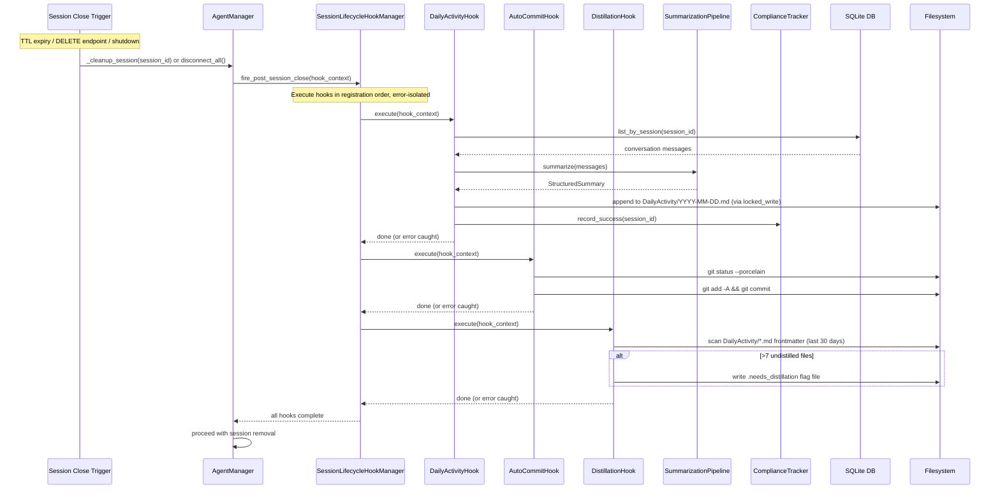

<!-- PE-REVIEWED -->
# Design Document: Memory Persistence Enforcement

## Overview

This design enforces memory persistence as a system-level behavior rather than relying on soft agent directives. The centerpiece is a **Session Lifecycle Hook Framework** — a general-purpose hook manager that fires registered callbacks when sessions truly close (TTL expiry, explicit delete, backend shutdown). Three hooks consume this framework:

1. **DailyActivity Extraction Hook** — Automatically extracts conversation summaries into `Knowledge/DailyActivity/YYYY-MM-DD.md` files using a shared Summarization Pipeline.
2. **Workspace Auto-Commit Hook** — Migrates the existing per-turn `_auto_commit_workspace()` to fire once per session close, producing cleaner git history.
3. **Distillation Trigger Hook** — Checks undistilled DailyActivity file count after extraction and writes a `.needs_distillation` flag file when the threshold (>7) is exceeded. The next session picks up the flag via system prompt injection.

The on-demand `s_save-activity` skill reuses the same Summarization Pipeline, ensuring consistent extraction logic between automatic and manual paths.

## User E2E Perspective

The complete memory lifecycle from the user's perspective, showing what already works (✅), what this spec adds (🆕), and what gets improved (🔧):

```
┌─────────────────────────────────────────────────────────────────────┐
│                     SESSION START (Loading)                         │
│                                                                     │
│  _build_system_prompt() assembles context:                          │
│    ✅ ContextDirectoryLoader.load_all()                             │
│       → Reads 10 context files from ~/.swarm-ai/.context/           │
│       → MEMORY.md at priority 7 (truncates from head = newest kept) │
│    🔧 DailyActivity loading (revised)                               │
│       → Reads last 2 DailyActivity files by date (was: today +     │
│         yesterday; now: most recent 2 files regardless of gaps)     │
│       → Per-file token cap prevents squeezing higher-priority ctx   │
│    ✅ SystemPromptBuilder adds identity, safety, datetime, runtime  │
│                                                                     │
│  Result: Agent starts with full memory context in system prompt     │
└─────────────────────────────────────────────────────────────────────┘
                              │
                              ▼
┌─────────────────────────────────────────────────────────────────────┐
│                   DURING SESSION (In-Memory)                        │
│                                                                     │
│  ✅ SDK client remembers everything within the session              │
│  ✅ User says "save memory" → s_save-memory writes to MEMORY.md    │
│  🆕 User says "save activity" → s_save-activity writes to          │
│     DailyActivity using shared SummarizationPipeline                │
│  ✅ User says "remember this" → s_save-memory (unchanged)          │
│                                                                     │
│  No automatic memory refresh needed — SDK handles in-session ctx    │
└─────────────────────────────────────────────────────────────────────┘
                              │
                              ▼
┌─────────────────────────────────────────────────────────────────────┐
│               SESSION CLOSE / EXPIRE (Recording)                    │
│                                                                     │
│  Triggers: TTL expiry (12h) │ explicit delete │ backend restart     │
│                                                                     │
│  🆕 SessionLifecycleHookManager fires post_session_close:          │
│    Hook 1: 🆕 DailyActivityExtractionHook                          │
│       → Retrieves full conversation log from DB                     │
│       → SummarizationPipeline extracts topics, decisions, files,    │
│         open questions                                              │
│       → Appends structured entry to DailyActivity/YYYY-MM-DD.md    │
│       → ComplianceTracker records success/failure                   │
│    Hook 2: 🔧 WorkspaceAutoCommitHook                              │
│       → One git commit per session (was: per message)               │
│    Hook 3: 🆕 DistillationTriggerHook                              │
│       → Checks undistilled DailyActivity count                      │
│       → If >7: writes .needs_distillation flag file                 │
│       → Next session picks up flag and prompts agent to distill     │
│                                                                     │
│  All hooks are error-isolated — failures don't block cleanup        │
└─────────────────────────────────────────────────────────────────────┘
                              │
                              ▼
┌─────────────────────────────────────────────────────────────────────┐
│                    DISTILLATION (Promotion)                          │
│                                                                     │
│  ✅ s_memory-distill (existing skill, unchanged logic):             │
│     → Scans DailyActivity files for unprocessed entries             │
│     → Extracts key decisions, lessons, patterns, corrections        │
│     → Promotes to MEMORY.md sections via locked_write.py            │
│     → Marks files as distilled: true in frontmatter                 │
│     → Archives files >30 days, deletes >90 days                    │
│                                                                     │
│  🆕 Now auto-triggered by DistillationTriggerHook (was: agent      │
│     self-compliance only)                                           │
└─────────────────────────────────────────────────────────────────────┘
                              │
                              ▼
┌─────────────────────────────────────────────────────────────────────┐
│                  NEXT SESSION START (Loop)                           │
│                                                                     │
│  ✅ _build_system_prompt() loads updated MEMORY.md + recent         │
│     DailyActivity → agent has full accumulated knowledge            │
│                                                                     │
│  The cycle repeats. Memory is never lost.                           │
└─────────────────────────────────────────────────────────────────────┘
```

### DailyActivity Loading Improvement

The current `_build_system_prompt()` loads DailyActivity for `today` and `today - 1 day`. This misses context when the user skips a day (e.g., weekend). The revised approach loads the **last 2 DailyActivity files by filesystem date** — scanning the `Knowledge/DailyActivity/` directory, sorting by filename (YYYY-MM-DD.md), and taking the 2 most recent. This is a minor code change in `_build_system_prompt()` that ensures recent context is always available regardless of gaps.

**L1 Cache Invalidation:** The DailyActivity loading happens *after* `loader.load_all()` and is appended to `context_text` outside the L1 cache. This means the L1 cache does not need invalidation — DailyActivity content is always loaded fresh from disk on every session start, which is the correct behavior since DailyActivity files change between sessions.

## Architecture

The system introduces four new backend components that integrate with the existing `AgentManager` and `SessionManager`:

```mermaid
graph TB
    subgraph "Session Close Triggers"
        TTL["TTL Expiry<br/>(stale session reaper)"]
        DEL["Explicit Delete<br/>(DELETE /api/chat/sessions/{id})"]
        SHUT["Backend Shutdown<br/>(disconnect_all)"]
    end

    subgraph "Hook Framework"
        HM["SessionLifecycleHookManager"]
        HC["HookContext<br/>(session_id, agent_id, msg_count, start_time, title)"]
    end

    subgraph "Registered Hooks (execution order)"
        H1["1. DailyActivity Extraction Hook"]
        H2["2. Workspace Auto-Commit Hook"]
        H3["3. Distillation Trigger Hook"]
    end

    subgraph "Shared Infrastructure"
        SP["SummarizationPipeline"]
        CT["ComplianceTracker"]
    end

    subgraph "Outputs"
        DA["DailyActivity/YYYY-MM-DD.md"]
        GIT["Git Commit in SwarmWS"]
        FLAG[".needs_distillation flag"]
        MEM["MEMORY.md (via s_memory-distill<br/>on next session)"]
    end

    TTL --> HM
    DEL --> HM
    SHUT --> HM
    HM --> HC
    HC --> H1
    HC --> H2
    HC --> H3
    H1 --> SP
    SP --> DA
    H1 --> CT
    H2 --> GIT
    H3 -->|">7 undistilled"| FLAG
    FLAG -->|"next session"| MEM
end
```

### Session Close Flow — All Three Triggers



### Integration Points

The hook framework integrates at three existing code paths:

| Trigger | Current Code | Integration Point |
|---|---|---|
| TTL expiry | `_cleanup_stale_sessions_loop()` → `_cleanup_session()` | Insert `await hook_manager.fire(...)` before `_active_sessions.pop()` |
| Explicit delete | `DELETE /api/chat/sessions/{id}` in `chat.py` | Insert `await hook_manager.fire(...)` before `db.messages.delete_by_session()` |
| Backend shutdown | `disconnect_all()` | Insert `await hook_manager.fire(...)` inside the session cleanup loop |

## Components and Interfaces

### 1. SessionLifecycleHookManager

The hook manager is the centerpiece — a general-purpose, memory-agnostic framework for registering and executing callbacks on session lifecycle events. It lives in a new module `backend/core/session_hooks.py`.

**Design Decisions:**
- Hooks execute in registration order so dependencies can be expressed (e.g., DailyActivity extraction before distillation trigger).
- Each hook is error-isolated: a failing hook logs the error and does not prevent subsequent hooks from running.
- Hooks run asynchronously via `asyncio.create_task` with a configurable timeout, so session cleanup is not blocked indefinitely.
- The manager is a singleton instantiated at startup and injected into `AgentManager`.

```python
# backend/core/session_hooks.py

from dataclasses import dataclass, field
from datetime import datetime
from typing import Protocol, runtime_checkable

@dataclass(frozen=True)
class HookContext:
    """Immutable context passed to every post-session-close hook."""
    session_id: str
    agent_id: str
    message_count: int
    session_start_time: str  # ISO 8601
    session_title: str

@runtime_checkable
class SessionLifecycleHook(Protocol):
    """Protocol that all session lifecycle hooks must implement."""
    @property
    def name(self) -> str: ...

    async def execute(self, context: HookContext) -> None: ...

class SessionLifecycleHookManager:
    """Manages registration and execution of session lifecycle hooks.
    
    Hooks are registered at startup and executed in registration order
    when a post_session_close event fires. Each hook is error-isolated.
    """

    def __init__(self, timeout_seconds: float = 30.0):
        self._hooks: list[SessionLifecycleHook] = []
        self._timeout = timeout_seconds

    def register(self, hook: SessionLifecycleHook) -> None:
        """Register a hook. Hooks execute in registration order."""
        self._hooks.append(hook)

    async def fire_post_session_close(self, context: HookContext) -> None:
        """Execute all registered hooks for a session close event.
        
        Each hook runs in sequence. If a hook raises, the error is logged
        and execution continues with the next hook. The entire batch is
        wrapped in asyncio.wait_for with self._timeout.
        """
        for hook in self._hooks:
            try:
                await asyncio.wait_for(
                    hook.execute(context),
                    timeout=self._timeout
                )
                logger.info(
                    "Hook '%s' completed for session %s",
                    hook.name, context.session_id
                )
            except asyncio.TimeoutError:
                logger.error(
                    "Hook '%s' timed out for session %s",
                    hook.name, context.session_id
                )
            except Exception as exc:
                logger.error(
                    "Hook '%s' failed for session %s: %s",
                    hook.name, context.session_id, exc,
                    exc_info=True
                )
```

### Hook Registration at Startup

Hooks are registered in `backend/main.py` during the `lifespan` startup phase, after `AgentManager` is configured. Registration order defines execution order:

```python
# In backend/main.py lifespan()

from core.session_hooks import SessionLifecycleHookManager
from hooks.daily_activity_hook import DailyActivityExtractionHook
from hooks.auto_commit_hook import WorkspaceAutoCommitHook
from hooks.distillation_hook import DistillationTriggerHook

hook_manager = SessionLifecycleHookManager(timeout_seconds=30.0)

# Order matters: extraction first, then commit, then distillation check
hook_manager.register(DailyActivityExtractionHook(
    summarization_pipeline=summarization_pipeline,
    compliance_tracker=compliance_tracker,
))
hook_manager.register(WorkspaceAutoCommitHook())
hook_manager.register(DistillationTriggerHook())

agent_manager.set_hook_manager(hook_manager)
```

### Hook Invocation at Session Close

The `fire_post_session_close` call is inserted at each of the three session close triggers. The hook manager builds a `HookContext` from the session's stored metadata before executing hooks.

**Trigger 1: TTL Expiry** — In `AgentManager._cleanup_session()`:
```python
async def _cleanup_session(self, session_id: str, skip_hooks: bool = False):
    info = self._active_sessions.get(session_id)  # get, NOT pop — hooks need info
    if info and self._hook_manager and not skip_hooks:
        context = await self._build_hook_context(session_id, info)
        await self._hook_manager.fire_post_session_close(context)
    # NOW pop and clean up resources
    info = self._active_sessions.pop(session_id, None)
    if info:
        wrapper = info.get("wrapper")
        try:
            if wrapper:
                await wrapper.__aexit__(None, None, None)
        except Exception as e:
            logger.warning(f"Error disconnecting session {session_id}: {e}")
    self._clients.pop(session_id, None)
```

**Critical migration note:** The current code does `self._active_sessions.pop()` as the first line. The `pop` MUST move after hook execution so hooks can access session info. Also, `_cleanup_session` is called from error-recovery paths (conversation errors at lines 1361, 1532, 2327). Those error-path calls MUST pass `skip_hooks=True` because the conversation errored out, messages may be incomplete, and the session might be recreated — hooks should only fire on intentional close.

**Trigger 2: Explicit Delete** — In `chat.py` `delete_session()`:
```python
async def delete_session(session_id: str):
    # Fire hooks BEFORE deleting data — hooks need to read messages from DB
    context = await _build_hook_context_from_db(session_id)
    if context:
        await hook_manager.fire_post_session_close(context)
    
    # Also clean up from _active_sessions if session is still live in memory
    # This prevents the stale reaper from firing hooks again later
    if session_id in agent_manager._active_sessions:
        await agent_manager._cleanup_session(session_id, skip_hooks=True)
    
    # Then delete messages and session from DB
    await db.messages.delete_by_session(session_id)
    deleted = await session_manager.delete_session(session_id)
```

**Critical migration note:** The current endpoint deletes messages first, then the session. The order MUST be reversed: fire hooks → clean up active session → delete messages → delete session. If the session is still active in `_active_sessions`, it must be removed with `skip_hooks=True` to prevent the stale reaper from firing hooks a second time.

**Trigger 3: Backend Shutdown** — In `AgentManager.disconnect_all()`:
```python
async def disconnect_all(self):
    for session_id in list(self._active_sessions.keys()):
        if self._hook_manager:
            info = self._active_sessions.get(session_id)
            context = await self._build_hook_context(session_id, info)
            await self._hook_manager.fire_post_session_close(context)
        # Skip hook firing in _cleanup_session since we already fired above
        await self._cleanup_session(session_id, skip_hooks=True)
    # ... rest of existing cleanup ...
```

**Important:** `_cleanup_session()` accepts a `skip_hooks` parameter (default `False`). When called from `disconnect_all()`, hooks are fired in the outer loop first, then `_cleanup_session(skip_hooks=True)` handles only resource cleanup. This prevents double hook execution on shutdown. The same `skip_hooks=True` pattern is used for error-recovery calls and explicit delete cleanup.

### 2. DailyActivityExtractionHook

Implements `SessionLifecycleHook`. Retrieves the conversation log from the database, passes it through the `SummarizationPipeline`, and appends the result to the DailyActivity file. Lives in `backend/hooks/daily_activity_hook.py`.

```python
class DailyActivityExtractionHook:
    name = "daily_activity_extraction"

    def __init__(self, summarization_pipeline, compliance_tracker):
        self._pipeline = summarization_pipeline
        self._tracker = compliance_tracker

    async def execute(self, context: HookContext) -> None:
        # 1. Retrieve conversation log (with message count cap for memory safety)
        messages = await db.messages.list_by_session(
            context.session_id, limit=500
        )

        # 2. Minimal entry for short conversations
        if len(messages) < 3:
            summary = self._pipeline.minimal_summary(messages)
        else:
            summary = await self._pipeline.summarize(messages)

        # 3. Write to DailyActivity file
        try:
            await write_daily_activity(summary, context)
            self._tracker.record_success(context.session_id)
        except Exception as exc:
            self._tracker.record_failure(context.session_id, str(exc))
            raise  # Re-raise so hook manager logs it

        # 4. Check distillation threshold (delegated to DistillationTriggerHook)
        #    This hook only handles extraction.
```

### 3. WorkspaceAutoCommitHook

Implements `SessionLifecycleHook`. Replaces the per-turn `_auto_commit_workspace()` call with an intelligent session-close commit. Lives in `backend/hooks/auto_commit_hook.py`.

**Design Decision:** Instead of blindly committing with the user's first message as the commit message, the hook analyzes `git diff --stat` to understand what actually changed, categorizes files by path pattern, generates a meaningful conventional commit message, and skips trivial changes.

```python
# File path → commit prefix mapping
COMMIT_CATEGORIES: dict[str, str] = {
    ".context/":        "framework",
    ".claude/skills/":  "skills",
    "Knowledge/":       "content",
    "Projects/":        "project",
}
EXTENSION_CATEGORIES: dict[str, str] = {
    ".pdf": "output", ".pptx": "output", ".docx": "output",
    ".png": "output", ".jpg": "output",
}
DEFAULT_CATEGORY = "chore"

class WorkspaceAutoCommitHook:
    name = "workspace_auto_commit"

    async def execute(self, context: HookContext) -> None:
        ws_path = initialization_manager.get_cached_workspace_path()

        def _smart_commit():
            # 1. Check for changes
            r = subprocess.run(
                ["git", "diff", "--stat", "--cached"],
                cwd=ws_path, capture_output=True, text=True,
            )
            # Also check unstaged + untracked
            status = subprocess.run(
                ["git", "status", "--porcelain"],
                cwd=ws_path, capture_output=True, text=True,
            )
            if not status.stdout.strip():
                return  # No changes

            # 2. Stage all changes
            add_result = subprocess.run(
                ["git", "add", "-A"], cwd=ws_path, capture_output=True
            )
            if add_result.returncode != 0:
                logger.warning("git add failed: %s", add_result.stderr)
                return

            # 3. Analyze staged changes
            diff_stat = subprocess.run(
                ["git", "diff", "--cached", "--stat"],
                cwd=ws_path, capture_output=True, text=True,
            )
            changed_files = self._parse_diff_stat(diff_stat.stdout)

            # 4. Skip trivial changes (only skill config syncs)
            if self._is_trivial(changed_files):
                # Still commit but with chore prefix
                message = f"chore: session sync ({len(changed_files)} files)"
            else:
                # 5. Generate smart commit message
                message = self._generate_commit_message(changed_files)

            subprocess.run(
                ["git", "commit", "-m", message],
                cwd=ws_path, capture_output=True,
            )
            logger.info("Auto-committed workspace: %s", message)

        await asyncio.to_thread(_smart_commit)

    def _parse_diff_stat(self, diff_output: str) -> list[str]:
        """Extract file paths from git diff --stat output."""
        files = []
        for line in diff_output.strip().splitlines():
            # diff --stat lines look like: " path/to/file | 3 +++"
            if "|" in line:
                file_path = line.split("|")[0].strip()
                if file_path:
                    files.append(file_path)
        return files

    def _categorize_file(self, file_path: str) -> str:
        """Map a file path to a conventional commit category."""
        for prefix, category in COMMIT_CATEGORIES.items():
            if file_path.startswith(prefix):
                return category
        for ext, category in EXTENSION_CATEGORIES.items():
            if file_path.endswith(ext):
                return category
        return DEFAULT_CATEGORY

    def _is_trivial(self, files: list[str]) -> bool:
        """Check if all changes are trivial (only skill config syncs)."""
        return all(
            self._categorize_file(f) in ("skills", "chore")
            for f in files
        )

    def _generate_commit_message(self, files: list[str]) -> str:
        """Generate a conventional commit message from changed files."""
        # Count files per category
        categories: dict[str, int] = {}
        for f in files:
            cat = self._categorize_file(f)
            categories[cat] = categories.get(cat, 0) + 1

        # Use the dominant category as the prefix
        if not categories:
            return "chore: session changes"
        dominant = max(categories, key=categories.get)
        total = sum(categories.values())

        # Build descriptive suffix
        if total == 1:
            return f"{dominant}: update {files[0]}"
        elif len(categories) == 1:
            return f"{dominant}: update {total} files"
        else:
            parts = [f"{cat} ({n})" for cat, n in sorted(
                categories.items(), key=lambda x: -x[1]
            )]
            return f"{dominant}: {', '.join(parts)}"
```

**Migration:** The existing `_auto_commit_workspace()` call at the end of `_run_query_on_client()` (after `ResultMessage`) is removed. The method itself is kept temporarily for backward compatibility but marked as deprecated.

### 4. DistillationTriggerHook

Implements `SessionLifecycleHook`. Checks undistilled DailyActivity file count and triggers `s_memory-distill` when threshold is exceeded. Lives in `backend/hooks/distillation_hook.py`.

**Design Decision:** Since `s_memory-distill` is an agent skill (requires a Claude SDK session to execute), and the session is closing, the hook cannot invoke it directly. Instead, the hook writes a **distillation flag file** at `Knowledge/DailyActivity/.needs_distillation`. The next session's `_build_system_prompt()` checks for this flag and injects a system-level instruction requesting the agent to run distillation. This is a reliable handoff: the hook guarantees the flag is set, and the system prompt guarantees the agent sees it.

```python
class DistillationTriggerHook:
    name = "distillation_trigger"
    UNDISTILLED_THRESHOLD = 7
    FLAG_FILENAME = ".needs_distillation"

    async def execute(self, context: HookContext) -> None:
        ws_path = initialization_manager.get_cached_workspace_path()
        da_dir = Path(ws_path) / "Knowledge" / "DailyActivity"

        if not da_dir.exists():
            return

        undistilled_count = await asyncio.to_thread(
            self._count_undistilled, da_dir
        )

        if undistilled_count > self.UNDISTILLED_THRESHOLD:
            logger.info(
                "Distillation threshold exceeded (%d > %d), setting flag",
                undistilled_count, self.UNDISTILLED_THRESHOLD
            )
            flag_path = da_dir / self.FLAG_FILENAME
            flag_path.write_text(
                f"undistilled_count={undistilled_count}\n"
                f"flagged_at={datetime.now().isoformat()}\n",
                encoding="utf-8",
            )

    def _count_undistilled(self, da_dir: Path) -> int:
        """Count DailyActivity files where distilled != true.
        
        Only checks files from the last 30 days to bound scan scope.
        Older files should already be archived by s_memory-distill.
        """
        count = 0
        cutoff = date.today() - timedelta(days=30)
        for f in da_dir.glob("*.md"):
            # Parse date from filename (YYYY-MM-DD.md)
            try:
                file_date = date.fromisoformat(f.stem)
                if file_date < cutoff:
                    continue
            except ValueError:
                continue  # Skip non-date filenames
            content = f.read_text(encoding="utf-8")
            if not self._is_distilled(content):
                count += 1
        return count

    @staticmethod
    def _is_distilled(content: str) -> bool:
        """Parse YAML frontmatter and check distilled field."""
        if not content.startswith("---"):
            return False
        end = content.find("---", 3)
        if end == -1:
            return False
        frontmatter = content[3:end].strip()
        return "distilled: true" in frontmatter
```

**System prompt integration:** In `_build_system_prompt()`, after loading DailyActivity files, check for the flag:
```python
flag_path = daily_activity_dir / ".needs_distillation"
if flag_path.is_file():
    context_text += "\n\n## Memory Maintenance Required\nRun the s_memory-distill skill now — there are undistilled DailyActivity files that need promotion to MEMORY.md. After distillation completes, delete the flag file."
```

### 5. SummarizationPipeline

Shared extraction logic used by both the automatic `DailyActivityExtractionHook` and the on-demand `s_save-activity` skill. Lives in `backend/core/summarization.py`.

```python
@dataclass
class StructuredSummary:
    """Output of the summarization pipeline."""
    topics: list[str]
    decisions: list[str]
    files_modified: list[str]
    open_questions: list[str]
    session_title: str
    timestamp: str  # HH:MM format

class SummarizationPipeline:
    """Converts conversation logs into structured summaries.
    
    Extraction is rule-based (no LLM call) for speed and determinism:
    - Topics: extracted from user messages by taking the first sentence
      (up to first period or 80 chars) of each user message with role="user"
    - Decisions: extracted from assistant messages matching patterns:
      "decided to", "chose", "will use", "going with", "recommend",
      "the approach is", "selected" (case-insensitive regex)
    - Files: extracted from tool_use content blocks where tool name matches
      Write|Edit|Read|Bash, parsing file paths from the input JSON
    - Open questions: extracted from ask_user_question tool_use blocks
      by reading the "question" field from the input
    
    Deduplication: topics and files are deduplicated by exact string match.
    Ordering: all lists preserve chronological order from the conversation.
    """
    MAX_WORDS_PER_ENTRY = 500

    async def summarize(self, messages: list[dict]) -> StructuredSummary:
        """Full summarization for conversations with 3+ messages."""
        ...

    def minimal_summary(self, messages: list[dict]) -> StructuredSummary:
        """Minimal summary (topics only) for short conversations."""
        ...

    def _extract_topics(self, messages: list[dict]) -> list[str]: ...
    def _extract_decisions(self, messages: list[dict]) -> list[str]: ...
    def _extract_files(self, messages: list[dict]) -> list[str]: ...
    def _extract_open_questions(self, messages: list[dict]) -> list[str]: ...
```

### 6. ComplianceTracker

Tracks extraction metrics for observability. Lives in `backend/core/compliance.py`. Exposed via `/api/memory-compliance`.

```python
@dataclass
class DailyMetrics:
    """Metrics for a single day."""
    date: str  # YYYY-MM-DD
    sessions_processed: int = 0
    files_written: int = 0
    failures: int = 0
    failure_reasons: list[str] = field(default_factory=list)

class ComplianceTracker:
    """Tracks DailyActivity extraction metrics.
    
    In-memory store with 30-day retention. No lock needed — all hook
    execution is sequential within fire_post_session_close(), and
    concurrent session closes each get their own tracker calls that
    operate on different date keys (no contention).
    """
    RETENTION_DAYS = 30

    def __init__(self):
        self._metrics: dict[str, DailyMetrics] = {}

    def record_success(self, session_id: str) -> None: ...
    def record_failure(self, session_id: str, reason: str) -> None: ...
    def get_metrics(self, days: int = 30) -> list[DailyMetrics]: ...
    def _prune_old(self) -> None: ...
```

### 7. On-Demand `s_save-activity` Skill

A new skill at `backend/skills/s_save-activity/` that the agent invokes when the user says "save activity". It reuses the `SummarizationPipeline` for consistent extraction.

The skill is agent-invoked (like `s_save-memory`), meaning the agent calls it as a tool during conversation. The key difference from the automatic hook is:
- It operates on the **current** conversation up to the current point (not a closed session)
- It confirms the write to the user
- It uses the same `SummarizationPipeline` and `write_daily_activity()` function

### 8. DailyActivity File Writer

A shared utility function in `backend/core/daily_activity_writer.py` that handles the file format, frontmatter management, and concurrent-safe writes. Uses its own atomic write logic (not `locked_write.py`, which is designed for MEMORY.md's section-based append pattern).

```python
async def write_daily_activity(
    summary: StructuredSummary,
    context: HookContext,
) -> Path:
    """Append a session entry to today's DailyActivity file.
    
    - Creates the file with YAML frontmatter if it doesn't exist
    - Appends a new ## Session — HH:MM section
    - Increments sessions_count in frontmatter
    - Uses atomic read-modify-write with fcntl.flock for concurrency safety
      (separate from locked_write.py which is MEMORY.md-specific)
    
    Returns the path to the written file.
    """
    ...

def parse_frontmatter(content: str) -> tuple[dict, str]:
    """Parse YAML frontmatter from a DailyActivity file.
    Returns (frontmatter_dict, body_content).
    
    Normalizes values: booleans to Python bool, integers to int,
    strings remain as-is. This ensures round-trip equivalence is
    defined as semantic equality (not byte-for-byte identity).
    """
    ...

def write_frontmatter(frontmatter: dict, body: str) -> str:
    """Serialize frontmatter dict and body back to file content.
    
    Round-trip safe with parse_frontmatter when compared via
    semantic equality: parse_frontmatter(write_frontmatter(fm, body))
    returns (fm, body) where fm values are semantically equal
    (e.g., True == True regardless of YAML serialization as 'true' or 'True').
    """
    ...
```

### Component Dependency Graph

```
main.py (startup)
  ├── creates SummarizationPipeline
  ├── creates ComplianceTracker
  ├── creates SessionLifecycleHookManager
  │     ├── registers DailyActivityExtractionHook(pipeline, tracker)
  │     ├── registers WorkspaceAutoCommitHook()
  │     └── registers DistillationTriggerHook()
  └── injects hook_manager into AgentManager

AgentManager
  ├── _cleanup_session() → hook_manager.fire_post_session_close()
  └── disconnect_all()   → hook_manager.fire_post_session_close() per session

chat.py
  └── delete_session()   → hook_manager.fire_post_session_close()

s_save-activity (skill)
  └── uses SummarizationPipeline + write_daily_activity() directly
```

## Data Models

### HookContext

Immutable dataclass passed to every hook. Built from `_active_sessions` dict (for TTL/shutdown triggers) or from the database (for explicit delete trigger).

```python
@dataclass(frozen=True)
class HookContext:
    session_id: str           # The session being closed
    agent_id: str             # Agent that owned the session
    message_count: int        # Number of messages in the conversation
    session_start_time: str   # ISO 8601 timestamp
    session_title: str        # Session title for commit messages / headers
```

**Building HookContext from `_active_sessions`:**
```python
async def _build_hook_context(self, session_id: str, info: dict) -> HookContext:
    message_count = await db.messages.count_by_session(session_id)
    session = await session_manager.get_session(session_id)
    return HookContext(
        session_id=session_id,
        agent_id=info.get("agent_id", session.agent_id if session else ""),
        message_count=message_count,
        session_start_time=session.created_at if session else "",
        session_title=session.title if session else "Unknown",
    )
```

**Note:** Uses `db.messages.count_by_session()` (a `SELECT COUNT(*)` query) instead of loading all messages just for a count. The full message list is loaded later by the extraction hook only when needed.

**Building HookContext from DB (for explicit delete):**
```python
async def _build_hook_context_from_db(session_id: str) -> HookContext | None:
    session = await session_manager.get_session(session_id)
    if not session:
        return None
    message_count = await db.messages.count_by_session(session_id)
    return HookContext(
        session_id=session_id,
        agent_id=session.agent_id,
        message_count=message_count,
        session_start_time=session.created_at,
        session_title=session.title,
    )
```

### StructuredSummary

Output of the `SummarizationPipeline`. Consumed by `write_daily_activity()`.

```python
@dataclass
class StructuredSummary:
    topics: list[str]           # Primary subjects discussed
    decisions: list[str]        # Explicit choices/recommendations made
    files_modified: list[str]   # File paths from tool_use events
    open_questions: list[str]   # Unresolved questions from ask_user_question
    session_title: str          # For the ## Session heading
    timestamp: str              # HH:MM for the session entry header
```

### DailyActivity File Format

```yaml
---
date: "2025-07-15"
sessions_count: 2
distilled: false
---

## Session — 14:30 | 9240de91 | Implemented session lifecycle hook framework

### What Happened
- Implemented session lifecycle hook framework
- Debugged SQLite connection pooling issue

### Key Decisions
- Chose Protocol-based hook interface over ABC for flexibility
- Decided to keep extraction rule-based (no LLM) for speed

### Files Modified
- backend/core/session_hooks.py
- backend/core/agent_manager.py
- backend/hooks/daily_activity_hook.py

### Open Questions
- Should distillation threshold be configurable via settings?

## Session — 17:45 | 7a3e4821 | Code review feedback on hook error isolation

### What Happened
- Code review feedback on hook error isolation

### Key Decisions
- Added per-hook timeout of 30 seconds

### Files Modified
- backend/core/session_hooks.py

### Open Questions
(none)
```

### DailyMetrics (Compliance)

```python
@dataclass
class DailyMetrics:
    date: str                          # YYYY-MM-DD
    sessions_processed: int = 0        # Total sessions that triggered extraction
    files_written: int = 0             # Successful DailyActivity writes
    failures: int = 0                  # Failed extraction attempts
    failure_reasons: list[str] = field(default_factory=list)
```

### Compliance API Response

```json
GET /api/memory-compliance

{
  "metrics": [
    {
      "date": "2025-07-15",
      "sessions_processed": 5,
      "files_written": 5,
      "failures": 0,
      "failure_reasons": []
    },
    {
      "date": "2025-07-14",
      "sessions_processed": 3,
      "files_written": 2,
      "failures": 1,
      "failure_reasons": ["IOError: disk full"]
    }
  ],
  "retention_days": 30
}
```

### New File Structure

```
backend/
├── core/
│   ├── session_hooks.py          # SessionLifecycleHookManager, HookContext, Protocol
│   ├── summarization.py          # SummarizationPipeline, StructuredSummary
│   ├── daily_activity_writer.py  # write_daily_activity, parse/write_frontmatter
│   └── compliance.py             # ComplianceTracker, DailyMetrics
├── hooks/
│   ├── __init__.py
│   ├── daily_activity_hook.py    # DailyActivityExtractionHook
│   ├── auto_commit_hook.py       # WorkspaceAutoCommitHook
│   └── distillation_hook.py      # DistillationTriggerHook
├── routers/
│   └── memory.py                 # /api/memory-compliance endpoint
└── skills/
    └── s_save-activity/
        └── SKILL.md              # On-demand DailyActivity save skill
```

## Correctness Properties

*A property is a characteristic or behavior that should hold true across all valid executions of a system — essentially, a formal statement about what the system should do. Properties serve as the bridge between human-readable specifications and machine-verifiable correctness guarantees.*

### Property 1: Hooks execute in registration order

*For any* list of hooks registered with the `SessionLifecycleHookManager`, when `fire_post_session_close` is called, all hooks shall execute exactly once and in the exact order they were registered.

**Validates: Requirements 1.1, 1.2**

### Property 2: Error isolation preserves remaining hook execution

*For any* list of registered hooks where an arbitrary subset raises exceptions, all non-failing hooks shall still execute, and the hook manager shall not propagate exceptions to the caller.

**Validates: Requirements 1.3, 2.6, 3.5, 5.5**

### Property 3: Hook context is passed faithfully to all hooks

*For any* `HookContext` and any list of registered hooks, when `fire_post_session_close` is called, every hook shall receive the identical `HookContext` instance containing session_id, agent_id, message_count, session_start_time, and session_title.

**Validates: Requirements 1.4**

### Property 4: DailyActivity write appends and preserves existing content

*For any* existing DailyActivity file content and any new `StructuredSummary`, calling `write_daily_activity` shall produce a file that contains all original content unchanged plus the new session entry appended at the end.

**Validates: Requirements 2.4, 2.5, 4.3**

### Property 5: Short conversations produce minimal entries

*For any* conversation log with fewer than 3 messages, the `SummarizationPipeline` shall produce a `StructuredSummary` where only the `topics` field is non-empty, and `decisions`, `files_modified`, and `open_questions` are empty lists.

**Validates: Requirements 2.7**

### Property 6: Auto-commit generates conventional commit messages from diffs

*For any* set of changed files in the workspace, the `WorkspaceAutoCommitHook` shall produce a git commit whose message starts with a valid conventional commit prefix (`framework:`, `skills:`, `content:`, `project:`, `output:`, or `chore:`) derived from the dominant file path category, not from the user's first message.

**Validates: Requirements 3.2, 3.3**

### Property 7: Distillation triggers iff undistilled count exceeds threshold

*For any* set of DailyActivity files with varying `distilled` frontmatter values, the `DistillationTriggerHook` shall trigger distillation if and only if the count of files where `distilled` is not `true` exceeds 7.

**Validates: Requirements 5.3, 5.4**

### Property 8: DailyActivity file structure is correct

*For any* written DailyActivity file, the file shall contain: (a) YAML frontmatter with `date` (YYYY-MM-DD string), `sessions_count` (integer), and `distilled` (boolean) fields; (b) each session entry under a `## Session — HH:MM` heading; (c) subsections `### Topics`, `### Decisions`, `### Files Modified`, `### Open Questions` within each session entry.

**Validates: Requirements 7.1, 7.2, 7.3**

### Property 9: Frontmatter round-trip

*For any* valid DailyActivity file content, `parse_frontmatter(write_frontmatter(parse_frontmatter(content)))` shall produce a frontmatter dict semantically equal to `parse_frontmatter(content)` — where semantic equality means booleans compare as booleans, integers as integers, and strings as strings, regardless of YAML serialization differences (e.g., `true` vs `True`).

**Validates: Requirements 7.4**

### Property 10: Sessions count increments on append

*For any* DailyActivity file with `sessions_count = N`, after appending one new session entry via `write_daily_activity`, the resulting file's `sessions_count` shall equal `N + 1`.

**Validates: Requirements 7.5**

### Property 11: Tool-use file paths and ask_user_question events are fully captured

*For any* conversation log containing `tool_use` events of type Write, Edit, Read, or Bash with file paths, and any `ask_user_question` events, the `SummarizationPipeline` output shall include all those file paths in `files_modified` and all those questions in `open_questions`.

**Validates: Requirements 6.4, 6.5**

### Property 12: Summary word count does not exceed 500

*For any* conversation log, the total word count of the `StructuredSummary` produced by the `SummarizationPipeline` (across all fields) shall not exceed 500 words.

**Validates: Requirements 6.6**

### Property 13: Summarization is deterministic

*For any* conversation log, calling `SummarizationPipeline.summarize()` twice with the same input shall produce identical `StructuredSummary` output.

**Validates: Requirements 6.7**

### Property 14: Compliance counters accurately reflect operations

*For any* sequence of `record_success` and `record_failure` calls to the `ComplianceTracker`, the reported `sessions_processed` shall equal the total call count, `files_written` shall equal the success count, `failures` shall equal the failure count, and each failure reason shall be recorded.

**Validates: Requirements 8.1, 8.3, 8.4**

### Property 15: Compliance metrics retain only 30 days

*For any* sequence of metrics recorded across more than 30 distinct dates, `get_metrics()` shall return metrics for at most the 30 most recent dates, with older entries pruned.

**Validates: Requirements 8.5**

### Property 16: DailyActivity loading selects last 2 files by date

*For any* set of DailyActivity files with YYYY-MM-DD.md filenames (including gaps in dates), `_build_system_prompt()` shall load exactly the 2 files with the most recent dates (by filename sort), regardless of whether those dates are consecutive or include today.

**Validates: Requirements 9.1, 9.2**

### Property 17: Distillation flag file triggers system prompt injection

*For any* session start where `Knowledge/DailyActivity/.needs_distillation` exists, `_build_system_prompt()` shall include a "Memory Maintenance Required" section in the assembled context instructing the agent to run `s_memory-distill`.

**Validates: Requirements 5.3, 5.4**

## Error Handling

### Hook-Level Error Isolation

The `SessionLifecycleHookManager` is the primary error boundary. Each hook executes inside a `try/except` block that:
1. Catches all exceptions (including `asyncio.TimeoutError`)
2. Logs the error with hook name, session ID, and full traceback at ERROR level
3. Continues to the next hook — no hook failure can prevent other hooks from running
4. Never propagates exceptions to the caller (`_cleanup_session`, `delete_session`, `disconnect_all`)

This means session cleanup always completes, even if all hooks fail.

### Per-Hook Error Strategies

| Hook | Failure Mode | Handling |
|---|---|---|
| DailyActivityExtractionHook | DB read fails | Log error, record failure in ComplianceTracker, re-raise for hook manager to catch |
| DailyActivityExtractionHook | File write fails (disk full, permissions) | Log error, record failure in ComplianceTracker, re-raise |
| DailyActivityExtractionHook | Summarization produces empty output | Write minimal entry with empty sections (not an error) |
| WorkspaceAutoCommitHook | `git` not installed or not a repo | `subprocess.run` returns non-zero, log warning, return silently |
| WorkspaceAutoCommitHook | No uncommitted changes | Skip silently (not an error) |
| DistillationTriggerHook | DailyActivity directory doesn't exist | Return silently (no files to check) |
| DistillationTriggerHook | Distillation skill invocation fails | Log error, re-raise for hook manager to catch |
| ComplianceTracker | Internal error during metric recording | Catch and log at WARNING — never block the hook that called it |

### Timeout Protection

Each hook has a 30-second timeout enforced by `asyncio.wait_for`. If a hook exceeds this:
- `asyncio.TimeoutError` is raised and caught by the hook manager
- The timed-out hook's coroutine is cancelled
- Remaining hooks proceed normally
- The timeout is logged at ERROR level

### Graceful Shutdown Edge Cases

During backend shutdown (`disconnect_all`):
- Hooks fire for each active session sequentially
- If the process receives SIGTERM during hook execution, Python's asyncio shutdown will cancel pending tasks
- The hook manager does not attempt to persist partial state — the next startup will not retry failed hooks
- This is acceptable because DailyActivity extraction is best-effort; the conversation data remains in the database and can be extracted later if needed

### HookContext Construction Failures

If building a `HookContext` fails (e.g., session not found in DB during explicit delete):
- The hook firing is skipped entirely for that session
- A WARNING is logged
- Session deletion proceeds normally

## Testing Strategy

### Property-Based Testing Library

**Library:** [Hypothesis](https://hypothesis.readthedocs.io/) for Python property-based testing. Already available in the Python ecosystem and compatible with pytest.

**Configuration:** Each property test runs a minimum of 100 examples (`@settings(max_examples=100)`).

**Tagging:** Each property test includes a docstring comment referencing the design property:
```python
# Feature: memory-persistence-enforcement, Property 1: Hooks execute in registration order
```

### Property-Based Tests

Each correctness property maps to a single property-based test:

| Property | Test Description | Generator Strategy |
|---|---|---|
| P1: Hook execution order | Generate random lists of mock hooks, fire event, verify execution log matches registration order | `st.lists(st.text())` for hook names |
| P2: Error isolation | Generate hook lists with random failure positions (booleans), verify non-failing hooks all execute | `st.lists(st.booleans())` for fail/pass per hook |
| P3: Context passing | Generate random HookContext fields, verify each hook receives identical context | `st.builds(HookContext, ...)` |
| P4: Append preserves content | Generate random existing file content + new summary, verify original content preserved | `st.text()` for existing content, `st.builds(StructuredSummary)` |
| P5: Short conversation minimal entry | Generate conversations with 0-2 messages, verify only topics populated | `st.lists(st.fixed_dictionaries(...), max_size=2)` |
| P6: Commit message contains title | Generate random session titles, verify commit message contains truncated title | `st.text(min_size=1, max_size=100)` |
| P7: Distillation threshold | Generate sets of files with random distilled states, verify trigger iff count > 7 | `st.lists(st.booleans())` for distilled flags |
| P8: File structure | Generate random summaries, write to file, parse and verify structure | `st.builds(StructuredSummary)` |
| P9: Frontmatter round-trip | Generate random frontmatter dicts + body content, verify parse→write round-trip | `st.fixed_dictionaries(...)` + `st.text()` |
| P10: Sessions count increment | Generate files with random sessions_count, append, verify N+1 | `st.integers(min_value=0, max_value=100)` |
| P11: Tool-use extraction | Generate conversations with random tool_use and ask_user_question events, verify all captured | `st.lists(st.sampled_from(["Write","Edit","Read","Bash"]))` |
| P12: Word count limit | Generate large conversation logs, verify summary ≤ 500 words | `st.lists(st.text(min_size=50), min_size=10)` |
| P13: Determinism | Generate random conversation logs, call summarize twice, verify identical output | `st.lists(st.fixed_dictionaries(...))` |
| P14: Compliance counters | Generate random sequences of success/failure calls, verify counts match | `st.lists(st.sampled_from(["success", "failure"]))` |
| P15: 30-day retention | Generate metrics across 40+ dates, verify only 30 most recent retained | `st.lists(st.dates(), min_size=31)` |

### Unit Tests

Unit tests complement property tests by covering specific examples, integration points, and edge cases:

**Hook Framework (unit):**
- Empty hook list: `fire_post_session_close` with no hooks registered completes without error
- Single hook timeout: verify timeout cancels the hook and logs error
- TTL trigger integration: mock `_cleanup_session` and verify hooks fire before session removal
- DELETE trigger integration: mock `delete_session` endpoint and verify hooks fire before data deletion
- Shutdown trigger integration: mock `disconnect_all` and verify hooks fire for each active session

**DailyActivity Extraction (unit):**
- Hook is registered at startup (verify registration in `main.py` lifespan)
- Conversation log retrieval calls `db.messages.list_by_session`
- Empty conversation (0 messages) produces valid but minimal file
- File creation when DailyActivity directory doesn't exist

**Workspace Auto-Commit (unit):**
- No uncommitted changes: verify no git commit is created
- Git not available: verify graceful failure
- Migration verification: confirm `_auto_commit_workspace()` call removed from `_run_query_on_client`

**Summarization Pipeline (unit):**
- Known conversation with specific tool_use events → verify exact file paths extracted
- Known conversation with ask_user_question → verify exact questions extracted
- Conversation with no tool_use events → empty files_modified list

**Compliance (unit):**
- API endpoint returns correct JSON structure
- Metrics for today after 3 successes and 1 failure
- Pruning: add metrics for 35 days, verify only 30 remain

**DailyActivity Writer (unit):**
- New file creation with correct frontmatter defaults (`distilled: false`, `sessions_count: 1`)
- Append to existing file preserves all content
- Concurrent writes via locked_write don't corrupt file (integration test with threading)

### Test File Organization

```
backend/tests/
├── test_session_hooks.py              # P1, P2, P3 + unit tests
├── test_daily_activity_hook.py        # P4, P5, P8 + unit tests
├── test_auto_commit_hook.py           # P6 + unit tests
├── test_distillation_hook.py          # P7 + unit tests
├── test_summarization_pipeline.py     # P11, P12, P13 + unit tests
├── test_daily_activity_writer.py      # P9, P10 + unit tests
└── test_compliance_tracker.py         # P14, P15 + unit tests
```

### Running Tests

```bash
# All tests
cd backend && pytest

# Only property tests (tagged with hypothesis)
cd backend && pytest -m hypothesis

# Specific test file
cd backend && pytest tests/test_session_hooks.py -v
```
