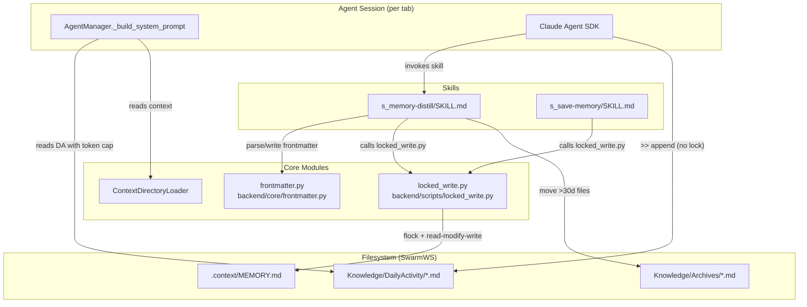
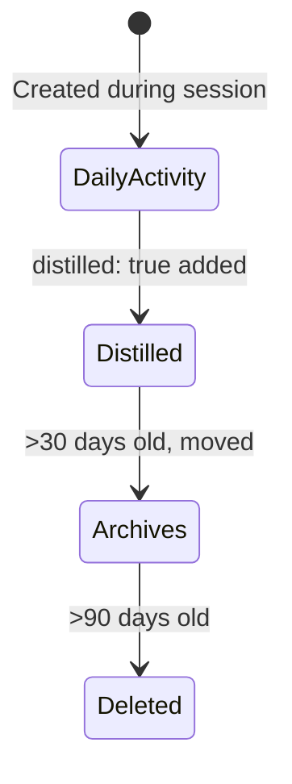

<!-- PE-REVIEWED -->
# Design Document: Memory System Robustness

## Overview

This design addresses five reliability concerns in SwarmAI's memory system: concurrent write corruption, unbounded token injection, fragile distillation, unreliable processed-file detection, and session-end hooks that never fire. The solution introduces a cross-platform file lock manager, a token cap applied at prompt-assembly time, a structured distillation skill, YAML frontmatter-based state tracking, and a session-start Open Threads review.

All changes are confined to the Python backend (`backend/core/`) and the skill/template layer (`backend/skills/`, `backend/context/`). No frontend changes are required. The design preserves backward compatibility — existing DailyActivity files without frontmatter are treated as unprocessed, and MEMORY.md's structure is unchanged.

## Architecture



### Key Design Decisions

1. **Append-only DailyActivity, no lock needed** — DailyActivity files are append-only. The agent appends observations using `>>` (shell append) or the SDK Write tool in append mode. OS-level `O_APPEND` guarantees atomic appends even from concurrent processes. No file lock is needed for DailyActivity writes.

2. **File lock only for MEMORY.md read-modify-write** — MEMORY.md requires read-modify-write (read current content → modify a section → write back). This is the only file that needs locking. The lock is applied by the `s_memory-distill` skill (via a helper script) and the `s_save-memory` skill. In practice, concurrent MEMORY.md writes are rare: only "remember this" commands and distillation trigger writes, and these don't happen simultaneously across tabs.

3. **Simple lock via helper script, not API integration** — Instead of hooking into the SDK's Write tool or the workspace API, the distillation and save-memory skills call a small Python helper script (`backend/scripts/locked_write.py`) that acquires a file lock, performs the read-modify-write, and releases the lock. This keeps the lock mechanism self-contained and doesn't require changes to the SDK integration or API layer.

4. **Token cap at prompt-assembly, not on disk** — DailyActivity files on disk are never modified by the cap. Truncation is ephemeral, applied in `_build_system_prompt()` right before injection. This preserves the full log for distillation.

5. **Frontmatter over file moves** — Processing state is tracked via `distilled: true` in YAML frontmatter rather than moving files between directories. Files stay in `DailyActivity/` until the 30-day auto-prune. This eliminates the fragile "is it in Archives?" heuristic.

6. **Skill-based distillation, not Python code** — The distillation logic lives in `SKILL.md` (markdown instructions for the Claude agent), not in Python. The agent executes it via the SDK's built-in skill mechanism. This keeps the logic auditable and editable by users.

7. **Session-start over session-end** — The Claude Agent SDK has no reliable session-end hook. Moving Open Threads review to session-start guarantees it actually runs.


## Components and Interfaces

### 1. Locked Write Script (`backend/scripts/locked_write.py`)

A self-contained CLI script that performs locked read-modify-write on MEMORY.md. No separate `FileLockManager` module — the locking logic is inlined in this single script for simplicity.

```python
"""Locked read-modify-write for MEMORY.md.

A CLI script called by the distillation and save-memory skills to safely
modify MEMORY.md under an advisory file lock.  Inlines the locking logic
(fcntl.flock on Unix) — no separate FileLockManager module needed.

Usage:
    python locked_write.py --file PATH --section SECTION --append TEXT
    python locked_write.py --file PATH --section SECTION --replace TEXT
"""

import argparse
import fcntl
import sys
import time
from pathlib import Path

LOCK_TIMEOUT = 5.0  # seconds

def locked_read_modify_write(file_path: Path, section: str, text: str, mode: str = "append"):
    """Acquire flock, read file, modify section, write back, release."""
    lock_path = file_path.with_suffix(file_path.suffix + ".lock")
    lock_path.parent.mkdir(parents=True, exist_ok=True)

    fd = open(lock_path, "w")
    try:
        # Acquire lock with retry
        deadline = time.monotonic() + LOCK_TIMEOUT
        while True:
            try:
                fcntl.flock(fd, fcntl.LOCK_EX | fcntl.LOCK_NB)
                break
            except BlockingIOError:
                if time.monotonic() >= deadline:
                    print(f"ERROR: Lock timeout on {file_path}", file=sys.stderr)
                    sys.exit(1)
                time.sleep(0.1)

        # Read current content
        content = file_path.read_text(encoding="utf-8") if file_path.exists() else ""

        # Find section and modify
        # ... (section append/replace logic)

        # Write back
        file_path.write_text(content, encoding="utf-8")
    finally:
        fcntl.flock(fd, fcntl.LOCK_UN)
        fd.close()
```

**Key points:**
- Single file, no module dependency — the skills call it via `python backend/scripts/locked_write.py`
- Uses `fcntl.flock()` directly (macOS/Linux only — SwarmAI is a desktop app, Windows support is best-effort)
- Lock file is `{path}.lock` sibling — added to `.gitignore`
- No `FileLockManager` module, no `file_lock_manager.py` — keeps it simple

### 2. Frontmatter Parser (`backend/core/frontmatter.py`)

New utility module for YAML frontmatter round-tripping.

```python
"""YAML frontmatter parser and printer for DailyActivity Markdown files.

Public symbols:
- ``parse_frontmatter``  — (content: str) -> tuple[dict, str]
- ``write_frontmatter``  — (metadata: dict, body: str) -> str
"""
import logging
import yaml
from typing import Any

logger = logging.getLogger(__name__)

def parse_frontmatter(content: str) -> tuple[dict[str, Any], str]:
    """Parse YAML frontmatter from a Markdown string.

    Returns (metadata_dict, body_str). If no frontmatter block is found
    or YAML is malformed, returns ({}, full_content) and logs a warning
    for malformed cases.
    """
    ...

def write_frontmatter(metadata: dict[str, Any], body: str) -> str:
    """Produce a Markdown string with YAML frontmatter.

    Output format::

        ---
        key: value
        ---

        body text here
    """
    ...
```

**Implementation details:**
- `parse_frontmatter`: checks if content starts with `---\n`, finds the closing `---\n`, parses the YAML between them with `yaml.safe_load()`. If YAML parsing fails, logs a warning and returns `({}, content)`.
- `write_frontmatter`: uses `yaml.dump(metadata, default_flow_style=False)` between `---` delimiters. Ensures a blank line between the closing `---` and the body. If metadata is empty, returns just the body (no empty frontmatter block).

### 3. Token-Capped DailyActivity Injection (modification to `AgentManager._build_system_prompt`)

Modify the existing DailyActivity reading block in `_build_system_prompt()` to apply a 2000-token cap per file.

```python
# In _build_system_prompt(), replace the DailyActivity reading block:
TOKEN_CAP_PER_DAILY_FILE = 2000
TRUNCATION_MARKER = "[Truncated: kept newest ~2000 tokens]"

if daily_activity_dir.is_dir():
    today = date.today()
    for d in [today, today - timedelta(days=1)]:
        daily_file = daily_activity_dir / f"{d.isoformat()}.md"
        if daily_file.is_file():
            try:
                daily_content = daily_file.read_text(encoding="utf-8").strip()
                if daily_content:
                    token_count = ContextDirectoryLoader.estimate_tokens(daily_content)
                    if token_count > TOKEN_CAP_PER_DAILY_FILE:
                        daily_content = _truncate_daily_content(
                            daily_content, TOKEN_CAP_PER_DAILY_FILE
                        )
                    context_text += (
                        f"\n\n## Daily Activity ({d.isoformat()})\n{daily_content}"
                    )
            except (OSError, UnicodeDecodeError):
                pass
```

The `_truncate_daily_content` helper:
- Uses word-based truncation (same approach as `_truncate_section` in `_enforce_token_budget()`)
- Keeps the last N words where N = `TOKEN_CAP_PER_DAILY_FILE * 3/4` (inverse of the 4/3 token estimation)
- Prepends the `TRUNCATION_MARKER`
- O(1) word count + O(1) join — no iterative re-estimation


### 4. Distillation Skill (`backend/skills/s_memory-distill/SKILL.md`)

New built-in skill providing structured distillation instructions. This is a Markdown file consumed by the Claude agent, not Python code.

**Skill structure:**
```
backend/skills/s_memory-distill/
└── SKILL.md
```

**SKILL.md frontmatter:**
```yaml
---
name: Memory Distill
description: >
  Distill unprocessed DailyActivity files into MEMORY.md. Auto-triggers
  when >7 unprocessed files are detected at session start. Runs silently.
---
```

**Skill instructions (key sections):**
1. **Detection**: Scan `Knowledge/DailyActivity/*.md`, parse frontmatter, count files without `distilled: true`. If count ≤ 7, exit silently.
2. **Extraction**: For each unprocessed file, extract: key decisions, lessons learned, recurring themes, user corrections, error resolutions.
3. **Writing**: Acquire file lock on MEMORY.md. Read current content. Append distilled content to the appropriate sections (Recent Context, Key Decisions, Lessons Learned, Open Threads). If a target section is not found (user may have renamed or removed it), append to the end of the file under a `## Distilled` fallback section. Write back. Release lock.
4. **Marking**: For each processed file, acquire file lock, add `distilled: true` and `distilled_date: YYYY-MM-DD` to frontmatter, release lock.
5. **Archiving**: Move DailyActivity files older than 30 days to `Knowledge/Archives/`. Delete archived files older than 90 days.
6. **Open Threads**: Cross-reference recent DailyActivity files for thread completions and update the Open Threads section.
7. **Silence**: All operations are silent to the user — no announcements, no permission requests. However, the skill SHALL log at INFO level: "Distilled N DailyActivity files, promoted M entries to MEMORY.md" for observability.

The skill instructs the agent to write to MEMORY.md using a locked write pattern. The agent calls a helper script `backend/scripts/locked_write.py` that:
1. Acquires `file_lock(MEMORY.md)`
2. Reads current content
3. Applies the modification (append to section)
4. Writes back
5. Releases lock in `finally`

For DailyActivity writes, the agent uses standard append (`>>`) — no lock needed. The OS guarantees atomic appends via `O_APPEND`.

### 5. Template Changes (AGENT.md, STEERING.md)

**AGENT.md** — In the "Memory Writing Rules" section:
- Replace: `At session end: update MEMORY.md's "Open Threads" if there are unfinished tasks`
- With: `At session start: review MEMORY.md's "Open Threads" section and update based on completed work since last session`

**STEERING.md** — In the "Memory Protocol" section:
- Replace the "At session end (if asked)" block with an "At session start" block:
  ```
  **At session start:**
  - Read MEMORY.md silently (loaded via system prompt)
  - Read today's and yesterday's DailyActivity files for recent context
  - Review "Open Threads" section — mark completed items, add new ones
  - Don't announce any of this
  ```

### 6. Integration Points

| Call site | What changes | Lock needed? |
|---|---|---|
| `_build_system_prompt()` | Add token cap to DailyActivity injection | No (read-only) |
| `s_save-memory/SKILL.md` | Instruct agent to use `locked_write.py` for MEMORY.md writes | Yes (MEMORY.md only) |
| `s_memory-distill/SKILL.md` | New skill: distill, mark frontmatter, archive | Yes (MEMORY.md only) |
| DailyActivity writes | Agent uses `>>` append — OS atomic | No (append-only) |
| `AGENT.md` template | Session-start Open Threads review | No |
| `STEERING.md` template | Session-start memory protocol | No |

## Data Models

### Frontmatter Schema (DailyActivity files)

```yaml
---
distilled: true              # boolean, set by distillation skill
distilled_date: "2025-07-15" # ISO date string (UTC), when distillation occurred
---
```

Files without frontmatter or without the `distilled` field are treated as unprocessed. Malformed YAML frontmatter triggers a warning log and the file is treated as unprocessed. The `distilled_date` always uses UTC to avoid timezone ambiguity when the user travels.

### Lock File Convention

- Lock file path: `{target_file}.lock` (sibling of the data file)
- Lock file content: zero bytes (sentinel only)
- Lock files (`*.lock`) added to `.gitignore`
- Only used for MEMORY.md — DailyActivity uses append-only writes (no lock)

### Token Cap Constants

| Constant | Value | Location |
|---|---|---|
| `TOKEN_CAP_PER_DAILY_FILE` | 2000 | `agent_manager.py` |
| `TRUNCATION_MARKER` | `[Truncated: kept newest ~2000 tokens]` | `agent_manager.py` |
| `LOCK_TIMEOUT` | 5.0 | `locked_write.py` |

### MEMORY.md Section Structure (unchanged)

```markdown
# Memory — What I Remember
## Recent Context
## Key Decisions
## Lessons Learned
## Open Threads
```

The distillation skill appends to these sections. It never removes user-written content.

### Archive Lifecycle




## Correctness Properties

*A property is a characteristic or behavior that should hold true across all valid executions of a system — essentially, a formal statement about what the system should do. Properties serve as the bridge between human-readable specifications and machine-verifiable correctness guarantees.*

### Property 1: Locked write preserves concurrent MEMORY.md updates

*For any* set of N concurrent invocations of `locked_write.py` each appending a unique line to the same section of MEMORY.md, the final file should contain all N lines within that section with no data loss.

**Validates: Requirements 1.1, 1.3**

### Property 2: Token cap with tail preservation

*For any* DailyActivity content string, after applying `_truncate_daily_content` with a 2000-token cap: (a) the estimated token count of the result is at most 2000 plus the overhead of the truncation marker, (b) if the original exceeded the cap, the result starts with the truncation marker, and (c) the non-marker portion of the result is a contiguous suffix of the original content (tail preservation).

**Validates: Requirements 2.1, 2.2, 2.3, 2.6**

### Property 3: Frontmatter round-trip

*For any* valid metadata dictionary (with string/int/bool/date values) and any body string, `parse_frontmatter(write_frontmatter(metadata, body))` should produce a metadata dict equivalent to the original and a body string equivalent to the original.

**Validates: Requirements 6.6**

### Property 4: Frontmatter output format invariant

*For any* non-empty metadata dictionary and any body string, the output of `write_frontmatter(metadata, body)` should: (a) start with `---` on line 1, (b) contain a closing `---` line, and (c) have a blank line between the closing `---` and the body content.

**Validates: Requirements 6.7**


## Error Handling

### locked_write.py

| Scenario | Behavior |
|---|---|
| Lock timeout (5s) | Print error to stderr, exit with code 1. File is untouched. |
| Lock file creation fails | Print error to stderr, exit with code 1. |
| Target file doesn't exist | Create it with the new content. |
| Target section not found | Append to end of file under `## Distilled` fallback section. |

### Frontmatter Parser

| Scenario | Behavior |
|---|---|
| No frontmatter block | Return `({}, full_content)`. No warning. |
| Malformed YAML in frontmatter | Return `({}, full_content)`. Log WARNING with file context. |
| Empty content string | Return `({}, "")`. No warning. |
| Frontmatter with no closing `---` | Treat as no frontmatter: return `({}, full_content)`. |

### Token Cap Truncation

| Scenario | Behavior |
|---|---|
| Content within cap | Return content unchanged, no marker. |
| Content exceeds cap | Truncate from head, prepend marker, return. |
| Content is empty | Return empty string. |
| Content is all one line exceeding cap | Return marker + that single line (best effort — can't split further). |

### DailyActivity Reading in `_build_system_prompt`

| Scenario | Behavior |
|---|---|
| File read fails (OSError) | Skip file silently (existing behavior). |
| Unicode decode error | Skip file silently (existing behavior). |
| DailyActivity directory missing | Skip entirely (existing behavior). |

## Testing Strategy

### Property-Based Testing

Use **Hypothesis** (already available in the project) for property-based tests. Each property test runs a minimum of 100 iterations.

**Test file locations:**
- `backend/tests/test_locked_write.py` — Property 1 (concurrent MEMORY.md writes)
- `backend/tests/test_frontmatter.py` — Properties 3–4
- `backend/tests/test_daily_token_cap.py` — Property 2

**Tag format for each test:**
```python
# Feature: memory-system-robustness, Property 1: Locked write concurrent safety
```

**Property test configuration:**
```python
from hypothesis import given, settings, strategies as st

@settings(max_examples=100)
@given(...)
def test_property_name(self, ...):
    ...
```

**Generators needed:**
- `st.text(min_size=1, max_size=500)` — for file content and body strings
- `st.dictionaries(st.text(min_size=1, max_size=20, alphabet=st.characters(whitelist_categories=('L', 'N'))), st.one_of(st.text(max_size=50), st.integers(), st.booleans()))` — for frontmatter metadata dicts
- `st.integers(min_value=2, max_value=10)` — for concurrent thread counts
- `st.text(min_size=100, max_size=10000)` — for DailyActivity content that may exceed the token cap

### Unit Tests

Unit tests complement property tests for specific examples, edge cases, and integration points:

**`backend/tests/test_locked_write.py`:**
- Lock timeout exits with code 1 (Req 1.6)
- Lock file is created as sibling `.lock` file
- Section not found → fallback to `## Distilled`
- Target file doesn't exist → created

**`backend/tests/test_frontmatter.py`:**
- No frontmatter returns `({}, content)` (Req 6.3)
- Malformed YAML returns `({}, content)` and logs warning (Req 6.5)
- Empty string input (Req 4.2)
- Frontmatter with `distilled: true` parses correctly (Req 4.1)

**`backend/tests/test_daily_token_cap.py`:**
- Content under cap passes through unchanged
- Content exactly at cap passes through unchanged
- Empty content returns empty string
- Single very long line is handled gracefully

**Template verification (unit tests):**
- AGENT.md contains "At session start" directive, not "At session end" (Req 5.2)
- STEERING.md contains "At session start" block (Req 5.3)
- `s_memory-distill/SKILL.md` exists and contains required sections (Req 3.1)

### Test Execution

```bash
cd backend && pytest tests/test_locked_write.py tests/test_frontmatter.py tests/test_daily_token_cap.py tests/test_context_templates.py -v
```

