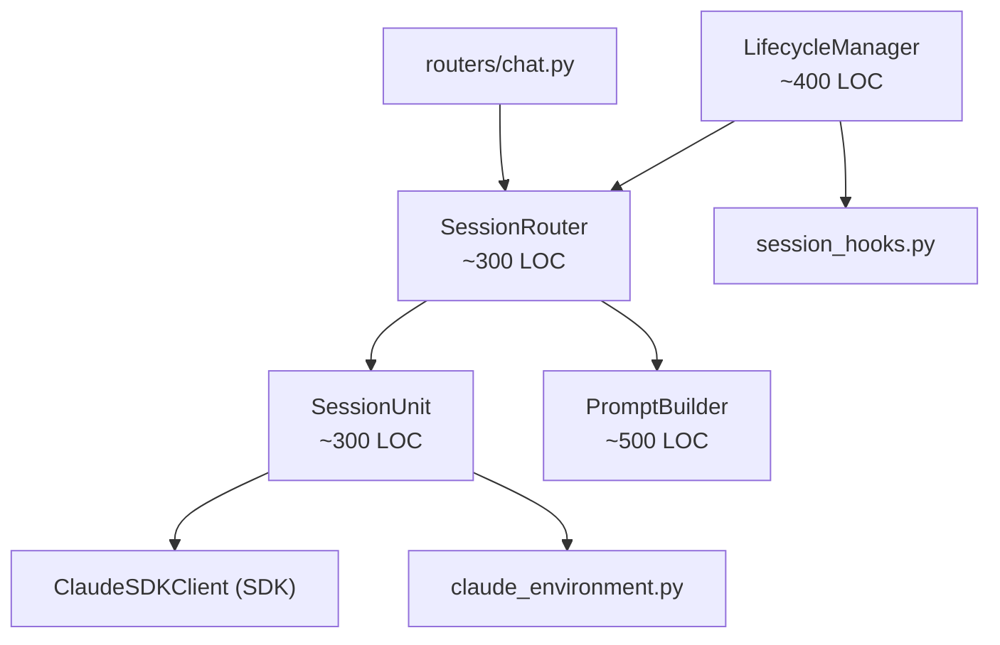
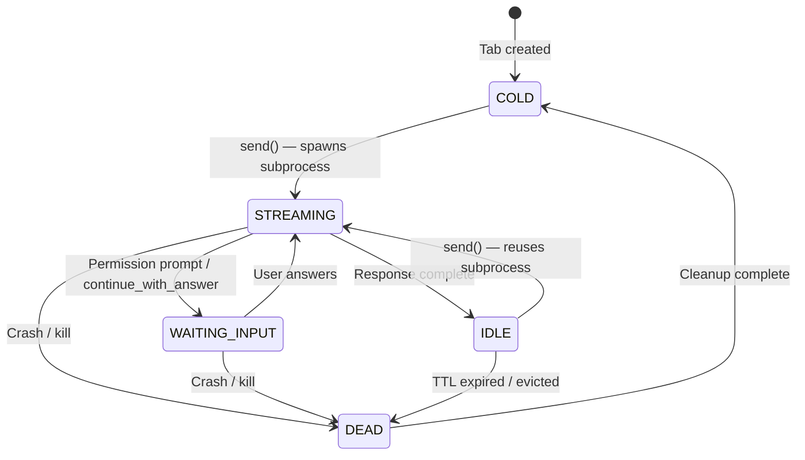

# Design Document: Multi-Session Re-Architecture

## Overview

This design decomposes the 5,406-line `agent_manager.py` monolith into 4 focused modules built around the **SessionUnit** state machine model. The goal: parallel, isolated, stable multi-tab chat sessions with ~71% LOC reduction.

The decomposition extracts four modules — `SessionUnit`, `SessionRouter`, `PromptBuilder`, `LifecycleManager` — each with a single responsibility and no circular dependencies. Three P0 concurrency fixes are prerequisites applied before extraction.

**Reference**: `Knowledge/Architecture/MULTI_SESSION_REARCHITECTURE_v4.md` (approved v4, co-authored by Swarm and Kiro).

### Key Design Decisions

| Decision | Rationale |
|----------|-----------|
| 5-state SessionUnit (COLD/IDLE/STREAMING/WAITING_INPUT/DEAD) | Maps directly to subprocess lifecycle; WAITING_INPUT prevents eviction during permission prompts |
| MAX_CONCURRENT=2 with queue (60s timeout) | Physics constraint — each subprocess uses 400-750MB RAM |
| No SIGSTOP/SIGCONT | Binary alive/dead eliminates 5-tier complexity; cap handles resource pressure |
| TTL = 12 hours (43200s) | TTL is GC, not resource management; cap handles pressure |
| Stop via SDK `interrupt()` + 5s kill fallback | Keeps subprocess warm; only kills if interrupt hangs |
| Env isolation via scoped `_spawn_lock` | Lock held only during subprocess creation, released after env inherited |
| Frontend: Zustand single store | Replaces dual-state (tabMapRef + useState) pattern that causes sync bugs |
| Lazy MCP: default builder-mcp only | Reduces per-session memory from ~600MB to ~300MB at startup |

## Architecture

### Module Dependency Graph



**Dependency rules (acyclic, strictly enforced):**
- `chat.py` → `SessionRouter` (API entry point)
- `SessionRouter` → `SessionUnit` (dispatch requests)
- `SessionRouter` → `PromptBuilder` (build options before dispatch)
- `LifecycleManager` → `SessionRouter` (iterate units for TTL/cleanup)
- `SessionUnit` → `ClaudeSDKClient` (subprocess ownership)
- No module imports from a module that depends on it

### SessionUnit State Machine



### Migration Phases

```mermaid
gantt
    title Multi-Session Re-Architecture Phases
    dateFormat  X
    axisFormat %s

    section P0 Fixes
    fcntl.flock EVOLUTION_CHANGELOG     :p0a, 0, 1
    DailyActivity lock timeout          :p0b, 0, 1
    Serialize hook pipeline             :p0c, 0, 1

    section Phase 1 - Extract
    SessionUnit extraction              :ph1a, 1, 3
    SessionRouter extraction            :ph1b, 1, 3
    PromptBuilder extraction            :ph1c, 1, 3
    LifecycleManager extraction         :ph1d, 1, 3

    section Phase 2 - Simplify
    Remove SIGSTOP/SIGCONT              :ph2a, 3, 5
    Remove global PID tracking          :ph2b, 3, 5
    SDK interrupt() for Stop            :ph2c, 3, 5
    12hr TTL simplification             :ph2d, 3, 5

    section Phase 3 - Frontend
    Zustand store creation              :ph3a, 5, 8
    Tab state migration                 :ph3b, 5, 8
    Remove useUnifiedTabState           :ph3c, 5, 8

    section Phase 4 - Lazy MCP
    Default builder-mcp only            :ph4a, 8, 9
    Hot-swap on demand                  :ph4b, 8, 9
```



## Components and Interfaces

### 1. SessionUnit (`backend/core/session_unit.py`, ~300 LOC)

Owns one tab's complete subprocess lifecycle. Self-contained state machine. No cross-session coordination.

```python
from enum import Enum
from dataclasses import dataclass, field
from typing import AsyncIterator, Optional
import asyncio
import time

class SessionState(Enum):
    COLD = "cold"
    IDLE = "idle"
    STREAMING = "streaming"
    WAITING_INPUT = "waiting_input"
    DEAD = "dead"

@dataclass
class SessionUnit:
    """One tab's complete subprocess lifecycle.
    
    Invariants:
    - Only one SessionUnit per session_id
    - State transitions are atomic (no intermediate states)
    - Crash in this unit never affects other units
    - _env_lock held only during subprocess spawn
    """
    session_id: str
    agent_id: str
    state: SessionState = SessionState.COLD
    created_at: float = field(default_factory=time.time)
    last_used: float = field(default_factory=time.time)
    
    # Internal — not part of public interface
    _client: Optional["ClaudeSDKClient"] = field(default=None, repr=False)
    _wrapper: Optional["_ClaudeClientWrapper"] = field(default=None, repr=False)
    _lock: asyncio.Lock = field(default_factory=asyncio.Lock, repr=False)
    _sdk_session_id: Optional[str] = field(default=None, repr=False)
    _interrupted: bool = field(default=False, repr=False)
    _retry_count: int = field(default=0, repr=False)

    @property
    def is_alive(self) -> bool:
        """Subprocess is alive (IDLE, STREAMING, or WAITING_INPUT)."""
        return self.state in (SessionState.IDLE, SessionState.STREAMING, SessionState.WAITING_INPUT)

    @property
    def is_protected(self) -> bool:
        """Cannot be evicted (STREAMING or WAITING_INPUT)."""
        return self.state in (SessionState.STREAMING, SessionState.WAITING_INPUT)

    @property
    def pid(self) -> Optional[int]:
        """PID of the owned subprocess, if alive."""
        ...

    async def send(
        self,
        query_content: Any,
        options: "ClaudeAgentOptions",
        app_session_id: Optional[str] = None,
    ) -> AsyncIterator[dict]:
        """Send a message. Spawns subprocess if COLD, reuses if IDLE.
        
        State transitions:
        - COLD → STREAMING (spawn new subprocess)
        - IDLE → STREAMING (reuse existing subprocess)
        
        Yields SSE events: session_start, assistant, tool_use, tool_result,
        ask_user_question, cmd_permission_request, result, error.
        """
        ...

    async def interrupt(self, timeout: float = 5.0) -> bool:
        """Interrupt active query. SDK interrupt() with kill fallback.
        
        State transitions:
        - STREAMING → IDLE (interrupt succeeded, subprocess warm)
        - STREAMING → DEAD → COLD (interrupt timed out, subprocess killed)
        
        Returns True if subprocess stayed alive.
        """
        ...

    async def continue_with_answer(self, answer: str) -> AsyncIterator[dict]:
        """Continue after ask_user_question.
        
        State: WAITING_INPUT → STREAMING → IDLE/WAITING_INPUT
        """
        ...

    async def continue_with_permission(self, request_id: str, allowed: bool) -> AsyncIterator[dict]:
        """Continue after cmd_permission_request.
        
        State: WAITING_INPUT → STREAMING → IDLE/WAITING_INPUT
        """
        ...

    async def compact(self, instructions: Optional[str] = None) -> dict:
        """Trigger /compact on the subprocess.
        
        State: IDLE → IDLE (subprocess stays warm)
        """
        ...

    async def kill(self) -> None:
        """Force-kill subprocess and clean up.
        
        State: any → DEAD → COLD
        """
        ...

    async def _spawn(self, options: "ClaudeAgentOptions") -> None:
        """Spawn subprocess under _env_lock. Internal."""
        ...

    def _transition(self, new_state: SessionState) -> None:
        """Atomic state transition with logging."""
        ...
```

### 2. SessionRouter (`backend/core/session_router.py`, ~300 LOC)

Thin routing layer. Dispatches requests to SessionUnits. Enforces concurrency cap. Manages the queue.

```python
from typing import AsyncIterator, Optional
import asyncio

class SessionRouter:
    """Routes chat requests to SessionUnits. Enforces MAX_CONCURRENT=2.
    
    Public API matches current AgentManager surface for zero-change migration
    of routers/chat.py.
    """
    MAX_CONCURRENT: int = 2
    QUEUE_TIMEOUT: float = 60.0

    def __init__(self, prompt_builder: "PromptBuilder"):
        self._units: dict[str, SessionUnit] = {}
        self._prompt_builder = prompt_builder
        self._queue: asyncio.Queue = asyncio.Queue()
        self._slot_available: asyncio.Event = asyncio.Event()

    def get_unit(self, session_id: str) -> Optional[SessionUnit]:
        """Look up a SessionUnit by session_id."""
        ...

    def get_or_create_unit(self, session_id: str, agent_id: str) -> SessionUnit:
        """Get existing or create new COLD SessionUnit."""
        ...

    @property
    def alive_count(self) -> int:
        """Number of units with alive subprocesses."""
        ...

    async def run_conversation(
        self,
        agent_id: str,
        user_message: Optional[str] = None,
        content: Optional[list[dict]] = None,
        session_id: Optional[str] = None,
        enable_skills: bool = False,
        enable_mcp: bool = False,
        channel_context: Optional[dict] = None,
        editor_context: Optional[dict] = None,
    ) -> AsyncIterator[dict]:
        """Entry point — same signature as AgentManager.run_conversation.
        
        1. Build options via PromptBuilder
        2. Acquire slot (evict IDLE if needed, queue if full)
        3. Dispatch to SessionUnit.send()
        4. Yield SSE events
        """
        ...

    async def interrupt_session(self, session_id: str) -> dict:
        """Delegate to SessionUnit.interrupt()."""
        ...

    async def continue_with_answer(
        self, session_id: str, answer: str
    ) -> AsyncIterator[dict]:
        """Delegate to SessionUnit.continue_with_answer()."""
        ...

    async def continue_with_cmd_permission(
        self, session_id: str, request_id: str, allowed: bool
    ) -> AsyncIterator[dict]:
        """Delegate to SessionUnit.continue_with_permission()."""
        ...

    async def compact_session(self, session_id: str, instructions: Optional[str] = None) -> dict:
        """Delegate to SessionUnit.compact()."""
        ...

    async def disconnect_all(self) -> None:
        """Kill all alive SessionUnits. Called at shutdown."""
        ...

    async def _acquire_slot(self, requesting_unit: SessionUnit) -> None:
        """Acquire a concurrency slot. Evict IDLE or queue with timeout."""
        ...

    async def _evict_idle(self, exclude: SessionUnit) -> bool:
        """Evict the oldest IDLE unit to free a slot. Returns True if evicted."""
        ...

    def has_active_session(self, session_id: str) -> bool:
        """Check if a session has an alive subprocess."""
        ...
```

### 3. PromptBuilder (`backend/core/prompt_builder.py`, ~500 LOC)

IO-at-boundaries module extracted from `_build_system_prompt`, `_build_options`, and related helpers. Reads context files and config at call time but performs no subprocess operations. Testable with filesystem fixtures.

```python
from typing import Optional
from claude_agent_sdk import ClaudeAgentOptions

class PromptBuilder:
    """System prompt and SDK option construction.
    
    IO-at-boundaries: reads context files and config via ContextDirectoryLoader
    and AppConfigManager. Does NOT spawn subprocesses, make network calls,
    or hold locks. Testable with filesystem fixtures or mocked loaders.
    No subprocess lifecycle, routing, or hook logic.
    """

    def __init__(self, config: "AppConfigManager"):
        self._config = config

    def build_system_prompt(
        self,
        agent_config: dict,
        working_directory: str,
        channel_context: Optional[dict] = None,
    ) -> str:
        """Assemble system prompt from context files + runtime state.
        
        Extracted from AgentManager._build_system_prompt.
        Delegates to ContextDirectoryLoader and SystemPromptBuilder.
        Returns the complete prompt string.
        """
        ...

    def build_options(
        self,
        agent_config: dict,
        enable_skills: bool,
        enable_mcp: bool,
        resume_session_id: Optional[str] = None,
        session_context: Optional[dict] = None,
        channel_context: Optional[dict] = None,
    ) -> ClaudeAgentOptions:
        """Build ClaudeAgentOptions from agent config.
        
        Extracted from AgentManager._build_options.
        Orchestrates: resolve_allowed_tools, build_hooks, build_mcp_config,
        build_sandbox_config, inject_channel_mcp, resolve_model,
        build_system_prompt.
        """
        ...

    def resolve_model(self, agent_config: dict) -> Optional[str]:
        """Resolve model name with Bedrock conversion if needed."""
        ...

    def resolve_allowed_tools(self, agent_config: dict) -> list[str]:
        """Resolve the allowed tools list from agent config."""
        ...

    def build_mcp_config(
        self,
        working_directory: str,
        enable_mcp: bool,
        lazy: bool = False,
    ) -> tuple[dict, list]:
        """Build MCP server config. If lazy=True, only include builder-mcp.
        
        Returns (mcp_servers_dict, disallowed_tools_list).
        """
        ...

    def merge_user_local_mcp_servers(
        self, mcp_servers: dict, working_directory: str
    ) -> dict:
        """Merge user-local MCP servers with agent-configured ones."""
        ...

    def inject_channel_mcp(
        self, mcp_servers: dict, channel_context: Optional[dict], working_directory: str
    ) -> dict:
        """Inject channel-specific MCP server if channel_context provided."""
        ...

    def build_sandbox_config(self, agent_config: dict) -> Optional[dict]:
        """Build sandbox configuration from agent config."""
        ...

    def compute_watchdog_timeout(
        self,
        session_id: Optional[str],
        input_tokens: int = 0,
        user_turns: int = 0,
    ) -> int:
        """Compute dynamic watchdog timeout based on session metrics.
        
        Formula: base + (tokens/100K * per_100K) + (turns * per_turn),
        clamped to [base, max].
        """
        ...

    def build_context_warning(
        self,
        input_tokens: Optional[int],
        model: Optional[str],
    ) -> Optional[dict]:
        """Generate context window warning event if thresholds exceeded."""
        ...
```

### 4. LifecycleManager (`backend/core/lifecycle_manager.py`, ~400 LOC)

Single background loop. TTL-based cleanup. Serialized hook queue. Startup orphan reaper.

```python
import asyncio
from typing import Optional

class LifecycleManager:
    """Centralized background maintenance for all SessionUnits.
    
    Responsibilities:
    - TTL-based session cleanup (12hr idle → kill)
    - Serialized hook execution (auto-commit, daily activity, distillation, evolution)
    - Startup orphan reaper (one-shot, kills unowned claude CLI processes)
    
    Does NOT contain: prompt building, routing, subprocess spawn logic.
    """
    TTL_SECONDS: int = 43200  # 12 hours
    LOOP_INTERVAL: float = 60.0  # Check every 60 seconds
    HOOK_QUEUE_SIZE: int = 100

    def __init__(
        self,
        router: "SessionRouter",
        hook_executor: "BackgroundHookExecutor",
    ):
        self._router = router
        self._hook_executor = hook_executor
        self._loop_task: Optional[asyncio.Task] = None
        self._hook_queue: asyncio.Queue = asyncio.Queue(maxsize=self.HOOK_QUEUE_SIZE)

    async def start(self) -> None:
        """Start the background loop and run startup orphan reaper."""
        await self._reap_orphans()
        self._loop_task = asyncio.create_task(self._maintenance_loop())

    async def stop(self) -> None:
        """Stop the background loop and drain pending hooks."""
        ...

    async def enqueue_hooks(self, session_id: str, context: "HookContext") -> None:
        """Enqueue post-session hooks for serialized execution."""
        ...

    async def _maintenance_loop(self) -> None:
        """Single background loop: TTL check + hook drain.
        
        Every LOOP_INTERVAL seconds:
        1. Iterate all SessionUnits via router
        2. Kill units idle > TTL_SECONDS
        3. Drain and execute queued hooks (serialized)
        """
        ...

    async def _check_ttl(self) -> None:
        """Kill SessionUnits that have been IDLE longer than TTL."""
        ...

    async def _drain_hooks(self) -> None:
        """Execute queued hooks one at a time (serialized)."""
        ...

    async def _reap_orphans(self) -> None:
        """One-shot startup: find and kill claude CLI processes not owned by any SessionUnit.
        
        Uses `pgrep -f claude` to find processes, cross-references with
        router's known PIDs, kills unowned ones.
        """
        ...
```

### 5. Frontend Zustand Store (`desktop/src/stores/tabStore.ts`)

Single source of truth replacing `useUnifiedTabState.ts` (tabMapRef + useState + renderCounter).

```typescript
import { create } from 'zustand';

interface TabState {
  sessionId: string;
  agentId: string;
  messages: Message[];
  isStreaming: boolean;
  isPending: boolean;
  contextWarning: ContextWarning | null;
  lastUsed: number;
}

interface TabStore {
  tabs: Record<string, TabState>;
  activeTabId: string | null;
  
  // Tab CRUD
  createTab: (agentId: string) => string;
  closeTab: (tabId: string) => void;
  setActiveTab: (tabId: string) => void;
  
  // Per-tab state updates
  setStreaming: (tabId: string, streaming: boolean) => void;
  appendMessage: (tabId: string, message: Message) => void;
  updateMessage: (tabId: string, messageId: string, update: Partial<Message>) => void;
  setContextWarning: (tabId: string, warning: ContextWarning | null) => void;
  
  // Persistence
  persistTabs: () => void;  // debounced write to open_tabs.json
  restoreTabs: () => Promise<void>;  // load from open_tabs.json on startup
  
  // Lazy message loading
  loadMessages: (tabId: string) => Promise<void>;
}
```

## Data Models

### SessionUnit Internal State

```python
@dataclass
class SessionUnit:
    session_id: str           # Stable app-level session ID (from frontend)
    agent_id: str             # Agent configuration ID
    state: SessionState       # Current state machine state
    created_at: float         # Unix timestamp of unit creation
    last_used: float          # Unix timestamp of last activity
    _client: ClaudeSDKClient  # SDK client (None when COLD/DEAD)
    _wrapper: _ClaudeClientWrapper  # Wrapper for PID extraction + cleanup
    _lock: asyncio.Lock       # Per-session concurrency guard
    _sdk_session_id: str      # SDK-internal session ID (for --resume)
    _interrupted: bool        # Set by interrupt(), read by error handler
    _retry_count: int         # Retries within current send() call
```

### State Transition Table

| From | Event | To | Side Effects |
|------|-------|----|-------------|
| COLD | `send()` | STREAMING | Spawn subprocess under `_env_lock`, register PID |
| IDLE | `send()` | STREAMING | Reuse existing subprocess |
| STREAMING | Response complete | IDLE | Update `last_used`, fire hooks if session close |
| STREAMING | Permission prompt | WAITING_INPUT | Yield `ask_user_question` / `cmd_permission_request` |
| WAITING_INPUT | `continue_with_answer()` | STREAMING | Resume query |
| WAITING_INPUT | `continue_with_permission()` | STREAMING | Resume query |
| STREAMING | Crash (exit -9, broken pipe) | DEAD | Log error, clean up wrapper |
| WAITING_INPUT | Crash | DEAD | Log error, clean up wrapper |
| IDLE | TTL expired / evicted | DEAD | Kill subprocess |
| DEAD | Cleanup complete | COLD | Reset internal fields, ready for reuse |

### Concurrency Slot Model

```python
# SessionRouter tracks slot usage via alive_count property
# No semaphore needed — just count units where is_alive == True

alive_units = [u for u in self._units.values() if u.is_alive]
if len(alive_units) >= MAX_CONCURRENT:
    # Try evict oldest IDLE
    idle_units = sorted(
        [u for u in alive_units if u.state == SessionState.IDLE],
        key=lambda u: u.last_used
    )
    if idle_units:
        await idle_units[0].kill()  # Evict oldest idle
    else:
        # All slots occupied by STREAMING/WAITING_INPUT — queue
        await asyncio.wait_for(self._slot_available.wait(), timeout=60.0)
```

### Frontend Tab State Shape

```typescript
// Zustand store replaces:
// - tabMapRef (useRef<Map<string, UnifiedTab>>)
// - renderCounter (useState<number>)
// - All manual bumpRender() calls

interface PersistedTabData {
  // Saved to ~/.swarm-ai/open_tabs.json (debounced 500ms)
  tabId: string;
  sessionId: string;
  agentId: string;
  title: string;
  createdAt: string;
}

interface RuntimeTabState extends PersistedTabData {
  // In-memory only, not persisted
  messages: Message[];          // Loaded lazily from backend API
  isStreaming: boolean;
  isPending: boolean;           // Between send and session_start
  contextWarning: ContextWarning | null;
  messagesLoaded: boolean;      // True after first lazy load
}
```

### Hook Pipeline Serialization Model

```python
# LifecycleManager serializes all hooks through a single asyncio.Queue
# Each item is a (session_id, HookContext) tuple
# Hooks execute one at a time — no concurrent hook runs across sessions

@dataclass
class HookQueueItem:
    session_id: str
    context: HookContext
    enqueued_at: float

# Execution order per session close:
# 1. WorkspaceAutoCommitHook (git add -A + commit)
# 2. DailyActivityExtractionHook (extract activity summary)
# 3. DistillationTriggerHook (promote to MEMORY.md if threshold)
# 4. EvolutionMaintenanceHook (deprecate/prune EVOLUTION.md entries)
```

### P0 Fix: EVOLUTION_CHANGELOG File Locking

```python
# Current: _append_changelog opens file without locking
# Fix: wrap with fcntl.flock

def _append_changelog(changelog_path: Path, action: str, entry_id: str, summary: str, source: str = "maintenance_hook") -> None:
    line = json.dumps({...})
    lock_path = changelog_path.with_suffix(".jsonl.lock")
    with open(lock_path, "w") as lock_fd:
        fcntl.flock(lock_fd, fcntl.LOCK_EX)
        try:
            with open(changelog_path, "a", encoding="utf-8") as f:
                f.write(line + "\n")
        finally:
            fcntl.flock(lock_fd, fcntl.LOCK_UN)
```

### P0 Fix: DailyActivity Lock Timeout

```python
# Current: await self._lock.acquire() — no timeout, can deadlock
# Fix: asyncio.wait_for with 10s timeout

try:
    await asyncio.wait_for(self._lock.acquire(), timeout=10.0)
except asyncio.TimeoutError:
    logger.warning("DailyActivity lock acquisition timed out after 10s — skipping extraction")
    return
```

## Correctness Properties

*A property is a characteristic or behavior that should hold true across all valid executions of a system — essentially, a formal statement about what the system should do. Properties serve as the bridge between human-readable specifications and machine-verifiable correctness guarantees.*

### Property 1: State machine transitions follow the defined transition table

*For any* SessionUnit and any valid sequence of events (send, response_complete, permission_prompt, crash, kill, cleanup), the resulting state after each event must match the transition table: COLD→STREAMING on send, STREAMING→IDLE on complete, STREAMING→WAITING_INPUT on permission, any_alive→DEAD on crash, DEAD→COLD on cleanup. No other transitions are permitted.

**Validates: Requirements 1.2, 1.3, 1.4, 1.5, 1.7**

### Property 2: Eviction targets only IDLE units

*For any* set of SessionUnits with mixed states, the eviction algorithm must only select units in IDLE state. Units in STREAMING or WAITING_INPUT state must never be selected for eviction, regardless of their age or last_used timestamp.

**Validates: Requirements 1.6, 2.6**

### Property 3: Crash isolation between SessionUnits

*For any* pair of SessionUnits (A, B), when unit A transitions to DEAD (crash or kill), unit B's state, subprocess PID, and client reference must remain unchanged. Error events from A's crash must not appear in B's event stream.

**Validates: Requirements 1.8, 10.1, 10.2**

### Property 4: Concurrency cap invariant

*For any* sequence of session creation and destruction operations on a SessionRouter, after each `_acquire_slot` call completes, the number of SessionUnits with `is_alive == True` must not exceed `MAX_CONCURRENT` (2). During the transient window between eviction and spawn, the count may temporarily be below the cap but must never exceed it.

**Validates: Requirements 2.1**

### Property 5: FIFO queue dispatch ordering

*For any* sequence of queued requests (enqueued when all slots are occupied by protected units), when a slot becomes available, the oldest queued request must be dispatched first. The dispatch order must match the enqueue order.

**Validates: Requirements 2.5**

### Property 6: Correct routing by session ID

*For any* set of SessionUnits registered in a SessionRouter, routing a request (interrupt, continue_with_answer, continue_with_permission) by session_id must always reach the SessionUnit whose session_id matches, and no other unit.

**Validates: Requirements 2.7**

### Property 7: PromptBuilder determinism

*For any* agent configuration, working directory path, and channel context, calling `build_system_prompt` twice with identical inputs must produce identical output strings. The function must be a pure function of its inputs.

**Validates: Requirements 3.1**

### Property 8: MCP server merge is a union

*For any* set of agent-configured MCP servers and any set of user-local MCP servers, the merged result from `merge_user_local_mcp_servers` must contain every server from both sets. No server from either input set may be missing from the output.

**Validates: Requirements 3.3**

### Property 9: Channel MCP injection

*For any* MCP server configuration and any non-null channel context, `inject_channel_mcp` must return a configuration that contains all original servers plus the channel-specific MCP server. The original servers must not be modified.

**Validates: Requirements 3.4**

### Property 10: Watchdog timeout formula

*For any* non-negative input token count and non-negative user turn count, `compute_watchdog_timeout` must return a value equal to `clamp(base + (tokens/100K * per_100K) + (turns * per_turn), base, max)` where base=180, per_100K=30, per_turn=5, max=600.

**Validates: Requirements 3.5**

### Property 11: Context warning thresholds

*For any* input token count and model with a known context window, `build_context_warning` must return a warning with level "warn" when usage exceeds the warn threshold, "critical" when usage exceeds the critical threshold, and "ok" or None otherwise. The percentage must equal `round(tokens / context_window * 100)`.

**Validates: Requirements 3.6**

### Property 12: TTL-based cleanup

*For any* SessionUnit in IDLE state, if `time.time() - unit.last_used > TTL_SECONDS` (43200), the LifecycleManager's TTL check must mark that unit for cleanup. Units with `last_used` within the TTL window must not be marked.

**Validates: Requirements 4.2**

### Property 13: Hook execution serialization

*For any* sequence of hook submissions from multiple sessions, the LifecycleManager must execute hooks one at a time. No two hook executions may overlap in time. The execution order must match the submission order (FIFO).

**Validates: Requirements 4.3, 5.4**

### Property 14: EVOLUTION_CHANGELOG concurrent write safety

*For any* set of concurrent `_append_changelog` calls writing to the same EVOLUTION_CHANGELOG.jsonl file, every call's entry must appear exactly once in the final file, and no entry may be corrupted or partially written. The file must be valid JSONL (one JSON object per line).

**Validates: Requirements 5.1**

### Property 15: Interrupt preserves subprocess for reuse

*For any* SessionUnit in STREAMING state, if `interrupt()` succeeds (completes within timeout), the unit must transition to IDLE with the same subprocess PID. A subsequent `send()` call must reuse that subprocess (same PID) rather than spawning a new one.

**Validates: Requirements 7.5, 11.2, 11.4**

### Property 16: Tab state serialization round-trip

*For any* set of tab states (with valid session IDs, agent IDs, titles, and timestamps), persisting to `open_tabs.json` and then restoring must produce tab metadata equivalent to the original. Session IDs, agent IDs, and titles must be preserved exactly.

**Validates: Requirements 8.4, 8.5**

### Property 17: MCP subset configuration

*For any* subset of available MCP servers (including the empty set and the full set), `build_mcp_config` must return a configuration containing exactly the servers in that subset. When `lazy=True`, the subset must be `{builder-mcp}` only.

**Validates: Requirements 9.1, 9.3**

### Property 18: Per-unit retry with cap and isolation

*For any* SessionUnit encountering retriable errors, the retry count must not exceed `MAX_RETRY_ATTEMPTS` (3). Retries in one unit must not delay, block, or affect the retry state of any other unit. There must be no global cooldown state.

**Validates: Requirements 10.3, 10.4**

### Property 19: Environment spawn lock scoping

*For any* SessionUnit spawn operation, the `_env_lock` must be acquired before `os.environ` mutation and released after the subprocess has been created (after `wrapper.__aenter__()` completes). The lock must not be held during query execution or response streaming.

**Validates: Requirements 1.9**

## Error Handling

### SessionUnit Error Handling

| Error | Detection | Recovery | State Transition |
|-------|-----------|----------|-----------------|
| Subprocess exit -9 (OOM kill) | `_is_retriable_error()` on stderr | Retry up to 3x with exponential backoff (5s, 10s, 15s), spawn fresh subprocess with `--resume` | STREAMING → DEAD → COLD → STREAMING |
| Subprocess broken pipe | SDK raises `BrokenPipeError` | Same as exit -9 (exponential backoff) | STREAMING → DEAD → COLD → STREAMING |
| SDK interrupt() timeout | `asyncio.wait_for(interrupt(), 5.0)` raises `TimeoutError` | Force-kill subprocess via `_force_kill_pid()` | STREAMING → DEAD → COLD |
| Auth not configured | `AuthenticationNotConfiguredError` from env config | Yield error event, no subprocess spawned | COLD → COLD (no transition) |
| Credentials expired | Pre-flight `credential_validator.is_valid()` fails | Yield error event with setup guide | COLD → COLD |
| Subprocess spawn failure | `wrapper.__aenter__()` raises | Yield error event, release env lock | COLD → DEAD → COLD |
| Query timeout (watchdog) | Dynamic timeout based on tokens/turns | Kill subprocess, yield timeout error | STREAMING → DEAD → COLD |

### SessionRouter Error Handling

| Error | Detection | Recovery |
|-------|-----------|----------|
| Queue timeout (60s) | `asyncio.wait_for()` raises `TimeoutError` | Return timeout error to caller, request never dispatched |
| Queued dispatch spawn failure | `req_unit.send()` raises during `_on_unit_idle` | Catch exception, set `req.future.set_exception(e)`, SSE connection receives error event |
| Unit not found for routing | `get_unit()` returns None | Return "session not found" error |
| Concurrent send on same session | `_lock.locked()` check | Return "session busy" error (don't queue) |

### LifecycleManager Error Handling

| Error | Detection | Recovery |
|-------|-----------|----------|
| Hook execution failure | try/except in `_drain_hooks()` | Log warning, continue to next hook. Never retry failed hooks. |
| Orphan reaper failure | try/except in `_reap_orphans()` | Log warning, continue startup. Non-fatal. |
| TTL check failure | try/except in `_check_ttl()` | Log warning, retry on next loop iteration. |
| Background loop crash | `asyncio.Task` exception handler | Restart loop after 5s delay. |

### P0 Fix Error Handling

| Fix | Error | Recovery |
|-----|-------|----------|
| fcntl.flock on EVOLUTION_CHANGELOG | Lock contention / timeout | Log warning, skip this write. Entry lost but file not corrupted. |
| DailyActivity lock timeout | Lock held > 10s | Log warning, skip extraction for this cycle. Next cycle retries. |
| Hook serialization queue full | Queue at capacity (100 items) | Log warning, drop oldest item. Hooks are best-effort. |

### Error Event Format (unchanged from current)

```json
{
  "type": "error",
  "error": "Human-readable error message",
  "code": "ERROR_CODE",
  "detail": "Technical detail for debugging",
  "suggested_action": "What the user should do"
}
```

Error codes preserved from current implementation:
- `AUTH_NOT_CONFIGURED` — No API key or Bedrock config
- `CREDENTIALS_EXPIRED` — AWS credentials invalid
- `SESSION_TIMEOUT` — Queue timeout (60s)
- `SUBPROCESS_CRASH` — Subprocess died unexpectedly
- `INTERRUPT_TIMEOUT` — Stop button kill fallback triggered
- `RETRY_EXHAUSTED` — All 3 retry attempts failed

## Testing Strategy

### Dual Testing Approach

This feature requires both unit tests and property-based tests:

- **Unit tests**: Specific examples, edge cases, integration points, error conditions
- **Property tests**: Universal properties across all valid inputs (the 19 properties above)

Together they provide comprehensive coverage: unit tests catch concrete bugs at boundaries, property tests verify general correctness across the input space.

### Property-Based Testing Configuration

- **Library**: `hypothesis` (Python backend), `fast-check` (TypeScript frontend)
- **Minimum iterations**: 100 per property test (hypothesis default is 100, sufficient for our state space)
- **Each property test must reference its design property via comment tag**
- **Tag format**: `# Feature: multi-session-rearchitecture, Property {N}: {title}`
- **Each correctness property is implemented by a SINGLE property-based test**

### Backend Test Plan (Python / pytest + hypothesis)

#### Property Tests (`backend/tests/test_session_unit_properties.py`)

| Property | Test | Strategy |
|----------|------|----------|
| P1: State machine transitions | Generate random event sequences, verify each transition matches table | `@given(st.lists(st.sampled_from(events)))` |
| P2: Eviction targets only IDLE | Generate random unit sets with mixed states, verify eviction selection | `@given(st.lists(st.sampled_from(states)))` |
| P3: Crash isolation | Generate pairs of units, crash one, verify other unchanged | `@given(unit_pair_strategy)` |
| P4: Concurrency cap | Generate request sequences, verify alive_count ≤ 2 | `@given(st.lists(st.sampled_from(operations)))` |
| P5: FIFO queue dispatch | Generate queued requests, verify dispatch order | `@given(st.lists(st.text()))` |
| P6: Routing by session_id | Generate unit sets, route by random ID, verify correct unit | `@given(st.dictionaries(st.text(), unit_strategy))` |
| P7: PromptBuilder determinism | Generate configs, call twice, verify identical output | `@given(agent_config_strategy)` |
| P8: MCP merge union | Generate two MCP server dicts, verify union | `@given(st.dictionaries(...), st.dictionaries(...))` |
| P9: Channel MCP injection | Generate MCP config + channel context, verify injection | `@given(mcp_config_strategy, channel_strategy)` |
| P10: Watchdog timeout formula | Generate token counts + turn counts, verify formula | `@given(st.integers(0, 500000), st.integers(0, 100))` |
| P11: Context warning thresholds | Generate token counts + models, verify warning levels | `@given(st.integers(0, 500000), model_strategy)` |
| P12: TTL cleanup | Generate units with random timestamps, verify TTL logic | `@given(st.floats(0, 100000), st.floats(0, 100000))` |
| P13: Hook serialization | Submit hooks from multiple "sessions", verify no overlap | `@given(st.lists(st.tuples(st.text(), hook_strategy)))` |
| P14: Changelog concurrent writes | Concurrent appends, verify all entries present + valid JSONL | `@given(st.lists(st.text()))` |
| P15: Interrupt preserves subprocess | Interrupt STREAMING unit, verify IDLE + same PID, then send reuses | `@given(unit_strategy)` |
| P18: Per-unit retry isolation | Generate error sequences for multiple units, verify isolation | `@given(st.lists(error_strategy))` |
| P19: Env lock scoping | Spawn under lock, verify lock released after spawn | `@given(unit_strategy)` |

#### Unit Tests (`backend/tests/test_session_unit.py`, `test_session_router.py`, etc.)

- SessionUnit: COLD→STREAMING spawn with mock SDK, DEAD→COLD cleanup, interrupt timeout edge case (7.4/11.3)
- SessionRouter: Queue timeout at 60s (2.3, 2.4), API surface matches AgentManager (6.1), dependency graph acyclic (6.5)
- PromptBuilder: Specific agent configs produce expected options, lazy MCP returns builder-mcp only
- LifecycleManager: Startup orphan reaper with mock pgrep, DailyActivity lock timeout (5.2, 5.3)
- P0 Fixes: fcntl.flock prevents corruption under concurrent writes, DailyActivity lock timeout logs warning

### Frontend Test Plan (TypeScript / vitest + fast-check)

#### Property Tests (`desktop/src/stores/__tests__/tabStore.property.test.ts`)

| Property | Test | Strategy |
|----------|------|----------|
| P16: Tab state round-trip | Generate tab states, persist + restore, verify equivalence | `fc.record({sessionId: fc.uuid(), ...})` |
| P17: MCP subset (frontend validation) | N/A — backend-only property | — |

#### Unit Tests (`desktop/src/stores/__tests__/tabStore.test.ts`)

- Store shape includes all required fields (8.2)
- Lazy message loading: messages not loaded until tab activated (8.6)
- createTab returns valid tab with COLD-equivalent state
- closeTab removes tab from store
- setStreaming updates only target tab
- persistTabs writes to open_tabs.json
- restoreTabs loads from open_tabs.json

### Integration Tests

- **SSE event sequence**: Send a message through SessionRouter, verify event types match current AgentManager output (6.2)
- **API compatibility**: Run existing `routers/chat.py` tests against SessionRouter — zero changes expected (6.3)
- **End-to-end multi-tab**: Two tabs streaming simultaneously, crash one, verify other continues (1.8, 10.1, 10.2)
