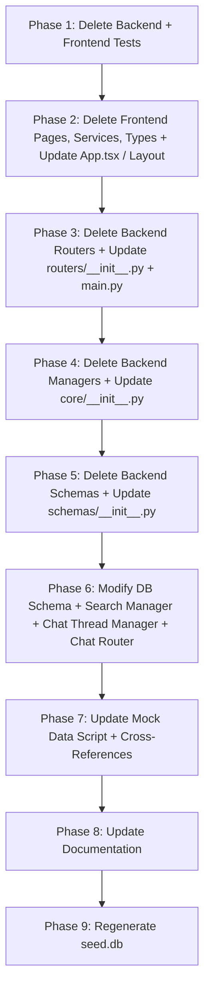

# Design Document: Operating Loop Cleanup

## Overview

This spec removes the legacy "Daily Work Operating Loop" feature — 5 of the 6 section entities (Plan/PlanItems, Communicate/Communications, Artifacts, Reflections) plus the Sections aggregator — from both the Python FastAPI backend and the React/TypeScript frontend. The new SwarmWS workspace model uses only `Knowledge/` and `Projects/` semantic zones; the Operating Loop code for these 5 entities is dead weight.

The Tasks Subsystem (`tasks` router, manager, schema, DB table, frontend page/service) is explicitly preserved because it powers background agent task execution in the chat system.

The ToDos Subsystem (`todos` router, manager, schema, DB table, frontend service/types, and all `todo_id`/`source_todo_id` cross-references in `tasks`, `chat_threads`, and binding schemas) is explicitly preserved because the upcoming Swarm Radar feature (`.kiro/specs/swarm-radar-specs/swarm-radar-todos/`) depends on it.

This is a deletion-heavy spec. The design focuses on:
1. Exact file lists (delete vs modify)
2. Operation ordering to avoid import errors
3. Database schema changes
4. Seed DB regeneration
5. Critical preservation list

## Architecture

### Deletion Strategy

The cleanup follows a **leaf-to-root** deletion order to prevent import errors at any intermediate commit:



**Key ordering constraint**: Import cleanups (`__init__.py`, `main.py`, `App.tsx`) MUST happen in the same phase as the corresponding file deletions. Otherwise, Python/TypeScript will fail to import the deleted modules.


The rationale for leaf-to-root: tests import routers/managers/schemas, routers import managers/schemas, managers import schemas, and schemas are standalone. Deleting in reverse dependency order means no intermediate state has broken imports.

### Critical Preservation List (DO NOT DELETE)

| Layer | File | Reason |
|-------|------|--------|
| Backend Router | `backend/routers/tasks.py` | Tasks API for agent execution |
| Backend Router | `backend/routers/todos.py` | ToDos API for Swarm Radar |
| Backend Manager | `backend/core/task_manager.py` | Task business logic |
| Backend Manager | `backend/core/todo_manager.py` | ToDo business logic incl. convert_to_task |
| Backend Schema | `backend/schemas/task.py` | Task Pydantic models |
| Backend Schema | `backend/schemas/todo.py` | ToDo Pydantic models |
| Database Table | `tasks` (in `sqlite.py` SCHEMA) | Task persistence |
| Database Table | `todos` (in `sqlite.py` SCHEMA) | ToDo persistence |
| Database Class | `SQLiteTasksTable` | Task table accessor |
| Database Class | `SQLiteToDosTable` | ToDo table accessor |
| Database Column | `source_todo_id` + FK in `tasks` | Links Tasks to originating ToDos |
| Database Column | `task_id` in `todos` | Links ToDos to created Tasks |
| Database Column | `todo_id` + FK in `chat_threads` | Links threads to ToDos via click-to-chat |
| Backend Schema | `todo_id` in `ThreadBindRequest`/`ThreadBindResponse` | Thread-ToDo binding |
| Backend Schema | `todo_id` in `ChatThreadCreate`/`ChatThreadUpdate`/`ChatThreadResponse` | Thread-ToDo binding |
| Backend Logic | `todo_id` handling in `chat_thread_manager.py` | Thread-ToDo resolution |
| Backend Logic | `todo_id` references in `routers/chat.py` | Thread-ToDo binding endpoint |
| Frontend Page | `desktop/src/pages/TasksPage.tsx` | Tasks UI |
| Frontend Service | `desktop/src/services/tasks.ts` | Tasks API client |
| Frontend Service | `desktop/src/services/todos.ts` | ToDos API client |
| Frontend Types | `Task`, `TaskCreateRequest`, `TaskMessageRequest`, `RunningTaskCount` in `index.ts` | Task type definitions |
| Frontend Types | `TodoItem`, `sourceTodoId` in `Task` in `index.ts` | ToDo type definitions |
| Frontend Types | `todoId` in `ChatThread`, `ThreadBindRequest`, `ThreadBindResponse` | Thread-ToDo binding types |
| Frontend Types | `desktop/src/types/todo.ts` | ToDo type file |
| Frontend Context | `todoId` in `desktop/src/services/context.ts` `bindThread` | Thread-ToDo binding service |
| Backend Tests | `test_task_manager_updates.py`, `test_task_data_migration.py`, `test_property_task_status_compat.py` | Task test coverage |
| Backend Tests | `test_todos_router.py`, `test_property_todo_task_conversion.py`, `test_property_overdue_detection.py` | ToDo test coverage |

## Components and Interfaces

### Files to Delete (35 files)

#### Backend Routers (5 files)
- `backend/routers/sections.py`
- `backend/routers/plan_items.py`
- `backend/routers/communications.py`
- `backend/routers/artifacts.py`
- `backend/routers/reflections.py`

#### Backend Managers (5 files)
- `backend/core/section_manager.py`
- `backend/core/plan_item_manager.py`
- `backend/core/communication_manager.py`
- `backend/core/artifact_manager.py`
- `backend/core/reflection_manager.py`

#### Backend Schemas (5 files)
- `backend/schemas/section.py`
- `backend/schemas/plan_item.py`
- `backend/schemas/communication.py`
- `backend/schemas/artifact.py`
- `backend/schemas/reflection.py`


#### Backend Tests (19 files)

Direct entity tests (10 files):
- `backend/tests/test_artifact_manager.py`
- `backend/tests/test_artifacts_router.py`
- `backend/tests/test_communication_manager.py`
- `backend/tests/test_communications_router.py`
- `backend/tests/test_plan_item_manager.py`
- `backend/tests/test_plan_items_router.py`
- `backend/tests/test_reflection_manager.py`
- `backend/tests/test_reflections_router.py`
- `backend/tests/test_section_manager.py`
- `backend/tests/test_sections_router.py`

Property-based tests (9 files):
- `backend/tests/test_property_archived_aggregation.py`
- `backend/tests/test_property_artifact_hybrid.py`
- `backend/tests/test_property_artifact_versioning.py`
- `backend/tests/test_property_blocked_reason.py`
- `backend/tests/test_property_communication_sent.py`
- `backend/tests/test_property_global_view.py`
- `backend/tests/test_property_plan_item_cascade.py`
- `backend/tests/test_property_reflection_hybrid.py`
- `backend/tests/test_property_section_contract.py`

#### Frontend Pages (6 files)
- `desktop/src/pages/SignalsPage.tsx`
- `desktop/src/pages/PlanPage.tsx`
- `desktop/src/pages/ExecutePage.tsx`
- `desktop/src/pages/CommunicatePage.tsx`
- `desktop/src/pages/ArtifactsPage.tsx`
- `desktop/src/pages/ReflectionPage.tsx`

#### Frontend Services (1 file)
- `desktop/src/services/sections.ts`

#### Frontend Types (5 files)
- `desktop/src/types/plan-item.ts`
- `desktop/src/types/section.ts`
- `desktop/src/types/artifact.ts`
- `desktop/src/types/reflection.ts`
- `desktop/src/types/communication.ts`

#### Frontend Tests (2 files)
- `desktop/src/pages/__tests__/SectionPages.test.tsx`
- `desktop/src/pages/__tests__/WorkspaceScopedRouting.test.tsx`


#### Documentation (1 directory)
- `.kiro/specs/TODO-swarm-signals-ingestion-and-auto-reply-specs/` (entire directory)

### Files to Modify (12 files)

| File | Change |
|------|--------|
| `backend/routers/__init__.py` | Remove 5 router imports and `__all__` entries (preserve `todos_router`) |
| `backend/main.py` | Remove 5 router imports and `include_router` calls (preserve `todos_router`) |
| `backend/schemas/__init__.py` | Remove all imports from deleted schema files (section, plan_item, communication, artifact, reflection) and their `__all__` entries. Preserve `todo.py` imports. Remove `Priority` enum export (only used by deleted schemas). |
| `backend/database/sqlite.py` | Remove 5 table DDLs from `SCHEMA` string (`plan_items`, `communications`, `artifacts`, `artifact_tags`, `reflections` including all indexes). Remove 5 table class definitions (`SQLitePlanItemsTable`, `SQLiteCommunicationsTable`, `SQLiteArtifactsTable`, `SQLiteArtifactTagsTable`, `SQLiteReflectionsTable`). Remove 5 instance variables and property accessors from `SQLiteDatabase`. Preserve `todos` table, `SQLiteToDosTable`, `db.todos` accessor, `todo_id` column/FK in `chat_threads`, `source_todo_id` column/FK in `tasks`, `list_by_todo` method, and `todo_id` in `bind_thread`. |
| `backend/core/search_manager.py` | Remove `plan_item`, `communication`, `artifact`, `reflection` from `SEARCHABLE_ENTITY_TYPES`. Remove corresponding entries from `_ENTITY_TABLE_CONFIG`. Preserve `todo` in `SEARCHABLE_ENTITY_TYPES` and `_ENTITY_TABLE_CONFIG`. Keep `db.todos._get_connection()` as-is. |
| `backend/scripts/generate_mock_data.py` | Delete functions `_generate_plan_items`, `_generate_communications`, `_generate_artifacts`, `_generate_reflections`. Remove their calls from `generate_mock_data()`. Preserve `_generate_todos`. |
| `desktop/src/App.tsx` | Remove 6 page imports and 6 `<Route>` definitions for `/signals`, `/plan`, `/execute`, `/communicate`, `/artifacts`, `/reflection`. Update module docstring. |
| `desktop/src/components/layout/ThreeColumnLayout.tsx` | Remove `sectionNavItems` array, its rendering loop, and the divider between modal nav and section nav. |
| `desktop/src/types/index.ts` | Preserve `TodoItem` interface, `sourceTodoId` in `Task` interface, `todoId` in `ThreadBindRequest` and `ThreadBindResponse`. |
| `backend/core/context_snapshot_cache.py` | Update comment referencing `todo_manager` (line ~119). |

### Tests to Modify (3 files)

| File | Change |
|------|--------|
| `backend/tests/test_search_manager.py` | Remove test cases for `plan_item`, `communication`, `artifact`, `reflection` entity types. Keep `task`, `thread`, and `todo`. |
| `backend/tests/test_mock_data.py` | Remove assertions for deleted generator functions. Keep `_generate_tasks` and `_generate_todos`. |
| `backend/tests/test_property_search_scope.py` | Remove removed entity types from search scope property tests. Keep `task`, `thread`, and `todo`. |

### Documentation to Update (2 files)

| File | Change |
|------|--------|
| `.kiro/specs/ARCHITECTURE.md` | Remove Operating Loop section references. Update to reflect `Knowledge/` and `Projects/` zones only. |
| `.kiro/specs/AGENT_ARCHITECTURE_DEEP_DIVE.md` | Remove Operating Loop section references. |


## Data Models

### Database Schema Changes

#### Tables to Remove from `SCHEMA` DDL (in `backend/database/sqlite.py`)

1. `plan_items` — including indexes `idx_plan_items_workspace_id`, `idx_plan_items_focus_type`, `idx_plan_items_workspace_focus`
2. `communications` — including indexes `idx_communications_workspace_id`, `idx_communications_status`, `idx_communications_workspace_status`
3. `artifacts` — including indexes `idx_artifacts_workspace_id`, `idx_artifacts_type`, `idx_artifacts_workspace_type`
4. `artifact_tags` — including indexes `idx_artifact_tags_artifact_id`, `idx_artifact_tags_tag`
5. `reflections` — including indexes `idx_reflections_workspace_id`, `idx_reflections_type`, `idx_reflections_workspace_type`

#### Tables to Preserve

- `todos` — including all indexes. Required by Swarm Radar ToDos feature.
- `tasks` — including all columns and indexes. Required by agent task execution.

#### Tables to Modify

**`tasks` table**: No changes needed. The `source_todo_id` column and its foreign key `REFERENCES todos(id)` are preserved since the `todos` table is preserved. The `backend/schemas/task.py` `source_todo_id` field in `TaskCreateRequest` is also preserved.

**`chat_threads` table**: No changes needed. The `todo_id` column and its foreign key `REFERENCES todos(id)` are preserved since the `todos` table is preserved.

#### Migration Strategy

Since SwarmAI uses `CREATE TABLE IF NOT EXISTS` for schema initialization and the seed DB is regenerated from scratch:

1. **New installs**: The regenerated `seed.db` will not contain the removed tables. The `SCHEMA` DDL string will not create them. The `todos` and `tasks` tables will be present.
2. **Existing installs**: The old tables (`plan_items`, `communications`, `artifacts`, `artifact_tags`, `reflections`) will remain in `data.db` as orphaned tables. This is harmless — no code references them. A future migration could `DROP TABLE IF EXISTS` them, but it's not required for correctness.
3. **The `source_todo_id` column and FK in `tasks`**: Preserved as-is. The `todos` table still exists, so the FK remains valid.
4. **The `todo_id` column and FK in `chat_threads`**: Preserved as-is. The `todos` table still exists, so the FK remains valid.

#### Seed DB Regeneration

After all code changes are complete, the `seed.db` must be regenerated:
1. Delete the existing `seed.db` file
2. Run `python backend/scripts/generate_seed_db.py`
3. The script uses `SQLiteDatabase.initialize()` which executes the updated `SCHEMA` DDL
4. The new `seed.db` will only contain preserved tables

### Python Table Classes to Remove from `sqlite.py`

- `SQLitePlanItemsTable` (extends `WorkspaceScopedTable`)
- `SQLiteCommunicationsTable` (extends `WorkspaceScopedTable`)
- `SQLiteArtifactsTable` (extends `WorkspaceScopedTable`)
- `SQLiteArtifactTagsTable` (extends `SQLiteTable`)
- `SQLiteReflectionsTable` (extends `WorkspaceScopedTable`)

Note: `WorkspaceScopedTable` itself is NOT removed — it is used by `SQLiteToDosTable` and may be used by future workspace-scoped entities.

### `SQLiteDatabase` Class Changes

Remove from `__init__`:
- `self._plan_items`, `self._communications`, `self._artifacts`, `self._artifact_tags`, `self._reflections`

Remove property accessors:
- `plan_items`, `communications`, `artifacts`, `artifact_tags`, `reflections`

Preserve:
- `self._todos` and `todos` property accessor
- `self._tasks` and `tasks` property accessor

### `SQLiteChatThreadsTable` Changes

No changes needed. The `list_by_todo` method, `bind_thread` method with `todo_id` parameter, and all `todo_id` handling logic are preserved since the `todos` table is preserved.


## Correctness Properties

*A property is a characteristic or behavior that should hold true across all valid executions of a system — essentially, a formal statement about what the system should do. Properties serve as the bridge between human-readable specifications and machine-verifiable correctness guarantees.*

### Property 1: Fresh database excludes removed tables and preserves required tables

*For any* freshly initialized SQLite database (via `SQLiteDatabase.initialize()`), the database SHALL contain the `tasks`, `todos`, `chat_threads`, `agents`, `sessions`, `messages`, and all other preserved tables, and SHALL NOT contain the tables `plan_items`, `communications`, `artifacts`, `artifact_tags`, or `reflections`.

**Validates: Requirements 4.1, 4.2, 4.3, 4.4, 4.5, 4.6, 4.7**

### Property 2: Search results only contain preserved entity types

*For any* search query string and any scope value, the `SearchManager.search()` method SHALL return results where every `EntityTypeResults.entity_type` is one of `["task", "thread", "todo"]` and SHALL NOT return results with entity types `plan_item`, `communication`, `artifact`, or `reflection`.

**Validates: Requirements 5.1, 5.3**

### Property 3: ToDos subsystem preserved with full thread binding

*For any* valid `ThreadBindRequest` instance, the model SHALL accept both a `task_id` field and a `todo_id` field. *For any* `ThreadBindResponse` instance, the response SHALL include `thread_id`, `task_id`, `todo_id`, and `context_version` fields. The `todos` API endpoints SHALL remain accessible at `/api/todos`.

**Validates: Requirements 12.1-12.15**

### Property 4: Tasks subsystem round-trip integrity

*For any* valid task title and agent ID, creating a task via `task_manager.create()` and then retrieving it via `task_manager.get()` SHALL return a task with the same title, agent_id, and a status of `pending`. The task SHALL be retrievable by its ID and SHALL appear in `task_manager.list_all()` results.

**Validates: Requirements 13.1, 13.2, 13.3, 13.4**

### Property 5: Removed API routes return 404

*For any* HTTP method in `[GET, POST, PUT, DELETE]` and *for any* path in the set of removed Operating Loop endpoints (`/api/workspaces/{id}/sections`, `/api/workspaces/{id}/plan-items`, `/api/workspaces/{id}/communications`, `/api/workspaces/{id}/artifacts`, `/api/workspaces/{id}/reflections`), the FastAPI application SHALL return HTTP 404 (Not Found) or 405 (Method Not Allowed). The `/api/todos` endpoint SHALL remain accessible.

**Validates: Requirements 1.1, 1.2, 1.3, 1.4, 1.5**

### Property 6: Fresh database preserves todos table with todo_id columns in related tables

*For any* freshly initialized database, the `todos` table SHALL exist with all its columns and indexes. The `chat_threads` table SHALL contain a `todo_id` column. The `tasks` table SHALL contain a `source_todo_id` column with a foreign key referencing `todos(id)`.

**Validates: Requirements 12.4-12.7, 13.4**

## Error Handling

This is a deletion spec — the primary error modes are:

1. **Import errors at startup**: If a deleted file is still referenced by a preserved file, Python/TypeScript will fail to import. The leaf-to-root deletion order and the explicit modification list prevent this. Verification: backend starts without errors (Req 14.1, 14.2), frontend compiles without errors (Req 14.3).

2. **Database initialization errors**: If the `SCHEMA` DDL references a deleted table (e.g., a FK pointing to a removed table), `CREATE TABLE` will fail. Since the `todos` table is preserved, the FKs from `tasks.source_todo_id` and `chat_threads.todo_id` to `todos` remain valid. Verification: fresh DB initializes without errors (Req 14.1).

3. **Search manager connection error**: The search manager currently uses `db.todos._get_connection()` to obtain a database connection. Since `todos` is preserved, this continues to work without changes. Verification: search works after cleanup (Property 2).

4. **Orphaned data in existing databases**: Existing `data.db` files will retain the old tables. This is harmless — no code reads from them. No error handling needed.

## Testing Strategy

### Property-Based Testing

Use `hypothesis` (already a project dependency) for property-based tests. Each property test runs a minimum of 100 iterations.

| Property | Test File | Library | Iterations |
|----------|-----------|---------|------------|
| Property 1: DB schema | `backend/tests/test_property_cleanup_db_schema.py` | hypothesis | 100 |
| Property 2: Search scope | Update `backend/tests/test_property_search_scope.py` | hypothesis | 100 |
| Property 3: ToDos preserved | `backend/tests/test_property_cleanup_todos_preserved.py` | hypothesis | 100 |
| Property 4: Tasks round-trip | Update `backend/tests/test_property_task_status_compat.py` | hypothesis | 100 |
| Property 5: Removed routes 404 | `backend/tests/test_property_cleanup_removed_routes.py` | hypothesis | 100 |
| Property 6: todos table preserved | Combined with Property 1 test file | hypothesis | 100 |

Each test MUST include a comment tag: `# Feature: operating-loop-cleanup, Property {N}: {title}`

### Unit / Example Tests

| Test | What it verifies |
|------|-----------------|
| Backend startup test | App initializes without import errors (Req 14.1, 14.2) |
| Seed DB test | Regenerated seed.db contains only preserved tables including `todos` and `tasks` (Req 4.10) |
| Mock data test | `generate_mock_data()` runs without errors and generates tasks and todos (Req 6.1, 6.4, 6.5) |
| Frontend route test | `/tasks` route renders, Operating Loop routes are absent (Req 7.3, 7.4) |
| Sidebar render test | LeftSidebar has no Operating Loop nav items (Req 8.1, 8.2) |

### Test Execution

```bash
# Backend tests
cd backend && pytest

# Frontend tests
cd desktop && npm test -- --run
```

Both test suites must pass with zero failures after cleanup (Req 14.6, 14.7).
