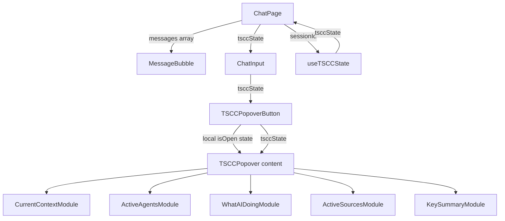

<!-- PE-REVIEWED -->
# Design Document: Optimize Chat TSCC

## Overview

This feature reclaims vertical space in the chat window by removing two TSCC UI elements that consume permanent layout real estate and replacing them with an on-demand popover triggered from a compact icon button in the ChatInput bottom row.

Three changes are made:
1. **Remove TSCCSnapshotCard** from the chat timeline — the `timeline` array merging logic in ChatPage is replaced with direct `messages` rendering.
2. **Remove TSCCPanel** from between the message area and ChatInput — the full-width collapsible bar/expanded view is no longer rendered in ChatPage's layout.
3. **Add TSCCPopoverButton** to ChatInput's bottom row — a compact icon button that opens a popover containing the same five cognitive modules currently in TSCCPanel's ExpandedView.

The `useTSCCState` hook and backend TSCC services remain unchanged. Only the rendering layer is modified.

## Architecture

### Current Layout (ChatPage)

```
┌─────────────────────────────┐
│ ChatHeader (tabs)           │
├─────────────────────────────┤
│ Messages + TSCCSnapshotCards│  ← timeline array (messages + snapshots merged)
├─────────────────────────────┤
│ TSCCPanel (collapsed/expand)│  ← full-width, always present
├─────────────────────────────┤
│ ChatInput                   │
│  [textarea] [send]          │
│  [attach] [/ commands]      │
└─────────────────────────────┘
```

### Target Layout (ChatPage)

```
┌─────────────────────────────┐
│ ChatHeader (tabs)           │
├─────────────────────────────┤
│ Messages only               │  ← direct messages array, no snapshots
├─────────────────────────────┤
│ ChatInput                   │
│  [textarea] [send]          │
│  [attach] [/ commands] [🧠] │  ← TSCC icon button added
└─────────────────────────────┘
         ┌──────────────┐
         │ TSCC Popover │  ← opens above ChatInput on click
         │ 5 modules    │
         └──────────────┘
```

### Component Dependency Flow



### Key Design Decisions

1. **Reuse existing cognitive module components** — The five module sub-components (`CurrentContextModule`, `ActiveAgentsModule`, `WhatAIDoingModule`, `ActiveSourcesModule`, `KeySummaryModule`) are currently defined inside `TSCCPanel.tsx`. They will be extracted into a shared location or the popover will import them from TSCCPanel. Since TSCCPanel itself is being removed from the ChatPage render tree (but the file is kept for now as the modules live there), the popover component will import the modules directly.

2. **Popover state managed locally in TSCCPopoverButton** — The popover open/close state is managed via a local `useState` inside `TSCCPopoverButton`, NOT by repurposing `useTSCCState`'s `isExpanded`/`toggleExpand`. Reason: `useTSCCState` persists expand prefs per-thread in module-level Maps (`expandPrefs`), which would cause the popover to auto-reopen when switching back to a tab — wrong UX for a transient popover. The popover should always start closed on mount/tab-switch. ChatPage no longer needs to pass `tsccExpanded` or `tsccToggleExpand` to ChatInput.

   **Tab-switch auto-close:** Since ChatInput is a single component instance that does NOT unmount on tab switch (only its props change), the TSCCPopoverButton MUST watch for `tsccState?.threadId` changes and auto-close the popover when the threadId changes. This is implemented via a `useEffect` that sets `isOpen = false` when `tsccState?.threadId` differs from the previous value. This ensures the popover doesn't stay open showing a different tab's context after switching.

3. **Props passed through ChatInput** — ChatPage passes `tsccState` to ChatInput. The popover open/close state is local to `TSCCPopoverButton` (not passed from ChatPage). This keeps the prop surface minimal.

4. **Click-outside and Escape dismissal** — Implemented via a `useEffect` with `mousedown` and `keydown` listeners on the document, scoped to the popover container ref. The click-outside handler MUST exclude both the popover container ref AND the toggle button ref to prevent the toggle click from being treated as an outside click (which would cause open-then-immediately-close). Both refs are checked in the handler: if the event target is inside either ref, the handler is a no-op.

5. **No new state management in ChatPage** — The `useTSCCState` hook's public API is unchanged. The `isPinned` / `togglePin` and `isExpanded` / `toggleExpand` returns become unused in ChatPage (popover state is local to TSCCPopoverButton) but the hook API is preserved per Requirement 6. ChatPage SHOULD destructure only `tsccState` and `applyTelemetryEvent` / `triggerAutoExpand` (needed by the streaming hook refs), omitting the unused expand/pin returns to keep the code clean.


## Components and Interfaces

### Modified Components

#### 1. ChatPage (`desktop/src/pages/ChatPage.tsx`)

**Removals:**
- Remove `TSCCSnapshotCard` import
- Remove `listSnapshots` import from `../services/tscc`
- Remove `threadSnapshots` state variable and its `useEffect` fetcher
- Remove `TimelineItem` type alias and `timeline` useMemo
- Remove `<TSCCPanel>` JSX from between messages and ChatInput
- Remove `TSCCPanel` import

**Modifications:**
- Render `messages` array directly in the scroll container instead of `timeline`
- Pass TSCC props to ChatInput: `tsccState`

```tsx
// Before: timeline.map(item => item.kind === 'message' ? <MessageBubble .../> : <TSCCSnapshotCard .../>)
// After:  messages.map(msg => <MessageBubble key={msg.id} message={msg} ... />)

<ChatInput
  // ...existing props
  tsccState={tsccState}
/>
```

#### 2. ChatInput (`desktop/src/pages/chat/components/ChatInput.tsx`)

**New props added to `ChatInputProps`:**
```tsx
interface ChatInputProps {
  // ...existing props
  tsccState?: TSCCState | null;
}
```

**Bottom row modification:**
```tsx
{/* Bottom Row - Attachment button + TSCC button + Commands hint */}
<div className="flex items-center justify-between mt-3 pt-3 border-t ...">
  <div className="flex items-center gap-2">
    <FileAttachmentButton ... />
    <TSCCPopoverButton
      tsccState={tsccState ?? null}
    />
  </div>
  <span className="text-xs ...">Type / for commands</span>
</div>
```

### New Components

#### 3. TSCCPopoverButton (`desktop/src/pages/chat/components/TSCCPopoverButton.tsx`)

A new component rendering the icon button and popover overlay.

```tsx
interface TSCCPopoverButtonProps {
  tsccState: TSCCState | null;
}
```

**Behavior:**
- Manages its own open/close state via local `useState<boolean>(false)` — always starts closed on mount
- Renders a `<button>` with the `psychology` Material Symbol icon, `aria-haspopup="true"`, and `aria-expanded` reflecting open state
- When `tsccState` is null, the button renders with `disabled` attribute set and reduced opacity — the `onClick` handler is not attached, preventing any toggle action. Note: `useTSCCState` falls back to `makeDefaultState()` on fetch failure, so null is only seen briefly during initial load.
- When `tsccState` is available, the button is active and clickable
- On click, toggles local `isOpen` state
- The popover renders above the button, anchored to its position
- Popover content is conditionally rendered ONLY when `isOpen === true` (not hidden via CSS) to avoid unnecessary DOM nodes and re-renders of the 5 cognitive modules
- Click-outside detection via `mousedown` listener on `document`, with exclusion checks for both the popover container ref AND the toggle button ref (prevents open-then-immediately-close race)
- Escape key detection via `keydown` listener on `document`
- Both listeners are added only when `isOpen === true` and cleaned up on close or component unmount (handles tab-switch unmount gracefully)

**Popover content:**
- Reuses the five cognitive module components from `TSCCPanel.tsx`
- Wrapped in a scrollable container with `max-h-[320px]`
- Styled consistently with existing panel: `bg-[var(--color-surface)]`, `border-[var(--color-border)]`, rounded corners, shadow

#### 4. Cognitive Module Extraction

The five cognitive module components (`CurrentContextModule`, `ActiveAgentsModule`, `WhatAIDoingModule`, `ActiveSourcesModule`, `KeySummaryModule`) are currently internal to `TSCCPanel.tsx`. Two options:

**Option A (chosen): Extract to TSCCModules.tsx** — Move the five cognitive module components to a new `desktop/src/pages/chat/components/TSCCModules.tsx` file. TSCCPopoverButton imports them from there. TSCCPanel.tsx is left as-is (not modified) but is no longer imported by ChatPage. This avoids importing from a dead component file and keeps the module home clearly named.

**Option B (deferred): Keep in TSCCPanel.tsx** — Add named exports for the five modules from TSCCPanel.tsx. Simpler but confusing since TSCCPanel itself is no longer rendered anywhere.

## Data Models

No new data models are introduced. All existing types are reused as-is:

| Type | Location | Usage |
|------|----------|-------|
| `TSCCState` | `types/index.ts` | Passed from ChatPage → ChatInput → TSCCPopoverButton |
| `TSCCLiveState` | `types/index.ts` | Read by cognitive modules inside popover |
| `TSCCSnapshot` | `types/index.ts` | No longer rendered; type retained for backend compatibility |
| `TSCCContext` | `types/index.ts` | Used by CurrentContextModule |
| `TSCCActiveCapabilities` | `types/index.ts` | Used by ActiveAgentsModule |
| `TSCCSource` | `types/index.ts` | Used by ActiveSourcesModule |

### Prop Flow Changes

```
ChatPage
  └── tsccState: TSCCState | null        (from useTSCCState)
       │
       ▼
ChatInput (new optional prop)
  └── tsccState?: TSCCState | null
       │
       ▼
TSCCPopoverButton (local state for open/close)
  ├── tsccState: TSCCState | null        (from prop)
  └── isOpen: boolean                    (local useState, always starts false)
```


## Correctness Properties

*A property is a characteristic or behavior that should hold true across all valid executions of a system — essentially, a formal statement about what the system should do. Properties serve as the bridge between human-readable specifications and machine-verifiable correctness guarantees.*

### Property Reflection

After prework analysis, the following redundancies were identified and consolidated:

- **1.1, 1.2, 1.4, 7.5** all test "rendered output contains only messages, no snapshots" → consolidated into Property 1
- **3.4 and 3.5** are complementary (null state = disabled, non-null = active) → consolidated into Property 2
- **4.1 and 4.2** both test toggle behavior → consolidated into Property 3
- **4.7 and 5.3** both test that prop changes propagate to popover content → consolidated into Property 5
- **2.1 and 2.2** are redundant (no TSCCPanel in layout) → covered by example tests only
- **5.1, 5.2, 6.2** are prop wiring verifications → covered by example tests only
- **6.3** is a distinct property about telemetry event application → Property 6

### Property 1: Messages-only rendering

*For any* list of messages, the ChatPage rendered output SHALL contain exactly one MessageBubble per message and zero TSCCSnapshotCard components or snapshot-related elements.

**Validates: Requirements 1.1, 1.2, 1.4, 7.5**

### Property 2: TSCC button state reflects data availability

*For any* TSCCState value (including null), the TSCCPopoverButton SHALL render in a disabled/muted state if and only if the tsccState prop is null, and in an active state if and only if tsccState is non-null.

**Validates: Requirements 3.4, 3.5**

### Property 3: Popover toggle is an involution

*For any* initial open/closed state of the popover, clicking the TSCC icon button SHALL toggle the state (open→closed, closed→open), and clicking twice SHALL return to the original state.

**Validates: Requirements 4.1, 4.2**

### Property 4: Popover displays all five cognitive modules

*For any* non-null TSCCState, when the popover is open, it SHALL render all five cognitive module sections: Current Context, Active Agents, What AI is Doing, Active Sources, and Key Summary.

**Validates: Requirements 4.6**

### Property 5: Popover content updates reactively

*For any* sequence of TSCCState values passed as props to the popover while it is open, the displayed content SHALL reflect the most recent state without requiring close/reopen.

**Validates: Requirements 4.7, 5.3**

### Property 6: Telemetry event application preserves state structure

*For any* valid TSCCState and any valid telemetry StreamEvent, applying the event via `applyTelemetryEvent` SHALL produce a TSCCState that retains all required fields (threadId, liveState with all five module data arrays) and the updated field contains the event's data.

**Validates: Requirements 6.3**

### Property 7: Tab-switch closes popover and resets TSCC context

*For any* sequence of tab switches (threadId changes) or tsccState transitions to null, the TSCCPopoverButton SHALL close the popover when the underlying `tsccState.threadId` changes or becomes undefined, and the displayed TSCC content SHALL reflect only the newly active tab's session context — never stale data from a previous tab. When tsccState is null, the button SHALL be disabled preventing re-open.

**Validates: Requirements 4.10, 5.3**

## Error Handling

| Scenario | Handling |
|----------|----------|
| `tsccState` is null when popover button renders | Button renders with `disabled` attribute and muted styling; `onClick` handler is not attached, preventing toggle |
| `useTSCCState` fetch fails | Hook already falls back to `makeDefaultState()` — no change needed |
| Popover is open when session changes | `useTSCCState` resets state on threadId change; TSCCPopoverButton's threadId-watch `useEffect` auto-closes the popover before new state arrives |
| Popover is open when `tsccState` transitions to null (e.g., session deleted) | TSCCPopoverButton's threadId-watch `useEffect` detects the change (threadId becomes undefined); popover auto-closes. Additionally, the button transitions to disabled state, preventing re-open until new state arrives |
| Popover is open when streaming starts | Popover remains open; content updates reactively via prop changes |
| Click-outside listener fires during unmount | Listener cleanup in useEffect return prevents stale calls |
| Escape key pressed when popover is closed | No-op — keydown listener only attached when `isOpen === true` |
| Component unmounts while popover is open (e.g., tab switch) | useEffect cleanup function removes both `mousedown` and `keydown` document listeners; React unmount handles DOM cleanup |

No new error states are introduced. The feature is purely a rendering reorganization with no new API calls, data fetching, or state management.

## Testing Strategy

### Unit Tests (Example-based)

| Test | Validates |
|------|-----------|
| ChatPage renders MessageBubble for each message, no TSCCSnapshotCard | Req 1.1, 2.1 |
| ChatPage does not render TSCCPanel between messages and input | Req 2.1, 2.2 |
| ChatInput renders TSCCPopoverButton in bottom row | Req 3.1 |
| TSCCPopoverButton has aria-label for accessibility | Req 3.3 |
| Clicking outside open popover closes it | Req 4.3 |
| Pressing Escape closes open popover | Req 4.4 |
| ChatPage passes tsccState to ChatInput | Req 5.1, 5.2 |
| useTSCCState public API shape unchanged | Req 6.1 |

### Property-Based Tests

Property-based tests use `fast-check` (already available in the project's test dependencies or to be added). Each test runs a minimum of 100 iterations.

| Test | Property | Tag |
|------|----------|-----|
| Messages-only rendering | Property 1 | Feature: optimize-chat-tscc, Property 1: Messages-only rendering |
| Button state reflects nullability | Property 2 | Feature: optimize-chat-tscc, Property 2: TSCC button state reflects data availability |
| Toggle involution | Property 3 | Feature: optimize-chat-tscc, Property 3: Popover toggle is an involution |
| Five modules present | Property 4 | Feature: optimize-chat-tscc, Property 4: Popover displays all five cognitive modules |
| Reactive content updates | Property 5 | Feature: optimize-chat-tscc, Property 5: Popover content updates reactively |
| Telemetry event application | Property 6 | Feature: optimize-chat-tscc, Property 6: Telemetry event application preserves state structure |
| Tab-switch closes popover | Property 7 | Feature: optimize-chat-tscc, Property 7: Tab-switch closes popover and resets TSCC context |

### Test Configuration

- Library: `fast-check` for property-based testing
- Framework: `vitest` with `@testing-library/react` for component rendering
- Minimum iterations: 100 per property test
- Each property test MUST reference its design document property via comment tag
- Tag format: `Feature: optimize-chat-tscc, Property {number}: {property_text}`

