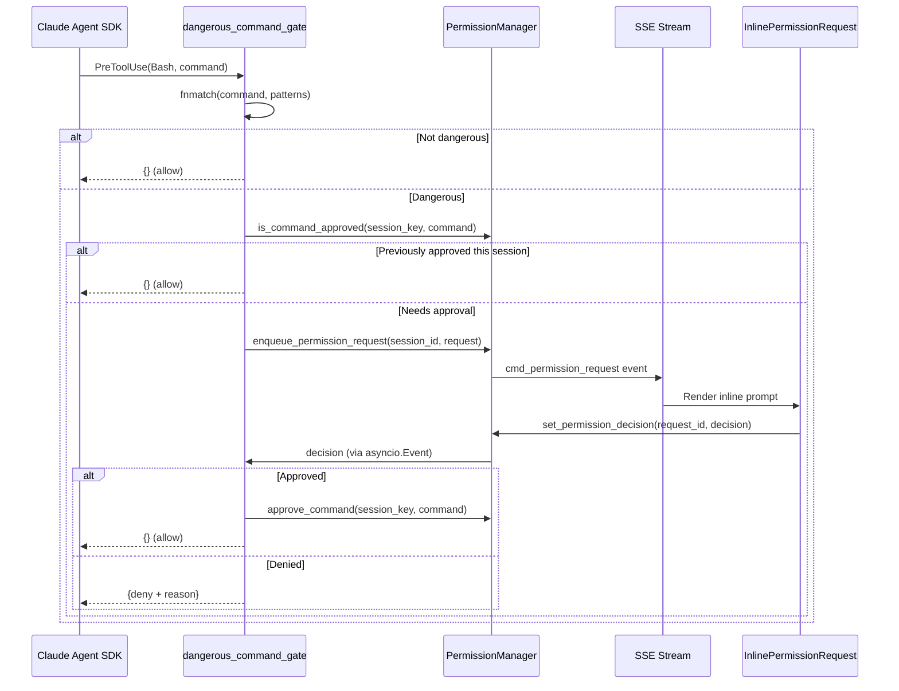
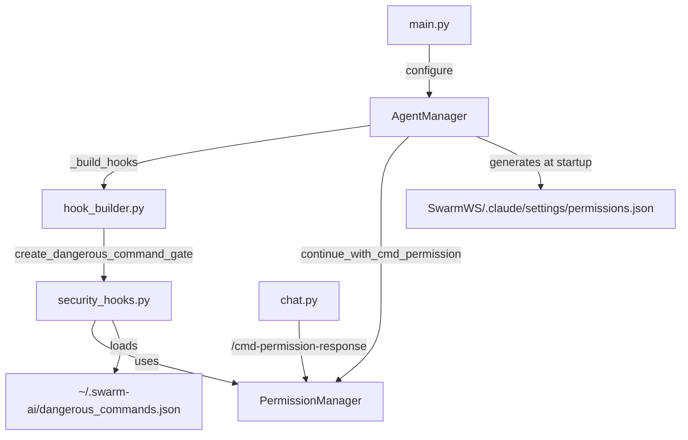

# Design Document: Permission Simplification

## Overview

This design replaces the 4-layer command permission system (~700 lines across 3 files) with a single "dangerous command gate" backed by a flat JSON pattern file and per-session in-memory approvals. The existing HITL asyncio plumbing (queues, events, SSE) is preserved — it's the mechanism for inline chat permission prompts and must stay.

### Current State (Before)

```
security_hooks.py (418 lines)
├── DANGEROUS_PATTERNS (13 regex tuples) — dead code, never wired
├── check_dangerous_command()            — dead code
├── dangerous_command_blocker()          — dead code
├── create_human_approval_hook()         — active, delegates to CmdPermissionManager
├── create_file_access_permission_handler() — keep unchanged
└── create_skill_access_checker()           — keep unchanged

cmd_permission_manager.py (190 lines)
├── CmdPermissionManager class — filesystem-backed, cross-session
├── ~/.swarm-ai/cmd_permissions/dangerous_patterns.json
└── ~/.swarm-ai/cmd_permissions/approved_commands.json

permission_manager.py (190 lines)
├── Per-session approval tracking (approve_command, is_command_approved)
├── HITL plumbing (queues, events, wait/set)
├── Pending request store
└── get_permission_queue() — deprecated
```

### Target State (After)

```
security_hooks.py (~150 lines)
├── create_dangerous_command_gate()          — single gate, loads patterns, checks approvals
├── create_file_access_permission_handler()  — unchanged
└── create_skill_access_checker()            — unchanged

permission_manager.py (~100 lines)
├── Per-session approval tracking (approve_command, is_command_approved, clear_session_approvals)
├── HITL plumbing (queues, events, wait/set)
└── Pending request store

~/.swarm-ai/dangerous_commands.json — single flat pattern file
SwarmWS/.claude/settings/permissions.json — read-only visibility file
```

### Deleted Artifacts

| Artifact | Reason |
|---|---|
| `cmd_permission_manager.py` | Replaced by gate + PermissionManager |
| `~/.swarm-ai/cmd_permissions/` directory | Replaced by single `dangerous_commands.json` |
| `PermissionRequestModal.tsx` | Dead code — `InlinePermissionRequest.tsx` is the active UI |
| `test_cmd_permission_manager.py` | Tests deleted module |
| `DANGEROUS_PATTERNS` regex list | Dead code |
| `check_dangerous_command()` | Dead code |
| `dangerous_command_blocker()` | Dead code |
| `get_permission_queue()` | Deprecated method |

## Architecture

### Simplified Permission Flow



### Component Dependency Graph (After)




## Components and Interfaces

### 1. `security_hooks.py` — Simplified

**Removed:** `DANGEROUS_PATTERNS`, `check_dangerous_command()`, `dangerous_command_blocker()`, `create_human_approval_hook()`, `from database import db`, `CmdPermissionManager` import.

**Retained unchanged:** `pre_tool_logger()`, `create_file_access_permission_handler()`, `create_skill_access_checker()`.

**New:** `create_dangerous_command_gate()` factory function.

```python
# New constants
DEFAULT_DANGEROUS_PATTERNS: list[str] = [
    # Moved from cmd_permission_manager.py — 20 glob patterns
    "rm -rf *", "rm -rf /*", "rm -rf ~*", "sudo *", ...
]

def load_dangerous_patterns() -> list[str]:
    """Load glob patterns from ~/.swarm-ai/dangerous_commands.json.
    Creates file with defaults if missing. Falls back to defaults on invalid JSON.
    Public API — also called by main.py for permissions.json generation.
    """
    ...

def create_dangerous_command_gate(
    session_context: dict[str, Any],
    session_key: str,
    permission_mgr: "PermissionManager",
    enable_human_approval: bool = True,
) -> Callable[..., Any]:
    """Factory: returns an async PreToolUse hook for Bash commands.
    
    Loads patterns once at gate creation time (not per-invocation).
    Uses permission_mgr for HITL flow and session approval tracking.
    
    When enable_human_approval=False (per-agent config), dangerous commands
    are auto-denied without prompting. The enable_human_approval field
    remains in the DB schema and agent config for per-agent control.
    """
    patterns = load_dangerous_patterns()
    
    async def dangerous_command_gate(input_data, tool_use_id, context):
        # 1. Extract command from Bash tool input
        # 2. fnmatch against patterns
        # 3. If not dangerous: return {} (allow)
        # 4. If dangerous and enable_human_approval=False: return deny dict
        # 5. Check session approvals via permission_mgr.is_command_approved()
        # 6. If needs approval: enqueue request, wait for decision
        # 7. On approve: permission_mgr.approve_command(), return {}
        # 8. On deny: return deny dict
        ...
    
    return dangerous_command_gate
```

### 2. `permission_manager.py` — Simplified

**Removed:** `get_permission_queue()` (deprecated method).

**Removed:** No filesystem I/O (there was none — this is already clean).

**Retained (HITL plumbing):**
- `wait_for_permission_decision()` / `set_permission_decision()` — asyncio.Event signaling
- `get_session_queue()` / `remove_session_queue()` / `enqueue_permission_request()` — per-session queues
- `store_pending_request()` / `get_pending_request()` / `update_pending_request()` / `remove_pending_request()`

**Retained (session approval tracking):**
- `approve_command()` / `is_command_approved()` / `clear_session_approvals()` / `hash_command()`

The singleton `permission_manager` instance remains the module-level export.

### 3. `hook_builder.py` — Simplified

**Changes:**
- Remove `cmd_permission_manager` parameter from `build_hooks()`
- Remove `CmdPermissionManager` TYPE_CHECKING import
- Remove sandbox conditional skip (`sandbox_enabled` check that disables human approval)
- Replace `create_human_approval_hook(...)` call with `create_dangerous_command_gate(...)`
- Always attach the gate unconditionally via `HookMatcher(matcher="Bash", hooks=[...])`
- Import `create_dangerous_command_gate` instead of `create_human_approval_hook`
- Pass `enable_human_approval` from agent_config to the gate (per-agent control preserved)

```python
async def build_hooks(
    agent_config: dict,
    enable_skills: bool,
    enable_mcp: bool,
    resume_session_id: Optional[str],
    session_context: Optional[dict],
    permission_manager: "PermissionManager",
    # cmd_permission_manager parameter REMOVED
) -> tuple[dict, list[str], bool]:
    ...
    # Gate always attached — no sandbox conditional skip
    enable_human_approval = agent_config.get("enable_human_approval", True)
    gate = create_dangerous_command_gate(
        hook_session_context, session_key, permission_manager,
        enable_human_approval=enable_human_approval,
    )
    hooks["PreToolUse"].append(HookMatcher(matcher="Bash", hooks=[gate]))
```

### 4. `agent_manager.py` — Cleanup

**Changes to `AgentManager.__init__()`:**
- Remove `cmd_permission_manager` parameter
- Remove `self._cmd_pm` attribute

**Changes to `AgentManager.configure()`:**
- Remove `cmd_permission_manager` parameter
- Remove `self._cmd_pm = cmd_permission_manager` assignment

**Changes to `AgentManager._build_hooks()`:**
- Stop passing `self._cmd_pm` to `build_hooks()`

**Changes to `continue_with_cmd_permission()`:**
- Remove `self._cmd_pm.approve(command)` call and its try/except
- On approve: call `_pm.approve_command(perm_session_id, command)` only

**Changes to module-level re-exports:**
- Remove `from .cmd_permission_manager import CmdPermissionManager`
- Remove re-exports of `DANGEROUS_PATTERNS`, `check_dangerous_command` (if any)

### 5. `chat.py` — `/cmd-permission-response` Endpoint

**Changes to `handle_cmd_permission_response()`:**
- Remove the `if request.decision == "approve":` block that calls `agent_manager._cmd_pm.approve(command)`
- Remove the fallback `from core.agent_manager import approve_command as _legacy_approve`
- On approve: call `_pm.approve_command(session_id, command)` only
- The `set_permission_decision()` call and response format remain unchanged

**Note on dual-approval idempotency:** Both the gate hook (when asyncio.Event resolves) and the API endpoint call `approve_command()` for the same command. This is harmless — `approve_command()` adds a hash to a `set`, so duplicate adds are a no-op. The gate's approval fires first (it's in the same async flow as the decision), and the endpoint's approval is a redundant safety net. No behavioral difference.

### 6. `main.py` — Startup Wiring

**Changes to lifespan function:**
- Remove `from core.cmd_permission_manager import CmdPermissionManager`
- Remove `cmd_perm = CmdPermissionManager()` and `cmd_perm.load()`
- Remove `cmd_permission_manager=cmd_perm` from `agent_manager.configure()` call
- Add: load dangerous patterns and generate `permissions.json` at startup

```python
# In lifespan, after workspace setup:
from core.security_hooks import load_dangerous_patterns
patterns = load_dangerous_patterns()
_generate_permissions_json(agent_workspace, patterns)
```

**Note:** `.claude/settings/` is a new subdirectory (`.claude/` currently only has `skills/`). The auto-commit hook in `auto_commit_hook.py` should add a category for it:

```python
COMMIT_CATEGORIES: dict[str, str] = {
    ".context/": "framework",
    ".claude/skills/": "skills",
    ".claude/settings/": "config",  # NEW
    "Knowledge/": "content",
    ...
}
```

### 7. Permission Visibility — `permissions.json` Generation

A new utility function (in `agent_manager.py` or `main.py`) generates `SwarmWS/.claude/settings/permissions.json` at agent startup:

```python
def _generate_permissions_json(workspace_path: Path, dangerous_patterns: list[str]) -> None:
    """Write read-only permissions.json for user visibility.
    
    Shows only the dangerous command patterns — all other tools are
    auto-approved via bypassPermissions, so listing them adds no value.
    """
    settings_dir = workspace_path / ".claude" / "settings"
    settings_dir.mkdir(parents=True, exist_ok=True)
    content = {
        "description": "Commands matching these glob patterns require user approval per session. "
                       "All other commands are auto-approved. "
                       "Edit ~/.swarm-ai/dangerous_commands.json to customize.",
        "dangerous_commands": dangerous_patterns,
    }
    (settings_dir / "permissions.json").write_text(
        json.dumps(content, indent=2) + "\n", encoding="utf-8"
    )
```

**No `allowed_tools` section** — all tools are auto-approved via `bypassPermissions`, so listing them adds noise without value. The file focuses on what the user actually needs to know: which commands will prompt them.

**No mid-session revoke** — once a command is approved for a session, it stays approved until the session ends. Adding a revoke mechanism would require a new API endpoint and UI affordance for a rare edge case. Keep it simple.

### 8. Frontend — Delete `PermissionRequestModal.tsx`

Delete `desktop/src/components/chat/PermissionRequestModal.tsx` and remove any imports referencing it. `InlinePermissionRequest.tsx` remains the sole permission UI — unchanged.

### 9. Test File Changes

| File | Action |
|---|---|
| `test_cmd_permission_manager.py` | Delete entirely |
| `test_credential_validator_integration.py` | Remove `CmdPermissionManager` import/mock, use direct attribute assignment instead of `configure()` with `cmd_permission_manager` |
| `helpers_parallel_session.py` | Remove `cmd_permission_manager=MagicMock()` from `AgentManager()` constructor call |
| `test_permission_manager.py` | Remove test for `get_permission_queue()` if present; existing property tests for approve/check round-trip and decision set/wait remain valid |
| `test_parallel_session_safety.py` | No changes needed — tests queue isolation which is preserved |

## Data Models

### `~/.swarm-ai/dangerous_commands.json`

```json
{
  "patterns": [
    "rm -rf *",
    "rm -rf /*",
    "rm -rf ~*",
    "sudo *",
    "chmod 777 *",
    "chmod -R 777 *",
    "chown -R * /",
    "kill -9 *",
    "mkfs.*",
    "dd if=*",
    "curl *|bash*",
    "curl *|sh*",
    "wget *|bash*",
    "wget *|sh*",
    "> /dev/sda*",
    "> /dev/hda*",
    "> /dev/nvme*",
    "> /dev/vda*",
    "> /etc/*",
    ":()*{*:*|*:*&*}*;*:*"
  ]
}
```

Patterns use `fnmatch` glob syntax. The file is human-editable. Changes take effect on next gate creation (next session start).

### `SwarmWS/.claude/settings/permissions.json`

```json
{
  "description": "Commands matching these glob patterns require user approval per session. All other commands are auto-approved. Edit ~/.swarm-ai/dangerous_commands.json to customize.",
  "dangerous_commands": ["rm -rf *", "rm -rf /*", "rm -rf ~*", "sudo *", "..."]
}
```

This file is regenerated at each agent startup. Editing it has no effect on actual behavior — the source of truth is `~/.swarm-ai/dangerous_commands.json`.

### In-Memory Data Structures (PermissionManager)

```python
# Per-session approved command hashes — cleared on session cleanup
_approved_commands: dict[str, set[str]]  # session_id → {sha256_hash[:16], ...}

# HITL signaling — unchanged
_permission_events: dict[str, asyncio.Event]   # request_id → Event
_permission_results: dict[str, str]            # request_id → "approve"|"deny"
_session_queues: dict[str, asyncio.Queue]      # session_id → Queue
_pending_requests: dict[str, dict[str, Any]]   # request_id → request data
```

### SSE Event Format (Unchanged)

```json
{
  "event": "cmd_permission_request",
  "data": {
    "sessionId": "...",
    "requestId": "perm_abc123",
    "toolName": "Bash",
    "toolInput": {"command": "rm -rf /tmp/old"},
    "reason": "Matches dangerous command pattern",
    "options": ["approve", "deny"]
  }
}
```


## Correctness Properties

*A property is a characteristic or behavior that should hold true across all valid executions of a system — essentially, a formal statement about what the system should do. Properties serve as the bridge between human-readable specifications and machine-verifiable correctness guarantees.*

### Property 1: Glob matching correctness

*For any* bash command string and *for any* list of glob patterns, the dangerous command gate's "is dangerous" decision shall equal `any(fnmatch.fnmatch(command, p) for p in patterns)`. A command that matches no pattern is allowed (empty dict); a command that matches at least one pattern proceeds to the approval check.

**Validates: Requirements 3.2, 3.3, 4.5**

### Property 2: Approve/check round-trip per session

*For any* session ID and *for any* command string, calling `approve_command(session_id, command)` then `is_command_approved(session_id, command)` shall return `True`. Conversely, for any command that has not been approved in that session, `is_command_approved` shall return `False`.

**Validates: Requirements 3.4, 3.6, 5.2, 6.5**

### Property 3: Session isolation of approvals

*For any* two distinct session IDs and *for any* command, approving the command in session A shall not cause `is_command_approved(session_B, command)` to return `True`. Each session's approval set is independent.

**Validates: Requirements 5.1, 5.5**

### Property 4: Session cleanup clears approvals

*For any* session ID and *for any* set of previously approved commands, calling `clear_session_approvals(session_id)` shall cause all subsequent `is_command_approved(session_id, command)` calls to return `False`.

**Validates: Requirements 5.3**

### Property 5: Pending request store/get/remove round-trip

*For any* permission request dict with a unique `id` field, storing it via `store_pending_request(request)` then retrieving it via `get_pending_request(request["id"])` shall return the original request data. After `remove_pending_request(request["id"])`, `get_pending_request` shall return `None`.

**Validates: Requirements 6.3**

### Property 6: Permission decision set/wait round-trip

*For any* request ID and *for any* decision in `{"approve", "deny"}`, if `set_permission_decision(request_id, decision)` is called while `wait_for_permission_decision(request_id)` is awaiting, the wait shall resolve and return the exact decision string.

**Validates: Requirements 3.5, 3.7**

### Property 7: Dangerous patterns file round-trip

*For any* list of non-empty glob pattern strings, writing them to `dangerous_commands.json` in the format `{"patterns": [...]}` and then loading them via `load_dangerous_patterns()` shall return the exact same list of patterns.

**Validates: Requirements 4.1, 4.2, 4.4**


## Error Handling

### Pattern File Errors

| Scenario | Behavior |
|---|---|
| `~/.swarm-ai/dangerous_commands.json` missing | Create with `DEFAULT_DANGEROUS_PATTERNS`, log info |
| File contains invalid JSON | Fall back to `DEFAULT_DANGEROUS_PATTERNS`, log warning |
| File has wrong schema (no `"patterns"` key) | Fall back to `DEFAULT_DANGEROUS_PATTERNS`, log warning |
| File is empty | Fall back to `DEFAULT_DANGEROUS_PATTERNS`, log warning |
| File permissions prevent reading | Fall back to `DEFAULT_DANGEROUS_PATTERNS`, log warning |

### Permission Flow Errors

| Scenario | Behavior |
|---|---|
| `wait_for_permission_decision` times out (300s) | Return `"deny"`, update pending request status to `"expired"` |
| Permission request not found in pending store | Return 422 ValidationException from API endpoint |
| Session ID mismatch on permission response | Return 422 ValidationException from API endpoint |
| `enqueue_permission_request` called for unknown session | Lazily create queue (existing behavior preserved) |

### Permissions.json Generation Errors

| Scenario | Behavior |
|---|---|
| `SwarmWS/.claude/settings/` directory creation fails | Log warning, continue startup (non-critical) |
| File write fails | Log warning, continue startup (non-critical) |

### Design Decisions

1. **No overly-broad pattern rejection in the gate**: Unlike the deleted `CmdPermissionManager.approve()`, the gate does not reject `*` patterns in the patterns file. Users who edit `dangerous_commands.json` to add `*` will be prompted for every Bash command — that's their choice. The gate only loads patterns, it doesn't validate them.

2. **Patterns loaded once per gate creation**: Patterns are loaded when `create_dangerous_command_gate()` is called (once per session start), not on every command check. This means changes to `dangerous_commands.json` take effect on the next session, not mid-session. This is intentional — it avoids file I/O on the hot path. Multiple concurrent session starts may call `load_dangerous_patterns()` simultaneously — this is safe because the function is read-only (or creates the file with defaults if missing, which is idempotent). No locking needed.

3. **Session approval uses command hash, not glob**: When a user approves `rm -rf /tmp/old`, only that exact command (by SHA-256 hash) is approved for the session. This is more conservative than the deleted `CmdPermissionManager` which stored glob patterns. The user must re-approve each distinct dangerous command.

4. **`enable_human_approval` flag preserved**: The `enable_human_approval` field remains in the DB schema and agent config (`schemas/agent.py`, `agent_defaults.py`, `generate_seed_db.py`). When `True` (default), the gate prompts the user inline. When `False`, the gate auto-denies dangerous commands without prompting. This replaces the old sandbox-conditional skip with explicit per-agent control. No schema migration needed.

5. **No `allowed_tools` in permissions.json**: All tools are auto-approved via `bypassPermissions` — listing them adds noise without value. The visibility file focuses solely on what the user needs to know: which commands will prompt them.

6. **No mid-session revoke**: Once a command is approved for a session, it stays approved until the session ends. Adding a revoke mechanism would require a new API endpoint and UI affordance for a rare edge case. Keep it simple.

7. **Dual-approval idempotency**: Both the gate hook (when asyncio.Event resolves) and the API endpoint call `approve_command()` for the same command. This is harmless — `approve_command()` adds a hash to a `set`, so duplicate adds are a no-op.

8. **`.claude/settings/` is a new subdirectory**: The `.claude/` directory currently only has `skills/` (managed by ProjectionLayer). The auto-commit hook should categorize `.claude/settings/` commits as `"config"`.


## Multi-Session Safety

This design preserves all existing per-session isolation invariants from the `session-identity-and-backend-isolation.md` steering file. Key guarantees:

| Concern | Mechanism | Status |
|---|---|---|
| Approval isolation between tabs | `_approved_commands` keyed by `session_id` — each session has its own `set` | Preserved (unchanged from current PermissionManager) |
| Permission queue isolation | `_session_queues` keyed by `session_id` — each session has its own `asyncio.Queue` | Preserved (unchanged) |
| Permission event isolation | `_permission_events` keyed by `request_id` (unique UUID per request) — no cross-session collision | Preserved (unchanged) |
| Concurrent pattern file reads | `load_dangerous_patterns()` is read-only (or idempotent create-with-defaults). No locking needed. | Safe |
| `permissions.json` generation | Called once at startup in `main.py` lifespan (single-threaded), not per-session | Safe |
| Gate closure captures | Each gate closure captures its own `session_context`, `session_key`, and `patterns` list. No shared mutable state between closures. | Safe |
| Session cleanup | `clear_session_approvals(session_id)` + `remove_session_queue(session_id)` called in `_cleanup_session()` — unchanged | Preserved |

**No new shared mutable state introduced.** The only module-level singleton is `permission_manager` (existing), which uses per-session dicts/sets internally. The `DEFAULT_DANGEROUS_PATTERNS` constant is immutable. The `load_dangerous_patterns()` function returns a new list each call — no shared reference.


## Testing Strategy

### Dual Testing Approach

This feature uses both unit tests (specific examples, edge cases) and property-based tests (universal properties across generated inputs). Property-based tests use the `hypothesis` library (already in the project) with a minimum of 100 iterations per property.

### Property-Based Tests

Each correctness property maps to a single property-based test. All tests go in `backend/tests/test_permission_simplification.py`.

| Property | Test Description | Generator Strategy |
|---|---|---|
| P1: Glob matching | Generate random commands + pattern lists, verify gate decision matches `fnmatch` | `st.text()` for commands, `st.lists(st.text())` for patterns |
| P2: Approve/check round-trip | Generate random session IDs + commands, approve then check | `st.text(min_size=1)` for both |
| P3: Session isolation | Generate two distinct session IDs + a command, approve in one, check both | `st.text(min_size=1)` with `assume(s1 != s2)` |
| P4: Cleanup clears approvals | Generate session ID + list of commands, approve all, clear, check all return False | `st.text(min_size=1)`, `st.lists(st.text(min_size=1), min_size=1)` |
| P5: Pending request round-trip | Generate request dicts with unique IDs, store/get/remove | `st.fixed_dictionaries({"id": st.text(min_size=1)})` |
| P6: Decision set/wait round-trip | Generate request IDs + decisions, set then wait | `st.text(min_size=1)`, `st.sampled_from(["approve", "deny"])` |
| P7: Patterns file round-trip | Generate pattern lists, write to temp file, load back | `st.lists(st.text(min_size=1), min_size=1)` |

Each test is tagged with: `# Feature: permission-simplification, Property {N}: {title}`

### Unit Tests

Unit tests cover specific examples and edge cases not suited to property-based testing:

- **Dead code removal**: Verify `dangerous_command_blocker`, `DANGEROUS_PATTERNS`, `check_dangerous_command`, `get_permission_queue` are absent from their respective modules
- **File missing/invalid JSON**: Verify `load_dangerous_patterns()` falls back to defaults
- **Gate integration**: Verify the gate returns `{}` for safe commands, enqueues for dangerous unapproved commands
- **Hook builder always attaches gate**: Verify `build_hooks()` output contains Bash matcher regardless of `sandbox_enabled`

### Test File Changes

- **Delete**: `test_cmd_permission_manager.py`
- **Update**: `test_credential_validator_integration.py` — remove `CmdPermissionManager` import/mock
- **Update**: `helpers_parallel_session.py` — remove `cmd_permission_manager=MagicMock()` from constructor
- **Update**: `test_permission_manager.py` — remove `get_permission_queue` test if present; existing P2/P6 property tests remain valid
- **No change**: `test_parallel_session_safety.py` — queue isolation tests remain valid
