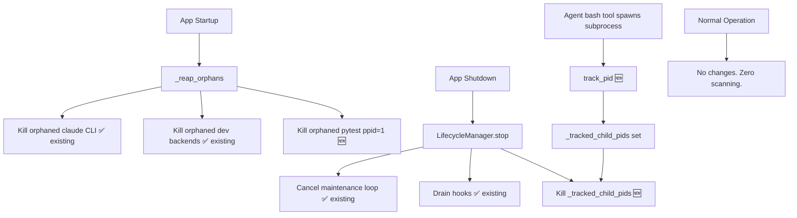

# Design: Lightweight Process Lifecycle Watchdog

## Overview

The SwarmAI backend has three process cleanup gaps:

1. **Orphaned pytest processes** survive app crashes and accumulate across restarts (zombie pytest consuming CPU).
2. **Tracked child PIDs** (pytest spawned by the agent's bash tool) aren't cleaned up at shutdown.
3. The Hypothesis deadline fix (already in `conftest.py`) prevents new zombie pytest from forming during test runs.

The fix is minimal: add a `_tracked_child_pids: set[int]` to `LifecycleManager`, extend `_reap_orphans()` to kill orphaned pytest, and kill tracked PIDs at shutdown. No new files, no new classes, no background scanning.

### What Already Works (No Changes Needed)

- `SessionUnit.kill()` / `_force_kill()` kills the Claude CLI subprocess. Claude SDK cleans up its own MCP children.
- `disconnect_all()` kills all alive SessionUnits at shutdown.
- `_reap_orphans()` kills orphaned claude CLI and dev backend processes at startup.
- TTL eviction (12hr idle) handles abandoned tabs.
- Hypothesis deadline in `conftest.py` prevents infinite shrinking loops.

### Design Decisions

- **No new files**: All changes go into `lifecycle_manager.py` only.
- **No process tree walking**: Claude SDK manages its own children. We don't enumerate grandchildren.
- **No continuous scanning**: Cleanup happens only at startup and shutdown.
- **Best-effort, never blocks**: All cleanup is wrapped in try/except. Failures logged, never propagated.
- **ppid=1 guard for pytest**: Only kill pytest processes that are truly orphaned (reparented to init/launchd), never the user's own pytest runs.

## Architecture

No new components. Two existing methods in `LifecycleManager` are extended, and one integration point is added:

```
Startup:   LifecycleManager._reap_orphans() → also kills orphaned pytest (ppid=1)
Shutdown:  LifecycleManager.stop() → also kills all _tracked_child_pids
Runtime:   SessionUnit bash tool output → LifecycleManager.track_pid(pid)
```

A new `set[int]` on `LifecycleManager` tracks non-SDK child PIDs registered during sessions.

### Integration Point: How PIDs Get Tracked

The `track_pid()` method must be called by the code that spawns non-SDK child processes. In SwarmAI, the primary source is the agent's bash tool (via the Claude SDK's `BashTool`). The integration point is in `SessionRouter` or the bash tool output handler — when a tool result indicates a background process was spawned (e.g., pytest), the PID is extracted and passed to `lifecycle_manager.track_pid(pid)`.

For the initial implementation, `track_pid()` is called manually by any code path that spawns a tracked subprocess. Future work could add automatic PID extraction from bash tool output, but that is out of scope for this spec.



## Components and Interfaces

### Changes to `LifecycleManager.__init__()`

Add a tracked PIDs set:

```python
self._tracked_child_pids: set[int] = set()
```

### New method: `LifecycleManager.track_pid(pid: int)`

```python
def track_pid(self, pid: int) -> None:
    """Register a non-SDK child PID for cleanup at shutdown."""
    self._tracked_child_pids.add(pid)
    logger.debug("lifecycle_manager.track_pid pid=%d", pid)
```

### New method: `LifecycleManager._kill_tracked_pids()`

Simple SIGKILL for all tracked PIDs. At shutdown the app is exiting — no need
for graceful SIGTERM escalation. The method is async to avoid blocking the
event loop (PE review finding #1).

```python
async def _kill_tracked_pids(self) -> None:
    """Kill all tracked child PIDs. Best-effort, never raises."""
    if not self._tracked_child_pids:
        return
    killed = 0
    for pid in list(self._tracked_child_pids):
        try:
            os.kill(pid, signal.SIGKILL)
            killed += 1
        except (ProcessLookupError, PermissionError):
            pass  # Already exited or not ours
        except Exception as exc:
            logger.debug("Could not kill tracked pid %d: %s", pid, exc)
    self._tracked_child_pids.clear()
    if killed:
        logger.info("Shutdown: killed %d tracked child process(es)", killed)
```

**Note on `track_pid()` integration**: In the current architecture, the Claude
SDK's BashTool runs inside the subprocess — the backend never sees child PIDs
directly. The `track_pid()` API exists for future integration (e.g., if we add
a PreToolUse hook that intercepts bash commands). For now, the startup orphan
reaper is the primary cleanup mechanism. The tracking set is kept as a
low-cost safety net for any code path that does have PID visibility.

### Changes to `LifecycleManager.stop()`

Call `_kill_tracked_pids()` after stopping the maintenance loop:

```python
async def stop(self) -> None:
    # ... existing loop cancellation and hook drain ...
    await self._kill_tracked_pids()
    logger.info("LifecycleManager stopped")
```

### Changes to `LifecycleManager._reap_orphans()`

Add a third section after the existing dev backend reaper to kill orphaned pytest processes.

Note: Uses `pgrep -f` with a pattern that matches both `pytest` (direct invocation) and `python -m pytest` (module invocation), combined with the ppid=1 guard to prevent false positives. The ppid=1 check is the primary safety mechanism — `pgrep -x pytest` was rejected because it misses `python -m pytest` which is how most zombie processes are actually invoked.

```python
# ── Also reap orphaned pytest processes ──
try:
    result3 = await asyncio.to_thread(
        subprocess.run,
        ["pgrep", "-f", "pytest"],
        capture_output=True, text=True, timeout=5,
    )
    if result3.returncode == 0:
        pytest_orphan_count = 0
        for line in result3.stdout.strip().split("\n"):
            line = line.strip()
            if not line:
                continue
            try:
                pid = int(line)
            except ValueError:
                continue
            if pid == os.getpid():
                continue
            # Only kill if orphaned (ppid=1) — this is the safety guard
            # that prevents killing the user's own pytest runs
            try:
                ppid_result = await asyncio.to_thread(
                    subprocess.run,
                    ["ps", "-o", "ppid=", "-p", str(pid)],
                    capture_output=True, text=True, timeout=5,
                )
                ppid = int(ppid_result.stdout.strip())
                if ppid != 1:
                    continue
            except (ValueError, subprocess.TimeoutExpired):
                continue
            try:
                os.kill(pid, signal.SIGKILL)
                pytest_orphan_count += 1
                logger.info("lifecycle_manager.reap_pytest_orphan pid=%d", pid)
            except (ProcessLookupError, PermissionError):
                pass
        if pytest_orphan_count:
            logger.warning(
                "Startup orphan reaper killed %d pytest process(es)",
                pytest_orphan_count,
            )
except Exception as exc:
    logger.warning("Pytest orphan reaper failed (non-fatal): %s", exc)
```

## Data Models

No new data models. The only new state is `_tracked_child_pids: set[int]` on `LifecycleManager`.

No new enums, dataclasses, registries, or files.


## Correctness Properties

*A property is a characteristic or behavior that should hold true across all valid executions of a system — essentially, a formal statement about what the system should do. Properties serve as the bridge between human-readable specifications and machine-verifiable correctness guarantees.*

### Property 1: track_pid set membership

*For any* integer PID, calling `track_pid(pid)` should result in that PID being present in `_tracked_child_pids`. Calling `track_pid` multiple times with the same PID should be idempotent (set semantics).

**Validates: Requirements 1.1, 1.3**

### Property 2: _kill_tracked_pids resilience

*For any* set of tracked PIDs (including PIDs that don't correspond to real processes, PIDs that raise PermissionError, and PIDs that raise unexpected exceptions), `_kill_tracked_pids()` should complete without raising an exception, and the tracked set should be empty afterward.

**Validates: Requirements 3.2, 3.3, 4.4**

Note: Requirement 1.2 ("silently remove exited PIDs") is satisfied by the shutdown-time `_kill_tracked_pids()` behavior — `ProcessLookupError` from `os.kill()` on an already-exited PID is silently caught, and the set is cleared afterward. There is no continuous liveness checking; removal happens at the cleanup boundary.

### Property 3: _kill_tracked_pids completeness

*For any* non-empty set of tracked PIDs, `_kill_tracked_pids()` should attempt `os.kill(pid, SIGKILL)` for every PID in the set, regardless of whether earlier kills succeed or fail.

**Validates: Requirements 3.1**

### Property 4: ppid=1 orphan guard

*For any* set of pytest PIDs discovered by pgrep, the orphan reaper should only kill those whose parent PID is 1. PIDs with ppid != 1 must never be killed. This is the primary safety mechanism — it prevents killing the user's own pytest runs regardless of the pgrep pattern used.

**Validates: Requirements 2.2**

### Property 5: pytest pattern coverage

*For any* pytest process invoked as either `pytest ...` (direct) or `python -m pytest ...` (module), the pgrep pattern should match it. Combined with the ppid=1 guard (Property 4), this ensures all orphaned pytest processes are caught without false positives on non-orphaned processes.

**Validates: Requirements 2.1, 2.4**

## Error Handling

All error handling follows one principle: **best-effort, never blocks**.

| Scenario | Behavior |
|----------|----------|
| `os.kill(SIGKILL)` raises `ProcessLookupError` | Silently skip (process already exited) |
| `os.kill()` raises `PermissionError` | Silently skip (not our process) |
| `os.kill()` raises unexpected exception | Log at debug level, continue |
| `pgrep` not found (`FileNotFoundError`) | Skip pytest orphan reaping entirely |
| `pgrep` times out | Skip pytest orphan reaping entirely |
| `pgrep -x pytest` matches no processes | Skip (returncode != 0) |
| `ps` fails for ppid check | Skip that PID (don't kill if we can't verify ppid) |
| Any exception in `_kill_tracked_pids()` | Caught, logged, never propagated |
| Any exception in pytest orphan reaper | Caught, logged, startup continues |

## Testing Strategy

### Property-Based Tests (Hypothesis)

Each correctness property maps to one Hypothesis test. Minimum 100 examples per test.

- **Property 1 test**: Generate random integers, call `track_pid()`, assert membership and idempotence.
  - Tag: `Feature: process-lifecycle-watchdog, Property 1: track_pid set membership`

- **Property 2 test**: Generate random sets of PIDs, mock `os.kill` to raise various exceptions (ProcessLookupError, PermissionError, OSError), call `_kill_tracked_pids()`, assert no exception raised and set is empty.
  - Tag: `Feature: process-lifecycle-watchdog, Property 2: _kill_tracked_pids resilience`

- **Property 3 test**: Generate random sets of PIDs, mock `os.kill`, call `_kill_tracked_pids()`, assert `os.kill` was called with SIGKILL for each PID in the original set.
  - Tag: `Feature: process-lifecycle-watchdog, Property 3: _kill_tracked_pids completeness`

- **Property 4 test**: Generate random lists of (pid, ppid) pairs, mock `pgrep -f pytest` and `ps` output, run the orphan reaper logic, assert only PIDs with ppid=1 had `os.kill` called.
  - Tag: `Feature: process-lifecycle-watchdog, Property 4: ppid=1 orphan guard`

- **Property 5 test**: Mock pgrep output to include PIDs from both `pytest ...` and `python -m pytest ...` invocations. Verify both are matched by the pattern and subject to the ppid=1 guard.
  - Tag: `Feature: process-lifecycle-watchdog, Property 5: pytest pattern coverage`

### Unit Tests (pytest)

Unit tests cover specific examples and edge cases:

- `test_tracked_pids_empty_on_init`: Verify `_tracked_child_pids` is empty after `LifecycleManager.__init__()`.
- `test_kill_tracked_pids_noop_when_empty`: Verify `_kill_tracked_pids()` does nothing when set is empty.
- `test_reap_orphans_skips_own_pid`: Verify `_reap_orphans()` never kills `os.getpid()`.
- `test_reap_orphans_continues_on_pgrep_failure`: Verify startup completes when `pgrep` is not found.

### Testing Library

- Property-based testing: **Hypothesis** (already in use, configured in `conftest.py` with 5s deadline)
- Unit testing: **pytest** (already in use)
- Mocking: **unittest.mock** for `os.kill`, `subprocess.run`
