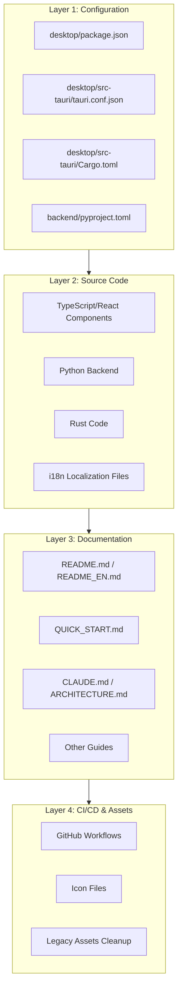

# Design Document: Owork to SwarmAI Rebranding

## Overview

This design document outlines the technical approach for completely rebranding the "Owork" AI Agent platform to "SwarmAI". The rebranding is a comprehensive text and asset replacement operation across the entire codebase, affecting configuration files, documentation, source code, CI/CD workflows, and visual assets.

### Scope Summary

Based on codebase analysis, the rebranding affects:
- **Configuration Files**: 5 files (package.json, tauri.conf.json, Cargo.toml, pyproject.toml, package-lock.json)
- **Documentation Files**: 10+ markdown files
- **Source Code**: TypeScript/React (6+ files), Python (3+ files), Rust (2 files)
- **CI/CD Workflows**: 4 GitHub Actions workflow files
- **Assets**: Icon files, legacy DMG, logo images

### Brand Transformation

| Element | Old Value | New Value |
|---------|-----------|-----------|
| Product Name | Owork | SwarmAI |
| Tagline (EN) | Personal Office Agent platform | Your AI Team, 24/7 |
| Tagline (CN) | 个人办公智能体平台 | 专属AI团队，7×24小时协作 |
| Slogan | N/A | Work Smarter. Stress Less. |
| App Identifier | com.owork.desktop | com.swarmai.app |
| Package Name | owork | swarmai |
| GitHub URL | github.com/xiehust/owork | github.com/xg-gh-25/SwarmAI |
| Version | 0.0.1 | 1.0.0 |

## Architecture

The rebranding operation follows a layered approach to ensure consistency and minimize risk:



### Execution Order Rationale

1. **Configuration First**: Package names and identifiers must be updated first as they affect build processes
2. **Source Code Second**: Code references depend on configuration being correct
3. **Documentation Third**: Docs reference both config and code elements
4. **CI/CD & Assets Last**: These depend on all other layers being correct

## Components and Interfaces

### Component 1: Configuration File Updates

Files to modify:

| File | Changes Required |
|------|------------------|
| `desktop/package.json` | name: "owork" → "swarmai", version: "0.0.1" → "1.0.0" |
| `desktop/package-lock.json` | name: "owork" → "swarmai", version: "0.0.1" → "1.0.0" |
| `desktop/src-tauri/tauri.conf.json` | productName, identifier, window title, version |
| `desktop/src-tauri/Cargo.toml` | package name, lib name, description, authors, version |
| `backend/pyproject.toml` | project name, description |

### Component 2: Source Code Updates

#### TypeScript/React Files

| File | Brand References |
|------|------------------|
| `desktop/src/components/common/Sidebar.tsx` | GitHub URL |
| `desktop/src/components/common/BackendStartupOverlay.tsx` | Logo alt text, app name, data paths |
| `desktop/src/pages/SettingsPage.tsx` | Data directory paths |
| `desktop/src/i18n/locales/en.json` | Dashboard title |
| `desktop/src/i18n/locales/zh.json` | Dashboard title |

#### Python Backend Files

| File | Brand References |
|------|------------------|
| `backend/config.py` | Data directory paths (macOS, Windows, Linux) |
| `backend/channels/base.py` | Docstring references |
| `backend/core/workspace_manager.py` | .owork directory reference |

#### Rust Files

| File | Brand References |
|------|------------------|
| `desktop/src-tauri/src/lib.rs` | Comments, OWORK_DEBUG env var |
| `desktop/src-tauri/src/main.rs` | owork_lib::run() call |

### Component 3: Documentation Updates

| File | Update Type |
|------|-------------|
| `README.md` | Full rebrand: title, tagline, description, URLs, paths |
| `README_EN.md` | Full rebrand: title, tagline, description, URLs, paths |
| `QUICK_START.md` | Title, download URLs, paths, GitHub URL |
| `CLAUDE.md` | Project references |
| `ARCHITECTURE.md` | Project references |
| `SECURITY.md` | Project references |
| `SKILLS_GUIDE.md` | Project references |
| `desktop/README.md` | Project references |
| `desktop/BUILD_GUIDE.md` | Project references |
| `backend/README.md` | Project references |

### Component 4: CI/CD Workflow Updates

| File | Changes |
|------|---------|
| `.github/workflows/dev-build.yml` | Artifact names |
| `.github/workflows/build-macos.yml` | Artifact names, app bundle paths, release names |
| `.github/workflows/build-windows.yml` | Artifact names, release names |
| `.github/workflows/release.yml` | Artifact names, release names, updater filenames |

### Component 5: Asset Management

| Action | Files |
|--------|-------|
| Delete | `assets/Owork_0.0.1-beta_aarch64.dmg` |
| Rename/Update | `desktop/src-tauri/icons/oworklog.png` → `swarmai-logo.png` |
| Keep | `assets/SwarmAI-logo-new.png` (already has correct branding) |

## Data Models

This rebranding operation does not modify data models or database schemas. The following data structures remain unchanged:

- SQLite database schema
- API request/response models
- Agent configuration models
- Skill and plugin models

The only data-related change is the **data directory path** which affects where the application stores files:

```
# Old paths
macOS:   ~/Library/Application Support/Owork/
Windows: %LOCALAPPDATA%\Owork\
Linux:   ~/.local/share/owork/

# New paths
macOS:   ~/Library/Application Support/SwarmAI/
Windows: %LOCALAPPDATA%\SwarmAI\
Linux:   ~/.local/share/SwarmAI/
```

**Note**: Existing users would need to manually migrate their data or the application could include a one-time migration on first launch (out of scope for this rebranding spec).

## String Replacement Mapping

### Exact Replacements (Case-Sensitive)

| Old String | New String | Context |
|------------|------------|---------|
| `Owork` | `SwarmAI` | Product name (title case) |
| `owork` | `swarmai` | Package names, paths (lowercase) |
| `OWORK` | `SWARMAI` | Environment variables (uppercase) |
| `owork_lib` | `swarmai_lib` | Rust library name |
| `com.owork.desktop` | `com.swarmai.app` | App identifier |
| `Owork Team` | `SwarmAI Team` | Authors |

### URL Replacements

| Old URL | New URL |
|---------|---------|
| `https://github.com/xiehust/owork` | `https://github.com/xg-gh-25/SwarmAI` |
| `https://github.com/xiehust/owork.git` | `https://github.com/xg-gh-25/SwarmAI.git` |
| `d1a1de1i2hajk1.cloudfront.net/owork/...` | Remove or replace with placeholder |

### Tagline Replacements

| Old | New |
|-----|-----|
| `Personal Office Agent platform` | `Your AI Team, 24/7` |
| `个人办公智能体平台` | `专属AI团队，7×24小时协作` |

### Version Replacement

| Old | New |
|-----|-----|
| `0.0.1` | `1.0.0` |


## Correctness Properties

*A property is a characteristic or behavior that should hold true across all valid executions of a system—essentially, a formal statement about what the system should do. Properties serve as the bridge between human-readable specifications and machine-verifiable correctness guarantees.*

Based on the prework analysis, the following properties can be verified to ensure the rebranding is complete and correct:

### Property 1: No Old Brand Name References

*For any* file in the repository (excluding `.kiro/specs/` directory), the file content SHALL NOT contain the string "Owork" or "owork" (case-insensitive match).

**Validates: Requirements 2.1-2.10, 7.1-7.4**

### Property 2: No Old GitHub URL References

*For any* file in the repository, the file content SHALL NOT contain the string "github.com/xiehust/owork" or "github.com/xiehust/owork.git".

**Validates: Requirements 3.1, 3.2, 3.3**

### Property 3: No Old CloudFront URL References

*For any* file in the repository, the file content SHALL NOT contain the string "d1a1de1i2hajk1.cloudfront.net/owork".

**Validates: Requirements 8.1, 8.2**

### Property 4: Data Paths Use New Brand Name

*For any* source code file that defines data directory paths, all path strings SHALL contain "SwarmAI" (or "swarmai" for lowercase contexts) instead of "Owork" (or "owork").

**Validates: Requirements 6.1, 6.2, 6.3**

### Property 5: CI/CD Artifacts Use New Brand Name

*For any* GitHub Actions workflow file, all artifact name definitions SHALL contain "SwarmAI" instead of "Owork".

**Validates: Requirements 5.1, 5.2, 5.3, 5.4**

### Property 6: Old Taglines Replaced

*For any* documentation file, the content SHALL NOT contain "Personal Office Agent platform" or "个人办公智能体平台", AND the README files SHALL contain "Your AI Team, 24/7" and "专属AI团队，7×24小时协作".

**Validates: Requirements 10.1, 10.2, 10.3, 10.4**

### Property 7: No Legacy Asset Files

*For any* file in the `assets/` directory, the filename SHALL NOT contain "Owork" (case-insensitive).

**Validates: Requirements 11.1, 11.2**

### Property 8: Version Consistency

*For all* configuration files that define a version (package.json, tauri.conf.json, Cargo.toml), the version SHALL be "1.0.0".

**Validates: Requirements 1.7**

## Error Handling

### Potential Issues and Mitigations

| Issue | Mitigation |
|-------|------------|
| Incomplete string replacement | Use comprehensive grep search before and after to verify |
| Case sensitivity mismatches | Handle Owork, owork, OWORK separately |
| Breaking Rust compilation | Update lib name references in main.rs when changing Cargo.toml |
| Breaking npm install | Regenerate package-lock.json after package.json changes |
| Broken internal links | Verify all relative links in documentation still work |
| Missing file references | Check for hardcoded paths that reference old brand |

### Validation Checklist

Before considering the rebranding complete:

1. [ ] Run `grep -ri "owork" --include="*.md" --include="*.json" --include="*.toml" --include="*.ts" --include="*.tsx" --include="*.py" --include="*.rs" --include="*.yml" .` and verify only spec files match
2. [ ] Run `npm install` in desktop/ directory successfully
3. [ ] Run `cargo check` in desktop/src-tauri/ directory successfully
4. [ ] Verify all documentation renders correctly
5. [ ] Verify no broken links in README files

## Testing Strategy

### Verification Approach

Since this is a rebranding operation (text/config changes only), testing focuses on:

1. **Static Analysis**: Grep-based verification that old brand references are removed
2. **Build Verification**: Ensure the application still builds after changes
3. **Manual Review**: Visual inspection of key files

### Property-Based Tests

Property tests will use shell scripts with grep to verify the correctness properties:

```bash
# Property 1: No old brand name (excluding spec files)
grep -ri "owork" --include="*.md" --include="*.json" --include="*.toml" \
  --include="*.ts" --include="*.tsx" --include="*.py" --include="*.rs" \
  --include="*.yml" . | grep -v ".kiro/specs/" | wc -l
# Expected: 0

# Property 2: No old GitHub URL
grep -r "github.com/xiehust/owork" . | wc -l
# Expected: 0

# Property 3: No old CloudFront URL
grep -r "d1a1de1i2hajk1.cloudfront.net/owork" . | wc -l
# Expected: 0
```

### Unit Tests (Examples)

Specific file checks to verify key configuration values:

1. **package.json name check**: Verify `name` field equals "swarmai"
2. **tauri.conf.json identifier check**: Verify `identifier` field equals "com.swarmai.app"
3. **Cargo.toml package name check**: Verify `[package] name` equals "swarmai"
4. **Version consistency check**: Verify all config files have version "1.0.0"

### Build Verification

After all changes:

```bash
# Frontend build check
cd desktop && npm install && npm run build

# Rust build check  
cd desktop/src-tauri && cargo check

# Python syntax check
cd backend && python -m py_compile config.py
```

## GitHub Submission Guide

As part of Requirement 12, the following step-by-step guide will be included in the documentation for first-time GitHub users:

### Step 1: Prepare Local Repository

```bash
# Navigate to project root
cd /path/to/project

# Initialize git if not already (skip if .git exists)
git init

# Remove old remote if exists
git remote remove origin 2>/dev/null || true

# Add new remote
git remote add origin https://github.com/xg-gh-25/SwarmAI.git
```

### Step 2: Stage and Commit Changes

```bash
# Stage all changes
git add .

# Commit with descriptive message
git commit -m "chore: Complete rebrand from Owork to SwarmAI

- Update product name to SwarmAI
- Update tagline to 'Your AI Team, 24/7'
- Update app identifier to com.swarmai.app
- Update all package names to swarmai
- Update version to 1.0.0
- Update GitHub repository URL
- Remove legacy Owork assets
- Update all documentation"
```

### Step 3: Push to GitHub

```bash
# Push to main branch (first time)
git push -u origin main

# If branch is named 'master', use:
git push -u origin master
```

### Step 4: Verify Submission

1. Open https://github.com/xg-gh-25/SwarmAI in browser
2. Verify all files are present
3. Check README displays correctly
4. Verify no "Owork" references visible in main files

## Implementation Notes

### Files to Modify (Complete List)

**Configuration (5 files)**:
- `desktop/package.json`
- `desktop/package-lock.json`
- `desktop/src-tauri/tauri.conf.json`
- `desktop/src-tauri/Cargo.toml`
- `backend/pyproject.toml`

**Source Code (8 files)**:
- `desktop/src/components/common/Sidebar.tsx`
- `desktop/src/components/common/BackendStartupOverlay.tsx`
- `desktop/src/pages/SettingsPage.tsx`
- `desktop/src/i18n/locales/en.json`
- `desktop/src/i18n/locales/zh.json`
- `backend/config.py`
- `desktop/src-tauri/src/lib.rs`
- `desktop/src-tauri/src/main.rs`

**Documentation (10+ files)**:
- `README.md`
- `README_EN.md`
- `QUICK_START.md`
- `CLAUDE.md`
- `ARCHITECTURE.md`
- `SECURITY.md`
- `SKILLS_GUIDE.md`
- `FLOWCHARTS.md`
- `desktop/README.md`
- `desktop/BUILD_GUIDE.md`
- `backend/README.md`

**CI/CD (4 files)**:
- `.github/workflows/dev-build.yml`
- `.github/workflows/build-macos.yml`
- `.github/workflows/build-windows.yml`
- `.github/workflows/release.yml`

**Assets (2 actions)**:
- Delete: `assets/Owork_0.0.1-beta_aarch64.dmg`
- Rename: `desktop/src-tauri/icons/oworklog.png` → `swarmai-logo.png`

### Special Considerations

1. **Rust Library Name**: When changing `owork_lib` to `swarmai_lib` in Cargo.toml, must also update the reference in `main.rs`

2. **Environment Variable**: `OWORK_DEBUG` should become `SWARMAI_DEBUG` for consistency

3. **Workspace Directory**: The `.owork` directory reference in `workspace_manager.py` should become `.swarmai`

4. **package-lock.json**: After modifying package.json, run `npm install` to regenerate package-lock.json with correct name
