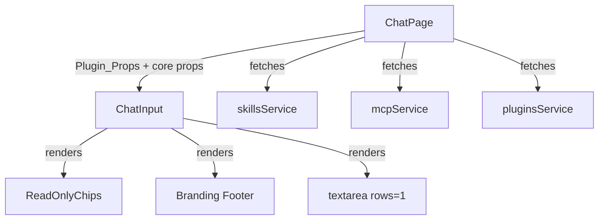
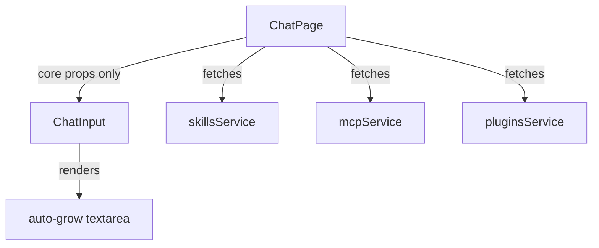

<!-- PE-REVIEWED -->
# Design Document: Remove Chat Input Extras

## Overview

This design covers the removal of visual clutter from the ChatInput component and the addition of auto-grow textarea behavior. The changes are purely frontend (React/TypeScript) and confined to the `desktop/src/` tree. No backend modifications are required.

Three categories of work:

1. **Removal** — Delete ReadOnlyChips indicators (Plugins, Skills, MCPs) from the bottom row, remove the branding footer, strip Plugin_Props from the ChatInput interface, and delete the now-orphaned `ReadOnlyChips.tsx` component.
2. **Enhancement** — Replace the fixed single-row `<textarea>` with an auto-growing textarea (2-line default, 20-line max, scrollbar beyond, reset on send).
3. **Test updates** — Update existing test helpers to remove Plugin_Props references while preserving all file-attachment and context-file test coverage.

The backend services (`skills.ts`, `mcp.ts`, `plugins.ts`) and all pages that consume them (SkillsPage, MCPPage, PluginsPage, AgentsPage, SwarmCorePage) remain untouched. ChatPage continues to fetch skills/MCPs/plugins data for the `enableSkills` and `enableMCP` flags used during chat streaming.

## Architecture

### Component Dependency Graph (Before)



### Component Dependency Graph (After)



### Affected Files

| File | Action |
|------|--------|
| `desktop/src/pages/chat/components/ChatInput.tsx` | Remove Plugin_Props from interface, remove ReadOnlyChips import/usage, remove branding footer, implement auto-grow textarea |
| `desktop/src/pages/ChatPage.tsx` | Remove Plugin_Props from ChatInput JSX invocation |
| `desktop/src/components/common/ReadOnlyChips.tsx` | Delete file |
| `desktop/src/components/common/index.ts` | Remove ReadOnlyChips and ChipItem exports |
| `desktop/src/pages/chat/components/ChatInput.test.tsx` | Remove Plugin_Props from test helpers |
| `desktop/src/pages/chat/components/ChatInput.workspace-removal.test.tsx` | Remove Plugin_Props from test helpers |
| `desktop/src/pages/ChatPage.test.tsx` | Remove Plugin_Props from test helpers |

### Files NOT Modified

| File | Reason |
|------|--------|
| `backend/**` | Backend services must remain intact |
| `desktop/src/services/skills.ts` | Used by SkillsPage, AgentsPage, SwarmCorePage |
| `desktop/src/services/mcp.ts` | Used by MCPPage, AgentsPage |
| `desktop/src/services/plugins.ts` | Used by PluginsPage, AgentsPage |
| `desktop/src/components/chat/SwarmAgent.property.test.tsx` | References `allowAllSkills` on the Agent model type, NOT on ChatInput Plugin_Props. Unaffected. |
| `desktop/src/components/modals/AgentsModal.property.test.tsx` | References `allowAllSkills` on the Agent model type, NOT on ChatInput Plugin_Props. Unaffected. |

## Components and Interfaces

### ChatInputProps (After)

The following props are **removed** from the `ChatInputProps` interface:

- `agentSkills: Skill[]`
- `agentMCPs: MCPServer[]`
- `agentPlugins: Plugin[]`
- `isLoadingSkills: boolean`
- `isLoadingMCPs: boolean`
- `isLoadingPlugins: boolean`
- `allowAllSkills?: boolean`

The following imports are removed from `ChatInput.tsx`:

- `import { ReadOnlyChips } from '../../../components/common'`
- `import type { Skill, MCPServer, Plugin } from '../../../types'` (only if no other usage remains)

The retained interface:

```typescript
interface ChatInputProps {
  inputValue: string;
  onInputChange: (value: string) => void;
  onSend: () => void;
  onStop: () => void;
  isStreaming: boolean;
  selectedAgentId: string | null;
  attachments: FileAttachment[];
  onAddFiles: (files: File[]) => void;
  onRemoveFile: (id: string) => void;
  isProcessingFiles: boolean;
  fileError: string | null;
  canAddMore: boolean;
  attachedContextFiles?: FileTreeItem[];
  onRemoveContextFile?: (file: FileTreeItem) => void;
}
```

### Auto-Grow Textarea Behavior

The current `<textarea rows={1}>` is replaced with an auto-growing textarea using a `useRef` + `useEffect`/`useCallback` pattern:

1. A `textareaRef` is added via `useRef<HTMLTextAreaElement>(null)`.
2. An `adjustHeight` function resets `style.height` to `auto`, then sets `style.height` to `Math.min(scrollHeight, maxHeight)`.
3. The textarea uses `rows={2}` to set the native minimum height (2 visible lines). This avoids hardcoding a pixel-based `LINE_HEIGHT` constant that would be fragile across font/theme changes.
4. Constants:
   - `MAX_ROWS = 20` → maximum before scrollbar
   - `maxHeight` is computed once at mount time via `getComputedStyle(el).lineHeight * MAX_ROWS`, with a fallback of `20 * MAX_ROWS` if the computed value is unavailable.
5. `overflow-y` is set to `hidden` when content fits, `auto` when it exceeds `maxHeight`.
6. On send (message submitted), height resets by clearing `style.height` (letting `rows={2}` reassert the native minimum).
7. `adjustHeight` is called on every `onChange` event and after `inputValue` changes (to handle programmatic clears).

```typescript
const textareaRef = useRef<HTMLTextAreaElement>(null);
const maxHeightRef = useRef<number>(400); // fallback: 20 * 20px
const MAX_ROWS = 20;

// Compute maxHeight once from actual computed line-height at mount
useEffect(() => {
  const el = textareaRef.current;
  if (!el) return;
  const lineHeight = parseFloat(getComputedStyle(el).lineHeight) || 20;
  maxHeightRef.current = MAX_ROWS * lineHeight;
}, []);

const adjustHeight = useCallback(() => {
  const el = textareaRef.current;
  if (!el) return;
  const maxHeight = maxHeightRef.current;
  el.style.height = 'auto';
  const next = Math.min(el.scrollHeight, maxHeight);
  el.style.height = `${next}px`;
  el.style.overflowY = el.scrollHeight > maxHeight ? 'auto' : 'hidden';
}, []);

// Call adjustHeight whenever inputValue changes (handles programmatic clears after send)
useEffect(() => {
  adjustHeight();
}, [inputValue, adjustHeight]);
```

On send, the reset is simply:
```typescript
// In the send handler, after clearing inputValue:
const el = textareaRef.current;
if (el) {
  el.style.height = '';       // clear inline style, rows={2} reasserts minimum
  el.style.overflowY = 'hidden';
}
```

### ChatPage Changes

In `ChatPage.tsx`, the `<ChatInput>` JSX invocation currently passes 7 plugin-related props. These are removed:

```diff
 <ChatInput
   inputValue={inputValue}
   onInputChange={setInputValue}
   onSend={handleSendMessage}
   onStop={handleStop}
   isStreaming={isStreaming}
   selectedAgentId={selectedAgentId}
   attachments={attachments}
   onAddFiles={addFiles}
   onRemoveFile={removeFile}
   isProcessingFiles={isProcessingFiles}
   fileError={fileError}
   canAddMore={canAddMore}
-  agentSkills={agentSkills}
-  agentMCPs={agentMCPs}
-  agentPlugins={agentPlugins}
-  isLoadingSkills={isLoadingSkills}
-  isLoadingMCPs={isLoadingMCPs}
-  isLoadingPlugins={isLoadingPlugins}
-  allowAllSkills={selectedAgent?.allowAllSkills}
   attachedContextFiles={attachedFiles}
   onRemoveContextFile={removeAttachedFile}
 />
```

The `agentSkills`, `agentMCPs`, `agentPlugins`, `enableSkills`, `enableMCP` computed values in ChatPage remain — they are used by `handleSendMessage` to pass `enableSkills` and `enableMCP` to the streaming API.

### Bottom Row Changes

The bottom row currently contains:
1. Three `<ReadOnlyChips>` instances (Plugins, Skills, MCPs)
2. Slash-command hint ("Type / for commands")

After the change, only the slash-command hint remains. The `<div>` wrapper and border-top styling are preserved to maintain visual separation.

### ReadOnlyChips Deletion

`ReadOnlyChips.tsx` is used exclusively by `ChatInput.tsx` (confirmed via codebase grep). After removing the ChatInput usage:
- Delete `desktop/src/components/common/ReadOnlyChips.tsx`
- Remove `export { default as ReadOnlyChips } from './ReadOnlyChips'` from `index.ts`
- Remove `export type { ChipItem } from './ReadOnlyChips'` from `index.ts`

## Data Models

No data model changes. This feature is purely a UI refactor. The `Skill`, `MCPServer`, and `Plugin` TypeScript types remain in `desktop/src/types/` — they are used by other pages and services. Only the ChatInput component stops consuming them.

## Correctness Properties

*A property is a characteristic or behavior that should hold true across all valid executions of a system — essentially, a formal statement about what the system should do. Properties serve as the bridge between human-readable specifications and machine-verifiable correctness guarantees.*

### Property 1: Textarea height clamping invariant

*For any* input content rendered in the ChatInput textarea, the displayed height SHALL equal `min(scrollHeight, maxHeight)` where `maxHeight = computedLineHeight * 20`. The native `rows={2}` attribute ensures the minimum height. Additionally, `overflow-y` SHALL be `'auto'` if and only if `scrollHeight > maxHeight`, and `'hidden'` otherwise.

This combines the default 2-line minimum (via `rows={2}`), the auto-grow behavior (content between 2-20 lines), and the scrollbar cap (content exceeding 20 lines) into a single invariant.

**Validates: Requirements 7.1, 7.2, 7.3**

### Property 2: Textarea height reset on send

*For any* textarea state with any content and any current height, when the user sends a message (triggering `onSend`), the textarea inline `style.height` SHALL be cleared (empty string) so that `rows={2}` reasserts the native minimum, and `overflow-y` SHALL be `'hidden'`.

**Validates: Requirements 7.4**

### Property 3: enableSkills/enableMCP flag computation integrity (NOT tested — unchanged code)

*For any* combination of agent configuration (allowAllSkills, skillIds, mcpIds, pluginIds) and available services (skills list, MCP servers list, plugins list), the `enableSkills` flag SHALL be `true` if and only if `allowAllSkills` is true OR the agent has at least one matched skill OR the agent has at least one matched plugin. The `enableMCP` flag SHALL be `true` if and only if the agent has at least one matched MCP server.

**Note:** This property documents the existing ChatPage behavior that must be preserved. Since the ChatPage flag computation logic is NOT being modified, no new property-based test is written for it. Existing tests in ChatPage.test.tsx already cover this. The property is retained here as a design constraint for future reference.

**Validates: Requirements 2.3, 6.3**

## Error Handling

This feature is a UI removal and enhancement — error surface is minimal.

| Scenario | Handling |
|----------|----------|
| `textareaRef.current` is null during `adjustHeight` | Guard clause: `if (!el) return;` — no-op, textarea renders at CSS default |
| `scrollHeight` returns 0 (unmounted/hidden element) | `Math.max(minHeight, ...)` ensures minimum height is always applied |
| Browser doesn't support `el.style.overflowY` | Graceful degradation — textarea still functions, just without dynamic overflow toggling. Tailwind's `resize-none` prevents manual resize. |
| Existing tests fail after prop removal | TypeScript compiler catches any remaining references to removed props at build time. Test helpers are updated to remove Plugin_Props defaults. |

No new error states are introduced. The auto-grow logic is purely cosmetic and does not affect message sending, streaming, or data integrity.

## Testing Strategy

### Unit Tests (Examples & Edge Cases)

These verify specific scenarios and the absence of removed elements:

1. **Removed elements absence**: Render ChatInput, assert no "Plugins", "Skills", "MCPs" chip labels are present. Assert no "Immersive Workspace" text is present. *(Validates: 1.1, 5.1, 5.2)*
2. **Slash-command hint preserved**: Render ChatInput, assert "/" hint text is present. *(Validates: 1.2)*
3. **Interactive elements set**: Render ChatInput, verify only file attachment button, textarea, send/stop button, and slash-command hint are interactive. *(Validates: 1.3)*
4. **Existing file attachment tests pass**: No changes to existing test assertions for AttachedFileChips. *(Validates: 4.3, 8.2, 8.4)*
5. **Shift+Enter inserts newline**: Simulate Shift+Enter, verify newline is inserted and auto-grow triggers. *(Validates: 7.5, 8.1)*
6. **Slash commands still work**: Type "/", verify command suggestions appear. *(Validates: 8.3)*
7. **Stop/send button states**: Verify stop button during streaming, send button when idle. *(Validates: 8.5)*

### Property-Based Tests

Each property test runs a minimum of 100 iterations using `fast-check` (already available in the project or added as a dev dependency).

Each test is tagged with a comment referencing the design property:

1. **Feature: remove-chat-input-extras, Property 1: Textarea height clamping invariant**
   - Generate random `scrollHeight` values from 0 to 2000px using `fc.integer`.
   - **Test approach:** Since jsdom/happy-dom do not compute real `scrollHeight`, test the `adjustHeight` logic in isolation by mocking the textarea element's `scrollHeight` property. The `maxHeight` is computed from a mocked `getComputedStyle` lineHeight.
   - Assert `el.style.height` equals `min(mockedScrollHeight, maxHeight)` as a string with `px` suffix.
   - Assert `el.style.overflowY` is `'auto'` iff `mockedScrollHeight > maxHeight`, `'hidden'` otherwise.

2. **Feature: remove-chat-input-extras, Property 2: Textarea height reset on send**
   - Generate random `scrollHeight` values from 0 to 2000px.
   - Set up a mock textarea with the generated scrollHeight, call adjustHeight, then simulate send reset.
   - Assert `textarea.style.height` is `''` (empty string, letting `rows={2}` reassert minimum).
   - Assert `textarea.style.overflowY` is `'hidden'`.

**Note:** Property 3 (enableSkills/enableMCP flag computation) is documented as a design constraint but NOT tested with a new PBT, since the ChatPage logic is not being modified. Existing ChatPage tests already cover this behavior.
