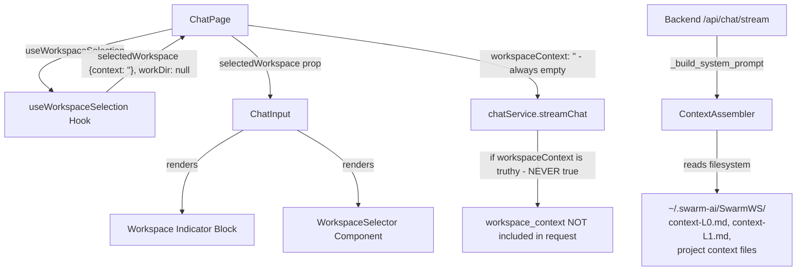
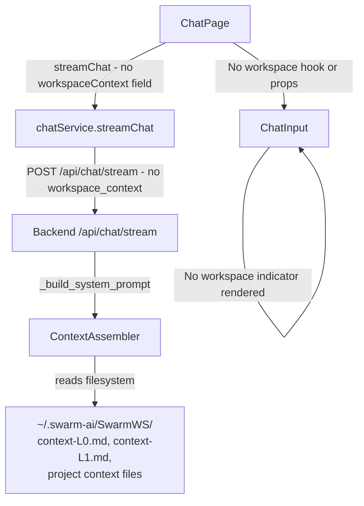
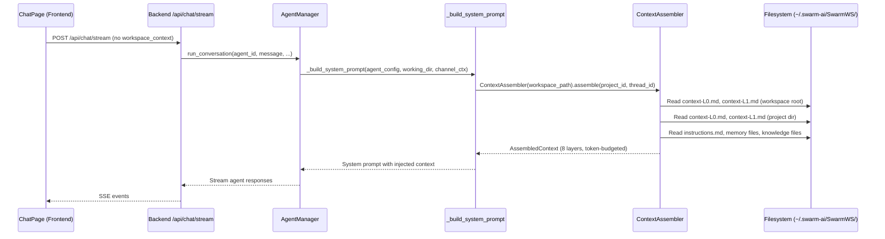

<!-- PE-REVIEWED -->
# Design Document: Remove Workspace Selector

## Overview

This feature removes the legacy multi-workspace UI artifacts from the chat interface and cleans up the dead `workspaceContext` plumbing end-to-end. The SwarmAI app operates on a single-workspace (SwarmWS) model, making the `WorkspaceSelector` component, the `useWorkspaceSelection` hook, the workspace indicator block in `ChatInput`, and the `selectedWorkspace` / `workspaceContext` prop threading all dead code.

### Key Discovery: Workspace Context is Filesystem-Based

The workspace context used by agents is **not** sourced from the DB `workspace_config.context` field or from the frontend's `workspaceContext` parameter. It is assembled entirely from the **filesystem** by `backend/core/context_assembler.py`, which implements an 8-layer priority-ordered context pipeline reading files from `~/.swarm-ai/SwarmWS/`:

| Layer | Name | Source |
|-------|------|--------|
| 1 | System Prompt | Agent config |
| 2 | Live Work | Active tasks/threads |
| 3 | Instructions | Project `instructions.md` |
| 4 | Project Semantic | Project `context-L0.md` / `context-L1.md` |
| 5 | Knowledge Semantic | Knowledge base files |
| 6 | Memory | Agent memory files |
| 7 | Workspace Semantic | Workspace root `context-L0.md` / `context-L1.md` |
| 8 | Scoped Retrieval | Project-scoped retrieval |

The `_build_system_prompt` method in `AgentManager` calls `ContextAssembler` directly — it never reads the frontend's `workspace_context` value from `ChatRequest`.

### The `workspaceContext` Field is Dead Code

Investigation confirms the full dead-code chain:

1. **Frontend**: `useWorkspaceSelection` hook always returned `context: ''` (empty string)
2. **Frontend**: `ChatPage` passed `workspaceContext: selectedWorkspace?.context` → always `''`
3. **Frontend**: `chatService.streamChat` has `if (request.workspaceContext)` guard — empty string is falsy, so `workspace_context` was **never included** in the request body
4. **Backend**: `ChatRequest.workspace_context` in the Pydantic schema accepted the field but it was always `None` (never sent)
5. **Backend**: `chat.py` route passed `workspace_context=chat_request.workspace_context` to `run_conversation()`
6. **Backend**: `run_conversation()` accepted `workspace_context` as a parameter but **never forwarded it** to `_execute_on_session()` or `_build_system_prompt()`
7. **Backend**: `_build_system_prompt()` independently reads workspace context from the filesystem via `ContextAssembler`

The entire frontend-to-backend `workspaceContext` pipeline was a no-op. This feature removes it cleanly.

### Design Decisions

1. **Remove `workspaceContext` from `streamChat` call entirely**: Since the backend never uses the frontend-supplied value (it assembles context from the filesystem), there is no reason to keep sending it. The old hook always sent empty string anyway, so removing it is zero behavioral change.

2. **No `useQuery` or API fetch needed**: The previous design proposed fetching workspace config via `useQuery` + `workspaceConfigApiService.getConfig()` to source `workspaceContext`. This was solving a non-problem — the DB `workspace_config.context` field is not the real context source. The real context comes from filesystem files read by `ContextAssembler`.

3. **Replace `workDir` fallback**: The hook's `workDir` currently returns `null` (empty `filePath`), so `effectiveBasePath` already falls back to `agentWorkDir?.path`. After removal, `effectiveBasePath` simply becomes `agentWorkDir?.path` with no behavior change.

4. **No backend changes required for core feature**: The backend `ChatRequest` schema already has `workspace_context` as optional (`str | None`). Removing it from the frontend request body is safe — the field simply won't be present, and the Pydantic default of `None` applies. The backend parameter in `run_conversation()` was never used anyway.

5. **Legacy cleanup scope documented**: Backend dead code (`workspace_context` parameter, legacy injection block) is documented for future cleanup but not required for this feature to ship safely.

6. **Incremental deletion**: Files are deleted one at a time with build verification between steps to catch any missed references early.

## Architecture

The change is a frontend-only refactor touching the React component tree and hook layer. No backend changes are required for the core feature. Backend legacy cleanup is optional follow-up work.

### Before (Current State)




### After (Target State)



Key changes:
- `useWorkspaceSelection` hook is deleted entirely
- `WorkspaceSelector` component file is deleted
- `ChatInput` loses the `selectedWorkspace` prop and the workspace indicator JSX block
- `workspaceContext` is removed from the `streamChat` call (it was always empty / never used)
- `effectiveBasePath` simplifies to just `agentWorkDir?.path`
- No `useQuery`, no `SWARMWS_DEFAULT_CONTEXT` constant — these are unnecessary

### Real Workspace Context Flow (Filesystem-Based)

This section documents how workspace context actually reaches agents. The frontend plays no role in this flow.



The `ContextAssembler` 8-layer pipeline:
1. **Layer 1 — System Prompt**: Base agent system prompt from config
2. **Layer 2 — Live Work**: Active tasks/threads for the project
3. **Layer 3 — Instructions**: Project-level `instructions.md`
4. **Layer 4 — Project Semantic**: Project `context-L0.md` + `context-L1.md` (tag-filtered)
5. **Layer 5 — Knowledge Semantic**: Knowledge base files (tag-filtered)
6. **Layer 6 — Memory**: Agent memory files
7. **Layer 7 — Workspace Semantic**: Workspace root `context-L0.md` + `context-L1.md` (tag-filtered)
8. **Layer 8 — Scoped Retrieval**: Project-scoped retrieval results

All layers are filesystem-based. The DB `workspace_config.context` field is not read by this pipeline.

### Legacy Cleanup Scope (Optional Follow-Up)

These backend items are dead code related to the old `workspace_context` frontend parameter. They are safe to remove in a follow-up PR but are not required for this feature:

| Item | Location | Status | Notes |
|------|----------|--------|-------|
| `workspace_context` field | `ChatRequest` schema (`backend/schemas/message.py`) | Dead code | Pydantic field accepted but value never reaches `_build_system_prompt`. Safe to remove — frontend will stop sending it. |
| `workspace_context` parameter | `run_conversation()` (`backend/core/agent_manager.py` line ~938) | Dead code | Accepted but never forwarded to `_execute_on_session()`. |
| `workspace_context=chat_request.workspace_context` | `chat.py` route handler (`backend/routers/chat.py` line ~174) | Dead code | Passes value to `run_conversation()` which ignores it. |
| `read_context_files()` method | `SwarmWorkspaceManager` (`backend/core/swarm_workspace_manager.py` line ~619) | Backward compat | Reads `ContextFiles/context.md` and `compressed-context.md`. Superseded by `ContextAssembler`. |
| `context` column | `workspace_config` DB table | Unused | Not read by `ContextAssembler`. May be used by legacy `ContextManager.inject_context()` fallback path. |
| `ContextManager.inject_context()` | `backend/core/context_manager.py` line ~302 | Legacy fallback | Only called when `project_id` is `None` in `_build_system_prompt`. Reads `ContextFiles/context.md` from filesystem (not DB `context` field). |


## Components and Interfaces

### Files to Delete

| File | Type | Reason |
|------|------|--------|
| `desktop/src/components/chat/WorkspaceSelector.tsx` | Component | Dead UI — static SwarmWS button, never rendered in current code |
| `desktop/src/hooks/useWorkspaceSelection.ts` | Hook | Dead code — returns hardcoded `context: ''` and `workDir: null` |
| `desktop/src/hooks/useWorkspaceSelection.test.ts` | Test | Tests for deleted hook |

### Files to Modify

#### 1. `desktop/src/pages/ChatPage.tsx`

**Remove:**
- `import { useWorkspaceSelection } from '../hooks/useWorkspaceSelection'`
- `const { selectedWorkspace, workDir } = useWorkspaceSelection()`
- `selectedWorkspace={selectedWorkspace}` prop on `<ChatInput>`
- `selectedWorkspace` from `handleSendMessage` dependency array
- `workspaceContext: selectedWorkspace?.context` from the `streamChat` call arguments

**Change:**
- `effectiveBasePath = workDir || agentWorkDir?.path` → `effectiveBasePath = agentWorkDir?.path`

**Not added (intentionally):**
- No `useQuery` for workspace config — not needed
- No `SWARMWS_DEFAULT_CONTEXT` constant — not needed
- No `workspaceConfigApiService` import — not needed

#### 2. `desktop/src/pages/chat/components/ChatInput.tsx`

**Remove:**
- `selectedWorkspace: WorkspaceConfig | null` from `ChatInputProps` interface
- `selectedWorkspace` from destructured props
- The entire `{/* Workspace Indicator */}` JSX block (lines ~218-228)
- `WorkspaceConfig` from the type import if no longer used

#### 3. `desktop/src/components/chat/index.ts`

**Remove:**
- `export { WorkspaceSelector } from './WorkspaceSelector'`

#### 4. `desktop/src/hooks/index.ts`

**Remove:**
- `export { useWorkspaceSelection } from './useWorkspaceSelection'`

#### 5. `desktop/src/pages/chat/components/ChatInput.test.tsx`

**Remove:**
- `selectedWorkspace` from the default props object
- Any test assertions referencing workspace indicator rendering
- `WorkspaceConfig` type import if no longer needed

#### 6. `desktop/src/pages/ChatPage.test.tsx`

**Remove:**
- `selectedWorkspace` from any mock props
- Any mock of `useWorkspaceSelection`
- `SwarmWorkspace` type import if no longer needed

**Not added:**
- No mock for `workspaceConfigApiService.getConfig` — we're not calling it

## Data Models

No data model changes. The existing types are affected only by removal:

### Types Unchanged (Backend)

```python
# backend/schemas/message.py — ChatRequest (no change needed for this feature)
class ChatRequest(BaseModel):
    agent_id: str
    message: str | None = None
    content: list[dict[str, Any]] | None = None
    session_id: str | None = None
    enable_skills: bool = False
    enable_mcp: bool = False
    workspace_context: str | None = None  # Legacy dead code — frontend will stop sending this
```

### Types Modified (Frontend)

```typescript
// ChatInputProps — BEFORE
interface ChatInputProps {
  // ...other props
  selectedWorkspace: WorkspaceConfig | null;  // REMOVE this line
  // ...other props
}

// ChatInputProps — AFTER
interface ChatInputProps {
  // ...other props (selectedWorkspace removed)
}
```

### Types Unchanged (Frontend)

```typescript
// WorkspaceConfig in types/index.ts — no change, still used by workspace management features
interface WorkspaceConfig {
  id: string;
  name: string;
  filePath: string;
  icon?: string;
  context?: string;
  createdAt: string;
  updatedAt: string;
}

// ChatRequest in types/index.ts — workspaceContext field remains in type but won't be populated
interface ChatRequest {
  agentId: string;
  message?: string;
  content?: ContentBlock[];
  sessionId?: string;
  enableSkills?: boolean;
  enableMCP?: boolean;
  workspaceContext?: string;  // Optional field — ChatPage will simply not set it
}
```

The `WorkspaceConfig` type itself is NOT deleted — it's still used by `workspaceConfigApiService` and other workspace management features. Only its usage in `ChatInputProps` is removed.


## Correctness Properties

*A property is a characteristic or behavior that should hold true across all valid executions of a system — essentially, a formal statement about what the system should do. Properties serve as the bridge between human-readable specifications and machine-verifiable correctness guarantees.*

### Property 1: ChatInput never renders workspace indicator

*For any* valid combination of ChatInput props (varying input text, streaming state, agent ID, attachments, skills, MCPs, plugins), the rendered ChatInput component should never contain a workspace name label, workspace icon, or file path indicator block.

**Validates: Requirements 2.1**

### Property 2: ChatInput preserves all non-workspace UI elements

*For any* valid combination of ChatInput props, the rendered ChatInput component should contain a text input field, a send/stop button, and a file attachment button.

**Validates: Requirements 2.3**

### Property 3: streamChat call never includes workspaceContext

*For any* chat message sent through ChatPage (with any valid message text and attachment combination), the `chatService.streamChat` call should NOT include a `workspaceContext` field in its arguments. The backend assembles workspace context independently from the filesystem via `ContextAssembler`, so the frontend must not send this dead-code field.

**Validates: Requirements 4.4**

## Error Handling

This is a deletion/cleanup feature with minimal new error surface. Key considerations:

### No New Error Paths

The previous design introduced a `useQuery` + `workspaceConfigApiService.getConfig()` call that created new failure modes (API not resolved, network errors, 404s). The corrected design eliminates all of these by simply not fetching workspace config at all. There are no new API calls, no new async operations, and no new error states.

### Build Breakage from Missed References

If any import of `WorkspaceSelector` or `useWorkspaceSelection` is missed during cleanup, TypeScript compilation will fail immediately. This is caught by:
1. The build step (`cd desktop && npm run build:all`)
2. The test suite (`cd desktop && npm test -- --run`)

No runtime error handling needed — these are compile-time failures.

### Backend Resilience

The backend's `_build_system_prompt` already handles context assembly failures gracefully:
- The entire `ContextAssembler` pipeline is wrapped in `try/except` — if assembly fails, the agent runs without context
- If `workspace_config` row is missing, it falls back to the default SwarmWS path
- If `project_id` is `None`, it falls back to the legacy `ContextManager.inject_context()` path
- None of this is affected by the frontend changes

### Multi-Tab Compatibility

This change is fully compatible with the multi-tab chat experience (`useUnifiedTabState`). The `UnifiedTab` type has no workspace-related fields — each tab tracks only `id`, `title`, `agentId`, `sessionId`, `messages`, `isStreaming`, `status`, etc. Workspace context is orthogonal to tab state:

- `useWorkspaceSelection()` was called once at the ChatPage level, not per-tab. All tabs already shared the same (empty) workspace context.
- After removal, all tabs continue to share the same SwarmWS workspace. The backend's `ContextAssembler` reads filesystem context independently per request regardless of which tab originated it.
- No `UnifiedTab` fields are touched by this change. Tab CRUD, persistence (`open_tabs.json`), streaming isolation, and tab lifecycle are unaffected.
- The `LayoutContext.selectedWorkspaceScope` / `WorkspaceScope` used by `ExplorerToolbar` is a separate concern (workspace file explorer scoping) and is not affected.

### Potential Gaps and Mitigations

| Gap | Scenario | Mitigation |
|-----|----------|------------|
| **Missed import reference** | A file still imports `WorkspaceSelector` or `useWorkspaceSelection` after deletion | TypeScript compiler catches this immediately. Build step fails. |
| **Test referencing deleted prop** | A test still passes `selectedWorkspace` to ChatInput | TypeScript compiler catches the unknown prop. Test compilation fails. |
| **Backend receives no workspace_context** | Frontend stops sending `workspace_context` in request body | No impact — `ChatRequest.workspace_context` defaults to `None`, and `run_conversation()` never forwarded it to `_build_system_prompt()` anyway. |

## Testing Strategy

### Dual Testing Approach

This feature uses both unit tests and property-based tests:

- **Unit tests**: Verify specific deletion outcomes (file doesn't exist, export removed, build passes)
- **Property tests**: Verify universal UI and behavioral properties across randomized inputs

### Property-Based Testing Configuration

- **Library**: `fast-check` (already available in the project's Vitest setup)
- **Minimum iterations**: 100 per property test
- **Tag format**: `Feature: remove-workspace-selector, Property {N}: {description}`

### Property Test Plan

Each correctness property maps to a single property-based test:

| Property | Test Description | Generator Strategy |
|----------|-----------------|-------------------|
| Property 1 | Render ChatInput with random valid props, assert no workspace indicator elements | Generate random `inputValue` (string), `isStreaming` (boolean), `selectedAgentId` (string), `attachments` (array of 0-3 items) |
| Property 2 | Render ChatInput with random valid props, assert text input + send button + file attachment button present | Same generator as Property 1 |
| Property 3 | Mock `chatService.streamChat`, trigger send with random message text, assert `workspaceContext` is NOT present in the call arguments | Generate random non-empty message strings |

### Unit Test Plan

| Requirement | Test Description |
|-------------|-----------------|
| 1.1, 1.2, 1.3 | Build verification — covered by CI build step |
| 2.2 | TypeScript compilation — `selectedWorkspace` prop removed from `ChatInputProps` |
| 3.1-3.4 | Build verification — hook file and test file deleted, barrel export cleaned |
| 4.1-4.3 | Code inspection — ChatPage no longer imports/uses workspace selection |
| 5.1-5.4 | Run `cd desktop && npm test -- --run` — all tests pass with zero workspace-selector references |

### Test Execution

```bash
# Run all frontend tests (includes property tests)
cd desktop && npm test -- --run

# Run only workspace-removal related tests
cd desktop && npx vitest --run --grep "remove-workspace-selector"
```
