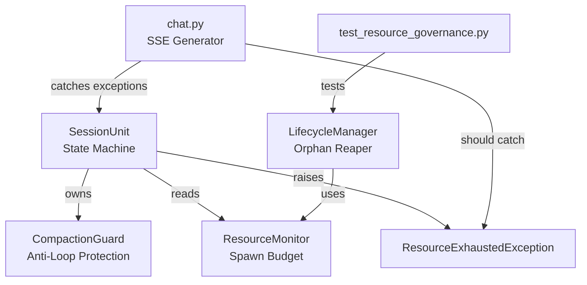
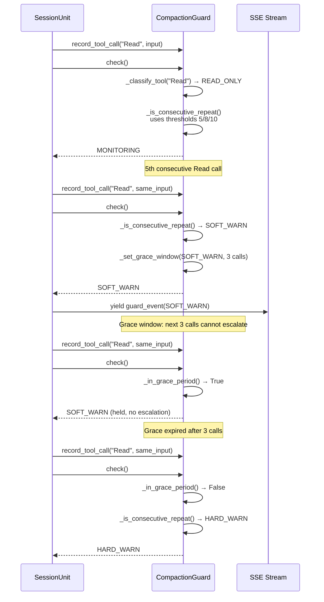
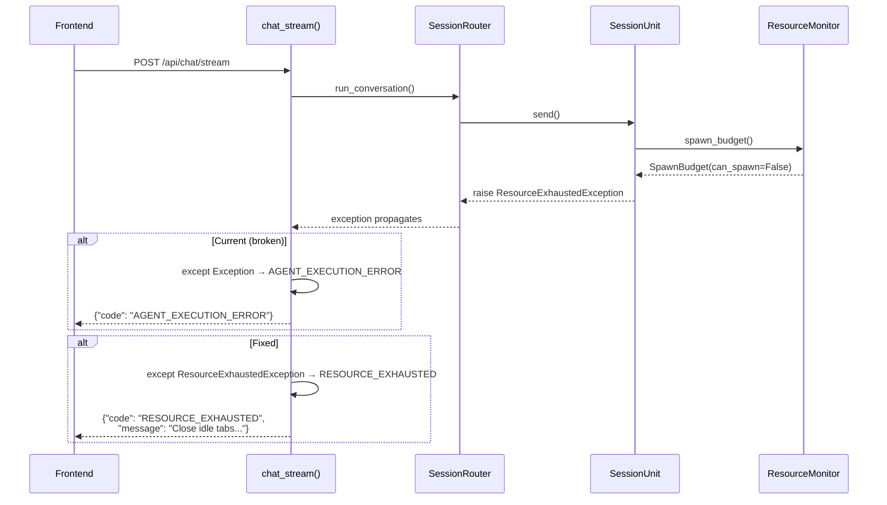

# Design Document: Resource Management Hardening

## Overview

This spec covers a systematic hardening pass on the SwarmAI resource management subsystem, addressing 6 concrete issues discovered during an end-to-end review. The changes span CompactionGuard (read-only tool exemption, grace periods), ResourceMonitor (comment/dead-code cleanup), test flakiness (mock timeout), SSE error classification (ResourceExhaustedException), and dead code removal.

All changes are backward-compatible, localized to the backend, and must preserve the invariant that CompactionGuard never blocks streaming (all public methods wrapped in try/except). The 85% memory threshold is a deliberate design decision from a prior session and is not being changed — only the comments that incorrectly say "80%" are updated.

## Architecture

The affected components form a layered resource governance stack:



## Sequence Diagrams

### Issue 1+2: CompactionGuard check() with Read-Only Exemption and Grace Period



### Issue 5: ResourceExhaustedException in SSE Generator



## Components and Interfaces

### Component 1: CompactionGuard (Issues 1, 2)

**Purpose**: Per-session anti-loop protection with graduated escalation.

**Changes**:
- Add read-only tool classification with extensible registry
- Apply higher consecutive thresholds for read-only tools
- Add grace period between escalation levels

**Interface additions**:
```python
# New constants
_READ_ONLY_TOOLS: frozenset[str] = frozenset({
    "Read", "Grep", "ListDir", "Glob",
    "ReadFile", "GrepSearch", "ListDirectory",
    "FileSearch", "ReadCode", "ReadMultipleFiles",
})

_CONSEC_SOFT_READONLY: int = 5
_CONSEC_HARD_READONLY: int = 8
_CONSEC_KILL_READONLY: int = 10

_GRACE_WINDOW: int = 3  # calls after escalation before next escalation allowed
```

**Responsibilities**:
- Classify tools as read-only vs write/execute
- Apply tool-class-specific consecutive thresholds
- Enforce grace window between escalation levels
- Never block streaming (all methods in try/except)

### Component 2: ResourceMonitor (Issues 3, 6)

**Purpose**: System + per-process resource metrics with spawn budget.

**Changes**:
- Fix docstring/comments from "80%" to "85%" in `spawn_budget()` and `compute_max_tabs()`
- Remove dead code on Line 200 of `_read_memory_macos_fallback()`

### Component 3: chat.py SSE Generator (Issue 5)

**Purpose**: SSE streaming endpoint for agent chat.

**Changes**:
- Add specific `ResourceExhaustedException` catch before generic `except Exception`

### Component 4: test_resource_governance.py (Issue 4)

**Purpose**: Tests for resource governance acceptance criteria.

**Changes**:
- Mock `_reap_orphans` timeout to 5s instead of relying on production 30s

## Data Models

### Tool Classification (Issue 1)

```python
class ToolClass(Enum):
    """Classification of tools for threshold selection."""
    READ_ONLY = "read_only"
    WRITE_EXECUTE = "write_execute"
```

No new persistent data models. The classification is a pure function of tool name, stored as a module-level frozenset.

### Grace Period State (Issue 2)

```python
# Added to CompactionGuard.__init__
self._grace_calls_remaining: int = 0
self._grace_level: EscalationLevel = EscalationLevel.MONITORING
```

Grace state is per-session, transient, reset by `reset()` and `reset_all()`.

## Key Functions with Formal Specifications

### Function 1: `_classify_tool(tool_name)` (New — Issue 1)

```python
@staticmethod
def _classify_tool(tool_name: str) -> str:
    """Return 'read_only' if tool is in _READ_ONLY_TOOLS, else 'write_execute'."""
    return "read_only" if tool_name in _READ_ONLY_TOOLS else "write_execute"
```

**Preconditions:**
- `tool_name` is a non-empty string

**Postconditions:**
- Returns `"read_only"` if `tool_name ∈ _READ_ONLY_TOOLS`
- Returns `"write_execute"` otherwise
- Pure function, no side effects

### Function 2: `_get_consec_thresholds(tool_name)` (New — Issue 1)

```python
def _get_consec_thresholds(self, tool_name: str) -> tuple[int, int, int]:
    """Return (soft, hard, kill) consecutive thresholds for the given tool."""
    if tool_name in _READ_ONLY_TOOLS:
        return (_CONSEC_SOFT_READONLY, _CONSEC_HARD_READONLY, _CONSEC_KILL_READONLY)
    return (_CONSEC_SOFT, _CONSEC_HARD, _CONSEC_KILL)
```

**Preconditions:**
- `tool_name` is a non-empty string

**Postconditions:**
- Read-only tools: returns `(5, 8, 10)`
- Write/execute tools: returns `(3, 5, 7)`
- No side effects

### Function 3: `_is_consecutive_repeat()` (Modified — Issues 1, 2)

```python
def _is_consecutive_repeat(self) -> EscalationLevel:
    """Detect consecutive identical tool calls with tool-class-aware thresholds."""
```

**Preconditions:**
- `self._last_pair` is set (or None for first call)
- `self._consec_count >= 0`

**Postconditions:**
- Uses `_get_consec_thresholds(tool_name)` to select thresholds
- Returns appropriate `EscalationLevel` based on tool-class thresholds
- Does NOT mutate `self._escalation`

### Function 4: `check()` (Modified — Issue 2, grace period)

```python
def check(self) -> EscalationLevel:
    """Check all layers, respecting grace windows between escalations."""
```

**Preconditions:**
- Guard is in a valid state (phase, escalation, tracking structures)

**Postconditions:**
- If `self._grace_calls_remaining > 0`: decrements grace counter, returns current escalation (no further escalation)
- If grace expired and detector fires: escalates one step, sets new grace window
- On exception: returns `MONITORING` (never blocks streaming)

**Loop Invariants:** N/A (no loops in check)

### Function 5: `message_generator()` in `chat_stream()` (Modified — Issue 5)

```python
async def message_generator():
    """Generate messages with specific ResourceExhaustedException handling."""
```

**Preconditions:**
- Valid `chat_request` with agent_id and message

**Postconditions:**
- `ResourceExhaustedException` → yields `{"code": "RESOURCE_EXHAUSTED", ...}` with user-friendly message
- Other exceptions → existing classification chain (SESSION_BUSY, AGENT_TIMEOUT, etc.)
- Generic `except Exception` remains as final fallback

## Algorithmic Pseudocode

### Algorithm: Consecutive Repeat Detection with Tool Classification (Issues 1+2)

```python
def _is_consecutive_repeat(self) -> EscalationLevel:
    """
    INPUT: self (CompactionGuard with _last_pair, _consec_count)
    OUTPUT: EscalationLevel recommendation

    ALGORITHM:
    1. Extract tool_name from self._last_pair
    2. Look up thresholds: (soft, hard, kill) = _get_consec_thresholds(tool_name)
    3. Compare self._consec_count against thresholds
    4. Return highest matching level
    """
    if self._last_pair is None:
        return EscalationLevel.MONITORING

    tool_name = self._last_pair[0]
    soft, hard, kill = self._get_consec_thresholds(tool_name)

    if self._consec_count >= kill:
        return EscalationLevel.KILL
    if self._consec_count >= hard:
        return EscalationLevel.HARD_WARN
    if self._consec_count >= soft:
        return EscalationLevel.SOFT_WARN
    return EscalationLevel.MONITORING
```

### Algorithm: Grace Period Enforcement (Issue 2)

```python
def check(self) -> EscalationLevel:
    """
    MODIFIED check() — adds grace period logic at the top.

    ALGORITHM:
    0. If already KILL → return KILL
    1. If grace_calls_remaining > 0:
       a. Decrement grace counter
       b. Return current escalation (no further escalation possible)
    2. Run Layer 0 (consecutive repeat) — if escalation occurs:
       a. Set grace_calls_remaining = _GRACE_WINDOW
       b. Record grace_level = new escalation
    3. Run Layer 1 (diversity stall) — same grace logic
    4. Run Layer 2 (context + loop detection) — same grace logic
    5. Return current escalation
    """
    # ... existing try/except wrapper ...

    if self._escalation == EscalationLevel.KILL:
        return EscalationLevel.KILL

    # Grace period check — BEFORE any detector
    if self._grace_calls_remaining > 0:
        self._grace_calls_remaining -= 1
        return self._escalation  # Hold at current level

    # Layer 0: consecutive repeat (with tool-class thresholds)
    consec_level = self._is_consecutive_repeat()
    if consec_level != EscalationLevel.MONITORING:
        consec_idx = _ESCALATION_ORDER.index(consec_level)
        current_idx = _ESCALATION_ORDER.index(self._escalation)
        if consec_idx > current_idx:
            self._escalation = consec_level
            self._grace_calls_remaining = _GRACE_WINDOW  # Start grace
            # ... logging, pattern desc ...
            return consec_level

    # ... rest of existing check() logic, with grace set on each escalation ...
```

### Algorithm: ResourceExhaustedException SSE Handling (Issue 5)

```python
async def message_generator():
    """
    MODIFIED message_generator() — adds specific exception catch.

    ALGORITHM:
    try:
        async for msg in _get_router().run_conversation(...):
            yield msg
    except asyncio.CancelledError:
        # ... existing disconnect recovery ...
    except asyncio.TimeoutError:
        # ... existing timeout handling ...
    except ResourceExhaustedException as e:
        # NEW: specific handling before generic catch
        yield _build_error_event(
            code="RESOURCE_EXHAUSTED",
            message=str(e.message),
            detail=str(e),
            suggested_action=e.suggested_action,
        )
    except Exception as e:
        # ... existing generic error classification ...
    """
```

### Algorithm: macOS Fallback Dead Code Removal (Issue 6)

```python
def _read_memory_macos_fallback(self) -> SystemMemory:
    """
    CURRENT (Line 200 is dead code):
        used = active + wired
        available = total - used if 'total' in dir() else free + speculative  # ← DEAD
        # ... sysctl call gets total ...
        total = int(sysctl_result.stdout.strip())
        used = active + wired  # recalculated
        available = total - used  # overwritten

    FIX: Remove Line 200 entirely. The sysctl call on Line 207 defines
    `total`, and Lines 208-209 compute the real `used` and `available`.
    """
```

## Example Usage

### Read-only tool with higher thresholds (Issue 1)

```python
guard = CompactionGuard()

# Read-only tool: 5 consecutive calls before SOFT_WARN (was 3)
for _ in range(4):
    guard.record_tool_call("Read", {"file_path": "/src/main.py"})
assert guard.check() == EscalationLevel.MONITORING  # 4 < 5, no warning

guard.record_tool_call("Read", {"file_path": "/src/main.py"})
assert guard.check() == EscalationLevel.SOFT_WARN   # 5 = threshold

# Write tool: still 3 consecutive calls for SOFT_WARN
guard2 = CompactionGuard()
for _ in range(3):
    guard2.record_tool_call("Bash", {"command": "pytest"})
assert guard2.check() == EscalationLevel.SOFT_WARN  # 3 = threshold
```

### Grace period prevents rapid escalation (Issue 2)

```python
guard = CompactionGuard()
for _ in range(3):
    guard.record_tool_call("Bash", {"command": "pytest"})
assert guard.check() == EscalationLevel.SOFT_WARN

# Next 3 calls are in grace window — no escalation
for _ in range(3):
    guard.record_tool_call("Bash", {"command": "pytest"})
    assert guard.check() == EscalationLevel.SOFT_WARN  # held

# Grace expired — now can escalate (total consecutive = 7, but check
# only escalates one step at a time after grace)
guard.record_tool_call("Bash", {"command": "pytest"})
assert guard.check() == EscalationLevel.HARD_WARN
```

### ResourceExhaustedException caught in SSE (Issue 5)

```python
# Before fix: ResourceExhaustedException falls through to generic handler
# → yields {"code": "AGENT_EXECUTION_ERROR", "message": "Agent execution failed"}

# After fix: caught specifically
# → yields {"code": "RESOURCE_EXHAUSTED",
#           "message": "Insufficient system resources...",
#           "suggested_action": "Close idle chat tabs..."}
```

## Correctness Properties

*A property is a characteristic or behavior that should hold true across all valid executions of a system — essentially, a formal statement about what the system should do. Properties serve as the bridge between human-readable specifications and machine-verifiable correctness guarantees.*

### Property 1: Tool classification correctness

*For any* string `t`, `_classify_tool(t)` returns `"read_only"` if and only if `t` is a member of `_READ_ONLY_TOOLS`. For all other strings, it returns `"write_execute"`.

**Validates: Requirements 1.1, 1.2, 1.3**

### Property 2: Threshold selection matches tool classification

*For any* tool name, `_get_consec_thresholds()` returns `(5, 8, 10)` if the tool is classified as read-only, and `(3, 5, 7)` if classified as write-execute. The threshold tuple is fully determined by the tool's classification.

**Validates: Requirements 1.5, 1.6**

### Property 3: Grace period prevents escalation

*For any* CompactionGuard state where `_grace_calls_remaining > 0`, calling `check()` decrements the grace counter by 1 and returns the current escalation level without increasing it.

**Validates: Requirements 2.1, 2.2**

### Property 4: Escalation monotonicity

*For any* sequence of `check()` calls on a CompactionGuard (without intervening `reset()` or `reset_all()`), the escalation level is monotonically non-decreasing. Once KILL is reached, all subsequent `check()` calls return KILL regardless of grace state or tool calls.

**Validates: Requirements 2.6, 2.7**

### Property 5: ResourceExhaustedException SSE event fidelity

*For any* `ResourceExhaustedException` with arbitrary `message` and `suggested_action` strings, the SSE event yielded by `message_generator()` contains `code="RESOURCE_EXHAUSTED"` and includes both the exception's `message` and `suggested_action` fields verbatim.

**Validates: Requirements 5.1, 5.2, 5.3, 5.4**

## Error Handling

### Error Scenario 1: Unknown tool name in classification

**Condition**: `record_tool_call()` receives a tool name not in `_READ_ONLY_TOOLS`
**Response**: Defaults to write/execute thresholds (3/5/7) — the stricter path
**Recovery**: No recovery needed; this is the safe default

### Error Scenario 2: Grace counter underflow

**Condition**: `_grace_calls_remaining` somehow goes negative
**Response**: The `> 0` check prevents negative values from triggering grace behavior
**Recovery**: `reset()` and `reset_all()` both set it to 0

### Error Scenario 3: ResourceExhaustedException in SSE

**Condition**: Spawn budget check fails during `run_conversation()`
**Response**: New catch block yields proper `RESOURCE_EXHAUSTED` SSE event
**Recovery**: User sees actionable message ("Close idle tabs..."), can retry

## Testing Strategy

### Unit Testing Approach

- **Issue 1**: Test read-only tools get thresholds (5, 8, 10); write tools keep (3, 5, 7). Test `_classify_tool()` for all known read-only tools. Test mixed sequences (read-only then write).
- **Issue 2**: Test grace window prevents escalation for exactly `_GRACE_WINDOW` calls. Test grace resets on `reset()` and `reset_all()`. Test grace doesn't prevent KILL from staying KILL.
- **Issue 3**: Verify docstrings contain "85%" not "80%" (source inspection test).
- **Issue 4**: Verify test completes in <10s with mocked 5s timeout.
- **Issue 5**: Mock `run_conversation()` to raise `ResourceExhaustedException`, verify SSE event has `code="RESOURCE_EXHAUSTED"`.
- **Issue 6**: Verify `_read_memory_macos_fallback()` source doesn't contain the dead code pattern.

### Property-Based Testing Approach

**Property Test Library**: Hypothesis

- **P1**: For any sequence of tool calls where all tools are read-only, SOFT_WARN is never reached before the 5th consecutive identical call.
- **P2**: For any escalation event, the next `_GRACE_WINDOW` calls to `check()` never return a higher escalation level.
- **P3**: `_classify_tool(t)` returns `"read_only"` iff `t ∈ _READ_ONLY_TOOLS` for all strings `t`.

### Integration Testing Approach

- Existing `test_compaction_guard.py` tests must pass without modification (backward compat for write tools).
- `test_resource_governance.py::TestReapOrphansTimeout` must pass reliably with mocked timeout.

## Security Considerations

No security impact. All changes are internal to the backend resource management layer. No new API surfaces, no authentication changes, no data exposure.

## Dependencies

- No new external dependencies
- Existing: `psutil` (optional, macOS fallback), `hypothesis` (test only)
- Internal: `core.exceptions.ResourceExhaustedException`, `core.session_utils._build_error_event`
