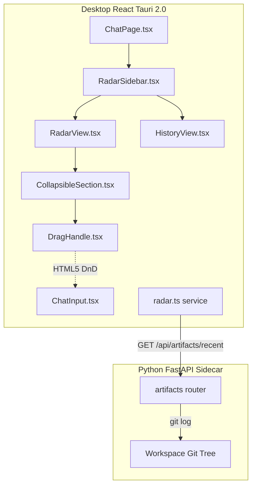
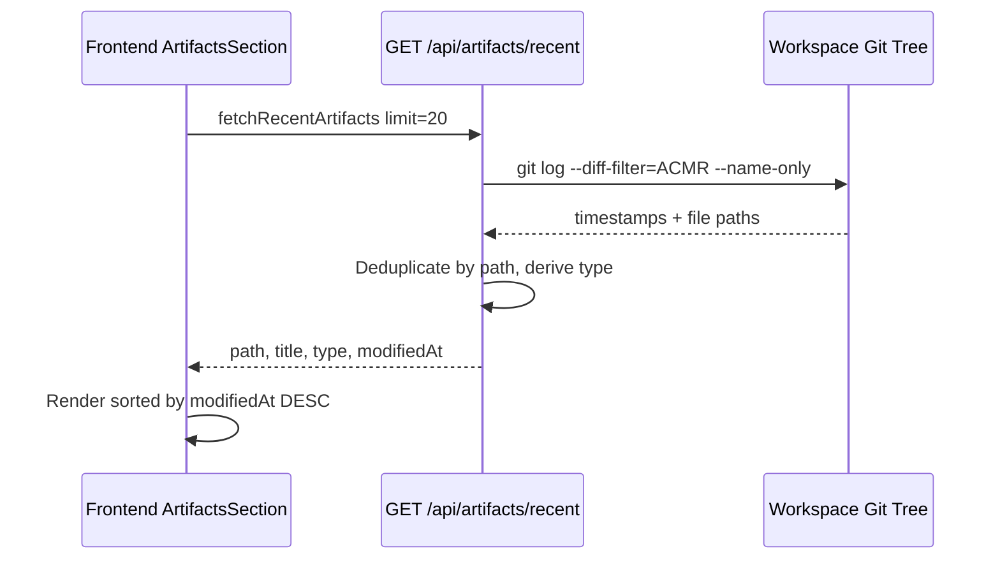
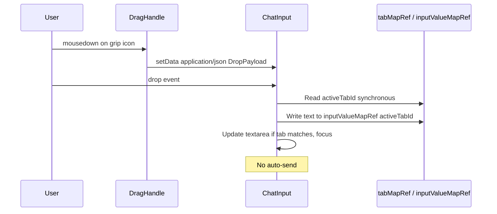

<!-- PE-REVIEWED -->
# Design Document: Right Sidebar Redesign

## Overview

This design transforms the SwarmAI right sidebar from a multi-panel toggle system (TodoRadar / ChatHistory / FileBrowser) into a persistent HUD-style Radar sidebar with two modes: **Radar** (default) and **History**. The sidebar is always visible. Radar mode shows four stacked collapsible sections (ToDo, Artifacts, Sessions, Jobs). History mode shows a searchable, time-grouped session list. Items support drag-to-chat via HTML5 drag-and-drop, populating ChatInput without auto-sending. The Artifacts section displays recently modified files from the workspace git tree -- no new database tables or SSE hooks needed.

### Key Design Decisions

1. **Persistent sidebar over toggle panels**: Eliminates `useRightSidebarGroup` and ChatHeader toggle buttons. Mode toggle lives inside the sidebar header.
2. **Tab-scoped drag-drop via synchronous ref reads**: Drop handlers read `tabMapRef` and write `inputValueMapRef` synchronously -- no async gap.
3. **Artifacts as git-derived read-only view**: Recent file changes from workspace git tree via `git log`. No SQLite table, no INSERT hooks, no SSE events, no pruning.
4. **Reuse existing time-grouping logic**: History mode reuses `groupSessionsByTime` and `formatTimestamp`.
5. **CollapsibleSection as shared primitive**: Handles expand/collapse, count badge, status hint, and localStorage persistence.
6. **Consolidated feature tip**: Single icon in RadarSidebar header. One localStorage key (`radar-tip-dismissed`).

## Architecture

### System Context



### Artifacts Data Flow



### Drag-to-Chat Flow



## Components and Interfaces

### Component Tree

```
desktop/src/pages/chat/components/RightSidebar/
  RadarSidebar.tsx          # Shell: mode, resize, tip
  RadarView.tsx             # Four collapsible sections
  HistoryView.tsx           # Search + time-grouped list
  TodoSection.tsx           # Read-only ToDo + drag
  ArtifactsSection.tsx      # Git-tracked files + drag
  SessionsSection.tsx       # Open tabs + Chat History
  JobsSection.tsx           # Autonomous job status
  shared/CollapsibleSection.tsx  # Expand/collapse wrapper
  shared/DragHandle.tsx          # Grip icon
```

### Interface Definitions

```typescript
interface RadarSidebarProps {
  tabMapRef: React.RefObject<Map<string, UnifiedTab>>;
  activeTabIdRef: React.RefObject<string | null>;
  openTabs: OpenTab[];
  tabStatuses: Record<string, TabStatus>;
  onTabSelect: (tabId: string) => void;
  inputValueMapRef: React.MutableRefObject<Map<string, string>>;
  onInputValueChange: (tabId: string, value: string) => void;
  groupedSessions: GroupedSessions[];
  agents: Agent[];
  onSelectSession: (session: ChatSession) => void;
  onDeleteSession: (session: ChatSession) => void;
  workspaceId: string | null;
}

interface CollapsibleSectionProps {
  name: string; icon: string; label: string; count: number;
  statusHint?: string; defaultExpanded?: boolean;
  children: React.ReactNode;
}

type DropPayload =
  | { type: 'file'; path: string; name: string }
  | { type: 'radar-todo'; id: string; title: string; context?: string }
  | { type: 'radar-artifact'; path: string; title: string };

interface RadarArtifact {
  path: string; title: string;
  type: 'code' | 'document' | 'config' | 'image' | 'other';
  modifiedAt: string;
}

interface HistoryViewProps {
  groupedSessions: GroupedSessions[];
  agents: Agent[];
  onSelectSession: (session: ChatSession) => void;
  onDeleteSession: (session: ChatSession) => void;
  onBack: () => void;
}
```

### Key Behavioral Contracts

1. **RadarSidebar** always renders. Mode is local useState, defaults to radar.
2. **CollapsibleSection** reads/writes localStorage radar-section-{name}.
3. **DragHandle** uses dataTransfer.setData. Visible on parent row hover only.
4. **ChatInput drop handler** reads activeTabIdRef synchronously. No async gap. Initializes missing entries. The existing `handleDrop` and `handleDragOver` in ChatInput must be extended to accept `application/json` dataTransfer type (in addition to `Files`) for radar DropPayload items. ChatInput needs new props: `activeTabIdRef`, `inputValueMapRef`, and `onInputValueChange` to support tab-scoped radar drops.
5. **Feature Tip** single icon in header. localStorage radar-tip-dismissed.
6. **Sessions re-render** via tabStatuses prop from ChatPage. No polling.

## Data Models

### Backend: Artifacts API (git-derived, read-only)

No new database tables. Reads from workspace git tree:

```
GET /api/artifacts/recent?workspace_id=<required>&limit=20  (no session_id — just recent files)
```

The endpoint resolves `workspace_id` to a filesystem path via DB lookup (same pattern as other workspace-scoped endpoints). The raw workspace path is never accepted from the frontend.

```python
async def get_recent_artifacts(workspace_id: str, limit: int = 20, db=None) -> list:
    """Read recently modified files from the workspace git tree.
    
    Uses anyio.to_thread.run_sync to avoid blocking the async event loop.
    Scoped to last 30 days and limited commits to bound git scan time.
    """
    workspace_path = await _resolve_workspace_path(workspace_id, db)  # DB lookup
    if not workspace_path or not Path(workspace_path).is_dir():
        return []
    
    result = await anyio.to_thread.run_sync(lambda: subprocess.run(
        ["git", "log", "--diff-filter=ACMR", "--name-only",
         "--format=%aI", "--since=30.days", f"-n{limit * 3}", "--no-merges"],
        cwd=workspace_path, capture_output=True, text=True, timeout=5,
    ))
    if result.returncode != 0:  # handles no-commits, detached HEAD, not-a-repo
        return []
    # Parse, deduplicate by path (keep most recent), derive type from extension
```

```python
EXTENSION_TYPE_MAP = {
    'code': {'.py', '.ts', '.tsx', '.js', '.jsx', '.rs', '.go', '.java'},
    'document': {'.md', '.txt', '.rst', '.pdf', '.docx'},
    'config': {'.json', '.yaml', '.yml', '.toml', '.ini', '.env'},
    'image': {'.png', '.jpg', '.jpeg', '.gif', '.svg', '.ico'},
}

class ArtifactResponse(BaseModel):
    path: str
    title: str          # filename
    type: str           # code | document | config | image | other
    modified_at: str    # ISO timestamp from git log
```

### Frontend: Service Layer (radar.ts)

```typescript
export function artifactToCamelCase(a: Record<string, unknown>): RadarArtifact {
  return { path: a.path as string, title: a.title as string,
    type: a.type as RadarArtifact['type'], modifiedAt: a.modified_at as string };
}
```

### localStorage Keys

| Key | Value Type | Default | Purpose |
|-----|-----------|---------|---------|
| radar-sidebar-width | number | 320 | Sidebar width |
| radar-section-todo | boolean | true | ToDo expanded |
| radar-section-artifacts | boolean | false | Artifacts expanded |
| radar-section-sessions | boolean | false | Sessions expanded |
| radar-section-jobs | boolean | false | Jobs expanded |
| radar-tip-dismissed | boolean | false | Feature tip dismissed |

## Correctness Properties

### P1: Mode Toggle Alternation
For any sequence of N toggle clicks, mode is history if N odd, radar if N even. Always starts radar.
**Validates: Req 1.3, 1.4, 1.5, 9.6, 12.4**

### P2: Sidebar Width Round-Trip
For any width in [200,600], localStorage round-trip preserves exact value.
**Validates: Req 1.7**

### P3: Collapse State Round-Trip
For any section name and boolean, localStorage round-trip preserves value. Missing/corrupt uses defaults.
**Validates: Req 3.2, 3.4-3.6, 11.1-11.4**

### P4: Section Item Display Completeness
For any valid item, rendered row contains all required fields per section type.
**Validates: Req 3.1, 4.2, 5.3, 7.2, 10.2**

### P5: Active ToDo Filtering
For any ToDo list, only pending/overdue items displayed.
**Validates: Req 4.1**

### P6: Badge Count Accuracy
For any section data, badge count matches item count.
**Validates: Req 4.5, 5.8, 7.6, 10.4**

### P7: Sessions Reflects tabMapRef
For any open tabs, Sessions_Section renders one entry per tab with matching status.
**Validates: Req 5.1, 5.2, 5.4**

### P8: Artifact File Type Classification
For any file path, type classification is deterministic and case-insensitive on extension.
**Validates: Req 6.4**

### P9: Artifact Deduplication
For any git log with duplicate paths, only one entry per path (most recent) returned.
**Validates: Req 6.2**

### P10: Artifacts Reverse Chronological Order
For any artifact list, sorted by modifiedAt descending.
**Validates: Req 7.1**

### P11: Artifact snake_case to camelCase
For any backend record, artifactToCamelCase preserves all values with camelCase keys.
**Validates: Req 6.5**

### P12: Drag Payload Correctness
For any draggable item, DragHandle sets correct dataTransfer payload with proper type.
**Validates: Req 8.1, 8.3, 8.4, 8.6, 8.7**

### P13: Drop Populates Without Auto-Send
For any valid DropPayload, ChatInput populated and focused, send not invoked.
**Validates: Req 8.8, 8.9, 8.10**

### P14: Tab-Scoped Drop Isolation
For any N drops interleaved with tab switches, each drop targets only the tab active at drop time.
**Validates: Req 13.1-13.4, 13.6**

### P15: ToDo Display Limit and Sort
For any N>5 active ToDos, exactly 5 shown, sorted by priority (high=3>medium=2>low=1>none=0) then date.
**Validates: Req 14.1, 14.2, 14.5**

### P16: Feature Tip Dismissal
Dismissing writes true to radar-tip-dismissed. Subsequent mounts: popover only on explicit click.
**Validates: Req 15.1, 15.4, 15.5**

### P17: History Search Filtering
For any search string, only sessions with matching title (case-insensitive) shown, time-grouped.
**Validates: Req 9.2, 9.3**

## Error Handling

| Scenario | Handling |
|----------|----------|
| fetchActiveTodos fails | Inline error, retry on mount |
| fetchRecentArtifacts fails | Inline error in Artifacts |
| fetchAutonomousJobs fails | Inline error in Jobs |
| localStorage fails | Catch silently, use defaults |
| Invalid dataTransfer JSON | Log warning, ignore drop |
| No active tab on drop | Log warning, ignore drop |
| Artifact preview fails | Error toast, sidebar stays up |
| History session fetch fails | Inline error with retry |
| git log times out (5s) | Return empty list, log warning |
| git log fails (not a repo) | Return empty list, log warning |
| Invalid query params | Return 422 |
| Workspace path missing | Return 404 |

### Resilience Principles

1. No sidebar crash affects the chat -- error boundaries per section.
2. Git failures are non-fatal -- empty state, no retry loop.
3. localStorage is best-effort -- try/catch with defaults.

## Testing Strategy

Library: fast-check (frontend), hypothesis (backend). Min 100 iterations per property.

### Frontend Property Tests (fast-check)

| Property | Test File | Generates |
|----------|-----------|-----------|
| P1 Mode Toggle | RadarSidebar.pbt.test.tsx | Toggle sequences 1-50 |
| P2 Width Round-Trip | RadarSidebar.pbt.test.tsx | Integers [200,600] |
| P3 Collapse Round-Trip | CollapsibleSection.pbt.test.tsx | Sections x booleans |
| P4 Item Display | SectionItems.pbt.test.tsx | Random items |
| P5 ToDo Filtering | TodoSection.pbt.test.tsx | Mixed-status lists |
| P6 Badge Count | CollapsibleSection.pbt.test.tsx | Random counts |
| P7 Sessions tabMapRef | SessionsSection.pbt.test.tsx | Random tab maps |
| P10 Artifacts Order | ArtifactsSection.pbt.test.tsx | Random artifacts |
| P12 Drag Payload | DragHandle.pbt.test.tsx | Random items |
| P13 Drop No Send | ChatInput.pbt.test.tsx | Random payloads |
| P14 Tab Isolation | ChatInput.pbt.test.tsx | Drop+switch sequences |
| P15 ToDo Limit | TodoSection.pbt.test.tsx | 0-30 ToDo lists |
| P16 Tip Dismissal | RadarSidebar.pbt.test.tsx | Dismiss/mount sequences |
| P17 History Search | HistoryView.pbt.test.tsx | Search x sessions |

### Backend Property Tests (hypothesis)

| Property | Test File | Generates |
|----------|-----------|-----------|
| P8 File Type | test_property_artifact_type.py | Random file paths |
| P9 Deduplication | test_property_artifact_dedup.py | Git log with dupes |
| P11 snake to camel | test_property_artifact_conversion.py | Random dicts |

### Unit Tests

| Test | Type | Validates |
|------|------|-----------|
| Sidebar renders on mount | example | Req 1.1 |
| Header has mode label + toggle | example | Req 1.2 |
| ChatHeader has no toggle buttons | example | Req 2.1 |
| ToDo has no action buttons | example | Req 2.7 |
| Empty ToDo shows empty-state | edge-case | Req 4.4 |
| Empty artifacts shows empty-state | edge-case | Req 7.5 |
| Empty jobs shows empty-state | edge-case | Req 10.3 |
| Corrupt localStorage uses defaults | edge-case | Req 3.6, 11.3 |
| Click session switches tab | example | Req 5.5 |
| Chat History link to History mode | example | Req 5.6 |
| Click artifact opens preview | example | Req 7.3 |
| See more expands full list | example | Req 14.3 |
| Show less collapses to top 5 | example | Req 14.4 |
| Display limit resets on mount | example | Req 14.6 |
| Feature tip text matches spec | example | Req 15.3 |
| git log timeout returns empty | edge-case | Req 6.2 |
| File drop still works | example | Req 8.11 |
| History mode has search input | example | Req 9.1 |
| Click session in History activates | example | Req 9.5 |

