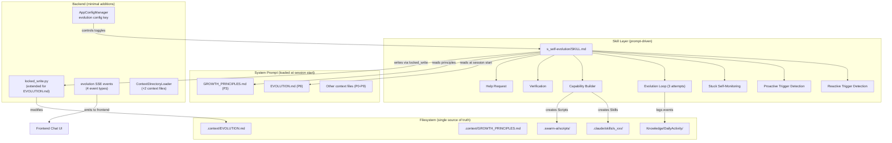
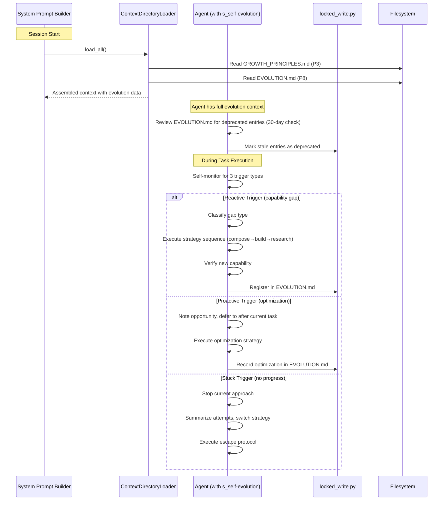
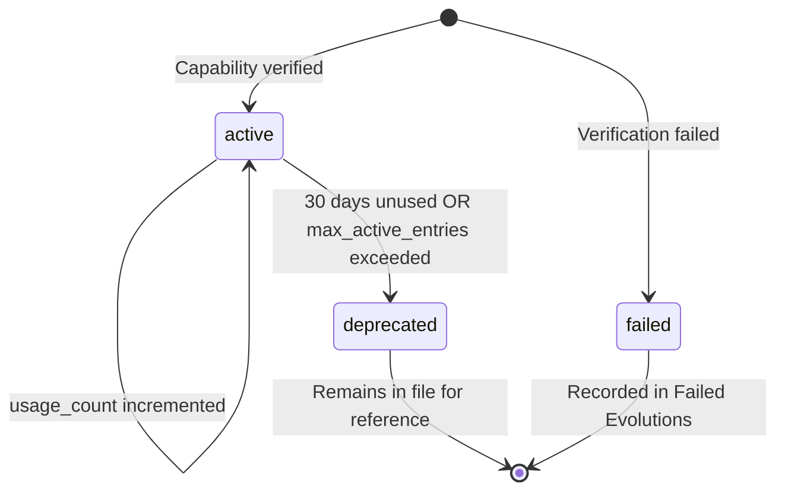

# Design Document: Self-Evolution Capability

## Overview

This design gives SwarmAI the ability to self-evolve through three trigger mechanisms: reactive (failure response), proactive (optimization), and stuck (escape). The core architecture is **prompt-driven** — the Evolution Engine is primarily a skill (`s_self-evolution`) that instructs the agent how to detect triggers, execute evolution loops, and persist results. Backend code is added only where the skill approach can't work: config loading, SSE event emission, and `locked_write.py` extension for EVOLUTION.md management.

### What's a Skill vs. What's Backend Code

| Concern | Implementation | Rationale |
|---------|---------------|-----------|
| Trigger detection (all 3 types) | Skill instructions (prompt-driven) | Agent self-monitors via instructions in system prompt |
| Evolution loop orchestration | Skill instructions | Agent follows strategy sequences per trigger type |
| Capability building (Skills, Scripts) | Skill instructions | Agent already knows how to create files |
| EVOLUTION.md read/write | `locked_write.py` (extended) | Concurrent-safe file modification |
| GROWTH_PRINCIPLES.md | Context file (new, priority 3.5→inserted at P3) | Loaded automatically by ContextDirectoryLoader |
| EVOLUTION.md | Context file (new, priority 7.5→inserted at P8) | Loaded automatically, truncates from head (newest kept) |
| Config schema | AppConfigManager `evolution` key | Zero-IO reads, existing pattern |
| SSE events | `AgentManager._yield_evolution_event()` | Thin helper, ~20 lines |
| Frontend UI | React components (phased) | MVP: chat message styling; Phase 2: collapsible + badge |

### Key Design Decisions

1. **No Stuck_Detector backend module** — Stuck detection is prompt-driven. The skill instructs the agent to self-monitor for the 5 stuck signals. This is the lightest approach and avoids hooking into SDK internals.
2. **EVOLUTION.md as 11th context file** — Added to `CONTEXT_FILES` list at priority 8 (between MEMORY and KNOWLEDGE), truncatable, user-customized, truncates from head (newest kept).
3. **GROWTH_PRINCIPLES.md as system context file** — Added at priority 3 (same slot as AGENT.md, loaded right after SOUL.md). Not user-customized initially — ships with 8 default principles. Users edit it directly in `.context/`.
4. **30-entry active cap on EVOLUTION.md** — Prevents unbounded growth. When cap is reached, oldest by `created_at` with lowest `usage_count` is deprecated first.
5. **Per-session cooldown** — Max 3 evolution triggers per session, 60-second cooldown between same-type triggers. Prevents evolution from derailing user tasks.
6. **Deferred proactive triggers** — Proactive triggers are noted but deferred to after the current user task completes, preventing mid-task derailment.


## Architecture

### High-Level Architecture



### Session Lifecycle Flow




## Components and Interfaces

### 1. Context Files (2 new files)

#### GROWTH_PRINCIPLES.md

Added to `CONTEXT_FILES` list. Ships as a system default template in `backend/context/`.

```python
# In context_directory_loader.py — insert between AGENT.md (P3) and USER.md (P4)
# Shift USER.md to P5, STEERING to P6, etc. OR use a float-like approach:
# Simpler: renumber priorities to make room

# New CONTEXT_FILES list (12 files):
CONTEXT_FILES = [
    ContextFileSpec("SWARMAI.md",           0,  "SwarmAI",            False, False, "tail"),
    ContextFileSpec("IDENTITY.md",          1,  "Identity",           False, False, "tail"),
    ContextFileSpec("SOUL.md",              2,  "Soul",               False, False, "tail"),
    ContextFileSpec("GROWTH_PRINCIPLES.md", 3,  "Growth Principles",  True,  True,  "tail"),
    ContextFileSpec("AGENT.md",             4,  "Agent Directives",   True,  False, "tail"),
    ContextFileSpec("USER.md",              5,  "User",               True,  True,  "tail"),
    ContextFileSpec("STEERING.md",          6,  "Steering",           True,  True,  "tail"),
    ContextFileSpec("TOOLS.md",             7,  "Tools",              True,  True,  "tail"),
    ContextFileSpec("MEMORY.md",            8,  "Memory",             True,  True,  "head"),
    ContextFileSpec("EVOLUTION.md",         9,  "Evolution Registry", True,  True,  "head"),
    ContextFileSpec("KNOWLEDGE.md",         10, "Knowledge",          True,  True,  "tail"),
    ContextFileSpec("PROJECTS.md",          11, "Projects",           True,  True,  "tail"),
]
```

Key decisions:
- GROWTH_PRINCIPLES.md at P3 (after SOUL, before AGENT) — principles inform agent behavior
- EVOLUTION.md at P9 (after MEMORY, before KNOWLEDGE) — evolution data is operational context
- EVOLUTION.md truncates from head (keeps newest entries, same as MEMORY.md)
- GROWTH_PRINCIPLES.md is `user_customized=True` — users can add/modify principles
- Both are truncatable under token budget pressure

#### GROWTH_PRINCIPLES.md Default Template

```markdown
# Growth Principles

These principles guide SwarmAI's self-improvement decisions. They are referenced
during evolution attempts and recorded in EVOLUTION.md entries.

## 1. Try before you ask
Attempt to solve the problem yourself before asking the user. Exhaust available
tools, skills, and knowledge first.

## 2. Reuse before you build
Check EVOLUTION.md and existing skills before creating something new. If a
capability already exists, use it.

## 3. Small fix over big system
Prefer the smallest change that solves the problem. Don't build a framework
when a script will do.

## 4. Verify before you declare
Always test that a new capability actually works before registering it as
successful. Re-attempt the original task as verification.

## 5. Leave a trail
Record what you built, why, and how to use it. Future sessions depend on
good EVOLUTION.md entries.

## 6. Know when to stop
After 3 failed attempts, stop and ask for help. Don't waste time on
diminishing returns.

## 7. If it works but it's ugly, make it better
When you notice a working but suboptimal approach, note it as a proactive
optimization opportunity for later.

## 8. If you're stuck, step back and switch
When making no progress, stop the current approach entirely. Try something
fundamentally different, not a cosmetic variation.
```

### 2. s_self-evolution Skill

The core of the Evolution Engine. This is a built-in skill (`backend/skills/s_self-evolution/SKILL.md`) that provides the agent with detailed instructions for self-evolution behavior.

#### SKILL.md Structure

```yaml
---
name: Self-Evolution Engine
description: >
  Detects capability gaps, optimization opportunities, and stuck states.
  Orchestrates evolution loops with up to 3 attempts per trigger.
  Persists results to EVOLUTION.md for cross-session growth.
---
```

The skill body contains sections for:

1. **When to Use** — Always active (loaded into every session via built-in skill projection). The agent continuously self-monitors using these instructions.

2. **Trigger Detection Rules** — Detailed instructions for recognizing each trigger type:
   - Reactive: tool failure analysis, missing skill detection, command unavailability
   - Proactive: EVOLUTION.md pattern matching, MEMORY.md lesson applicability (MVP only)
   - Stuck: 5 signal patterns (repeated_error, rewrite_loop, silent_tool_chain, self_revert, cosmetic_retry)

3. **Priority and Cooldown** — stuck > reactive > proactive; max 3 triggers/session; 60s same-type cooldown

4. **Evolution Loop Protocol** — Per-trigger strategy sequences with max 3 attempts

5. **Capability Building Instructions** — How to create Skills (SKILL.md format), Scripts, install tools

6. **Verification Protocol** — Re-attempt original task, timeout awareness

7. **EVOLUTION.md Write Protocol** — Always use `locked_write.py`, entry format, section targeting

8. **Help Request Format** — Structured output when all attempts fail

9. **Rules** — Hard constraints (3-attempt limit, always verify, always record, respect config toggles)

### 3. locked_write.py Extension

Extend the existing `locked_write.py` to support EVOLUTION.md operations beyond simple append/replace:

```python
# New mode: --increment-field
# Usage: python locked_write.py --file .context/EVOLUTION.md \
#          --section "Capabilities Built" \
#          --increment-field "Usage Count" \
#          --entry-id "E001"

# New mode: --set-field  
# Usage: python locked_write.py --file .context/EVOLUTION.md \
#          --section "Capabilities Built" \
#          --set-field "Status" --value "deprecated" \
#          --entry-id "E003"
```

New functions to add:
- `_increment_field(content, section, entry_id, field_name)` — Find entry by ID, increment numeric field
- `_set_field(content, section, entry_id, field_name, value)` — Find entry by ID, set field value
- Updated CLI argument parser with `--increment-field`, `--set-field`, `--value`, `--entry-id` options

The entry ID format (`E001`, `O001`, `F001`) is used as the lookup key within sections.

### 4. SSE Event Helpers

Thin helper in `AgentManager` or a small `evolution_events.py` module:

```python
# backend/core/evolution_events.py (~30 lines)

from typing import Any

def evolution_start_event(
    trigger_type: str,
    description: str,
    strategy: str,
    attempt_number: int,
    principle: str | None = None,
) -> dict[str, Any]:
    return {
        "event": "evolution_start",
        "data": {
            "triggerType": trigger_type,
            "description": description,
            "strategySelected": strategy,
            "attemptNumber": attempt_number,
            "principleApplied": principle,
        },
    }

def evolution_result_event(
    outcome: str,
    duration_ms: int,
    capability_created: str | None = None,
    evolution_id: str | None = None,
    failure_reason: str | None = None,
) -> dict[str, Any]:
    return {
        "event": "evolution_result",
        "data": {
            "outcome": outcome,
            "durationMs": duration_ms,
            "capabilityCreated": capability_created,
            "evolutionId": evolution_id,
            "failureReason": failure_reason,
        },
    }

def evolution_stuck_event(
    signals: list[str],
    summary: str,
    escape_strategy: str,
) -> dict[str, Any]:
    return {
        "event": "evolution_stuck_detected",
        "data": {
            "detectedSignals": signals,
            "triedSummary": summary,
            "escapeStrategy": escape_strategy,
        },
    }

def evolution_help_request_event(
    task_summary: str,
    trigger_type: str,
    attempts: list[dict],
    suggested_next_step: str,
) -> dict[str, Any]:
    return {
        "event": "evolution_help_request",
        "data": {
            "taskSummary": task_summary,
            "triggerType": trigger_type,
            "attempts": attempts,
            "suggestedNextStep": suggested_next_step,
        },
    }
```

These events are emitted by the agent via a bash command that calls a small HTTP endpoint, or more practically, the agent includes structured markers in its output that the SSE streaming parser recognizes and converts to typed events. The simplest approach: the skill instructs the agent to output a specific JSON block (e.g., `<!-- EVOLUTION_EVENT: {...} -->`) that the backend's message parser extracts and emits as a separate SSE event.

### 5. Configuration Schema

Added to `AppConfigManager` defaults:

```python
# In DEFAULT_CONFIG:
"evolution": {
    "enabled": True,
    "max_retries": 3,
    "verification_timeout_seconds": 120,
    "auto_approve_skills": False,
    "auto_approve_scripts": False,
    "auto_approve_installs": False,
    "proactive_enabled": True,
    "stuck_detection_enabled": True,
    "max_triggers_per_session": 3,
    "same_type_cooldown_seconds": 60,
    "max_active_entries": 30,
    "deprecation_days": 30,
}
```


### 6. Frontend Components (Phased)

#### MVP (Phase 1): Chat Message Styling

Evolution events rendered as styled chat messages in the existing message stream:

```typescript
// desktop/src/components/chat/EvolutionMessage.tsx
// Renders evolution SSE events as distinct chat bubbles with:
// - Icon indicating trigger type (⚡ reactive, 🔍 proactive, 🔄 stuck)
// - Colored left border (orange=reactive, blue=proactive, red=stuck)
// - Compact summary text
// - Expandable details (click to show full context)

interface EvolutionEventProps {
  eventType: 'evolution_start' | 'evolution_result' | 'evolution_stuck_detected' | 'evolution_help_request';
  data: Record<string, unknown>;
}
```

#### Phase 2: Enhanced UI

- Collapsible evolution event groups (start + result collapsed into single element)
- Swarm Radar badge showing evolution count per session (by trigger type)
- Settings page "Self-Evolution" section with toggle controls

### 7. File/Directory Structure (New Files Only)

```
backend/
├── context/
│   ├── GROWTH_PRINCIPLES.md          # NEW: Default template (8 principles)
│   └── EVOLUTION.md                  # NEW: Empty template with section headers
├── core/
│   ├── context_directory_loader.py   # MODIFIED: Add 2 new ContextFileSpec entries
│   ├── app_config_manager.py         # MODIFIED: Add evolution defaults
│   └── evolution_events.py           # NEW: SSE event helper functions (~30 lines)
├── scripts/
│   └── locked_write.py               # MODIFIED: Add --increment-field, --set-field modes
├── skills/
│   └── s_self-evolution/
│       └── SKILL.md                  # NEW: Core evolution skill (~300 lines)
└── routers/
    └── chat.py                       # MODIFIED: Parse evolution markers from agent output

desktop/src/
├── components/chat/
│   └── EvolutionMessage.tsx          # NEW: Evolution event renderer (MVP)
├── services/
│   └── evolution.ts                  # NEW: Evolution config API + toCamelCase
└── pages/
    └── SettingsPage.tsx              # MODIFIED: Add Self-Evolution section (Phase 2)

~/.swarm-ai/SwarmWS/.context/
├── GROWTH_PRINCIPLES.md              # Created by ensure_directory()
└── EVOLUTION.md                      # Created by ensure_directory()
```


## Data Models

### EVOLUTION.md File Format

The single source of truth for all evolution data. Three sections with sequential IDs:

```markdown
# SwarmAI Evolution Registry

## Capabilities Built

### E001 | <trigger_type> | <capability_type> | <YYYY-MM-DD>
- **Name**: <name>
- **Description**: <description>
- **Location**: <file path>
- **Usage**: <usage instructions>
- **When to Use**: <matching criteria for future sessions>
- **Principle Applied**: <growth principle name>
- **Usage Count**: <integer>
- **Status**: active | deprecated
- **Auto Generated**: true

## Optimizations Learned

### O001 | <YYYY-MM-DD>
- **Optimization**: <description>
- **Context**: <when this applies>
- **Before**: <old approach>
- **After**: <new approach>
- **When Applicable**: <matching criteria>

## Failed Evolutions

### F001 | <trigger_type> | <YYYY-MM-DD>
- **Attempted**: <what was tried>
- **Strategy**: <strategy name>
- **Why Failed**: <failure reason>
- **Lesson**: <what was learned>
- **Alternative**: <suggested alternative approach>
```

#### ID Generation

- E-IDs: Sequential within "Capabilities Built" section (E001, E002, ...)
- O-IDs: Sequential within "Optimizations Learned" section (O001, O002, ...)
- F-IDs: Sequential within "Failed Evolutions" section (F001, F002, ...)
- The skill instructs the agent to read the last ID in each section and increment

#### Entry Lifecycle



### EVOLUTION.md Default Template

Shipped in `backend/context/EVOLUTION.md`:

```markdown
# SwarmAI Evolution Registry

## Capabilities Built

_No capabilities built yet. The Evolution Engine will register new capabilities here._

## Optimizations Learned

_No optimizations recorded yet._

## Failed Evolutions

_No failed evolutions recorded yet._
```

### Configuration Data Model

```python
@dataclass
class EvolutionConfig:
    """Evolution configuration read from config.json['evolution']."""
    enabled: bool = True
    max_retries: int = 3
    verification_timeout_seconds: int = 120
    auto_approve_skills: bool = False
    auto_approve_scripts: bool = False
    auto_approve_installs: bool = False
    proactive_enabled: bool = True
    stuck_detection_enabled: bool = True
    max_triggers_per_session: int = 3
    same_type_cooldown_seconds: int = 60
    max_active_entries: int = 30
    deprecation_days: int = 30
```

This is not a separate class — it's read directly from `AppConfigManager.get("evolution", {})` and the skill references these values via instructions that tell the agent to check config before acting.

### SSE Event Data Models

```python
# Pydantic models for SSE event payloads (backend, snake_case)

class EvolutionStartEvent(BaseModel):
    trigger_type: str          # "reactive" | "proactive" | "stuck"
    description: str           # Gap/opportunity/stuck description
    strategy_selected: str     # Current strategy name
    attempt_number: int        # 1, 2, or 3
    principle_applied: str | None = None

class EvolutionResultEvent(BaseModel):
    outcome: str               # "success" | "failure"
    duration_ms: int
    capability_created: str | None = None  # E-ID or O-ID
    evolution_id: str | None = None
    failure_reason: str | None = None

class EvolutionStuckEvent(BaseModel):
    detected_signals: list[str]
    tried_summary: str
    escape_strategy: str

class EvolutionHelpRequestEvent(BaseModel):
    task_summary: str
    trigger_type: str
    attempts: list[dict]       # [{strategy, failure_reason}]
    suggested_next_step: str
```

Frontend receives these as camelCase via the existing SSE streaming infrastructure. The `toCamelCase()` conversion in `desktop/src/services/chat.ts` handles the transformation.

### Trigger Record (In-Skill, Not Persisted to DB)

The agent tracks triggers within a session using in-conversation state (no DB table):

```
Trigger Record (tracked in agent's working memory during session):
- trigger_type: reactive | proactive | stuck
- triggering_context: description of what triggered it
- detected_signals: list of signals that fired
- timestamp: when detected
- session_id: current session
- status: pending | in_progress | resolved | failed | deferred
```

This is purely prompt-driven — the skill instructs the agent to maintain this as a mental model, not as a data structure.


## Correctness Properties

*A property is a characteristic or behavior that should hold true across all valid executions of a system — essentially, a formal statement about what the system should do. Properties serve as the bridge between human-readable specifications and machine-verifiable correctness guarantees.*

Note: Many acceptance criteria in this feature are prompt-driven (the agent follows skill instructions to self-monitor and evolve). These are not amenable to automated property testing because they describe agent behavior, not function contracts. The testable properties below focus on the backend infrastructure that supports the evolution system: context file loading, EVOLUTION.md file operations, SSE event construction, and configuration management.

### Property 1: Context file assembly includes new evolution files

*For any* valid GROWTH_PRINCIPLES.md content and EVOLUTION.md content placed in the `.context/` directory, when `ContextDirectoryLoader.load_all()` is called, the assembled output string must contain both the Growth Principles section and the Evolution Registry section.

**Validates: Requirements 1.1, 7.3**

### Property 2: EVOLUTION.md entry completeness

*For any* entry appended to EVOLUTION.md via `locked_write.py`, the entry must contain all required fields for its type:
- E-entries (Capabilities Built): ID, trigger_type, capability_type, name, description, location, usage instructions, when_to_use, principle_applied, usage_count, status, auto_generated
- O-entries (Optimizations Learned): ID, optimization, context, before, after, when_applicable
- F-entries (Failed Evolutions): ID, trigger_type, attempted, strategy, why_failed, lesson, alternative

**Validates: Requirements 1.5, 4.3, 6.8, 7.2, 8.2, 8.5**

### Property 3: SSE event helper field completeness

*For any* valid input parameters to the evolution SSE event helper functions (`evolution_start_event`, `evolution_result_event`, `evolution_stuck_event`, `evolution_help_request_event`), the returned dict must contain an `event` key matching the expected event type and a `data` dict containing all required fields for that event type in camelCase.

**Validates: Requirements 9.1, 9.2, 9.3, 9.4**

### Property 4: Usage count increment is monotonic

*For any* EVOLUTION.md file containing an entry with ID `E_xxx` and Usage Count `N` (where N ≥ 0), after calling `locked_write.py --increment-field "Usage Count" --entry-id "E_xxx"`, the entry's Usage Count must equal `N + 1`, and all other entries in the file must remain unchanged.

**Validates: Requirements 7.8**

### Property 5: Deprecation marks stale entries correctly

*For any* EVOLUTION.md entry with status `active` and a `created_at` date more than `deprecation_days` (default 30) days ago with `usage_count` unchanged since last check, calling the set-field operation with `--set-field "Status" --value "deprecated"` must change only that entry's status to `deprecated` while preserving all other fields and all other entries.

**Validates: Requirements 7.10**

### Property 6: Evolution config defaults are complete

*For any* fresh `AppConfigManager` instance with no existing config file, `get("evolution")` must return a dict containing all specified keys (`enabled`, `max_retries`, `verification_timeout_seconds`, `auto_approve_skills`, `auto_approve_scripts`, `auto_approve_installs`, `proactive_enabled`, `stuck_detection_enabled`) with their specified default values.

**Validates: Requirements 10.2**

### Property 7: Sequential ID integrity after multiple writes

*For any* sequence of N append operations (where N ≥ 1) to the same EVOLUTION.md section via `locked_write.py`, the resulting file must contain exactly N new entries with sequential IDs (e.g., E001, E002, ..., E00N for Capabilities Built), and the file must remain valid Markdown parseable by `_find_section_range()`.

**Validates: Requirements 11.6**

### Property 8: Generated SKILL.md format validity

*For any* SKILL.md file created by the evolution system in `.claude/skills/s_xxx/`, the file must contain valid YAML frontmatter with at minimum `name` (non-empty string) and `description` (non-empty string) fields, followed by a markdown body.

**Validates: Requirements 6.7**


## Error Handling

### locked_write.py Errors

| Error | Handling |
|-------|----------|
| Lock timeout (5s) | Log error, skip the write. Agent retries on next attempt. No data corruption. |
| File not found | Create file with default template, then proceed with write. |
| Malformed EVOLUTION.md | `_find_section_range()` returns None → append under `## Distilled` fallback section. Log warning. |
| Entry ID not found (for --increment-field / --set-field) | Exit with code 1, print error to stderr. Agent sees the error and can retry or skip. |
| Invalid field value (non-numeric for increment) | Exit with code 1, print descriptive error. |

### Context Loading Errors

| Error | Handling |
|-------|----------|
| GROWTH_PRINCIPLES.md missing | `ensure_directory()` copies default template from `backend/context/`. Transparent to agent. |
| EVOLUTION.md missing | `ensure_directory()` copies empty template. Agent starts with no evolution history. |
| EVOLUTION.md too large (exceeds token budget) | Truncated from head (oldest entries removed from context). Entries still exist on disk. |
| Malformed EVOLUTION.md content | ContextDirectoryLoader loads raw text regardless. Agent may see garbled entries but system doesn't crash. |

### Evolution Loop Errors

| Error | Handling |
|-------|----------|
| Skill creation fails (permission denied) | Agent sees error, records as failed attempt (F-entry), moves to next strategy. |
| Script creation fails | Same as above — recorded as F-entry, next strategy attempted. |
| Package install fails (pip/npm/brew) | Agent sees error output, records failure, tries alternative approach. |
| Verification timeout (default 120s) | Agent treats as failed attempt. Skill instructs: "If verification takes too long, stop and record failure." |
| All 3 attempts exhausted | Agent generates Help_Request with full context. No further evolution attempts for this trigger. |
| Config not available | Fall back to defaults (evolution enabled, max_retries=3, etc.). |

### SSE Event Errors

| Error | Handling |
|-------|----------|
| Malformed evolution marker in agent output | Backend parser ignores unrecognized markers. No SSE event emitted. |
| Frontend receives unknown event type | Frontend ignores unknown SSE event types (existing behavior). |
| SSE connection drops during evolution | Evolution continues server-side. Frontend reconnects and sees results in message history. |

### Rate Limiting / Derailment Prevention

| Scenario | Handling |
|----------|----------|
| More than 3 triggers in one session | Skill instructs: "After 3 evolution triggers in this session, stop triggering. Note remaining opportunities in EVOLUTION.md for next session." |
| Same trigger type within 60s cooldown | Skill instructs: "Wait at least 60 seconds between same-type triggers." |
| Proactive trigger during active user task | Skill instructs: "Note the opportunity but defer action until the current user task is complete." |
| Evolution derails from user's original request | Skill instructs: "Always return to the user's original task after evolution completes. Summarize what you evolved and continue." |


## Testing Strategy

### Dual Testing Approach

This feature requires both unit tests and property-based tests. Given that the core Evolution Engine is prompt-driven (a skill), the testable surface is the backend infrastructure: `locked_write.py` extensions, `ContextDirectoryLoader` changes, SSE event helpers, and config defaults.

### Property-Based Testing

**Library**: `Hypothesis` (Python, backend) + `fast-check` (TypeScript, frontend)

**Configuration**: Minimum 100 iterations per property test.

Each property test must reference its design document property with a tag comment:

```python
# Feature: self-evolution-capability, Property 1: Context file assembly includes new evolution files
```

**Property tests to implement:**

1. **Property 1: Context file assembly** — Generate random GROWTH_PRINCIPLES.md and EVOLUTION.md content. Verify `load_all()` output contains both sections.
   - Generator: random markdown strings with section headers
   - Tag: `Feature: self-evolution-capability, Property 1: Context file assembly includes new evolution files`

2. **Property 2: Entry completeness** — Generate random E/O/F entries with all required fields. Write via `locked_write.py --append`. Parse the resulting file and verify all fields present.
   - Generator: random strings for each field, random trigger_type from {reactive, proactive, stuck}
   - Tag: `Feature: self-evolution-capability, Property 2: EVOLUTION.md entry completeness`

3. **Property 3: SSE event helpers** — Generate random valid inputs for each helper function. Verify output dict structure.
   - Generator: random strings for descriptions, random ints for attempt_number (1-3), random trigger_type
   - Tag: `Feature: self-evolution-capability, Property 3: SSE event helper field completeness`

4. **Property 4: Usage count increment** — Generate EVOLUTION.md with random entries and random usage counts. Increment a random entry. Verify only that entry's count changed.
   - Generator: random number of entries (1-10), random usage counts (0-100)
   - Tag: `Feature: self-evolution-capability, Property 4: Usage count increment is monotonic`

5. **Property 5: Deprecation** — Generate entries with random dates and usage counts. Apply deprecation logic. Verify only stale entries are marked.
   - Generator: random dates (some >30 days ago, some recent), random usage counts
   - Tag: `Feature: self-evolution-capability, Property 5: Deprecation marks stale entries correctly`

6. **Property 6: Config defaults** — Generate fresh AppConfigManager with no config file. Verify all evolution keys present with correct defaults.
   - Tag: `Feature: self-evolution-capability, Property 6: Evolution config defaults are complete`

7. **Property 7: Sequential ID integrity** — Generate random sequences of 1-20 append operations. Verify sequential IDs and valid Markdown structure.
   - Generator: random number of appends (1-20), random entry content
   - Tag: `Feature: self-evolution-capability, Property 7: Sequential ID integrity after multiple writes`

8. **Property 8: SKILL.md format** — Generate random SKILL.md content with YAML frontmatter. Verify frontmatter parsing produces name and description.
   - Generator: random non-empty strings for name and description, random markdown body
   - Tag: `Feature: self-evolution-capability, Property 8: Generated SKILL.md format validity`

Each correctness property is implemented by a single property-based test.

### Unit Tests

Unit tests cover specific examples, edge cases, and integration points:

**locked_write.py extensions:**
- `test_increment_field_on_entry_with_zero_count` — Verify increment from 0 to 1
- `test_increment_field_nonexistent_entry` — Verify error exit code
- `test_set_field_status_deprecated` — Verify status change
- `test_set_field_preserves_other_entries` — Verify no side effects
- `test_append_to_empty_evolution_md` — Verify first entry gets E001/O001/F001

**ContextDirectoryLoader:**
- `test_ensure_directory_creates_growth_principles` — Verify file created with correct permissions
- `test_ensure_directory_creates_evolution_md` — Verify empty template created
- `test_evolution_md_truncates_from_head` — Verify oldest content removed first
- `test_growth_principles_not_overwritten_if_user_edited` — Verify user_customized behavior

**SSE event helpers:**
- `test_evolution_start_event_structure` — Verify specific example output
- `test_evolution_result_event_success` — Verify success case
- `test_evolution_result_event_failure` — Verify failure case with reason
- `test_evolution_help_request_event` — Verify help request structure

**Config:**
- `test_evolution_config_defaults` — Verify all defaults match spec
- `test_evolution_config_merge_with_existing` — Verify partial config merges correctly
- `test_evolution_disabled_default_false` — Verify enabled=true by default

**Frontend (Vitest + fast-check):**
- `test_evolution_message_renders_reactive` — Verify reactive event renders with correct icon/color
- `test_evolution_message_renders_stuck` — Verify stuck event renders
- `test_evolution_message_expandable` — Verify click expands details
- `test_camel_case_conversion` — Verify snake_case → camelCase for evolution event fields

### Integration Tests (Success Criteria — Req 11)

These are manual or semi-automated integration tests that verify end-to-end behavior:

1. **Reactive evolution** (11.1): Set up a scenario where a tool fails. Verify agent detects gap, builds capability, registers in EVOLUTION.md.
2. **Proactive evolution** (11.2): Seed EVOLUTION.md with a known optimization. Present a task that matches. Verify agent applies it.
3. **Stuck detection** (11.3): Create a scenario that causes repeated errors. Verify agent detects stuck state and switches approach within 2 minutes.
4. **Cross-session persistence** (11.4): Build a capability in session A. Start session B with a matching task. Verify capability is applied without re-evolution.
5. **3-attempt hard stop** (11.5): Create an unsolvable scenario. Verify agent stops after exactly 3 attempts and generates Help_Request.
6. **EVOLUTION.md integrity** (11.6): Run 5 evolution cycles. Verify EVOLUTION.md has correct IDs, no corruption, all fields populated.

