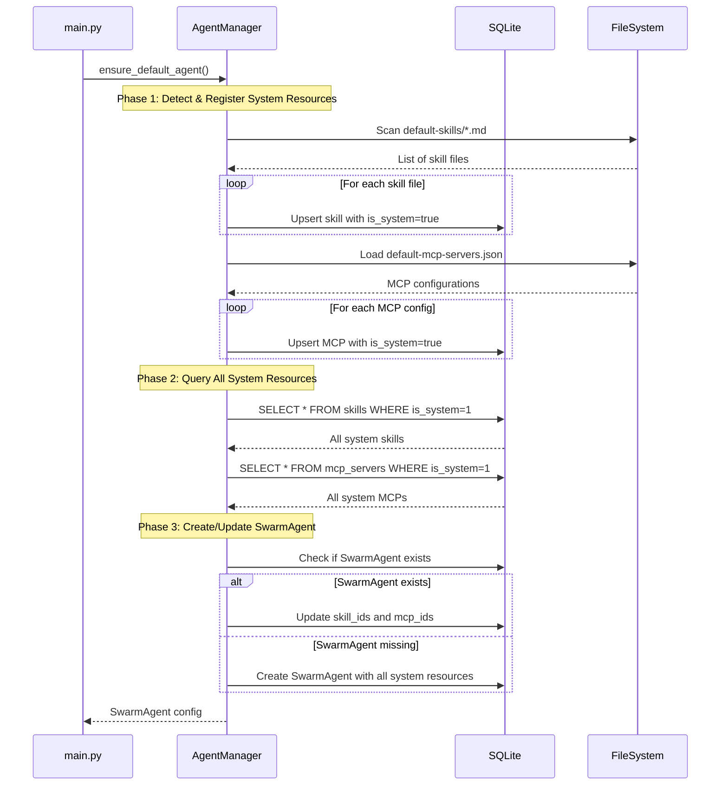

# Design Document: SwarmAgent System Default

## Overview

This design document describes the implementation of the SwarmAgent System Default feature. The feature creates a protected system agent named "SwarmAgent" that automatically binds all system skills and MCP servers at runtime without requiring code changes when new system resources are added.

This feature builds upon the existing default agent infrastructure but adds:
- Hardcoded name protection for brand consistency
- Runtime detection and binding of system resources from resource folders
- Protection against unbinding system resources
- Clear UI distinction between system and user resources

The implementation follows the existing SwarmAI architecture patterns:
- Backend: Python FastAPI with Pydantic models (snake_case)
- Frontend: React TypeScript (camelCase)
- Database: SQLite with async operations
- Skills: SKILL.md files with YAML frontmatter in `desktop/resources/default-skills/`
- MCP Servers: JSON configuration in `desktop/resources/default-mcp-servers.json`

## Architecture

```mermaid
flowchart TB
    subgraph Startup["Application Startup"]
        Main[main.py] --> DetectResources[Detect System Resources]
        DetectResources --> ScanSkills[Scan default-skills/]
        DetectResources --> LoadMCPs[Load default-mcp-servers.json]
        ScanSkills --> RegisterSkills[Register with is_system=true]
        LoadMCPs --> RegisterMCPs[Register with is_system=true]
        RegisterSkills --> DB[(SQLite Database)]
        RegisterMCPs --> DB
        DB --> InitSwarmAgent[Initialize SwarmAgent]
        InitSwarmAgent --> QuerySystem[Query is_system=true resources]
        QuerySystem --> BindResources[Bind all system resources]
    end
    
    subgraph API["API Layer"]
        AgentsRouter[agents.py] --> NameProtection[Block name changes]
        AgentsRouter --> DeleteProtection[Block deletion]
        AgentsRouter --> UnbindProtection[Block system unbind]
        AgentsRouter --> AllowUserBind[Allow user resource bind/unbind]
    end
    
    subgraph Frontend["Frontend"]
        AgentsPage[AgentsPage.tsx] --> SystemBadge[Show System badge]
        AgentsPage --> DisableDelete[Disable delete button]
        AgentsPage --> DisableName[Disable name field]
        AgentDetail[Agent Detail] --> SkillsList[Skills list]
        AgentDetail --> MCPsList[MCPs list]
        SkillsList --> SystemIndicator[System indicator + no unbind]
        MCPsList --> SystemIndicator
    end
```



## Components and Interfaces

### Backend Components

#### 1. Schema Extensions

**Skill Schema (`backend/schemas/skill.py`)**

The `is_system` field already exists in the schema. No changes needed.

**MCP Schema (`backend/schemas/mcp.py`)**

The `is_system` field already exists in the schema. No changes needed.

**Agent Schema (`backend/schemas/agent.py`)**

Add a new field to identify the system agent:

```python
class AgentConfig(BaseModel):
    # ... existing fields ...
    is_system_agent: bool = Field(default=False, description="Whether this is the protected system agent (SwarmAgent)")
```

#### 2. Database Schema Extension (`backend/database/sqlite.py`)

Add `is_system_agent` column to agents table:

```sql
ALTER TABLE agents ADD COLUMN is_system_agent INTEGER DEFAULT 0;
```

#### 3. Agent Manager Updates (`backend/core/agent_manager.py`)

Modify `ensure_default_agent()` to:
1. Set `is_system_agent=True` for SwarmAgent
2. Query all system resources and bind them
3. Protect against name changes

```python
SWARM_AGENT_NAME = "SwarmAgent"  # Hardcoded, cannot be changed

async def ensure_default_agent() -> dict:
    """Ensure SwarmAgent exists with all system resources bound."""
    
    # 1. Register all system skills (already sets is_system=True)
    skill_ids = await _register_default_skills(skills_dir)
    
    # 2. Register all system MCPs (already sets is_system=True)
    mcp_ids = await _register_default_mcp_servers(config_path)
    
    # 3. Query ALL system resources from database
    all_system_skills = await db.skills.list_by_system()
    all_system_mcps = await db.mcp_servers.list_by_system()
    
    # 4. Create/update SwarmAgent with all system resources
    agent_data = {
        "id": DEFAULT_AGENT_ID,
        "name": SWARM_AGENT_NAME,  # Hardcoded
        "is_default": True,
        "is_system_agent": True,
        "skill_ids": [s["id"] for s in all_system_skills],
        "mcp_ids": [m["id"] for m in all_system_mcps],
        # ... other config
    }
```

#### 4. Database Query Methods (`backend/database/sqlite.py`)

Add methods to query system resources:

```python
class SkillsTable:
    async def list_by_system(self) -> list[dict]:
        """List all skills where is_system=True."""
        pass

class MCPServersTable:
    async def list_by_system(self) -> list[dict]:
        """List all MCP servers where is_system=True."""
        pass
```

#### 5. API Endpoint Updates (`backend/routers/agents.py`)

**Name Protection:**
```python
@router.put("/{agent_id}")
async def update_agent(agent_id: str, request: AgentUpdateRequest):
    agent = await db.agents.get(agent_id)
    if agent and agent.get("is_system_agent"):
        if request.name and request.name != SWARM_AGENT_NAME:
            raise ValidationException(message="Cannot change the name of the system agent")
```

**Unbind Protection:**
```python
@router.put("/{agent_id}")
async def update_agent(agent_id: str, request: AgentUpdateRequest):
    if agent.get("is_system_agent"):
        # Get current system resources
        system_skills = await db.skills.list_by_system()
        system_skill_ids = {s["id"] for s in system_skills}
        
        # Ensure all system skills remain bound
        if request.skill_ids is not None:
            new_skill_ids = set(request.skill_ids)
            if not system_skill_ids.issubset(new_skill_ids):
                raise ValidationException(message="Cannot unbind system skills from SwarmAgent")
```

### Frontend Components

#### 1. TypeScript Types (`desktop/src/types/index.ts`)

```typescript
export interface Agent {
  // ... existing fields ...
  isSystemAgent: boolean;  // NEW: identifies SwarmAgent
}
```

#### 2. Agents Service (`desktop/src/services/agents.ts`)

Update case conversion:

```typescript
const toCamelCase = (data: Record<string, unknown>): Agent => {
  return {
    // ... existing mappings ...
    isSystemAgent: (data.is_system_agent as boolean) ?? false,
  };
};
```

#### 3. Agents Page (`desktop/src/pages/AgentsPage.tsx`)

**System Badge:**
```tsx
{agent.isSystemAgent && (
  <span className="px-2 py-0.5 text-xs bg-primary/10 text-primary rounded-full">
    System
  </span>
)}
```

**Disabled Delete Button:**
```tsx
<button
  onClick={() => handleDeleteClick(agent)}
  disabled={agent.isDefault || agent.isSystemAgent}
  className={clsx(
    "p-2 rounded-lg transition-colors",
    (agent.isDefault || agent.isSystemAgent)
      ? "text-[var(--color-text-muted)] opacity-50 cursor-not-allowed"
      : "text-[var(--color-text-muted)] hover:text-status-error"
  )}
>
```

**Disabled Name Field:**
```tsx
<input
  type="text"
  value={agent.name}
  disabled={agent.isSystemAgent}
  className={clsx(
    "...",
    agent.isSystemAgent && "bg-[var(--color-bg-secondary)] cursor-not-allowed"
  )}
/>
```

#### 4. Agent Detail/Edit Page

**Skills List with System Indicator:**
```tsx
{boundSkills.map(skill => (
  <div key={skill.id} className="flex items-center justify-between">
    <span>{skill.name}</span>
    <div className="flex items-center gap-2">
      {skill.isSystem && (
        <span className="px-2 py-0.5 text-xs bg-[var(--color-bg-tertiary)] rounded">
          System
        </span>
      )}
      {!skill.isSystem && (
        <button onClick={() => handleUnbindSkill(skill.id)}>
          Unbind
        </button>
      )}
    </div>
  </div>
))}
```

## Data Models

### Agent Database Schema

```sql
CREATE TABLE agents (
    -- ... existing columns ...
    is_default INTEGER DEFAULT 0,
    is_system_agent INTEGER DEFAULT 0,  -- NEW: identifies SwarmAgent
    -- ...
);
```

### System Resource Detection Flow



## Correctness Properties

*A property is a characteristic or behavior that should hold true across all valid executions of a system—essentially, a formal statement about what the system should do. Properties serve as the bridge between human-readable specifications and machine-verifiable correctness guarantees.*

### Property 1: Name Update Protection

*For any* update request to SwarmAgent containing a name change, the system SHALL reject the request and the agent name SHALL remain "SwarmAgent".

**Validates: Requirements 1.2**

### Property 2: System Resource Detection

*For any* skill file in `desktop/resources/default-skills/` or MCP configuration in `desktop/resources/default-mcp-servers.json`, the corresponding database record SHALL have `is_system=true`.

**Validates: Requirements 2.2, 3.2, 7.2**

### Property 3: System Resource Binding

*For any* resource with `is_system=true` in the database, SwarmAgent's `skill_ids` or `mcp_ids` SHALL contain that resource's ID after initialization.

**Validates: Requirements 2.3, 3.3, 7.3**

### Property 4: System Resource Unbind Protection

*For any* update request to SwarmAgent that would remove a system resource (skill or MCP) from its bindings, the system SHALL reject the request and the system resource SHALL remain bound.

**Validates: Requirements 4.1, 4.2**

### Property 5: Initialization Idempotence

*For any* number of application restarts, the system SHALL not create duplicate skill or MCP records, and SwarmAgent SHALL have exactly one binding per system resource.

**Validates: Requirements 7.4**

## Error Handling

### Backend Errors

| Error Condition | HTTP Status | Error Code | Message |
|----------------|-------------|------------|---------|
| Attempt to change SwarmAgent name | 400 | VALIDATION_FAILED | "Cannot change the name of the system agent" |
| Attempt to delete SwarmAgent | 400 | VALIDATION_FAILED | "Cannot delete the system agent" |
| Attempt to unbind system skill | 400 | VALIDATION_FAILED | "Cannot unbind system skills from SwarmAgent" |
| Attempt to unbind system MCP | 400 | VALIDATION_FAILED | "Cannot unbind system MCP servers from SwarmAgent" |
| System resources folder missing | Warning | N/A | Log warning, continue with empty list |
| Invalid skill file format | Warning | N/A | Log warning, skip file |

### Frontend Error Handling

- Display toast notification for validation errors
- Disable UI controls that would trigger protected operations
- Show clear visual indicators for system resources

## Testing Strategy

### Unit Tests

Unit tests verify specific examples and edge cases:

1. **Backend Unit Tests**
   - Test `ensure_default_agent()` creates SwarmAgent with `is_system_agent=true`
   - Test name update rejection for SwarmAgent
   - Test delete rejection for SwarmAgent
   - Test system skill unbind rejection
   - Test system MCP unbind rejection
   - Test user skill bind/unbind success
   - Test user MCP bind/unbind success
   - Test `list_by_system()` returns only system resources

2. **Frontend Unit Tests**
   - Test `toCamelCase` correctly maps `is_system_agent` to `isSystemAgent`
   - Test AgentsPage shows "System" badge for system agent
   - Test AgentsPage disables delete button for system agent
   - Test AgentsPage disables name field for system agent
   - Test skill list shows "System" indicator for system skills
   - Test skill list hides unbind button for system skills
   - Test skill list shows unbind button for user skills

### Property-Based Tests

Property tests verify universal properties across all inputs using a property-based testing library (e.g., Hypothesis for Python, fast-check for TypeScript).

Each property test should run minimum 100 iterations and be tagged with the design property it validates.

1. **Property Test: Name Update Protection**
   - **Feature: swarm-agent-system-default, Property 1: Name Update Protection**
   - Generate random valid agent names
   - Attempt to update SwarmAgent with each name
   - Verify all updates are rejected and name remains "SwarmAgent"

2. **Property Test: System Resource Detection**
   - **Feature: swarm-agent-system-default, Property 2: System Resource Detection**
   - For each resource in system folders/config
   - Query the database record
   - Verify `is_system=true`

3. **Property Test: System Resource Binding**
   - **Feature: swarm-agent-system-default, Property 3: System Resource Binding**
   - Query all resources with `is_system=true`
   - Get SwarmAgent's skill_ids and mcp_ids
   - Verify all system resource IDs are present

4. **Property Test: System Resource Unbind Protection**
   - **Feature: swarm-agent-system-default, Property 4: System Resource Unbind Protection**
   - Generate random subsets of skill_ids/mcp_ids that exclude system resources
   - Attempt to update SwarmAgent with each subset
   - Verify all updates are rejected

5. **Property Test: Initialization Idempotence**
   - **Feature: swarm-agent-system-default, Property 5: Initialization Idempotence**
   - Run `ensure_default_agent()` multiple times
   - Query all skills and MCPs
   - Verify no duplicates exist (unique IDs)
   - Verify SwarmAgent has exactly one binding per system resource

### Integration Tests

- Test full startup flow creates SwarmAgent with all system resources
- Test adding new skill file to resources folder and restarting
- Test adding new MCP to config file and restarting
- Test UI correctly displays system vs user resources
