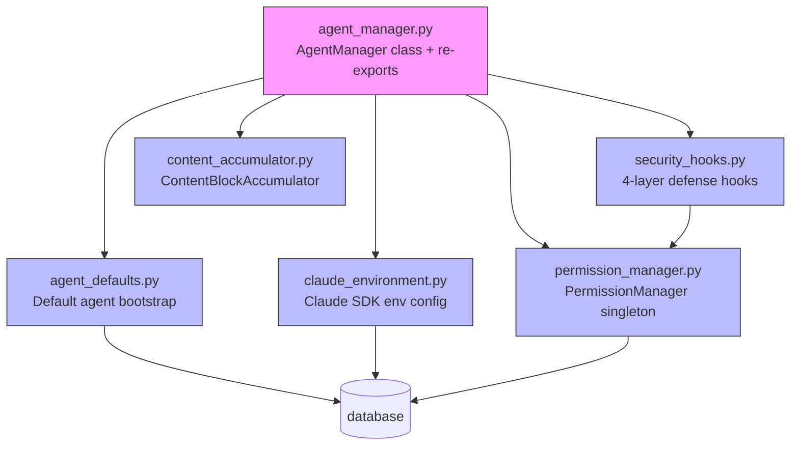

# Design Document: Agent Code Refactoring

## Overview

This design describes the behavior-preserving decomposition of `backend/core/agent_manager.py` (~2,400 lines) into focused, single-responsibility modules. The monolith currently handles security hooks, permission state, environment configuration, default agent setup, content accumulation, and the core `AgentManager` class. After refactoring, each concern lives in its own module while `agent_manager.py` retains the `AgentManager` class and re-exports all public symbols for backward compatibility.

The refactoring is structured in 6 independent phases, each passing the existing test suite before the next begins. No functional changes are introduced — every extracted function preserves its exact signature, return value, and side effects.

### Design Rationale

- **Single Responsibility**: Each new module owns one concern, making it easier to review, test, and modify in isolation.
- **Backward Compatibility**: Re-exports from `agent_manager.py` ensure zero import changes for callers during the transition.
- **Phase Independence**: Each phase is a self-contained commit that passes `pytest` independently, enabling incremental review and safe rollback.
- **No Functional Changes**: This is a structural refactoring only — the application behavior is identical before and after.

## Architecture

The refactoring transforms the flat monolith into a layered module structure where `AgentManager` depends on extracted modules via explicit imports.

### Current State (Before)

```
backend/core/agent_manager.py (~2,400 lines)
├── Module-level globals (_approved_commands, _permission_events, _permission_results, _permission_request_queue)
├── Standalone functions (get_default_agent, ensure_default_agent, _register_default_skills, ...)
│   (Note: workspace_config_resolver.py was later removed by the unified-swarm-workspace-cwd refactor)
├── _ClaudeClientWrapper class
├── ContentBlockAccumulator class
├── Security hook functions (dangerous_command_blocker, create_human_approval_hook, ...)
├── Permission functions (approve_command, is_command_approved, wait_for_permission_decision, ...)
├── _configure_claude_environment function
└── AgentManager class (~1,300 lines)
    ├── _build_options (~400 lines)
    ├── run_conversation (~220 lines)
    ├── _run_query_on_client (~250 lines)
    ├── continue_with_answer (~150 lines)
    ├── continue_with_permission (~120 lines)
    └── run_skill_creator_conversation (~150 lines)
```

### Target State (After)



```
backend/core/
├── agent_manager.py        # AgentManager class + backward-compatible re-exports (~1,300 lines)
├── security_hooks.py       # Hook factories, DANGEROUS_PATTERNS, check_dangerous_command (~300 lines)
├── permission_manager.py   # PermissionManager class (singleton) (~150 lines)
├── agent_defaults.py       # ensure_default_agent, skill/MCP registration (~300 lines)
├── claude_environment.py   # _configure_claude_environment, _ClaudeClientWrapper (~200 lines)
├── content_accumulator.py  # ContentBlockAccumulator (~70 lines)
├── workspace_manager.py    # (later refactored by unified-swarm-workspace-cwd; per-agent methods removed)
└── ... (existing modules unchanged)
```

### Dependency Flow

- `security_hooks.py` depends on `permission_manager.py` (accepts PermissionManager methods as parameters)
- `agent_defaults.py` depends on `database`, `config`
- `claude_environment.py` depends on `database`, `config`
- `content_accumulator.py` has zero external dependencies
- `agent_manager.py` imports from all extracted modules and re-exports public symbols

No circular dependencies are introduced. The dependency graph is a DAG.

## Components and Interfaces

### 1. `security_hooks.py`

Module-level docstring describes the 4-layer defense model.

```python
"""Security hooks implementing the 4-layer defense model.

Layer 1: Workspace Isolation (unified SwarmWorkspace)
Layer 2: Skill Access Control (PreToolUse hook)
Layer 3: File Tool Access Control (can_use_tool permission handler)
Layer 4: Bash Command Protection (dangerous command blocking + human approval)
"""

# Constants
DANGEROUS_PATTERNS: list[tuple[str, str]]

# Functions (exact signatures preserved from agent_manager.py)
def check_dangerous_command(command: str) -> Optional[str]: ...

async def pre_tool_logger(
    input_data: dict, tool_use_id: str | None, context: Any
) -> dict: ...

async def dangerous_command_blocker(
    input_data: dict, tool_use_id: str | None, context: Any
) -> dict: ...

def create_human_approval_hook(
    session_context: dict,
    session_key: str,
    enable_human_approval: bool,
    permission_mgr: PermissionManager,  # NEW: injected dependency instead of module globals
) -> Callable: ...

def create_file_access_permission_handler(
    allowed_directories: list[str]
) -> Callable: ...

def create_skill_access_checker(
    allowed_skill_names: list[str]
) -> Callable: ...
```

Key change: `create_human_approval_hook` accepts a `PermissionManager` instance as a parameter instead of referencing module-level globals (`_permission_request_queue`, `is_command_approved`, `wait_for_permission_decision`). The caller (`AgentManager._build_hooks`) passes the singleton.

### 2. `permission_manager.py`

Encapsulates all mutable permission state that was previously module-level globals.

```python
"""Permission state management for command approval and human-in-the-loop decisions."""

class PermissionManager:
    def __init__(self) -> None:
        self._approved_commands: dict[str, set[str]] = {}
        self._permission_events: dict[str, asyncio.Event] = {}
        self._permission_results: dict[str, str] = {}
        self._permission_request_queue: asyncio.Queue = asyncio.Queue()

    def hash_command(self, command: str) -> str: ...
    def approve_command(self, session_id: str, command: str) -> None: ...
    def is_command_approved(self, session_id: str, command: str) -> bool: ...
    def clear_session_approvals(self, session_id: str) -> None: ...
    async def wait_for_permission_decision(self, request_id: str, timeout: int = 300) -> str: ...
    def set_permission_decision(self, request_id: str, decision: str) -> None: ...
    def get_permission_queue(self) -> asyncio.Queue: ...

# Module-level singleton
permission_manager = PermissionManager()
```

The singleton is used by `agent_manager.py` re-exports to maintain backward compatibility:
```python
# In agent_manager.py
from .permission_manager import permission_manager as _pm
approve_command = _pm.approve_command
is_command_approved = _pm.is_command_approved
set_permission_decision = _pm.set_permission_decision
wait_for_permission_decision = _pm.wait_for_permission_decision
_permission_request_queue = _pm.get_permission_queue()
```

### 3. `agent_defaults.py`

```python
"""Default agent bootstrap: creation, skill registration, MCP server registration."""

DEFAULT_AGENT_ID: str = "default"
SWARM_AGENT_NAME: str = "SwarmAgent"

def _get_resources_dir() -> Path: ...
def _get_templates_dir() -> Path: ...
async def get_default_agent() -> dict | None: ...
async def ensure_default_agent(skip_registration: bool = False) -> dict: ...
async def _register_default_skills(skills_dir: Path) -> list[str]: ...
async def _register_default_mcp_servers(config_path: Path) -> list[str]: ...
async def expand_skill_ids_with_plugins(
    skill_ids: list[str], plugin_ids: list[str], allow_all_skills: bool
) -> list[str]: ...
```

All function signatures and behavior are identical to the current implementation.

### 4. `claude_environment.py`

```python
"""Claude SDK environment configuration: API keys, Bedrock, model selection."""

class _ClaudeClientWrapper:
    """Wrapper to handle anyio cleanup errors with asyncio tasks."""
    def __init__(self, options: ClaudeAgentOptions) -> None: ...
    async def __aenter__(self) -> ClaudeSDKClient: ...
    async def __aexit__(self, exc_type, exc_val, exc_tb) -> bool: ...

async def _configure_claude_environment() -> None: ...
```

### 5. `content_accumulator.py`

```python
"""Content block accumulator with O(1) deduplication."""

class ContentBlockAccumulator:
    def __init__(self) -> None: ...
    @staticmethod
    def _get_key(block: dict) -> str | None: ...
    def add(self, block: dict) -> bool: ...
    def extend(self, blocks: list[dict]) -> None: ...
    @property
    def blocks(self) -> list[dict]: ...
    def __bool__(self) -> bool: ...
```

Zero external dependencies. Pure utility class.

### 6. `AgentManager._build_options` Decomposition

The ~400-line `_build_options` method is decomposed into focused private helpers:

```python
class AgentManager:
    async def _build_options(self, agent_config, enable_skills, enable_mcp, 
                             resume_session_id, session_context,
                             channel_context) -> ClaudeAgentOptions:
        """Orchestrator that delegates to 5 focused helpers + inline workspace logic."""
        allowed_tools = self._resolve_allowed_tools(agent_config)
        mcp_servers = await self._build_mcp_config(agent_config, enable_mcp)
        hooks, file_access_handler = await self._build_hooks(
            agent_config, enable_skills, enable_mcp, 
            resume_session_id, session_context
        )
        # Workspace logic inlined — always uses unified SwarmWorkspace
        sandbox_settings = self._build_sandbox_config(agent_config)
        mcp_servers = self._inject_channel_mcp(mcp_servers, channel_context, working_directory)
        # ... assemble and return ClaudeAgentOptions
    
    def _resolve_allowed_tools(self, agent_config: dict) -> list[str]: ...
    async def _build_mcp_config(self, agent_config: dict, enable_mcp: bool) -> dict: ...
    async def _build_hooks(self, agent_config: dict, enable_skills: bool,
                            enable_mcp: bool, resume_session_id: Optional[str],
                            session_context: Optional[dict]) -> tuple[dict, Optional[Callable]]: ...
    def _build_sandbox_config(self, agent_config: dict) -> Optional[dict]: ...
    def _inject_channel_mcp(self, mcp_servers: dict, channel_context: Optional[dict],
                             working_directory: str) -> dict: ...
```

### 7. Conversation Execution Deduplication

`run_conversation`, `continue_with_answer`, and `run_skill_creator_conversation` share a common pattern:
1. Look up or create a `ClaudeSDKClient`
2. Call `_run_query_on_client`
3. Store the client for reuse
4. Handle errors and cleanup

This is extracted into `_execute_on_session`:

```python
class AgentManager:
    async def _execute_on_session(
        self,
        agent_config: dict,
        query_content: Any,
        display_text: str,
        session_id: Optional[str],
        enable_skills: bool,
        enable_mcp: bool,
        is_resuming: bool,
        content: Optional[list[dict]],
        user_message: Optional[str],
        work_dir: Optional[str],
        agent_id: str,
        channel_context: Optional[dict] = None,
        workspace_id: Optional[str] = None,
    ) -> AsyncIterator[dict]:
        """Shared session setup, query execution, and response streaming.
        
        Handles:
        - Reusing existing long-lived clients for resumed sessions
        - Creating new clients when no active session exists
        - Falling back to fresh sessions when --resume can't work
        - Storing clients for future reuse
        - Error handling and session cleanup
        """
        ...
```

`run_conversation` and `continue_with_answer` become thin wrappers that prepare their specific inputs and delegate to `_execute_on_session`.

### 8. Backward-Compatible Re-exports in `agent_manager.py`

```python
# agent_manager.py — re-exports for backward compatibility
from .agent_defaults import (
    DEFAULT_AGENT_ID, SWARM_AGENT_NAME,
    ensure_default_agent, get_default_agent, expand_skill_ids_with_plugins,
)
from .permission_manager import permission_manager as _pm
from .security_hooks import DANGEROUS_PATTERNS, check_dangerous_command
from .content_accumulator import ContentBlockAccumulator

# Function-level re-exports from PermissionManager singleton
approve_command = _pm.approve_command
is_command_approved = _pm.is_command_approved
set_permission_decision = _pm.set_permission_decision
wait_for_permission_decision = _pm.wait_for_permission_decision
_permission_request_queue = _pm.get_permission_queue()
```

## Data Models

No data model changes. This refactoring is purely structural. All database schemas, Pydantic models, and API contracts remain unchanged.

The only "data" consideration is the module-level mutable state that moves from globals into `PermissionManager`:

| Current (globals in agent_manager.py) | Target (PermissionManager attributes) |
|---|---|
| `_approved_commands: dict[str, set[str]]` | `self._approved_commands` |
| `_permission_events: dict[str, asyncio.Event]` | `self._permission_events` |
| `_permission_results: dict[str, str]` | `self._permission_results` |
| `_permission_request_queue: asyncio.Queue` | `self._permission_request_queue` |

The singleton pattern ensures there is exactly one instance, preserving the current single-process concurrency model.


## Correctness Properties

*A property is a characteristic or behavior that should hold true across all valid executions of a system — essentially, a formal statement about what the system should do. Properties serve as the bridge between human-readable specifications and machine-verifiable correctness guarantees.*

The prework analysis identified 7 consolidated properties after eliminating redundancies:
- 1.3 (import equivalence) is subsumed by 1.2 (behavioral equivalence)
- 5.3 (round-trip equivalence) is the same as 5.2 (deduplication equivalence) — combined
- 8.1 (workspace_manager docstrings) and 10.1 (new module docstrings) combined into one docstring property
- 11.2 (chat.py import resolution) is a specific case of 11.1 (all re-exports) — removed

### Property 1: Dangerous command detection equivalence

*For any* string `cmd`, calling `check_dangerous_command(cmd)` from the extracted `security_hooks` module shall return the same result (matching reason string or `None`) as the original implementation in `agent_manager.py`. This includes commands that match zero, one, or multiple `DANGEROUS_PATTERNS` entries.

**Validates: Requirements 1.2**

### Property 2: Permission approve/check round-trip

*For any* session ID string and command string, calling `approve_command(session_id, command)` on a `PermissionManager` instance and then calling `is_command_approved(session_id, command)` shall return `True`. Conversely, for any session ID and command that has *not* been approved, `is_command_approved` shall return `False`.

**Validates: Requirements 2.4**

### Property 3: Permission decision set/wait round-trip

*For any* request ID string and decision string (either "approve" or "deny"), if `set_permission_decision(request_id, decision)` is called before the timeout expires, then `wait_for_permission_decision(request_id)` shall return that exact decision string. If no decision is set within the timeout, it shall return "deny".

**Validates: Requirements 2.5, 2.6**

### Property 4: Content block deduplication equivalence

*For any* sequence of content block dicts (with types "text", "tool_use", "tool_result", or unknown), adding them to a `ContentBlockAccumulator` via `add` or `extend` and then reading via `.blocks` shall produce the same deduplicated list regardless of whether the accumulator was imported from `content_accumulator.py` or was the original class in `agent_manager.py`. Specifically: duplicate text blocks (same text), duplicate tool_use blocks (same id), and duplicate tool_result blocks (same tool_use_id) are each added only once, while blocks with unknown types or missing IDs are always added.

**Validates: Requirements 5.2, 5.3**

### Property 5: All refactored modules and public methods have docstrings

*For any* module in the set {`security_hooks`, `permission_manager`, `agent_defaults`, `claude_environment`, `content_accumulator`} and *for any* public method on `workspace_manager.py`'s skill-related methods, the module shall have a non-empty `__doc__` attribute, and each public method/function shall have a non-empty `__doc__` attribute.

**Validates: Requirements 8.1, 10.1**

### Property 6: All functions in new modules have type-annotated signatures

*For any* function (public or private) defined in the new modules {`security_hooks`, `permission_manager`, `agent_defaults`, `claude_environment`, `content_accumulator`}, the function's signature shall have type annotations on all parameters (except `self`) and a return type annotation. This is verified via `inspect.signature` and `typing.get_type_hints`.

**Validates: Requirements 10.2**

### Property 7: All required symbols re-exported from agent_manager

*For any* symbol in the set {`ensure_default_agent`, `get_default_agent`, `approve_command`, `is_command_approved`, `set_permission_decision`, `wait_for_permission_decision`, `_permission_request_queue`, `DEFAULT_AGENT_ID`, `SWARM_AGENT_NAME`, `AgentManager`, `agent_manager`, `DANGEROUS_PATTERNS`, `check_dangerous_command`, `expand_skill_ids_with_plugins`, `ContentBlockAccumulator`}, that symbol shall be importable from `backend.core.agent_manager` and shall be the same object (identity or behavioral equivalence) as the canonical definition in the extracted module.

**Validates: Requirements 11.1**

## Error Handling

Since this is a behavior-preserving refactoring, no new error handling is introduced. The existing error handling patterns are preserved exactly:

- **Security hooks**: Return deny dicts with `hookSpecificOutput` on blocked commands. No exceptions raised to callers.
- **Permission manager**: `wait_for_permission_decision` returns `"deny"` on timeout (asyncio.TimeoutError caught internally). Updates DB with expired status.
- **Agent defaults**: `ensure_default_agent` propagates exceptions to `initialization_manager`, which handles them and decides whether to set `initialization_complete`.
- **Claude environment**: `_configure_claude_environment` logs warnings for missing settings but does not raise. Environment variable operations use `pop` with defaults.
- **Content accumulator**: Pure in-memory operations. No I/O, no exceptions expected.
- **_build_options helpers**: Each helper preserves the try/except patterns from the original monolithic method. Workspace config manager failures are caught and logged as warnings (graceful degradation).
- **_execute_on_session**: Preserves the existing error handling from `run_conversation` and `continue_with_answer` — catches exceptions, cleans up broken sessions from the reuse pool, and yields error events.

The inline `import traceback` statements (Requirement 9.1) are moved to top-level imports. The `traceback.format_exc()` calls remain in the same except blocks.

## Testing Strategy

### Dual Testing Approach

This refactoring uses both unit tests and property-based tests:

- **Unit tests**: Verify specific examples, edge cases, module structure, and import compatibility
- **Property tests**: Verify universal behavioral equivalence across all inputs using randomized generation

### Property-Based Testing Configuration

- **Library**: [Hypothesis](https://hypothesis.readthedocs.io/) (Python's standard PBT library, already available in the ecosystem)
- **Minimum iterations**: 100 per property test (Hypothesis default `max_examples=100`)
- **Tag format**: Each test is annotated with a comment referencing the design property:
  ```python
  # Feature: agent-code-refactoring, Property 1: Dangerous command detection equivalence
  ```
- **Each correctness property is implemented by a single property-based test**

### Test Plan

#### Property Tests (Hypothesis)

| Property | Test | Generator Strategy |
|---|---|---|
| 1: Dangerous command detection | Generate random strings including substrings from DANGEROUS_PATTERNS | `st.text()` + `st.sampled_from(DANGEROUS_PATTERNS)` |
| 2: Permission approve/check round-trip | Generate random session IDs and command strings | `st.text(min_size=1)` for both |
| 3: Permission decision round-trip | Generate random request IDs and decisions from {"approve", "deny"} | `st.text(min_size=1)` + `st.sampled_from(["approve", "deny"])` |
| 4: Content block deduplication | Generate lists of content block dicts with varying types, IDs, and text | Custom strategy building dicts with `st.fixed_dictionaries` |
| 5: Docstrings present | Enumerate all public methods/functions in refactored modules | Not randomized — exhaustive check over known module set |
| 6: Type hints present | Enumerate all functions in new modules, inspect signatures | Not randomized — exhaustive check over known function set |
| 7: Re-exported symbols | Check all required symbols importable from agent_manager | Not randomized — exhaustive check over known symbol set |

Properties 5, 6, and 7 are exhaustive checks over finite sets rather than randomized. They can be implemented as parameterized tests (`@pytest.mark.parametrize`) rather than Hypothesis tests, since the input space is fully enumerable.

#### Unit Tests

- **Import compatibility**: Verify each caller file's imports resolve correctly after refactoring
- **PermissionManager singleton**: Verify `permission_manager` is the same instance across imports
- **ContentBlockAccumulator edge cases**: Empty input, all duplicates, all unique, unknown block types
- **_build_options decomposition**: Verify helper methods exist on AgentManager class
- **Cleanup verification**: No inline `import traceback`, no commented-out code, log levels correct

### Test File Organization

```
backend/tests/
├── test_swarm_agent_properties.py          # Existing tests (unchanged)
├── test_security_hooks.py                  # Property 1 + unit tests
├── test_permission_manager.py              # Properties 2, 3 + unit tests
├── test_content_accumulator.py             # Property 4 + unit tests
├── test_agent_refactoring_structure.py     # Properties 5, 6, 7 + import/structure tests
└── test_agent_manager_decomposition.py     # _build_options helper existence, conversation dedup
```

### Phase-Specific Testing

Each phase must pass `pytest` independently:

1. **Phase 1 (Module extraction)**: Run full test suite + new module structure tests
2. **Phase 2 (_build_options decomposition)**: Run full test suite + helper method existence tests
3. **Phase 3 (Conversation dedup)**: Run full test suite + verify _execute_on_session exists
4. **Phase 4 (Documentation)**: Run full test suite + docstring presence tests
5. **Phase 5 (Dead code cleanup)**: Run full test suite + code quality checks
6. **Phase 6 (Type hints)**: Run full test suite + type annotation checks + `mypy` (if configured)


## Post-Refactor Note (unified-swarm-workspace-cwd)

> **This spec was written before the unified-swarm-workspace-cwd refactor.** The following changes from that refactor affect elements described in this document:
>
> - **Per-agent workspace isolation removed**: All agents now use a single SwarmWorkspace at `~/.swarm-ai/SwarmWS`. Per-agent directories under `workspaces/{agent_id}/` no longer exist.
> - **`_resolve_workspace_mode()` eliminated**: Its logic was inlined into `_build_options()`. The `_build_options` decomposition now has 5 helpers + inline workspace logic instead of 6 helpers.
> - **`workspace_id` parameter removed**: Removed from `_build_options()`, `_build_mcp_config()`, `_build_hooks()`, and `_build_system_prompt()` signatures, and from chat/session APIs.
> - **`WorkspaceConfigResolver` removed**: MCP configuration uses agent's `mcp_ids` directly with no workspace-level filtering.
> - **`workspace_manager.py` refactored**: `rebuild_agent_workspace()`, `get_agent_workspace()`, `delete_agent_workspace()` removed. Replaced by `AgentSandboxManager.setup_workspace_skills()` which handles skill symlinks at app init and on skill CRUD events, shared across all agents.
> - **`setting_sources` always `["project"]`**: Regardless of workspace mode.
> - **Skill symlinks shared**: All skills symlinked into `SwarmWS/.claude/skills/`, not per-agent directories.
>
> See `.kiro/specs/unified-swarm-workspace-cwd/` for the full refactor specification.
