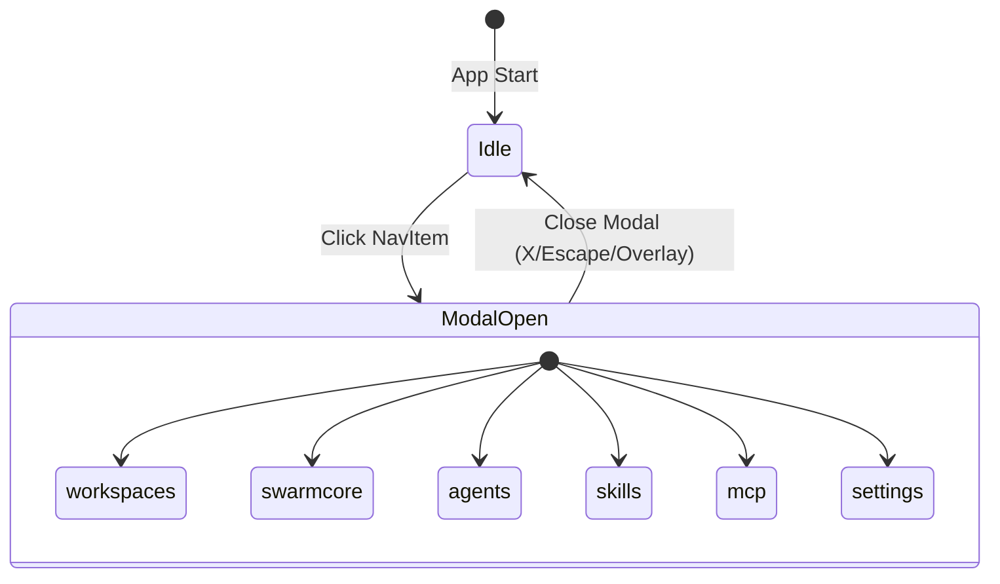

# Design Document: Left Navigation Redesign

## Overview

This design document outlines the technical implementation for redesigning the left navigation sidebar in the SwarmAI desktop application. The redesign introduces a 5-item navigation structure where each item opens a full-screen modal overlay, and enlarges existing modals for better information display.

The implementation follows the existing React + TypeScript patterns in the codebase, leveraging the LayoutContext for modal state management and the existing Modal component infrastructure.

## Architecture

### Component Hierarchy

```
ThreeColumnLayout
├── TopBar
├── LeftSidebar
│   ├── SwarmAILogo
│   ├── NavIconButton (Workspaces)
│   ├── NavIconButton (SwarmCore)
│   ├── NavIconButton (Agents)
│   ├── NavIconButton (Skills)
│   ├── NavIconButton (MCP Servers)
│   ├── NavIconButton (Settings)
│   └── GitHubIcon
├── WorkspaceExplorer
├── MainChatPanel
└── Modal Overlays
    ├── WorkspacesModal (new)
    ├── SwarmCoreModal (new)
    ├── AgentsModal (enlarged)
    ├── SkillsModal (enlarged)
    ├── MCPServersModal (enlarged)
    └── SettingsModal (enlarged)
```

### State Flow



## Components and Interfaces

### LayoutContext Updates

The LayoutContext needs to be extended to support the new modal types:

```typescript
// Updated ModalType union
export type ModalType = 
  | 'workspaces'   // NEW
  | 'swarmcore'    // NEW
  | 'skills' 
  | 'mcp' 
  | 'agents' 
  | 'settings' 
  | 'file-editor';
```

### Modal Component Enhancement

The base Modal component needs a new 'fullscreen' size option:

```typescript
interface ModalProps {
  isOpen: boolean;
  onClose: () => void;
  title: string;
  children: React.ReactNode;
  size?: 'sm' | 'md' | 'lg' | 'xl' | '2xl' | '3xl' | 'fullscreen';
}

const sizeClasses = {
  sm: 'max-w-sm',
  md: 'max-w-md',
  lg: 'max-w-lg',
  xl: 'max-w-xl',
  '2xl': 'max-w-2xl',
  '3xl': 'max-w-3xl',
  fullscreen: 'w-[95vw] h-[90vh] max-w-none',
};
```

### Navigation Items Configuration

```typescript
const navItems: { icon: string; label: string; modalType: ModalType }[] = [
  { icon: 'workspaces', label: 'Workspaces', modalType: 'workspaces' },
  { icon: 'grid_view', label: 'SwarmCore', modalType: 'swarmcore' },
  { icon: 'smart_toy', label: 'Agents', modalType: 'agents' },
  { icon: 'auto_awesome', label: 'Skills', modalType: 'skills' },
  { icon: 'hub', label: 'MCP Servers', modalType: 'mcp' },
];
```

### WorkspacesModal Component

```typescript
interface WorkspacesModalProps {
  isOpen: boolean;
  onClose: () => void;
}

function WorkspacesModal({ isOpen, onClose }: WorkspacesModalProps) {
  return (
    <Modal isOpen={isOpen} onClose={onClose} title="Workspaces" size="fullscreen">
      <div className="h-full overflow-y-auto -m-6">
        <WorkspacesPage />
      </div>
    </Modal>
  );
}
```

### SwarmCoreModal Component

```typescript
interface SwarmCoreModalProps {
  isOpen: boolean;
  onClose: () => void;
}

function SwarmCoreModal({ isOpen, onClose }: SwarmCoreModalProps) {
  return (
    <Modal isOpen={isOpen} onClose={onClose} title="SwarmCore" size="fullscreen">
      <div className="h-full overflow-y-auto -m-6">
        <SwarmCorePage />
      </div>
    </Modal>
  );
}
```

## Data Models

### ModalType Enumeration

| Value | Description | Icon | Modal Component |
|-------|-------------|------|-----------------|
| `workspaces` | Workspace management | `workspaces` | WorkspacesModal |
| `swarmcore` | Dashboard/overview | `grid_view` | SwarmCoreModal |
| `agents` | Agent management | `smart_toy` | AgentsModal |
| `skills` | Skills management | `auto_awesome` | SkillsModal |
| `mcp` | MCP server config | `hub` | MCPServersModal |
| `settings` | App settings | `settings` | SettingsModal |
| `file-editor` | File editing | N/A | FileEditorModal |

### Navigation Item Structure

```typescript
interface NavItem {
  icon: string;        // Material Symbols icon name
  label: string;       // Tooltip/accessibility label
  modalType: ModalType; // Modal to open on click
}
```

### Modal Size Configuration

| Size | CSS Class | Use Case |
|------|-----------|----------|
| `sm` | `max-w-sm` | Confirmation dialogs |
| `md` | `max-w-md` | Simple forms |
| `lg` | `max-w-lg` | Standard forms |
| `xl` | `max-w-xl` | Complex forms |
| `2xl` | `max-w-2xl` | Data tables |
| `3xl` | `max-w-3xl` | Large content |
| `fullscreen` | `w-[95vw] h-[90vh]` | Full page content |


## Correctness Properties

*A property is a characteristic or behavior that should hold true across all valid executions of a system—essentially, a formal statement about what the system should do. Properties serve as the bridge between human-readable specifications and machine-verifiable correctness guarantees.*

Based on the prework analysis, the following properties have been consolidated to eliminate redundancy:

### Property 1: Navigation Item Order Consistency

*For any* render of the LeftSidebar component, the navigation items SHALL appear in exactly this order: Workspaces, SwarmCore, Agents, Skills, MCP Servers, with no items missing or duplicated.

**Validates: Requirements 1.1**

### Property 2: Navigation Click Opens Corresponding Modal

*For any* navigation item in the navItems array, clicking that item SHALL result in the activeModal state being set to that item's modalType value.

**Validates: Requirements 2.3, 4.1, 5.1**

### Property 3: Close Button Closes Any Modal

*For any* open modal (where activeModal is not null), clicking the modal's close button SHALL result in activeModal being set to null.

**Validates: Requirements 4.3, 5.3**

### Property 4: Escape Key Closes Any Modal

*For any* open modal (where activeModal is not null), pressing the Escape key SHALL result in activeModal being set to null.

**Validates: Requirements 4.4, 5.4**

### Property 5: Active State Reflects Open Modal

*For any* navigation item, that item SHALL display the active visual state if and only if activeModal equals that item's modalType. When activeModal is null, no navigation item SHALL display the active state.

**Validates: Requirements 8.1, 8.4**

## Error Handling

### Modal State Errors

| Error Scenario | Handling Strategy |
|----------------|-------------------|
| Invalid modalType passed to openModal | TypeScript type checking prevents invalid values at compile time |
| Modal content fails to render | React error boundary catches and displays fallback UI |
| Escape key handler fails | Wrapped in try-catch, logs error, modal remains open |

### Component Loading Errors

| Error Scenario | Handling Strategy |
|----------------|-------------------|
| WorkspacesPage fails to load | Modal displays error state with retry option |
| SwarmCorePage fails to load | Modal displays error state with retry option |
| Icon font fails to load | Fallback to text labels |

### State Synchronization

- If activeModal state becomes inconsistent with UI, the LayoutContext will be the source of truth
- Navigation items derive their active state from activeModal, ensuring consistency

## Testing Strategy

### Dual Testing Approach

This feature requires both unit tests and property-based tests for comprehensive coverage:

- **Unit tests**: Verify specific examples, edge cases, icon configurations, and CSS class applications
- **Property tests**: Verify universal properties across all navigation items and modal states

### Property-Based Testing Configuration

- **Library**: fast-check (already used in the project)
- **Minimum iterations**: 100 per property test
- **Tag format**: `Feature: left-navigation-redesign, Property {number}: {property_text}`

### Unit Test Coverage

| Component | Test Cases |
|-----------|------------|
| Modal | Fullscreen size applies correct CSS classes |
| Modal | Fullscreen modal is centered |
| Modal | Header contains title and close button |
| LeftSidebar | Correct icons for each nav item |
| LeftSidebar | GitHub link has correct href |
| LeftSidebar | Settings button present in bottom section |
| WorkspacesModal | Renders WorkspacesPage content |
| SwarmCoreModal | Renders SwarmCorePage content |
| AgentsModal | Uses fullscreen size |
| SkillsModal | Uses fullscreen size |
| MCPServersModal | Uses fullscreen size |
| SettingsModal | Uses fullscreen size |

### Property Test Coverage

| Property | Test Description |
|----------|------------------|
| Property 1 | Generate random renders, verify nav item order is always correct |
| Property 2 | For all nav items, simulate click, verify activeModal matches modalType |
| Property 3 | For all modal types, open modal, click close, verify activeModal is null |
| Property 4 | For all modal types, open modal, press Escape, verify activeModal is null |
| Property 5 | For all combinations of (navItem, activeModal), verify active state is correct |

### Integration Test Scenarios

1. Full navigation flow: Click each nav item → verify modal opens → close modal → verify return to main view
2. Keyboard navigation: Tab through nav items → Enter to open → Escape to close
3. Modal content interaction: Open modal → interact with page content → close modal → verify state preserved
