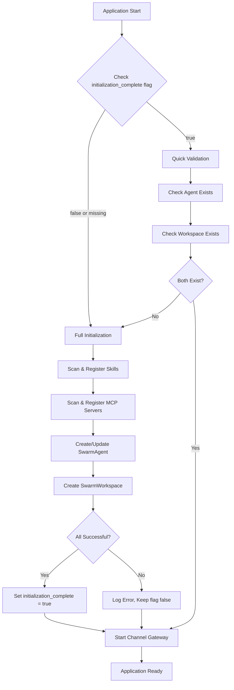

# Design Document: Fast Startup Optimization

## Overview

This design implements a two-phase initialization strategy for SwarmAI that dramatically reduces startup time for returning users. The core insight is that full initialization (scanning directories, registering skills/MCPs, creating default resources) only needs to happen once. Subsequent startups can simply verify that the required resources exist in the database.

The implementation adds an `initialization_complete` flag to the `app_settings` table and modifies the startup flow to check this flag before deciding whether to run full or quick initialization.

### Key Design Decisions

1. **Flag Storage**: Use existing `app_settings` table rather than a separate table to minimize schema changes
2. **Atomic Initialization**: Set the flag only after ALL initialization steps complete successfully
3. **Graceful Fallback**: If quick validation detects missing resources, automatically trigger full initialization
4. **Reset Capability**: Provide an API endpoint to clear the flag and re-run initialization

## Architecture



### Startup Flow Comparison

| Phase | Current Behavior | Optimized Behavior |
|-------|-----------------|-------------------|
| First Run | Full init (~5-10s) | Full init (~5-10s) |
| Subsequent | Full init (~5-10s) | Quick validation (<2s) |

## Components and Interfaces

### 1. InitializationManager

New module responsible for coordinating initialization logic.

**Location**: `backend/core/initialization_manager.py`

```python
class InitializationManager:
    """Manages application initialization state and flow."""
    
    async def get_initialization_status(self) -> dict:
        """Get current initialization state.
        
        Returns:
            dict with keys:
                - initialization_complete: bool
                - mode: 'first_run' | 'quick_validation' | 'reset'
        """
        pass
    
    async def is_initialization_complete(self) -> bool:
        """Check if first-time initialization has been completed."""
        pass
    
    async def set_initialization_complete(self, complete: bool) -> None:
        """Set the initialization complete flag."""
        pass
    
    async def run_full_initialization(self) -> bool:
        """Run full initialization (skills, MCPs, agent, workspace).
        
        Returns:
            True if all steps succeeded, False otherwise
        """
        pass
    
    async def run_quick_validation(self) -> bool:
        """Run quick validation to check if resources exist.
        
        Returns:
            True if all required resources exist, False otherwise
        """
        pass
    
    async def reset_to_defaults(self) -> dict:
        """Reset initialization state and re-run full initialization.
        
        Returns:
            dict with status and any error details
        """
        pass
```

### 2. Modified Startup Flow (main.py)

The lifespan handler will be updated to use InitializationManager:

```python
@asynccontextmanager
async def lifespan(app: FastAPI):
    # Initialize database
    await initialize_database()
    
    # Check initialization state and run appropriate flow
    init_manager = InitializationManager()
    
    if await init_manager.is_initialization_complete():
        # Quick validation path
        if not await init_manager.run_quick_validation():
            # Resources missing, fall back to full init
            await init_manager.run_full_initialization()
    else:
        # First-time initialization
        await init_manager.run_full_initialization()
    
    # Start channel gateway
    await channel_gateway.startup()
    
    yield
    
    # Shutdown
    await channel_gateway.shutdown()
    await agent_manager.disconnect_all()
```

### 3. Reset API Endpoint

New endpoint in `backend/routers/system.py`:

```python
@router.post("/reset-to-defaults")
async def reset_to_defaults() -> dict:
    """Reset application to default state and re-run initialization.
    
    This clears the initialization flag and triggers full initialization,
    useful for recovering from configuration issues.
    """
    pass
```

### 4. Enhanced System Status Response

Updated status response to include initialization mode:

```python
class SystemStatusResponse(BaseModel):
    database: DatabaseStatus
    agent: AgentStatus
    channel_gateway: ChannelGatewayStatus
    swarm_workspace: SwarmWorkspaceStatus
    initialized: bool
    initialization_mode: str  # 'first_run', 'quick_validation', 'reset'
    initialization_complete: bool  # The persistent flag value
    timestamp: str
```

## Data Models

### Database Schema Change

Add `initialization_complete` column to `app_settings` table:

```sql
-- Migration: Add initialization_complete column to app_settings table
ALTER TABLE app_settings ADD COLUMN initialization_complete INTEGER DEFAULT 0;
```

### App Settings Record

The `app_settings` table stores a single row with application-wide settings:

```python
{
    "id": "default",
    "anthropic_api_key": "...",
    "anthropic_base_url": "...",
    "use_bedrock": 0,
    "aws_region": "us-east-1",
    "available_models": "[]",
    "default_model": "claude-sonnet-4-5-20250929",
    "initialization_complete": 0,  # NEW: 0 = false, 1 = true
    "created_at": "...",
    "updated_at": "..."
}
```

### Initialization Status Response

```python
class InitializationStatus(BaseModel):
    """Initialization state information."""
    initialization_complete: bool
    mode: str  # 'first_run' | 'quick_validation' | 'reset'
    last_full_init: Optional[str]  # ISO timestamp of last full init
```

## Correctness Properties

*A property is a characteristic or behavior that should hold true across all valid executions of a system—essentially, a formal statement about what the system should do. Properties serve as the bridge between human-readable specifications and machine-verifiable correctness guarantees.*

### Property 1: Flag Persistence Round-Trip

*For any* boolean value written to the initialization_complete flag, reading the flag back from the database after a simulated restart (re-initialization of the database connection) SHALL return the same boolean value.

**Validates: Requirements 1.1, 1.3, 1.4**

### Property 2: Full Initialization Creates All Resources

*For any* fresh database state (no existing agent or workspace), running full initialization SHALL result in:
- A default agent existing in the agents table with is_system_agent=true
- System skills registered in the skills table with is_system=true
- System MCP servers registered in the mcp_servers table with is_system=true
- A default workspace existing in the swarm_workspaces table with is_default=true

**Validates: Requirements 2.2, 2.3, 2.4, 2.5**

### Property 3: Initialization Mode Selection

*For any* initialization_complete flag value:
- If flag is false → full initialization runs
- If flag is true → quick validation runs (not full initialization)

**Validates: Requirements 2.1, 3.1**

### Property 4: Quick Validation Resource Checks

*For any* database state where initialization_complete is true:
- If default agent exists AND default workspace exists → quick validation returns true
- If default agent is missing OR default workspace is missing → quick validation returns false

**Validates: Requirements 3.2, 3.3, 3.4**

### Property 5: Missing Resources Trigger Full Initialization

*For any* database state where initialization_complete is true but required resources are missing (agent or workspace deleted), the initialization flow SHALL trigger full initialization to restore the missing resources.

**Validates: Requirements 3.6, 6.4**

### Property 6: Reset Clears Flag and Triggers Full Init

*For any* database state where initialization_complete is true, calling reset_to_defaults SHALL:
- Set initialization_complete to false
- Trigger full initialization
- Result in initialization_complete being true after completion (if successful)

**Validates: Requirements 4.2, 4.3**

### Property 7: Failure Preserves Incomplete State

*For any* full initialization that fails (due to simulated error in agent or workspace creation), the initialization_complete flag SHALL remain false.

**Validates: Requirements 2.6, 6.5**

### Property 8: Database Retry on Unavailability

*For any* transient database unavailability during initialization, the Initialization_Manager SHALL retry the operation with exponential backoff before failing.

**Validates: Requirements 6.1**

### Property 9: Status Reflects Initialization State

*For any* successful quick validation, the system status endpoint SHALL report initialized=true and include the correct initialization_mode value.

**Validates: Requirements 5.3**

## Error Handling

### Database Errors

1. **Connection Failure**: Retry with exponential backoff (100ms, 200ms, 400ms, max 3 retries)
2. **Schema Migration Failure**: Log error, abort startup with clear message
3. **Read/Write Failure**: Log error, return failure status

### Initialization Errors

1. **Skill Registration Failure**: Log warning, continue with other skills
2. **MCP Server Registration Failure**: Log warning, continue with other servers
3. **Agent Creation Failure**: Log error, do NOT set initialization_complete
4. **Workspace Creation Failure**: Log error, do NOT set initialization_complete

### Recovery Strategy

```python
async def run_full_initialization(self) -> bool:
    """Run full initialization with error handling."""
    try:
        # Skills - non-critical, log and continue
        try:
            await self._register_default_skills()
        except Exception as e:
            logger.warning(f"Skill registration failed: {e}")
        
        # MCP Servers - non-critical, log and continue
        try:
            await self._register_default_mcp_servers()
        except Exception as e:
            logger.warning(f"MCP registration failed: {e}")
        
        # Agent - critical
        await ensure_default_agent()
        
        # Workspace - critical
        await swarm_workspace_manager.ensure_default_workspace(db)
        
        # All critical steps succeeded
        await self.set_initialization_complete(True)
        return True
        
    except Exception as e:
        logger.error(f"Full initialization failed: {e}")
        # Do NOT set initialization_complete
        return False
```

## Testing Strategy

### Unit Tests

Unit tests focus on specific examples and edge cases:

1. **Flag Storage**: Test that flag can be set and retrieved correctly
2. **Fresh Database**: Test that new database has flag=false
3. **Reset Endpoint**: Test API returns correct response format
4. **Status Endpoint**: Test response includes new fields

### Property-Based Tests

Property tests verify universal properties across all inputs. Each property test MUST:
- Run minimum 100 iterations
- Reference the design document property number
- Use tag format: **Feature: fast-startup-optimization, Property {N}: {title}**

**Property Test Configuration (pytest + hypothesis)**:

```python
from hypothesis import given, settings, strategies as st

@settings(max_examples=100)
@given(flag_value=st.booleans())
def test_flag_persistence_round_trip(flag_value: bool):
    """Feature: fast-startup-optimization, Property 1: Flag Persistence Round-Trip"""
    # Set flag, simulate restart, verify flag value preserved
    pass

@settings(max_examples=100)
@given(has_agent=st.booleans(), has_workspace=st.booleans())
def test_quick_validation_resource_checks(has_agent: bool, has_workspace: bool):
    """Feature: fast-startup-optimization, Property 4: Quick Validation Resource Checks"""
    # Setup database state, run quick validation, verify result
    pass
```

### Integration Tests

1. **Full Startup Flow**: Test complete startup with fresh database
2. **Quick Startup Flow**: Test startup with initialized database
3. **Reset Flow**: Test reset followed by startup
4. **Failure Recovery**: Test startup after simulated failures

