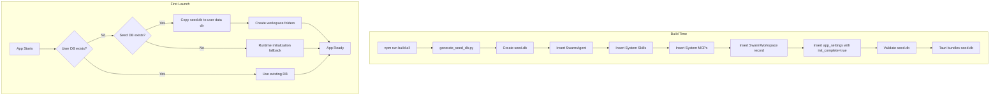

# Design Document: Pre-seeded Database

## Overview

This design implements build-time database generation for SwarmAI, eliminating first-launch initialization delays by bundling a pre-populated SQLite database with the application. Instead of creating the default SwarmAgent, system skills, and MCP servers at runtime, these records are pre-created during the build process and copied to the user's data directory on first launch.

### Key Design Decisions

1. **Build Script Location**: `backend/scripts/generate_seed_db.py` - keeps database logic with backend code
2. **Seed Database Location**: `desktop/resources/seed.db` - alongside other bundled resources
3. **Reuse Existing Code**: The build script imports and uses the same `SQLiteDatabase` class and schema as runtime
4. **Workspace in App Data Dir**: The SwarmWorkspace uses `{app_data_dir}/swarm-workspaces/` path (expanded at runtime), keeping all SwarmAI data together. Database record is pre-seeded, filesystem folders created at runtime.
5. **Fallback Strategy**: If seed.db is missing, fall back to runtime initialization for resilience

## Architecture



### File Locations

| File | Purpose |
|------|---------|
| `backend/scripts/generate_seed_db.py` | Build script that generates seed database |
| `desktop/resources/seed.db` | Bundled seed database |
| `<app_data_dir>/data.db` | User's runtime database |
| `<app_data_dir>/swarm-workspaces/` | SwarmWorkspace folders (created at runtime) |
| `<app_data_dir>/workspaces/` | Per-agent isolated workspaces (security) |

## Components and Interfaces

### 1. Seed Database Generator Script

**Location**: `backend/scripts/generate_seed_db.py`

```python
"""Generate pre-seeded database for SwarmAI distribution."""
import asyncio
import sys
from pathlib import Path

# Add backend to path for imports
sys.path.insert(0, str(Path(__file__).parent.parent))

from database.sqlite import SQLiteDatabase
from datetime import datetime
import json
import yaml


class SeedDatabaseGenerator:
    """Generates a pre-seeded SQLite database for distribution."""
    
    def __init__(self, output_path: Path):
        self.output_path = output_path
        self.db = SQLiteDatabase(db_path=output_path)
    
    async def generate(self) -> bool:
        """Generate the seed database with all default resources.
        
        Returns:
            True if generation and validation succeeded
        """
        pass
    
    async def _insert_default_agent(self) -> None:
        """Insert the SwarmAgent record."""
        pass
    
    async def _insert_system_skills(self) -> list[str]:
        """Insert system skill records from default-skills/*.md.
        
        Returns:
            List of inserted skill IDs
        """
        pass
    
    async def _insert_system_mcps(self) -> list[str]:
        """Insert system MCP server records from default-mcp-servers.json.
        
        Returns:
            List of inserted MCP server IDs
        """
        pass
    
    async def _insert_default_workspace(self) -> None:
        """Insert the SwarmWorkspace database record."""
        pass
    
    async def _insert_app_settings(self) -> None:
        """Insert app_settings with initialization_complete=true."""
        pass
    
    async def _validate(self) -> bool:
        """Validate that all required records exist.
        
        Returns:
            True if validation passes
        """
        pass


async def main():
    """Entry point for seed database generation."""
    pass


if __name__ == "__main__":
    asyncio.run(main())
```

### 2. Modified Application Startup

**Location**: `backend/main.py` (lifespan handler)

The startup flow is modified to check for and copy the seed database:

```python
async def _ensure_database_initialized() -> None:
    """Ensure the user database exists, copying from seed if needed."""
    user_db_path = get_app_data_dir() / "data.db"
    
    if user_db_path.exists():
        # User already has a database, use it
        return
    
    # Try to copy seed database
    seed_db_path = _get_seed_database_path()
    if seed_db_path and seed_db_path.exists():
        import shutil
        shutil.copy2(seed_db_path, user_db_path)
        logger.info(f"Copied seed database to {user_db_path}")
    else:
        logger.warning("Seed database not found, will use runtime initialization")


def _get_seed_database_path() -> Path | None:
    """Get the path to the bundled seed database.
    
    Returns:
        Path to seed.db or None if not found
    """
    # Development: desktop/resources/seed.db
    # Production: resources/seed.db (relative to backend)
    pass
```

### 3. Workspace Filesystem Initialization

**Location**: `backend/core/swarm_workspace_manager.py`

Add a method to ensure workspace folders exist:

```python
async def ensure_workspace_folders_exist(self, db) -> None:
    """Ensure the default workspace filesystem folders exist.
    
    Called after database initialization to create folders for
    pre-seeded workspace records that don't have filesystem folders yet.
    """
    default_workspace = await db.swarm_workspaces.get_default()
    if not default_workspace:
        return
    
    workspace_path = self.expand_path(default_workspace["file_path"])
    if not Path(workspace_path).exists():
        await self.create_folder_structure(default_workspace["file_path"])
        await self.create_context_files(
            default_workspace["file_path"],
            default_workspace["name"]
        )
```

### 4. Build Integration

**Location**: `desktop/package.json`

Add a pre-build script:

```json
{
  "scripts": {
    "generate-seed-db": "cd ../backend && python scripts/generate_seed_db.py",
    "prebuild": "npm run generate-seed-db",
    "build:all": "npm run prebuild && npm run build && npm run tauri build"
  }
}
```

**Location**: `desktop/src-tauri/tauri.conf.json`

Ensure seed.db is bundled:

```json
{
  "bundle": {
    "resources": [
      "resources/*"
    ]
  }
}
```

## Data Models

### Seed Database Contents

The seed database contains the following pre-populated records:

#### agents table
```python
{
    "id": "default",
    "name": "SwarmAgent",
    "description": "SwarmAI — Your AI Team, 24/7",
    "model": "claude-opus-4-5-20250514",
    "permission_mode": "bypassPermissions",
    "max_turns": 100,
    "system_prompt": "<loaded from SWARMAI.md>",
    "is_default": True,
    "is_system_agent": True,
    "skill_ids": ["default-document", "default-research"],
    "mcp_ids": ["default-filesystem"],
    "enable_bash_tool": True,
    "enable_file_tools": True,
    "enable_web_tools": True,
    "global_user_mode": True,
    "enable_human_approval": True,
    "sandbox_enabled": True,
    "allow_all_skills": True,
    "status": "active",
    "created_at": "<build_timestamp>",
    "updated_at": "<build_timestamp>"
}
```

#### skills table
```python
[
    {
        "id": "default-document",
        "name": "DOCUMENT",
        "description": "<from YAML frontmatter>",
        "folder_name": "document",
        "local_path": "<runtime path>",
        "source_type": "system",
        "is_system": True,
        "version": "1.0.0",
        "created_at": "<build_timestamp>",
        "updated_at": "<build_timestamp>"
    },
    {
        "id": "default-research",
        "name": "RESEARCH",
        # ... similar structure
    }
]
```

#### mcp_servers table
```python
{
    "id": "default-filesystem",
    "name": "Filesystem",
    "description": "File system operations for reading and writing files",
    "connection_type": "stdio",
    "config": {"command": "npx", "args": ["-y", "@modelcontextprotocol/server-filesystem", "/"]},
    "is_system": True,
    "is_active": True,
    "created_at": "<build_timestamp>",
    "updated_at": "<build_timestamp>"
}
```

#### swarm_workspaces table
```python
{
    "id": "<uuid>",
    "name": "SwarmWS-Default",
    "file_path": "{app_data_dir}/swarm-workspaces/SwarmWS",  # Expanded at runtime
    "context": "Default SwarmAI workspace for general tasks and projects.",
    "icon": "🏠",
    "is_default": True,
    "created_at": "<build_timestamp>",
    "updated_at": "<build_timestamp>"
}
```

**Note**: The `file_path` uses `{app_data_dir}` placeholder which is expanded at runtime to `~/.swarm-ai/swarm-workspaces/SwarmWS` on all platforms.

#### app_settings table
```python
{
    "id": "default",
    "anthropic_api_key": "",
    "use_bedrock": 0,
    "aws_region": "us-east-1",
    "available_models": "[]",
    "default_model": "claude-sonnet-4-5-20250929",
    "initialization_complete": 1,  # KEY: Set to true
    "created_at": "<build_timestamp>",
    "updated_at": "<build_timestamp>"
}
```


## Correctness Properties

*A property is a characteristic or behavior that should hold true across all valid executions of a system—essentially, a formal statement about what the system should do. Properties serve as the bridge between human-readable specifications and machine-verifiable correctness guarantees.*

### Property 1: Schema Consistency

*For any* seed database generated by the build script, the database schema (table names, column names, column types) SHALL be identical to the schema of a freshly initialized runtime database.

**Validates: Requirements 1.2, 7.1, 7.5**

### Property 2: Build Script Idempotency

*For any* set of input files (default-agent.json, default-skills/*.md, default-mcp-servers.json), running the build script twice SHALL produce databases with equivalent records (excluding timestamp fields).

**Validates: Requirements 1.8**

### Property 3: Bundled Database Immutability

*For any* application execution, the bundled seed database file SHALL never be modified; the application SHALL only read from it and copy to the user data directory.

**Validates: Requirements 2.3**

### Property 4: First-Launch Database Copy

*For any* application startup where no user database exists and a seed database is bundled, the application SHALL copy the seed database to the user data directory before proceeding.

**Validates: Requirements 3.1**

### Property 5: Record Preservation After Copy

*For any* seed database copied to the user data directory, all pre-seeded records (SwarmAgent, system skills, system MCPs, SwarmWorkspace, app_settings) SHALL be present and unchanged in the copied database.

**Validates: Requirements 3.2**

### Property 6: Initialization Skip When Complete

*For any* database where initialization_complete is true, the application SHALL NOT execute full initialization (ensure_default_agent with full registration).

**Validates: Requirements 3.3**

### Property 7: Workspace Folder Creation

*For any* SwarmWorkspace record in the database where the filesystem path does not exist, the application SHALL create the folder structure at the specified path.

**Validates: Requirements 4.1, 4.2**

### Property 8: Non-Blocking Folder Creation

*For any* application startup with a pre-seeded database, the application SHALL report ready status before workspace folder creation completes (folder creation is async/non-blocking).

**Validates: Requirements 4.5**

### Property 9: Existing Database Preservation

*For any* application startup where a user database already exists, the application SHALL NOT overwrite or modify the existing database with the seed database.

**Validates: Requirements 5.1, 5.2**

### Property 10: Config-to-Database Mapping

*For any* modification to the input configuration files (default-agent.json, default-skills/*.md, default-mcp-servers.json), regenerating the seed database SHALL reflect those modifications in the corresponding database records.

**Validates: Requirements 7.2, 7.3, 7.4**

## Error Handling

### Build-Time Errors

| Error | Handling |
|-------|----------|
| Missing default-agent.json | Exit with error code 1, log "ERROR: default-agent.json not found" |
| Invalid JSON in config files | Exit with error code 1, log parsing error details |
| Missing default-skills directory | Log warning, continue without skills |
| Database write failure | Exit with error code 1, log SQLite error |
| Validation failure | Exit with error code 1, log which validation check failed |

### Runtime Errors

| Error | Handling |
|-------|----------|
| Seed database missing | Log warning, fall back to runtime initialization |
| Seed database corrupted | Log error, fall back to runtime initialization |
| Copy to user dir fails | Log error, fall back to runtime initialization |
| Workspace folder creation fails | Log warning, continue (non-critical) |
| Permission denied on user dir | Log error, report initialization failure |

### Error Recovery Strategy

```python
async def _ensure_database_initialized() -> None:
    """Ensure database exists with graceful fallback."""
    user_db_path = get_app_data_dir() / "data.db"
    
    if user_db_path.exists():
        logger.info("Using existing user database")
        return
    
    seed_db_path = _get_seed_database_path()
    
    if seed_db_path and seed_db_path.exists():
        try:
            # Attempt to copy seed database
            import shutil
            shutil.copy2(seed_db_path, user_db_path)
            logger.info(f"Copied seed database to {user_db_path}")
            return
        except Exception as e:
            logger.error(f"Failed to copy seed database: {e}")
            # Fall through to runtime initialization
    else:
        logger.warning("Seed database not found")
    
    # Fallback: runtime initialization will create the database
    logger.info("Will use runtime initialization")
```

## Testing Strategy

### Unit Tests

Unit tests focus on specific examples and edge cases:

1. **Build Script Output**: Verify seed.db is created at correct path
2. **Record Validation**: Verify SwarmAgent, skills, MCPs exist with correct values
3. **Validation Failure**: Verify script exits with code 1 when validation fails
4. **Missing Config Files**: Verify appropriate error messages
5. **Copy Behavior**: Verify database is copied, not moved
6. **Fallback Trigger**: Verify runtime init runs when seed.db missing

### Property-Based Tests

Property tests verify universal properties across all inputs. Each property test MUST:
- Run minimum 100 iterations
- Reference the design document property number
- Use tag format: **Feature: pre-seeded-database, Property {N}: {title}**

**Property Test Configuration (pytest + hypothesis)**:

```python
from hypothesis import given, settings, strategies as st
import sqlite3
import tempfile
from pathlib import Path

@settings(max_examples=100)
@given(agent_name=st.text(min_size=1, max_size=50))
def test_config_to_database_mapping(agent_name: str):
    """Feature: pre-seeded-database, Property 10: Config-to-Database Mapping
    
    Modifying default-agent.json should reflect in the generated seed database.
    """
    # Create temp config with modified agent name
    # Run seed generator
    # Verify agent name in database matches config
    pass

@settings(max_examples=100)
@given(run_count=st.integers(min_value=2, max_value=5))
def test_build_script_idempotency(run_count: int):
    """Feature: pre-seeded-database, Property 2: Build Script Idempotency
    
    Running the build script multiple times should produce equivalent databases.
    """
    # Run generator run_count times
    # Compare all resulting databases (excluding timestamps)
    pass

@settings(max_examples=100)
@given(has_user_db=st.booleans(), has_seed_db=st.booleans())
def test_database_initialization_paths(has_user_db: bool, has_seed_db: bool):
    """Feature: pre-seeded-database, Property 4 & 9: First-Launch Copy & Existing DB Preservation
    
    Test all combinations of user DB and seed DB existence.
    """
    # Setup: create/don't create user DB and seed DB
    # Run initialization
    # Verify correct behavior based on combination
    pass
```

### Integration Tests

1. **Full Build Flow**: Run `npm run build:all` and verify seed.db is bundled
2. **First Launch Simulation**: Start app with no user DB, verify copy and workspace creation
3. **Subsequent Launch**: Start app with existing DB, verify no changes
4. **Upgrade Scenario**: Start app with old DB (no init_complete), verify migration runs

### Test Data Generators

```python
# Generator for valid agent configurations
def agent_config_strategy():
    return st.fixed_dictionaries({
        "id": st.just("default"),
        "name": st.text(min_size=1, max_size=50),
        "description": st.text(max_size=200),
        "model": st.sampled_from(["claude-opus-4-5-20250514", "claude-sonnet-4-5-20250929"]),
        "permission_mode": st.sampled_from(["default", "bypassPermissions"]),
        "max_turns": st.integers(min_value=1, max_value=1000),
    })

# Generator for skill file content
def skill_content_strategy():
    return st.fixed_dictionaries({
        "name": st.text(min_size=1, max_size=30),
        "description": st.text(max_size=200),
        "version": st.from_regex(r"[0-9]+\.[0-9]+\.[0-9]+"),
    })
```
