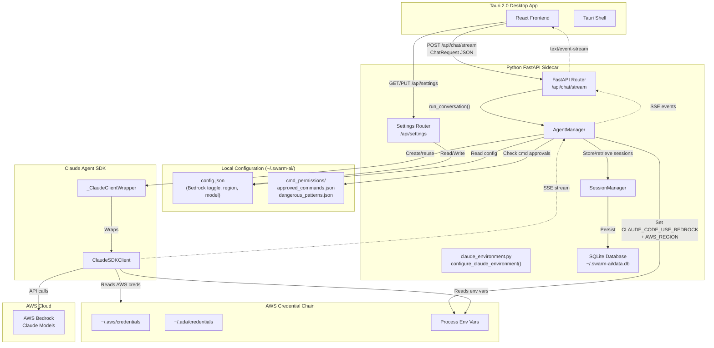
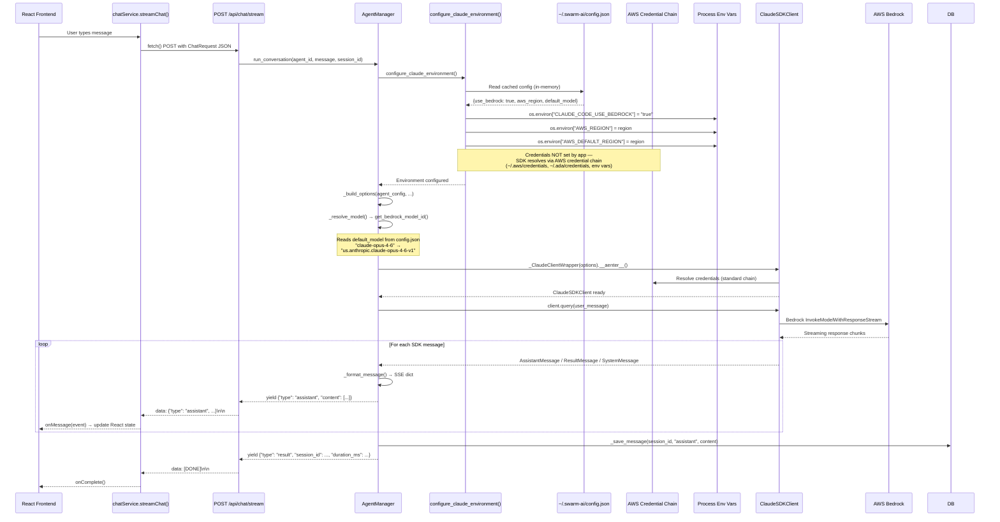
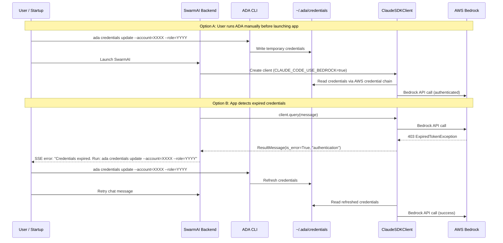
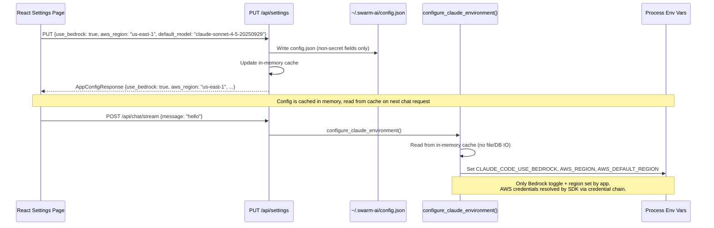
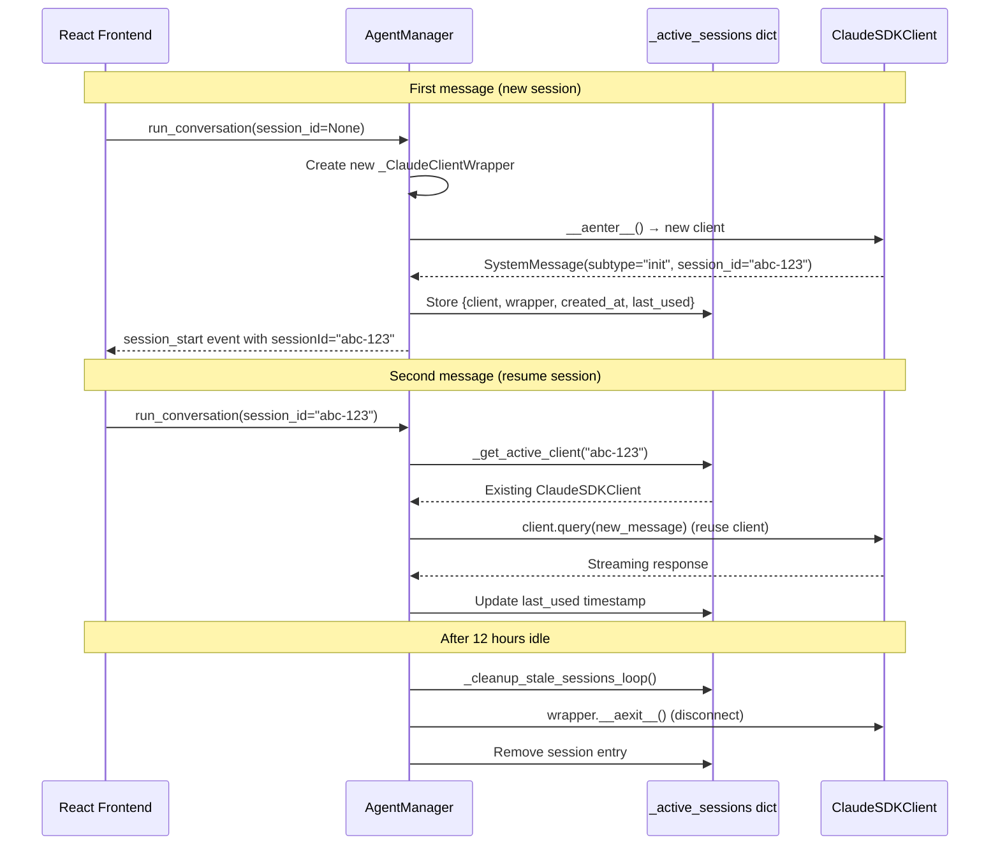
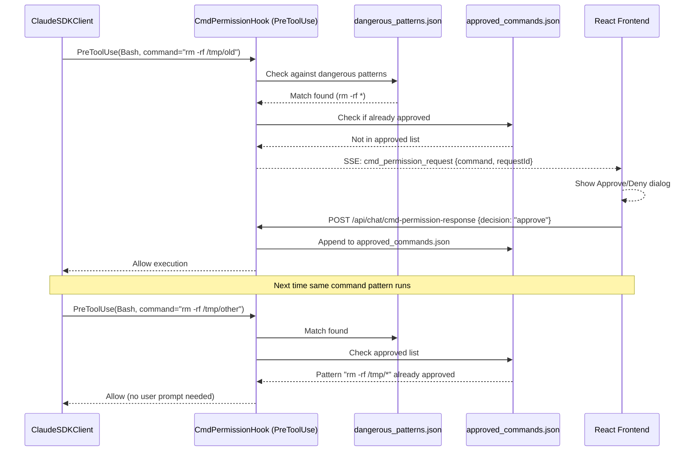
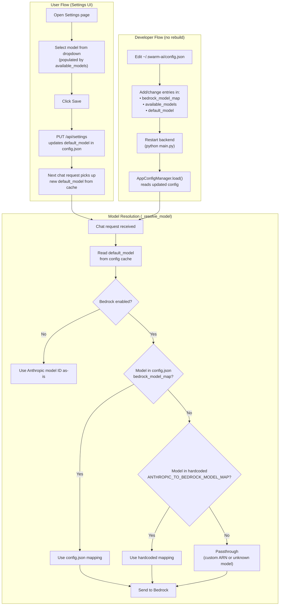

<!-- PE-REVIEWED -->
# Design Document: Bedrock Integration (E2E Architecture)

## Overview

SwarmAI is a desktop application built with Tauri 2.0 (React frontend + Python FastAPI backend sidecar) that uses the Claude Agent SDK to communicate with Claude models via AWS Bedrock. This is a single-user desktop application — many design decisions (filesystem-based config, shared env vars, no API auth) depend on this assumption.

This document captures the end-to-end architecture: how a user message flows from the React UI through the FastAPI backend, gets routed to AWS Bedrock via the Claude Agent SDK, and streams back as SSE events rendered in the frontend.

Key architectural decisions documented here:

- **Credential delegation**: AWS credentials are resolved via the standard AWS credential chain (`~/.aws/credentials`, `~/.ada/credentials`, env vars, instance profiles) rather than stored in the application database. ADA CLI integration provides automatic credential refresh for Amazon internal users.
- **File-based app config**: Non-secret application settings (Bedrock toggle, region, model selection) are stored in `~/.swarm-ai/config.json` and cached in memory, eliminating per-request database reads.
- **Command permission system**: Dangerous bash command approval uses a shared filesystem-based allowlist/blocklist (`~/.swarm-ai/cmd_permissions/`) that persists across sessions and server restarts.
- **Dual authentication**: The system supports two Bedrock auth paths (IAM credentials and Bearer Token) with runtime model ID translation from Anthropic format to Bedrock ARN format.

## Architecture



## Sequence Diagrams

### Main Chat Flow: User Message → Bedrock → SSE Response



### ADA Credential Refresh Flow



### Settings Configuration Flow (Revised)



### Session Reuse Flow (Multi-Turn Conversation)



### Command Permission Flow (Revised)



## Components and Interfaces

### Component 1: App Configuration Manager (`~/.swarm-ai/config.json`)

**Purpose**: File-based storage for non-secret application settings, cached in memory at startup.

**File structure**:
```json
{
  "use_bedrock": true,
  "aws_region": "us-east-1",
  "default_model": "claude-opus-4-6",
  "available_models": [
    "claude-opus-4-6",
    "claude-sonnet-4-6",
    "claude-opus-4-5-20251101",
    "claude-sonnet-4-5-20250929"
  ],
  "anthropic_base_url": null,
  "claude_code_disable_experimental_betas": true
}
```

**Design rationale**: Config changes rarely (only when user visits Settings page). Storing in a JSON file and caching in memory eliminates per-request DB reads. The file is human-editable for advanced users.

**No secrets stored here**: AWS credentials, API keys, and bearer tokens are NOT in this file. They are resolved via the AWS credential chain or Anthropic API key env var.

```python
class AppConfigManager:
    """In-memory cached config backed by ~/.swarm-ai/config.json."""
    _cache: dict | None = None
    _config_path: Path = get_app_data_dir() / "config.json"

    def load(self) -> dict:
        """Load config from file into memory cache. Called once at startup."""
    def get(self, key: str, default=None) -> Any:
        """Read from in-memory cache (zero IO)."""
    def update(self, updates: dict) -> None:
        """Merge updates into cache and write to file."""
    def reload(self) -> None:
        """Force re-read from file (for manual edits)."""
```

### Component 2: AWS Credential Resolution (Delegated)

**Purpose**: AWS credentials are NOT managed by the application. The Claude Agent SDK resolves credentials via the standard AWS credential chain.

**Credential resolution order** (handled by AWS SDK/boto3 internally):
1. Environment variables (`AWS_ACCESS_KEY_ID`, `AWS_SECRET_ACCESS_KEY`, `AWS_SESSION_TOKEN`)
2. Shared credentials file (`~/.aws/credentials`)
3. ADA credentials file (`~/.ada/credentials`)
4. AWS config file (`~/.aws/config` with profiles)
5. Instance metadata (EC2/ECS)

**ADA integration**: For Amazon internal users, ADA CLI provides automatic credential refresh:
```bash
# User runs before launching app (or when credentials expire):
ada credentials update --account=ACCOUNT_ID --role=ROLE_NAME --provider=isengard
# Writes temporary credentials to ~/.ada/credentials
# SDK picks them up automatically via credential chain
```

**What the app sets**: Only `CLAUDE_CODE_USE_BEDROCK=true`, `AWS_REGION`, and `AWS_DEFAULT_REGION` are set by `configure_claude_environment()`. The app never reads, stores, or transmits AWS credentials.

**Bearer Token exception**: For non-IAM auth (e.g., custom identity providers), the app supports `AWS_BEARER_TOKEN_BEDROCK` as an env var. This is the only credential-like value the app may set, and it's read from a secure env var — not stored in config.json or SQLite.

### Component 3: Model ID Mapping (`backend/config.py`)

**Purpose**: Static mapping from Anthropic model IDs to Bedrock cross-region inference profiles.

```python
ANTHROPIC_TO_BEDROCK_MODEL_MAP: dict[str, str] = {
    # Claude 4.6 models (latest)
    "claude-opus-4-6": "us.anthropic.claude-opus-4-6-v1",
    "claude-sonnet-4-6": "us.anthropic.claude-sonnet-4-6",
    # Claude 4.5 models
    "claude-opus-4-5-20251101": "us.anthropic.claude-opus-4-5-20251101-v1:0",
    "claude-sonnet-4-5-20250929": "us.anthropic.claude-sonnet-4-5-20250929-v1:0",
}

def get_bedrock_model_id(anthropic_model_id: str) -> str:
    """Passthrough if no mapping exists (allows custom model ARNs)."""
    return ANTHROPIC_TO_BEDROCK_MODEL_MAP.get(anthropic_model_id, anthropic_model_id)
```

**Configurable override**: The `bedrock_model_map` field in `config.json` overrides the hardcoded map at runtime. To add or change a model mapping during development, edit `~/.swarm-ai/config.json` and restart the backend — no rebuild needed. The hardcoded map in `config.py` serves as the fallback when the key is missing from the JSON. Custom Bedrock ARNs can also be passed directly as model IDs (passthrough behavior).

#### Model Resolution Flow



### Component 4: Claude Environment Setup (`backend/core/claude_environment.py`)

**Purpose**: Reads app config from in-memory cache and sets the minimal process-level environment variables consumed by the Claude Agent SDK. Does NOT handle AWS credentials.

```python
def configure_claude_environment(config: AppConfigManager) -> None:
    """Configure env vars for Claude SDK. Called before every agent execution.
    Reads from in-memory config cache (zero IO). Only sets Bedrock toggle + region."""

class _ClaudeClientWrapper:
    """Async context-manager around ClaudeSDKClient.
    Suppresses anyio cancel-scope cleanup errors in cross-task usage."""
    async def __aenter__(self) -> ClaudeSDKClient: ...
    async def __aexit__(self, exc_type, exc_val, exc_tb) -> bool: ...

class AuthenticationNotConfiguredError(Exception):
    """Raised when neither API key nor Bedrock is configured."""
```

**Env vars set by this function**:
- `CLAUDE_CODE_USE_BEDROCK` — "true" when Bedrock is enabled, removed when disabled
- `AWS_REGION` / `AWS_DEFAULT_REGION` — from config.json
- `ANTHROPIC_API_KEY` — from env var (NOT from config file or DB)
- `ANTHROPIC_BASE_URL` — from config.json (optional custom endpoint)
- `CLAUDE_CODE_DISABLE_EXPERIMENTAL_BETAS` — from config.json

**Env vars NOT set by this function** (delegated to AWS credential chain):
- `AWS_ACCESS_KEY_ID`, `AWS_SECRET_ACCESS_KEY`, `AWS_SESSION_TOKEN` — resolved by SDK
- `AWS_BEARER_TOKEN_BEDROCK` — set by user via env var if needed

**Concurrency note**: This function mutates `os.environ` which is shared across async tasks. For a single-user desktop app with shared credentials, this is acceptable. If multi-credential support is needed in the future, wrap in `asyncio.Lock` or pass credentials directly to the SDK constructor.

### Component 4b: Credential Validator (`backend/core/credential_validator.py`)

**Purpose**: Pre-flight AWS credential validation with caching. Catches expired/invalid credentials before the SDK call, providing immediate clear error messages instead of relying on fragile string pattern matching against SDK error text.

```python
class CredentialValidator:
    """Cached STS-based credential validation.
    
    Calls sts:GetCallerIdentity to verify AWS credentials are valid.
    Results are cached for 5 minutes to avoid adding latency to every
    chat request. Cache is invalidated on validation failure so the
    next request re-checks immediately.
    """
    CACHE_TTL = 300  # 5 minutes

    _last_check: float = 0
    _last_result: bool = False
    _last_identity: dict | None = None  # {Account, Arn, UserId}

    async def is_valid(self, region: str) -> bool:
        """Check if AWS credentials are valid (cached).
        Returns True if credentials resolve and STS call succeeds."""

    async def get_identity(self, region: str) -> dict | None:
        """Return the STS caller identity if valid, None otherwise."""

    def invalidate(self) -> None:
        """Force re-check on next call (e.g., after auth error from SDK)."""
```

**Integration point**: Called in `_execute_on_session()` when Bedrock is enabled, before creating the SDK client:

```python
# In _execute_on_session, after configure_claude_environment():
if config.get("use_bedrock"):
    if not await credential_validator.is_valid(config.get("aws_region")):
        yield {
            "type": "error",
            "code": "CREDENTIALS_EXPIRED",
            "error": "AWS credentials are missing or expired.",
            "suggested_action": "Run: ada credentials update --account=XXXX --role=YYYY",
        }
        return
```

**Design rationale**:
- Pre-flight check catches 90% of credential issues with a clear, immediate error message
- 5-minute cache avoids adding STS latency to every chat request (~200ms uncached)
- Cache invalidated on failure so next request re-checks immediately
- Falls back to expanded `_AUTH_PATTERNS` matching for edge cases (credentials expire mid-conversation, cache stale)

### Component 5: Command Permission Manager (`~/.swarm-ai/cmd_permissions/`)

**Purpose**: Filesystem-based command approval system for dangerous bash commands. Shared across all sessions, persists across server restarts.

**Renamed from**: `PermissionManager` → `CmdPermissionManager` to avoid ambiguity with file access, API auth, or user role permissions.

**File structure**:
```
~/.swarm-ai/cmd_permissions/
├── approved_commands.json    # User-approved command patterns
└── dangerous_patterns.json   # Customizable dangerous command patterns
```

**approved_commands.json**:
```json
{
  "commands": [
    {"pattern": "docker build *", "approved_at": "2026-02-27T10:00:00Z", "approved_by": "user"},
    {"pattern": "npm install", "approved_at": "2026-02-27T10:05:00Z", "approved_by": "user"}
  ]
}
```

**dangerous_patterns.json**:
```json
{
  "patterns": [
    "rm -rf *",
    "sudo *",
    "chmod 777 *",
    "kill -9 *",
    "mkfs.*",
    "dd if=*"
  ]
}
```

```python
class CmdPermissionManager:
    """Filesystem-based command approval with in-memory cache."""
    _approved: list[dict] | None = None
    _dangerous: list[str] | None = None

    def load(self) -> None:
        """Load both files into memory. Called at startup."""
    def is_dangerous(self, command: str) -> bool:
        """Check command against dangerous_patterns.json (glob matching)."""
    def is_approved(self, command: str) -> bool:
        """Check command against approved_commands.json (glob matching)."""
    def approve(self, command_pattern: str) -> None:
        """Append to approved_commands.json and update cache."""
    def reload(self) -> None:
        """Force re-read from files (for manual edits)."""
```

**Key design decisions**:
- Glob matching (not exact string match) so `rm -rf /tmp/old` matches pattern `rm -rf /tmp/*`
- All sessions share the same approved list — approve once, applies everywhere
- Files are human-editable (user can manually add/remove patterns)
- Loaded into memory at startup, written on approval (append-only for approved_commands.json)
- Eliminates the per-session `asyncio.Queue` + forwarder busy-loop pattern

**SSE event rename**: `permission_request` → `cmd_permission_request`

**API endpoint rename**:
- `POST /api/chat/permission-response` → `POST /api/chat/cmd-permission-response`
- `POST /api/chat/permission-continue` → `POST /api/chat/cmd-permission-continue`

### Component 6: Agent Manager (`backend/core/agent_manager.py`)

**Purpose**: Core orchestration engine managing agent lifecycle, session reuse, option building, and response streaming.

```python
class AgentManager:
    SESSION_TTL_SECONDS = 2 * 60 * 60  # 2 hours

    _clients: dict[str, ClaudeSDKClient]
    _active_sessions: dict[str, dict]  # {client, wrapper, created_at, last_used}

    async def run_conversation(...) -> AsyncIterator[dict]: ...
    async def continue_with_answer(...) -> AsyncIterator[dict]: ...
    async def continue_with_cmd_permission(...) -> AsyncIterator[dict]: ...

    def _resolve_model(self, agent_config: dict) -> str | None: ...
    def _resolve_allowed_tools(self, agent_config: dict) -> list[str]: ...
    async def _build_options(...) -> ClaudeAgentOptions: ...
    async def _execute_on_session(...) -> AsyncIterator[dict]: ...
    async def _run_query_on_client(...) -> AsyncIterator[dict]: ...
    async def _format_message(self, message, agent_config, session_id) -> dict | None: ...
```

**Responsibilities**:
- Build `ClaudeAgentOptions` (model, tools, MCP servers, hooks, system prompt, sandbox)
- Manage long-lived client pool with 2-hour TTL and background cleanup
- Route model IDs through `get_bedrock_model_id()` when Bedrock is active
- Stream SDK responses as SSE events
- Persist messages to SQLite via `_save_message()`
- Handle session creation, resumption, and fallback to fresh sessions
- Delegate command permission checks to `CmdPermissionManager`

### Component 7: Chat API Router (`backend/routers/chat.py`)

**Purpose**: SSE streaming endpoints for agent chat, session management, and command permission handling.

```python
# Endpoints mounted at /api/chat
POST /stream                    # Main chat SSE endpoint
POST /answer-question           # Continue after AskUserQuestion
POST /cmd-permission-continue   # Continue after command permission decision (renamed)
POST /cmd-permission-response   # Non-streaming command permission decision (renamed)
GET  /sessions                  # List sessions (optional agent_id filter)
GET  /sessions/{id}             # Get specific session
GET  /sessions/{id}/messages    # Get session messages
POST /stop/{session_id}         # Interrupt running session
DELETE /sessions/{id}           # Delete session and messages
```

### Component 8: Settings Router (`backend/routers/settings.py`)

**Purpose**: CRUD for app configuration (Bedrock toggle, region, model selection). Reads/writes `~/.swarm-ai/config.json` instead of SQLite.

```python
# Endpoints mounted at /api/settings
GET  ""  # Returns AppConfigResponse (no secrets — config.json has none)
PUT  ""  # Updates AppConfigRequest (partial updates, writes to config.json)
```

**Removed**: `get_api_settings()` internal function (no longer needed — config is in memory cache). Credential-related fields (`aws_access_key_id`, `aws_secret_access_key`, `aws_bearer_token`) removed from request/response models.

### Component 9: Frontend Chat Service (`desktop/src/services/chat.ts`)

**Purpose**: SSE streaming client that connects to the backend chat endpoints.

```typescript
export const chatService = {
  streamChat(request, onMessage, onError, onComplete): () => void;
  streamAnswerQuestion(...): () => void;
  streamCmdPermissionContinue(...): () => void;  // renamed
  async submitCmdPermissionDecision(...): Promise<{status, requestId}>;  // renamed
  async listSessions(agentId?): Promise<ChatSession[]>;
  async getSession(sessionId): Promise<ChatSession>;
  async getSessionMessages(sessionId): Promise<ChatMessage[]>;
  async deleteSession(sessionId): Promise<void>;
  async stopSession(sessionId): Promise<{status, message}>;
};
```

## Data Models

### AppConfigRequest (Frontend → Backend → config.json)

```python
class AppConfigRequest(BaseModel):
    """Request model for updating app configuration. No credential fields."""
    use_bedrock: Optional[bool] = None
    aws_region: Optional[str] = None
    anthropic_base_url: Optional[str] = None
    available_models: Optional[list[str]] = None
    default_model: Optional[str] = None
    claude_code_disable_experimental_betas: Optional[bool] = None
```

**Validation Rules**:
- All fields are optional (partial update semantics)
- `default_model` must be in `available_models` if both are provided in the same request
- When `available_models` is updated and the current `default_model` is no longer in the new list, `default_model` is auto-reset to the first model in the new `available_models` list. This prevents an orphaned `default_model` that doesn't appear in the UI dropdown.
- Empty string for `anthropic_base_url` clears the value (sets to `None`)
- No credential fields — credentials are managed externally

```python
# In settings router PUT handler:
if request.available_models is not None:
    config.update({"available_models": request.available_models})
    current_default = config.get("default_model")
    if current_default not in request.available_models and request.available_models:
        config.update({"default_model": request.available_models[0]})
        logger.info(f"Auto-reset default_model to {request.available_models[0]}")
```

### AppConfigResponse (config.json → Frontend)

```python
class AppConfigResponse(BaseModel):
    """Response model for app configuration. No secrets — config.json has none."""
    use_bedrock: bool = False
    aws_region: str = "us-east-1"
    anthropic_base_url: Optional[str] = None
    available_models: list[str]
    default_model: str = "claude-sonnet-4-5-20250929"
    claude_code_disable_experimental_betas: bool = True
    # Credential status (read-only, derived from credential chain probing)
    aws_credentials_configured: bool = False  # True if AWS credential chain resolves
    anthropic_api_key_configured: bool = False  # True if ANTHROPIC_API_KEY env var is set
```

**Credential status fields**: These are read-only, computed at GET time by probing the credential chain (e.g., `boto3.Session().get_credentials() is not None`). They tell the UI whether credentials are available without exposing the actual values.

### ChatRequest (Frontend → Backend)

```python
class ChatRequest(BaseModel):
    agent_id: str
    message: str | None = None
    content: list[dict[str, Any]] | None = None
    session_id: str | None = None
    enable_skills: bool = False
    enable_mcp: bool = False
    workspace_context: str | None = None
```

### SSE Event Types (Backend → Frontend)

| Event Type | Fields | Description |
|---|---|---|
| `session_start` | `sessionId` | Emitted once when SDK assigns session ID |
| `assistant` | `content[]`, `model` | Streamed assistant response blocks |
| `result` | `session_id`, `duration_ms`, `total_cost_usd`, `num_turns` | Terminal event signaling turn completion |
| `error` | `code`, `message`, `detail`, `suggested_action` | Error event (auth failure, timeout, execution error) |
| `heartbeat` | `timestamp` | Keep-alive every 15s (ignored by frontend) |
| `ask_user_question` | `toolUseId`, `questions` | Claude requests user input |
| `cmd_permission_request` | `requestId`, `sessionId`, `command`, `toolInput` | Dangerous command approval request (renamed from `permission_request`) |
| `agent_activity` | `agentName`, `description` | TSCC telemetry: agent activity update (informational, best-effort) |
| `tool_invocation` | `toolName`, `description` | TSCC telemetry: tool usage tracking (informational, best-effort) |
| `sources_updated` | `filePath`, `source` | TSCC telemetry: source file reference (informational, best-effort) |

**TSCC telemetry events** (`agent_activity`, `tool_invocation`, `sources_updated`) are optional, best-effort events emitted for the TSCC dashboard. They are interleaved with `assistant` events during streaming. Frontends must ignore unknown event types gracefully — these events are not part of the core chat contract and may be added/removed without notice.

**Known Inconsistency (won't fix for existing events)**: `session_start` uses camelCase `sessionId` while `result` uses snake_case `session_id`. This is a legacy inconsistency in the existing codebase. Fixing it would be a breaking frontend change requiring coordinated updates across all SSE event consumers.

**Policy for new events**: All new SSE event fields must use camelCase to match frontend conventions. Existing events retain their current casing for backward compatibility. Frontends should handle both casings defensively (e.g., `event.sessionId || event.session_id`).

## Key Functions with Formal Specifications

### Function 1: `configure_claude_environment()`

```python
def configure_claude_environment(config: AppConfigManager) -> None:
```

**Preconditions:**
- `config` has been loaded (in-memory cache populated)

**Postconditions:**
- If `config.use_bedrock` is true:
  - `os.environ["CLAUDE_CODE_USE_BEDROCK"] == "true"`
  - `os.environ["AWS_REGION"]` is set from config
  - `os.environ["AWS_DEFAULT_REGION"]` is set from config
  - AWS credentials are NOT set (delegated to credential chain)
- If `config.use_bedrock` is false:
  - `CLAUDE_CODE_USE_BEDROCK` is removed from env
- If `config.anthropic_base_url` is set:
  - `os.environ["ANTHROPIC_BASE_URL"]` is set
- If `config.claude_code_disable_experimental_betas` is true:
  - `os.environ["CLAUDE_CODE_DISABLE_EXPERIMENTAL_BETAS"] == "true"`
- Pre-flight validation: if no `ANTHROPIC_API_KEY` env var AND `use_bedrock` is false, raises `AuthenticationNotConfiguredError`

**No longer sets**: `AWS_ACCESS_KEY_ID`, `AWS_SECRET_ACCESS_KEY`, `AWS_SESSION_TOKEN`, `AWS_BEARER_TOKEN_BEDROCK` — these are resolved by the SDK via the AWS credential chain.

### Function 2: `get_bedrock_model_id()`

```python
def get_bedrock_model_id(anthropic_model_id: str) -> str:
```

**Postconditions:**
- If `anthropic_model_id` exists in `ANTHROPIC_TO_BEDROCK_MODEL_MAP`: returns the mapped Bedrock ARN
- Otherwise: returns `anthropic_model_id` unchanged (passthrough for custom ARNs)
- Function is pure — no side effects

### Function 3: `CmdPermissionManager.is_dangerous()`

```python
def is_dangerous(self, command: str) -> bool:
```

**Preconditions:**
- `dangerous_patterns.json` has been loaded into memory

**Postconditions:**
- Returns `True` if `command` matches any pattern in `dangerous_patterns.json` via glob matching
- Returns `False` otherwise
- Pure function on cached data (zero IO)

### Function 4: `CmdPermissionManager.is_approved()`

```python
def is_approved(self, command: str) -> bool:
```

**Preconditions:**
- `approved_commands.json` has been loaded into memory

**Postconditions:**
- Returns `True` if `command` matches any approved pattern via glob matching
- Returns `False` otherwise
- Pure function on cached data (zero IO)

## Algorithmic Pseudocode

### Environment Configuration Algorithm (Revised)

```python
ALGORITHM configure_claude_environment(config)
INPUT: AppConfigManager (in-memory cached config)
OUTPUT: Process environment variables set for Claude SDK
SIDE EFFECTS: Mutates os.environ, may raise AuthenticationNotConfiguredError

BEGIN
    # 1. Set Bedrock toggle + region (from cached config, zero IO)
    use_bedrock ← config.get("use_bedrock", False)

    IF use_bedrock THEN
        os.environ["CLAUDE_CODE_USE_BEDROCK"] ← "true"
        os.environ["AWS_REGION"] ← config.get("aws_region", "us-east-1")
        os.environ["AWS_DEFAULT_REGION"] ← config.get("aws_region", "us-east-1")
    ELSE
        REMOVE CLAUDE_CODE_USE_BEDROCK from env

    # 2. Set base URL (optional custom endpoint)
    base_url ← config.get("anthropic_base_url")
    IF base_url THEN os.environ["ANTHROPIC_BASE_URL"] ← base_url
    ELSE REMOVE "ANTHROPIC_BASE_URL" from env

    # 3. Set experimental betas flag
    IF config.get("claude_code_disable_experimental_betas", True) THEN
        os.environ["CLAUDE_CODE_DISABLE_EXPERIMENTAL_BETAS"] ← "true"
    ELSE REMOVE "CLAUDE_CODE_DISABLE_EXPERIMENTAL_BETAS" from env

    # 4. Pre-flight auth validation
    # Note: AWS credentials are NOT checked here — the SDK will fail
    # at query time if credentials are missing/expired, and the error
    # is caught by _run_query_on_client's auth pattern detection.
    has_api_key ← os.environ.get("ANTHROPIC_API_KEY")
    IF NOT has_api_key AND NOT use_bedrock THEN
        RAISE AuthenticationNotConfiguredError

    # NOTE: No credential manipulation. SDK resolves via:
    # env vars → ~/.aws/credentials → ~/.ada/credentials → instance profile
END
```

### Command Permission Check Algorithm

```python
ALGORITHM check_cmd_permission(command)
INPUT: Bash command string from PreToolUse hook
OUTPUT: Allow, Deny, or Prompt user

BEGIN
    # 1. Check if command matches dangerous patterns
    IF NOT cmd_permission_manager.is_dangerous(command) THEN
        RETURN Allow  # Not dangerous, no check needed

    # 2. Check if command (or matching pattern) is already approved
    IF cmd_permission_manager.is_approved(command) THEN
        RETURN Allow  # Previously approved by user

    # 3. Prompt user for approval
    yield cmd_permission_request SSE event to frontend
    decision ← await user response (approve/deny)

    IF decision == "approve" THEN
        cmd_permission_manager.approve(command_pattern)
        RETURN Allow
    ELSE
        RETURN Deny
END
```

## Correctness Properties

*A property is a characteristic or behavior that should hold true across all valid executions of a system — essentially, a formal statement about what the system should do. Properties serve as the bridge between human-readable specifications and machine-verifiable correctness guarantees.*

### CP-1: Config File Contains No Secrets

*For any* state of `~/.swarm-ai/config.json` after any sequence of `AppConfigManager.update()` calls, the file shall never contain keys matching AWS credentials, API keys, bearer tokens, or any secret values. Only non-secret application settings are stored.

```python
@given(updates=st.dictionaries(
    keys=st.text(min_size=1, max_size=50),
    values=st.one_of(st.text(), st.booleans(), st.integers()),
    max_size=10
))
def test_config_file_no_secrets(updates):
    config_mgr = AppConfigManager()
    config_mgr.update(updates)
    config = json.load(open(config_path))
    secret_keys = ["aws_access_key_id", "aws_secret_access_key", "aws_session_token",
                   "aws_bearer_token", "anthropic_api_key"]
    for key in secret_keys:
        assert key not in config, f"Secret {key} must not appear in config.json"
```

**Validates: Requirements 1.1, 2.2, 9.4**

### CP-2: Model ID Mapping Idempotency

*For any* model ID in the ANTHROPIC_TO_BEDROCK_MODEL_MAP, applying `get_bedrock_model_id()` to the already-mapped Bedrock ARN returns the ARN unchanged (no double-mapping).

```python
@given(model_id=st.sampled_from(list(ANTHROPIC_TO_BEDROCK_MODEL_MAP.keys())))
def test_model_mapping_idempotent(model_id):
    bedrock_id = get_bedrock_model_id(model_id)
    assert get_bedrock_model_id(bedrock_id) == bedrock_id
```

**Validates: Requirements 5.1, 5.3**

### CP-3: Model ID Passthrough for Unknown Models

*For any* model ID string not present in the ANTHROPIC_TO_BEDROCK_MODEL_MAP, `get_bedrock_model_id()` returns the input unchanged.

```python
@given(model_id=st.text(min_size=1).filter(lambda x: x not in ANTHROPIC_TO_BEDROCK_MODEL_MAP))
def test_unknown_model_passthrough(model_id):
    assert get_bedrock_model_id(model_id) == model_id
```

**Validates: Requirement 5.2**

### CP-4: Session Lifecycle Consistency

*For any* session stored in `_active_sessions` after any sequence of create, resume, and cleanup operations, the session entry has a non-None `client` and `wrapper`, and `last_used >= created_at`.

```python
def test_session_pool_invariant(agent_manager):
    for sid, info in agent_manager._active_sessions.items():
        assert info["client"] is not None
        assert info["wrapper"] is not None
        assert info["last_used"] >= info["created_at"]
```

**Validates: Requirements 8.1, 8.3, 8.6**

### CP-5: SSE Event Ordering

*For any* successful conversation stream, the SSE event sequence follows: exactly one `session_start` as the first event, zero or more mid-stream events (`assistant`, `cmd_permission_request`, `ask_user_question`), and exactly one `result` as the terminal event. Error flows may emit only an `error` event.

```python
def test_sse_event_ordering_success(events: list[dict]):
    types = [e["type"] for e in events if e["type"] != "heartbeat"]
    assert types[0] == "session_start"
    assert types[-1] == "result"
    assert all(t in ("assistant", "ask_user_question", "cmd_permission_request") for t in types[1:-1])
```

**Validates: Requirements 6.1, 6.3, 6.10**

### CP-6: Command Permission Shared State

*For any* command pattern approved via one `CmdPermissionManager` instance, a separate instance (simulating another session) sharing the same filesystem storage shall immediately recognize the pattern as approved.

```python
def test_cmd_permission_shared_across_sessions():
    mgr = CmdPermissionManager()
    mgr.approve("docker build *")
    # Simulate another session checking
    assert mgr.is_approved("docker build -t myapp .")
```

**Validates: Requirements 4.4, 4.6**

### CP-7: Command Permission Persistence

*For any* command pattern approved via `CmdPermissionManager`, creating a new instance and loading from the filesystem (simulating a server restart) shall still recognize the pattern as approved.

```python
def test_cmd_permission_persists_across_restarts():
    mgr1 = CmdPermissionManager()
    mgr1.approve("npm install")
    # Simulate restart
    mgr2 = CmdPermissionManager()
    mgr2.load()
    assert mgr2.is_approved("npm install")
```

**Validates: Requirement 4.4**

### CP-8: Environment Only Sets Non-Credential Vars

*For any* valid AppConfigManager state, after `configure_claude_environment()` completes, the function has NOT set `AWS_ACCESS_KEY_ID`, `AWS_SECRET_ACCESS_KEY`, `AWS_SESSION_TOKEN`, or `AWS_BEARER_TOKEN_BEDROCK`. These are only present if set externally.

```python
@given(config_data=st.fixed_dictionaries({
    "use_bedrock": st.booleans(),
    "aws_region": st.sampled_from(["us-east-1", "us-west-2", "eu-west-1"]),
    "anthropic_base_url": st.one_of(st.none(), st.text(min_size=1)),
    "claude_code_disable_experimental_betas": st.booleans(),
}))
def test_env_config_does_not_set_credentials(config_data):
    for key in ["AWS_ACCESS_KEY_ID", "AWS_SECRET_ACCESS_KEY", "AWS_SESSION_TOKEN", "AWS_BEARER_TOKEN_BEDROCK"]:
        os.environ.pop(key, None)
    # Ensure auth is configured so function doesn't raise
    if not config_data["use_bedrock"]:
        os.environ["ANTHROPIC_API_KEY"] = "test-key"
    config = AppConfigManager()
    config._cache = config_data
    configure_claude_environment(config)
    for key in ["AWS_ACCESS_KEY_ID", "AWS_SECRET_ACCESS_KEY", "AWS_SESSION_TOKEN", "AWS_BEARER_TOKEN_BEDROCK"]:
        assert key not in os.environ, f"{key} should not be set by configure_claude_environment"
```

**Validates: Requirements 2.3, 13.5**

### CP-9: Dangerous Pattern Matching Correctness

*For any* bash command string, if the command matches a dangerous pattern AND is not in the approved list, the permission hook triggers a user prompt. If the command matches a dangerous pattern AND is in the approved list, execution is silently allowed.

```python
@given(command=st.text(min_size=1))
def test_dangerous_unapproved_always_prompts(command):
    mgr = CmdPermissionManager()
    if mgr.is_dangerous(command) and not mgr.is_approved(command):
        assert hook_result == "prompt_user"
    elif mgr.is_dangerous(command) and mgr.is_approved(command):
        assert hook_result == "allow"
```

**Validates: Requirements 4.2, 4.3, 4.5**

### CP-10: Pre-flight Credential Validation Consistency

*For any* chat request when Bedrock is enabled, if `CredentialValidator.is_valid()` returns `False`, the system yields a `CREDENTIALS_EXPIRED` error event without invoking the SDK. Cache invalidation after an auth error ensures the next request re-checks immediately.

```python
def test_preflight_blocks_when_invalid():
    validator = CredentialValidator()
    validator._last_result = False
    validator._last_check = time.time()  # Fresh cache
    assert not await validator.is_valid("us-east-1")
    # _execute_on_session should yield error, not call SDK

def test_cache_invalidation_forces_recheck():
    validator = CredentialValidator()
    validator._last_result = True
    validator._last_check = time.time()
    validator.invalidate()
    # Next call must hit STS, not return cached True
    assert validator._last_check == 0
```

**Validates: Requirements 3.2, 3.4**

### CP-11: Config Update Round-Trip Consistency

*For any* partial config update applied via `AppConfigManager.update()`, the in-memory cache and the persisted Config_File shall contain identical values, and all fields not included in the update shall retain their previous values.

```python
@given(
    initial=st.fixed_dictionaries({"use_bedrock": st.booleans(), "aws_region": st.text(min_size=1)}),
    update=st.fixed_dictionaries({"aws_region": st.text(min_size=1)})
)
def test_config_update_roundtrip(initial, update, tmp_path):
    mgr = AppConfigManager(config_path=tmp_path / "config.json")
    mgr._cache = dict(initial)
    mgr.update(update)
    # Cache matches file
    file_data = json.load(open(tmp_path / "config.json"))
    assert mgr._cache == file_data
    # Non-updated fields preserved
    assert mgr.get("use_bedrock") == initial["use_bedrock"]
```

**Validates: Requirements 1.4, 10.2**

### CP-12: Default Model Always In Available Models

*For any* `available_models` list update where the current `default_model` is not in the new list, the system auto-resets `default_model` to the first model in the new list. For any PUT request providing both fields, `default_model` must be contained in `available_models`.

```python
@given(
    available=st.lists(st.text(min_size=1, max_size=30), min_size=1, max_size=10),
    current_default=st.text(min_size=1, max_size=30)
)
def test_default_model_always_in_available(available, current_default):
    config = {"default_model": current_default, "available_models": available}
    # Simulate settings update logic
    if current_default not in available:
        config["default_model"] = available[0]
    assert config["default_model"] in config["available_models"]
```

**Validates: Requirements 10.3, 10.4**

### CP-13: Error Event Sanitization

*For any* SSE error event emitted when `settings.debug` is `False`, the `detail` field shall not contain Python tracebacks, file paths with line numbers, or library version strings.

```python
@given(error_msg=st.text(min_size=1))
def test_error_events_sanitized_in_production(error_msg):
    event = build_error_event(code="TEST", message=error_msg, debug=False)
    if "detail" in event:
        assert "Traceback" not in event["detail"]
        assert "File \"" not in event["detail"]
        assert ".py\", line" not in event["detail"]
```

**Validates: Requirement 9.1**

## Error Handling

### Error Scenario 1: No Authentication Configured

**Condition**: Neither `ANTHROPIC_API_KEY` env var is set nor Bedrock is enabled in config
**Detection**: `configure_claude_environment()` pre-flight validation
**Response**: Raises `AuthenticationNotConfiguredError`
**User Impact**: SSE error: "No API key configured. Please set ANTHROPIC_API_KEY or enable Bedrock in Settings."
**Recovery**: User sets env var or enables Bedrock in Settings

### Error Scenario 2: Expired/Invalid AWS Credentials

**Condition**: Bedrock is enabled but AWS credentials have expired (common with ADA temporary credentials)

**Detection (two layers)**:

1. **Pre-flight check (proactive)**: `CredentialValidator.is_valid()` calls STS GetCallerIdentity before the SDK call. Catches expired credentials immediately with a clear error message. Results cached for 5 minutes.

2. **Post-hoc pattern matching (fallback)**: If credentials expire mid-conversation (after the pre-flight cache), the SDK returns `ResultMessage` with `is_error=True`. Detected via expanded `_AUTH_PATTERNS`:

```python
_AUTH_PATTERNS = [
    "not logged in", "please run /login", "invalid api key",
    "authentication", "unauthorized", "access denied", "forbidden",
    "expired", "credential", "security token", "signaturedoesnotmatch",
    "invalidclienttokenid", "expiredtokenexception",
]
```

**Defensive fallback**: If Bedrock is enabled and any `is_error=True` ResultMessage doesn't match known patterns, the error message still suggests checking credentials as a possible cause:

```python
if is_auth_error:
    error_msg = "Authentication failed. Run: ada credentials update --account=XXXX --role=YYYY"
    credential_validator.invalidate()  # Force re-check on next request
elif use_bedrock:
    # Unclassified error with Bedrock active — hint at credentials
    error_msg = f"{raw_error}\n\nIf this persists, your AWS credentials may have expired. Try: ada credentials update --account=XXXX --role=YYYY"
else:
    error_msg = raw_error
```

**Response**: SSE error with ADA refresh instructions
**User Impact**: "AWS credentials are missing or expired. Run: `ada credentials update --account=XXXX --role=YYYY`"
**Recovery**: User runs ADA CLI to refresh credentials, then retries. The `CredentialValidator` cache is invalidated on auth errors so the next request re-checks immediately.

### Error Scenario 3: SDK Execution Error

**Condition**: Claude SDK encounters an error during execution (tool failure, context overflow)
**Detection**: `ResultMessage` with `subtype == "error_during_execution"`
**Response**: Error text extracted, session removed from `_active_sessions` pool
**User Impact**: SSE error with SDK's error message
**Recovery**: User starts a new conversation

### Error Scenario 4: Session Resumption Failure

**Condition**: Frontend sends `session_id` but no active client exists (server restart, TTL expiry)
**Detection**: `_get_active_client()` returns `None`
**Response**: Falls back to creating a fresh session (no `--resume` flag)
**User Impact**: Transparent — conversation continues but without prior SDK context. Messages are still in the database.
**Recovery**: Automatic fallback

### Error Scenario 5: SSE Connection Drop

**Condition**: Network interruption between frontend and backend
**Detection**: Frontend fetch catches non-`AbortError` exceptions
**Response**: `onError` callback invoked
**User Impact**: Chat stream stops; partial content may have been displayed
**Recovery**: User sends a new message (backend persists messages on early-return paths)

### Error Scenario 6: Config File Missing or Corrupted

**Condition**: `~/.swarm-ai/config.json` is missing, empty, or contains invalid JSON
**Detection**: `AppConfigManager.load()` catches `FileNotFoundError` or `json.JSONDecodeError`
**Response**: Falls back to default config values (Bedrock enabled, us-east-1, default model)
**User Impact**: None — app works with defaults. User can reconfigure via Settings page.
**Recovery**: Automatic fallback; next Settings save recreates the file

### Error Scenario 7: Command Permission Files Missing

**Condition**: `~/.swarm-ai/cmd_permissions/` directory or files don't exist (first launch)
**Detection**: `CmdPermissionManager.load()` catches `FileNotFoundError`
**Response**: Creates directory and default files with built-in dangerous patterns
**User Impact**: None — first-launch initialization is transparent
**Recovery**: Automatic

## Testing Strategy

### Unit Testing

- `get_bedrock_model_id()` with all mapped models and unknown models
- `AppConfigManager` load/get/update/reload cycle
- `CmdPermissionManager` dangerous pattern matching and approval persistence
- `AppConfigRequest` validation (partial updates, `default_model` constraint)
- `toSnakeCaseContent()` and `toSessionCamelCase()` transformations
- SSE line parsing in `streamChat()` (mock fetch responses)

### Property-Based Testing (hypothesis / fast-check)

- CP-1: Config file never contains secrets
- CP-2: Model ID mapping idempotency
- CP-3: Unknown model passthrough
- CP-6: Command permission shared state
- CP-8: Environment config doesn't set credential vars
- CP-9: Dangerous pattern matching correctness

### Integration Testing

- Settings update → config.json written → next chat reads from cache → verify env vars
- ADA credential refresh → SDK picks up new credentials → Bedrock call succeeds
- Command approval flow: dangerous command → user approves → persisted → next session auto-allows
- Session lifecycle: new → stored in pool → resume → client reused → TTL → cleanup

## Performance Considerations

- **Zero IO on hot path**: `configure_claude_environment()` reads from in-memory config cache. No file or DB reads per chat request.
- **Session pool with 2-hour TTL**: Long-lived `ClaudeSDKClient` instances avoid cold-start overhead. Background cleanup runs every 60 seconds.
- **SSE heartbeat at 15-second intervals**: Prevents proxy/load-balancer timeouts. Heartbeats filtered client-side.
- **Command permission in-memory cache**: `CmdPermissionManager` loads files once at startup, checks in memory. File write only on new approval (append-only).
- **Config file write only on Settings save**: `AppConfigManager` writes to disk only when user updates settings (rare operation).

## Security Considerations

- **No credential storage in app**: AWS credentials are never stored in config.json, SQLite, or any app-managed file. They are resolved via the standard AWS credential chain.
- **ADA integration**: Temporary credentials from ADA CLI are stored in `~/.ada/credentials` (managed by ADA, not by this app) with standard file permissions.
- **Config file permissions**: `~/.swarm-ai/config.json` should be created with `0600` permissions (owner read/write only). No secrets are stored, but the Bedrock toggle and region are app-private.
- **Command permission files**: `~/.swarm-ai/cmd_permissions/` files are user-editable. Glob patterns in `approved_commands.json` should be validated to prevent overly broad patterns (e.g., `*` which would approve everything).
- **Error events don't leak tracebacks**: Error SSE events must include `code` and `message` but the `detail` field with full Python tracebacks must only be included when `settings.debug=True`. In production mode, `detail` should contain a sanitized summary (e.g., exception class name) without file paths, line numbers, or library versions. Enforcement point: all `yield {"type": "error", ...}` sites in `_execute_on_session()` and `_run_query_on_client()` must wrap traceback inclusion:
  ```python
  error_event = {"type": "error", "code": code, "message": message}
  if settings.debug:
      error_event["detail"] = traceback.format_exc()
  yield error_event
  ```
- **CORS restrictions**: Backend only accepts requests from configured origins (localhost ports + Tauri origins).

## Configuration Architecture (Single Source of Truth)

**`~/.swarm-ai/config.json`** is the ONLY source of truth for application settings. There is no DB migration, no env var defaults, and no fallback to the `app_settings` database table.

- **Missing config.json**: Created automatically from `DEFAULT_CONFIG` on first startup
- **Invalid/empty config.json**: Reset to `DEFAULT_CONFIG`
- **DB `app_settings` table**: Retained for other purposes (e.g., `initialization_complete` flag) but NEVER used as a config source. Config fields in the DB are legacy and ignored.
- **Env vars**: `configure_claude_environment()` SETS env vars FROM config.json — it never reads config FROM env vars. The only env var that serves as an input is `ANTHROPIC_API_KEY` (checked for auth validation).

## Dependencies

| Dependency | Role | Version |
|---|---|---|
| `claude-agent-sdk` | Claude SDK client (`ClaudeSDKClient`, `ClaudeAgentOptions`) | Latest |
| `fastapi` | HTTP framework for backend API | Latest |
| `pydantic` / `pydantic-settings` | Request/response validation, settings management | v2 |
| `uvicorn` | ASGI server for FastAPI | Latest |
| `slowapi` | Rate limiting middleware | Latest |
| `boto3` | AWS credential chain probing (for `aws_credentials_configured` status) | Latest |
| `axios` | HTTP client for frontend (non-streaming requests) | Latest |
| `react` | Frontend UI framework | Latest |
| `@tauri-apps/api` | Tauri desktop integration (port discovery) | v2 |
| `sqlite3` | Database for sessions/messages (Python stdlib) | Built-in |
| `anyio` | Async runtime (used by Claude SDK internally) | Latest |
