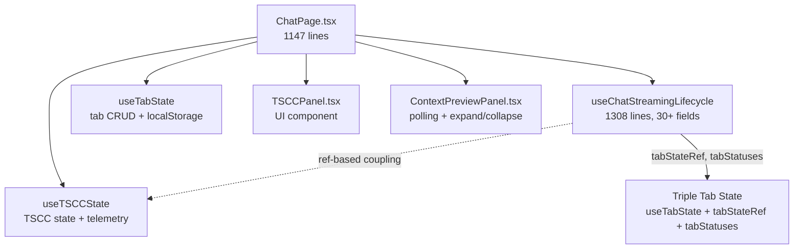
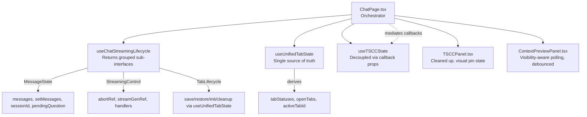

<!-- STALE REFERENCES: This spec references code that has since been refactored or removed:
- ContextPreviewPanel → REMOVED (was planned for future project detail view, never rendered in production)
- useTabState / tabStateRef / saveTabState → SUPERSEDED by useUnifiedTabState hook
- saveCurrentTab → REMOVED (was a no-op in useUnifiedTabState)
This spec is preserved as a historical record of the design decisions made at the time. -->

<!-- PE-REVIEWED -->
# Design Document: Chat Experience Cleanup

## Overview

This design addresses 17 requirements (covering 19 code review findings) across the SwarmAI chat experience layer. The changes span six key files: `useChatStreamingLifecycle.ts`, `ChatPage.tsx`, `TSCCPanel.tsx`, `ContextPreviewPanel.tsx`, `useTSCCState.ts`, and `TabStatusIndicator.tsx`.

The cleanup is organized into four implementation phases:

1. **Phase A — Quick Wins** (Reqs 1, 6, 7, 8, 9, 11, 12, 13): Debug removal, dead code, memoization, and small fixes that are low-risk and independently testable.
2. **Phase B — Algorithmic & Persistence** (Reqs 2, 3, 4): Set-based dedup, schema versioning, and hardened 404 detection — pure-function changes with strong property-test coverage.
3. **Phase C — UX Polish** (Reqs 14, 15): Visibility-based polling pause and debounced expand/collapse — isolated to `ContextPreviewPanel`.
4. **Phase D — Architectural** (Reqs 5, 10, 16, 17): Hook decomposition, effect consolidation, TSCC decoupling, and tab state unification — higher-risk refactors that touch multiple files.

### Guiding Principles

- **Behavioral equivalence**: Every refactor must preserve existing behavior. Property tests validate this for pure functions.
- **Incremental delivery**: Each phase is independently shippable and testable.
- **Minimal API surface change**: Consuming components should require minimal updates when internal structure changes.

## Architecture

### Current Architecture



### Target Architecture



### Key Architectural Decisions

| Decision | Rationale |
|----------|-----------|
| Group hook return into sub-interfaces, not separate hooks | Avoids breaking the single-call-site pattern in ChatPage; sub-hooks can be extracted later if needed |
| Single `useUnifiedTabState` replaces triple bookkeeping | Eliminates drift between `useTabState`, `tabStateRef`, and `tabStatuses` |
| ChatPage mediates TSCC ↔ Streaming communication | Breaks circular ref dependency without introducing an event bus |
| `import.meta.env.DEV` for debug gating | Vite tree-shakes the entire block in production builds — zero runtime cost |
| Schema version as integer, not semver | Simple numeric comparison; bump on any breaking change to `PersistedPendingState` |
| Structured error detection for 404 | Eliminates false positives from substring matching on error messages |

## Components and Interfaces

### Phase A — Quick Wins

#### Req 1: Debug Logging Removal

**Current**: `console.log` on every SSE event in the streaming hook; `setMessages` wrapper in ChatPage captures `new Error().stack` on every call.

**Design**:
- Wrap all debug logging in `if (import.meta.env.DEV)` guards.
- Remove the `setMessages` debug wrapper in ChatPage — use `_rawSetMessages` directly.
- In the streaming hook, gate the SSE event log behind `import.meta.env.DEV` so Vite eliminates the entire block (including string interpolation) in production.

```typescript
// Before
console.log('[SSE]', event.type, event);

// After
if (import.meta.env.DEV) {
  console.log('[SSE]', event.type, event);
}
```

#### Req 6: Remove Redundant setMessages in handleNewChat

**Current**: `handleNewChat` calls `setMessages([])` then immediately `setMessages([createWelcomeMessage()])`.

**Design**: Single call: `setMessages([createWelcomeMessage()])`. The empty array is never rendered — React batches these, but the intermediate state is wasteful and confusing.

#### Req 7: Memoize handleSendMessage and handlePluginCommand

**Current**: `handleSendMessage` and `handlePluginCommand` are plain `async` functions recreated every render.

**Design**:
- Wrap both in `useCallback` with correct dependency arrays.
- `handleSendMessage` depends on: `inputValue`, `attachments`, `isStreaming`, `selectedAgentId`, `sessionId`, `enableSkills`, `enableMCP`, `runAsTask`, `activeTabId`, `openTabs`, `messages`, and the memoized helpers.
- `handlePluginCommand` depends on: `setMessages`.
- Since `handleSendMessage` has many dependencies, consider extracting stable refs for values that change frequently (e.g., `inputValue`) to keep the callback identity stable.

```typescript
// Use refs for frequently-changing values to stabilize callback identity
const inputValueRef = useRef(inputValue);
inputValueRef.current = inputValue;

const handleSendMessage = useCallback(async () => {
  const messageText = inputValueRef.current;
  // ... rest of implementation using refs for volatile deps
}, [selectedAgentId, sessionId, enableSkills, enableMCP, /* stable deps only */]);
```

#### Req 8: Memoize Timeline Merge

**Current**: Inline IIFE in JSX computes the merged timeline on every render.

**Design**: Extract to `useMemo`:

```typescript
const timeline = useMemo(() => {
  type TimelineItem =
    | { kind: 'message'; data: Message }
    | { kind: 'snapshot'; data: TSCCSnapshot };

  const items: TimelineItem[] = [
    ...messages.map((m): TimelineItem => ({ kind: 'message', data: m })),
    ...threadSnapshots.map((s): TimelineItem => ({ kind: 'snapshot', data: s })),
  ];

  items.sort((a, b) => {
    const tsA = a.kind === 'message' ? a.data.timestamp : a.data.timestamp;
    const tsB = b.kind === 'message' ? b.data.timestamp : b.data.timestamp;
    const diff = new Date(tsA || 0).getTime() - new Date(tsB || 0).getTime();
    // Stable sort tiebreaker: messages before snapshots, then by id/snapshotId
    if (diff !== 0) return diff;
    if (a.kind !== b.kind) return a.kind === 'message' ? -1 : 1;
    return 0;
  });

  return items;
}, [messages, threadSnapshots]);
```

#### Req 9: Fix Missing useCallback Dependencies

**Current**: `loadSessionMessages` has an empty dependency array but references `setMessages`, `setSessionId`, `setPendingQuestion` from outer scope.

**Design**: Add all referenced outer-scope variables to the dependency array. Since React state setters are stable, the practical impact is minimal, but correctness requires listing them:

```typescript
const loadSessionMessages = useCallback(async (sid: string) => {
  // ...
}, [setMessages, setSessionId, setPendingQuestion]);
```

#### Req 11: Remove Dead Code from TSCC Panel

**Current**: `ExpandedView` declares `const [showResumed, _setShowResumed] = useState(false)` and a `useEffect` that watches `tsccState.lifecycleState` but does nothing. The `showResumed` variable is only read in JSX but never set to `true`.

**Design**: Remove `showResumed` state, the empty `useEffect`, and simplify the lifecycle label display to always use `lifecycleLabel(tsccState.lifecycleState)`.

#### Req 12: Fix Stale DEFAULT_TSCC_STATE Timestamp

**Current**: `DEFAULT_TSCC_STATE` is a module-level constant with `lastUpdatedAt: new Date().toISOString()` — evaluated once at module load time. Freshness calculations show incorrect "Xm ago" values.

**Design**: Replace with a factory function:

```typescript
function createDefaultTSCCState(): TSCCState {
  return {
    threadId: '',
    projectId: null,
    scopeType: 'workspace',
    lastUpdatedAt: new Date().toISOString(),
    lifecycleState: 'new',
    liveState: { /* ... defaults ... */ },
  };
}
```

Call `createDefaultTSCCState()` in the component via `useMemo` to avoid creating a new object on every render:

```typescript
const effectiveState = useMemo(
  () => tsccState ?? createDefaultTSCCState(),
  [tsccState]
);
```

#### Req 13: Differentiate Pin Icon Visual State

**Current**: Both pinned and unpinned states render `push_pin` with the same icon — only the text color changes.

**Design**:
- Pinned: `push_pin` icon with `filled` variant class and a 0° rotation (upright).
- Unpinned: `push_pin` icon with `outlined` variant and a 45° rotation (tilted).
- Preserve existing `aria-pressed` attribute.

```tsx
<span className={`material-symbols-outlined text-base ${
  isPinned ? 'font-[\'FILL\':1]' : 'rotate-45'
}`}>
  push_pin
</span>
```

### Phase B — Algorithmic & Persistence

#### Req 2: Set-Based Duplicate Detection in updateMessages

**Current**: `updateMessages` uses `O(n×m)` nested `.some()` to filter duplicate content blocks.

**Design**: Build a `Set<string>` of existing block keys before filtering. Key derivation:

```typescript
function blockKey(block: ContentBlock): string {
  switch (block.type) {
    case 'tool_use': return `tool_use:${block.id}`;
    case 'tool_result': return `tool_result:${block.toolUseId}`;
    case 'text': return `text:${block.text}`;
    default: {
      // Safe fallback — avoid JSON.stringify on potentially circular objects
      try { return `${block.type}:${JSON.stringify(block)}`; }
      catch { return `${block.type}:${String(block)}`; }
    }
  }
}
```

Note: Two intentionally identical `text` blocks will be deduplicated. This matches the original behavior where `.some()` also deduplicates by text content. If intentional duplicate text blocks are needed in the future, add a positional index to the key.
```

The optimized function:

```typescript
export function updateMessages(
  currentMessages: Message[],
  assistantMessageId: string,
  newContent: ContentBlock[],
  model?: string,
): Message[] {
  return currentMessages.map((msg) => {
    if (msg.id !== assistantMessageId) return msg;
    const existingKeys = new Set(msg.content.map(blockKey));
    const filteredContent = newContent.filter((b) => !existingKeys.has(blockKey(b)));
    if (filteredContent.length === 0) return msg; // No new content — return same reference
    return {
      ...msg,
      content: [...msg.content, ...filteredContent],
      ...(model ? { model } : {}),
    };
  });
}
```

Complexity drops from `O(n×m)` to `O(n+m)` per message.

#### Req 3: Schema Versioning for Session Persistence

**Current**: `PersistedPendingState` has no version field. Schema changes silently corrupt restored state.

**Design**: Add a `version` field and bump on any breaking change.

```typescript
/** Current schema version for PersistedPendingState. Bump on breaking changes. */
export const PERSISTED_STATE_VERSION = 1;

export interface PersistedPendingState {
  version: number;
  messages: Message[];
  pendingQuestion: PendingQuestion;
  sessionId: string;
}
```

- `persistPendingState`: writes `version: PERSISTED_STATE_VERSION` into the payload.
- `restorePendingState`: checks `parsed.version === PERSISTED_STATE_VERSION`; discards and returns `null` on mismatch.

#### Req 4: Hardened 404 Detection

**Current**: Uses substring matching (`err.message.includes('404')`) which can false-positive on unrelated errors containing "404".

**Design**: Check structured error properties first, fall back to nothing (treat as indeterminate):

```typescript
function isNotFoundError(err: unknown): boolean {
  // Axios-style error with response.status
  if (typeof err === 'object' && err !== null && 'response' in err) {
    const resp = (err as { response?: { status?: number } }).response;
    if (resp && typeof resp.status === 'number') {
      return resp.status === 404;
    }
  }
  // Error with a status property (e.g., custom API errors)
  if (typeof err === 'object' && err !== null && 'status' in err) {
    return (err as { status: number }).status === 404;
  }
  // No structured status — treat as indeterminate, skip cleanup
  return false;
}
```

Remove all `err.message.includes(...)` checks.

### Phase C — UX Polish

#### Req 14: Pause Polling When Off-Screen

**Current**: `ContextPreviewPanel` polls every 5s when expanded, regardless of whether the browser tab is visible.

**Design**: Use the Page Visibility API to pause/resume the polling interval:

```typescript
const [isPageVisible, setIsPageVisible] = useState(!document.hidden);

useEffect(() => {
  const handler = () => setIsPageVisible(!document.hidden);
  document.addEventListener('visibilitychange', handler);
  return () => document.removeEventListener('visibilitychange', handler);
}, []);
```

Modify the polling `useEffect` to include `isPageVisible` in its dependency array and only start the interval when `!collapsed && isPageVisible`:

```typescript
useEffect(() => {
  // ... initial fetch ...
  if (!collapsed && isPageVisible) {
    timerRef.current = setInterval(() => fetchPreview(), POLL_INTERVAL_MS);
  }
  return () => { /* cleanup */ };
}, [projectId, threadId, fetchPreview, collapsed, isPageVisible]);
```

#### Req 15: Debounce Rapid Expand/Collapse

**Current**: Each toggle of `collapsed` triggers a new fetch via the `useEffect` that watches `collapsed`.

**Design**: Debounce the fetch trigger with a 300ms delay after the last toggle:

```typescript
const DEBOUNCE_MS = 300;

useEffect(() => {
  let cancelled = false;
  let debounceTimer: ReturnType<typeof setTimeout> | null = null;

  if (!collapsed && isPageVisible) {
    // Debounce the initial fetch on expand — polling starts AFTER the debounced fetch
    debounceTimer = setTimeout(async () => {
      if (cancelled) return;
      setLoading(true);
      try {
        const result = await getContextPreview(projectId, threadId);
        if (!cancelled && result !== null) {
          setPreview(result);
          setError(null);
        }
      } catch (err) {
        if (!cancelled) setError(err instanceof Error ? err.message : 'Failed to load');
      } finally {
        if (!cancelled) setLoading(false);
      }
      // Start polling only after the debounced fetch completes
      if (!cancelled) {
        timerRef.current = setInterval(() => {
          if (!cancelled) fetchPreview();
        }, POLL_INTERVAL_MS);
      }
    }, DEBOUNCE_MS);
  }

  return () => {
    cancelled = true;
    if (debounceTimer) clearTimeout(debounceTimer);
    if (timerRef.current) { clearInterval(timerRef.current); timerRef.current = null; }
  };
}, [projectId, threadId, fetchPreview, collapsed, isPageVisible]);
```

### Phase D — Architectural Refactors

#### Req 5: Decompose Streaming Lifecycle Hook Interface

**Current**: `ChatStreamingLifecycle` is a flat interface with 30+ fields.

**Design**: Group the return value into logical sub-interfaces. The hook still returns a single object, but the fields are organized:

```typescript
export interface MessageState {
  messages: Message[];
  setMessages: React.Dispatch<React.SetStateAction<Message[]>>;
  sessionId: string | undefined;
  setSessionId: React.Dispatch<React.SetStateAction<string | undefined>>;
  pendingQuestion: PendingQuestion | null;
  setPendingQuestion: React.Dispatch<React.SetStateAction<PendingQuestion | null>>;
}

export interface StreamingControl {
  isStreaming: boolean;
  setIsStreaming: (streaming: boolean) => void;
  streamingActivity: StreamingActivity | null;
  displayedActivity: StreamingActivity | null;
  elapsedSeconds: number;
  abortRef: React.MutableRefObject<(() => void) | null>;
  streamGenRef: React.MutableRefObject<number>;
  incrementStreamGen: () => void;
  createStreamHandler: (id: string, tabId?: string) => (event: StreamEvent) => void;
  createCompleteHandler: (tabId?: string) => () => void;
  createErrorHandler: (id: string, tabId?: string) => (error: Error) => void;
}

export interface ScrollControl {
  messagesEndRef: React.RefObject<HTMLDivElement | null>;
  userScrolledUpRef: React.MutableRefObject<boolean>;
  resetUserScroll: () => void;
}

export interface TabLifecycle {
  tabStateRef: React.MutableRefObject<Map<string, TabState>>;
  activeTabIdRef: React.MutableRefObject<string | null>;
  saveTabState: () => void;
  restoreTabState: (tabId: string) => boolean;
  initTabState: (tabId: string, initialMessages?: Message[]) => void;
  cleanupTabState: (tabId: string) => void;
  tabStatuses: Record<string, TabStatus>;
  updateTabStatus: (tabId: string, status: TabStatus) => void;
}

export interface ChatStreamingLifecycle {
  messageState: MessageState;
  streaming: StreamingControl;
  scroll: ScrollControl;
  tabs: TabLifecycle;
  removePendingStateForSession: (sessionId: string) => void;
}
```

ChatPage destructures from the sub-interfaces:

```typescript
const { messageState, streaming, scroll, tabs } = useChatStreamingLifecycle(deps);
const { messages, setMessages, sessionId, setSessionId } = messageState;
const { isStreaming, setIsStreaming, abortRef } = streaming;
```

#### Req 10: Reduce Overlapping useEffect Dependencies

**Current**: Multiple `useEffect` hooks watch `activeTabId` and mutate `messages`/`sessionId`, creating mount-time race conditions.

**Design**: Consolidate the tab-switching effects into a single `useEffect` that handles all tab lifecycle transitions:

```typescript
// Single effect for tab switching — replaces the separate
// "sync active tab content" and "register initial tab" effects
useEffect(() => {
  if (!activeTabId) return;
  if (prevActiveTabIdRef.current === activeTabId) return;
  prevActiveTabIdRef.current = activeTabId;

  // 1. Ensure tab is registered in per-tab map
  if (!tabStateRef.current.has(activeTabId)) {
    initTabState(activeTabId, [createWelcomeMessage()]);
  }

  // 2. Try restore from per-tab map
  const restored = restoreTabState(activeTabId);
  if (restored) {
    if (tabStatuses[activeTabId] === 'complete_unread') {
      updateTabStatus(activeTabId, 'idle');
    }
    return;
  }

  // 3. Load from API or initialize fresh
  const activeTab = openTabs.find(t => t.id === activeTabId);
  if (activeTab?.sessionId && activeTab.sessionId !== sessionId) {
    loadSessionMessages(activeTab.sessionId);
  } else if (!activeTab?.sessionId && !isStreaming) {
    setMessages([createWelcomeMessage()]);
    setSessionId(undefined);
    setPendingQuestion(null);
  }
}, [activeTabId]);
```

#### Req 16: Decouple TSCC State Hook from Streaming Lifecycle Hook

**Current**: The streaming lifecycle hook receives `applyTelemetryEvent` and `tsccTriggerAutoExpand` via its deps interface. ChatPage bridges them using refs (`applyTelemetryEventRef`, `tsccTriggerAutoExpandRef`) to break the circular initialization order (streaming hook needs TSCC callbacks, TSCC hook needs `sessionId` from streaming hook).

**Design**: Formalize this pattern by defining a clear callback interface:

```typescript
/** Callback interface for TSCC integration — injected by ChatPage */
export interface TSCCCallbacks {
  applyTelemetryEvent: (event: unknown) => void;
  triggerAutoExpand: (reason: string) => void;
}
```

The streaming hook accepts `TSCCCallbacks` (not direct hook references). ChatPage creates the callbacks using refs as it does today, but the interface is now explicit and documented. Neither hook imports from the other.

This is the current pattern made explicit — no behavioral change, just formalized typing.

#### Req 17: Consolidate Tab State into Single Source of Truth

**Current**: Tab state is spread across three stores:
1. `useTabState` — `openTabs`, `activeTabId` (localStorage-persisted)
2. `tabStateRef` (in streaming hook) — per-tab `Map<string, TabState>` with messages, sessionId, streaming state
3. `tabStatuses` (in streaming hook) — `Record<string, TabStatus>` useState

**Design**: Create `useUnifiedTabState` that merges all three:

```typescript
interface UnifiedTab {
  // From useTabState
  id: string;
  title: string;
  agentId: string;
  isNew: boolean;
  sessionId?: string;

  // From tabStateRef (TabState)
  messages: Message[];
  pendingQuestion: PendingQuestion | null;
  isStreaming: boolean;
  abortController: (() => void) | null;
  streamGen: number;

  // From tabStatuses
  status: TabStatus;
}

interface UseUnifiedTabStateReturn {
  // Tab CRUD
  openTabs: UnifiedTab[];
  activeTabId: string | null;
  addTab: (agentId: string) => UnifiedTab;
  closeTab: (tabId: string) => void;
  selectTab: (tabId: string) => void;

  // Tab metadata updates
  updateTabTitle: (tabId: string, title: string) => void;
  updateTabSessionId: (tabId: string, sessionId: string) => void;
  setTabIsNew: (tabId: string, isNew: boolean) => void;

  // Per-tab state (replaces tabStateRef + tabStatuses)
  getTabState: (tabId: string) => UnifiedTab | undefined;
  updateTabState: (tabId: string, patch: Partial<UnifiedTab>) => void;
  updateTabStatus: (tabId: string, status: TabStatus) => void;

  // Derived views
  tabStatuses: Record<string, TabStatus>;
  activeTab: UnifiedTab | undefined;

  // Lifecycle
  saveCurrentTab: () => void;
  restoreTab: (tabId: string) => boolean;
  removeInvalidTabs: (validSessionIds: Set<string>) => void;
}
```

Implementation approach:
- Internal state: `useRef<Map<string, UnifiedTab>>` as the single authoritative store.
- A `useState` counter (or `useReducer`) is used as a re-render trigger — increment it whenever the ref map is mutated so React picks up the change. All public mutation methods (addTab, closeTab, updateTabState, etc.) must increment this counter after modifying the map.
- `openTabs` is derived from the map (ordered array) via `useMemo` keyed on the re-render counter.
- localStorage persistence writes only the serializable subset (id, title, agentId, isNew, sessionId).
- `tabStatuses` is a derived `Record` computed from the map for backward compatibility with `ChatHeader`.

## Data Models

### PersistedPendingState (Updated — Req 3)

```typescript
export const PERSISTED_STATE_VERSION = 1;

export interface PersistedPendingState {
  version: number;              // Schema version — must match PERSISTED_STATE_VERSION
  messages: Message[];          // Possibly truncated for large sessions
  pendingQuestion: PendingQuestion;
  sessionId: string;
}
```

### UnifiedTab (New — Req 17)

```typescript
export interface UnifiedTab {
  id: string;                   // UUID
  title: string;                // Display title, "New Session" initially
  agentId: string;              // Associated agent
  isNew: boolean;               // True until first message sent
  sessionId?: string;           // Backend session ID, undefined for new tabs

  // Runtime state (not persisted to localStorage)
  messages: Message[];
  pendingQuestion: PendingQuestion | null;
  isStreaming: boolean;
  abortController: (() => void) | null;
  streamGen: number;
  status: TabStatus;
}
```

### TabStatus (Unchanged)

```typescript
export type TabStatus = 'idle' | 'streaming' | 'waiting_input' | 'permission_needed' | 'error' | 'complete_unread';
```

### ChatStreamingLifecycle Sub-Interfaces (New — Req 5)

```typescript
export interface MessageState { /* see Req 5 section */ }
export interface StreamingControl { /* see Req 5 section */ }
export interface ScrollControl { /* see Req 5 section */ }
export interface TabLifecycle { /* see Req 5 section */ }
```

### TSCCCallbacks (New — Req 16)

```typescript
export interface TSCCCallbacks {
  applyTelemetryEvent: (event: unknown) => void;
  triggerAutoExpand: (reason: string) => void;
}
```

## Correctness Properties

*A property is a characteristic or behavior that should hold true across all valid executions of a system — essentially, a formal statement about what the system should do. Properties serve as the bridge between human-readable specifications and machine-verifiable correctness guarantees.*

### Property 1: updateMessages Behavioral Equivalence

*For any* valid message array, any assistant message ID present in that array, any array of new content blocks (containing arbitrary mixes of `text`, `tool_use`, and `tool_result` blocks), and any optional model string, the optimized Set-based `updateMessages` implementation SHALL produce output identical to the original nested-iteration implementation.

**Validates: Requirements 2.5**

### Property 2: Persist/Restore Round-Trip

*For any* valid `PersistedPendingState` object (with `version` matching `PERSISTED_STATE_VERSION`, a non-empty messages array, a pendingQuestion with a string toolUseId, and a string sessionId), persisting to sessionStorage and then restoring by the same sessionId SHALL produce an object deeply equal to the original. Note: For sessions with 80+ `tool_use` blocks, `prepareMessagesForStorage` truncates `tool_result` content before persisting — the round-trip property applies to the *post-truncation* payload, not the original. A separate unit test should verify truncation behavior independently.

**Validates: Requirements 3.5**

### Property 3: Version Mismatch Discards State

*For any* valid `PersistedPendingState` object persisted with version `V`, if the current `PERSISTED_STATE_VERSION` is changed to any value `W ≠ V`, then `restorePendingState` SHALL return `null` and the sessionStorage entry SHALL be removed.

**Validates: Requirements 3.4**

### Property 4: Structured 404 Detection

*For any* error object with a numeric `status` property or a `response.status` property, `isNotFoundError` SHALL return `true` if and only if the status equals 404. *For any* error object without a numeric status property (including plain `Error` instances with arbitrary messages containing "404"), `isNotFoundError` SHALL return `false`.

**Validates: Requirements 4.2, 4.3**

### Property 5: Polling Pauses When Not Visible

*For any* `ContextPreviewPanel` instance in the expanded state, when `document.hidden` is `true` (page not visible), the polling interval SHALL NOT fire any fetch requests. When `document.hidden` transitions back to `false`, polling SHALL resume within one polling interval.

**Validates: Requirements 14.1, 14.2**

### Property 6: Debounce Limits Fetch Calls

*For any* sequence of N expand/collapse toggles on `ContextPreviewPanel` occurring within a 300ms window, at most one fetch request SHALL be initiated. The fetch SHALL fire only after 300ms of toggle inactivity.

**Validates: Requirements 15.1, 15.2**

### Property 7: Tab Operation Invariants

*For any* sequence of tab operations (add, close, select, updateTitle, updateSessionId, updateStatus) applied to `useUnifiedTabState`, the following invariants SHALL hold after each operation:
- There is always at least one tab in `openTabs`.
- `activeTabId` always references an existing tab.
- No two tabs share the same `id`.
- Closing the last tab auto-creates a new tab and sets it as active.

**Validates: Requirements 17.3**

### Property 8: Per-Tab State Isolation

*For any* two distinct tabs `A` and `B` in `useUnifiedTabState`, updating tab `A`'s state (messages, pendingQuestion, isStreaming, status) SHALL NOT modify any field of tab `B`'s state.

**Validates: Requirements 17.4**

## Error Handling

### Session Persistence Errors

| Scenario | Handling |
|----------|----------|
| `sessionStorage` quota exceeded during persist | Log warning, continue without persistence. User loses pending state on reload. |
| Corrupted JSON in sessionStorage | Discard entry, return `null` from restore. |
| Schema version mismatch | Discard entry, return `null`. |
| `sessionStorage` unavailable (SSR, Tauri edge case) | All persistence functions no-op gracefully. |

### Stale Entry Cleanup Errors

| Scenario | Handling |
|----------|----------|
| `getSession` returns 404 (structured) | Remove the stale entry. |
| `getSession` throws network error | Keep entry for next cleanup cycle. |
| `getSession` throws error without status property | Treat as indeterminate — keep entry (Req 4.3). |

### Polling Errors (ContextPreviewPanel)

| Scenario | Handling |
|----------|----------|
| Fetch fails during polling | Set error state, keep polling (next tick may succeed). |
| ETag 304 (no change) | Skip re-render, no error. |
| Component unmounts during fetch | Cancelled flag prevents state updates on unmounted component. |

### Tab State Errors

| Scenario | Handling |
|----------|----------|
| `restoreTab` called with unknown tabId | Return `false`, caller initializes fresh. |
| localStorage corrupted for tab persistence | Fall back to single "New Session" tab. |
| Tab references deleted backend session | `removeInvalidTabs` clears sessionId, resets to new tab state. |

## Testing Strategy

### Testing Framework

- **Unit tests**: Vitest (already configured in the project)
- **Property-based tests**: `fast-check` library for Vitest
- **Component tests**: React Testing Library (for Reqs 13, 14, 15 UI behavior)

### Property-Based Test Configuration

- Minimum 100 iterations per property test
- Each property test tagged with: `Feature: chat-experience-cleanup, Property {N}: {title}`
- Tests located in `desktop/src/__tests__/chat-experience-cleanup/`

### Test Plan by Phase

#### Phase A — Quick Wins
- **Unit tests**: Verify `handleNewChat` calls `setMessages` once (Req 6), verify `loadSessionMessages` dependency array correctness (Req 9), verify dead code removal doesn't break TSCC panel rendering (Req 11), verify `createDefaultTSCCState()` produces fresh timestamps (Req 12).
- **Component tests**: Verify pin icon visual differentiation (Req 13), verify `aria-pressed` attribute (Req 13).

#### Phase B — Algorithmic & Persistence
- **Property tests**:
  - Property 1: `updateMessages` behavioral equivalence — generate random message arrays and content blocks, compare old vs new implementation.
  - Property 2: Persist/restore round-trip — generate random `PersistedPendingState` objects, persist and restore, compare.
  - Property 3: Version mismatch — generate random states, persist with version V, restore with version W≠V, assert null.
  - Property 4: Structured 404 detection — generate random error objects with/without status fields, verify `isNotFoundError` behavior.

#### Phase C — UX Polish
- **Property tests**:
  - Property 5: Polling pause — mock `document.hidden`, verify no fetches fire while hidden.
  - Property 6: Debounce — generate random toggle sequences, verify at most one fetch per 300ms window.
- **Unit tests**: Verify polling resumes on visibility change, verify debounce timer cleanup on unmount.

#### Phase D — Architectural
- **Property tests**:
  - Property 7: Tab operation invariants — generate random operation sequences, verify invariants after each step.
  - Property 8: Per-tab isolation — generate random tab pairs and state updates, verify no cross-contamination.
- **Unit tests**: Verify hook sub-interface grouping compiles correctly (TypeScript type tests), verify TSCC callback mediation works end-to-end.

### Dual Testing Rationale

- **Property tests** cover universal correctness guarantees (all inputs) — especially valuable for `updateMessages` (Req 2), persistence round-trip (Req 3), and tab state (Req 17).
- **Unit tests** cover specific examples, edge cases, and integration points — especially valuable for React hook behavior (Reqs 7, 9, 10), UI rendering (Req 13), and dead code verification (Req 11).
- Both are complementary: property tests catch unexpected edge cases through randomization, unit tests verify specific known scenarios and integration behavior.
