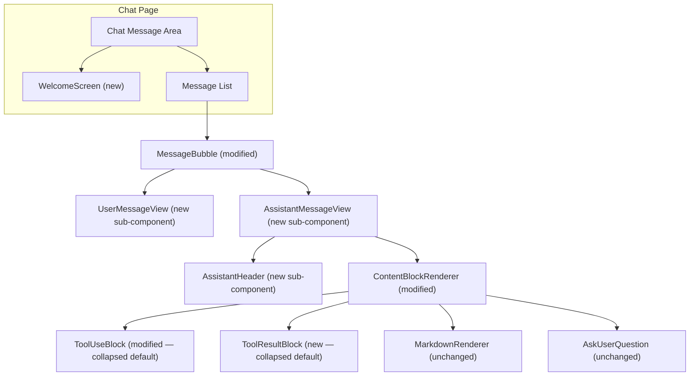

<!-- PE-REVIEWED -->
# Design Document: Chat Message Area Redesign

## Overview

This design covers the visual and structural redesign of the SwarmAI chat message area. The goal is to simplify user message bubbles, rebrand assistant messages with a SwarmAI identity, left-align assistant content for full-width utilization, collapse tool call/result blocks by default, introduce a branded welcome screen, and preserve error styling. All changes are scoped to the `desktop/src/pages/chat/` directory, primarily touching `MessageBubble.tsx`, `ContentBlockRenderer.tsx`, `ToolUseBlock.tsx`, and `constants.ts`, plus a new `WelcomeScreen.tsx` component.

The prototype at `assets/swarmai-prototype.html` serves as the visual reference. The existing `createWelcomeMessage()` in `constants.ts` currently generates a welcome message as an assistant message bubble — this will be replaced by a dedicated `WelcomeScreen` component that renders outside the message list.

## Architecture

The redesign modifies the presentation layer only. No backend changes, API changes, or data model changes are required. The `Message` type and `ContentBlock` union type remain unchanged.



### Design Decisions

1. **Sub-components as separate files**: We extract `UserMessageView`, `AssistantMessageView`, and `AssistantHeader` into separate files within the `components/` directory. This keeps `MessageBubble.tsx` as a thin dispatcher that branches on `message.role` and delegates to the appropriate view component.

2. **New ToolResultBlock component**: Currently, tool results are rendered inline in `ContentBlockRenderer.tsx` as a `<div>` with no collapse support. We extract this into a dedicated `ToolResultBlock.tsx` component that mirrors `ToolUseBlock`'s collapse behavior.

3. **WelcomeScreen as a sibling to the message list**: The welcome screen renders conditionally when `messages.length === 0` for the active tab. It is NOT an assistant message bubble — it's a standalone centered component that disappears when the first message arrives.

4. **CSS-only animation for SwarmAI icon**: The pulse/glow animation on the 🐝 emoji is driven by a CSS class toggled via the existing `isStreaming` prop. No new state management needed.

5. **Two icon treatments — brand icon vs. bee emoji**: The WelcomeScreen uses the circular brand icon image (`swarmai-icon-round.png`) for a polished branding moment. The AssistantHeader uses the 🐝 emoji to evoke the "swarm" concept — each response feels like a bee from the hive. This intentional split keeps branding prominent on the welcome screen while making assistant messages feel lightweight and thematic.

6. **Expansion state is local component state**: All expand/collapse toggles use `useState(false)` (collapsed by default). No global state or persistence needed — expansion resets on re-render, which is the desired behavior per Requirement 7.

## Components and Interfaces

### WelcomeScreen

New component: `desktop/src/pages/chat/components/WelcomeScreen.tsx`

```typescript
interface WelcomeScreenProps {
  // No props needed — purely presentational
}
```

Renders a centered layout with:
- Circular SwarmAI icon generated from the source icon (`desktop/src-tauri/icons/swarmai-icon-3.png`) with transparent background and CSS `border-radius: 50%` clipping. The original source icon has a black background, so the implementation should either: (a) use a pre-generated circular PNG with transparent background saved to `desktop/public/swarmai-icon-round.png`, or (b) apply CSS masking (`clip-path: circle(50%)`) with a themed background fill to the existing icon. Option (a) is preferred for crisp rendering.
- Gradient glow effect around the circular icon
- "Welcome to SwarmAI!" heading
- "Your AI Team, 24/7" slogan
- "Work smarter, move faster, and enjoy the journey." tagline
- Styled per the prototype's `.welcome-state` CSS

Displayed when `messages.length === 0` for the active tab. The parent chat area conditionally renders either `<WelcomeScreen />` or the message list.

### MessageBubble (modified)

File: `desktop/src/pages/chat/components/MessageBubble.tsx`

The current `MessageBubble` renders both user and assistant messages with a shared layout (avatar circle + header + content). The redesign diverges the two paths:

```typescript
interface MessageBubbleProps {
  message: Message;
  onAnswerQuestion?: (toolUseId: string, answers: Record<string, string>) => void;
  pendingToolUseId?: string;
  isStreaming?: boolean;
}
```

**Props remain unchanged.** Internal rendering branches on `message.role`:

- `role === 'user'` → renders `UserMessageView`
- `role === 'assistant'` → renders `AssistantMessageView`

### UserMessageView (new internal sub-component)

Renders user messages as minimal text bubbles:
- Light background (`bg-[var(--color-card)]`), no avatar icon, no timestamp
- Text content with 5-line truncation via CSS `line-clamp-5` (using Tailwind's `line-clamp` utility)
- Overflow detection: Use a `useRef` on the text container and a `useEffect` to compare `scrollHeight > clientHeight` after render. Additionally, attach a `ResizeObserver` to the text container ref to re-evaluate clamping when the container width changes (e.g., sidebar toggle resizing the chat area). Clean up the observer on unmount. This determines whether the content is actually clamped and controls whether the expansion toggle is shown. This avoids showing a toggle on short messages that fit within 5 lines.
- Expansion toggle: a clickable "Show more" / "Show less" button below the text, with `aria-expanded` attribute reflecting the current state
- State: `const [isExpanded, setIsExpanded] = useState(false)` and `const [isClamped, setIsClamped] = useState(false)`

```typescript
// Internal to MessageBubble.tsx or extracted to UserMessageView.tsx
interface UserMessageViewProps {
  message: Message;
}
```

### AssistantMessageView (new internal sub-component)

Renders assistant messages with the new branded layout:

```typescript
interface AssistantMessageViewProps {
  message: Message;
  onAnswerQuestion?: (toolUseId: string, answers: Record<string, string>) => void;
  pendingToolUseId?: string;
  isStreaming?: boolean;
}
```

Layout:
1. **Header line**: `🐝 SwarmAI · 10:42 AM` — icon, title, separator dot, timestamp on one line
2. **Content area**: Left-aligned, no indentation, full width up to `max-w-3xl`
3. **Error wrapper**: If `message.isError`, wraps content in red border container (preserving existing error styling)

### AssistantHeader (new sub-component)

```typescript
interface AssistantHeaderProps {
  timestamp: string;
  isStreaming?: boolean;
}
```

Renders a single line:
- 🐝 emoji with CSS animation class when `isStreaming` is true
- "SwarmAI" text label
- Formatted timestamp (`HH:MM AM/PM`)
- Animation: `@keyframes pulse` — opacity oscillation from 1.0 to 0.6, applied via `.animate-pulse` class when streaming

CSS animation definition (added to the component or a shared CSS file):
```css
@keyframes swarm-pulse {
  0%, 100% { opacity: 1; transform: scale(1); }
  50% { opacity: 0.6; transform: scale(1.1); }
}
.swarm-icon-streaming {
  animation: swarm-pulse 1.5s ease-in-out infinite;
}
```

### ToolUseBlock (modified)

File: `desktop/src/pages/chat/components/ToolUseBlock.tsx`

Current behavior: Always shows the header bar + full input content (with collapse only for long inputs). New behavior: **collapsed by default** showing only a single summary line.

```typescript
interface ToolUseBlockProps {
  name: string;
  input: Record<string, unknown>;
}
```

**Props unchanged.** Internal changes:

- Default state: `useState(false)` — collapsed
- Collapsed view: Single line with light-gray background (`bg-gray-100 dark:bg-gray-800/50`), showing:
  - `terminal` icon
  - Tool name text
  - Chevron expand icon (`expand_more`)
  - `aria-expanded="false"` on the toggle button
- Expanded view: Current full rendering (header bar + JSON content + copy button), with `aria-expanded="true"`
- JSON serialization is deferred: `useMemo` for `JSON.stringify(input, null, 2)` is only computed when `isExpanded` is true, avoiding expensive serialization for collapsed blocks
- Toggle: Clicking anywhere on the collapsed/expanded bar toggles the state (symmetric behavior for consistent UX). The entire header row is the click target in both states.

### ToolResultBlock (new)

New component: `desktop/src/pages/chat/components/ToolResultBlock.tsx`

Currently, tool results are rendered inline in `ContentBlockRenderer.tsx`. We extract this into a dedicated component with collapse support matching `ToolUseBlock`.

```typescript
interface ToolResultBlockProps {
  content?: string;
  isError: boolean;
}
```

- Default state: collapsed (single summary line)
- Collapsed view: `check_circle` icon (or `error` if `isError`), "Tool Result" label, chevron, `aria-expanded="false"`
- Expanded view: Full `<pre><code>` content block with copy button, `aria-expanded="true"`
- Same light-gray background styling as `ToolUseBlock` collapsed state

### ContentBlockRenderer (modified)

File: `desktop/src/pages/chat/components/ContentBlockRenderer.tsx`

Changes:
- `tool_result` case: Replace inline `<div>` rendering with `<ToolResultBlock content={block.content} isError={block.isError} />`
- All other cases remain unchanged

### Constants Updates

File: `desktop/src/pages/chat/constants.ts`

- Add `USER_MESSAGE_MAX_LINES = 5` — line clamp threshold for user messages
- Retain `createWelcomeMessage()` — it is still used internally by `createWorkspaceChangeMessage()`. The `WelcomeScreen` component replaces the *default new-tab* welcome behavior, but `createWelcomeMessage()` remains as a utility for programmatic message generation (e.g., workspace change notifications). Update the default emoji in the welcome text from 🤖 to 🐝 for brand consistency.
- Keep `createWorkspaceChangeMessage()` as-is (it serves a different purpose for workspace context changes)

## Data Models

No data model changes are required. The existing types are sufficient:

- `Message` interface (`desktop/src/types/index.ts`): `id`, `role`, `content`, `timestamp`, `model?`, `isError?` — unchanged
- `ContentBlock` union type: `TextContent | ToolUseContent | ToolResultContent | AskUserQuestionContent` — unchanged
- `ToolUseContent`: `type`, `id`, `name`, `input` — unchanged
- `ToolResultContent`: `type`, `toolUseId`, `content?`, `isError` — unchanged

All visual changes are purely in the React component layer. The `isStreaming` prop already flows through from the chat page to `MessageBubble` and is sufficient to drive the icon animation.

### State Model

All new UI state is local React component state (no global store changes):

| Component | State | Type | Default | Purpose |
|-----------|-------|------|---------|---------|
| UserMessageView | `isExpanded` | `boolean` | `false` | Controls 5-line truncation toggle |
| UserMessageView | `isClamped` | `boolean` | `false` | Tracks whether content overflows 5 lines (set via ref measurement) |
| ToolUseBlock | `isExpanded` | `boolean` | `false` | Controls collapsed/expanded tool call view |
| ToolResultBlock | `isExpanded` | `boolean` | `false` | Controls collapsed/expanded tool result view |

No state persistence is needed — expansion resets on component unmount/remount, which aligns with Requirement 7 (idempotence).

## Correctness Properties

*A property is a characteristic or behavior that should hold true across all valid executions of a system — essentially, a formal statement about what the system should do. Properties serve as the bridge between human-readable specifications and machine-verifiable correctness guarantees.*

### Property 1: User messages render without avatar and timestamp

*For any* `Message` with `role === 'user'`, the rendered `MessageBubble` output shall not contain an avatar icon element and shall not contain a timestamp element. The content shall be rendered with a light background class.

**Validates: Requirements 1.1, 1.2**

### Property 2: Long user messages are truncated with expand toggle

*For any* `Message` with `role === 'user'` whose text content causes the rendered container's `scrollHeight` to exceed its `clientHeight` when `line-clamp-5` is applied, the `UserMessageView` shall display an expansion toggle element. For messages that fit within 5 lines (no overflow), no expansion toggle shall be present.

**Validates: Requirements 1.3**

### Property 3: All assistant messages display branded header

*For any* `Message` with `role === 'assistant'`, regardless of the `isError` flag value, the rendered `MessageBubble` shall contain a header line with the 🐝 icon, the text "SwarmAI", and a formatted timestamp string. The header shall not contain the `smart_toy` material icon.

**Validates: Requirements 2.1, 2.2, 6.2**

### Property 4: Icon animation matches streaming state

*For any* `Message` with `role === 'assistant'` and any boolean value of `isStreaming`, the SwarmAI icon element shall have the `swarm-icon-streaming` CSS class applied if and only if `isStreaming` is `true`.

**Validates: Requirements 2.3, 2.4**

### Property 5: Assistant content is left-aligned with no avatar indentation

*For any* `Message` with `role === 'assistant'`, the rendered content area shall be left-aligned (no `text-right` or `flex-row-reverse` classes), shall not contain a left-side avatar element creating an indentation gap, and shall preserve the `max-w-3xl` constraint for readability.

**Validates: Requirements 3.1, 3.2, 3.3**

### Property 6: All tool blocks default to collapsed state

*For any* `ContentBlock` of type `tool_use` or `tool_result`, regardless of the content length or input size, the initial render shall display the block in a collapsed single-line summary view. The expanded content (JSON input, tool result text, copy button) shall not be visible on initial render.

**Validates: Requirements 4.1, 4.2, 4.5, 7.2**

### Property 7: Expand/collapse round-trip idempotence

*For any* expandable component (UserMessageView truncation toggle, ToolUseBlock, ToolResultBlock), performing an expand action followed by a collapse action shall return the component to a visual state identical to its initial rendered state. Formally: for all expandable components C, `collapse(expand(C)) ≡ C_initial`.

**Validates: Requirements 1.4, 1.5, 4.3, 4.4, 7.1**

### Property 8: Error messages preserve red border styling

*For any* `Message` with `role === 'assistant'` and `isError === true`, the rendered output shall contain the red border (`border-red-500/60`) and error background (`bg-red-500/10`) CSS classes, regardless of any other layout changes applied by the redesign.

**Validates: Requirements 6.1**

### Property 9: Welcome screen visibility is determined by message count per tab

*For any* chat tab, the `WelcomeScreen` component shall be rendered if and only if the tab's message array has length 0. This condition is evaluated independently per tab — other tabs' message counts shall have no effect.

**Validates: Requirements 5.1, 5.4, 5.5**

### Property 10: Icon treatment differentiation

*For any* rendered `WelcomeScreen` component, the icon element shall be an `` element referencing the circular brand icon asset (not the 🐝 emoji). *For any* rendered `AssistantHeader` component, the icon element shall be the 🐝 emoji text (not an `` element). This ensures the dual-icon treatment from Design Decision #5 is correctly implemented.

**Validates: Requirements 2.1, 5.2**

## Error Handling

This redesign is purely presentational, so error handling is minimal:

1. **Missing timestamp**: If `message.timestamp` is undefined or invalid, the `AssistantHeader` shall display an empty string for the timestamp (graceful degradation). The existing `toLocaleTimeString()` call already handles this — `new Date(undefined)` produces `Invalid Date`, so we add a guard: `isNaN(date.getTime()) ? '' : date.toLocaleTimeString(...)`.

2. **Empty content blocks**: If a `Message` has an empty `content` array, `MessageBubble` renders the header only (for assistant) or nothing (for user). No crash.

3. **Missing tool input**: `ToolUseBlock` already handles `input || {}`. `ToolResultBlock` handles `content ?? ''`.

4. **Large tool outputs**: The collapsed-by-default behavior naturally mitigates performance issues from rendering very large tool result strings. The content is only rendered into the DOM when expanded.

5. **CSS animation fallback**: If the browser doesn't support the `@keyframes` animation, the icon simply renders statically — no functional impact.

## Testing Strategy

### Property-Based Testing

Library: **fast-check** (already available in the project's test infrastructure via `vitest`)

Each correctness property maps to a single property-based test with minimum 100 iterations. Tests use `fc.assert(fc.property(...))` with generated `Message` objects.

**Test file**: `desktop/src/pages/chat/components/__tests__/MessageBubble.property.test.tsx`

| Property | Test Description | Generator Strategy |
|----------|-----------------|-------------------|
| P1 | User messages have no avatar/timestamp | Generate random `Message` with `role: 'user'`, random text content |
| P2 | Long user messages show truncation | Generate `Message` with `role: 'user'`, text with 6+ `\n`-separated lines |
| P3 | Assistant messages have branded header | Generate random `Message` with `role: 'assistant'`, random `isError` boolean |
| P4 | Icon animation matches streaming | Generate random assistant `Message`, random `isStreaming` boolean |
| P5 | Assistant content left-aligned, no avatar gap | Generate random assistant `Message` |
| P6 | Tool blocks default collapsed | Generate random `ToolUseContent` and `ToolResultContent` blocks |
| P7 | Expand/collapse idempotence | Generate random expandable component, simulate click-click |
| P8 | Error messages keep red border | Generate assistant `Message` with `isError: true` |
| P9 | Welcome screen iff empty messages | Generate random arrays of `Message` (including empty) |
| P10 | Icon treatment differentiation | Render WelcomeScreen and AssistantHeader, verify icon element types |

Tag format for each test:
```typescript
// Feature: chat-message-area-redesign, Property 1: User messages render without avatar and timestamp
```

### Unit Testing

**Test file**: `desktop/src/pages/chat/components/__tests__/MessageBubble.test.tsx` (extend existing)

Unit tests cover specific examples and edge cases:

- WelcomeScreen renders all required text elements (5.2)
- WelcomeScreen is not wrapped in MessageBubble (5.3)
- ToolUseBlock with TodoWrite special case still works after redesign
- AssistantHeader formats various timestamp strings correctly
- User message with exactly 5 lines does NOT show expand toggle (edge case for P2)
- User message with 0 content blocks renders without error
- Tool result with `isError: true` shows error icon in collapsed view

### Test Configuration

```typescript
// vitest.config.ts — no changes needed, fast-check is already available
// Each property test runs with { numRuns: 100 } minimum
```

All tests run via: `cd desktop && npm test -- --run`
