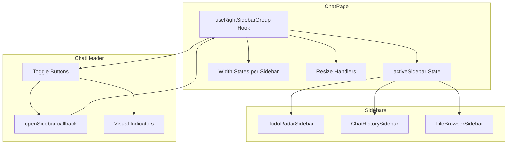

# Design Document: Right Sidebar Mutual Exclusion

## Overview

This feature implements mutual exclusion behavior for the three right sidebars in ChatPage: TodoRadarSidebar, ChatHistorySidebar, and FileBrowserSidebar. The design introduces a new `useRightSidebarGroup` hook that manages sidebar state as a single unit, ensuring only one sidebar can be visible at a time while maintaining individual width/resize capabilities.

### Key Design Decisions

1. **Single State Source**: Replace three independent `useSidebarState` hooks with one `useRightSidebarGroup` hook that manages which sidebar is active
2. **No localStorage Persistence**: Sidebar visibility state is ephemeral; only width preferences are persisted
3. **Default to TodoRadar**: On mount, TodoRadarSidebar is always the active sidebar
4. **No-op Toggle**: Clicking an active sidebar's button keeps it open (doesn't close it)

## Architecture



### Component Hierarchy

```
ChatPage
├── useRightSidebarGroup() → { activeSidebar, openSidebar, widths, resizeHandlers }
├── ChatHeader
│   └── Toggle Buttons (TodoRadar, ChatHistory, FileBrowser)
│       └── onClick → openSidebar(sidebarId)
│       └── isActive → activeSidebar === sidebarId
└── Sidebar Container
    ├── TodoRadarSidebar (visible when activeSidebar === 'todoRadar')
    ├── ChatHistorySidebar (visible when activeSidebar === 'chatHistory')
    └── FileBrowserSidebar (visible when activeSidebar === 'fileBrowser')
```

## Components and Interfaces

### New Hook: `useRightSidebarGroup`

```typescript
// desktop/src/hooks/useRightSidebarGroup.ts

type RightSidebarId = 'todoRadar' | 'chatHistory' | 'fileBrowser';

interface SidebarWidthConfig {
  defaultWidth: number;
  minWidth: number;
  maxWidth: number;
  storageKey: string; // For width persistence only
}

interface UseRightSidebarGroupOptions {
  defaultActive: RightSidebarId;
  widthConfigs: Record<RightSidebarId, SidebarWidthConfig>;
}

interface SidebarWidthState {
  width: number;
  isResizing: boolean;
  handleMouseDown: (e: React.MouseEvent) => void;
}

interface UseRightSidebarGroupReturn {
  /** Currently active sidebar, or null if all closed */
  activeSidebar: RightSidebarId;
  
  /** Open a specific sidebar (closes others). No-op if already active. */
  openSidebar: (id: RightSidebarId) => void;
  
  /** Check if a specific sidebar is active */
  isActive: (id: RightSidebarId) => boolean;
  
  /** Width and resize state for each sidebar */
  widths: Record<RightSidebarId, SidebarWidthState>;
}

function useRightSidebarGroup(options: UseRightSidebarGroupOptions): UseRightSidebarGroupReturn;
```

### Updated ChatHeader Props

```typescript
interface ChatHeaderProps {
  // Existing props...
  openTabs: OpenTab[];
  activeTabId: string | null;
  onTabSelect: (tabId: string) => void;
  onTabClose: (tabId: string) => void;
  onNewSession: () => void;

  // Updated sidebar props (replaces individual collapsed/toggle props)
  activeSidebar: RightSidebarId;
  onOpenSidebar: (id: RightSidebarId) => void;
}
```

### Sidebar Toggle Button Component

```typescript
// Inline in ChatHeader or extracted as SidebarToggleButton

interface SidebarToggleButtonProps {
  sidebarId: RightSidebarId;
  activeSidebar: RightSidebarId;
  onOpen: (id: RightSidebarId) => void;
  icon: string;
  label: string;
}
```

## Data Models

### State Model

```typescript
// Active sidebar state - single source of truth
type ActiveSidebarState = RightSidebarId; // Always one active (default: 'todoRadar')

// Width state per sidebar (persisted to localStorage)
interface SidebarWidthState {
  todoRadar: number;
  chatHistory: number;
  fileBrowser: number;
}
```

### Constants

```typescript
// desktop/src/pages/chat/constants.ts (additions)

export const RIGHT_SIDEBAR_IDS = ['todoRadar', 'chatHistory', 'fileBrowser'] as const;
export type RightSidebarId = typeof RIGHT_SIDEBAR_IDS[number];

export const DEFAULT_ACTIVE_SIDEBAR: RightSidebarId = 'todoRadar';

export const RIGHT_SIDEBAR_WIDTH_CONFIGS: Record<RightSidebarId, SidebarWidthConfig> = {
  todoRadar: {
    defaultWidth: DEFAULT_TODO_RADAR_WIDTH,
    minWidth: MIN_TODO_RADAR_WIDTH,
    maxWidth: MAX_TODO_RADAR_WIDTH,
    storageKey: 'todoRadarSidebarWidth',
  },
  chatHistory: {
    defaultWidth: DEFAULT_SIDEBAR_WIDTH,
    minWidth: MIN_SIDEBAR_WIDTH,
    maxWidth: MAX_SIDEBAR_WIDTH,
    storageKey: 'chatSidebarWidth',
  },
  fileBrowser: {
    defaultWidth: DEFAULT_RIGHT_SIDEBAR_WIDTH,
    minWidth: MIN_RIGHT_SIDEBAR_WIDTH,
    maxWidth: MAX_RIGHT_SIDEBAR_WIDTH,
    storageKey: 'rightSidebarWidth',
  },
};
```

## Correctness Properties

*A property is a characteristic or behavior that should hold true across all valid executions of a system—essentially, a formal statement about what the system should do. Properties serve as the bridge between human-readable specifications and machine-verifiable correctness guarantees.*

### Property 1: Mutual Exclusion Invariant

*For any* sequence of sidebar open operations, at most one sidebar from the Right_Sidebar_Group shall be visible at any time. When `openSidebar(id)` is called, the resulting state shall have exactly that sidebar active and all others inactive.

**Validates: Requirements 1.1, 1.2, 1.3, 1.4, 2.1**

### Property 2: No-op on Active Sidebar Click

*For any* active sidebar state, calling `openSidebar(activeSidebar)` shall result in no state change—the same sidebar remains active.

**Validates: Requirements 2.2**

### Property 3: Visual Indicator State Consistency

*For any* sidebar and any active sidebar state, the toggle button's visual state (highlighted vs muted) shall match whether that sidebar is the active sidebar. Specifically: `isHighlighted(button) === (activeSidebar === button.sidebarId)`.

**Validates: Requirements 2.3, 2.4, 5.1, 5.2, 5.3, 5.4**

## Error Handling

### Invalid Sidebar ID

If an invalid sidebar ID is passed to `openSidebar`, the function should:
1. Log a warning in development mode
2. Ignore the call (no state change)
3. Not throw an error (graceful degradation)

```typescript
const openSidebar = useCallback((id: RightSidebarId) => {
  if (!RIGHT_SIDEBAR_IDS.includes(id)) {
    console.warn(`Invalid sidebar ID: ${id}`);
    return;
  }
  // ... proceed with state update
}, []);
```

### Width Persistence Errors

If localStorage read/write fails for width values:
1. Fall back to default width values
2. Continue operation without persistence
3. Log error for debugging

## Testing Strategy

### Property-Based Tests

Using `fast-check` for property-based testing with minimum 100 iterations per property.

```typescript
// desktop/src/hooks/useRightSidebarGroup.property.test.ts

import fc from 'fast-check';

// Arbitrary for sidebar IDs
const sidebarIdArb = fc.constantFrom('todoRadar', 'chatHistory', 'fileBrowser');

// Arbitrary for sequences of operations
const operationSequenceArb = fc.array(sidebarIdArb, { minLength: 1, maxLength: 20 });
```

**Property Test 1: Mutual Exclusion**
```typescript
// Feature: right-sidebar-mutual-exclusion, Property 1: Mutual Exclusion Invariant
describe('Property 1: Mutual Exclusion Invariant', () => {
  it('should maintain exactly one active sidebar after any open operation', () => {
    fc.assert(
      fc.property(sidebarIdArb, operationSequenceArb, (initial, operations) => {
        let state = createInitialState(initial);
        for (const op of operations) {
          state = openSidebar(state, op);
          // Invariant: exactly one sidebar is active
          const activeCount = RIGHT_SIDEBAR_IDS.filter(id => state.activeSidebar === id).length;
          expect(activeCount).toBe(1);
          // The active sidebar is the one we just opened
          expect(state.activeSidebar).toBe(op);
        }
      }),
      { numRuns: 100 }
    );
  });
});
```

**Property Test 2: No-op on Active Click**
```typescript
// Feature: right-sidebar-mutual-exclusion, Property 2: No-op on Active Sidebar Click
describe('Property 2: No-op on Active Sidebar Click', () => {
  it('should not change state when clicking active sidebar button', () => {
    fc.assert(
      fc.property(sidebarIdArb, (activeSidebar) => {
        const state = { activeSidebar };
        const newState = openSidebar(state, activeSidebar);
        expect(newState.activeSidebar).toBe(activeSidebar);
      }),
      { numRuns: 100 }
    );
  });
});
```

**Property Test 3: Visual Indicator Consistency**
```typescript
// Feature: right-sidebar-mutual-exclusion, Property 3: Visual Indicator State Consistency
describe('Property 3: Visual Indicator State Consistency', () => {
  it('should highlight only the active sidebar button', () => {
    fc.assert(
      fc.property(sidebarIdArb, (activeSidebar) => {
        for (const id of RIGHT_SIDEBAR_IDS) {
          const isHighlighted = getButtonHighlightState(activeSidebar, id);
          expect(isHighlighted).toBe(id === activeSidebar);
        }
      }),
      { numRuns: 100 }
    );
  });
});
```

### Unit Tests (Examples and Edge Cases)

```typescript
// desktop/src/hooks/useRightSidebarGroup.test.ts

describe('useRightSidebarGroup', () => {
  // Example: Initial state
  it('should initialize with TodoRadarSidebar as active', () => {
    const { result } = renderHook(() => useRightSidebarGroup({
      defaultActive: 'todoRadar',
      widthConfigs: RIGHT_SIDEBAR_WIDTH_CONFIGS,
    }));
    
    expect(result.current.activeSidebar).toBe('todoRadar');
    expect(result.current.isActive('todoRadar')).toBe(true);
    expect(result.current.isActive('chatHistory')).toBe(false);
    expect(result.current.isActive('fileBrowser')).toBe(false);
  });

  // Example: localStorage is ignored for visibility
  it('should ignore localStorage for initial visibility state', () => {
    localStorage.setItem('chatSidebarCollapsed', 'false');
    localStorage.setItem('todoRadarSidebarCollapsed', 'true');
    
    const { result } = renderHook(() => useRightSidebarGroup({
      defaultActive: 'todoRadar',
      widthConfigs: RIGHT_SIDEBAR_WIDTH_CONFIGS,
    }));
    
    // Should still default to todoRadar regardless of localStorage
    expect(result.current.activeSidebar).toBe('todoRadar');
  });

  // Edge case: Width persistence still works
  it('should persist and restore width values from localStorage', () => {
    localStorage.setItem('todoRadarSidebarWidth', '400');
    
    const { result } = renderHook(() => useRightSidebarGroup({
      defaultActive: 'todoRadar',
      widthConfigs: RIGHT_SIDEBAR_WIDTH_CONFIGS,
    }));
    
    expect(result.current.widths.todoRadar.width).toBe(400);
  });
});
```

### Integration Tests

```typescript
// desktop/src/pages/ChatPage.integration.test.tsx

describe('ChatPage Right Sidebar Integration', () => {
  it('should show only TodoRadarSidebar on initial render', async () => {
    render(<ChatPage />);
    
    expect(screen.getByTestId('todo-radar-sidebar')).toBeVisible();
    expect(screen.queryByTestId('chat-history-sidebar')).not.toBeInTheDocument();
    expect(screen.queryByTestId('file-browser-sidebar')).not.toBeInTheDocument();
  });

  it('should switch sidebars when toggle buttons are clicked', async () => {
    render(<ChatPage />);
    
    // Click chat history button
    await userEvent.click(screen.getByLabelText('Chat History'));
    
    expect(screen.queryByTestId('todo-radar-sidebar')).not.toBeInTheDocument();
    expect(screen.getByTestId('chat-history-sidebar')).toBeVisible();
  });

  it('should highlight active sidebar toggle button', async () => {
    render(<ChatPage />);
    
    const todoButton = screen.getByLabelText('ToDo Radar');
    const historyButton = screen.getByLabelText('Chat History');
    
    // Initially TodoRadar is active
    expect(todoButton).toHaveClass('text-primary');
    expect(historyButton).not.toHaveClass('text-primary');
    
    // After clicking history
    await userEvent.click(historyButton);
    expect(todoButton).not.toHaveClass('text-primary');
    expect(historyButton).toHaveClass('text-primary');
  });
});
```

## Migration Path

### Step 1: Create New Hook

Create `useRightSidebarGroup` hook with the interface defined above.

### Step 2: Update ChatPage

Replace the three `useSidebarState` calls with single `useRightSidebarGroup`:

```typescript
// Before
const chatSidebar = useSidebarState({ storageKey: 'chatSidebarCollapsed', ... });
const fileBrowserSidebar = useSidebarState({ storageKey: 'rightSidebarCollapsed', ... });
const todoRadarSidebar = useSidebarState({ storageKey: 'todoRadarSidebarCollapsed', ... });

// After
const rightSidebars = useRightSidebarGroup({
  defaultActive: 'todoRadar',
  widthConfigs: RIGHT_SIDEBAR_WIDTH_CONFIGS,
});
```

### Step 3: Update ChatHeader

Update props and add FileBrowser toggle button:

```typescript
<ChatHeader
  // ... existing props
  activeSidebar={rightSidebars.activeSidebar}
  onOpenSidebar={rightSidebars.openSidebar}
/>
```

### Step 4: Update Sidebar Rendering

```typescript
// Before
{!todoRadarSidebar.collapsed && <TodoRadarSidebar ... />}
{!chatSidebar.collapsed && <ChatHistorySidebar ... />}
{!fileBrowserSidebar.collapsed && <FileBrowserSidebar ... />}

// After
{rightSidebars.isActive('todoRadar') && (
  <TodoRadarSidebar
    width={rightSidebars.widths.todoRadar.width}
    isResizing={rightSidebars.widths.todoRadar.isResizing}
    onClose={() => {}} // No-op or remove close button
    onMouseDown={rightSidebars.widths.todoRadar.handleMouseDown}
  />
)}
// ... similar for other sidebars
```

### Step 5: Clean Up localStorage Keys

The old collapsed state keys can be removed from localStorage on first load:

```typescript
// In useRightSidebarGroup initialization
useEffect(() => {
  // Clean up old localStorage keys (one-time migration)
  localStorage.removeItem('chatSidebarCollapsed');
  localStorage.removeItem('rightSidebarCollapsed');
  localStorage.removeItem('todoRadarSidebarCollapsed');
}, []);
```

### Step 6: Add FileBrowser Toggle to ChatHeader

Add a new toggle button for FileBrowserSidebar in ChatHeader:

```typescript
{/* FileBrowser Toggle (folder) */}
<button
  onClick={() => onOpenSidebar('fileBrowser')}
  className={clsx(
    'p-2 rounded-lg transition-colors',
    activeSidebar === 'fileBrowser'
      ? 'text-primary bg-primary/10 hover:bg-primary/20'
      : 'text-[var(--color-text-muted)] hover:bg-[var(--color-hover)] hover:text-[var(--color-text)]'
  )}
  title={t('chat.fileBrowser', 'File Browser')}
  aria-label={t('chat.fileBrowser', 'File Browser')}
  aria-pressed={activeSidebar === 'fileBrowser'}
>
  <span className="material-symbols-outlined">folder</span>
</button>
```
