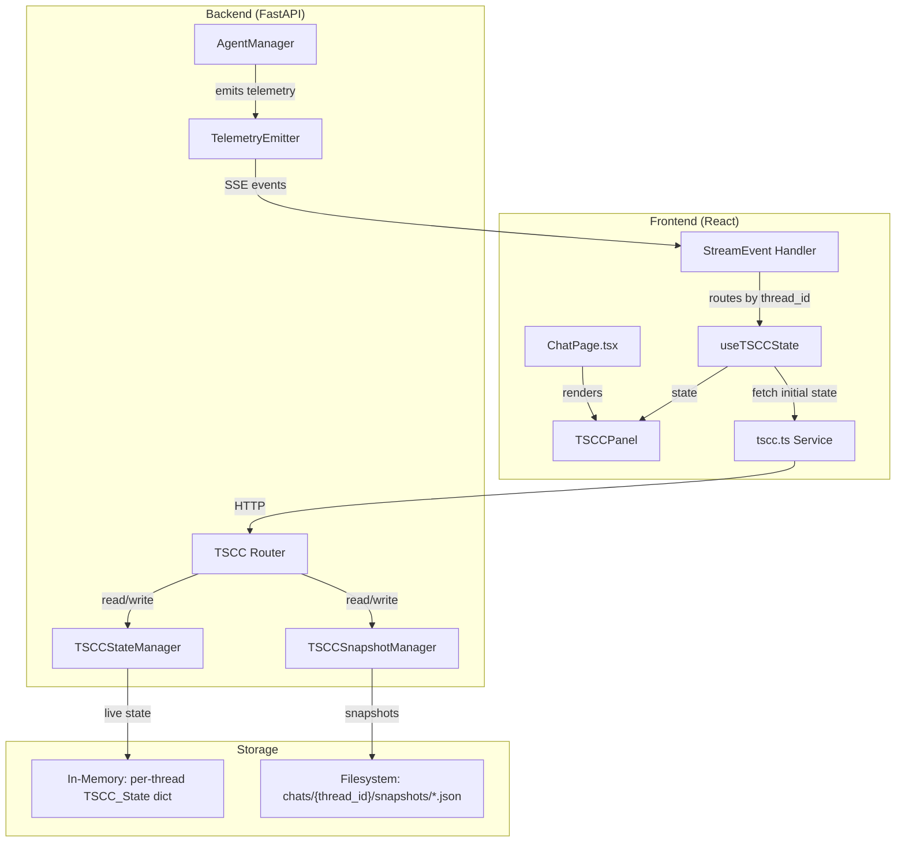
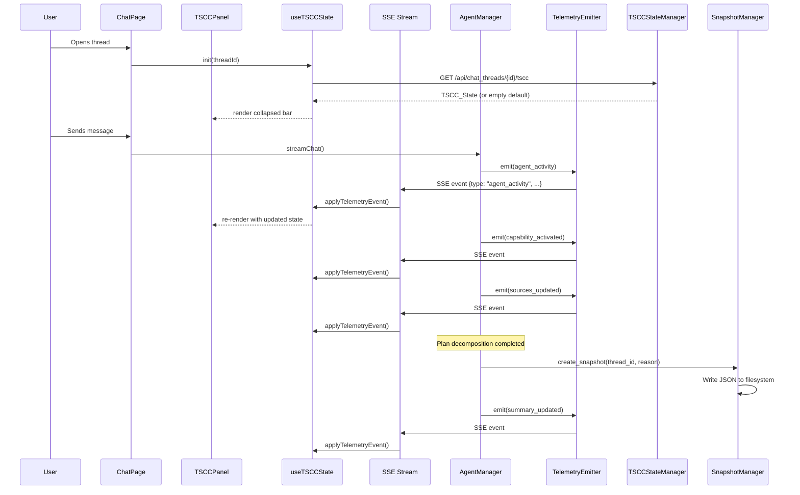
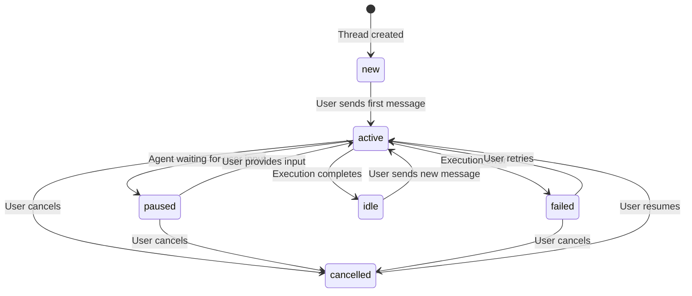
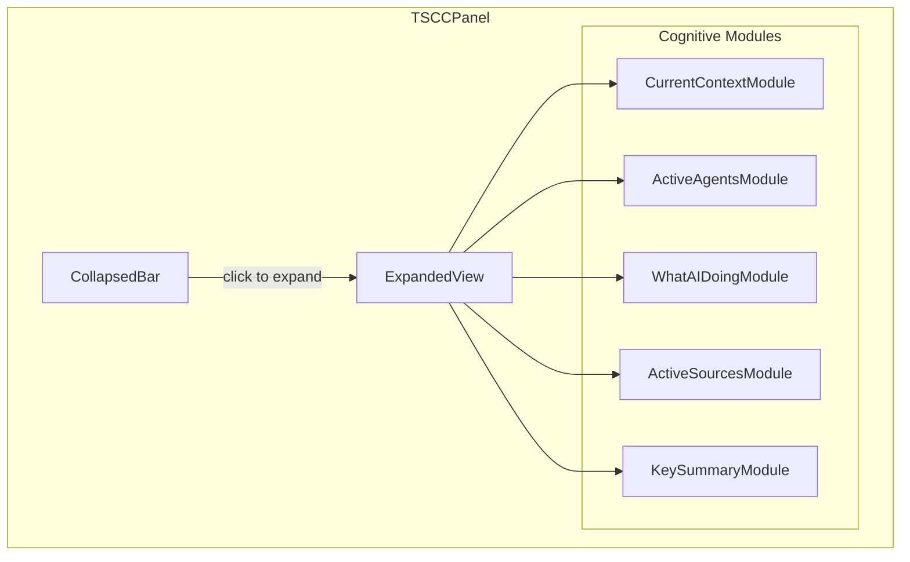

# Design Document — Thread-Scoped Cognitive Context (TSCC)

## Overview

TSCC is a thread-owned, collapsible cognitive context panel placed directly above the chat input box in SwarmAI. It provides live, thread-specific cognitive context without interrupting chat flow, and is archived with the chat thread via periodic snapshots.

TSCC answers six questions for the current thread:
1. **Where am I working?** — scope clarity (workspace root vs project)
2. **What is the AI doing right now?** — live activity in human language
3. **Which agents are involved?** — execution transparency
4. **What capabilities are being used?** — skills, MCPs, tools
5. **What sources is the AI using?** — trust and grounding
6. **What is the current working conclusion?** — continuity across turns

This is Cadence 5 of the SwarmWS redesign series, building on Cadence 4 (`swarmws-intelligence`) which introduced the context assembly engine, chat thread project association, and context preview API.

### Key Design Decisions

1. **TSCC coexists with ContextPreviewPanel** — TSCC is user-facing cognitive state (above chat input); ContextPreviewPanel is developer-facing raw 8-layer context (project detail view). They share no UI state.
2. **New SSE telemetry events** — Five new event types (`agent_activity`, `tool_invocation`, `capability_activated`, `sources_updated`, `summary_updated`) emitted from the agent execution path in `agent_manager.py`.
3. **Filesystem-based snapshot storage** — JSON files in `chats/{thread_id}/snapshots/` within the project directory, not DB-stored.
4. **In-memory TSCC state** — Live TSCC state is held in-memory on the backend (per-thread dict), not persisted to DB. Snapshots are the persistence mechanism.
5. **Incremental SSE updates** — Frontend applies telemetry events incrementally to local state rather than polling or replacing entire state.
6. **LRU eviction on TSCCStateManager** (PE Review) — In-memory state dict is capped at 200 entries with LRU eviction. When the cap is reached, the least-recently-accessed thread state is evicted. This prevents unbounded memory growth in long sessions.
7. **asyncio.Lock per-thread for state mutations** (PE Review) — `TSCCStateManager` uses a per-thread `asyncio.Lock` to guard `apply_event()` and `get_state()` against concurrent access from the SSE emission path and the API router.
8. **Simplified lifecycle: no `resumed` state** (PE Review) — The `cancelled→active` transition is direct (no intermediate `resumed` state). A "Resumed" indicator is shown transiently in the collapsed bar for 5 seconds after resumption, then reverts to normal `active` display.
9. **Snapshot includes `lifecycle_state`** (PE Review) — Each `TSCCSnapshot` captures the `lifecycle_state` at the time of snapshot creation, so historical snapshots show whether the agent was active, idle, failed, etc.
10. **Snapshot retention: max 50 per thread** (PE Review) — When a thread exceeds 50 snapshots, the oldest snapshots are deleted on the next write. Prevents unbounded filesystem growth for long-running threads.
11. **Source dedup by (path, origin) tuple** (PE Review) — `active_sources` deduplication uses the `(path, origin)` pair, not just `path`. If the same file is referenced with a different origin, both entries are kept.
12. **Path normalization at emission boundary** (PE Review) — `TelemetryEmitter.sources_updated()` normalizes source paths to workspace-relative form before emission. Absolute paths, `~` prefixes, and `{app_data_dir}` references are stripped at the emission point, not just validated in tests.
13. **Snapshot filenames use colon-safe timestamps** (PE Review) — Snapshot filenames use `snapshot_{YYYY-MM-DDTHH-MM-SSZ}.json` (hyphens instead of colons) for cross-platform filesystem compatibility.

### Design Principles Alignment

| Principle | How TSCC Aligns |
|-----------|----------------|
| Chat is the Command Surface | TSCC enhances the chat interface without replacing it |
| Visible Planning Builds Trust | Makes agent reasoning, capabilities, and sources transparent |
| Multi-Agent Orchestration Should Be Visible | Shows active agents and their roles in real-time |
| Context > Conversation | Surfaces what context and sources the agent is using |
| Gradual Disclosure | Collapsed by default, expands on demand or high-signal events |

---

## Architecture

### High-Level Architecture



### Component Interaction Flow



### Thread Lifecycle State Machine



---

## Components and Interfaces

### Backend Components

#### 1. TelemetryEmitter (`backend/core/telemetry_emitter.py`)

Responsible for emitting TSCC telemetry events during agent execution. Injected into the `_run_query_on_client` message loop in `AgentManager`.

```python
class TelemetryEvent(BaseModel):
    """A single TSCC telemetry event emitted via SSE."""
    type: str  # agent_activity | tool_invocation | capability_activated | sources_updated | summary_updated
    thread_id: str
    timestamp: str  # ISO 8601
    data: dict

class TelemetryEmitter:
    """Emits TSCC telemetry events as SSE-compatible dicts.

    Used within AgentManager._run_query_on_client() to yield
    telemetry events alongside normal chat SSE events.
    """

    def __init__(self, thread_id: str):
        ...

    def agent_activity(self, agent_name: str, description: str) -> dict:
        """Emit when an agent begins or completes a reasoning step."""
        ...

    def tool_invocation(self, tool_name: str, description: str) -> dict:
        """Emit when a tool is invoked during agent execution."""
        ...

    def capability_activated(self, cap_type: str, cap_name: str, label: str) -> dict:
        """Emit when a skill/MCP/tool is activated. cap_type: 'skill'|'mcp'|'tool'."""
        ...

    def sources_updated(self, source_path: str, origin: str) -> dict:
        """Emit when agent references a new source. origin: 'Project'|'Knowledge Base'|'Notes'|'Memory'|'External MCP'.
        
        PE Review: Normalizes source_path to workspace-relative form before emission.
        Strips absolute paths, ~ prefixes, and {app_data_dir} references.
        """
        ...

    def summary_updated(self, key_summary: list[str]) -> dict:
        """Emit when the agent's working conclusion changes."""
        ...
```

#### 2. TSCCStateManager (`backend/core/tscc_state_manager.py`)

Manages in-memory live TSCC state per thread. State is built up from telemetry events and can be retrieved via API.

```python
class TSCCLiveState(BaseModel):
    """The live cognitive state for a single thread."""
    context: dict  # {scope_label: str, thread_title: str, mode: Optional[str]}
    active_agents: list[str]
    active_capabilities: dict  # {skills: [str], mcps: [str], tools: [str]}
    what_ai_doing: list[str]  # max 4 items
    active_sources: list[dict]  # [{path: str, origin: str}]
    key_summary: list[str]  # max 5 items

class TSCCState(BaseModel):
    """Full TSCC state for a thread."""
    thread_id: str
    project_id: Optional[str]
    scope_type: str  # "workspace" | "project"
    last_updated_at: str  # ISO 8601
    lifecycle_state: str  # new | active | paused | failed | cancelled | idle
    live_state: TSCCLiveState

class TSCCStateManager:
    """In-memory manager for per-thread TSCC live state.

    State is ephemeral — rebuilt from telemetry events during execution.
    Snapshots provide the persistence mechanism.

    PE Review fixes:
    - LRU eviction: capped at max_entries (default 200) to prevent memory leaks
    - Per-thread asyncio.Lock: guards concurrent access from SSE emission and API reads
    - Source dedup by (path, origin) tuple, not just path
    - Path normalization: sources_updated events are validated for workspace-relative paths
    """

    def __init__(self, max_entries: int = 200):
        self._states: OrderedDict[str, TSCCState] = OrderedDict()
        self._locks: dict[str, asyncio.Lock] = {}
        self._max_entries = max_entries

    def _get_lock(self, thread_id: str) -> asyncio.Lock:
        """Get or create a per-thread lock."""
        if thread_id not in self._locks:
            self._locks[thread_id] = asyncio.Lock()
        return self._locks[thread_id]

    async def get_state(self, thread_id: str) -> Optional[TSCCState]:
        """Return current TSCC state for a thread, or None. Moves to MRU position."""
        async with self._get_lock(thread_id):
            if thread_id in self._states:
                self._states.move_to_end(thread_id)
                return self._states[thread_id]
            return None

    async def get_or_create_state(self, thread_id: str, project_id: Optional[str], thread_title: str) -> TSCCState:
        """Get existing state or create a new default state. Enforces LRU eviction."""
        async with self._get_lock(thread_id):
            if thread_id in self._states:
                self._states.move_to_end(thread_id)
                return self._states[thread_id]
            # Evict LRU entry if at capacity
            if len(self._states) >= self._max_entries:
                evicted_id, _ = self._states.popitem(last=False)
                self._locks.pop(evicted_id, None)
            state = TSCCState(...)  # create default
            self._states[thread_id] = state
            return state

    async def apply_event(self, thread_id: str, event: dict) -> None:
        """Apply a telemetry event to update the thread's live state.
        
        Source dedup uses (path, origin) tuple, not just path.
        """
        async with self._get_lock(thread_id):
            ...

    async def set_lifecycle_state(self, thread_id: str, state: str) -> None:
        """Update the thread lifecycle state. Validates against state machine.
        
        Valid transitions (PE Review: no 'resumed' state):
        new→active, active→paused, active→failed, active→cancelled, active→idle,
        paused→active, paused→cancelled, failed→active, failed→cancelled,
        cancelled→active, idle→active
        """
        async with self._get_lock(thread_id):
            ...

    def clear_state(self, thread_id: str) -> None:
        """Remove state for a thread (e.g., on thread deletion)."""
        self._states.pop(thread_id, None)
        self._locks.pop(thread_id, None)
```

#### 3. TSCCSnapshotManager (`backend/core/tscc_snapshot_manager.py`)

Manages filesystem-based snapshot creation and retrieval.

```python
class TSCCSnapshot(BaseModel):
    """A point-in-time capture of TSCC state."""
    snapshot_id: str
    thread_id: str
    timestamp: str  # ISO 8601
    reason: str  # Snapshot trigger reason
    lifecycle_state: str  # PE Review: captures lifecycle state at snapshot time
    active_agents: list[str]
    active_capabilities: dict  # {skills: [str], mcps: [str], tools: [str]}
    what_ai_doing: list[str]
    active_sources: list[dict]  # [{path: str, origin: str}]
    key_summary: list[str]

class TSCCSnapshotManager:
    """Manages TSCC snapshot creation and retrieval on the filesystem.

    Snapshots are stored as JSON files in:
      {workspace_path}/Projects/{project}/chats/{thread_id}/snapshots/
    or for workspace-scoped threads:
      {workspace_path}/chats/{thread_id}/snapshots/

    PE Review fixes:
    - Accepts TSCCStateManager for thread→project path resolution
    - Snapshot includes lifecycle_state
    - Max 50 snapshots per thread with oldest-first eviction
    - Colon-safe filenames: snapshot_{YYYY-MM-DDTHH-MM-SSZ}.json
    """

    MAX_SNAPSHOTS_PER_THREAD = 50

    def __init__(self, workspace_manager: SwarmWorkspaceManager, state_manager: TSCCStateManager):
        self._workspace_manager = workspace_manager
        self._state_manager = state_manager

    async def create_snapshot(
        self, thread_id: str, state: TSCCState, reason: str
    ) -> TSCCSnapshot:
        """Create a snapshot from current state. Deduplicates within 30s window.
        
        Enforces MAX_SNAPSHOTS_PER_THREAD retention — evicts oldest on overflow.
        Filename uses colon-safe timestamp format.
        """
        ...

    async def list_snapshots(self, thread_id: str) -> list[TSCCSnapshot]:
        """List all snapshots for a thread in chronological order."""
        ...

    async def get_snapshot(self, thread_id: str, snapshot_id: str) -> Optional[TSCCSnapshot]:
        """Get a single snapshot by ID."""
        ...

    def _get_snapshot_dir(self, thread_id: str) -> Path:
        """Resolve the snapshot directory path for a thread.
        
        Uses TSCCStateManager to determine if thread is workspace-scoped or project-scoped,
        then resolves to the appropriate path.
        """
        ...

    def _is_duplicate(self, snapshot_dir: Path, reason: str, window_seconds: int = 30) -> bool:
        """Check if a snapshot with the same reason exists within the dedup window."""
        ...

    def _enforce_retention(self, snapshot_dir: Path) -> None:
        """Delete oldest snapshots if count exceeds MAX_SNAPSHOTS_PER_THREAD."""
        ...
```

#### 4. TSCC Router (`backend/routers/tscc.py`)

FastAPI router for TSCC state and snapshot endpoints. Follows existing router patterns (e.g., `backend/routers/chat.py`).

```python
router = APIRouter(prefix="/api/chat_threads", tags=["tscc"])

@router.get("/{thread_id}/tscc")
async def get_tscc_state(thread_id: str) -> dict:
    """Return current TSCC state for a thread. Returns 404 if thread not found."""
    ...

@router.post("/{thread_id}/snapshots")
async def create_snapshot(thread_id: str, request: SnapshotCreateRequest) -> dict:
    """Create a TSCC snapshot with a specified trigger reason."""
    ...

@router.get("/{thread_id}/snapshots")
async def list_snapshots(thread_id: str) -> list[dict]:
    """List all snapshots for a thread in chronological order."""
    ...

@router.get("/{thread_id}/snapshots/{snapshot_id}")
async def get_snapshot(thread_id: str, snapshot_id: str) -> dict:
    """Get a single snapshot. Returns 404 if not found."""
    ...
```

### Frontend Components

#### 5. TSCCPanel (`desktop/src/pages/chat/components/TSCCPanel.tsx`)

The main TSCC React component. Renders between the message list and ChatInput in ChatPage.



```typescript
interface TSCCPanelProps {
  threadId: string;
  tsccState: TSCCState;
  isExpanded: boolean;
  isPinned: boolean;
  onToggleExpand: () => void;
  onTogglePin: () => void;
}

// CollapsedBar: single-line summary
// scope label | agent count | capability summary (up to 2) | source count | freshness indicator
// Click anywhere to expand. Pin toggle to keep expanded.

// ExpandedView: max-height of 280px with internal overflow-y: auto scrolling.
// Prevents the panel from pushing ChatInput off-screen on small viewports.

// ExpandedView: five cognitive modules
// Each module is a self-contained component receiving its slice of TSCCState.
```

#### 6. useTSCCState Hook (`desktop/src/hooks/useTSCCState.ts`)

Dedicated React hook for TSCC state management. Follows the same patterns as `useTabState` and `useSidebarState`.

```typescript
interface UseTSCCStateReturn {
  tsccState: TSCCState | null;
  isExpanded: boolean;
  isPinned: boolean;
  lifecycleState: ThreadLifecycleState;
  toggleExpand: () => void;
  togglePin: () => void;
  applyTelemetryEvent: (event: TelemetryEvent) => void;
  setAutoExpand: (expanded: boolean) => void;
}

function useTSCCState(threadId: string | null): UseTSCCStateReturn;

// Behavior:
// - Fetches initial TSCC state from GET /api/chat_threads/{threadId}/tscc on mount or threadId change
// - Maintains per-thread expand/collapse preference in memory (Map<threadId, boolean>)
// - applyTelemetryEvent() incrementally updates state based on incoming SSE events
// - Resets state cleanly when threadId changes (no cross-thread leakage)
// - Does NOT persist expand/collapse to localStorage (per Req 19.4)
```

#### 7. TSCC Service (`desktop/src/services/tscc.ts`)

API service layer with snake_case → camelCase conversion.

```typescript
// Follows existing service patterns (e.g., desktop/src/services/agents.ts)

function toCamelCase(data: any): TSCCState { ... }
function snapshotToCamelCase(data: any): TSCCSnapshot { ... }

async function getTSCCState(threadId: string): Promise<TSCCState>;
async function createSnapshot(threadId: string, reason: string): Promise<TSCCSnapshot>;
async function listSnapshots(threadId: string): Promise<TSCCSnapshot[]>;
async function getSnapshot(threadId: string, snapshotId: string): Promise<TSCCSnapshot>;
```

#### 8. TSCCSnapshotCard (`desktop/src/pages/chat/components/TSCCSnapshotCard.tsx`)

Inline collapsible card rendered within thread message history at the chronological position of the snapshot.

```typescript
interface TSCCSnapshotCardProps {
  snapshot: TSCCSnapshot;
}

// Collapsed: shows timestamp + trigger reason
// Expanded: shows agents, capabilities, sources, activity, key summary
```

### Integration Points

#### ChatPage.tsx Changes

TSCC_Panel is inserted between the message list and ChatInput:

```
{/* Existing message list */}
<div className="messages-list">...</div>

{/* NEW: TSCC Panel */}
<TSCCPanel
  threadId={activeThreadId}
  tsccState={tsccState}
  isExpanded={isExpanded}
  isPinned={isPinned}
  onToggleExpand={toggleExpand}
  onTogglePin={togglePin}
/>

{/* Existing chat input */}
<ChatInput ... />
```

#### StreamEvent Extension

The existing `StreamEvent` interface in `desktop/src/types/index.ts` is extended:

```typescript
export interface StreamEvent {
  type: 'assistant' | 'tool_use' | 'tool_result' | 'result' | 'error'
    | 'ask_user_question' | 'session_start' | 'session_cleared'
    | 'permission_request' | 'permission_decision' | 'permission_acknowledged'
    | 'heartbeat'
    // NEW: TSCC telemetry events
    | 'agent_activity' | 'tool_invocation' | 'capability_activated'
    | 'sources_updated' | 'summary_updated';

  // ... existing fields ...

  // NEW: TSCC telemetry fields
  threadId?: string;        // All telemetry events
  agentName?: string;       // agent_activity
  description?: string;     // agent_activity, tool_invocation
  capabilityType?: string;  // capability_activated: 'skill' | 'mcp' | 'tool'
  capabilityName?: string;  // capability_activated
  label?: string;           // capability_activated
  sourcePath?: string;      // sources_updated
  origin?: string;          // sources_updated
  keySummary?: string[];    // summary_updated
}
```

#### AgentManager Integration

Telemetry events are yielded from `_run_query_on_client` alongside existing SSE events. The `TelemetryEmitter` is instantiated per-query with the thread_id and yields events at key points:

- **agent_activity**: When `_format_message` processes an `AssistantMessage` (agent reasoning step)
- **tool_invocation**: When `_format_message` processes a `ToolUseMessage`
- **capability_activated**: When `_resolve_allowed_tools` or `_build_mcp_config` activates a capability
- **sources_updated**: When the agent references a file via tool use (detected from tool input paths)
- **summary_updated**: When a `ResultMessage` completes a multi-turn execution phase

---

## Data Models

### Backend Pydantic Models (snake_case)

#### TSCC_State

```python
class TSCCContext(BaseModel):
    scope_label: str          # "Workspace: SwarmWS (General)" or "Project: {name}"
    thread_title: str
    mode: Optional[str] = None  # "Research" | "Writing" | "Debugging" | "Exploration" | None

class TSCCActiveCapabilities(BaseModel):
    skills: list[str] = []
    mcps: list[str] = []
    tools: list[str] = []

class TSCCSource(BaseModel):
    path: str       # Workspace-relative path
    origin: str     # "Project" | "Knowledge Base" | "Notes" | "Memory" | "External MCP"

class TSCCLiveState(BaseModel):
    context: TSCCContext
    active_agents: list[str] = []
    active_capabilities: TSCCActiveCapabilities = TSCCActiveCapabilities()
    what_ai_doing: list[str] = []       # max 4 items
    active_sources: list[TSCCSource] = []
    key_summary: list[str] = []          # max 5 items

class TSCCState(BaseModel):
    thread_id: str
    project_id: Optional[str] = None
    scope_type: str                      # "workspace" | "project"
    last_updated_at: str                 # ISO 8601
    lifecycle_state: str = "new"         # new | active | paused | failed | cancelled | idle
    live_state: TSCCLiveState
```

#### TSCC_Snapshot

```python
class TSCCSnapshot(BaseModel):
    snapshot_id: str
    thread_id: str
    timestamp: str                       # ISO 8601
    reason: str                          # Snapshot trigger description
    lifecycle_state: str                 # PE Review: lifecycle state at snapshot time
    active_agents: list[str]
    active_capabilities: TSCCActiveCapabilities
    what_ai_doing: list[str]
    active_sources: list[TSCCSource]
    key_summary: list[str]
```

### Frontend TypeScript Interfaces (camelCase)

```typescript
interface TSCCContext {
  scopeLabel: string;
  threadTitle: string;
  mode?: string;
}

interface TSCCActiveCapabilities {
  skills: string[];
  mcps: string[];
  tools: string[];
}

interface TSCCSource {
  path: string;
  origin: string;
}

interface TSCCLiveState {
  context: TSCCContext;
  activeAgents: string[];
  activeCapabilities: TSCCActiveCapabilities;
  whatAiDoing: string[];
  activeSources: TSCCSource[];
  keySummary: string[];
}

type ThreadLifecycleState = 'new' | 'active' | 'paused' | 'failed' | 'cancelled' | 'idle';
type ScopeType = 'workspace' | 'project';

interface TSCCState {
  threadId: string;
  projectId: string | null;
  scopeType: ScopeType;
  lastUpdatedAt: string;
  lifecycleState: ThreadLifecycleState;
  liveState: TSCCLiveState;
}

interface TSCCSnapshot {
  snapshotId: string;
  threadId: string;
  timestamp: string;
  reason: string;
  lifecycleState: ThreadLifecycleState;
  activeAgents: string[];
  activeCapabilities: TSCCActiveCapabilities;
  whatAiDoing: string[];
  activeSources: TSCCSource[];
  keySummary: string[];
}

// Telemetry event types for SSE routing
type TelemetryEventType = 'agent_activity' | 'tool_invocation' | 'capability_activated' | 'sources_updated' | 'summary_updated';
```

### Snapshot Filesystem Layout

```
{workspace_path}/
├── chats/                          # Workspace-scoped threads
│   └── {thread_id}/
│       └── snapshots/
│           ├── snapshot_2025-01-15T10:30:00Z.json
│           └── snapshot_2025-01-15T11:45:00Z.json
└── Projects/
    └── {project_name}/
        └── chats/                  # Project-scoped threads
            └── {thread_id}/
                └── snapshots/
                    └── snapshot_2025-01-15T10:30:00Z.json
```

Snapshot filename pattern: `snapshot_{ISO_8601_timestamp}.json`

### Snapshot JSON Example

```json
{
  "snapshot_id": "a1b2c3d4-e5f6-7890-abcd-ef1234567890",
  "thread_id": "thread-abc-123",
  "timestamp": "2025-01-15T10:30:00Z",
  "reason": "Plan decomposition completed",
  "active_agents": ["ResearchAgent", "StrategyPlanner"],
  "active_capabilities": {
    "skills": ["Market Analysis"],
    "mcps": ["Google Drive Connector"],
    "tools": ["Web Search"]
  },
  "what_ai_doing": [
    "Analyzing competitor positioning",
    "Drafting go-to-market outline"
  ],
  "active_sources": [
    {"path": "Projects/GTM/research/competitors.md", "origin": "Project"},
    {"path": "Knowledge/Memory/pricing-notes.md", "origin": "Knowledge Base"}
  ],
  "key_summary": [
    "Enter mid-market via channel partners",
    "Differentiate on compliance + onboarding speed"
  ]
}
```

### Freshness Indicator Formatting

The collapsed bar's freshness indicator converts `last_updated_at` to a relative time label:

| Elapsed Time | Display |
|---|---|
| < 30 seconds | "Updated just now" |
| 30s – 59s | "Updated Xs ago" |
| 1m – 59m | "Updated Xm ago" |
| 1h – 23h | "Updated Xh ago" |
| ≥ 24h | "Updated Xd ago" |

The indicator updates every 30 seconds via a `setInterval` in the `useTSCCState` hook.

---

## Correctness Properties

*A property is a characteristic or behavior that should hold true across all valid executions of a system — essentially, a formal statement about what the system should do. Properties serve as the bridge between human-readable specifications and machine-verifiable correctness guarantees.*

### Property 1: Panel visibility across all thread states

*For any* thread lifecycle state (`new`, `active`, `paused`, `failed`, `cancelled`, `idle`) and any project association (including null), the TSCC_Panel component should render without errors and produce a non-empty collapsed bar.

**Validates: Requirements 1.2, 9.1–9.7**

### Property 2: Collapsed bar content completeness

*For any* valid TSCC_State, the collapsed bar summary string should contain: the scope label, the active agent count (as a number), at most 2 capability names, the source count (as a number), and a freshness indicator derived from `last_updated_at`.

**Validates: Requirements 2.2**

### Property 3: Scope label correctness

*For any* TSCC_State where `scope_type` is `"workspace"`, the `context.scope_label` should be `"Workspace: SwarmWS (General)"`. *For any* TSCC_State where `scope_type` is `"project"` and `project_id` is non-null, the `context.scope_label` should contain the project's display name. The `context.thread_title` should always be present, and `context.mode` should appear only when set.

**Validates: Requirements 3.1, 3.2, 3.3, 8.1, 8.2**

### Property 4: No negative scope labels

*For any* TSCC_State, the `context.scope_label` field should never contain the substrings `"None"`, `"No project"`, `"not selected"`, or be empty.

**Validates: Requirements 3.5, 8.4**

### Property 5: List length enforcement

*For any* TSCC_State, the `what_ai_doing` list should contain at most 4 items, and the `key_summary` list should contain at most 5 items. Applying a telemetry event that would exceed these limits should truncate the oldest entries.

**Validates: Requirements 5.1, 7.1**

### Property 6: Source paths are workspace-relative

*For any* source in `active_sources`, the `path` field should not start with `/`, `~`, or contain `{app_data_dir}`. All paths should be relative to the workspace root.

**Validates: Requirements 6.5**

### Property 7: Lifecycle state machine validity

*For any* sequence of lifecycle state transitions, each transition should follow the valid state machine: `new→active`, `active→paused`, `active→failed`, `active→cancelled`, `active→idle`, `paused→active`, `paused→cancelled`, `failed→active`, `failed→cancelled`, `cancelled→active`, `idle→active`. Any transition not in this set should be rejected.

**Validates: Requirements 9.2, 9.3, 9.4, 9.5, 9.6, 9.7**

### Property 8: Snapshot round-trip

*For any* valid TSCC_State, creating a snapshot via `TSCCSnapshotManager.create_snapshot()` and then reading it back via `get_snapshot()` should produce a snapshot containing all required fields (`snapshot_id`, `thread_id`, `timestamp`, `reason`, `active_agents`, `active_capabilities`, `what_ai_doing`, `active_sources`, `key_summary`) with values matching the original state. The snapshot filename should match the pattern `snapshot_{ISO_8601}.json`.

**Validates: Requirements 10.2, 10.3, 10.4, 18.1, 18.2, 18.3**

### Property 9: Snapshot deduplication within 30-second window

*For any* thread and trigger reason, creating two snapshots with the same reason within 30 seconds should result in only one snapshot file. Creating a snapshot with the same reason after 30 seconds should succeed and produce a second file.

**Validates: Requirements 10.5**

### Property 10: Thread isolation — no cross-thread data leakage

*For any* two distinct thread IDs, applying a telemetry event with `thread_id=A` should only modify the TSCC_State for thread A. The state for thread B should remain unchanged. When the active thread switches from A to B, the displayed state should contain only data from thread B.

**Validates: Requirements 12.1, 12.3, 14.2, 14.4, 4.3, 6.3**

### Property 11: Per-thread expand/collapse preference preservation

*For any* sequence of thread switches (A→B→A), the expand/collapse state for thread A should be preserved when switching back from B. The preference map should maintain independent boolean values per thread ID.

**Validates: Requirements 12.2, 19.4**

### Property 12: Incremental telemetry event application

*For any* TSCC_State and any valid telemetry event, applying the event via `applyTelemetryEvent()` should produce a new state where only the fields relevant to that event type are modified, and all other fields remain unchanged. Specifically: `agent_activity` updates `what_ai_doing` and `active_agents`; `tool_invocation` updates `what_ai_doing`; `capability_activated` adds to the appropriate `active_capabilities` category; `sources_updated` adds to `active_sources` (deduplicated by path+origin tuple); `summary_updated` replaces `key_summary`.

**Validates: Requirements 14.3, 19.3, 4.5, 5.4**

### Property 13: Telemetry event structure validity

*For any* telemetry event emitted by `TelemetryEmitter`, the event dict should contain a `type` field matching one of the five telemetry types, a `thread_id` field (non-empty string), a `timestamp` field (valid ISO 8601), and a `data` dict with the fields specified for that event type. All field names in the payload should be snake_case.

**Validates: Requirements 13.1, 13.2, 13.3, 13.4, 13.5, 13.6, 13.7**

### Property 14: API response snake_case / frontend camelCase round-trip

*For any* TSCC_State or TSCC_Snapshot returned by the backend API, all field names should be snake_case. Applying the frontend `toCamelCase()` conversion and then a `toSnakeCase()` conversion should produce field names identical to the original backend response.

**Validates: Requirements 15.5, 15.6, 11.5**

### Property 15: Auto-expand only for high-signal events

*For any* stream of SSE events during normal chat operation, the TSCC_Panel should remain in its current expand/collapse state unless one of the high-signal events occurs (first plan creation, blocking issue, explicit user request). Normal `assistant`, `tool_use`, and `tool_result` events should never trigger auto-expand.

**Validates: Requirements 16.1, 16.2**

### Property 16: TSCC and ContextPreviewPanel state independence

*For any* sequence of expand/collapse operations on the TSCC_Panel, the ContextPreviewPanel's expand/collapse state should remain unchanged, and vice versa.

**Validates: Requirements 17.4**

### Property 17: 404 for non-existent resources

*For any* randomly generated thread_id or snapshot_id that does not exist in the system, the TSCC API endpoints should return HTTP 404.

**Validates: Requirements 15.4**

### Property 18: Error state produces human-readable description

*For any* error event applied to TSCC_State, the resulting `what_ai_doing` entries should not contain raw error codes, stack traces, HTTP status codes, or internal pipeline stage names. The description should be a human-readable sentence.

**Validates: Requirements 5.5, 9.4**

---

## Error Handling

### Backend Error Handling

| Error Scenario | Handling Strategy | User-Facing Behavior |
|---|---|---|
| Thread not found (GET /tscc) | Return 404 with `{"detail": "Thread not found"}` | Hook falls back to default empty state |
| Snapshot directory doesn't exist | Create directory on first snapshot write | Transparent to user |
| Snapshot file corrupted/unreadable | Log warning, skip corrupted file, return remaining snapshots | Missing snapshot in history |
| Filesystem write failure (snapshot) | Log error, return 500, do not crash agent execution | Snapshot silently skipped |
| Duplicate snapshot within 30s window | Silently skip, return existing snapshot | No visible effect |
| TelemetryEmitter error during agent execution | Catch and log, do not interrupt agent SSE stream | TSCC may show stale data |
| Invalid telemetry event data | Validate via Pydantic, log and skip invalid events | TSCC shows last valid state |

### Frontend Error Handling

| Error Scenario | Handling Strategy | User-Facing Behavior |
|---|---|---|
| Initial TSCC state fetch fails | Show default empty state with lifecycle `new` | Panel shows "Ready" |
| Telemetry event with wrong thread_id | Silently ignore (filter by active thread_id) | No effect |
| Malformed telemetry event | Catch in applyTelemetryEvent, log, skip | TSCC shows last valid state |
| Snapshot list fetch fails | Show empty snapshot list, log error | No snapshot cards in history |
| SSE connection drops | Existing SSE reconnection handles this; TSCC state may be stale until reconnect | Freshness indicator shows age |
| Backend restart (state lost) | On 404 or empty state from GET /tscc, reset local state to default; show "Reconnecting..." briefly in collapsed bar, then "Ready" | Panel shows "Ready" after brief reconnection indicator |

### Resilience Principles

1. **TSCC never blocks chat** — All TSCC operations (state fetch, snapshot creation, telemetry emission) are non-blocking. Failures in TSCC should never interrupt the chat SSE stream or prevent user input.
2. **Graceful degradation** — If TSCC state is unavailable, the panel shows a sensible default ("Ready") rather than an error state.
3. **Telemetry is best-effort** — Telemetry events are emitted on a best-effort basis. Missing events result in slightly stale TSCC state, not errors.
4. **Snapshot writes are idempotent** — The deduplication window and filesystem-based storage ensure that retries or duplicate triggers don't produce corrupt state.
5. **Backend restart recovery** — If the backend restarts and in-memory TSCC state is lost, the frontend detects the empty/default state response and resets gracefully. The collapsed bar shows "Reconnecting..." briefly, then falls back to "Ready". No stale data is displayed.

---

## Testing Strategy

### Dual Testing Approach

This feature requires both unit tests and property-based tests:

- **Unit tests**: Verify specific examples, edge cases, error conditions, and UI rendering
- **Property tests**: Verify universal properties across all valid inputs using randomized generation

### Property-Based Testing Configuration

- **Backend**: Use `hypothesis` library for Python property-based tests
- **Frontend**: Use `fast-check` library for TypeScript property-based tests
- **Minimum iterations**: 100 per property test
- **Tag format**: `Feature: thread-scoped-cognitive-context, Property {N}: {title}`

Each correctness property above maps to a single property-based test. The test must reference its design property via the tag format.

### Backend Test Plan

#### Property Tests (hypothesis)

| Test | Property | Description |
|------|----------|-------------|
| `test_property_panel_visibility` | P1 | Generate random lifecycle states and project associations, verify state creation succeeds |
| `test_property_collapsed_bar_content` | P2 | Generate random TSCC states, verify collapsed bar summary contains all required fields |
| `test_property_scope_label_correctness` | P3 | Generate random scope types and project IDs, verify scope label matches rules |
| `test_property_no_negative_labels` | P4 | Generate random TSCC states, verify scope label contains no forbidden substrings |
| `test_property_list_length_enforcement` | P5 | Generate random event sequences, verify what_ai_doing ≤ 4 and key_summary ≤ 5 |
| `test_property_source_paths_relative` | P6 | Generate random source paths, verify none are absolute |
| `test_property_lifecycle_state_machine` | P7 | Generate random transition sequences, verify only valid transitions succeed |
| `test_property_snapshot_round_trip` | P8 | Generate random TSCC states, create snapshot, read back, verify equality |
| `test_property_snapshot_dedup` | P9 | Create two snapshots within 30s, verify only one exists |
| `test_property_thread_isolation` | P10 | Generate events for two threads, verify no cross-contamination |
| `test_property_telemetry_event_structure` | P13 | Generate random event parameters, verify output structure |
| `test_property_api_snake_case` | P14 | Generate random TSCC states, serialize, verify all keys are snake_case |
| `test_property_404_nonexistent` | P17 | Generate random UUIDs, verify 404 response |
| `test_property_error_human_readable` | P18 | Generate random error messages, verify no raw codes in output |

#### Unit Tests

| Test | Focus |
|------|-------|
| `test_tscc_state_manager_get_or_create` | Default state creation with correct fields |
| `test_tscc_state_manager_apply_each_event_type` | One test per telemetry event type |
| `test_tscc_state_manager_clear_state` | State removal |
| `test_snapshot_manager_create_and_list` | Snapshot CRUD operations |
| `test_snapshot_filename_format` | Filename pattern validation |
| `test_tscc_router_endpoints` | API endpoint integration tests |
| `test_telemetry_emitter_all_event_types` | Each emitter method produces correct dict |

### Frontend Test Plan

#### Property Tests (fast-check)

| Test | Property | Description |
|------|----------|-------------|
| `test_property_incremental_event_application` | P12 | Generate random event sequences, verify only relevant fields change |
| `test_property_thread_switch_isolation` | P10 | Generate random thread switches, verify no leakage |
| `test_property_expand_collapse_preservation` | P11 | Generate random switch sequences, verify preference preserved |
| `test_property_auto_expand_high_signal_only` | P15 | Generate random event streams, verify auto-expand rules |
| `test_property_tscc_context_preview_independence` | P16 | Generate random toggle sequences, verify independence |

#### Unit Tests

| Test | Focus |
|------|-------|
| `test_useTSCCState_initial_fetch` | Hook fetches state on mount |
| `test_useTSCCState_threadId_change_resets` | State resets on thread switch |
| `test_collapsed_bar_renders_all_fields` | Collapsed bar content |
| `test_expanded_view_renders_all_modules` | All 5 cognitive modules render |
| `test_snapshot_card_collapsed_default` | Snapshot card starts collapsed |
| `test_keyboard_navigation` | Enter/Space expand, ARIA attributes |
| `test_toCamelCase_conversion` | snake_case → camelCase for all TSCC fields |
| `test_idle_state_display` | "Ready" text when idle |
| `test_empty_agents_display` | "Using core SwarmAgent only" text |
| `test_empty_sources_display` | "Using conversation context only" text |
| `test_empty_summary_display` | "No summary yet" text |
