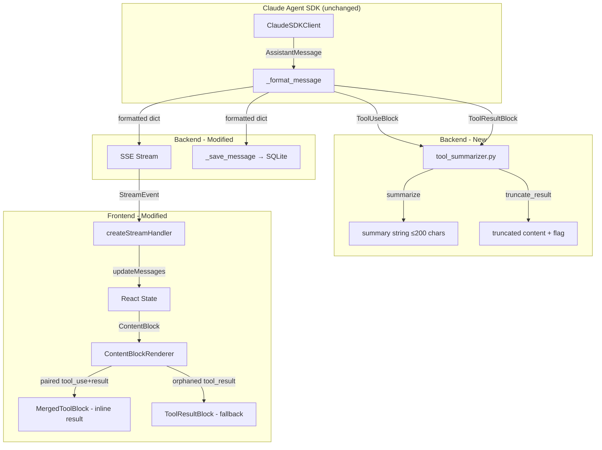

<!-- PE-REVIEWED -->
# Design Document: Tool Call Streaming Optimization

## Overview

This feature optimizes the SwarmAI chat streaming pipeline by replacing full tool call JSON inputs with short human-readable summaries and truncating large tool result content. The Claude Agent SDK manages the full conversation context internally — our `_format_message()` and `_save_message()` only serve the UI replay path (SSE stream → React state → SQLite). This means we can safely summarize and truncate without affecting the agent's reasoning.

The optimization touches three layers:
1. **Backend summarizer** — new `tool_summarizer.py` module that generates ≤200-char summaries from tool name + input
2. **Backend format/save** — `_format_message()` emits summarized tool_use and truncated tool_result; `_save_message()` persists the same reduced content
3. **Frontend rendering** — updated TypeScript types, new MergedToolBlock component (pairs tool_use + tool_result into single visual unit), simplified ToolUseBlock/ToolResultBlock as fallbacks

### Data Flow (Before → After)

```
BEFORE:
  SDK ToolUseBlock → _format_message() → SSE {type, id, name, input: {full JSON}} → React state → ToolUseBlock (expand/collapse JSON)
  SDK ToolResultBlock → _format_message() → SSE {type, tool_use_id, content: "full output"} → React state → ToolResultBlock (expand/collapse)

AFTER:
  SDK ToolUseBlock → summarize() → _format_message() → SSE {type, id, name, summary: "Reading foo.py"} → React state
  SDK ToolResultBlock → truncate() → _format_message() → SSE {type, tool_use_id, content: "first 500 chars", truncated: true} → React state
  React render: ContentBlockRenderer pairs tool_use + tool_result via resultMap → MergedToolBlock (single visual unit with inline result)
```

## Architecture



Key architectural decisions:
- **Single transformation point**: `_format_message()` is the only place where SDK messages are converted to SSE/DB format. Both SSE emission and DB persistence use the same transformed content (Requirement 7.5).
- **Separate summarizer module**: `tool_summarizer.py` is a pure-function module with no side effects, making it independently testable.
- **No lazy fetch**: Since the SDK manages full context, there's no need for an endpoint to retrieve untruncated content. The truncated preview is sufficient for UI replay.

## Components and Interfaces

### 1. `backend/core/tool_summarizer.py` (New Module)

Pure-function module responsible for generating human-readable summaries from tool invocations and truncating tool result content.

```python
"""Tool call summarization and result truncation for SSE/DB optimization.

This module provides pure functions for converting raw tool call inputs into
short human-readable summaries and truncating large tool result content.
The Claude Agent SDK manages full conversation context internally; these
functions only transform content for the UI replay path (SSE + SQLite).

- ``summarize_tool_use``       — Generates ≤200-char summary from tool name + input
- ``truncate_tool_result``     — Truncates content to configurable limit, sets flag
- ``MAX_SUMMARY_LENGTH``       — 200 characters
- ``DEFAULT_TRUNCATION_LIMIT`` — 500 characters
- ``SENSITIVE_PATTERNS``       — Compiled regexes for token redaction
"""

import re
from typing import Optional
import logging

logger = logging.getLogger(__name__)

MAX_SUMMARY_LENGTH: int = 200
DEFAULT_TRUNCATION_LIMIT: int = 500

# Read env var override ONCE at module load time (not per-call).
# Invalid values fall back to the default.
import os as _os
try:
    _env_limit = _os.environ.get("TOOL_RESULT_TRUNCATION_LIMIT")
    TRUNCATION_LIMIT: int = int(_env_limit) if _env_limit else DEFAULT_TRUNCATION_LIMIT
except (ValueError, TypeError):
    TRUNCATION_LIMIT: int = DEFAULT_TRUNCATION_LIMIT

# Regex patterns for sensitive token redaction in bash commands
SENSITIVE_PATTERNS: list[re.Pattern] = [
    re.compile(r'(?i)(password|passwd|pwd)\s*[=:]\s*\S+'),
    re.compile(r'(?i)(api[_-]?key|secret[_-]?key|access[_-]?key)\s*[=:]\s*\S+'),
    re.compile(r'(?i)(token|bearer)\s*[=:]\s*\S+'),
    re.compile(r'(?i)(aws[_-]?secret|aws[_-]?access)\s*[=:]\s*\S+'),
]

# Tool name → category mapping (case-insensitive via name.lower())
_BASH_NAMES: set[str] = {"bash"}
_READ_NAMES: set[str] = {"read", "readfile", "view"}
_WRITE_NAMES: set[str] = {"write", "writefile", "create", "edit"}
_SEARCH_NAMES: set[str] = {"grep", "search", "find", "glob"}
_TODOWRITE_NAMES: set[str] = {"todowrite"}


def _sanitize_command(command: str) -> str:
    """Redact sensitive tokens from a bash command string."""
    sanitized = command
    for pattern in SENSITIVE_PATTERNS:
        sanitized = pattern.sub('[REDACTED]', sanitized)
    return sanitized


def summarize_tool_use(name: str, input_data: Optional[dict]) -> str:
    """Generate a human-readable summary from tool name and input fields.

    Uses ``name.lower()`` for case-insensitive category matching against
    single lowercase sets. Logs the chosen category at DEBUG level for
    troubleshooting summary generation.

    Args:
        name: The tool name (e.g., "Bash", "Read", "Write").
        input_data: The tool input dict (may be None).

    Returns:
        A summary string, guaranteed ≤ MAX_SUMMARY_LENGTH characters.
    """
    ...  # Implementation in tasks phase


def truncate_tool_result(
    content: Optional[str],
    limit: int = TRUNCATION_LIMIT,
) -> tuple[str, bool]:
    """Truncate tool result content if it exceeds the limit.

    Args:
        content: Raw tool result content string.
        limit: Maximum character count.

    Returns:
        Tuple of (possibly truncated content, was_truncated flag).
    """
    ...  # Implementation in tasks phase
```

#### Function Signatures

| Function | Input | Output |
|---|---|---|
| `summarize_tool_use(name, input_data)` | `str`, `Optional[dict]` | `str` (≤200 chars) |
| `truncate_tool_result(content, limit)` | `Optional[str]`, `int` | `tuple[str, bool]` |
| `_sanitize_command(command)` | `str` | `str` |

#### Summary Generation Rules

| Tool Category | Name Matches | Format | Input Field |
|---|---|---|---|
| Bash | `bash` (case-insensitive) | `"Running: {sanitized_cmd}"` | `command` |
| File Read | `read`, `readfile`, `view` | `"Reading {path}"` | `path` or `file_path` |
| File Write | `write`, `writefile`, `create`, `edit` | `"Writing to {path}"` | `path` or `file_path` |
| Search | `grep`, `search`, `find`, `glob` | `"Searching for {pattern}"` | `pattern` or `query` |
| TodoWrite | `todowrite` | `"Writing {N} todos"` | `todos` (list length) |
| Fallback | anything else | `"Using {tool_name}"` | — |

All name matching uses `name.lower()` for case-insensitive comparison against a single lowercase set.

### 2. `backend/core/agent_manager.py` — `_format_message()` Changes

The existing `_format_message()` method is modified to call `summarize_tool_use()` for `ToolUseBlock` and `truncate_tool_result()` for `ToolResultBlock`.

```python
# Current ToolUseBlock handling (BEFORE):
content_blocks.append({
    "type": "tool_use",
    "id": block.id,
    "name": block.name,
    "input": block.input       # ← full JSON dict, can be huge
})

# New ToolUseBlock handling (AFTER):
from core.tool_summarizer import summarize_tool_use, truncate_tool_result

summary = summarize_tool_use(block.name, block.input)
content_blocks.append({
    "type": "tool_use",
    "id": block.id,
    "name": block.name,
    "summary": summary,        # ← short string, ≤200 chars
    # "input" field is omitted entirely
})

# Current ToolResultBlock handling (BEFORE):
content_blocks.append({
    "type": "tool_result",
    "tool_use_id": block.tool_use_id,
    "content": str(block.content) if block.content else None,
    "is_error": getattr(block, 'is_error', False)
})

# New ToolResultBlock handling (AFTER):
block_content = str(block.content) if block.content else ""
truncated_content, was_truncated = truncate_tool_result(block_content)
content_blocks.append({
    "type": "tool_result",
    "tool_use_id": block.tool_use_id,
    "content": truncated_content,
    "is_error": getattr(block, 'is_error', False),
    "truncated": was_truncated,  # ← new field
})
```

The `AskUserQuestion` special case remains unchanged — it returns early before reaching the tool_use append logic.

### 3. `backend/core/agent_manager.py` — `_save_message()` Changes

No structural changes needed. `_save_message()` receives the `content` list that was already built by `_format_message()` with summarized/truncated data. The same content blocks emitted over SSE are what get persisted to SQLite. This satisfies Requirement 7.5 (SSE and DB content match).

**ContentBlockAccumulator compatibility**: The `ContentBlockAccumulator` deduplicates blocks by key — `block.get("id")` for tool_use and `block.get("tool_use_id")` for tool_result. These keys are unchanged by this optimization (we still emit `id` and `tool_use_id`). The accumulator does NOT depend on the `input` field, so replacing it with `summary` is safe.

### 4. Frontend Type Changes — `desktop/src/types/index.ts`

```typescript
// BEFORE:
export interface ToolUseContent {
  type: 'tool_use';
  id: string;
  name: string;
  input: Record<string, unknown>;  // ← removed
}

// AFTER:
export interface ToolUseContent {
  type: 'tool_use';
  id: string;
  name: string;
  summary: string;                 // ← new: human-readable summary
}

// BEFORE:
export interface ToolResultContent {
  type: 'tool_result';
  toolUseId: string;
  content?: string;
  isError: boolean;
}

// AFTER:
export interface ToolResultContent {
  type: 'tool_result';
  toolUseId: string;
  content?: string;
  isError: boolean;
  truncated: boolean;              // ← new: truncation indicator
}
```

### 5. Frontend Component Changes — Merged Tool Rendering

The key UX change: instead of rendering `tool_use` and `tool_result` as separate collapsible rows, we merge them into a single `MergedToolBlock` component. This is inspired by Kiro's inline tool rendering pattern where each tool call + result is one visual unit.

#### Visual Layout

```
SHORT RESULT (≤200 chars, not truncated):
┌──────────────────────────────────────────────┐
│ [⚡] Reading backend/core/agent_manager.py  ✓│
│      file content preview here...            │
└──────────────────────────────────────────────┘

LONG/TRUNCATED RESULT (>200 chars or truncated):
┌──────────────────────────────────────────────┐
│ [⚡] Running: pytest tests/           ✓  [v] │
│ (collapsed by default, expandable)           │
└──────────────────────────────────────────────┘

STILL STREAMING (no result yet):
┌──────────────────────────────────────────────┐
│ [⚡] Running: pytest tests/           ⟳     │
└──────────────────────────────────────────────┘

ERROR RESULT:
┌──────────────────────────────────────────────┐
│ [⚡] Running: invalid-cmd             ✗  [v] │
│ bash: command not found: invalid-cmd         │
└──────────────────────────────────────────────┘
```

#### New Component: `MergedToolBlock.tsx`

```typescript
/**
 * Merged tool call + result block — renders a tool_use summary with its
 * corresponding tool_result inline as a single visual unit.
 *
 * @exports MergedToolBlock — The merged component
 * @exports INLINE_RESULT_LIMIT — 200 chars threshold for inline display
 */

const INLINE_RESULT_LIMIT = 200;

interface MergedToolBlockProps {
  name: string;
  summary: string;
  toolUseId: string;
  /** Result content — undefined while still streaming */
  resultContent?: string;
  /** Whether the result content was truncated by the backend */
  resultTruncated?: boolean;
  /** Whether the tool execution errored */
  resultIsError?: boolean;
  /** Whether the result is still pending (tool is executing) */
  isPending: boolean;
  // Design note: isPending could be derived from (resultContent === undefined),
  // but an explicit prop is clearer for the caller (ContentBlockRenderer) which
  // already knows the streaming state. It also distinguishes "pending during
  // streaming" from "orphaned after stream ended" — both have undefined content
  // but different visual states (spinner vs neutral indicator).
}

export function MergedToolBlock({
  name, summary, toolUseId,
  resultContent, resultTruncated, resultIsError, isPending,
}: MergedToolBlockProps) {
  // Determine display mode:
  // 1. isPending → show spinner, no result section
  // 2. short result (≤INLINE_RESULT_LIMIT, not truncated) → inline, no toggle
  // 3. long/truncated result → collapsible, collapsed by default
  // 4. error → always show inline (errors are usually short)
  // 5. !isPending && resultContent === undefined → orphaned (stream ended
  //    without result). Show summary with a neutral "—" indicator, no spinner.
}
```

#### `ContentBlockRenderer.tsx` — Merged Routing Logic

The renderer now pairs `tool_use` + `tool_result` blocks using a pre-built lookup map for O(1) pairing instead of O(n) linear scans per block.

```typescript
// The parent (AssistantMessageView) pre-builds the result map ONCE per render
// and passes it down, avoiding O(n²) look-ahead in ContentBlockRenderer.

// In AssistantMessageView:
const resultMap = useMemo(() => {
  const map = new Map<string, ToolResultContent>();
  for (const block of message.content) {
    if (block.type === 'tool_result') {
      map.set(block.toolUseId, block);
    }
  }
  return map;
}, [message.content]);

// In ContentBlockRenderer (receives resultMap as prop):
if (block.type === 'tool_use') {
  const matchingResult = resultMap.get(block.id);

  return (
    <MergedToolBlock
      name={block.name || 'Unknown'}
      summary={block.summary || ''}
      toolUseId={block.id}
      resultContent={matchingResult?.content}
      resultTruncated={matchingResult?.truncated}
      resultIsError={matchingResult?.isError}
      isPending={!matchingResult && isStreaming}
    />
  );
}

if (block.type === 'tool_result') {
  // Skip if already rendered by a MergedToolBlock (has matching tool_use)
  const hasMatchingToolUse = allBlocks.some(
    (b) => b.type === 'tool_use' && b.id === block.toolUseId
  );
  if (hasMatchingToolUse) {
    return null; // Already rendered as part of MergedToolBlock
  }
  // Orphaned tool_result — render standalone (fallback)
  return <ToolResultBlock content={block.content} isError={block.isError} truncated={block.truncated ?? false} />;
}
```

**Performance note**: The `resultMap` is built once per message render via `useMemo`. For a message with N tool calls, pairing is O(N) total instead of O(N²). The orphaned check (`allBlocks.some()`) only runs for tool_result blocks that weren't consumed by the map, which is rare.

**Streaming timing note**: During streaming, `tool_use` and `tool_result` blocks arrive in separate SSE events. When a `tool_use` arrives first, `resultMap` won't have a match yet — `MergedToolBlock` renders with `isPending=true` (spinner). When the `tool_result` arrives in a subsequent event, `updateMessages` appends it to the same message's content array, React re-renders, `useMemo` rebuilds `resultMap` with the new entry, and `MergedToolBlock` re-renders with the result. This is the standard React data flow — no special handling needed beyond ensuring `useMemo` depends on `message.content` (which it does).

#### `ToolUseBlock.tsx` — Kept as Fallback (Simplified)

The standalone `ToolUseBlock` is kept as a minimal fallback for edge cases but is no longer the primary rendering path. It renders just the summary label:

```typescript
interface ToolUseBlockProps {
  name: string;
  summary: string;
}

export function ToolUseBlock({ name, summary }: ToolUseBlockProps) {
  return (
    <div className="flex items-center gap-2 px-3 py-1.5 rounded-md bg-[var(--color-hover)]">
      <span className="material-symbols-outlined text-primary text-sm">terminal</span>
      <span className="text-sm text-[var(--color-text-muted)] truncate">{summary}</span>
    </div>
  );
}
```

#### `ToolResultBlock.tsx` — Kept as Standalone Fallback

Kept for orphaned `tool_result` blocks that don't have a matching `tool_use`. Updated to accept `truncated` prop:

```typescript
interface ToolResultBlockProps {
  content?: string;
  isError: boolean;
  truncated: boolean;
}
```

#### `useChatStreamingLifecycle.ts` — `extractToolContext()` Cleanup

The `extractToolContext()` function currently parses `input.command`, `input.path`, etc. to derive streaming activity labels. With the `summary` field available directly on tool_use blocks, `deriveStreamingActivity()` can use `summary` instead:

**Streaming activity vs MergedToolBlock spinner**: The `deriveStreamingActivity()` function drives the global streaming indicator (e.g., "Running: pytest tests/" in the chat header/spinner area). The `MergedToolBlock` spinner is per-tool-call (shows on the specific block that's pending). Both use the `summary` field but serve different purposes — the global indicator shows the *latest* tool activity, while the per-block spinner shows *which specific block* is still waiting for a result. They coexist without conflict.

```typescript
// In deriveStreamingActivity(), replace:
const toolInput = lastToolUse && 'input' in lastToolUse
  ? (lastToolUse as { input?: Record<string, unknown> }).input
  : null;
const toolContext = extractToolContext(toolInput ?? null);

// With:
const toolContext = lastToolUse && 'summary' in lastToolUse
  ? (lastToolUse as { summary?: string }).summary ?? null
  : null;
```

`extractToolContext()` and `sanitizeCommand()` should be deleted (not deprecated) since we are not maintaining backward compatibility. Dead code should be removed to avoid confusion.

## Data Models

### SSE Event Shapes (After Optimization)

#### tool_use content block
```json
{
  "type": "tool_use",
  "id": "toolu_abc123",
  "name": "Bash",
  "summary": "Running: ls -la /tmp"
}
```

#### tool_result content block
```json
{
  "type": "tool_result",
  "tool_use_id": "toolu_abc123",
  "content": "total 48\ndrwxrwxrwt  12 root root 4096 ...",
  "is_error": false,
  "truncated": true
}
```

#### tool_result (within limit, not truncated)
```json
{
  "type": "tool_result",
  "tool_use_id": "toolu_abc123",
  "content": "OK",
  "is_error": false,
  "truncated": false
}
```

#### tool_result (error)
```json
{
  "type": "tool_result",
  "tool_use_id": "toolu_abc123",
  "content": "bash: command not found: foobar",
  "is_error": true,
  "truncated": false
}
```

### SQLite Message Content (After Optimization)

The `messages` table `content` column (JSON) stores the same shapes as SSE events above. No schema migration needed — the JSON structure simply changes from containing `input` dicts to containing `summary` strings.

### Backend Constants

| Constant | Value | Location | Configurable |
|---|---|---|---|
| `MAX_SUMMARY_LENGTH` | 200 | `tool_summarizer.py` | Module constant |
| `DEFAULT_TRUNCATION_LIMIT` | 500 | `tool_summarizer.py` | Env var `TOOL_RESULT_TRUNCATION_LIMIT` |
| `SENSITIVE_PATTERNS` | regex list | `tool_summarizer.py` | Module constant |
| `INLINE_RESULT_LIMIT` | 200 | `MergedToolBlock.tsx` | Module constant (frontend) |

### API Naming Convention Compliance

Per SwarmAI rules, backend uses `snake_case` and frontend uses `camelCase`:

| Backend (SSE/DB) | Frontend (TypeScript) | Notes |
|---|---|---|
| `tool_use_id` | `toolUseId` | Existing, unchanged |
| `is_error` | `isError` | Existing, unchanged |
| `summary` | `summary` | New — same in both (single word) |
| `truncated` | `truncated` | New — same in both (single word) |

No `toCamelCase()` updates needed since the new fields are single words with no casing difference.

## Correctness Properties

*A property is a characteristic or behavior that should hold true across all valid executions of a system — essentially, a formal statement about what the system should do. Properties serve as the bridge between human-readable specifications and machine-verifiable correctness guarantees.*

### Property 1: Summary length invariant

*For any* tool name (including empty strings, very long strings, and unicode) and *for any* input dict (including None, empty dict, and dicts with very long values), `summarize_tool_use(name, input_data)` shall return a non-empty string of length ≤ 200 characters.

**Validates: Requirements 1.1, 1.2**

### Property 2: Category-correct summary prefix

*For any* tool name belonging to a known category (Bash, Read/ReadFile/View, Write/WriteFile/Create/Edit, Grep/Search/Find/Glob) and *for any* valid input dict containing the expected field (`command`, `path`/`file_path`, `pattern`/`query`), the summary shall start with the correct prefix ("Running: ", "Reading ", "Writing to ", "Searching for "). *For any* tool name not matching any known category, the summary shall start with "Using ".

**Validates: Requirements 1.3, 1.4, 1.5, 1.6, 1.7**

### Property 3: Sensitive token redaction

*For any* bash command string containing a sensitive token (matching patterns like `password=X`, `api_key=X`, `secret_key=X`, `token=X`), the sanitized output from `_sanitize_command()` shall not contain the original sensitive value. Additionally, *for any* such command, `summarize_tool_use("Bash", {"command": cmd})` shall not contain the original sensitive value in the returned summary string.

**Validates: Requirements 1.8**

### Property 4: tool_use content block output shape

*For any* ToolUseBlock with a name other than "AskUserQuestion", the individual content block dict within the formatted `content_blocks` list shall contain exactly the keys `{type, id, name, summary}` and shall not contain the key `input`. (Note: this tests the content block dict, not the outer `{"type": "assistant", "content": [...]}` wrapper.)

**Validates: Requirements 2.1, 2.2**

### Property 5: Truncation round-trip correctness

*For any* content string and *for any* positive truncation limit: if `len(content) <= limit`, then `truncate_tool_result(content, limit)` returns `(content, False)`; if `len(content) > limit`, then the returned string has length ≤ limit and the flag is `True`. The `is_error` flag, when present, is always preserved in the output content block.

**Validates: Requirements 3.1, 3.2, 3.5**

### Property 6: blockKey stability under new fields

*For any* tool_use content block (with or without a `summary` field), `blockKey` returns `"tool_use:{id}"`. *For any* tool_result content block (with or without a `truncated` field), `blockKey` returns `"tool_result:{toolUseId}"`.

**Validates: Requirements 8.1, 8.2**

### Property 7: Deduplication idempotence

*For any* message list containing an assistant message, and *for any* content block that already exists in that message (same `blockKey`), calling `updateMessages` with that block shall not increase the content array length — i.e., `updateMessages(msgs, id, [existingBlock]).length === msgs.length` and the content count is unchanged.

**Validates: Requirements 8.3**

### Property 8: Merged rendering pairing correctness

*For any* content block array containing a `tool_result` block whose `toolUseId` matches a `tool_use` block's `id` in the same array, the `ContentBlockRenderer` shall render the `tool_result` as `null` (consumed by `MergedToolBlock`). *For any* `tool_result` block whose `toolUseId` does NOT match any `tool_use` block's `id`, the renderer shall render it as a standalone `ToolResultBlock`.

**Validates: Requirements 5.1, 5.2, 6.1**

## Error Handling

### Backend Errors

| Scenario | Handling | Fallback |
|---|---|---|
| `summarize_tool_use` receives `None` input_data | Treat as empty dict, return `"Using {name}"` | Fallback summary |
| `summarize_tool_use` receives unknown tool name | Return `"Using {name}"` | Fallback summary |
| `summarize_tool_use` input field missing expected key | Return `"Using {name}"` | Fallback summary |
| `truncate_tool_result` receives `None` content | Return `("", False)` | Empty string, not truncated |
| `truncate_tool_result` receives empty string | Return `("", False)` | Empty string, not truncated |
| `_sanitize_command` regex fails on malformed input | Return original command (fail-open for display) | Unsanitized preview |
| `TOOL_RESULT_TRUNCATION_LIMIT` env var is non-numeric | Use `DEFAULT_TRUNCATION_LIMIT` (500) | Default constant |

### Frontend Errors

| Scenario | Handling |
|---|---|
| `block.summary` is undefined/null | Display `block.name` or "Unknown tool" as fallback |
| `block.truncated` is undefined | Treat as `false` (render full content) |
| `block.content` is undefined on tool_result | Display empty state |

### Backward Compatibility

No backward compatibility is maintained for old sessions. Old messages in SQLite that contain `input` dicts will not render correctly with the new `ToolUseBlock` component (which expects `summary`). This is acceptable per the requirements decision — old sessions are cleaned up.

### Mandatory Session Cleanup

Before deploying this change, all existing chat sessions and messages must be deleted from SQLite. Old messages contain `input` dicts (not `summary` strings) and will cause runtime type mismatches in the frontend (`toMessageCamelCase` casts content blocks without validation). The cleanup should be performed as a one-time step:

```sql
DELETE FROM chat_messages;
DELETE FROM chat_sessions;
```

This can be implemented as a startup check in `main.py` or as a manual step documented in the release notes. Since we are under active development, data loss is acceptable.

## Testing Strategy

### Property-Based Testing

Property-based tests use **Hypothesis** (Python) for backend and **fast-check** (TypeScript) for frontend. Each property test runs a minimum of 100 iterations.

#### Backend Property Tests (`backend/tests/test_tool_summarizer.py`)

| Test | Property | Library | Min Iterations |
|---|---|---|---|
| `test_summary_length_invariant` | Property 1: Summary length invariant | Hypothesis | 100 |
| `test_category_correct_prefix` | Property 2: Category-correct summary prefix | Hypothesis | 100 |
| `test_sensitive_token_redaction` | Property 3: Sensitive token redaction | Hypothesis | 100 |
| `test_truncation_correctness` | Property 5: Truncation round-trip correctness | Hypothesis | 100 |

Each test is tagged with: `# Feature: tool-call-streaming-optimization, Property N: {property_text}`

**Generators:**
- Tool names: `st.sampled_from(["Bash", "bash", "Read", "ReadFile", "View", "Write", ...])` + `st.text()` for fallback
- Input dicts: `st.fixed_dictionaries({"command": st.text()})`, `st.fixed_dictionaries({"path": st.text()})`, etc.
- Content strings: `st.text(min_size=0, max_size=10000)` to cover both under and over truncation limit
- Sensitive tokens: `st.from_regex(r'password=\S+')` injected into random command strings

#### Frontend Property Tests (`desktop/src/hooks/__tests__/useChatStreamingLifecycle.test.ts`)

| Test | Property | Library | Min Iterations |
|---|---|---|---|
| `test_blockKey_stability` | Property 6: blockKey stability under new fields | fast-check | 100 |
| `test_dedup_idempotence` | Property 7: Deduplication idempotence | fast-check | 100 |

Each test is tagged with: `// Feature: tool-call-streaming-optimization, Property N: {property_text}`

**Generators:**
- Tool use blocks: `fc.record({ type: fc.constant('tool_use'), id: fc.uuid(), name: fc.string(), summary: fc.string() })`
- Tool result blocks: `fc.record({ type: fc.constant('tool_result'), toolUseId: fc.uuid(), content: fc.string(), isError: fc.boolean(), truncated: fc.boolean() })`
- Message lists: arrays of messages containing generated content blocks

### Unit Tests

Unit tests cover specific examples, edge cases, and integration points.

#### Backend Unit Tests

| Test | Validates | Type |
|---|---|---|
| `test_bash_summary_format` | Req 1.3 | Example |
| `test_read_summary_format` | Req 1.4 | Example |
| `test_write_summary_format` | Req 1.5 | Example |
| `test_search_summary_format` | Req 1.6 | Example |
| `test_fallback_summary_format` | Req 1.7 | Example |
| `test_ask_user_question_passthrough` | Req 2.3 | Example |
| `test_default_truncation_limit_is_500` | Req 3.3 | Example |
| `test_truncation_limit_configurable` | Req 3.4 | Example |
| `test_format_message_tool_use_shape` | Req 2.1, 4 | Integration |
| `test_format_message_tool_result_shape` | Req 3.1, 3.2 | Integration |

#### Frontend Unit Tests

| Test | Validates | Type |
|---|---|---|
| `test_merged_block_pending_spinner` | Req 5.7 | Example |
| `test_merged_block_short_result_inline` | Req 5.3 | Example |
| `test_merged_block_long_result_collapsible` | Req 5.4 | Example |
| `test_merged_block_error_indicator` | Req 5.5 | Example |
| `test_merged_block_success_indicator` | Req 5.6 | Example |
| `test_merged_block_orphaned_no_spinner` | Req 5.8 | Example |
| `test_tool_result_consumed_returns_null` | Req 5.1, Property 8 | Example |
| `test_orphaned_tool_result_standalone` | Req 6.1 | Example |
| `test_tool_result_truncated_indicator` | Req 6.2 | Example |
| `test_tool_result_error_indicator` | Req 6.3 | Example |

## Risk Mitigations

### Risk 1: Streaming Timing (tool_result arrives after tool_use)

During streaming, `tool_use` and `tool_result` blocks arrive in separate SSE events. The `MergedToolBlock` must handle the gap gracefully.

**Mitigation**: The standard React data flow handles this naturally:
1. `tool_use` arrives → `updateMessages` appends it → React re-renders → `resultMap` has no match → `MergedToolBlock` renders with `isPending=true` (spinner)
2. `tool_result` arrives → `updateMessages` appends it → React re-renders → `useMemo` rebuilds `resultMap` with the new entry → `MergedToolBlock` re-renders with result content

No special handling needed. The `useMemo` dependency on `message.content` ensures the map is rebuilt on every content change. This is documented in the ContentBlockRenderer section above.

### Risk 2: Existing Test Breakage

The following test files reference `input`, `extractToolContext`, or `sanitizeCommand` and will need updates:

| File | References | Action |
|---|---|---|
| `desktop/src/__tests__/useChatStreamingLifecycle.test.ts` | `extractToolContext` (15 tests), `sanitizeCommand` (9 tests), `block.input` (12 occurrences) | Delete `extractToolContext` and `sanitizeCommand` test blocks. Update all `tool_use` block fixtures to use `summary` instead of `input`. |
| `desktop/src/pages/__tests__/ChatPageSpinner.property.test.tsx` | `input: {}` in tool_use block generators (6 occurrences) | Replace `input: {}` with `summary: 'Using tool'` in all generators. |
| `desktop/src/__tests__/chat-experience-cleanup/persistence.property.test.ts` | `input: {}` in tool_use block generators (1 occurrence) | Replace `input: {}` with `summary: 'Using tool'`. |
| `desktop/src/__tests__/streaming-lifecycle-preservation.test.ts` | `input: {}` in tool_use block fixtures (1 occurrence) | Replace `input: {}` with `summary: 'Using tool'`. |

**Mitigation**: Task 6.6 (dead code deletion) is expanded to include updating all test fixtures. A dedicated sub-task is added for test fixture migration.

### Risk 3: MCP Tool Names

MCP tools may have names like `mcp__weather__get_forecast` or `channel-tools__send_file` that don't match any summarizer category.

**Mitigation**: These fall through to the `"Using {tool_name}"` fallback, which is correct behavior. The fallback truncates the tool name to `MAX_SUMMARY_LENGTH` (200 chars). MCP tool names are typically short (under 60 chars), so no practical issue. If MCP-specific summaries are needed later, new categories can be added to the summarizer without changing the architecture.

### Risk 4: Redundant `prepareMessagesForStorage` Truncation

`prepareMessagesForStorage()` in `useChatStreamingLifecycle.ts` currently truncates `tool_result` content to 200 chars for sessionStorage when there are 80+ tool blocks. With backend truncation (500 chars), this frontend truncation is now redundant but harmless — it may further truncate from 500 to 200 chars for sessionStorage only.

**Mitigation**: Keep `prepareMessagesForStorage` as-is for now. It provides a safety net for sessionStorage quota limits and doesn't conflict with the backend truncation. The function and its tests remain valid. Can be simplified in a follow-up if desired (remove the tool_result truncation logic since content is already ≤500 chars from the backend).
