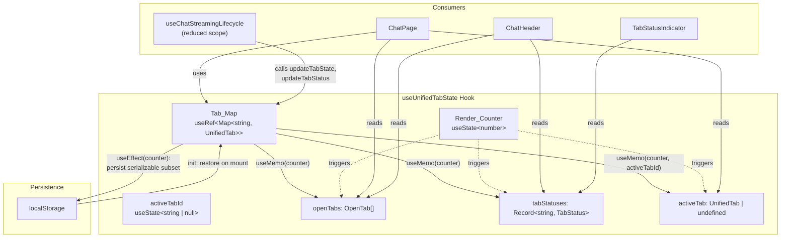
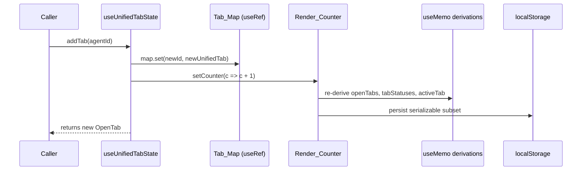
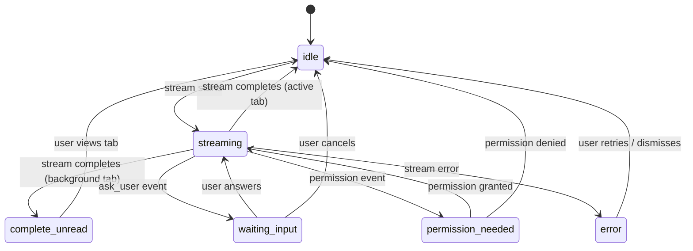

<!-- STALE REFERENCES: This spec references code that has since been refactored or removed:
- ContextPreviewPanel → REMOVED (was planned for future project detail view, never rendered in production)
- useTabState / tabStateRef / saveTabState → SUPERSEDED by useUnifiedTabState hook
- saveCurrentTab → REMOVED (was a no-op in useUnifiedTabState)
This spec is preserved as a historical record of the design decisions made at the time. -->

<!-- PE-REVIEWED -->
# Design Document: Unified Tab State

## Overview

This design consolidates the three separate tab state stores in the SwarmAI chat experience into a single `useUnifiedTabState` hook. Currently, tab state is spread across:

1. `useTabState` — tab CRUD operations + localStorage persistence (metadata: id, title, agentId, isNew, sessionId)
2. `tabStateRef` — per-tab runtime state map (messages, pendingQuestion, abortController, streamGen, etc.)
3. `tabStatuses` — per-tab lifecycle status for header indicators (idle, streaming, waiting_input, etc.)

Every tab operation must update all three in lockstep, creating drift risk and subtle bugs when stores fall out of sync. The unified hook replaces all three with a single `useRef<Map<string, UnifiedTab>>` backed by a `useState` re-render counter, deriving `openTabs` and `tabStatuses` views via `useMemo`.

### Design Rationale

- A `useRef<Map>` is chosen over `useState<Map>` because per-tab mutations (especially streaming message appends at high frequency) should not trigger re-renders. Only explicit counter increments cause re-renders.
- `useMemo` derived views keyed on the counter give consumers stable references between mutations, preventing unnecessary child re-renders.
- localStorage persistence is limited to the serializable subset to avoid storing transient runtime state (AbortControllers, message arrays that are session-scoped).
- localStorage writes are debounced and only triggered by metadata-changing mutations (addTab, closeTab, updateTabTitle, updateTabSessionId, setTabIsNew, removeInvalidTabs), not by runtime state updates (updateTabState, updateTabStatus) which fire at high frequency during streaming.
- Tab ordering follows Map insertion order. `closeTab` preserves relative order of remaining tabs; `addTab` appends to the end.

## Architecture



### Mutation Flow



## Components and Interfaces

### UnifiedTab Interface

The `UnifiedTab` type merges the current `OpenTab` metadata with the `TabState` runtime fields:

```typescript
import type { Message } from '../../types';
import type { PendingQuestion } from '../pages/chat/types';

/** Tab lifecycle status for header indicators. */
export type TabStatus =
  | 'idle'
  | 'streaming'
  | 'waiting_input'
  | 'permission_needed'
  | 'error'
  | 'complete_unread';

/** Combined metadata + runtime state for a single tab. */
export interface UnifiedTab {
  // --- Metadata (persisted to localStorage) ---
  id: string;
  title: string;
  agentId: string;
  isNew: boolean;
  sessionId?: string;

  // --- Runtime state (not persisted) ---
  messages: Message[];
  pendingQuestion: PendingQuestion | null;
  isStreaming: boolean;
  abortController: AbortController | null;
  streamGen: number;
  status: TabStatus;
}

/** Fields persisted to localStorage. */
export type SerializableTab = Pick<UnifiedTab, 'id' | 'title' | 'agentId' | 'isNew' | 'sessionId'>;
```

### Hook Return Interface

```typescript
export interface UseUnifiedTabStateReturn {
  // --- Derived views (stable between mutations) ---
  openTabs: OpenTab[];
  activeTabId: string | null;
  activeTab: UnifiedTab | undefined;
  tabStatuses: Record<string, TabStatus>;

  // --- Tab CRUD ---
  addTab: (agentId: string) => OpenTab | undefined;
  closeTab: (tabId: string) => void;
  selectTab: (tabId: string) => void;

  // --- Metadata updates ---
  updateTabTitle: (tabId: string, title: string) => void;
  updateTabSessionId: (tabId: string, sessionId: string) => void;
  setTabIsNew: (tabId: string, isNew: boolean) => void;

  // --- Runtime state ---
  getTabState: (tabId: string) => UnifiedTab | undefined;
  /** Patch type excludes `id` to prevent primary key corruption (key ≠ entry.id). */
  updateTabState: (tabId: string, patch: Partial<Omit<UnifiedTab, 'id'>>) => void;
  updateTabStatus: (tabId: string, status: TabStatus) => void;

  // --- Lifecycle ---
  saveCurrentTab: () => void;
  restoreTab: (tabId: string) => boolean;
  initTabState: (tabId: string, initialMessages?: Message[]) => void;
  cleanupTabState: (tabId: string) => void;

  // --- Cleanup ---
  removeInvalidTabs: (validSessionIds: Set<string>) => void;

  // --- Direct ref access (for stream handlers that need synchronous reads) ---
  tabMapRef: React.MutableRefObject<Map<string, UnifiedTab>>;
  activeTabIdRef: React.MutableRefObject<string | null>;
}
```

## Data Models

### UnifiedTab Default Factory

When creating a new tab (via `addTab` or auto-creation on last-tab close), the hook produces a `UnifiedTab` with these defaults:

| Field | Default Value |
|-------|--------------|
| `id` | `crypto.randomUUID()` |
| `title` | `'New Session'` |
| `agentId` | provided by caller |
| `isNew` | `true` |
| `sessionId` | `undefined` |
| `messages` | `[]` |
| `pendingQuestion` | `null` |
| `isStreaming` | `false` |
| `abortController` | `null` |
| `streamGen` | `0` |
| `status` | `'idle'` |

### localStorage Schema

Two keys are used (matching the existing `useTabState` keys for backward-compatible migration):

| Key | Type | Content |
|-----|------|---------|
| `swarmAI_openTabs` | `SerializableTab[]` | Array of `{ id, title, agentId, isNew, sessionId }` in insertion order |
| `swarmAI_activeTabId` | `string` | The `id` of the active tab |

On initialization, the hook reads these keys and hydrates the Tab_Map by merging persisted metadata with default runtime state values. If localStorage is empty, corrupt, or throws on read, the hook falls back to creating a single default "New Session" tab.

### Tab Status State Machine



### Persistence Strategy

localStorage writes are debounced and only triggered by metadata-changing mutations. The persistence effect:

1. Serializes only the `SerializableTab` fields from each entry in the Tab_Map
2. Writes to `swarmAI_openTabs` as a JSON array
3. Writes `activeTabId` to `swarmAI_activeTabId`
4. Catches and silently handles `localStorage.setItem` errors (e.g., quota exceeded) — the app continues functioning with in-memory state; persistence resumes on next successful write

Runtime state mutations (`updateTabState`, `updateTabStatus`) do NOT trigger localStorage writes since those fields are transient and session-scoped.

### Atomic Mutation Guarantee

All mutation methods (`addTab`, `closeTab`, `updateTabTitle`, etc.) perform their full set of Map operations before incrementing the Render_Counter exactly once. For example, `closeTab` on a streaming tab:
1. Calls `abortController.abort()` on the tab
2. Removes the tab from the Map
3. Updates `activeTabId` if the closed tab was active
4. Auto-creates a new tab if the Map is now empty
5. Increments the counter once — triggering a single re-render cycle

### Migration Path

The unified hook uses the same localStorage keys as the existing `useTabState`, so persisted tabs are automatically picked up on first load. The migration is:

1. **Phase 1**: Implement `useUnifiedTabState` alongside existing hooks. Wire it into `ChatPage`, removing `useTabState` import and `tabStateRef`/`tabStatuses` from `useChatStreamingLifecycle`.
2. **Phase 2**: Remove `useTabState.ts` file. Remove tab lifecycle methods and `tabStatuses` from `useChatStreamingLifecycle` return interface.
3. **Phase 3**: Update `ChatHeader`, `SessionTabBar`, and `TabStatusIndicator` to import `TabStatus` from the new hook module instead of `useChatStreamingLifecycle`.

No data migration script is needed — the localStorage format is identical.

## Correctness Properties

*A property is a characteristic or behavior that should hold true across all valid executions of a system — essentially, a formal statement about what the system should do. Properties serve as the bridge between human-readable specifications and machine-verifiable correctness guarantees.*

### Property 1: Tab Operation Invariants

*For any* sequence of tab operations (addTab, closeTab, selectTab, updateTabTitle, updateTabSessionId, setTabIsNew, updateTabState, updateTabStatus, removeInvalidTabs) applied to the unified hook starting from any valid initial state:
- The Tab_Map contains at least one tab after each operation
- The `activeTabId` references a tab that exists in the Tab_Map after each operation
- No two tabs share the same `id`
- The number of tabs does not exceed MAX_OPEN_TABS (6)

Edge cases covered: addTab at capacity returns undefined (2.3), closing the last tab auto-creates a new one (2.7, 10.5).

**Validates: Requirements 10.1, 10.2, 10.3, 10.4, 10.5, 2.3, 2.7**

### Property 2: Per-Tab State Isolation

*For any* pair of distinct tabs A and B in the Tab_Map, and *for any* valid patch applied via `updateTabState(A.id, patch)` or `updateTabStatus(A.id, status)`, all fields of tab B's entry remain unchanged after the operation.

**Validates: Requirements 8.1, 8.2, 8.3**

### Property 3: addTab Produces Correct Defaults

*For any* valid agentId string, when `addTab(agentId)` is called and the tab count is below MAX_OPEN_TABS, the returned tab has: a non-empty UUID `id`, title `"New Session"`, the provided `agentId`, `isNew` true, `sessionId` undefined, empty `messages` array, `pendingQuestion` null, `isStreaming` false, `abortController` null, `streamGen` 0, and `status` `"idle"`. Additionally, `activeTabId` equals the new tab's `id`.

**Validates: Requirements 2.1, 2.2**

### Property 4: closeTab Removes and Reselects

*For any* Tab_Map with two or more tabs, and *for any* tab T in the map, calling `closeTab(T.id)`:
- Removes T from the Tab_Map
- If T was the active tab, sets `activeTabId` to the adjacent tab (by insertion order, clamped to bounds)
- If T had a non-null `abortController`, the controller's `abort()` was invoked

**Validates: Requirements 2.4, 2.5, 2.6**

### Property 5: Metadata Updates Apply to Correct Tab

*For any* tab T in the Tab_Map and *for any* string value V:
- `updateTabTitle(T.id, V)` results in `getTabState(T.id).title === V`
- `updateTabSessionId(T.id, V)` results in `getTabState(T.id).sessionId === V`
- `setTabIsNew(T.id, bool)` results in `getTabState(T.id).isNew === bool`

And for any tabId not in the Tab_Map, these operations are no-ops (map unchanged).

**Validates: Requirements 3.1, 3.2, 3.3, 3.4**

### Property 6: localStorage Persistence Round-Trip

*For any* sequence of metadata-changing mutations applied to the hook, reading `localStorage.getItem('swarmAI_openTabs')` and parsing it as JSON produces an array of `SerializableTab` objects that matches the Tab_Map's serializable subset (id, title, agentId, isNew, sessionId) in insertion order. The parsed array never contains runtime state fields (messages, pendingQuestion, isStreaming, abortController, streamGen, status). Additionally, `localStorage.getItem('swarmAI_activeTabId')` equals the current `activeTabId`.

**Validates: Requirements 6.1, 6.2, 6.4, 6.6**

### Property 7: removeInvalidTabs Resets Stale Tabs

*For any* Tab_Map and *for any* set of valid session IDs, after calling `removeInvalidTabs(validSet)`:
- Every tab whose `sessionId` was defined and not in `validSet` now has `sessionId` undefined, `isNew` true, and `title` "New Session"
- Every tab whose `sessionId` was undefined or was in `validSet` is unchanged

**Validates: Requirements 7.1, 7.2**

## Error Handling

### localStorage Failures

| Scenario | Behavior |
|----------|----------|
| `localStorage.getItem` throws on init | Fall back to single default "New Session" tab. Log warning to console. |
| `localStorage.getItem` returns corrupt JSON | Same as above — `JSON.parse` catch creates default tab. |
| `localStorage.setItem` throws (quota exceeded) | Catch silently. In-memory state remains authoritative. Next successful write will persist current state. |
| Persisted `activeTabId` references non-existent tab | Fall back to first tab's `id` in the restored map. |
| Persisted tabs array is empty | Create single default "New Session" tab. |

### Mutation on Non-Existent Tab

All mutation methods (`updateTabTitle`, `updateTabSessionId`, `setTabIsNew`, `updateTabState`, `updateTabStatus`) perform a `Map.has(tabId)` guard before mutating. If the tab does not exist, the method returns immediately without incrementing the Render_Counter. This prevents phantom re-renders and keeps derived views stable.

### AbortController Cleanup

When `closeTab` or `cleanupTabState` is called on a tab with a non-null `abortController`:
1. The controller's `abort()` is called inside a try/catch to handle already-aborted controllers
2. The `abortController` field is set to `null` before removing the entry
3. The tab is then removed from the Map

This ensures no dangling abort references and no unhandled exceptions from double-abort.

### Race Conditions During Tab Switch

The `saveCurrentTab` → `selectTab` → `restoreTab` sequence is synchronous within a single React event handler tick. Since React batches state updates within event handlers, the sequence is atomic from the rendering perspective. Stream handlers that fire between renders read from the `tabMapRef` directly (not from derived state), so they always see the latest map state regardless of pending re-renders.

## Testing Strategy

### Property-Based Testing

The property-based testing library for this feature is **fast-check** (`fc` from the `fast-check` npm package), which is already available in the project's test dependencies.

Each correctness property from the design maps to a single property-based test. Tests use `fc.assert(fc.property(...))` with a minimum of 100 iterations per property.

**Test tag format**: Each test includes a comment referencing its design property:
```typescript
// Feature: unified-tab-state, Property 1: Tab Operation Invariants
```

#### Property Test Plan

| Property | Test Approach | Generator Strategy |
|----------|--------------|-------------------|
| 1: Tab Operation Invariants | Generate random sequences of operations (addTab, closeTab, selectTab, metadata updates). Apply each operation, assert all four invariants after every step. | `fc.array(fc.oneof(addTabArb, closeTabArb, selectTabArb, ...))` with shrinking |
| 2: Per-Tab State Isolation | Generate a map with 2+ tabs, pick tab A, generate a random patch, apply it, snapshot tab B before/after and deep-equal. | `fc.record(...)` for patch, `fc.nat()` for tab index selection |
| 3: addTab Defaults | Generate random agentId strings, call addTab, assert all default field values. | `fc.string()` for agentId |
| 4: closeTab Removes and Reselects | Generate maps with 2+ tabs, pick a tab to close (sometimes active, sometimes not), verify removal and reselection logic. | `fc.nat()` for tab index, `fc.boolean()` for whether to close active tab |
| 5: Metadata Updates | Generate random tab + random string values, apply each update method, verify only the target field changed. | `fc.string()` for values, `fc.boolean()` for isNew |
| 6: localStorage Round-Trip | Generate random tab configurations, trigger persistence, read back from localStorage mock, compare serializable subset. | `fc.array(serializableTabArb)` |
| 7: removeInvalidTabs | Generate tabs with random sessionIds, generate a random subset as "valid", call removeInvalidTabs, verify stale tabs are reset and valid tabs unchanged. | `fc.set(fc.uuid())` for valid IDs |

### Unit Testing

Unit tests complement property tests by covering specific examples and edge cases:

| Test Case | Type |
|-----------|------|
| addTab at MAX_OPEN_TABS returns undefined | Edge case |
| closeTab on last tab auto-creates new tab | Edge case |
| Initialization with empty localStorage creates default tab | Edge case |
| Initialization with stale activeTabId falls back to first tab | Edge case |
| updateTabState with non-existent tabId is a no-op | Edge case |
| removeInvalidTabs with no invalid tabs does not trigger re-render | Edge case |
| closeTab aborts streaming tab's controller | Specific example |
| selectTab updates activeTabId and derived activeTab | Specific example |
| Persistence excludes runtime fields from localStorage | Specific example |

### Test Configuration

- Property tests: minimum 100 iterations each (configurable via `fc.assert` `numRuns` parameter)
- Test runner: Vitest (`vitest --run` for single execution)
- Test file location: `desktop/src/hooks/__tests__/useUnifiedTabState.test.ts`
- React hook testing: `@testing-library/react` with `renderHook` for hook lifecycle
- localStorage mock: `vi.stubGlobal('localStorage', ...)` with in-memory Map backing
